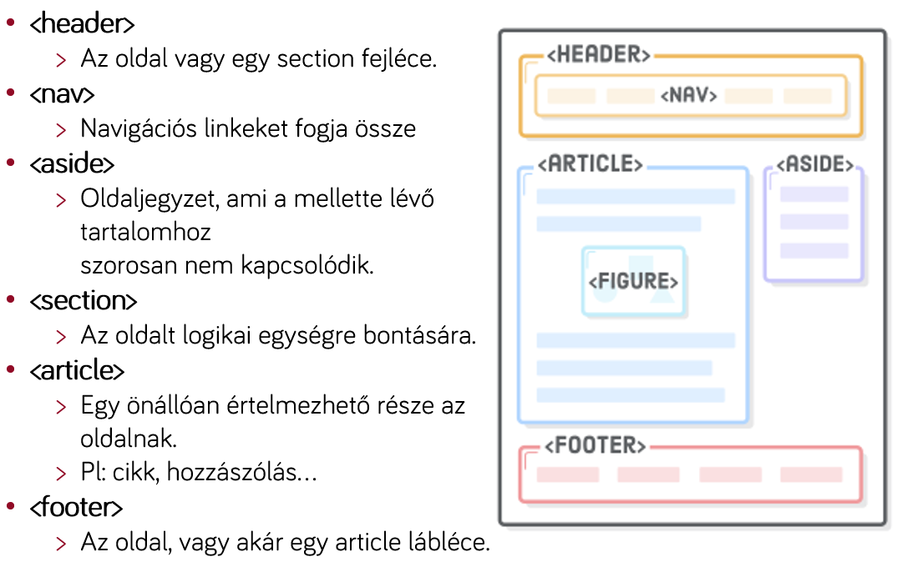

# Labor 08 - HTTP, HTML

[rep]: ./assets/rep.png "Dokumentálandó"

## Bevezetés

A labor folyamán a hallgatók a önállóan végeznek feladatokat a webes technológiák gyakorlati megismerése érdekében.

Felhasznált technológiák és eszközök:
- [Telerik Fiddler](https://www.telerik.com/download/fiddler),

- webböngészők beépített hibakereső eszközei,

- [Visual Studio Code](https://code.visualstudio.com/download) kódszerkesztő alkalmazás,
  - otthoni vagy egyéni munkavégzéshez használható bármilyen más kódszerkesztő vagy fejlesztőkörnyezet.

### Jegyzőkönyv

Az elkészült jegyzőkönyvet egy PDF formájában kell feltölteni a tárgy oldalán, a szükséges további erőforrásokkal 
(projekt, HTML, CSS, JavaScript fájlok) egy ZIP fájlba csomagolva. **Ügyeljen rá**, hogy a ZIP fájlba artifakt és külső 
függőség ne kerüljön (fordítás eredményeképpen előálló fájlok, pl. a **bin/obj és node_modules** mappák). A munkájára
kapott eredményét is itt fogja tudni megtekinteni. A jegyzőkönyv sablonja DOCX formátumban 
[innen](./downloads/Labor08-jegyzokonyv.docx) letölthető.

A jegyzőkönyvben csak a szükséges mértékű magyarázatot várjuk el. Ahol másképpen nincs jelezve, eredményközlés is 
elegendő. Képernyőképek bevágásához a Windows-ban található **Snipping Tool** eszköz használható, vagy az 
**Alt+PrtScr** billentyűkombinációval az aktuálisan fókuszált ablak teljes egésze másolható.

A _hiányos_ vagy _túl bőbeszédű_ megoldásokra vagy a teljes jegyzőkönyvre helyes megoldás esetén is pontlevonás adható!

A dokumentumban az alábbi módon van jelölve, hogy a jegyzőkönyvben dokumentálni szükséges egy-egy lépést:

---

### ![rep] Feladat 0 (0 pont)
Töltse ki a jegyzőkönyvben található szükséges adatokat: a nevét, Neptun kódját, a labor idejét és helyét. Ezeket az 
elkövetkezendő laboralkalmakon is ki kell majd töltenie.

---

## HTTP hibakeresés

Indítsuk el a Fiddler alkalmazást!

A Fiddler a Telerik cég ingyenes terméke, az egyik leggyakrabban használt webes hibakereső (debugger) eszköz. A Fiddler 
egy közbeékelődéses „támadást” (man in the middle attack) játszik el a gazda számítógépen azáltal, hogy proxy-ként 
viselkedik. A számítógépről kifelé induló HTTP kéréseinket elkapja, naplózza azokat feldolgozás és a felületen történő 
megjelenítés céljából, majd elküldi az eredeti címzett felé. Ugyanezt a sorozatot játssza el a visszairányban is, amikor
a gépünk a hálózatról kap adatot.

Ne zárjuk be a Fiddler alkalmazást! Indítsuk el a Windows beépített proxy beállító felületét!

Indítsuk el a Windows beépített proxy beállító felületét! A Windows billentyűt nyomjuk le, a Start menü megnyílása 
után gépeljük be: "proxy", és nyissuk meg a proxybeállításokat!

---

### ![rep] Feladat 1 (0.5 pont)
Másoljon be egy képernyőképet arról, hogyan módosítja a Fiddler a proxy beállításokat a Windows proxy beállításai között 
és a Telerik Fiddler Options > Connections fülön!
Milyen porton és milyen IP címen történik a proxy-zás?

---

Ha bezárjuk a Fiddlert, láthatjuk, hogy visszaállítja a proxybeállításokat a kiinduló állapotra. Indítsuk el ismét, hogy 
meg tudjuk vizsgálni a hálózati forgalmat!

A Fiddler futása közben indítsunk el egy böngészőt, és navigáljunk a www.aut.bme.hu címre! Tekintsük át a program felületét 
az így keletkező HTTP kérések alapján!

A Fiddler alapvető felépítése az alábbi:


> 1. HTTP kérések időrendi listája: itt látjuk, hogy milyen kéréseink mentek ki a hálózatra. A **protokoll** HTTP vagy 
HTTPS lehet, a **Result** a válaszüzenetben érkező HTTP **státuszkódot** jelzi. A **Body** mezőben láthatjuk, hogy a 
válasz hány bájt méretű volt. A bal oldali listában bármely **kérést** kiválasztva annak **részleteit jobb oldalon 
láthatjuk**. Jobb egér gombbal a lista elemein lehetőségünk van azok **újrajátszására**.
>    - Lehetőségünk van a listában aktív szűrő beállítására pl. alkalmazás (process ID) vagy host alapján.
> 2. A jobb oldali fülön alapértelmezés szerint az **Inspectors** fül van kiválasztva, ami az *aktuálisan kiválasztott* 
HTTP **kérés-válasz párost** részletezi. A **felső** panel a **kimenő kérés** panelje. A tabok során váltogatva az
üzenetet különböző **formázásokkal** is megvizsgálathatjuk, a fontosabbak:
>    - **Headers**: itt láthatjuk a HTTP fejléc legfontosabb elemeit, úgy mint a HTTP igét és protokollt, csoportokba 
szervezve a HTTP üzenet tartalmát.
>    - **TextView**: szöveges nézet.
>    - **WebForms**: űrlapok küldése esetén a paraméterek nevét és értékét tartalmazza.
>    - **Cookies**: a felküldött/fogadott sütik megjelenítése.
>    - **Raw**: a nyers HTTP üzenet megjelenítése.
>    - **JSON/XML**: az üzenet megjelenítése JSON/XML objektumokként (csak megfelelő formátum esetén).
> 3. A jobb oldali panelen az **Inspector**t választva az alsó részen a válaszból kinyerhető adatok találhatók meg, ezek 
jelentős része analóg a kérés formátumával és a Request panelen található adatokkal.
> 4. Egy fontos eszköz lehet még számunkra a **Composer**, amellyel teljes HTTP kérést tudunk összeállítani és elküldeni.

Elemezzük a böngésző által generált kéréseket!

A böngészőbe a weboldal címének beírása után egy HTTP kérés indult meg a www.aut.bme.hu szerver irányába. A Fiddlerben 
megvizsgálva következtetéseket vonhatunk le a kérés-válasz adatai alapján.

Az első kérés az általunk beírt webcímre került kiküldésre az alábbi formában:

``` HTTP
GET https://www.aut.bme.hu/ HTTP/1.1
Accept: text/html, application/xhtml+xml, image/jxr, */*
Accept-Language: en-US,en;q=0.7,hu;q=0.3
User-Agent: Mozilla/5.0 (Windows NT 10.0; Win64; x64) AppleWebKit/537.36 (KHTML, like Gecko) Chrome/52.0.2743.116 Safari/537.36 Edge/15.15063
Accept-Encoding: gzip, deflate
Host: www.aut.bme.hu
Connection: Keep-Alive

```

> - A kérés GET igét használt, ezért nem tartozik hozzá törzs (body) a küldött HTTP üzenetben.
> - A böngésző kulcs-érték párok formájában további adatokat küldött a szerver felé, mint pl. a böngészőt azonosító 
karakterláncot (**User-Agent**), a várt adat formátumát (**Accept**, **Accept-Encoding**), eltárolt sütiket (**Cookie**) 
stb.
>    - Érdekesség, hogy bizonyos kulcsok többször előfordulhatnak egy HTTP üzenetben, ekkor az összes ugyanolyan kulcshoz 
tartozó értékek egy kollekcióként/tömbként értelmezhetők.
> - A **HTTP üzenet egyszerű szöveges formátumú**, ember által is olvasható.
>- Az első elküldött üzenet után további HTTP kérések indultak el a stíluslapok (CSS), képek és szkriptek (JavaScript) 
letöltéséért. Ennek az az oka, hogy a böngésző felépíti a HTML oldalt, amiben a további linkek további HTTP kéréseket 
indukálnak.

A kérésünkre az alábbi válasz érkezett:
``` HTTP
HTTP/1.1 200 OK
Cache-Control: no-cache
Pragma: no-cache
Content-Type: text/html; charset=utf-8
Expires: -1
Vary: Accept-Encoding
Server: Microsoft-IIS/8.0
X-AspNet-Version: 4.0.30319
Set-Cookie: AaitC=3495d86d-2b52-4b73-b020-80eb90069465; path=/; HttpOnly
X-Powered-By: ASP.NET
X-Frame-Options: deny
Date: Wed, 18 Oct 2017 10:40:05 GMT
Content-Length: 26940

<!DOCTYPE html PUBLIC "-//W3C//DTD XHTML 1.0 Transitional//EN" "http://www.w3.org/TR/xhtml1/DTD/xhtml1-transitional.dtd">
<html>
<head>...</head>
<body>...</body>
</html>
```

-	A kérés sikeres volt, ezt a fejléc elején található státuszkódból és státusz üzenetéből látjuk.
-	A válasz formátuma megegyezik a kérés formátumával: üzenet címe, fejlécek kulcs-érték párokként, üres sor, és egy 
opcionális törzs.
-	A fejlécekben található fontosabb elemek a szerver típusa (Server), szerveridő (Date), a küldött adat típusa
(Content-Type) és mérete bájtban (Content-Length). Ezen kívül a szerver a Set-Cookie headerrel két sütit állít be a 
kliensen, ill. különböző fejlécekben definiálja a gyorsítótárazáshoz (cache) szükséges szabályokat.
-	A fejléceket egy üres sor követi, majd a HTTP üzenet törzse következik, ami egy HTML5 dokumentum.

---

### ![rep] Feladat 2 (1 pont)
Másoljon be egy képernyőképet a kérés-válasz párosról, amelyet a böngésző a www.aut.bme.hu címre küldött! A válasz és a 
kérés is nyers (Raw) formátumban legyen látható!
Válaszolja meg az alábbi kérdéseket:
- Milyen státuszkóddal válaszolt a szerver a kérésre?
- Hány bájt méretű volt a teljes HTTP kérés?
- Hány bájt méretű válasz érkezett a szervertől?

---

Vegyük észre, hogy a HTTP kérésünkhöz tartozó válasz kizárólag a korábban elküldött kérésünkben megtalálható információk 
alapján készült el! Ez jelenti azt, hogy **a HTTP állapotmentes**: az általunk elküldött kérés alapján kapjuk meg a 
választ, további állapoinformációkat nem feltételezhetünk a szerver részéről. Ez **nem összekeverendő azzal, hogy 
a szerver vagy kliens tárol-e állapotot vagy sem**: napjainkban mindkét oldalon tárolunk információt az állapotunkkal 
kapcsolatban, viszont a kérésben található meg minden olyan információ, ami alapján a szerver azonosítani tudja a kérőt és
a kérési igényt, ami alapján összeállítja a választ.

Állítsunk össze egy egyszerű HTTP kérést a Fiddlerből!

Navigáljunk a jobb oldali panelen a **Composer** fülre! Itt lehetőségünk van összeállítani egy HTTP üzenetet. A Parsed 
lehetőség kicsit szofisztikáltabb, nekünk most megfelelő lesz a **Raw** (nyers) összeállítás is. Küldjük el az alábbi HTTP
üzenetet és vizsgáljuk meg az erre érkező választ:

``` HTTP
GET http://www.aut.bme.hu/ HTTP/1.1


```

**Fontos**, hogy a fenti kérésben egy üres sor legyen a fejléc után, tehát két Entert is kell ütnünk.

---

### ![rep] Feladat 3 (0.5 pont)
Másolja be a nyers HTTP választ a fenti kérésre! 
    
Hány releváns választ látunk a Fiddlerben (tipp: ha beírja a böngészőbe a www.aut.bme.hu/ URL-t, akkor milyen URL-en töltődik 
be végül az oldal)?

---

A fenti kérésünk formailag helyes HTTP üzenet: csak a HTTP ige, cím, és protokoll megadása kötelező, az összes fejléc 
opcionális, a törzs GET kérésnél pedig nem szabványos.

Ha megvizsgáljuk a kérésünkre érkező válaszokat, és összehasonlítjuk a korábban a böngészőnek küldött válasszal, akkor 
láthatjuk, hogy nem igazán van érdemi különbség a két válasz között.

## Hibakereső eszközök

Weboldalak készítésekor szükség lehet a HTTP forgalom megvizsgálására, viszont az esetek jelentős részében elegendő lehet,
ha a böngésző forgalmát meg tudjuk vizsgálni. A mai böngészők mindegyike tartalmaz eszközöket, amellyel a weboldalak 
hibakeresése nagyon egyszerűen kezelhetővé válik.

A böngészők Inspector nézetét a böngészőben általában az **F12** billentyűvel nyithatjuk meg.

Vizsgáljuk meg, mit kínálnak a böngészőkbe épített hibakereső eszközök!

A laborvezető által kijelölt böngészőn navigáljunk a [www.aut.bme.hu](https://www.aut.bme.hu) oldalra és vizsgáljuk meg az
oldal felépítését! Nyissuk meg a hibakeresési eszköztárat az F12-vel, nézzük meg, milyen lehetőségeink vannak! 


A Chrome, Internet Explorer, Edge és Firefox böngészők eszközkészlete kisebb eltérésektől eltekintve megegyezik, 
a leggyakoribb funkciók az alábbiak:
- A dokkolás módja megadható: az ablak alsó részére vagy oldalára is (Chrome, Firefox) dokkolható az eszköztár, ill. 
kivehető a saját ablakába.
- **DOM vizsgálata (DOM Explorer, Elements, Inspector)**: a dokumentumfa felépítését tudjuk megvizsgálni, látható a 
kirajzolt HTML tartalom. Lehetőségünk van szerkeszteni az elemeket, beszúrni attribútumokat, elemeket, törölni őket. 
Kiválasztható egy DOM elem egérrel a kirajzolt oldalon vagy a szöveges megjelenítőben is. Egy elemet kiválasztva jobb 
oldalon az elemre illeszkedő stíluslap-szabályok (CSS) láthatók, ezek is szerkeszthetők.
- **JavaScript konzol (Console)**: a JavaScript standard outputja a konzol, az alkalmazások által írt tartalmak itt 
láthatók. Lehetőségünk van kód futtatására is a konzol ablakban, ami azonnal kiértékelődik.
- **Hálózat (Network)**: a Fiddlerhez hasonlóan láthatjuk a kimenő kéréseket és a rájuk érkező válaszokat. Előnye, hogy
csak a konkrét oldalhoz tartozik, nem a teljes böngészőhöz, így könnyebb leszűrnünk, melyik kérések tartoznak melyik 
alkalmazáshoz/oldalhoz. Láthatók a pontos időzítések is, HTTP kérések indítását viszont nem lehetséges kézzel megejtenünk 
a beépített lehetőségekkel.
- **Hibakereső (Debugger)**: az oldalhoz betöltött JavaScript forráskód hibakeresését teszi lehetővé.
- **Teljesítménymérők**: különböző teljesítménymérő eszközök állnak rendelkezésünkre a weboldalak elemzéséhez, amik 
jellemzően a memória- és processzorhasználatot mérik.
- **Emuláció**: a böngészőkbe épített emulációs lehetőségek korlátozottak, általában csak a user agent string cseréjét és
a kirajzoló terület felbontását állítják át (magát a böngészőmotort természetesen nem cserélik le futási időben, ami a 
valódi hibák jelentős részéért felelős).

## Szemantikus HTML

A HTML (HyperText Markup Language) a web nyelve. A böngészők elsősorban HTTP-n keresztül eljuttatott HTML tartalom 
kirajzolásáért és feldolgozásáért felelősek.

A HTML egy XML-szerű nyelv, amelyben elemek (tag) írják le a dokumentumunkat. Az egyes elemeknek lehetnek tulajdonságai, 
amiket attribútumoknak (attribute) nevezünk. Az attribútum értéke leggyakrabban szám, szöveg, korlátozott értékkészletű 
szöveg (enumeráció), ritkábban felsorolás vagy objektum lehet. A HTML-ben bizonyos szabályrendszernek kell eleget tennünk: 
megkötések vonatkoznak arra, hogy milyen jellegű elemeket milyen más elemekben helyezhetünk el.

A szemantikus web alapelve, hogy a HTML elemeink ne csak klasszikus "tároló" funkcionalitást lássanak el, hanem jelentést 
is hordozzanak. Előnye kettős: gépi és emberi feldolgozása egyaránt egyszerűbb.

**Fontos**, hogy a HTML-ben vétett esetleges hibák **csendes** hibák, az esetleges hibás elhelyezések vagy helytelen 
formázás/szintaxis következtében a böngésző meg fogja jeleníteni az oldalt, amennyire a HTML alapján azt meg tudja tenni.
Egy lemaradt `</lezáró tag>` pl. nem minden esetben rontja el a HTML oldal kinézetét, de okozhat nemkívánatos 
mellékhatásokat.



Forrás: https://internetingishard.com/html-and-css/semantic-html/

Nézzük meg, miként javítja a HTML szemantikus felépítése az alkalmazásunkat!

1. A laborvezető által kijelölt elérési útvonalon hozzunk létre egy új munkakönyvtárat, amiben nyissuk meg a VS Code 
szerkesztőt! Hozzunk létre itt egy fájlt, a neve legyen `index.html`, tartalma az alábbi:

```HTML
<!doctype html>
<html>

<head>
	<meta charset="utf-8">
	<title>Example</title>
</head>

<body>
<div>
	<div>
		
	</div>
	<div>
		<a href="index.html">Főoldal</a>
		<a href="services.html">Szolgáltatások</a>
		<a href="contact.html">Kapcsolat</a>
		<a href="about.html">Rólunk</a>
	</div>
</div>
<div>
	<div>
		<h1>Webes technológiákról általában</h1>
		<p>A HTTP, HTML, CSS és JavaScript adják napjaink legfontosabb...</p>
		<div>
			<h2>HTTP</h2>
			<p>A HTTP egyszerű átviteli protokoll...</p>
		</div>
		<div>
			<h2>HTML</h2>
			<p>A HTML (HyperText Markup Language)...</p>
		</div>
		<div>
			<h2>CSS</h2>
			<p>HTML oldalaink kinézetét ún. egymásba ágyazható stíluslapokkal (CSS)...</p>
		</div>
	</div>
	<div>
		<h2>JavaScript</h2>
		<p>A statikus HTML oldalakhoz dinamikus működést JavaScript segítségével...</p>
	</div>
	<div>
		<p>3032 ember látta ezt a cikket</p>
		<p>Szerző: John Doe</p>
		<div>
			
			
			
			<div>Ők kedvelték a cikket</div>
		</div>
	</div>
</div>
<div>
	Minden jog fenntartva | 2018 | BME AUT
</div>
</body>

</html>
```

A kód jól értelmezhető, az egyes elemek nyitó és záró tag-je között találhatók a hozzárendelt gyerekelemek. A whitespace-ek,
behúzások csak az olvashatóságot segítik.

2. Nyissuk meg VS Code-ban a Terminalt (Ctrl+ö, vagy View > Terminal), ami egy beépített Powershell futtatókörnyezetet ad. 
Itt adjuk ki az alábbi parancsot:
    http-server

    2.1. A laborgépeken elérhető a [http-server](https://www.npmjs.com/package/http-server) csomag, ami egy nagyon egyszerű
kiszolgáló. Ha a gépén nincsen telepítve a http-server, azt az ```npm install -g http-server``` paranccsal lehet telepíteni.
Az npm parancs futtatásához telepített NodeJS-re is szükség van.

3. Navigáljunk a böngészőben a http://localhost:8080/ URL-re, és teszteljük le, mit látunk!

4. Láthatjuk, hogy a szövegek formázását nem a whitespace-ek, hanem az elemek típusa adja. Ha szeretnénk látni, melyik elem
hol helyezkedik el a felületen ill. a DOM-ban, az F12 eszköztáron, a DOM Explorer felső során levő ikonokkal 
változtathatjuk, hogy a felületen navigálva a DOM elem kijelölődjön-e, ill. a DOM-ban navigálva a felületen jelezve 
legyen-e a kiválasztott elem. 

4. Az alapértelmezett formázást a böngészők beépítetten adják, ezért nagyobbak az egyes címsor (`<h1>`, `<h2>`) mezők, ill.
ezért törik a `<div>` (ami blockszintű elem), és marad folyószöveg a `<span>` (ami inline).

5. A beépített stílusokat megvizsgálhatjuk egy elemet kijelölve a jobb oldali panel Computed fülén az ábrán jelölt ikonra
kattintva (ne legyen engedélyezve a 'Display user styles only' lehetőség).


Forrás: https://internetingishard.com/html-and-css/semantic-html/

---

### ![rep] Feladat 4 (1.5 pont)

Módosítsa a HTML dokumentum tartalmát úgy, hogy szemantikus elemeket használ a nemszemantikus (pl. div) elemek helyett!
A szükséges elemek: `article`, `aside`, `figure`, `figcaption`, `footer`, `header`, `main`, `nav`, `section`

Szemléltesse az így elkészült dokumentum részletes szemantikus körvonalát! Az alábbi linken megadhatja az elkészült 
index.html fájlt, az így készült outline-ról készített képernyőképet másolja a jegyzőkönyvbe!
https://hoyois.github.io/html5outliner/

---

## HTML űrlapok

A HTML űrlapok egységes, megszokott adatbeviteli eszközként szolgálnak számunkra a felhasználóval való kommunikációra. 

---

### ![rep] Feladat 5 (1.5 pont)
Az előadáson elhangzottak gyakorlásaként állítson össze egy űrlapot, mely megfelel az alábbi feltételeknek:
- Az űrlap az alábbi adatokat kéri be a felületen a felhasználótól (a *-gal jelölt mezők kötelezően kitöltendők):
    - Név*: szöveges mező
    - Jelszó*: jelszó mező (nem látható karakterek – használd a "mobweb" jelszót szemléltetésre)
    - Leírás: szöveges mező, többsoros
    - Születési dátum*: dátum
    - Nem: fiú/lány/egyéb, legördülő menüből
    - Lábméret: szám, 0.5-ös léptékkel
    - Kutya: igen/nem, jelölőnégyzettel megadható
- Minden mezőhöz tartozzon egy címke is, amely tőle balra helyezkedjen el! A címkére kattintva a fókusz kerüljön a releváns
mezőbe (használja az `id` és `for` attribútumokat)! Az egyes mezők egymás alatt helyezkedjenek el!
- Legyen egy Küldés feliratú gomb, amely az adatokat a saját szerverünknek küldi a /postform.html URL-re, ahol egy egyszerű
oldal jelenjen meg a kérés hatására!
- Készítsen képernyőképet tetszőleges böngészőben a teljesen kitöltött űrlapról, amin pontosan egy validációs hiba 
található!
- Demonstrálja Fiddlerrel és a böngésző Network fülének segítségével az űrlapadatok elküldésének tényét GET és POST igék 
használatával is! Mi a különbség az adatok küldésében GET és a POST használatakor (a HTTP kérés melyik részében utazik az
adat)?

**Tipp:**

Szükséges elemek: `form`, `input`, `label`, `option`, `select`, `textarea`. 

Szükséges attribútumok: `action`, `for`, `id`, `method`, `name`, `required`, `step`, `type`, `value`.

---
