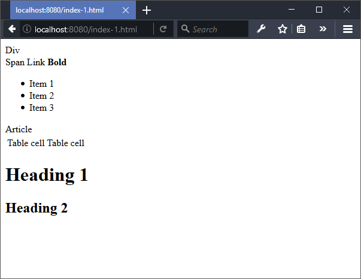
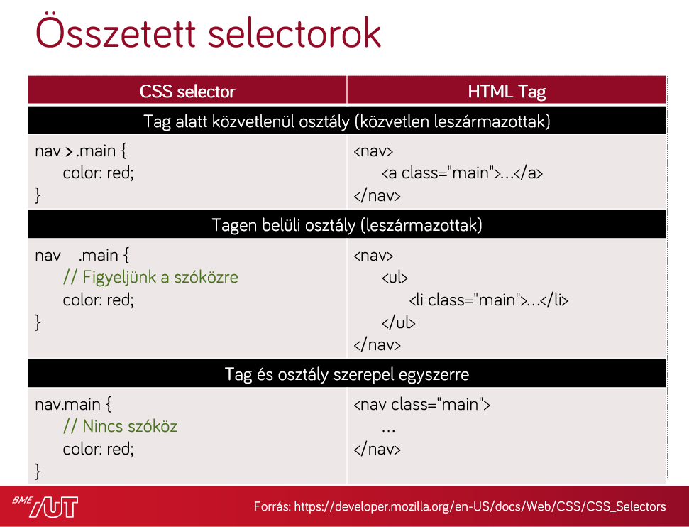
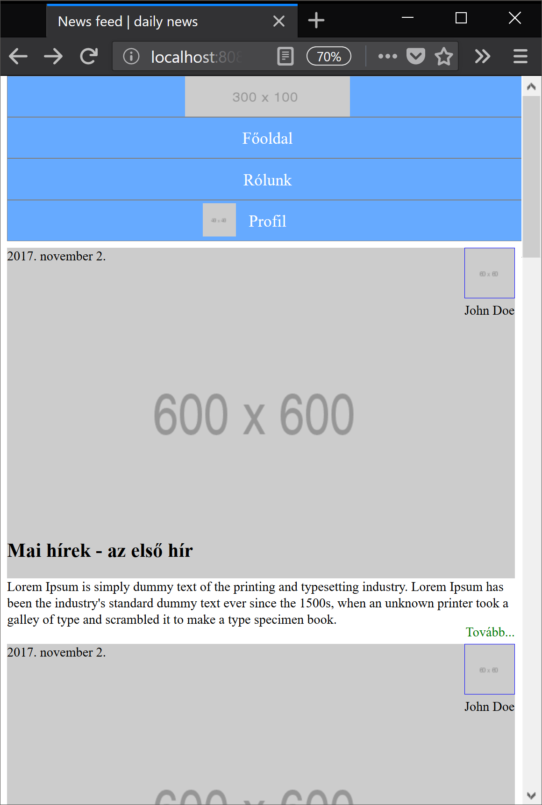
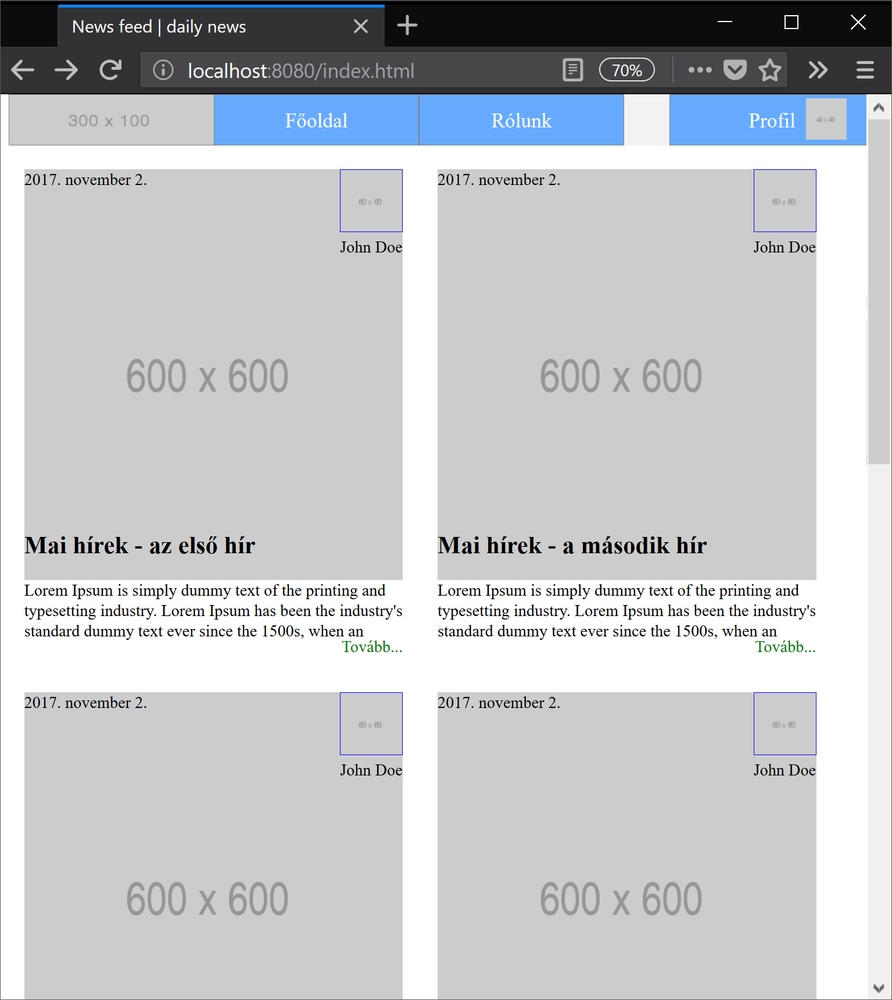

# Labor 09 - CSS

[rep]: ./assets/rep.png "Dokumentálandó"

## 1 Bevezetés

A labor folyamán a hallgatók a laborvezető segítségével önállóan végeznek feladatokat a webes technológiák gyakorlati megismerése érdekében. A labor kezdetén a laborvezetővel közösen bemelegítő-, később önálló feladatokat oldanak meg.

Felhasznált technológiák és eszközök:

- webböngészők beépített hibakereső eszközei,

- Visual Studio Code kódszerkesztő alkalmazás.

## 2 Jegyzőkönyv

Az elkészült jegyzőkönyvet egy PDF formájában kell feltölteni a tárgy oldalán, a szükséges további erőforrásokkal (projekt, HTML, CSS, JavaScript fájlok) egy ZIP fájlba csomagolva. Ügyeljen rá, hogy a ZIP fájlba artifakt ne kerüljön (fordítás eredményeképpen előálló fájlok, pl. a bin/obj mappa tartalma). Az eredmények is itt lesznek. A jegyzőkönyv sablonja DOCX formátumban <a href="./downloads/Labor09-jegyzokonyv.docx" target="_blank">innen</a> letölthető.

A jegyzőkönyvben csak a szükséges mértékű magyarázatot várjuk el. Ahol másképpen nincs jelezve, eredményközlés is elegendő. Képernyőképek bevágásához a Windows-ban található **Snipping Tool** eszköz használható, vagy az **Alt+PrtScr** billentyűkombinációval az aktuálisan fókuszált ablak teljes egésze másolható.

A _hiányos_ vagy _túl bőbeszédű_ megoldásokra vagy a teljes jegyzőkönyvre helyes megoldás esetén is pontlevonás adható!

A laborvezető jelen dokumentum alapján vezeti végig a labort. A dokumentumban az alábbi módon van jelölve, hogy a jegyzőkönyvben dokumentálni szükséges egy-egy lépést:

---

### ![rep] Feladat 0 (0 pont)
    
    Töltse ki a jegyzőkönyvben található szükséges adatokat: a nevét, Neptun kódját, a labor idejét és helyét.

---

## 3 Laborfeladatok

Webes HTML tartalmak stílusozására CSS-t használunk. A CSS alapjai:
- szabály (mintaillesztés) alapú, deklaratív programozási nyelv,
- DOM elemekhez megjelenést rendel.

A böngészőben megjelenített HTML tartalmak alapértelmezés szerint formázatlanok, viszont bizonyos szabályokat a böngésző alapértelmezetten illeszt az egyes elemekre, az elem típusa szerint.

    Vizsgáljuk meg, milyen szabályokat illeszt a böngésző a HTML, a BODY, a DIV, a SPAN, a H1, H2, az A és a B elemekre!

- Nyissuk meg a Visual Studio Code-ot egy üres munkamappában!
- Vegyünk fel egy index-1.html fájlt az alábbi tartalommal:

    ``` HTML
    <!DOCTYPE html>
    <html lang="en">
    <head>
    </head>
    <body>
        <div>Div</div>
        <span>Span</span>
        <a>Link</a>
        <b>Bold</b>
        <ul>
            <li>Item 1</li>
            <li>Item 2</li>
            <li>Item 3</li>
        </ul>
        <article>Article</article>
        <table>
            <tbody>
                <tr>
                    <td>Table cell</td>
                    <td>Table cell</td>
                </tr>
            </tbody>
        </table>
        <h1>Heading 1</h1>
        <h2>Heading 2</h2>
    </body>
    </html>
    ```
- Szükségünk lesz egy webszerverre, ami ki tudja szolgálni nekünk a fájlokat. Most nem készítünk saját webszervert, hanem használhatunk létező szervereket. Egy nagyon gyors megoldás, ha `npm`-ből telepítünk egyet és elindítjuk.
    - Futtassuk az alábbi parancsokat a Terminal (**Ctrl+ö** vagy **View > Integrated Terminal**) ablakból (az első parancs telepíti, a második elindítja a `http-server` nevű npm csomagot): 

        `npm i http-server`

        `.\node_modules\.bin\http-server`

        Ez elindít nekünk egy egyszerű HTTP szervert a gép 8080-as portján (http://localhost:8080/), ahonnan egyszerűen ki tudjuk szolgálni a mappában levő fájlokat, ill. index.html fájl hiányában egy fájllistázó főoldalt kapunk.

    - Navigáljunk a http://localhost:8080/ URL-re a böngészőben! Nyissuk meg az itt látható **index-1.html** fájlt! Az alábbit kell látnunk:
    

Vegyük észre, hogy az oldalhoz nem vettünk fel saját stíluslapot, valamilyen formázás mégis érvényesült. Egyes elemek félkövérek, kisebbek-nagyobbak, elrendezésük sorfolytonos vagy tördelt.
 
Vizsgáljuk meg, milyen szabályok érvényesülnek az egyes elemekre!

Nyissuk meg a böngésző beépített fejlesztői eszközeit (**F12**)! Lehetőségünk van az elemeket kijelölni (**Jobb klikk** > **Inspect Element**), megnézni elhelyezkedésüket a felületen és a DOM szöveges reprezentációjában egyaránt.


Jellemzően a menüsor bal oldalán találhatók a kijelöléshez szükséges műveletek ikonjai, jobb oldalon a részletes nézet.

A kiválasztott elemhez a jobb oldali **Computed** fülön a ténylegesen érvényre lépett szabályokat láthatjuk. Mivel nincs explicit CSS fájlunk linkelve és CSS szabályokat sem írtunk a HTML-ben, ezért kizárólag a böngésző beépített **user agent stylesheet**-je érvényesül. Itt láthatjuk a **CSS Box model**t is, ami az elem **tartalma**, a hozzá tartozó **padding**, **border** és **margin** értékek egymásra halmozását jelenti a *2 dimenziós téglalap* oldalaihoz mérten.

> A CSS feloldásában a `cascading`, azaz "egymásba ágyazható" rész szerint több stíluslap létezik a származás szempontjából; mi most a *böngészőbe beépített*, ún. `user agent stylesheet`-et látjuk.

Ez alapértelmezetten nem látható a felületen, a Computed fülön van lehetőségünk ezek megtekintését bekapcsolni:


A fenti szűrőt használva van lehetősünk az alkalmazott CSS szabályok között keresni.

A **h1**, **h2** és **b** elemek alapértelmezetten félkövérek, ezt a `font-weight: 700;` tulajdonság írja le nekünk.

A **html**, **body**, **div**, **h1**, **h2** elemek `display` tulajdonsága `block`, a **span**, **a** és **b** elemek pedig `inline` típusúak. A `display: block;` tulajdonságú elemek egy blokkot (sort) foglalnak el az őket befoglaló elemben, az inline típusúak sorfolytonosak (egymás mellett is elhelyezkedhetnek).

Láthatjuk, hogy a `body` elemen található `8px` margó (`margin`) mind a 4 irányban:


---

### ![rep] Feladat 1 (0.5 pont)

    Szövegesen és egy-egy képernyőképpel alátámasztva válaszolja meg az alábbi kérdéseket:

- Mekkora a **margin**, **padding** és **border** értéke az `<ul>` elemnek?

- Hány pixel a (függőleges) távolság a `<h1>` és `<h2>` elemek tartalma között (ügyelve az átfedő margókra)? 

---

> ## Emlékeztető a CSS szabályok definiálásához:
> 
> Saját CSS szabályokat többféle módon tudunk az oldalunkhoz rendelni:
> 
> - CSS fájlokra történő hivatkozással,
> - CSS szabályok felvételével a HTML tartalmán belüli `<style>` tagben,
> - inline, a HTML elemek `style` attribútumának beállításával.
> 
> Ütköző CSS szabályok közül az érvényesül, amelynek nagyobb a specificitása (megegyező specificitás esetében az utoljára definiált).
> 
> Emlékeztetőként a szabályok specificitási sorrendje:
> - inline stílus (`<div style="..."> `),
> - ID-k száma (`#azonosito`),
> - osztályok, attribútumok és pszeudo-osztályok száma (`.osztaly`, `[attributum]`, `[attributum="ertek"]`, `:hover`),
> - pszeudo-elemek (`:before`, `:after`).
> 
> A sorrendhez hozzátartozik az `!important` kulcsszó, ami önmagában a fentiektől specifikusabb, viszont az `!important` szabályokra a fenti specificitási sorrend szintén érvényesül.
>
> A szabályok definiálása:
>
> 
> 

    Módosítsuk az oldal megjelenését futási időben!
    
- Rejtsük el a böngésző beépített stílusait, és láthatjuk, hogy kizárólag az üres inline stílus illeszkedik így az elemre. Itt hozzá tudunk adni új inline stílust az elemhez.
- Ha új szabályt akarunk felvenni, akkor a kapcsoszárójelek közé kattintva tehetjük ezt meg, ezután az automatikus kiegészítés funkcióval láthatjuk az összes, a böngésző által ismert CSS tulajdonságot (Firefox Developerben ezt az üres kurzoron a **fel-le nyilak**kal tehetjük meg, Edge-ben és Chrome-ban a **Ctrl+szóköz**zel).
- Vegyük fel a `<h1>` elemhez az alábbi CSS tulajdonságot:
    ``` CSS
    color: red;
    ```
- Közben vegyük észre a DOM reprezentációban, hogy bár a jobb oldali panelen szerkesztünk, pontosan ugyanaz történik, mintha a HTML elem `style` attribútumát adtuk volna meg.

- Ha beállítjuk a `font-weight: bold;` tulajdonságot a `<body>`-n, akkor láthatjuk, hogy az összes gyermekére is érvényesül a szabály. Bizonyos szabályok öröklődnek (a `font-weight` ilyen), mások (például a `padding` és `margin`) viszont nem.

Lehetőség van esetenként több szabály aggregált megadására is ún. shorthandek használatával. Gyakori például a 4-irányú értékadás, ami a **top-right-bottom-left** iránysorrend szerint ad meg több értéket.
- A `padding: 50px 30px 10px 5px;` szabály mind a négy értéket beállítja a fenti sorrend szerint.
- A `padding: 10% 1mm;` szabály a fenti-lenti értékeket 10%-ra, a jobb-balt 1 mm-re (a padding-top).
    > A százalékos értékek a szülő elem *szélességéhez* viszonyítottak (ha `padding-top`-ot vagy `margin-bottom`-ot adunk meg, akkor is szélességhez).
- A `padding: 0;` mind a 4 oldalon 0-ra állítja a paddingot (nem szükséges mértékegység 0 esetén).

> Inline stílusokat csak kivételes esetekben használjunk, jellemzően programozottan (JavaScriptből) elfogadott lehet egy elem megjelenését ilyen módon állítani, de a nyers HTML-ben nem!

Az oldalhoz alapvetően kétféle módon van lehetőségünk stíluslapot rendelni: külső CSS fájlból vagy az oldalban definiált `<style>` tagben.

    Az index-1.html forráskódját egészítsük ki, a <head> elembe helyezzük el az alábbi kódot:

```HTML
<style>
    ul {
        list-style: none;
        padding: 0;
    }

    ul > li {
        float: left;
        padding: 10px;
        min-width: 200px;
        border: 1px solid grey;
    }
</style>
```

Ha frissítjük az oldalt (nem szükséges újraindítani a szervert, csak menteni a fájlt), akkor az elrendezés módosul: a listánkban a listaelemek egymás mellé kerülnek, és a listaelemet jelző pötty eltűnik.

> A `float: left;` tulajdonság állításával nem ugyanazt érjük el, mintha a listaelemet `display: inline-block;`-ra állítanánk, mert az `inline-block` megtartja az egymást követő elemek közötti whitespace-eket, a `float: left;` viszont nem.

A float segítségével komplexebb elrendezéseket is el tudunk érni, viszont a float-olást meg kell tudnunk szüntetni. Ehhez a `clear: both;` értéket állíthatjuk be egy elemen.

Az alábbi szabályt használhatjuk a float-olás megszüntetéséhez, ekkor az `<article>` elemre a `clearfix` osztályt alkalmazva az már új sorba is kerül.

```CSS
.clearfix {
    clear: both;
}
```
``` HTML
<article class="clearfix">
  <!-- ... -->
</article>
```

A CSS szabályainknak az esetek nagy többségében nem tesz jót, ha túl általánosak. A fenti szabályok minden listaelemre általánosan illeszkedni fognak, ami ebben a konkrét esetben nem jó döntés, ugyanis valahol az oldal törzsében lehet, hogy szeretnénk használni a "klasszikus" listás megjelenítést is. Ezért a szabályunkat át kell gondolnunk, specifikusabb szabályt érdemes írni:

``` CSS
ul.menu {
    list-style: none;
    padding: 0;
}

ul.menu > li {
    float: left;
    padding: 10px;
    min-width: 200px;
    border: 1px solid grey;
}
```

A fenti osztállyal megkülönböztettük a `menu` osztállyal ellátott `ul` elemeket azoktól, amiken nincs rajta az osztály.

A pszeudoosztályok használatával az elemek különböző állapotainak különböző stílust tudunk adni. Ha a listaelemek kijelölése a felhasználó számára speciális állapot, ezt érdemes jeleznünk a felületen. Használjuk az alábbi szabályt:

``` CSS
ul.menu > li:focus {
    font-weight: bold;
    color: #44AA44;
}
```

Önmagában a `focus` pszeudoosztály használata nem elegendő, ugyanis a li elem nem fókuszálható. A `<li>` elemen elhelyezett tabindex attribútum jelzi a böngészőnek, hogy az elem képes fókuszt kapni:

``` HTML
<ul class="menu">
    <li tabindex="1">Item 1</li>
    <li tabindex="2">Item 2</li>
    <li tabindex="3">Item 3</li>
</ul>
```

Ezután lehetséges az egér kattintással vagy a Tab billentyű használatával kijelölni az elemet.

A HTML-be ágyazott CSS-sel a probléma, hogy ugyanaz a stílus nem újrahasznosítható a különböző oldalaink között. Ezért érdemes kiszervezni a CSS tartalmainkat a saját dedikált CSS fájljainkba. A CSS tartalmát mozgassuk át a HTML `<head>` részéből egy új fájlba az **index-1.html** mellett, legyen a neve **index-1.css**.

A fájlt a HTML-ből az alábbi módon tudjuk linkelni: tegyük az oldal `<head>` részébe (a korábbi oldalon belüli stílus-definiíciók helyére) az alábbi hivatkozást:

``` HTML
<link rel="stylesheet" type="text/css" href="index-1.css">
```

---

### ![rep] Feladat 2 (0.5 pont)

    Képernyőképpel demonstrálja, hogy:

    - Az index-1.html letöltődését követően az index-1.css fájl is letöltődik.
    - Az `<ul>` lista elemei egymás mellett helyezkednek el. Ehhez a HTML-t módosítani szükséges.
    - Az egyik listaelem kijelölt állapotában a betűszín zöld lesz, a karakterek félkövérek.

    Milyen módosítást kell végeznünk a HTML-en, hogy az elvárt megjelenést lássuk?

---

### Reszponzív elrendezés

A weboldalakat különböző képernyőméretű- és felbontású eszközökről szoktuk látogatni. A túl részletes táblázatok, hosszú, meg nem törő sorok nem felhasználóbarátak kisebb méretű kijelzőkön, még ha az eszköz felbontása kellően nagy is. A mobil eszközök ezért szorzókat alkalmaznak a valós és a hasznos felbontás közötti megkülönböztetésképpen.

A reszponzív elrendezés során a legfontosabb koncepciók közé tartozik a szélesség függvényében történő átméretezése az oldalnak. Ezeket az alábbi szintaxis alapján, ún. media query-kkel tudjuk implementálni:

``` CSS

.medium-only {
    display: none;
}

@media (min-width: 768px) and (max-width: 991px) {
    .medium-only {
        display: block;
    }
}

```

A fenti szabály 768 és 991 pixel közötti szélességű viewport-on jelenik meg, tehát nem a képernyő mérete, hanem a rendelkezésre álló hely függvényében változik (pl. ablak átméretezésekor is). A `medium-only` osztállyal ellátott elemek csak ilyen képernyőméreten jelennek meg, ugyanis a media query szabály specifikusabb, mint az azon kívül definiált.

Próbáljuk ki, mi történik, hogyha a két szabály sorrendjét felcseréljük!

---

### ![rep] Feladat 3 (0.5 pont)

    Képernyőképekkel demonstrálja, hogy a fenti szabályt tetszőleges elemekre alkalmazva azok az ablak méretének függvényében láthatók vagy el vannak rejtve!

---

## A CSS alapok gyakorlásaképp az alábbi feladatokat önállóan oldja meg!

---

### ![rep] Feladat 4 (3.5 pont)

    Készítsen egyszerű statikus weboldalt! Igyekezzen megközelíteni a csatolt képeken látható tartalmat, elrendezést és megjelenést! 
    Kiindulásképpen felhasználhatja a csatolt HTML fájlt.
    Az elkészült funkciókról készítsen képernyőképet! A PDF formátumú jegyzőkönyv mellé csomagolja a forrásfájlokat is (kivéve a node_modules mappát) egy ZIP fájlban!

A kiinduláshoz használható HTML fájl [itt](./downloads/index.html) található.





Nem alkalmazhat inline stílusokat!

#### Fejléc (2 pont)

Az oldalon fix fejléc található (tehát a fejléc nem tűnik el, ha kigörgetünk a tartalomból). Ügyeljen rá, hogy a fejléc ne takarja ki az oldal központi tartalmát! A fejlécen az alkalmazás **logó**ja helyezkedik el (használja a https://placeholder.com/ oldalt helyőrző kép beillesztéséhez), melyre kattintva az `index.html` oldalra navigál a böngésző. 

A logó mellett egy 3 elemből álló **menüsor** található, ahol az elemek átnavigálnak rendre az `index.html`, `contact.html` és `profile.html` oldalakra az aktuális oldalról, megnevezésük: *Főoldal*, *Kapcsolat* és *Profil* (ezeket az oldalakat nem kell elkészítenie)!
- A menüsort `<ul>` és `<li>` elemek használatával strukturálja! 
- A menüpontok mérete fixen 200x50px, a félkövér szöveg függőlegesen és vízszintesen is középen helyezkedik el a menüpontban. A szöveg legyen nagyobb, mint az oldal alapértelmezett törzshöz tartozó szövegmérete!
- A menüpontok háttérszíne világoskék, előtérszíne fehér, az egeret a menüpontra helyezve (használja a `:hover` pszeudoclasst) a háttérszín valamelyest sötétebbé válik.
- A Profil menüpontban egy 40x40 px méretű **profilkép** is helyet foglal a szövegtől *balra*, és ez az utolsó menüpont az oldal jobb oldalán helyezkedik el (használja a `float` tulajdonságot vagy a `position: absolute` értéket).
- A menüsor 769 pixel alatti oldalszélességnél átalakul: a menüpontok egymás alatt helyezkednek el teljes szélességben, a profilkép pedig átkerül a *Profil* szöveg jobb oldalára!
- Ügyeljen rá, hogy görgetéskor a tartalom ne takarja ki a menüsort!

#### Hírfolyam (1.5 pont)

A kezdőoldalon egyszerű hírfolyam található. A hírfolyam bejegyzések egymás alatt/mellett történő megjelenítését jelenti.
- A bejegyzésnek van **címe**, **szerzője**, **publikálás dátuma**, **képe** és **bevezetője**, ezeket a csatolt képernyőkép alapján rendezze és formázza!
- A hírfolyam 769 pixel alatti oldalszélességnél egy elemet, 769 pixel és 992 pixel között két elemet, 992 pixel felett három elemet jelenít meg egymás mellett. Az elemek között minden irányban 15px vagy 30px távolság van. Ügyeljen rá, hogy egy elem esetén ne jelenjen meg vízszintes görgetősáv!
- A kép az `object-fit: cover` tulajdonsággal és explicit méretek megadásával méretezendő (100% x 400px).
- A bejegyzés képére a címet, szerzőt és dátumot abszolút pozícionálja!
- A bejegyzések fix magasságúak, amennyiben több elem jelenik meg egymás mellett. Az esetleg túlfolyó szöveg a bejegyzés bevezetőjében nem lóg ki az őt befoglaló HTML elemekből (szöveg generálásához használhatja a https://www.lipsum.com/ oldalt). A bejegyzés magassága 475px. A bevezető szöveg 60px magas.
- A bejegyzés jobb alsó sarkában található egy Tovább... link, melyre kattintva a bejegyzés részletes oldala jön be.

#### iMSC feladat: Bejegyzés részletes oldala (1 iMSc pont)

A bejegyzés részletes oldalán megjelenik az áttekintő nézet összes adata, kivéve a bevezető szöveget, ehelyett a teljes szöveg jelenik meg.
- A bejegyzéshez tartozó kép a szöveg előtt jelenik meg, 769 pixeltől 50%-os szélességgel, e felett 100%-os szélességgel. 50%-os szélesség esetén a szöveg a képtől jobbra kezdődik, majd a kép alatt megtörve folytatódik.
- A bejegyzés alatt hozzászólások láthatók. A hozzászólások 90% szélességűek, a páratlan elemek az oldal bal, a páros elemek az oldal jobb széléhez illeszkedve helyezkednek el (használja az :nth-child(2) vagy :nth-of-type(2) pszeudoszelektorokat).

**Tippek a megoldáshoz:**
- Használja a böngésző DOM vizualizáló eszközt, így láthatja, hogy a kijelölt elemre milyen CSS szabályok illeszkednek.
- Ha egy elemnek ki kell töltenie a rendelkezésre álló szélességet, akkor minden ősének a fában ki kell töltenie a rendelkezésre álló szélességet, amíg az szükséges. Pl. a `width: 100%;` csak a közvetlen ősre vonatkozik blokkszintű elemeknél, ha a `position: relative` vagy nincs beállítva.
- Az elrendezésnél érdemes figyelembe venni, hogy a `position: absolute;` érték a DOM-ban az elemhez legközelebbi olyan őshöz pozícionál, mely `position: relative;`. Ezután a `top`, `right`, `bottom` és `left` tulajdonságokat tudja beállítani pl. pixel vagy százalék érték alapján, így az adott őshöz pozícionálja az elemet.
- Használhatja a `calc()` függvényt, mely egyszerű konstans értékek számítására használható, pl. `width: calc(50% - 100px);`. Fontos, hogy a számítandó értékek között mindenképpen szükséges szóközt tennie.
- `@media` query-ket az `and` és az `or` logikai operátorokkal tud egymás után fűzni, pl. `@media screen and (min-width: 200px) {...}`, negálni a `not` kulcsszóval lehetséges.

---