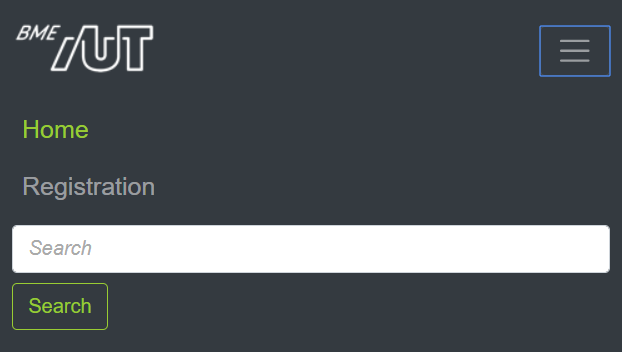
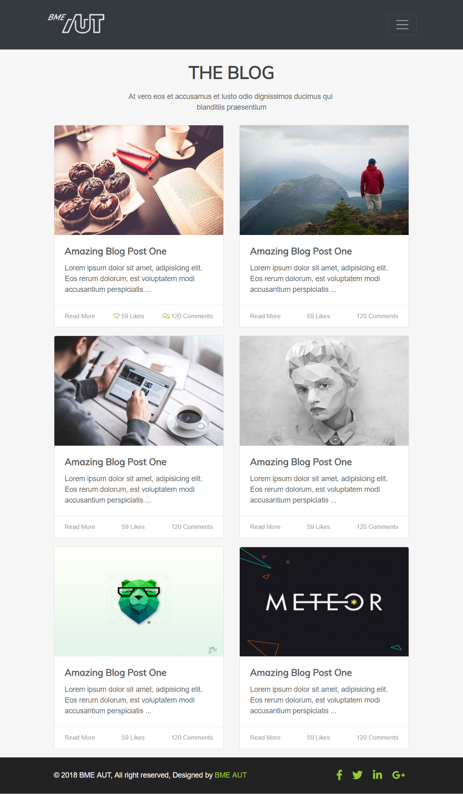
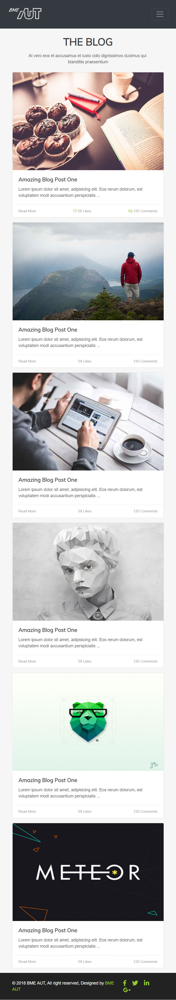
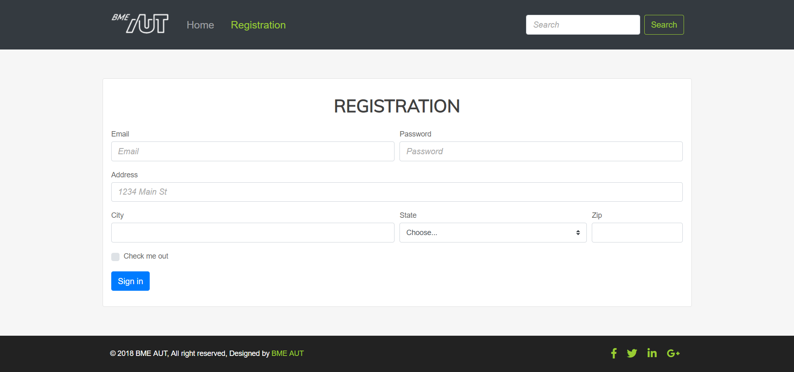
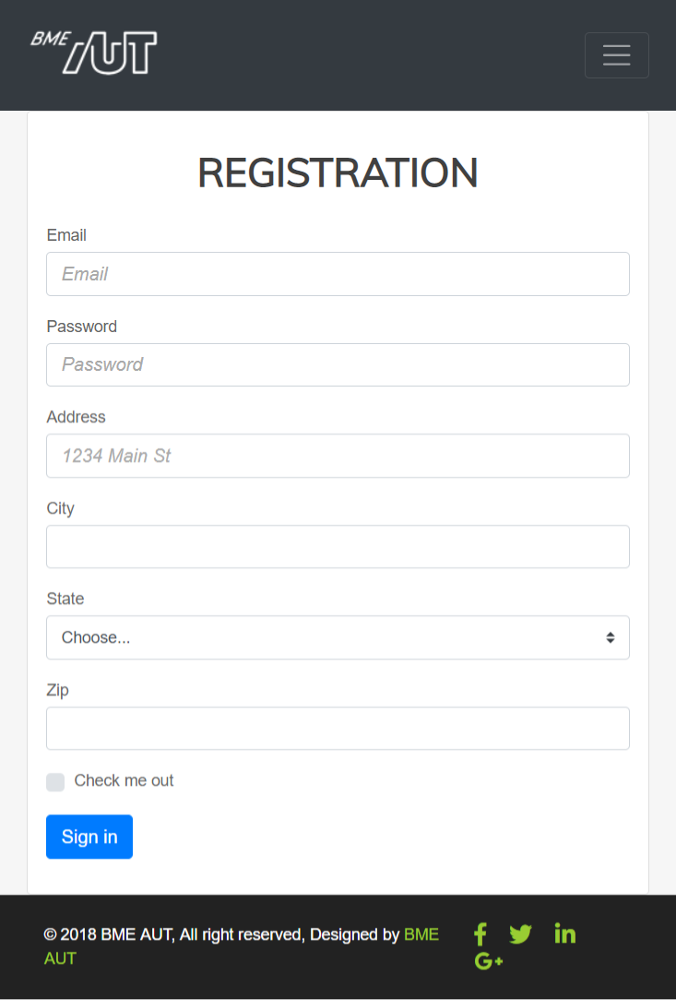

# Labor 10 - Bootstrap 4

[rep]: ./assets/rep.png "Dokumentálandó"

## Bevezetés

A labor folyamán a hallgatók önállóan végeznek feladatokat a webes technológiák gyakorlati megismerése érdekében.

Felhasznált technológiák és eszközök:
- Webböngészők beépített hibakereső eszközei,
- npm, a [NodeJS](https://nodejs.org/en/download/) csomagkezelője,
- [Visual Studio Code](https://code.visualstudio.com/download) kódszerkesztő alkalmazás,
  - Otthoni vagy egyéni munkavégzéshez használható bármilyen más kódszerkesztő vagy fejlesztőkörnyezet.

## Jegyzőkönyv

Az elkészült jegyzőkönyvet egy PDF formájában kell feltölteni a tárgy oldalán, a szükséges további erőforrásokkal (projekt, HTML, CSS, JavaScript fájlok) egy ZIP fájlba csomagolva. Ügyeljen rá, hogy a ZIP fájlba artifakt ne kerüljön (fordítás eredményeképpen előálló fájlok, pl. a bin/obj mappa tartalma). Az eredmények is itt lesznek. A jegyzőkönyv sablonja DOCX formátumban [innen](./downloads/Labor10-jegyzokonyv.docx) letölthető.

A jegyzőkönyvben csak a szükséges mértékű magyarázatot várjuk el. Ahol másképpen nincs jelezve, eredményközlés is elegendő. Képernyőképek bevágásához a Windows-ban található **Snipping Tool** eszköz használható, vagy az **Alt+PrtScr** billentyűkombinációval az aktuálisan fókuszált ablak teljes egésze másolható.

A _hiányos_ vagy _túl bőbeszédű_ megoldásokra vagy a teljes jegyzőkönyvre helyes megoldás esetén is pontlevonás adható!

A dokumentumban az alábbi módon van jelölve, hogy a jegyzőkönyvben dokumentálni szükséges egy-egy lépést:

---

### ![rep] Feladat 0 (0 pont)
    
Töltse ki a jegyzőkönyvben található szükséges adatokat: a nevét, Neptun kódját, a labor idejét és helyét.

---

### Előkészítés

- Hozzünk létre egy üres könyvtárat a C:\work alatt.
- Töltsük le a [kiinduló állományokat tartalmazó zip](https://github.com/VIAUAC00/Web-labor/tree/master/Labor10/downloads/10-Labor-kiindulo.zip) fájlt majd csomagoljuk ki a létrehozott könyvtárba.
- Nyissuk meg a Visual Studio Code-dal a létrehozott könyvtárat (File -> Open Folder)!
- Indítsuk el a Terminal (**Ctrl+ö** vagy **View > Integrated Terminal**) ablakból a http-server-t: `http-server`

## Laborfeladatok

A webfejlesztésben általános jelenség, hogy a designerek csak egy képet készítenek el, hogy a felületnek hogyan kell kinéznie, ami alapján el kell készíteni a megfelelő HTML és CSS kódot a fejlesztőnek.

A mai labor aklalmával egy ilyen képből (és egy kicsi HTML váz segítségével) kell az oldalt elkészíteni.

A designolás folyamán általában valamilyen keretrendszerből indulunk ki, mely kész megoldásokat ad a leggyakoribb feladatokra, így csökkentve az egyedi CSS mennyiségét.
A [Bootstrap](http://getbootstrap.com) két alapvető funkciót nyújt:
- egységes formázás (gombok, színek) és grid alapú elrendezés kizárólag CSS-sel,
- gyakori komponensek (felugró ablakok, kártyák, nyitható-zárható blokkok, kiemelések, panelek) CSS-sel és/vagy JavaScriptből.

A laboron ezekből a kész komponensekből fogunk megismerni egy párat közelebbről is.

### Bootstrap hozzáadása egy HTML oldalhoz

Nyissuk meg az **index.html** fájlt, amit a labor során meg fogunk formázni.

Nézzük meg, hogy az oldal head-jében milyen állományokat és honnan töltünk be.

``` HTML
<head>
    <meta charset="utf-8">
    <meta name="viewport" content="width=device-width, initial-scale=1">
    <title>MyBlog</title>

    <!-- Bootstrap linkelése CDN-ről -->
    <link rel="stylesheet" href="https://stackpath.bootstrapcdn.com/bootstrap/4.1.3/css/bootstrap.min.css" integrity="sha384-MCw98/SFnGE8fJT3GXwEOngsV7Zt27NXFoaoApmYm81iuXoPkFOJwJ8ERdknLPMO" crossorigin="anonymous">
    <!-- Font awesome 5 CDN-ről (solid, regular és brand is) -->
    <link rel="stylesheet" href="https://use.fontawesome.com/releases/v5.5.0/css/all.css" integrity="sha384-B4dIYHKNBt8Bc12p+WXckhzcICo0wtJAoU8YZTY5qE0Id1GSseTk6S+L3BlXeVIU" crossorigin="anonymous">
    <!-- Google font (Muli) letöltése -->
    <link href="https://fonts.googleapis.com/css?family=Muli" rel="stylesheet">
    <!-- Saját CSS -->
    <link rel="stylesheet" href="assets/css/site.css">
</head>
```

Figyeljük meg, hogy négy különbőző CSS állományt töltünk be, egy kivételével CDN-ről:
1. Az első magát a Bootstrap-et tölti be
2. Ezt követően egy gyakran használt ikongyűjteményt a Font Awesome-ot töltjük le.
3. Ezen felül mivel egyedi betűtípust használunk azt a Google fonts oldaláról töltjük le.
4. A legutolsó hivatkozás pedig az általunk készített CSS fájlt hivatkozza be.

> A CSS és JS könyvtárakat többféleképpen is be tudjuk tölteni:
> - CDN-ről, publikus webről tölti le a CSS fájlt, amit most is használunk,
> - van lehetőségünk csomagkezelőt (npm, bower) használni letöltésre és magunk kiszolgálni a fájlt,
> - akár saját magunk kézzel is letölthetjük a megfelelő fájlokat. Ebben az esetben is a saját webszerverünk szolgálja ki ezeket a fájlokat.

Ha az alkalmazás elrendezését szeretnénk megadni, elég sok boilerplate-jellegű CSS kódot kellene írnunk. A Bootstrap megközelítése, hogy a gyakori elrendezési lehetőségeket és stílusozási lehetőségeket készen és konfigurálhatóan adja nekünk.

A megvalósítanó oldal az alábbi főbb részekből áll
- Navigációs sáv
- Oldal központi eleme, mai blog bejegyzések listáját tartalmazza
- Lábléc


### Navigációs sáv

A navigáció sáv felépítése legyen a következő (a HTML váz szerepel a kiinuló index.html-ben):
- Bal szélen szerepeljen egy a BME AUT logo, amit az `assets/img/logo-bme-aut.png`.
- Ezt követően a két navigációs link (Home, Register)
- A sáv jobb szélén pedig egy keresés szövegdoboz és egy Search feliratú gomb legyen
 
A navigációs sáv az alábbiak szerint nézzen ki:
- Magas felbontáson
> 

Mivel a navigáció is egy gyakori komponens a Bootstrap ad rá kész komponenst, a **navbar**t.
A megvalósítás előtt nézzük meg, hogyan épül fel a [Bootstrap navbar](http://getbootstrap.com/docs/4.1/components/navbar/) komponense. Az oldalon találunk kész HTML vázakat is, amiből ha a megfelelőt kiválasztva bemásoljuk a saját kódunkba, apró módosításokkal el tudjuk érni a megfelelő kinézetet.

A legfontosabb osztályok, amire a navbar épít:
- `.navbar-brand` cég logo megjelenítésére.
- `.navbar-nav` teljes magasságú egyszerű navigációs elemek megadásához (a legördülő lista is támogatott).
- `.navbar-toggler` mobil nézeten el lehessen rejteni a linkeket egy hamburger menü alá.
- `.form-inline` ha valamilyen form controlt szeretnénk a navigációs sávba tennii.
- `.navbar-text` ha függőlegesen középre igazított szövget szeretnénk használni.
- `.collapse.navbar-collapse` elemek csoportosítos elrejtésre használható.

> Érdemes keresni a dokumentációban egy ahhoz hasonló megjelenést amire nekünk is szükségünk van és az ott található HTML kódot átalakítani a saját igényeinknek megfelelően.
> - A sötét hátterú navbart használjuk `navbar-dark` osztályt.

---

### ![rep] Feladat 1: Navigációs sáv (0.5 pont)
    
Készítse el az fent ismertetett navigációs sávot Bootstrap 4 segítségével.

Az elkészült navigációs sávról illesszen be egy képernyőképet!

---

#### Reszponzív megjelenés

A navigációt is reszponzívan kell megvalósítani, tehát ha átmérezezzük az oldalt, akkor a navigációs menüpontokat el kell rejteni és egy úgynevezett hamburger menüt kell megjeleníteni helyette, amire kattintva megjelennek a menüpontok.

Még mielőtt nekiesnénk az egyedi megoldás kitalálására érdemes megnézni, hogy a bootstrap támogatja ezt a funkcionalitást is, tehát csak a megfelelő HTML vázat kell kikeresni a [Bootstrap navbar](http://getbootstrap.com/docs/4.1/components/navbar/)  dokumentációjából és az alapján kiegészíteni a kódunkat. Tipp: `navbar-toggler`

A kész oldalnak így kell kinéznie.
- Mobil eszközön zárva.
> 
- Mobil eszközön lenyitva
> 

---

### ![rep] Feladat 2: Reszponzív navigációs sáv (0.5 pont)
    
- Tegye reszponzívvá a navigációs menüt a fenti képeknek megfelelően.
- Az elkészült teljes oldalról (ne csak a navigációs sávról) illesszen be egy-egy képernyőképet mobil nézeten:
  - ahol nincs lenyitva a hamburger menü
  - ahol le van nyitva a hamburger menü.
- Mekkora szélességnél vált mobil nézetre a menüsáv?

---

### ![rep] iMsc Feladat 2/b: Navigációs sávban szabályok felüldefiniálása (0.5 pont)

A navigációs menüben a linkek fehér színűek, hiszen a bootstrap erre állítja be.
- Illesszen be egy képernyőképet a böngésző devTool (F12) albakáról, amin látható, hogy milyen CSS osztály határozza meg most az egyes menüpontok (pl.: Home) betűszínét? Tipp: Használja a computed tabfület.
- Definiálja felül a bootstrapben megadott menüpont színeket a site.css-ben úgy, hogy azok zöldek legyenek és ha egy menüpont fölé visszük az egeret, akkor váltson sötétzöldre. Az !important kulcsszót nem használhatja! 
  - A kész megoldásról csatoljon egy képernyőképet.

---

### Egy kártya (blog bejegyzés) formázása

A navigáció után térjünk át a fő tartalmi elemre a blog bejegyzésre. Először csak egy bejegyzést formázzunk meg. A blog post HTML váza már szerepel az index oldalon, ezt kell kiegészíteni a megfelelő bootstrap osztályokkal és helyenként készíteni egy-egy CSS szabályt, amivel kiegészítjük a bootstrap-es osztályokat.

A megoldáshoz használjuk a [Bootstrap card](http://getbootstrap.com/docs/4.1/components/card/)-ját.
- Mivel majd több kártya kerül egymás mellé a szélességet a grid oszlopaihoz használz `col-x` segítségével adjuk meg.
- A kép igazításához használjuk a `card-img-top` oszátly
- A szöveges rész legyen a kártya törzse `card-body`
- A címhez a `card-title` osztályt használjuk
- Az egyéb adatok pedig a kártya láblécében `card-footer` jelenjenek meg
  - a lábléc fölötti vonal legyen szaggatott, 
  - a betű méret 12px, 
  - a háttér szín pedig átlátszó,
  - a láblécben szereplő linkek legyenek szürkék és ha fölé visszük az egeret akkor zöldek, de ne legyen aláhúzva. Az ikonok mindig legyenek zöldek.
  - Tipp: A lábléchez érdemes egyedi CSS osztály(oka)t is definiálni.
- Ügyeljen arra, hogy a margók és paddingok hasonlóak legyenek. Tipp: használja a `m-0`, `py-2`.... osztályokat. Részletesen a [Bootstrap spacing](http://getbootstrap.com/docs/4.1/utilities/spacing/) szekcióban lehet róla olvasni.

Az egyes blog bejegyzéseknek, az az alábbi képen látható módon kell megjelennie:
> 

---

### ![rep] Feladat 3: Egy kártya formázása (1 pont)
    
- Illesszen be egy képernyőképet a teljes oldalról, ami látható az elkészített blogpost megformázva.

---

### Reszponzív blog bejegyzés lista (1 pont)

Egészítse ki a HTML kódot úgy, hogy az oldalon összesen 6 blogbejegyzés jelenjen meg. Az egyes bejegyzések minden adata lehet azonos, csak a képeket cserélje le. A képeket az **assets/img** könyvtárban találja.

Az oldalt úgy valósítsa meg, hogy magas felbontáson 3 hasábos legyen, közepesen 2, kicsin pedig 1 hasábos.

- Magas felbontások
> 
- Közepes felbontáson
> 
- Kicsi felbontáson
> 

---

### ![rep] Feladat 4: Reszponzív blog bejegyzés lista (1 pont)
    
- Illesszen be egy-egy képernyőképet mindhárom felbontáson, a teljes oldalról.

---


### Oldal lábléc elkészíése

- A lábléc elkészítésekor a footerben egyedi CSS osztályban adja meg, hogy fekete legyen a háttér és fehér a betűszín.
- Ezen felül adjon meg megfelelő méretű paddingot, amihez használhajta a `p-4` CSS osztályt illetve annak egyéb változatait. Részletes leírás a [bootstrap spacing](https://getbootstrap.com/docs/4.1/utilities/spacing/) fejezetben található.
- A copyright szöveg kerüljön balra, az ikonok pedig jobbra. Ehhez a flexboxot használja.
- Ügyeljen arra, hogy az egyes ikonok mérete és távolsága is megfelelő legyen.

> 

---

### ![rep] Feladat 5: Lábléc (0.5 pont)
    
- Illesszen be egy képernyőképet az elkészített láblécről.

---


### iMSc: Lábléc igazítása az oldal aljára (0.5 iMSc pont)
Dolgozzon ki megoldást arra, hogy az oldal lábléce mindig az oldal alján legyen.
  - Akkor is ha az oldalon kevés a tartalom és akkor is ha scrollozni kell az oldalon
  - Soha ne takarjon ki tartalmi részt.
  - Tipp: A megoldásthoz használhatja a `calc` függvényt a magasság számításához, vagy akár a flexboxot is.

### ![rep] iMSc Feladat 5/b: Lábléc (0.5 pont)
Illesszen be egy-egy képernyőképet a teljes oldalról amikor azon kell scrollozni, illetve akkor is, amikor csak kevés tartalom van rajta. (A kevés tartalomhoz kommentezze ki a kártyák egy részét.)

---

### Regisztrációs űrlap létrehozása.

Az elkészített oldal tetején található egy Register felirató link, ami a register.html oldalra irányít. A feladat ennek az oldalnak az elkészítése.
Az oldal fejléc és lábléc része változatlan, tehát azt másolja át a meglévő index.html oldalról. Csak a navigáció utáni rész fog változni.

Az oldalon egy űrlapot kell készíteni, ahol a felhasználótó bekérjük a következő alábbi adatokat: **Email cím**, **Password**, **Address**, **City**, **State** (Tipp: select), **ZIP**.
Az űrlap végén legyen egy checkbox, hogy elfogaja a feltételeket illetve egy Sign in feliratű gomb, ami elküldi az űrlapot.

- Az inputok létrehozásánál ügyeljen mindig a megfelelő típus használatára.
- A szövegdobozokba tegyen placeholder szöveget is.
- Az alábbi képen látható elrendezést valósítja meg.

> 

- Ellenőrizze, hogy az oldal kis képernyő méreten az alábbi elrednezésben jelenik-e meg. Ha nem akkor javítsa a kódot, hogy az alábbi kinézetet kapja.

> 

---

### ![rep] Feladat 6: Regisztrációs űrlap (1.5 pont)
    
- Illesszen be egy-egy képernyőképet az elkészített oldalról kicsi és magas felbontáson is.

---

### ![rep] iMSc Feladat 6/b: Regsztráció űrlap középre igazítása és placeholder design (0.5 pont)

- Flexbox segítségével igazítsa a regisztrációs űrlapot függőlegesen középre.
- Definiálja felül a placeholder szövegek megjelenítését is. Legyen piros dőlt betű a placeholder mindenhol. Tipp: `::placeholder`

- Illesszen be az elkészített teljes oldalról egy képernyőképet, ahol a placeholderek is láthatóak.

---