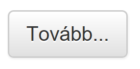
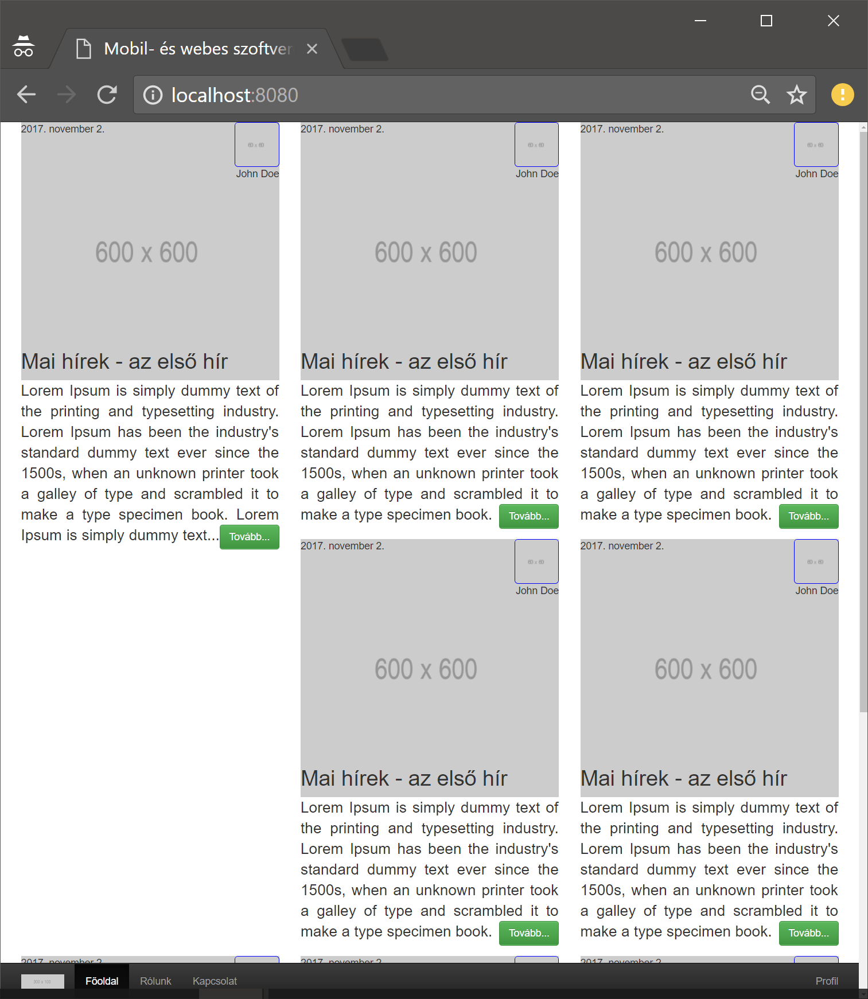
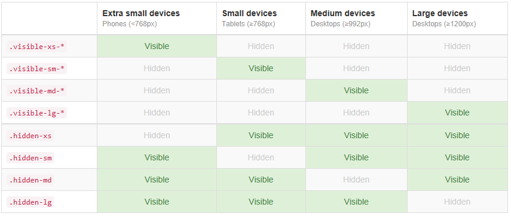
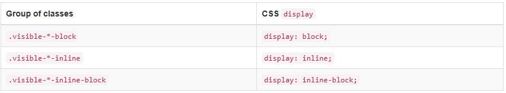
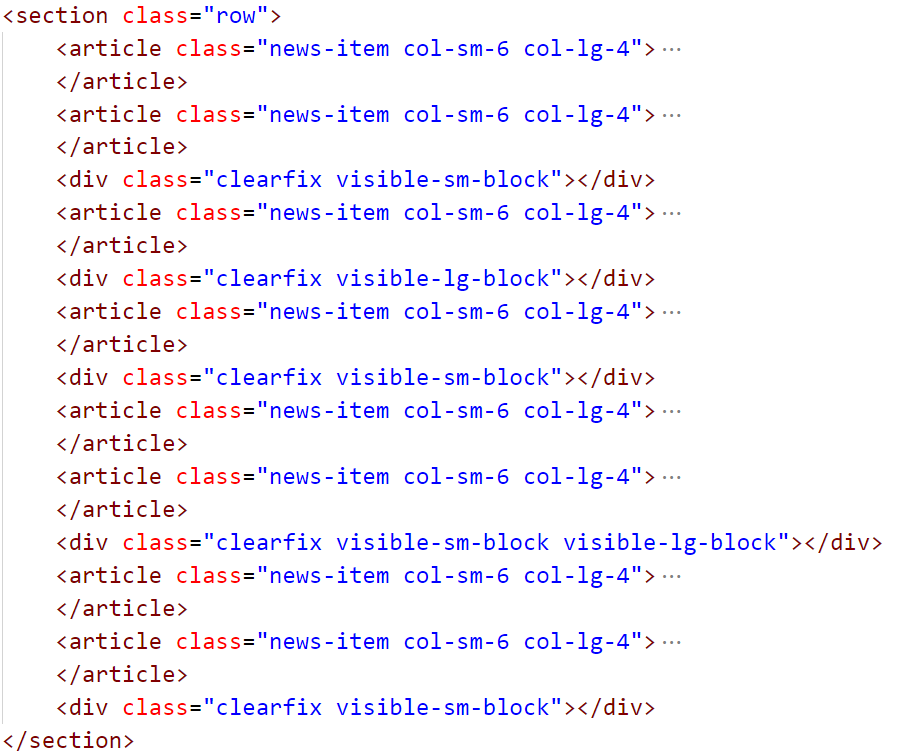

# Labor 10 - Bootstrap CSS

[rep]: ./assets/rep.png "Dokumentálandó"

## Bevezetés

A labor folyamán a hallgatók a laborvezető segítségével vezetetten és önállóan végeznek feladatokat a webes technológiák gyakorlati megismerése érdekében.

Felhasznált technológiák és eszközök:

- webböngészők beépített hibakereső eszközei,

- NodeJS és npm csomagkezelő,

- Visual Studio Code kódszerkesztő alkalmazás.

## Jegyzőkönyv

Az elkészült jegyzőkönyvet egy PDF formájában kell feltölteni a tárgy oldalán, a szükséges további erőforrásokkal (projekt, HTML, CSS, JavaScript fájlok) egy ZIP fájlba csomagolva. Ügyeljen rá, hogy a ZIP fájlba artifakt ne kerüljön (fordítás eredményeképpen előálló fájlok, pl. a bin/obj mappa tartalma). Az eredmények is itt lesznek. A jegyzőkönyv sablonja DOCX formátumban <a href="./downloads/Labor09-jegyzokonyv.docx" target="_blank">innen</a> letölthető.

A jegyzőkönyvben csak a szükséges mértékű magyarázatot várjuk el. Ahol másképpen nincs jelezve, eredményközlés is elegendő. Képernyőképek bevágásához a Windows-ban található **Snipping Tool** eszköz használható, vagy az **Alt+PrtScr** billentyűkombinációval az aktuálisan fókuszált ablak teljes egésze másolható.

A _hiányos_ vagy _túl bőbeszédű_ megoldásokra vagy a teljes jegyzőkönyvre helyes megoldás esetén is pontlevonás adható!

A laborvezető jelen dokumentum alapján vezeti végig a labort. A dokumentumban az alábbi módon van jelölve, hogy a jegyzőkönyvben dokumentálni szükséges egy-egy lépést:

---

### ![rep] Feladat 0 (0 pont)
    
    Töltse ki a jegyzőkönyvben található szükséges adatokat: a nevét, Neptun kódját, a labor idejét és helyét.

---

## Laborfeladatok

A webfejlesztés során az első feladataink egyike a készítendő alkalmazás elrendezésének megtervezése és megvalósítása.

A [Twitter Bootstrap](http://getbootstrap.com) alapvetően két alapvető funkciót nyújt:
- egységes formázás (gombok, színek) és grid alapú elrendezés kizárólag CSS-sel,
- gyakori komponensek (felugró ablakok, nyitható-zárható blokkok, kiemelések, panelek) CSS-sel és/vagy JavaScriptből.

### Előkészítés

- Nyissuk meg a Visual Studio Code-ot egy üres munkamappában!
- A Terminal (**Ctrl+ö** / View > Integrated Terminal) segítségével telepítsük a http-server modult: `npm install http-server`!
- Indítsuk el a szervert: `.\node_modules\.bin\http-server`!

### Bootstrap osztályok

Hozzunk létre egy **index.html** fájlt, aminek tartalma legyen az alábbi:

``` HTML
<!doctype html>
<html>

<head>
    <title>Mobil- és webes szoftverek - Bootstrap</title>
    <link rel="stylesheet" href="https://maxcdn.bootstrapcdn.com/bootstrap/3.3.7/css/bootstrap.min.css">
    <!-- Opcionális téma -->
    <link rel="stylesheet" href="https://maxcdn.bootstrapcdn.com/bootstrap/3.3.7/css/bootstrap-theme.min.css">
    <!-- Saját stílusok -->
    <link rel=stylesheet href="site.css">
</head>

<body>
    <nav>
        <div>
            <a href="index.html">
                
            </a>
            <ul>
                <li>
                    <a href="index.html">Főoldal</a>
                </li>
                <li>
                    <a href="about.html">Rólunk</a>
                </li>
                <li>
                    <a href="contact.html">Kapcsolat</a>
                </li>
                <li>
                    <a href="profile.html">Profil</a>
                </li>
            </ul>
        </div>
    </nav>

    <main>
        <section>
            <article>
                <header>
                    <h2>Mai hírek - az első hír</h2>
                    <div>
                        
                        <div>John Doe</div>
                    </div>
                    <div>2017. november 2.</div>
                    
                </header>
                <p>
                    Lorem Ipsum is simply dummy text of the printing and typesetting industry. Lorem Ipsum has been the industry's standard dummy
                    text ever since the 1500s, when an unknown printer took a galley of type and scrambled it to make a type
                    specimen book.
                    <a href="details.html">Tovább...</a>
                </p>
            </article>
        </section>
    </main>
</body>

</html>

```

> A Bootstrap-et többféle módon tudjuk betölteni:
> - a fenti megoldásunk CDN-ről, publikus webről tölti le a CSS fájlt,
> - van lehetőségünk csomagkezelőt (npm, bower) használni letöltésre és magunk kiszolgálni a fájlt,
> - a LESS forrást kiegészíteni, saját változókat definiálni, fordítani, majd kiszolgálni az egyedi Bootstrap CSS-ünket,
> - a hivatalos oldalon egy [saját verziót](https://getbootstrap.com/docs/3.3/customize/) tudunk összecsomagolni, letölteni és azt kiszolgálni - ez a megközelítés manapság ritkán használt, a JS kódokat "tree shaking" módszerrel kicsinyítjük a minifikáción és tömörítésen túl, CSS-t pedig jellemzően csak minifikálunk.

Ha az alkalmazás elrendezését szeretnénk megadni, elég sok boilerplate-jellegű CSS kódot kellene írnunk. A Bootstrap megközelítése, hogy a gyakori elrendezési lehetőségeket és stílusozási lehetőségeket készen és konfigurálhatóan adja nekünk.

Tegyük fel a **Tovább...** linkünkre a `btn` és `btn-default` osztályokat:

``` HTML

<a class="btn btn-default" href="details.html">Tovább...</a>

```

A Bootstrap bizonyos osztályú HTML elemekhez megjelenést (CSS) és/vagy működést (JS) rendel.



> Bootstrap osztályok listája megtalálható az alábbi oldalon, rövid leírással és képekkel: https://bootstrapcreative.com/resources/bootstrap-3-css-classes-index/

Ha megvizsgáljuk, milyen stílusok illeszkednek a "gombunkra", akkor láthatjuk, hogy a két osztály, amit feltettünk, különböző szabályokat definiált. A `btn` osztály önmagában nem elegendő a stílusozáshoz, egy kiegészítő osztályt kell megadnunk, amivel az alábbihoz hasonló, alapértelmezett nézetet tudjuk előállítani:


Ikonok elhelyezésére is egyszerű megoldást használhatunk. A Bootstrappel jár a Glyphicons/Halflings szimbólumokat tartalmazó fontkészlet, amelyet hasonlóképpen osztályokkal tudunk alkalmazni elemekre. Cseréljük le a gombunk tartalmát az alábbira:

``` HTML
<a class="btn btn-default" href="details.html">Tovább <i class="glyphicon glyphicon-chevron-right"></i></a>
```

---

Mindegy, hogy milyen elemre tesszük az osztályokat, a Bootstrap erre a `:before` pszuedoszelektort használja, így egy üres bármilyen elemre tehetjük (vagy nem üresre, ekkor a tartalom elé kerül az ikon). Az `<i>`-t azért használják gyakran, mert rövid leírni.

[A Glyphiconok teljes listája itt található.](https://getbootstrap.com/docs/3.3/components/#glyphicons)

> A fenti megoldáshoz hasonló, viszont kizárólag ikonokat tartalmazó, elterjedt CSS kiegészítés a [Font Awesome](http://fontawesome.io/), amely a `fa-` prefixet használja, így rövidebb markup készíthető. A Bootstrap 4-es verziója már nem tartalmazza az ikonkészletet, az külön elérhető.

### ![rep] Feladat 1 (1 pont)
    
    Vizsgálja meg az oldal elrendezését és a link/gomb stílusát a jelenlegi állapotban!

- Alkalmazza a `btn-success` osztályt a gombon!
- A gombot igazítsa a szülő jobb oldalához, ehhez használja a [Bootstrap megfelelő segédoszályát](https://getbootstrap.com/docs/3.3/css/#helper-classes-floats)!
- Illesszen be egy képernyőképet az alkalmazás alap elrendezéséről és a gomb új stílusáról!

---

### Navigációs sáv

A fenti megközelítéshez hasonlóan osztályokat helyezünk el a HTML elemeinken a Bootstrap konvencióinak megfelelően, ezzel a navigációt is meg tudjuk oldani:

``` HTML

<nav class="navbar navbar-default navbar-fixed-top">
    <div class="container">
        <div class="navbar-header">
            <a href="index.html">
                
            </a>
        </div>
        <ul class="nav navbar-nav">
            <li>
                <a href="index.html">Főoldal</a>
            </li>
            <li>
                <a href="about.html">Rólunk</a>
            </li>
            <li class="active">
                <a href="contact.html">Kapcsolat</a>
            </li>
            <li>
                <a href="profile.html">Profil</a>
            </li>
        </ul>
    </div>
</nav>

```

A `navbar` osztály a `navbar-default` (világos) vagy `navbar-inverse` (sötét) osztályok egyikével együtt használható, és a navigációs sáv konténerét határozza meg. A `navbar-fixed-top` az oldal tetejéhez fixen igazítja a navigációs sávot (tehát nem lehet túlgörgetni rajta), a `navbar-static-top` pedig az oldal tetejéhez igazítja, és elgörgethető lesz. A `-top` osztályoknak `-bottom` megfelelője is van az oldal aljához igazításhoz.

A `navbar-header` a reszponzív elrendezés miatt fontos, így jelenik meg megfelelően pl. a fejlécben található logónk, amire a `navbar-brand` osztályt helyezzük.

A `nav` osztály adja az alap kinézetét a navigációs elemeknek. Ezt kiegészítendő a `navbar-nav` az oldal fő navigációs sávjához saját nézetet is rendel. Ezen belül az `active` osztályt használhatjuk, ez egy aktív, "benyomott" állapotú elemet fog jelölni, rend szerint az aktuálisan látható oldalt vagy menüpontot jelöljük így.

Ha jobb oldalra szeretnénk igazítani néhány nav elemet, azt egy külön listában (`<ul>`) kell tennünk, amire a `navbar-right` osztályt tesszük. Ez `float: right;`-tal az oldal jobb oldalához igazítja a tartalmat (van lehetőség explicit balra is igazítani tartalmat a `navbar-left`-tel). Az utolsó `<li>` elemet igazítsuk jobbra:

``` HTML

<ul class="nav navbar-nav navbar-right">
    <li>
        <a href="profile.html">Profil</a>
    </li>
</ul>

```

---

### ![rep] Feladat 2 (1 pont)
    
    Illesszen be egy képernyőképet, amelyen az alábbinak megfelelő navigációs sáv látható:
   
- a navigációs sáv sötét hátterű, tehát **nem** a `navbar-default` kinézetének megfelelő,
- a navigációs sáv az oldal **alján** helyezkedik el és **mindig látható**,
- a **Főoldal** menüpont az *aktuálisan kiválasztott* elem.

---

Bizonyos CSS módosításokat minden esetben magunknak kell eszközölnünk, a fixen az oldal aljához igazított elemnél látható, hogy kitakarja a `<body>` tartalmának alját. Hozzuk létre a már behivatkozott **site.css** fájlt, aminek a tartalma legyen az alábbi:


``` CSS

body {
    padding-bottom: 65px; /* A fix lábléc miatt szükséges. */
}

```

A láblécünk 50px magasságú, és ehhez 15px padding távolságot hozzáteszünk (a 15px padding távolság gyakran használt a Bootstrap-ben is). Nem kell foglalkozunk azzal, hogy kis képernyőméreten az oldal nagyrészét kitakarja a lábléc, ugyanis ezt a problémát JavaScriptből később meg fogjuk tudni oldani az elterjedt hamburger-menü alkalmazásával később.

### Elrendezés megvalósítása

A navigációnál már láttuk, hogy a navigációs elemeket egy `container` osztályú elembe csomagoltuk. A `container` egy olyan tároló elem, amely az oldal szélességének megfelelően állítja saját szélességét. A `container-fluid` alternatíva teljes szélességet használ, tehát az minden esetben faltól-falig teszi a tartalmakat (a megfelelő padding és margin értékek beállítása miatt használjuk).

A **Bootstrap grid rendszer**e alapvetően az alábbi módon működik:
- A `.container` (fix szélesség) és `.container-fluid` (teljes szélesség) osztályok a grid rendszer külső konténerei, ezeken belül `.row` elemeket definiálunk, amikbe tehetjük a különböző oszlopainkat (amiből összesen 12 össz-szélességnyi fér el egy sorban). Az oszlopok `-xs-*` (768px szélesség alatt), `-sm-*` (768px szélesség felett), `-md-*` (992px szélesség felett) és `-lg-*` (1200px szélesség felett) suffixekkel vannak ellátva, így az adott oszlop különböző képernyőméreteken különböző mennyiségű oszlopot fog elfoglalni a sorban. 
- Több oszlop (12 felett) automatikusan új sorba törik.
- Az oszlopok 15px paddingot adnak egy elemhez, a sorok ezeket a paddingokat negatív margóval kompenzálják (ezért ha egy sor és egy nem sor testvérelemek, a sor túl fog lógni a testvéren).
- Az oszlopok alapértelmezetten `float: left;`-tel pozícionáltak, a lebegés megszüntetésére használhatjuk a `.clearfix` osztályt.

A fenti szabályok ismeretében az alábbiak szerint tudjuk módosítani a `<main>` elemet és tartalmát:

``` HTML

<main class="container">
    <section class="row">
        <article class="col-lg-4">
            <!-- ... -->
        </article>
    </section>
</main>

```

A megoldásunk tehát a legalább 1200px szélességű ablakon (használhatjuk a böngésző nagyítás/kicsinyítés funkcióját és az ablak átméretezését a szimuláláshoz) 4 oszlopot foglal el, így 3 elem fér el egymás mellett. A hír borítóképe viszont sajnos kilóg, ezt az `img-responsive` segédoszállyal tudjuk kompenzálni, ami a max szélességet és magasságot 100%-ra állítja, így a kép nem fog kilógni a szülőelemből:

``` HTML


```

Látjuk, hogy nem írtunk saját CSS-t, mégis az oldal nagyrészének elrendezését már el is végeztük. A borítóképre történő abszolút pozícionáláshoz viszont nem tudjuk a Bootstrap osztályait használni, így ehhez saját CSS-t kell írnunk. Egyedi CSS készítésekor ügyeljünk rá, hogy a Bootstrap által újrahasznosíthatónak tervezett funkcionalitást ne rontsuk el, tehát a szabályaink legyenek specifikusak a konkrét felhasználási eseteinkre! Ez a gyakorlatban azt jelenti, hogy írjunk kiegészítő osztályokat a Bootstrap osztályaihoz, amihez további szabályokat fűzhetünk, ill. támaszkodhatunk a Bootstrap osztályokra a saját szabályaink készítésében, de kivételes esetektől eltekintve ne módosítsuk az általános Bootstrap osztályok megjelenését!

Egészítsük ki az `index.html`-t és a `site.css`-t az alábbi tartalommal:

``` HTML

<main ...>
    <section ..>
        <article class="news-item ...">
            <header>
                <h2>...</h2>
                <div class="author-container text-right">
                    
                    <div class="author-name">...</div>
                </div>
                <div class="date">...</div>
                
            </header>
            <p class="lead text-justify">...</p>
        </article>
    </section>
</main>

```

A `text-right` és `text-justify` osztályok a Bootstrap által használtak, a szöveget jobbra ill. sorkizártra állítják. A `lead` típusú elemek kiemelt bevezető szövegrészletek.

``` CSS

.news-item header {
    position: relative; /* Ehhez fogjuk viszonyítani az abszolút pozícionált gyerekelemeket. */
}

.news-item header h2 {
    position: absolute; /* A bal alsó sarokba abszolút pozícionáljuk a címet. */
    bottom: 0; 
    left: 0;
}

.news-item header .author-container {
    position: absolute; /* A jobb felső sarokba abszolút pozícionáljuk a szerzőt. */
    right: 0;
    top: 0;
}

.news-item header .author-container .profile-picture {
    border: 1px solid blue; /* Kiemeljük a háttérből a profilképet. */
    border-radius: 5px;
}

.news-item header .date {
    position: absolute; /* A dátumot a bal felső sarokba abszolút pozícionáljuk. */
}

.news-item header img.cover {
    z-index: -1; /* A képet hátrébb toljuk, hogy ne takarja ki az előtte levő elemket. */
}

```

---

### ![rep] Feladat 3 (1 pont)
    
    Illesszen be egy képernyőképet az alkalmazás alap elrendezéséről, ehhez másolja le az egyes hírbejegyzéseket, hogy az elrendezés látható legyen!

---

### Tördelés, reszponzív elrendezés

Jelenleg kizárólag a nagy és a legkisebb felbontást támogatjuk, ugyanis a col-lg-* szabályokat helyeztük csak el az egyes bejegyzéseknél, ez alatt a felbontás alatt az elem teljes szélességű lesz. A col-* szabályokat vegyíteni szokás, ill. szükség esetén elrejteni bizonyos elemeket bizonyos felbontásokon. Ha közepes képernyőméreten 2 elemet szeretnénk megjeleníteni, alacsonyabbon viszont csak 1-et, azt az alábbi osztályok vegyítésével tudjuk elérni:

``` HTML

<article class="news-item col-sm-6 col-lg-4">

```

Ha egy oszlopunk *magasabb*, mint a testvér oszlopai, akkor olyan helyzetben találhatjuk magunkat, mint az alábbi képen látható:



Szeretnénk ehelyett, hogy a túlcsorduló oszlopok **új sorba** tördelődjenek minden esetben. Ezt megoldhatjuk úgy, hogy új `.row`-kat hozunk létre, viszont hamar eljutunk ahhoz a problémához, hogy nem tudjuk, hova kerüljön a `.row`, mert nagy felbontáson 3, kisebben 2 oszlop kellene legyen egy sorban. Erre megoldás egy üres `.clearfix` elem megjelenítése a DOM-ban az oszlopok között, amely csak adott felbontásokon jelenik meg. Erre használhatjuk a `.visible-*-*` és `.hidden-*-*` osztályokat, amelyeket az alábbi ábra foglal össze:




Ahhoz tehát, hogy ilyen reszponzív *"sortörést"* tudjunk elhelyezni, azokat adott képernyőméretenként különböző oszlopszám után kell elhelyeznünk. Esetünkben `lg` méreten pl. 3 elem fér el, így 3 elem után egy ilyen törést helyezünk el a DOM-ban:

``` HTML

<div class="clearfix visible-lg-block"></div>

```

Közepes képernyőméretnél 2 elemenként kell hasonlót, így lesznek átfedések is a `visible-md-block` elemekkel. A végeredmény így néz ki:



Ezután a megjelenő elemek is az elvártnak megfelelően rendeződnek el.

---

### ![rep] Feladat 4 (1 pont)
    
    Illesszen be egy képernyőképet a javított elrendezésről a különböző képernyőméreteken, ahol nincs kihagyott blokk a magasabb első elemek alatt! Ideiglenesen eltávolíthatja a navbar-t a DOM-ból kisméretű kijelzőn.

---

### Bootstrap oldal elkészítése

---

### ![rep] Feladat 5 (1 pont)
    
    A tanultak gyakorlásaképpen és a keretrendszer használatának elsajátításáképpen készítsen egy Bootstrap alapú oldalt!

A feladat megoldásához használhatja a [CSS](https://getbootstrap.com/docs/3.3/css/) és [komponensek](https://getbootstrap.com/docs/3.3/components/) Bootstrap dokumentációs oldalakat!

- A Profil linkre kattintva egy új oldal töltődjön be, ahol egy regisztrációs űrlap mellett a jelenlegi menüsor található.
    - A regisztrációs űrlap egy [panel](https://getbootstrap.com/docs/3.3/components/#panels) a panel címe *Regisztráció* legyen!
    - Az űrlapon (használja az [űrlapok](https://getbootstrap.com/docs/3.3/css/#forms) dokumentációt) egy **e-mail cím**et (kötelező), **jelszó**t (kötelező) és egy **bemutatkozás**t (max 5 sor) kérjen be! Ügyeljen a megfelelő beviteli mezőkre! Használja az input-group-addon megoldásokat és Glyphicon-okat! Közepes képernyőmérettől felfelé az e-mail cím és a jelszó **egymás alatt**, ezek **mellett** helyezkedik el a bemutatkozás.
    - Az űrlap alján legyen egy piros *Mégsem* gomb és egy zöld *OK*, mindkettő legyen jobbra igazítva az űrlapon!
    - A Mégsem gomb visszanavigál a főoldalra, az OK gomb helyes kitöltés esetén átnavigál egy visszajelző oldalra, ahol egy [figyelmeztetés](https://getbootstrap.com/docs/3.3/components/#alerts) jelzi a sikeres regisztrációt. A figyelmezetetés alatt a szokásos hírek felsorolás jelenik meg. Ennek megoldásához csak HTML-t és CSS-t használjon!

---
