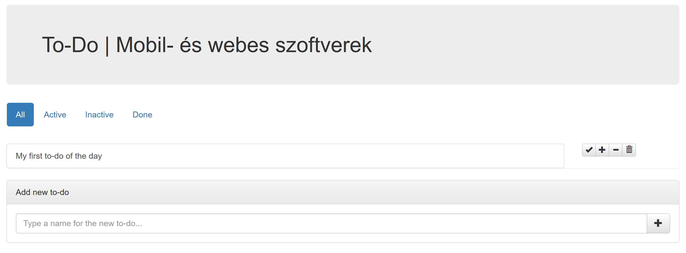

# Labor 11 - JavaScript alapok

[rep]: ./assets/rep.png "Dokumentálandó"

## Bevezetés

A labor folyamán a hallgatók a laborvezető segítségével vezetetten és önállóan végeznek feladatokat a webes technológiák gyakorlati megismerése érdekében.

Felhasznált technológiák és eszközök:

- webböngészők beépített hibakereső eszközei,

- NodeJS és npm csomagkezelő,

- Visual Studio Code kódszerkesztő alkalmazás,
  - otthoni vagy egyéni munkavégzéshez használható bármilyen más kódszerkesztő vagy fejlesztőkörnyezet.

### Jegyzőkönyv

Az elkészült jegyzőkönyvet egy PDF formájában kell feltölteni a tárgy oldalán, a szükséges további erőforrásokkal (projekt, HTML, CSS, JavaScript fájlok) egy ZIP fájlba csomagolva. Ügyeljen rá, hogy a ZIP fájlba artifakt ne kerüljön (fordítás eredményeképpen előálló fájlok, pl. a bin/obj mappa tartalma). Az eredmények is itt lesznek. A jegyzőkönyv sablonja DOCX formátumban [innen](./downloads/Labor11-jegyzokonyv.docx) letölthető.

A jegyzőkönyvben csak a szükséges mértékű magyarázatot várjuk el. Ahol másképpen nincs jelezve, eredményközlés is elegendő. Képernyőképek bevágásához a Windows-ban található **Snipping Tool** eszköz használható, vagy az **Alt+PrtScr** billentyűkombinációval az aktuálisan fókuszált ablak teljes egésze másolható.

A _hiányos_ vagy _túl bőbeszédű_ megoldásokra vagy a teljes jegyzőkönyvre helyes megoldás esetén is pontlevonás adható!

A laborvezető jelen dokumentum alapján vezeti végig a labort. A dokumentumban az alábbi módon van jelölve, hogy a jegyzőkönyvben dokumentálni szükséges egy-egy lépést:

---

### ![rep] Feladat 0 (0 pont)
    
    Töltse ki a jegyzőkönyvben található szükséges adatokat: a nevét, Neptun kódját, a labor idejét és helyét.

---

### Előkészítés

- Nyissuk meg a Visual Studio Code-ot egy üres munkamappában!
- A Terminal (**Ctrl+ö** / View > Integrated Terminal) segítségével telepítsük a http-server modult: `npm install http-server`!
- Indítsuk el a szervert: `.\node_modules\.bin\http-server`!

### A JavaScriptről dióhéjban

A korábban megismert HTML és CSS adják a weboldalunk vázát, alapműködését és kinézetét, viszont a korai dokumentum-alapú weboldalaktól áttértünk a dinamikus weboldalakra, melyek futás időben módosítják az aktuális dokumentumot (a DOM-ot), így interakciót végezhetünk és a weboldalunkra mint önálló alkalmazás tekintünk.

Az alkalmazásainkhoz dinamizmust (időbeni változást) szkripteléssel rendelünk, erre JavaScriptet használunk. A JavaScript egy dinamikusan típusos, interpretált szkriptnyelv, a hozzá tartozó futtatókörnyezetek végrehajtó egységei pedig alapvetően egyszálúak, így nincsen kölcsönös kizárási problémánk.

Érdemes továbbá megemlíteni a felhasználandó típusokat (`function`, `object`, `string`, `number`, `undefined`, `boolean`, `symbol`), az ezek közötti szabad konverziót és a JavaScript eseményhurkot (**event loop**). Az event loop a JavaScriptet folyamatosan befejeződésig futtatja (**"Run-to-completion"**), amíg a futás be nem fejeződik, majd aszinkron eseményre vár. Az események bekövetkeztével az eseményhez regisztrált eseménykezelők lefutnak. Az események lehetnek:
- felhasználói interakció,
- időzítés,
- IO műveletek eredménye.

> A fontosabb kulcsgondolatok tehát röviden:
> - interpretált futtatás,
> - DOM dinamikus manipulációja,
> - dinamikus típusosság és típuskonverzió,
> - egyszálúság, event loop és aszinkronitás.

Említésre méltó még, hogy a JavaScript (klasszikus értelemben véve) nem objektum-orientált, az osztályok koncepciója a nyelvben később jelent meg és még nem minden böngészőben támogatott; a nyelv a **prototipikus öröklés** módszerét alkalmazza az objektumorientált megközelítéshez. Ezen kívül különös sajátosságai vannak, a `this` kulcsszó pl. nem az aktuális *objektumra*, hanem az aktuális *függvényre* mutat, erre fogunk látni példát.

## Laborfeladatok

A laboron egy egyszerű "offline" To-Do alkalmazást készítünk.

### Egyszerű eseménykezelés

Az alkalmazás alapjaként egy egyszerű HTML oldal szolgál, amihez a saját JavaScriptünket írjuk. A JS kódot HTML-ben is elhelyezhetnénk, viszont az nem karbantartható és alapvetően nem best practice, úgyhogy saját **.js** fájlba fogjuk tenni a kódot, amit behivatkozunk. A stílusozást Bootstrappel oldjuk meg.

> A böngésző különböző körülmények függvényében **cache-elheti a fájljainkat**, ezért a frissítést ilyenkor kézzel kell megoldanunk. Ne felejtsük el menteni a fájlt, ezután a böngészőben állítsuk be az F12 Developer Tools-ban a Network fülön az "Always refresh from server" vagy hasonló elnevezésű beállítást!

A kiinduló **index.html** tartalma legyen az alábbi:

``` HTML

<!doctype html>
<html>

<head>
    <title>To-Do | Mobil- és webes szoftverek</title>
    <link rel="stylesheet" href="https://maxcdn.bootstrapcdn.com/bootstrap/3.3.7/css/bootstrap.min.css">
    <link rel="stylesheet" href="https://maxcdn.bootstrapcdn.com/bootstrap/3.3.7/css/bootstrap-theme.min.css">
</head>

<body class="container">

    <h1 class="jumbotron">To-Do | Mobil- és webes szoftverek</h1>

    <ul class="navbar nav nav-pills text-center">
        <li class="todo-tab active">
            <a href="#">All <span class="badge"></span> </a>
        </li>
        <li class="todo-tab">
            <a href="#">Active <span class="badge"></span> </a>
        </li>
        <li class="todo-tab">
            <a href="#">Inactive <span class="badge"></span> </a>
        </li>
        <li class="todo-tab">
            <a href="#">Done <span class="badge"></span> </a>
        </li>
    </ul>

    <div class="list-group" id="todo-list">
        <div class="row">
            <div class="col-xs-6 col-sm-9 col-md-10">
                <a class="list-group-item" href="#">
                    My first to-do of the day
                </a>
            </div>
            <div class="col-xs-6 col-sm-3 col-md-2 btn-group text-right">
                <button class="btn btn-default btn-xs" title="Mark as done">
                    <i class="glyphicon glyphicon-ok"></i>
                </button>
                <button class="btn btn-default btn-xs" title="Mark as active">
                    <i class="glyphicon glyphicon-plus"></i>
                </button>
                <button class="btn btn-default btn-xs" title="Mark as inactive">
                    <i class="glyphicon glyphicon-minus"></i>
                </button>
                <button class="btn btn-default btn-xs" title="Remove">
                    <i class="glyphicon glyphicon-trash"></i>
                </button>
            </div>
        </div>
    </div>

    <div class="panel panel-default">
        <div class="panel-heading">
            Add new to-do
        </div>
        <form id="new-todo-form" class="panel-body">
            <div class="input-group">
                <input type="text" id="new-todo-title" class="form-control" placeholder="Type a name for the new to-do..." autocomplete="off" autofocus="true">
                <span class="input-group-btn">
                    <button type="submit" class="btn btn-default">
                        <i class="text-default glyphicon glyphicon-plus"></i>
                    </button>
                </span>
            </div>
        </form>
    </div>
  
    <script src="todo.js" type="text/javascript"></script>

</body>

</html>

```



Láthatjuk, hogy a statikus oldal az alábbiakból tevődik össze:
- cím,
- fülek az összes, aktív, inaktív és kész elemek szűrésére,
- a to-do elemek listája, az egyes elemek mellett az értelmezett műveletek,
- új elem hozzáadása panel, melyen az új to-do bejegyzés címét kell megadnunk egy űrlapon.

A `<body>` végén egy `<script>` a **todo.js** fájlra hivatkozik, így hozzuk azt is létre. A szkript az oldal lényegi tartalmának betöltődése után fut le, így nem kell majd várakoznunk a dokumentum teljes betöltődésére. A gyakorlatban ez változó.

Az egyes to-do-k modelljére érdemes saját osztályt definiálnunk. A böngészők jelenleg nem támogatják teljes mértékben a `class` kulcsszót, így a "klasszikus" megoldást alkalmazzuk.

> JavaScriptben egy függvény konstruktorfüggvény, ha a `this` változón tulajdonságokat helyez el és nem tér vissza semmivel. Ekkor a `new` kulcsszóval meghívva a függvényt az konstruktorként funkcionál és a `this` értékét kapjuk vissza. Ezen felül az `instanceof` kulcsszóval megvizsgálhatjuk, hogy adott függvény konstruktora által készített objektumról van-e szó.

A fülek lehetséges állapotai az "all", "active", "inactive" és "done", az "all" kivételével ezeket az állapotokat veheti fel egy to-do elem is. 

A **todo.js** elejére vegyük fel a Todo konstruktorfüggvényt és a konkrét példányokat tároló (üres) tömböt, valamint a lehetséges állapotokat:

``` JS

function Todo(name, state) {
    this.name = name;
    this.state = state;
}

var todos = [];
var states = ["active", "inactive", "done"];
var tabs = ["all"].concat(states);

```

Iratkozzunk fel a form submit eseményére és kezeljük az új to-do elem létrehozását! A feliratkozást megtehetjük HTML-ből és JavaScriptből is, most az utóbbit alkalmazzuk!

``` JS

var form = document.getElementById("new-todo-form");
var input = document.getElementById("new-todo-title");

form.onsubmit = function (event) {
    event.preventDefault(); // meggátoljuk az alapértelmezett működést, ami frissítené az oldalt
    if (input.value && input.value.length) { // ha érvényes érték van benne
        todos.push(new Todo(input.value, "active")); // új to-do-t aktív állapotban hozunk létre
        input.value = ""; // kiürítjük az inputot
        // TODO: újrarajzolni a listát
    }
}

```

Így már fel tudunk venni új elemet, viszont ez nem látszik a felületen. Írjunk egy függvényt, ami az összes to-do elemet kirajzolja a felületre! A jelenlegi sablon alapján kódból összeállítjuk a DOM-részletet:

``` JS

var buttons = [ // a gombokat reprezentáló modell objektumok tömbje
    { action: "done", icon: "ok" },
    { action: "active", icon: "plus" },
    { action: "inactive", icon: "minus" },
    { action: "remove", icon: "trash" },
];

function renderTodos() {
    var todoList = document.getElementById("todo-list"); // megkeressük a konténert, ahová az elemeket tesszük
    todoList.innerHTML = ""; // a jelenleg a DOM-ban levő to-do elemeket töröljük
    todos.forEach(function (todo) { // bejárjuk a jelenlegi todo elemeket - alternatív funkcionális bejárás
        var div1 = document.createElement("div"); // a külső konténer
        div1.className = "row";

        var div2 = document.createElement("div"); // a cím tárolója
        div2.className = "col-xs-6 col-sm-9 col-md-10";
        div2.innerHTML = "<a class='list-group-item' href='#'>" + todo.name + "</a>"

        var div3 = document.createElement("div"); // a gombok tárolója
        div3.className = "col-xs-6 col-sm-3 col-md-2 btn-group";

        buttons.forEach(function (button) { // a gomb modellek alapján legyártjuk a DOM gombokat
            var btn = document.createElement("button");
            btn.className = "btn btn-default btn-xs";
            if (todo.state === button.action) // azt a gombot letiljuk, amilyen állapotban van egy elem
                btn.disabled = true;
                
            btn.innerHTML = "<i class='glyphicon glyphicon-" + button.icon + "'></i>" // a gomb ikont hozzáfűzzük az i osztályaihoz, így megfelelő glyphicon lesz;

            // TODO: a gomb klikk eseményének kezelése

            div3.appendChild(btn);
        });


        div1.appendChild(div2);
        div1.appendChild(div3);

        todoList.appendChild(div1); // az összeállított HTML-t a DOM-ban levő #todo-list elemhez fűzzük
    });
}

renderTodos(); // kezdeti állapot kirajzolása

```

Most már látjuk, hogy mi fog kerülni a `// TODO` komment helyére a form elküldésekor:

``` JS

renderTodos();

```

> Ha abba a hibába esnénk, hogy a DOM elemeket egyesével szeretnénk eltávolítani a DOM-ból a szülő elem `children` tulajdonságának segítségével, vigyáznunk kell, ugyanis ez egy "élő" kollekció: miközben az elemeket töröljük, a kollekció length tulajdonsága is változik! Persze egy egyszerű `for` ciklussal megoldható, de mindenképpen a végétől indulva járjuk be a kollekciót, amíg az ki nem ürül!

---

### ![rep] Feladat 1 (1.5 pont)
    
    Illesszen be egy képernyőképet néhány hozzáadott tennivalóról!

---

### Állapotok

A DOM elemekre kattintva be tudjuk állítani az aktuális állapotot, ezt a **DOM elemhez eseménykezelő rendelésével** tehetjük meg. Eseménykezelőt a HTML-ben az `on\*` attribútumok megadásával tudunk kötni, JavaScriptben a DOM API-t használva pl. az elem referenciáját megszerezve az `.addEventListener("eseménynév", callbackFüggvény)` függvény meghívásával vagy a megfelelő feliratkoztató függvény beállításával (pl. `onclick = callbackFüggvény`). A JS kódot az alábbival egészítsük ki:

``` JS

var currentTab; // a jelenleg kiválasztott fül

function selectTab(element) {
    var tabName = element.attributes["data-tab-name"].value; // az elem data-tab-name attribútumának értéke
    if (tabs.indexOf(tabName) !== -1) { // ha létezik ilyen definiált fül
        currentTab = tabName; // eltároljuk a jelenlegi fül értéket
        var todoTab = document.getElementsByClassName("todo-tab");
        for (var i = 0; i < todoTab.length; i++)
            todoTab[i].classList.remove("active");// az összes <li> fülről levesszük az .active osztályt

        element.classList.add("active"); // az aktuálisan kattintott elemre rátesszük az .active osztályt

        renderTodos();
    }
}

selectTab(document.getElementsByClassName("todo-tab")[0]); // az első elem kiválasztása ("all")

```

> A fenti minta, amikor egy függvényt a definiálása után közvetlenül meghívunk, egy csúnyább, de elterjedt alternatívával szokták alkalmazni, ez az ún. *self-invoking function declaration*, aminek sok változata ismeretes, ez az egyik:
> ``` JS
> (var selectTab = function(element) { /* ... */})(document.getElementsByClassName("todo-tab")[0]);
> ```

A `selectTab` függvény hívását a HTML-ből kössük a klikk eseményre, cseréljük le a tabok tartalmát:

``` HTML

<li class="todo-tab" data-tab-name="all" onclick="selectTab(this)">
    <a href="#">All <span class="badge"></span> </a>
</li>
<li class="todo-tab" data-tab-name="active" onclick="selectTab(this)">
    <a href="#">Active <span class="badge"></span> </a>
</li>
<li class="todo-tab" data-tab-name="inactive" onclick="selectTab(this)">
    <a href="#">Inactive <span class="badge"></span> </a>
</li>
<li class="todo-tab" data-tab-name="done" onclick="selectTab(this)">
    <a href="#">Done <span class="badge"></span> </a>
</li>

```

Az elemhez adatparamétert is rendeltünk, ezt az attribútumot a `data-` előtaggal láttuk el jelezvén, hogy az attribútum kizárólag adathordozásra szolgál. A `this` paraméter az aktuális DOM elemet jelent ebben a kontextusban, ezt kapja meg a `selectTab` függvényünk.

Az elemek állapotának változását hasonlóképpen kezelhetjük, amikor a gombokat gyártjuk a `renderTodos()` függvényben, az eseménykezelőket ott helyben fel tudjuk regisztrálni (a `// TODO` komment helyére kerüljön):

``` JS

if (button.action === "remove") {
    btn.title = "Remove";
    btn.onclick = function () { // klikk eseményre megerősítés után eltávolítjuk a to-do-t
        if (confirm("Are you sure you want to delete the todo titled '" + todo.name + "'?")) {
            todos.splice(todos.indexOf(todo), 1); // kiveszünk a 'todo'-adik elemtől 1 elemet a todos tömbből
            renderTodos();
        }
    }
} else {
    btn.title = "Mark as " + button.action;
    btn.onclick = function () { // klikk eseményre beállítjuk a to-do állapotát a gomb által reprezentált állapotra
        todo.state = button.action;
        renderTodos();
    }
}

```

> Érdekesség a `confirm()` függvény, amely böngészőben natívan implementált: a felhasználónak egy egyszerű megerősítő ablakot dob fel a megadott szöveggel, és blokkolva várakozik a válaszra. A válasz egy boolean érték, így az `if` törzse csak akkor fut le, ha a felhasználó OK-val válaszol. Hasonló az `alert()`, az viszont csak egy OK-zható figyelmeztetést dob fel, ami nem tér vissza semmivel.

Egészítsük ki a `renderTodos()` függvényt, hogy frissítse a fülek mellett található badge-ben megjelenő számértékeket:

``` JS

document.querySelector(".todo-tab[data-tab-name='all'] .badge").innerHTML = todos.length || "";

for (var state of states)
    document.querySelector(".todo-tab[data-tab-name='" + state + "'] .badge").innerHTML = todos.filter(function (t){ return t.state === state; }).length || "";

```

> A `querySelector()/querySelectorAll()` API-val egy CSS szelektort adhatunk meg a document-en vagy egy elemen, és az illeszkedő első/összes elemet kapjuk vissza.

> A `filter()` függvénynek egy callbacket adunk át, ez fog kiértékelődni minden elemre: ha a feltétel igaz, akkor az elemet visszakapjuk, különben nem. Magyarul: azokra az elemekre szűrünk, amelyek állapota az aktuálisan bejárt állapot ("active", "inactive", "done"), tehát megszámoljuk, hány elem van az adott státuszban.

Utolsó lépésként logikus, hogy az aktuális fül alapján szűrjük le az elemeket. Ezt a `renderTodos()` apró módosításával tudjuk megtenni, a `todos.forEach()` helyett írjuk az alábbit:

``` JS

todos.filter(function(todo){ return todo.state === currentTab || currentTab === "all"; })
    .forEach(function (todo) { // ...

```
> A legtöbb böngészőben már használható az *arrow syntax*, ami amellett, hogy jelentősen rövidebb kódot eredményez, a `this` működését is "feljavítja": igazából a this értékét nem változtatja meg, mint minden függvény, hanem a körülötte levő értékén hagyja. A fenti kód *arrow syntax*-szal és egy kis fényezéssel:
> ``` JS
> todos.filter(todo => ["all", todo.state].includes(currentTab)).forEach(todo => {
> ```

---

### ![rep] Feladat 2 (1 pont)
    
    Illesszen be egy-egy képernyőképet a tennivalók állapotainak változtatásáról, a különböző oldalakon történő megjelenésükről!

---


### Sorrendezés

A tennivalók priorizálását a sorrendjük megváltoztatásával érhetjük el. Ennek az érdekessége, hogy nem az összes elemen, hanem az aktuálisan látható, szűrt elemek listáján kell dolgoznunk.

Módosítsuk az elemek sablonját, hogy egy fel- és egy lefelé mutató nyilat veszünk fel a lehetőségek közé, ami megoldja az előző és következő elemmel a helycserét:

```JS

var buttons = [ 
    /* ... */
    { action: "more important", icon: "chevron-up" }, // a két új lehetőséget jelző gomb
    { action: "less important", icon: "chevron-down" }
];

function renderTodos() {
    /* ... */

    var elements = todos.filter(function (todo) { return todo.state === currentTab || currentTab === "all"; }); // a korábban és később bejárt elemek miatt lesz rá szükség
    elements.forEach(function (todo, index) { // az index változót második paraméterként várhatjuk
        /* ... */
        buttons.forEach(function (button) {
            if ((button.action === "more important" && index === 0) || (button.action === "less important" && index === elements.length - 1))
                return; // az első elemhez nem teszünk fel-, az utolsóhoz lefelé mutató nyilat

            /* ... */

            if (button.action === "remove") {
                /* ... */
            } else {
                function swap(index1, index2) { // ezzel a lokálisan elérhető függvénnyel a todos index1 és index2 helyen levő elemei helyet cserélnek
                    var t = todos[index1];
                    todos[index1] = todos[index2];
                    todos[index2] = t;
                }
                btn.title = "Mark as " + button.action;
                btn.onclick = function () { // klikk eseményre beállítjuk a to-do állapotát a gomb által reprezentált állapotra vagy módosítjuk a sorrendjét
                    if (button.action === "more important") {
                        swap(todos.indexOf(todo), todos.indexOf(elements[index - 1]));
                    } else if (button.action === "less important") {
                        swap(todos.indexOf(todo), todos.indexOf(elements[index + 1]));
                    }
                    else {
                        todo.state = button.action;
                    }
                    renderTodos();
                }
            }
            /* ... */
        });
    /* ... */
    });
    /* .... */
}

```

Egyértelműen probléma lett volna, ha megpróbáltuk volna az elemet a szűrt tömbben egy index-szel feljebb vagy lejjebb vinni, ugyanis a nem látható elemek miatt az esetek egy részében nem lett volna látható a változás.

---

### ![rep] Feladat 3 (0.5 pont)
    
    Illesszen be egy-egy képernyőképet néhány tennivalóról sorrendezés előtt és után!

---

<hr/>

## **Önálló feladatok**


### Perzisztálás

Egy to-do listának nem sok értelme van, ha nem menthetők el az adataink. A mentésre egyértelmű lehetőséget biztosít a `localStorage` és a `sessionStorage`. Mindkettő kulcs-érték tároló, a kulcsok és értékek egyaránt `string` típusúak. A különbség a kettő között az élettartamuk: míg a `localStorage` - bár korlátos méretű - a böngészőt újraindítva is megtartja állapotát, a `sessionStorage` a böngészőt bezárva elvész. Fontos, hogy a *session* koncepció a böngésző élettartamával van egybekötve, a session süti is hasonló élettartamú; a `sessionStorage` adatokat ezért memóriában, a `localStorage` adatokat viszont perzisztensen tárolja.

> Ha a böngészőnk több tabját több külön ablakra húzzuk, a session ettől függetlenül még közös: amíg az utolsó tabot be nem zárjuk, megmarad a tartalma.

A tároláshoz minden renderelési ciklus elején volna érdemes mentenünk. Bár az alkalmazásunk `renderTodos()` függvénye nevéből fakadóan a DOM-ot manipulálja, ez az a pont, ahol bármilyen változásról értesülünk. Fontos, hogy tartsuk be a *separation of concerns* elvet: mindenki a saját feladatával foglalkozzon! Ezért ne itt valósítsuk meg a perzisztálást, hanem egy saját függvényben, amit meghívunk minden változást indukáló ponton a kódban!

> Komplexebb alkalmazásfejlesztő keretrendszerekben is problémát okoz a változásokról történő értesülés, a React, az AngularJS és az Angular mind más és más módszereket alkalmaznak a változások detektálására.

``` JS

function persistTodos() {
    localStorage.setItem("todos", JSON.stringify(todos)); // a "todos" kulccsal tároljuk el a todo elemek JSON reprezentációját
}

```

Az alkalmazás indulása a HTML oldal betöltésekor történik. Ekkor tudjuk kiolvasni a tárolóból a to-do elemeket:

``` JS

var todos = JSON.parse(localStorage.getItem("todos") || "[]"); // kiolvassuk a "todos" kulcsú elem tartalmát, amelyet JSON objektummá deszerializálunk - ha ez nem sikerül és undefined-dal tér vissza a getItem, akkor az üres tömböt sorosítjuk vissza

```

A mentést minden módosításkor meg kell hívnunk:

``` JS

form.onsubmit = function (event) {
    /* ... */
    todos.push(new Todo(input.value, "active"));
    persistTodos();
    /* ... */
}

/* ... */

function renderTodos() {
    /* ... */
    if (button.action === "remove") {
        /* ... */
        todos.splice(todos.indexOf(todo), 1);
        persistTodos();
        /* ...*/
    } else {
        /* ...*/
        btn.onclick = function () { 
          /* ... */
          persistTodos();
          /* ... */
        }
        /* ... */
    }
    /* ... */
}

```

> Alternatív megközelítés, hogy nem minden módosítást mentünk azonnal. Ha így gondolkodunk, akkor az alábbi megoldás is helyes:
> ``` JS
> setInterval(persistTodos, 1000)
> ```
> Ez a kódrészlet a `persistTodos` függvény hívását kb. 1000 ms-enként elvégzi. Emlékezzünk: nem lesz kölcsönös kizárási problémánk, mert az eseményhurok miatt ez a függény csak akkor hívódik meg, ha éppen szabad a végrehajtási szál!

> Fontos, hogy a `JSON.parse()` által visszafejtett objektumok egyszerű objektumok, ha a forrás objektumunkon pl. függvények is szerepeltek, azok a deszerializált objektumon nem lesznek elérhetők!

---

### ![rep] Feladat 4 (1 pont)
    
    Illesszen be egy képernyőképet a lokális tárolóban (localStorage) található perzisztált to-do elemekről!

> A storage tartalmát böngészőtől függően különböző helyen tudjuk megvizsgálni, jellemzően a Storage vagy Debugger fülön található.

---

### Részletek és szerkesztés (1 pont)

---

### ![rep] Feladat 5 (1 pont)

Az alábbi feladatokat önállóan oldja meg, segítségül használhatja az interneten fellelhető különféle forrásokat, pl. az [MDN](https://developer.mozilla.org/)-t.

    Illesszen be egy-egy képernyőképet az alábbiakról, és röviden részletezze megoldását!

- A to-do elemhez hozzárendelhető egy részletes leírás is, amelyet a todo felvételekor egy többsoros `<textarea>` elemből nyer ki;
  - a részletek megadását a panel "kinyitásával" éri el, tehát a panel fejlécére kattintva láthatóvá válik a részletek megadását lehetővé tevő szövegdoboz,
  - a panel fejlécének jobb oldalán a panel "nyitott" állapotában egy felfelé mutató nyíl, "zárt" állapotában egy lefelé mutató nyíl látható,
  - a to-do elem szövegére kattintva a szöveg alatt megjelenik a részletes leírás is,
  - a to-do elemmel a részletei is perzisztálódnak.

- A to-do elem címe és részletei legyenek szerkeszthetők;
  - az elem címére duplán kattintva a szöveg helyén a szöveget szerkesztő doboz jelenik meg, melynek mentését egy gombbal, az enter billentyű lenyomásával vagy a fókusz elvesztésével oldja meg,
  - az elem leírására duplán kattintva a szövegben kurzor jelenik meg (használja a `contenteditable` attribútumot), és minden módosítás automatikusan mentődik (időzítéssel vagy eseménykezeléssel).

A megoldáshoz nem használhat külső osztálykönyvtárakat.

---