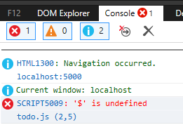
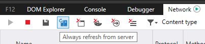
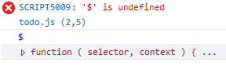
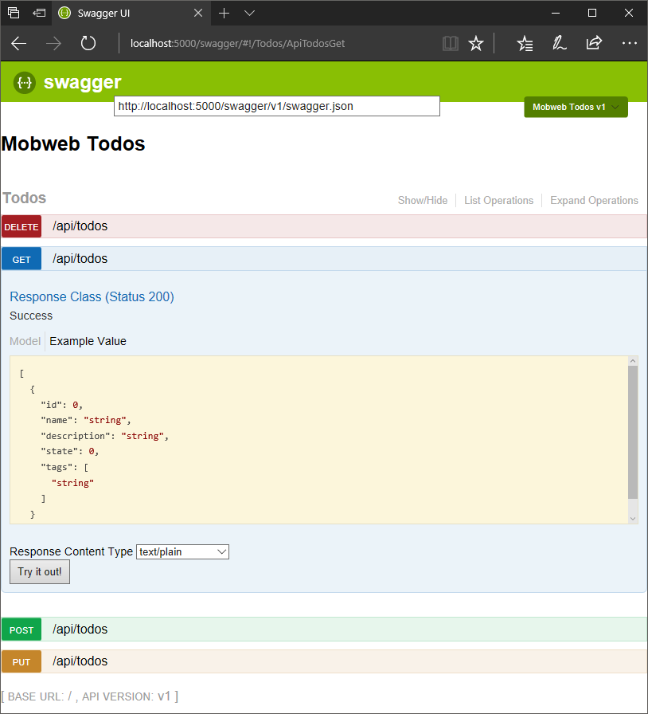
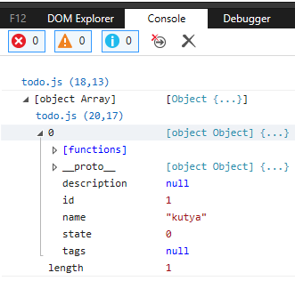

# Labor 12 - jQuery

[rep]: ./assets/rep.png "Dokumentálandó"

## Bevezetés

A labor folyamán a hallgatók a laborvezető segítségével vezetetten és önállóan végeznek feladatokat a webes technológiák gyakorlati megismerése érdekében.

Felhasznált technológiák és eszközök:

- webböngészők beépített hibakereső eszközei,

- .NET Core 1.1,

- Visual Studio Code kódszerkesztő alkalmazás,
  - otthoni vagy egyéni munkavégzéshez használható bármilyen más kódszerkesztő vagy fejlesztőkörnyezet.

### Jegyzőkönyv

Az elkészült jegyzőkönyvet egy PDF formájában kell feltölteni a tárgy oldalán, a szükséges további erőforrásokkal (projekt, HTML, CSS, JavaScript fájlok) egy ZIP fájlba csomagolva. Ügyeljen rá, hogy a ZIP fájlba artifakt ne kerüljön (fordítás eredményeképpen előálló fájlok, pl. a bin/obj mappa tartalma). Az eredmények is itt lesznek. A jegyzőkönyv sablonja DOCX formátumban [innen](./downloads/Labor12-jegyzokonyv.docx) letölthető.

A jegyzőkönyvben csak a szükséges mértékű magyarázatot várjuk el. Ahol másképpen nincs jelezve, eredményközlés is elegendő. Képernyőképek bevágásához a Windows-ban található **Snipping Tool** eszköz használható, vagy az **Alt+PrtScr** billentyűkombinációval az aktuálisan fókuszált ablak teljes egésze másolható.

A _hiányos_ vagy _túl bőbeszédű_ megoldásokra vagy a teljes jegyzőkönyvre helyes megoldás esetén is pontlevonás adható!

A laborvezető jelen dokumentum alapján vezeti végig a labort. A dokumentumban az alábbi módon van jelölve, hogy a jegyzőkönyvben dokumentálni szükséges egy-egy lépést:

---

### ![rep] Feladat 0 (0 pont)
    
    Töltse ki a jegyzőkönyvben található szükséges adatokat: a nevét, Neptun kódját, a labor idejét és helyét.

---

> Emlékeztetőként néhány gondolat a jQuery-ről:
>
> ### A jQuery
> 
> A [jQuery](http://jquery.com) egy "svájcibicska-szerű" JavaScript library. Jelentősége napjainkban az alkalmazásfejlesztő keretrendszerek javára egyre csökken, viszont az alapkoncepciók megértésére továbbra is hasznos eszköz. Elsősorban kiegészítésképpen használják különféle dinamikusan generált HTML tartalmakhoz történő dinamizmus hozzárendelésével, nem pedig teljes, önálló, kliensoldali alkalmazás fejlesztésére.
> 
> A [jQuery API](http://api.jquery.com/) a `$` (és ritkábban a `jQuery`) globális változón keresztül érhető el, alapvetően az alábbi módokon:
> - `var elements = $('ul li.active')`: a megadott CSS selectornak megfelelő DOM elemeket választja ki, és visszaadja egy *jQuery objektumban*. A bármilyen módon szerzett jQuery objektum hivatkozásokon az alábbihoz hasonló lehetőségeink vannak:
>   - A jQuery objektum példányai egyben tömbök, amik tartalmazzák a megtalált natív DOM elemeket (tehát iterálhatunk rajta), ill. a jQuery példányfüggvényeit tartalmazzák, amelyek elérik az illesztett DOM elemeket.
>   - `.show()`, `.hide()`, `.toggle()`: az illesztett elemeket megjeleníti vagy elrejti azáltal, hogy az elemre inline `display: none` stílust helyezi.
>   - `.append(e)`, `.appendTo(e)`, `.before(e)`, `.after(e)`, 
>   - `.attr()`: gyakori, hogy egy függvény getter-setterként működik, ilyen az attr is. Ha egy paramétert adunk át, az adott attribútum értékét kapjuk vissza, ha kettőt, a második paraméter az első néven adott attribútum értéke lesz (minden illesztett elemre).
>   - `.click()`, `.submit()` stb.: az adott JavaScript események elsütése (paraméter nélkül) vagy feliratkozás az eseményre (callback megadásával) az illesztett elemeken.
>   - `.on()`: eseménykezelő feliratkoztatása az adott névvel. Két paraméter esetén ha a második paraméter a callback, úgy az hívódik meg az adott elemen; ha a callback előtt egy szelektort is megadunk, az "élő" feliratkozás lesz az illesztett elemen belüli leszármazott gyerekekre.
> - `$(function () { /*...*/ })`: az így megadott függvény a dokumentum betöltődését követően fut le. Ekvivalens a `$(document).ready(function () { /*...*/} )` hívással.
> - `$.ajax()`, `$.get()`, `$.post()` stb.: a globális jQuery objektumon elérhető statikus függvények függetlenek az egyes DOM elemektől, ezek pl. aszinkron AJAX kérések végrehajtására használhatók.
> 
> ### jQuery pluginek
> 
> A jQuery kiegészítéseképpen egyszerűbb és bonyolultabb plugineket használhatunk. Ezek a pluginek jellemzően a jQuery objektumra újabb függvényeket helyeznek el, amelyek segítségével a kiegészítő funkcionalitás elérhető. A Boostrap kétféle módon teszi elérhetővé a plugineket: data-attibútumok formájában és a jQuery API-n keresztül. A fontosabbak pl.: `.modal()` `.dropdown()`, `.tooltip()`, `.alert()`, `.collapse()`. [Bővebben a Bootstrap jQuery pluginekről itt olvashat.](https://getbootstrap.com/docs/3.3/javascript/)
> 
> Gyakran használt pluginokat ad még pl. a [jQuery UI](https://jqueryui.com/), amiben dátum- és időválasztó, dialógusablak, progressbar stb. "widgetek" találhatók.

### Előkészítés

- Töltsük le és tömörítsük ki a kiinduló projektet az alábbi [linkről](./downloads/labor12-start.zip) egy üres munkamappába!

Az alkalmazás egy .NET Core alapú webalkalmazás, melyet Kestrel szerveren futtatunk. A webalkalmazás szerver oldali kódja az előző laboron megismert Todo elemeken fogja elvégezni a CRUD (create, read, update, delete) műveleteket egy REST API-n keresztül.
Az alkalmazás wwwroot mappájában találhatók a statikusan kiszolgált tartalmak: 
- `index.html`: a kiinduló fájl, statikus tartalommal,
- `todo.js`: a saját, egyelőre üres JavaScript fájlunk, ebben fogunk doldozni.

Az alkalmazás indítását az F5 billentyű lenyomásával érjük el. A .NET oldali kódot debugolni is tudjuk, viszont a célunk most nem a szerver oldali, hanem a kliens oldali alkalmazás elkészítése. Az indítást követően nem szükséges újraindítanunk a szervert. Az alkalmazás a http://localhost:5000/ URL-en érhető el.

> Amennyiben a szerverünk nem indul, futtassuk előbb a `dotnet restore` parancsot a beépített terminálból!

> A szerver újraindításával a memóriában tárolt adatok, így az összes todo elem elvész. Ez persze implementációfüggő, ez az implementáció nem tárolja diszken vagy DB-ben az adatokat.

### Kiinduló alkalmazás

Az első feladatunk, hogy a felület frissítését végző logikát megírjuk, hasonlóan az előző laboron látott `renderTodos()` függvényhez. A *todo.js*-be vegyük fel az alábbi kódrészletet:

``` JS

function renderTodos(todos) {
  $('#todo-list > .row').children().remove();
  for (var todo of todos || []) {
    // az elemek DOM-ba helyezése
  }
}

renderTodos(); // kezdetben eltávolítjuk az összes todo elemet a DOM-ból, a hiányzó paraméter a másik oldalon undefined-ként látszik majd

```

A függvény első sorát megvizsgálva láthatjuk a jQuery-ben jellemző **method chaining** módszert: kiválasztjuk a DOM-ban a `todo-list` ID-jú elemben található közvetlen `row` osztályú elemre, neki átnavigálunk a gyerekelemeire, és eltávolítjuk az így illesztett elemeket a DOM-ból.

Ha futtatjuk a kódot, hibát tapasztalunk.



> **Amennyiben a böngészőben nem látjuk a hibát, valószínűleg a böngésző cache-elte a régi (üres) JS fájlunkat, így ürítenünk kell a böngésző cache-t.** Jobb, ha ez automatikusan mindig megtörténik. Jellemzően a böngésző F12 eszköztárán a Network fülön tudjuk megadni, hogy **mindig frissítsen szerverről a böngésző**.
> 

A hiba oka, hogy a `$` változót nem találja a futtatókörnyezet. Ha a konzolba beírjuk: `$`, akkor láthatjuk, hogy a változó márpedig definiált.



**A hiba a sorrendben van.** A jQuery változót később definiáljuk, mégpedig sorrendben a saját fájlunk betöltődése és lefutása *után*, tehát amikor meghívjuk a `renderTodos()` függvényt, a `$` változó még nem definiált.

**Tegyük a saját fájlunkra történő hivatkozást a hivatkozott library-k után!** Ez általában jó megközelítés, ugyanis a függőségekre szeretnénk támaszkodni, ezért azoknak előbb definiálva kell lennie. A Bootstrap a jQuery-re hivatkozik, ezért a jQuery-t előbb kell hivatkoznunk a fájlunkban, mint a Bootstrapet, a mi alkalmazásunk pedig ezek mindegyikétől függ, tehát a sorrend az alábbi:

``` HTML

<script src="https://code.jquery.com/jquery-3.2.1.js"></script>
<link href="https://maxcdn.bootstrapcdn.com/bootstrap/3.3.7/css/bootstrap.min.css" rel="stylesheet">
<script src="https://maxcdn.bootstrapcdn.com/bootstrap/3.3.7/js/bootstrap.min.js"></script>
<script src="/todo.js"></script>

```

Most eltűnt a konzolról a hiba, viszont az egy helyőrző todo elemünk továbbra is látszik a DOM-ban. **A JavaScript kódunk hamarabb fut le, mint a DOM-ban megjelenik a törölni kívánt elem.** A JavaScript kódunk ugyanis szinkron lefut, amikor az alkalmazás elindul, még a HTML DOM sem jön teljesen létre, éppen a `<head>`-ben renderelünk, amikor próbálunk a `<body>` elemeire hivatkozni, azok viszont még nem léteznek. Iratkozzunk fel a dokumentum elkészültét jelző eseményre, ehhez válasszuk ki a `document` elemet jQuery-vel, és a `ready` 'eseményére' iratkozzunk fel:

``` JS

// renderTodos(); --- helytelen, a dokumentum még nem áll készen a manipulációra
$(document).ready(function(){
    renderTodos(); // a dokumentum elkészültét követően végezzük el az első renderelést
});

```

---

### ![rep] Feladat 1 (1 pont)
    
    Másoljon be egy képernyőképet a kezdeti állapotról, amikor nem látható a helyőrző elem a DOM-ban!

---

### Szerver oldali kommunikáció

A szerverrel történő kommunikáció aszinkron HTTP kapcsolato(ko)n keresztül történik. Natív JavaScriptben használhatjuk erre az `XMLHttpRequest` objektumot, ez viszont viszonylag alacsonyszintű, a legtöbb keretrendszer ezt felhasználva ad különféle burkoló megoldásokat. A jQuery a `.ajax()` hívásokat adja a fejlesztőknek, amivel aszinkron kéréseket tudnak konfigurálni és indítani.

Vegyünk fel egy todo elemet AJAX segítségével az alkalmazásba! Első lépésként a szerver felé kell küldenünk egy POST üzenetet, amiben új todo elemet hozunk létre. A lehetséges API végpontokat a http://localhost:5000/swagger/ oldalon látjuk, ahol tesztelni is tudjuk őket. Itt láthatjuk a visszatérési típust is, amelyre építeni tudunk az alkalmazásunkban.



A UI-t vizsgálva láthatjuk, hogy a POST kérésünknek az alábbi formában kell megtörténnie: `POST /api/todos`, ahol a kérés törzsében egy todo elemet kell elküldenünk. A todo elemben levő state változó számérték (a mögöttes enum számértéke), az alábbi értékeket veheti fel: **0: active, 1: inactive, 2: done**.

Ismét a form `submit` eseményére iratkozunk fel, viszont most jQuery-ből, és ennek hatására indítjuk az AJAX kérésünket, amiben az adatot elküldjük.

A `document.ready` feliratkozáson **belül**, a `renderTodos()` hívás után iratkozzunk fel az űrlap elküldésére:

``` JS

$("#new-todo-form").submit(function (e) {
    e.preventDefault();
    $.ajax("/api/todos", {
        contentType: "application/json",
        data: JSON.stringify({ name: $("#new-todo-title").val() }),
        method: 'POST'
    }).then(function (data) {
        console.log(data);
        $("#new-todo-form")[0].reset();
        $.get("/api/todos")
            .then(function (todos) {
                console.log(data);
                renderTodos(todos);
            }, console.error);
    }, console.error);
});

```

A `$("#new-todo-form")[0].reset();` sorral a teljes formot ürítjük, ami jelenleg az input ürítését jelenti. A jQuery által visszaadott objektum egyben egy tömb is, amely 0-s indexén az első, esetünkben egyetlen illesztett DOM elemet érjük el.

Érezhetjük, hogy a lekérdezés, majd renderelés gyakori művelet lehet a későbbiekben, ezért szervezzük ki egy saját függvénybe, hogy később is hivatkozhassunk rá:

``` JS
function getAndRenderTodos() {
    $.get("/api/todos")
        .then(function (todos) {
            console.log(data);
            renderTodos(todos);
      }, console.error);
}

```

> Ne felejtsük el a hivatkozott kódrészletet lecserélni! A kezdeti `renderTodos()` hívás után hívjunk ezen *felül* egy `getAndRenderTodos()`-t is (az első eltünteti a helyőrzőt, a második ténylegesen lekéri és megjeleníti az elemeket)!

Az űrlap küldésekor megakadályozzuk az eredeti működést (tehát az oldal újratöltését), majd egy POST-os AJAX kérést indítunk az `/api/todos` URL-re, amiben JSON-ként küldjük el az inputban levő értéket, mint a todo elem neve. A kérés itt egy Promise-szal tér vissza, ami egy feliratkozásokat kezelő objektum, a `.then()` metódusában 3 callback függvényt adhatunk meg: egyet **siker** esetére, egyet **hiba** esetére, és egyet **bármilyen válasz** esetére. A siker ágban a `console`-ra naplózzuk a választ, majd egy GET kérést is indítunk (ez egy rövidebb formája a `$.ajax`-nak), és lekérdezzük az elérhető todo elemeket. Ha ez is bekövetkezik, akkor ismét naplózunk, majd a `renderTodos()` függvény hívásával kitesszük a felületre az érkezett todo elemeket. Hiba esetén mindkét kérésre a `console.error` callbacket adjuk, tehát a `console.error` hívódik majd meg, ha hiba történt. Fontos, hogy magát a **függvényt** adjuk itt át, nem hívjuk meg a függvényt, ugyanis az meghívódna és visszatérne (`undefined`-dal), ami nem az elvárt callback.

> Best practice, hogy az AJAX kérések futása alatt a releváns mezőket le kell tiltanunk, vagy más módon megakadályozzuk a többszörös küldést, pl. egy modális ablakkal, ami explicit kitakarja a tartalmat.

Ha a konzolt megvizsgáljuk, láthatjuk, hogy valóban megérkezik a válaszban az aktuálisan létrehozott todo elem.



---

### ![rep] Feladat 2 (1 pont)
    
    Másoljon be egy képernyőképet a visszaérkezett válaszról, melyben legalább egy elem jelenik meg egy tömbben a böngésző konzolján!

---

### DOM manipuláció

A válasz tehát sikeresen megérkezik, viszont nem látjuk az újonnan létrejövő todo elemet, mert nem jelenítjük meg. A `renderTodos()` törzsét kell hát kitöltenünk:

``` JS

for (var todo of todos || []) {
    var setState = function (item, state) {
        // a todo új állapotának beállítása
    }
    var remove = function(item ) {
        // a todo törlése
    }
    $('#todo-list > .row').append(
        $('<div class="col-xs-6 col-sm-9 col-md-10">' +
            '<a class="list-group-item" href="#">' + todo.name + '</a>' +
            '</div>'),
        $('<div class="col-xs-6 col-sm-3 col-md-2 btn-group text-right"></div>')
            .append(
            [
                { title: 'Done', icon: 'ok', item: todo, onclick: function (todo) { setState(todo, 2) }, isDisabled: function (todo) { return todo.state == 2; } },
                { title: 'Active', icon: 'plus', item: todo, onclick: function (todo) { setState(todo, 0) }, isDisabled: function (todo) { return todo.state == 0; } },
                { title: 'Inactive', icon: 'minus', item: todo, onclick: function (todo) { setState(todo, 1) }, isDisabled: function (todo) { return todo.state == 1; } },
                { title: 'Remove', icon: 'trash', item: todo, onclick: function (todo) { remove(todo) }, isDisabled: function () { return false; } },
            ].map(function (button) {
                return $('<button class="btn btn-default btn-xs" title="' + button.title + '">' +
                    '<i class="glyphicon glyphicon-' + button.icon + '"></i>' +
                    '</button>').click(function () { button.onclick(button.item); }).attr("disabled", button.isDisabled(button.item));
            })
        )
    );
}

```

Szóval mi is történik itt? Definiálunk két változót (függvényt), melyek a gombra történő kattintáskor hívódnak majd meg.

Ezt követően egyetlen jQuery utasítással végezzük el az alábbiakat:
- A `#todo-list > .row` szelektor által visszaadott elem tartalmához hozzáfűzzük a todo elemet, mely a bal oldali oszlopban a todo elem nevét, a jobb oldali oszlopban a gombokat tartalmazza.
- A jobb oldali oszlopban létrehozzuk először a konténert, melybe a gombok kerülnek, és ebbe belefűzzük a tömbben jelölt modellek által meghatározott gombokat, melyekre már helyben ráfűzzük azt a callback függvényt, mely az anonim objektum `isDisabled` függvénye alapján beállítja, hogy le van-e tiltva a gomb (`disabled` attribútum), illetve regisztrálja a `click` eseménykezelőket.

> A gombhoz azért szükséges az `item` tulajdonságba az aktuális todo-t eltárolni, mert a JavaScript a ciklus futása során újrahasznosítja a lokális változót, így az mindig az utolsó értéken maradna, miután az eseménykezelőt beregisztráljuk.

---

### ![rep] Feladat 3 (1 pont)
    
    Másoljon be egy képernyőképet a listában megjelenő todo elemekről!

---

<hr/>

## **Önálló feladatok**

### Állapotmódosítás, törlés

Az állapotok módosítása most a szerveren fog történni. 

A gombokra történő kattintás a gomb modelljében található `onclick` tulajdonságot hívja meg, ami az állapotmódosítások esetében a `setState`, egyéb esetekben pedig a `remove` függvény hívását eredményezi a todo elemmel.

A gombok eseménykezelői tehát az alábbiak:

``` JS

var setState = function (item, state) {
    $.ajax('/api/todos', { contentType: "application/json", method: 'PUT', data: JSON.stringify({ id: item.id, name: item.name, state: state }) })
        .then(getAndRenderTodos, console.error);
}
var remove = function (item) {
    if (confirm("Are you sure you want to delete the todo titled '" + item.name + "'?")) {
        $.ajax("/api/todos?todoId=" + item.id, { method: "DELETE" }).then(getAndRenderTodos, console.error);
    }
}

```

---

### ![rep] Feladat 4 (0,5 pont)
    
    Illesszen be egy képernyőképet, melyen látszik mind a 4 CRUD művelet a Network fülön, és az eredményként kirenderelt todo elemek!

---

### Validáció

Az alkalmazás jelenleg engedi elmenteni az üres nevű elemet is. A beépített HTML alapú validáció az esetek túlnyomó többségében egyrészt nem illeszkedik az oldalunk tartalmába, másrészt az egyedi logikákat nem támogatja. A jQuery Validation plugin segítséget nyújthat a validáció használatában.

A jQuery plugint CDN-ről töltsük be, ezt a jQuery betöltése után, a saját kódunk betöltése előtt tegyük meg:

``` HTML

<script src="https://cdn.jsdelivr.net/npm/jquery-validation@1.17.0/dist/jquery.validate.js"></script>

```

A beviteli mezőre tegyünk validációt, mely kötelezőséget és az input hosszát vizsgálja meg! A validációhoz tehát szabályokat és üzeneteket kell rendelnünk:

``` JS

var val = $("#new-todo-form").validate({
    rules: {
        name: {
            required: true,
            minlength: 5
        }
    },
    messages: {
        name: {
            required: "The name of the To-Do is required.",
            minlength: "The minimum length of the To-Do name is 5 characters."
        }
    }
});

```

> Fontos! Az inputok validációját kivétel nélkül minden esetben **kötelező** elvégezni a szerveren! A kliensoldali validáció jellemzően a szoftver használhatóságát és felhasználóbaráttá tételét növeli, a szerveroldali viszont a biztonság miatt elengedhetetlen!

Több problémánk is akad:
- az űrlapot továbbra is el tudjuk küldeni (akkor is, ha hiba van),
- az űrlapon a validációs üzenet fennmarad elküldés után.

Ezek megoldásaképpen az űrlap elküldését a pluginen keresztül kell megtegyük, ill. ugyanígy kezelnünk kell a plugin belső állapotát is:
- tegyük a jQuery `.submit()` eseménykezelőnkben található AJAX kérésünk kódját a plugin opcióinak submitHandler tulajdonságába,
- a form resetelésén túl a validációs plugint is resetelnünk kell, ezt úgy tudjuk elérni, hogy a plugin konstruálásakor visszakapott és `val` változóban eltárolt elemen hívunk egy `resetForm()`-ot.

---

### ![rep] Feladat 5 (0,5 pont)
    
    Illesszen be egy-egy képernyőképet, melyen a JQuery Validate által megadott hibaüzenetünk jelenik meg a felületen, ha nincs kitöltve a beviteli mező, vagy ha nem éri el a minimum karakterszámot az elem neve!

---

### Tabok kezelése

---

### ![rep] Feladat 6 (1 pont)

A fülek kezelése az előző laboralkalmon demonstrálttal megegyező:
- a fül deklarációjában található `span.badge` elem tartalmát töltsük ki a releváns elemek számával, vagy hagyjuk üresen, ha az 0,
- az első fül mellett az összes elem száma, a fület kiválasztva az összes elem jelenjen meg,
- az adott fülre kattintva csak az adott állapotban található elemek legyenek láthatók,
- a szűrést **kliens oldalon** végezze el, tehát a fülek közti navigáció ne okozzon hálózati forgalmat,
- a szükséges elemek kiválasztásához és az eseménykezelők regisztrációjához jQuery-t használjon!
    
---

    Illesszen be egy-egy képernyőképet, melyen a különböző állapotokban levő elemekból legalább 1-1 látható!

---