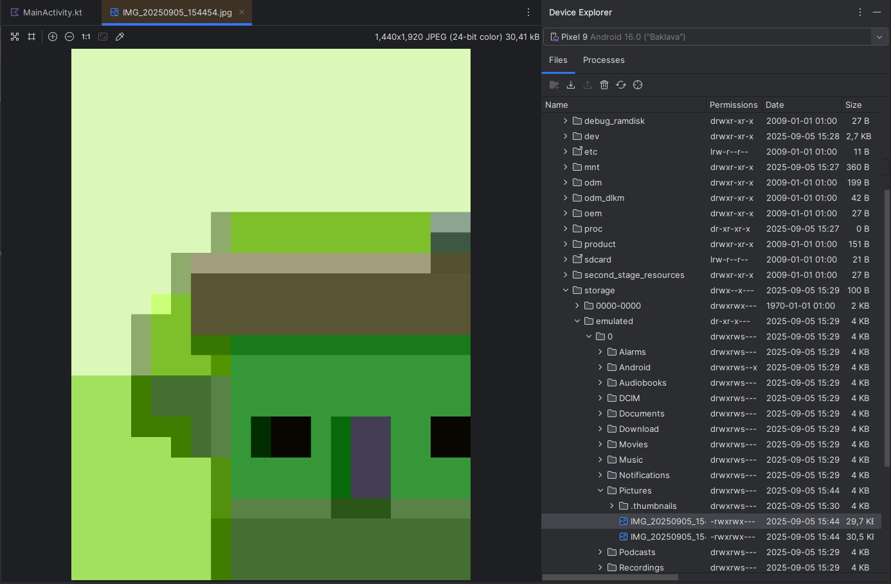

# Labor 01 - Hello World

The first lab is unusual compared to the others. Here we will encounter little code, the focus is more on reviewing the basics.

The goal of the lab is to introduce the Android Studio development environment, the process of creating, testing, and compiling applications, application management, and the functions of the emulator and development environment. We will explain how to create a Hello World application and the main tools used for debugging.

At the end of the lab, a report must be submitted to obtain a grade.

The assessment covers the following topics:

* Understanding the basics of the Android platform
* Android Studio development environment basics
* Android Emulator features
* Creating and running an Android project on an emulator
* Building a manifest file
* Android Profiler
* Android App Inspection

## Preparations

When solving the tasks, don't forget to follow the [task submission process](../github/GitHub.md).

### Create and download a Git repository

1. Find the lab invitation URL in Moodle and use it to create your own repository!

1. Wait for the repository to be ready, then checkout it!

    !!! tip ""
        In university labs, if the system does not ask for a username and password during checkout and the checkout fails, it is likely that the system tried to use a username previously saved on the machine. First, delete the saved login information, and try again.

1. Create a new branch called `solution` and work on this branch!

1. Write your Neptun code in the file `neptun.txt`. The file should contain nothing else but the 6 characters of the Neptun code on a single line!

### Open a Markdown file

When solving the tasks, the documentation must be prepared in markdown format. Open the previously downloaded git repository with a markdown compatible editor! It is recommended to use Visual Studio Code:

1. Start VS Code!

1. Open the git repository directory using the _File > Open Folder..._ menu!

1. In the tree on the left, find the `README.md` file and open it by double-clicking it!

    - Edit this file.
    - If you create an image, put it in the repository with the other files. This way you can reference it with a relative path (filename).

    !!! warning "Filename: all lowercase letters without accents"
        Do not use accented characters, spaces, or mixed case in image filenames. Different platforms and git handle filenames differently. Everything will display correctly on the GitHub web interface if you use only lowercase letters in your filenames.

1. For convenient editing, open the [preview function](https://code.visualstudio.com/docs/languages/markdown#_markdown-preview) (_Ctrl-K + V_).

!!! note "Other editing tools"
    If you don't like this editor, you can also use the [GitHub web interface](https://help.github.com/en/github/managing-files-in-a-repository/editing-files-in-your-repository) to edit the documentation, there is also a preview there. Then [uploading files](https://help.github.com/en/github/managing-files-in-a-repository/adding-a-file-to-a-repository) will be a little more complicated.

## Android Basics

### Compilation process on Android platform

After creating the project, the source code is located in the `app/src` directory. The user interface is defined directly in Kotlin code using Jetpack Compose, so there is no need for XML files. The result of compiling the Android project is an APK file, which can be installed directly on a mobile device. Jetpack Compose allows us to easily access and manipulate interface elements from Kotlin code, facilitating modern, declarative interface design.

*Compilation process on Android platform*

1. The developer creates the Kotlin source code, in which the user interface is defined using Jetpack Compose. There is no need for a separate XML-based user interface description.

2. The development environment keeps the resources related to Compose elements and the necessary build files for development and compilation constantly up to date.

3. The developer sets the application's access permissions in the Manifest file (e.g. Internet access, use of sensors, etc.), and if runtime permissions are required, they are managed.

4. The compiler generates the machine code of the [**ART**](https://source.android.com/docs/core/dalvik) virtual machine from the source code, resources and external libraries.

5. The unsigned APK file is generated from the machine code and resources.

6. Finally, the system performs the signing and produces a signed APK that can be installed on devices.

Android Studio uses the [Gradle](https://gradle.org/) build system to perform these steps.

!!! note "Notes"
    * The entire process takes place on the developer's machine, only binary files are delivered to the devices.

    * External libraries can usually be added to the current project as JAR files or by adding another project (but we don't have to do this manually, Gradle will also help with managing dependencies).

    * The APK file is most similar to the JAR files known in the Java world.

    * The Android version you want to support must be specified in the Manifest file, which is upwardly compatible with newer versions, but the application cannot be installed on older versions.

    * Developers must constantly keep up with the constantly updated versions of Android.

    * Android applications are typically published in the Google Play Store, so distribution in APK format is not as widespread.

### SDK and its libraries

The IDE and SDK can be downloaded from [developer.android.com/studio](https://developer.android.com/studio). Let's review its most important folders and tools!

SDK structure:

* `build-tools`: Tools to help build API levels: AIDL, AAPT2, etc.
* `emulator`: Location of Android emulator files.
* `extras`: Location of various extra software. Maven repository, support libs materials, analytics SDK, Google [Android USB driver](https://developer.android.com/studio/run/win-usb.html) (if we downloaded this with SDK manager) etc.
* `platform-tools`: Location of Fastboot and ADB binaries (most used tools).
* `platforms`, `sources`, `system-images`: Platform materials, sources, OS images in separate subfolders for each API level
* `tools`: Tools to help build and test, SDK manager, etc.

### SDK Manager

To manage the SDK, we use the SDK manager, which allows us to download and keep our tools up to date. It can be launched via Android Studio.

The SDK Manager is available from the Tools -> SDK Manager menu:

SDK Manager interface:

!!! note "Notes"
	There used to be a standalone SDK manager, but its use is now deprecated. Don't be surprised if you see it in online sources.

Let's start the AVD manager and check if everything we need for our first application is available.

### AVD Manager

AVD is the abbreviation for Android Virtual Device. As already mentioned in the presentation, we can run our code not only on a real device, but also on an emulator. (What is the difference between a simulator and an emulator?) Starting the AVD is possible through the development environment (*Tools->Device Manager*) or from the command line, but this is only necessary in special cases.

AVD Manager icon:

AVD Manager interface:

In the image above, on the right side, in the panel that opens, we find a list of existing virtual devices, and on the left side, the so-called device definitions. (This *Add device* tab can be opened with the *Create Virtual Device* option after clicking on the `+` icon on the right.) There are some pre-made templates available here. We can also create one ourselves if we typically want to develop for a specific device (e.g. Galaxy S24).

Let's create a new emulator! Naturally, we can only create devices with API levels that are available through the SDK manager.

1. On the right panel, click the *Create Virtual Device...* button above!
1. Select one of the predefined device templates (e.g. *Pixel 9 Pro*), then press the *Next* button.
1. Device configuration:
    - The virtual device should be named, for example, `Labor_1`.
    - Decide which Android emulator version you want to use and which features you need. CPU/ABI should be x86_64, as you can get [hardware acceleration](https://developer.android.com/studio/run/emulator-acceleration) for these. Here, select one of the available ones, then *Next*.

1. Under the *Additional settings* tab, you will find additional options:
    - Turn the display of the device frame on or off as desired.
    - Camera options:    
        - *WebcamX*, a hardware camera that is connected to the computer
        - *Emulated*, a simple software solution, **now at least one of the cameras should be like this**.
        - *VirtualScene*, a more sophisticated software solution, in which we can move the camera in a 3D world.
    - Network: You can also adjust its speed and latency according to communication technologies.
    - Select the default orientation.
    - *Default boot*: Option to save a snapshot of the Android emulator state. This means that the virtual operating system is only suspended when the emulator is closed (for example, the opened application is also preserved, with its full state), and in the *Quick* case, instead of starting the entire OS, the emulated system starts within seconds. In the *Cold* case, however, it stops and restarts the entire operating system of the virtual device every time.
    - Internal and external storage size, or possibly setting a specific image of the storage content.
    - Performance:
        - Number of CPU cores to be used.
        - Type of graphics acceleration. (Hardware acceleration is only available with the appropriate driver)
        - VM heap: for the virtual machine of the applications, you can leave the default value. You should know that it varies by manufacturer for devices.
        - The desired binary *interface*.

    - If everything looks fine in the window, then *Finish*!

The device we just created appears in the Android Virtual Device Manager. Here you can edit the previously specified parameters, connect an external device, delete user data from the "device" (*Wipe Data* - Full reset), and duplicate or delete the emulator instance.

Start the new emulator with the Play button!

!!! danger "Emulator problems"

    If the emulator does not start, check the following tips:
    * Is there enough space (minimum 15-20 GB) on the drive?
    * Are Android Studio and SDK up to date?
    * SDK manager > SDK tools: is the android emulator the latest?
    * Does the installation path of Android Studio or SDK contain spaces, accented letters or special characters?
    * Have you tried a different API, with or without Play Store?
    * Is virtualization enabled/enabled on the machine?
    * Try changing the graphics acceleration type.

Try some pre-installed applications on the launched emulator!

!!! note "Notes"
	In addition to the factory emulator, there are several alternatives, such as [Genymotion](https://www.genymotion.com/fun-zone/) or [BigNox](https://www.bignox.com/), but the Google emulator is the most common, so if you don't have any problems with it, let's stick with it.

The emulator is very useful for testing purposes, and it also provides the additional functions shown in the image below. It is possible to set a unique location, simulate an incoming call, manipulate sensors virtually, etc. The panel can be opened with the *...* button from the control buttons on the right side of the running emulator:

## Development environment

For Android development, we will use Android Studio, which is based on JetBrains IntelliJ, during the lab. A useful feature for those who are new to Studio is the *Tip of the day*, it is worth trying out and checking out the given feature right away. By default, the last project opens when starting up, if there is none, or if we have closed all our projects, then the opening screen. (You can also disable the reopening of the last project with the *Settings -> Appeareance & Behavior -> System Settings -> Reopen projects on startup* option.)

## Hello World

Let's make a simple Hello World application!

1. Create a new project, select the *Empty Activity* option.
2. The project name should be `HelloWorld`, the starting package `hu.bme.aut.mobweb.helloworld`, and the save location should be the `HelloWorld` folder within the checked-out repository.
3. Select *Kotlin* as the language.
4. The minimum API level should be API24: Android 7.0.
5. The `Build configuration language` should be Kotlin DSL.

!!!warning "FILE PATH"
	The project should be placed in the HelloWorld directory in the repository!

!!!danger "FILE PATH"
    The project's access path contains only lowercase letters of the English alphabet, as Android Studio is sensitive to accents and special characters!

### Android Studio

This section is for those who have previously used other IntelliJ products or the IDE called Eclipse and want to learn about the differences compared to Android Studio.

* **Project structure:** Android Studio compiles with Gradle and uses a different structure. Within a project:
    * `.idea`: IDE files
    * `app`: source
        * `build`: compiled files
        * `libs`: libraries
        * `src`: source code, within it a separate project for the test, and within it a `res` library, and `java`. Within the latter are the packages.
    * `gradle`: Gradle files

* **Useful features:**
    * IntelliSense, advanced refactoring support
    * If we reference a color or image resource in a line, it puts a miniature version at the beginning of the line.
    * If we specify an indirectly referenced resource (either `resources.get...` or `R...`), it collapses the reference and shows the actual value. Hovering over it reveals it, clicking expands the reference.
    * It can do the same with anonymous inner classes, improving code readability.
    * The search is free for code completion, it searches for word fragments, not for options starting with the word (see image)
    * Variable name suggestion: when we need a variable name, press *Ctrl+Space*. If the circumstances are right, Studio can suggest some pretty good names.
    * Strict lint. Studio allows warnings. Therefore, lint is stricter, it warns about more things (even small things like padding on one side of a View, but not on the other)
    * Layout editing. Graphical layout construction is possible.
    * You can navigate in the code by pressing CTRL, e.g. by clicking on a class or method call. This navigation (and also simple clicking on another class) is recorded, and you can step forward and backward in the history with the back and forth keys. If you have such a button on your mouse/keyboard, and you actively use it while browsing the net, you will find this function very useful.
    * If you have several files open at the same time, you can easily navigate between the files using the <kbd>ALT</kbd> + <kbd>LEFT</kbd>/<kbd>RIGHT</kbd> arrows.

### Keyboard shortcuts

* <kbd>CTRL</kbd> + <kbd>ALT</kbd> + <kbd>L</kbd>: Code formatting
* <kbd>CTRL</kbd> + <kbd>SPACE</kbd>: Code completion
* <kbd>SHIFT</kbd> + <kbd>F6</kbd> Rename (Everywhere)
* <kbd>F2</kbd>: Jump to next error. If there is no error, then to warning.
* <kbd>CTRL</kbd> + <kbd>Z</kbd> or <kbd>CTRL</kbd> + <kbd>SHIFT</kbd> + <kbd>Z</kbd>: Undo and Redo
* <kbd>CTRL</kbd> + <kbd>P</kbd>: Show Parameters
* <kbd>ALT</kbd> + <kbd>INSERT</kbd>: Generate Method
* <kbd>CTRL</kbd> + <kbd>O</kbd>: Override Method
* <kbd>CTRL</kbd> + <kbd>F9</kbd>: Compile
* <kbd>SHIFT</kbd> + <kbd>F10</kbd>: Compile and Run
* <kbd>SHIFT</kbd> <kbd>SHIFT</kbd>: Search Everywhere
* <kbd>CTRL</kbd> + <kbd>N</kbd>: Search in classes
* <kbd>CTRL</kbd> + <kbd>SHIFT</kbd> + <kbd>N</kbd>: Search in files
* <kbd>CTRL</kbd> + <kbd>ALT</kbd> + <kbd>SHIFT</kbd> + <kbd>N</kbd>: Search in symbols (e.g. functions, properties)
* <kbd>CTRL</kbd> + <kbd>SHIFT</kbd> + <kbd>A</kbd>: Search in settings, commands that can be issued.
* <kbd>ALT</kbd> + <kbd>ENTER</kbd> import/create missing elements.

[More keyboard shortcuts](https://developer.android.com/studio/intro/keyboard-shortcuts).

!!!tip "Find"
    If you ever need something but can't find it in the menu, you can search in Android Studio (or other JetBrains IDEs) by pressing the double Shift key (<kbd>Shift</kbd>+<kbd>Shift</kbd>). Try it out and search for the "Device Manager" option.

### Tools, editors

In the *View* menu, you can turn various windows on and off using the *Tool Windows* menu item. Let's take a look at the following tools:

* Project
* Structure
* TODO
* Logcat
* Terminal
* Event Log
* Gradle

It is possible to split the editor window, to do this, right-click on the tab of an open file, *Split Right/Down* or just click and hold it and start dragging it onto the code surface!

### Useful settings

Let's set up the following useful functions:

* turn off case sensitivity in the code completion (search in settings: *Match case*)
* turn on and off "laptop mode" (*File -> Power Save Mode*)
* turn on line numbering (right-click on the code on the left side, *Appearance -> Show Line Numbers*)

### Generateable elements

Studio includes many templates, let's briefly review the options:

* In the project tree, right-click on the project -> new -> module
* In the project tree, inside the module, right-click on "java" -> new
* In the source code, press <kbd>ALT</kbd>+<kbd>INSERT</kbd>

### Android Profiler

The device's resource usage can be [monitored](https://developer.android.com/studio/profile/android-profiler) on this interface, which can be accessed from the aforementioned *View -> Tool Windows*.

For example, we can get detailed information about processor and memory usage:

### App Inspection

We can also view the [network traffic](https://developer.android.com/studio/debug/network-profiler) and [database](https://developer.android.com/studio/inspect/database) of our debugged app on the device. (*View -> Tool Windows -> App Inspection*)

### Device Explorer

You can also [browse](https://developer.android.com/studio/debug/device-file-explorer) the file system on your device. (*View -> Tool Windows -> Device Explorer*)

## Tasks (10 x 0.5 points)

1. Run the new application on an emulator (those who have their own device should try it too)!
1. Place a breakpoint in the code and start the application in debug mode! (It is worth noting that another Gradle Task is now running at the bottom of the screen.)
1. Make a call and send an SMS to the emulator! What do we experience?
1. Make a call and send an SMS from the emulator! What do we experience?
1. Take a picture with the emulator and find it in the file system using Device Explorer!
1. Change the location of the device (GPS) using the appropriate panel of the emulator!
1. Examine the open threads and memory usage of the launched `HelloWorld` project!
1. Examine the contents of the Logcat panel!
1. Examine the result of Code -> Inspect code!
1. Find the folder of the created `HelloWorld` project and examine the contents of the `.apk` file inside the build directory! Where is the compiled code located?

!!! example "TO BE SUBMITTED"
    To complete the lab, you must perform the tasks above and document your results. This should be done with a screenshot and a short, few-sentence explanation for each task. The protocol should be created in the `README.md` file in the repository.

    The documentation, including the images, should also be displayed correctly on the GitHub web interface! Check this during your commit: open the web interface of your repository, switch to the appropriate branch, and GitHub will automatically render the README.md file with the images.
