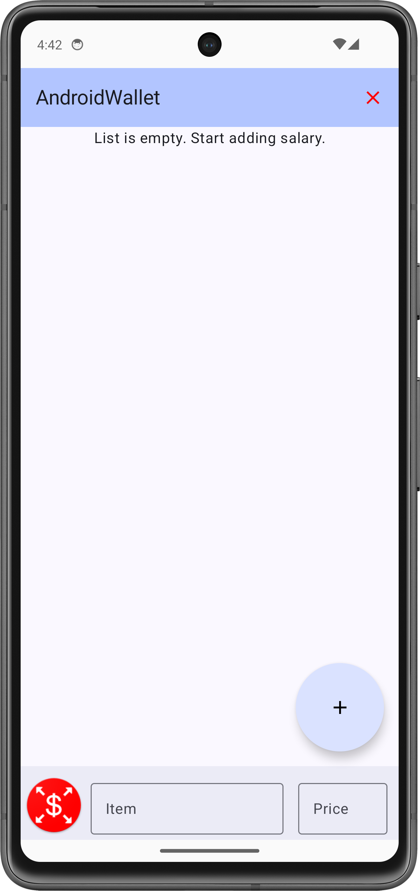

# Labor 03 - UI, LazyColumn - Expense and income management application

## Introduction

The goal of the lab is to design and implement a simple user interface on the Android platform, using Jetpack Compose.

The task is to create an application called AndroidWallet that can be used to log expenses and income. The basic functionality of the application is that the user can add their expenses and income to a list, delete them, or delete the entire list.

Sample image of the finished application:

<p align="center">

</p>

The structure and operation of the application are as follows:

- The home screen has a list (LazyColumn) and an input field. Here the user enters a name and an amount, specifies the direction of the payment flow, and then can save their transaction to the list. If any of the fields here are empty, we must prevent saving.
- Structure of a list item:
    - Icon depending on the direction of the payment flow.
    - The given name and the amount below it.
    - A button to delete the item.

### Technologies used:
- **Scaffold**, 
- TopBar, 
- BottomBar, 
- FloatingActionButton, 
- Column, 
- Row, 
- Image, 
- Text, 
- Spacer, 
- OutlinedTextField, 
- IconButton, 
- IconToggleButton, 
- **LazyColumn**
- data class


## Preparations

When solving the tasks, do not forget to follow the [task submission process](../github/).

### Creating and downloading a Git repository

1. Find the lab invitation URL in Moodle and use it to create your own repository.

1. Wait until the repository is ready, then checkout it.

    !!! tip ""
        In university labs, if the system does not ask for a username and password during checkout and the checkout fails, the system probably tried to use a username previously saved on the computer. First, delete the saved login data and try again.

1. Create a new branch called `solution` and work on this branch.

1. Write your Neptun code in the `neptun.txt` file. The file should contain nothing else, except the 6 characters of the Neptun code on a single line.

## Create a project

Let's create a project called AndroidWallet in Android Studio:

1. Create a new project, select the *Empty Activity* option.
1. The project name should be `AndroidWallet`, the starting package should be `hu.bme.aut.android.androidwallet`, and the save location should be the AndroidWallet folder within the checked out repository.
1. Select *Kotlin* as the language.
1. The minimum API level should be API24: Android 7.0.
1. The *Build configuration language* should be Kotlin DSL.

!!!danger "FILE PATH"
    The project should be placed in the AndroidWallet directory in the repository, and it should be pushed when submitted! Without the code, we cannot give the lab maximum points!

!!!danger "FILE PATH"
    The repository path should not contain accents or special characters, because AndroidStudio is sensitive to these, so the code will not be compiled. It is worth working in the root of the C:\\ drive.


## Creating the main screen

First, to avoid any problems with this later in development, let's insert our text resources into the `strings.xml` file:

```xml
<resources>
    <string name="app_name">AndroidWallet</string>
    <string name="item">Item</string>
    <string name="price">Price</string>
    <string name="label_empty_list">List is empty. Start adding salary.</string>
</resources>
```

Second, to make the UI seamless, let's create the data structure that will hold the data we want to store. We need a list that holds the data. In this list, we will store the following `SalaryData` *data class* objects. Create a `data` *package* inside our main *package*, and then add the `SalaryData` class to it:

```kotlin
package hu.bme.aut.android.androidwallet.data

data class SalaryData(
    val isIncome: Boolean,
    val item: String,
    val price: String
)
```

The three variables of the class represent the following:

- `isIncome - Boolean variable that is responsible for the income/expense status.`
- `item - name of the income/expense`
- `price - value of the income/expense`


Once we have the model class, we can move on to the user interface. Let's create the skeleton of the main screen, which we will fill with content during the lab. To do this, create a `screen` *package* within the `ui` *package*, and then a new Kotlin class named `MainScreen` inside it. Let's write the structure of the main screen based on the following code:

```kotlin
package hu.bme.aut.android.androidwallet.ui.screen

import androidx.compose.foundation.layout.padding
import androidx.compose.foundation.layout.safeDrawingPadding
import androidx.compose.material3.BottomAppBar
import androidx.compose.material3.ExperimentalMaterial3Api
import androidx.compose.material3.Scaffold
import androidx.compose.material3.Text
import androidx.compose.material3.TopAppBar
import androidx.compose.runtime.Composable
import androidx.compose.runtime.getValue
import androidx.compose.runtime.mutableStateListOf
import androidx.compose.runtime.mutableStateOf
import androidx.compose.runtime.remember
import androidx.compose.runtime.setValue
import androidx.compose.ui.Modifier
import androidx.compose.ui.platform.LocalContext
import androidx.compose.ui.tooling.preview.Preview
import hu.bme.aut.android.androidwallet.data.SalaryData

@OptIn(ExperimentalMaterial3Api::class)
@Composable
fun MainScreen() {
    val context = LocalContext.current
    val salaryItems = remember { mutableStateListOf<SalaryData>() }

    var isIncome by remember { mutableStateOf(false) }
    var item by remember { mutableStateOf("") }
    var price by remember { mutableStateOf("") }


    Scaffold(
        modifier = Modifier.safeDrawingPadding(),
        topBar = {

            ///TODO (topbar)
            TopAppBar(title = { Text(text = "TopAppbar") })

        },
        floatingActionButton = {
            ///TODO (floatingactionbutton)

        },
        content =
        { innerPadding ->

            ///TODO (list)
            Text(
                text = "content",
                modifier = Modifier.padding(innerPadding)
            )


        },
        bottomBar = {
            BottomAppBar {
                ///TODO (TextFields)
                Text(text = "BottomAppBar")

            }

        }
    )
}

@Composable
@Preview
fun PreviewMainScreen() {
    MainScreen()
}
```

The `MainScreen` contains a [`Scaffold`](https://developer.android.com/develop/ui/compose/components/scaffold) that helps us to structure the interface. The essence of `Scaffold` is that it provides a framework (stand) where we can insert our own *Composables* into predefined places ([holes](https://developer.android.com/develop/ui/compose/layouts/basics#slot-based-layouts)).

To make our application ready to run and to be able to test it after each step, let's replace the content of `MainActivity`:

```kotlin
package hu.bme.aut.android.androidwallet

import android.os.Bundle
import androidx.activity.ComponentActivity
import androidx.activity.compose.setContent
import androidx.activity.enableEdgeToEdge
import androidx.compose.runtime.Composable
import androidx.compose.ui.tooling.preview.Preview
import hu.bme.aut.android.androidwallet.ui.screen.MainScreen
import hu.bme.aut.android.androidwallet.ui.theme.AndroidWalletTheme

class MainActivity : ComponentActivity() {
    override fun onCreate(savedInstanceState: Bundle?) {
        super.onCreate(savedInstanceState)
        enableEdgeToEdge()
        setContent {
            AndroidWalletTheme {
                MainScreen()
            }
        }
    }
}

@Preview(showBackground = true)
@Composable
fun PreviewMainActivity() {
    AndroidWalletTheme {
        MainScreen()
    }
}
```

This is what our application currently looks like:

<p align="center">

</p>


### Creating the menu bar (1 point)

We want to have an `ActionBar` at the top of the screen with the name of the application and a delete option, or even a drop-down menu. As we saw above, the `Scaffold` *Composable* is very suitable for this implementation, as it has a *topBar* attribute, to which we can easily add such an `ActionBar`.

Let's create a new *package* in the existing `ui` package called `common`, and then within it a new *Kotlin* class called `TopBar`. Upload the file with the following code:

```kotlin
package hu.bme.aut.android.androidwallet.ui.common

import androidx.compose.material.icons.Icons
import androidx.compose.material.icons.filled.Clear
import androidx.compose.material3.ExperimentalMaterial3Api
import androidx.compose.material3.Icon
import androidx.compose.material3.IconButton
import androidx.compose.material3.MaterialTheme
import androidx.compose.material3.Text
import androidx.compose.material3.TopAppBar
import androidx.compose.material3.TopAppBarDefaults
import androidx.compose.runtime.Composable
import androidx.compose.ui.graphics.Color
import androidx.compose.ui.graphics.vector.ImageVector
import androidx.compose.ui.tooling.preview.Preview


@OptIn(ExperimentalMaterial3Api::class)
@Composable
fun TopBar(title: String, icon: ImageVector, onIconClick: () -> Unit) {
    TopAppBar(
        title = { Text(text = title) },
        actions = {
            IconButton(onClick = onIconClick) {
                Icon(imageVector = icon, contentDescription = "Delete", tint = Color.Red)
            }
        },
        colors = TopAppBarDefaults.topAppBarColors(containerColor = MaterialTheme.colorScheme.inversePrimary)
    )
}

@Preview
@Composable
@OptIn(ExperimentalMaterial3Api::class)
fun PreviewTopBar() {
    TopBar(title = "AndroidWallet", icon = Icons.Default.Clear) {

    }
}
```

In addition to the title and color, we have also given `TopAppBar` an action: an `IconButton` that will clear the list.

Once we have our `TopBar`, let's insert it into the appropriate place in the `Scaffold` in `MainScreen`. We do this as follows: we give it an arbitrary *title* (usually the name of the application), this time it will be *Android Wallet*, and then an icon. We will use the built-in icons of Android Studio. Then we need to provide a Lambda, which we use to describe what should happen if the user clicks on the icon. In this case, we need to empty our list. Since our list is stored as a state `val salaryItems = remember { mutableStateListOf<SalaryData>() }`, if a change occurs, all Composables that depend on it will be reinitialized:

```kotlin
Scaffold(
        modifier = Modifier.safeDrawingPadding(),
        topBar = {
            TopBar(
                title = stringResource(id = R.string.app_name),
                icon = Icons.Default.Clear,
                onIconClick = {
                    salaryItems.clear()
                }
            )
        },
        floatingActionButton = {
			...
```

If we are done with this, we should see the following in our application:

<p align="center">

</p>


With this `TopBar` is ready. Let's continue with the input part, which we will implement in the `BottomAppBar` at the bottom of the page.

!!!example "TO BE SUBMITTED (1 point)"
    Create a **screenshot** showing the **TopBar** *Composable* Kotlin code, your **Neptun code as a comment**, and the **running application** (on an emulator or by testing the device)! Upload the image to the repository in the solution as f1.png!

    The screenshot is a necessary condition for getting a score.


### Implementing input fields (1 point)

This time, we will implement the input part locally, not in a separate *Composable*, but in a `Scaffold` inside the `MainScreen`.

Here we will add an `IconButton` that shows the direction of the transaction, and then two `OutlinedTextField` for the name and price.

First, let's download the [resources](./downloads/res.zip) used for the transaction direction!

After downloading, copy the contents of the folder into the res folder containing the resources of our project. (...\AndroidWallet\app\src\main\res)

Paste the following code at the appropriate point in the `Scaffold`:

```kotlin
bottomBar = {
	BottomAppBar {
	
	    Row(
	        modifier = Modifier
	            .fillMaxWidth(),
	    ) {
	        IconToggleButton(
                modifier = Modifier.size(64.dp),
                checked = isIncome,
                onCheckedChange = { isIncome = !isIncome },
            ) {
                Image(
                    modifier = Modifier.size(64.dp),
                    painter = painterResource(id = if (isIncome) R.drawable.ic_income else R.drawable.ic_expense),
                    contentDescription = "expense/income button"
                )
            }
	        OutlinedTextField(
	            label = { Text(stringResource(R.string.item)) },
	            modifier = Modifier
	                .padding(start = 8.dp, end = 8.dp)
	                .weight(2f),
	            singleLine = true,
	            keyboardOptions = KeyboardOptions(keyboardType = KeyboardType.Text),
	            value = item,
	            onValueChange = {
	                item = it
	            }
	        )
	        OutlinedTextField(
	            label = { Text(stringResource(R.string.price)) },
	            modifier = Modifier
	                .padding(start = 8.dp, end = 8.dp)
	                .weight(1f),
	            singleLine = true,
	            keyboardOptions = KeyboardOptions(keyboardType = KeyboardType.Number),
	            value = price,
	            onValueChange = {
	                price = it
	            }
	        )
	    }
	}
}
```

Here we also make the necessary settings. Most of them are responsible for seeing a friendlier UI, but the most important ones are `value` and the `onValueChange` value, because if these are not set, the typed text will not be displayed. We pass the *item* value to `value`, and in the case of `onValueChange` we set it so that the variable gets a new value for each character typed. This allows us to see the value of the *TextField* at runtime.

!!!note "State-dependent display"
    One of the great advantages of *Jetpack Compose* can be clearly observed in the *painter* attribute of `Image`. We make the displayed image dependent on a state, which we can solve there:
	```kotlin
	...
	painter = painterResource(id = if (isIncome) R.drawable.ic_income else R.drawable.ic_expense)
	...
	```


### Adding a new element

We will add a new element when the `FloatingActionButton` button is pressed. Fortunately, `Scaffold` provides a place for this as well. So let's paste the following code:

```kotlin
floatingActionButton = {
    LargeFloatingActionButton(
        shape = CircleShape,
        onClick = {
            if (item.isNotEmpty() && price.isNotEmpty()) {
                salaryItems += SalaryData(isIncome, item, price)
            } else {

                Toast.makeText(
                    context,
                    "",
                    Toast.LENGTH_SHORT
                )
                    .show()
            }
        })
    {
        Image(
            imageVector = Icons.Default.Add,
            contentDescription = "save button"
        )
    }
},
```

In the case of the button here, we first check the *onClick* event with a condition. If the name or price is left blank, we warn the user with a `Toast` message. If the filling is correct, we add a new item to the *salaryItems* list according to the entered data. This item is an instance of the `data class` defined earlier.

Our interface currently looks like this:

<p align="center">

</p>


!!!example "TO BE SUBMITTED (1 point)"
    Create a **screenshot** showing the **MainScreen** code, **the running application** (on an emulator or by clicking on the device), and **your neptun code entered in the input field as an item in the list, or as a comment in the code**! Upload the image to the repository in the solution as f2.png!

    The screenshot is a necessary condition for obtaining a score.


## Creating a list (1 point)

###Creating a list item

We have the controls, but to create the list, we need to create a list item, which we will see in `LazyColumn`.

- Structure of a list item:
    - Icon depending on the direction of the payment flow.
    - The given name and the amount below it.
    - A button to delete the item.

Let's create a new *Kotlin* file called `SalaryCard` in the `ui/common` *package*.

It should look like this:

```kotlin
package hu.bme.aut.android.androidwallet.ui.common

import androidx.compose.foundation.Image
import androidx.compose.foundation.layout.Column
import androidx.compose.foundation.layout.Row
import androidx.compose.foundation.layout.Spacer
import androidx.compose.foundation.layout.fillMaxWidth
import androidx.compose.foundation.layout.padding
import androidx.compose.foundation.layout.size
import androidx.compose.material.icons.Icons
import androidx.compose.material.icons.filled.Delete
import androidx.compose.material3.IconButton
import androidx.compose.material3.Text
import androidx.compose.runtime.Composable
import androidx.compose.ui.Alignment
import androidx.compose.ui.Modifier
import androidx.compose.ui.graphics.Color
import androidx.compose.ui.res.painterResource
import androidx.compose.ui.text.font.FontWeight
import androidx.compose.ui.tooling.preview.Preview
import androidx.compose.ui.unit.dp
import androidx.compose.ui.unit.sp
import hu.bme.aut.android.androidwallet.R

@Composable
fun SalaryCard(isIncome: Boolean, item: String, price: String) {
    Row(
        modifier = Modifier
            .fillMaxWidth()
            .padding(8.dp)
    ) {
        Image(
            modifier = Modifier.size(64.dp),
            painter = painterResource(id = if (isIncome) R.drawable.ic_income else R.drawable.ic_expense),
            contentDescription = "Income/Expense"
        )
        Spacer(modifier = Modifier.size(8.dp))
        Column(modifier = Modifier.weight(1f)) {
            Text(
                fontSize = 24.sp,
                fontWeight = FontWeight.Bold,
                text = item,
                maxLines = 1
            )
            Spacer(modifier = Modifier.size(12.dp))
            Text(
                text = price,
                color = Color.Gray,
                maxLines = 1
            )
        }
        Spacer(modifier = Modifier.size(8.dp))
        IconButton(
            modifier = Modifier.align(Alignment.CenterVertically),
            onClick = {
                ///TODO
            }
        ) {
            Image(
                imageVector = Icons.Default.Delete,
                contentDescription = "delete button",
            )
        }
    }
}

@Composable
@Preview(showBackground = true)
fun PreviewIncomeSalaryCard() {
    SalaryCard(isIncome = true, item = "item", price = "500 Ft")
}

@Composable
@Preview(showBackground = true)
fun PreviewExpenseSalaryCard() {
    SalaryCard(isIncome = false, item = "item", price = "500 Ft")
}
```

The *SalaryCard* Composable function contains 3 parameters:

- `isIncome - Boolean variable that is responsible for the income/expense status.`
- `item - name of the income/expense`
- `price - value of the income/expense`

Within the function, you can find a `Row`, a `Spacer`, a `Column`, another `Spacer`, and an `ImageButton`. `Row` is responsible for placing the elements horizontally next to each other, and `Column` is responsible for placing the elements below each other. (The name and value of the income/expense.) We place the image with an `Image` *Composable*. Here, using `modifier`, there are many types of settings possible, now we will only deal with size to make the code more transparent. Using `painter`, we can specify the image we want to display, this is solved with an if-else branch, using the *isIncome* parameter. Once we have the `Image`, we place two `Text`s` inside the `Column` with the remaining two parameters. Solving the functionality of the delete button at the end of the row will be a separate task.


### Instantiating a List Item in LazyColumn

Finally, on our `MainScreen`, we implement the list in the `Scaffold` *content* section:

```kotlin
content =
{ innerPadding ->
    Box(
        modifier = Modifier
            .fillMaxSize()
            .padding(innerPadding)
    ) {
        if (salaryItems.size == 0) {
            Text(
                text = stringResource(R.string.label_empty_list),
                modifier = Modifier.fillMaxSize(),
                textAlign = TextAlign.Center,
            )
        } else
            LazyColumn(
                modifier = Modifier
                    .fillMaxSize()
            ) {
                items(salaryItems.size) {
                    SalaryCard(
                        isIncome = salaryItems[it].isIncome,
                        item = salaryItems[it].item,
                        price = "${salaryItems[it].price} Ft",
                    )
                    if (salaryItems.size - 1 > it) {
                        HorizontalDivider(modifier = Modifier.fillMaxWidth())
                    }
                }
            }

    }
},
```

Here we can also observe that depending on the number of elements (state) of the list, either a text or the `LazyColumn` list is placed on the interface.

Within `LazyColumn`, a size must be passed to the `items(..)` function, which indicates how big the list is. After that, the *Composable* element that we want to see in the list must be placed in the body of the block. This will be the `SalaryCard` *Composable*, which we have already implemented earlier. We will specify the current (`it`) elements of *salaryItems* as its parameter. `LazyColumn` will iterate through this and draw each element.

With this step, we have reached the finished application, and upon startup we should see the following:

<p align="center">

</p>


!!!example "TO BE SUBMITTED (1 point)"
    Create a **screenshot** showing the **LazyColumn** code, the running application (on an emulator or by pointing at the device), and your **neptun code as an item in the list or as a comment in the code**! Upload the image to the repository in the solution as f3.png!

    The screenshot is a necessary condition for obtaining a score.


## Independent tasks

### Summary field (1 point)

Let's add a summary field somewhere on the interface that updates after each value entered. Note that if there is no entry yet, nothing should be displayed, and that the user does not set the expense/income status based on a minus character, but rather we have to decide whether it is a positive or negative value based on the switch.

!!!warning "Warning"
    Let's pay attention to the correct functioning of the summary field! If we delete entries from the list, the counter should also be reset to zero and disappear! (It is not enough to remove it only if `sum` takes the value 0.) (-0.5 points)

!!!example "TO BE SUBMITTED (1 point)"
    Create a **screenshot** showing the **summary field in use** (on emulator, device mirroring or screen capture), **its code**, and **your neptun code as a product name**! Upload the image to the repository in the solution as f4.png!

    The screenshot is a necessary condition for obtaining a score.

### Deleting individual items (1 point)

The delete button is already present on each list item, but it doesn't work yet. Let's implement individual deletion!

!!!example "TO BE SUBMITTED (1 point)"
    Create a **screenshot** showing the **delete** code, the emulator of the working application, and your **Neptun code as an item in the list, or as a comment in the code**! Upload the image to the repository in the solution as f5.png!

    The screenshot is a necessary condition for obtaining a score.


### Bonus

Let's change the *TopBar* menu button to a dropdown menu with 3 options.

- Delete Expenses
- Delete Incomes
- Delete All

To do this, let's modify our TopBar Composable function.

???success "Help"
        - Plus two lambda operators
        - DropdownMenu
        - DropdownMenuItem
        - Using .filter on list/sum