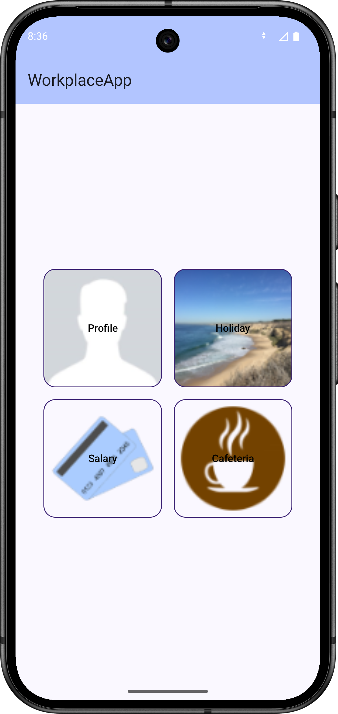
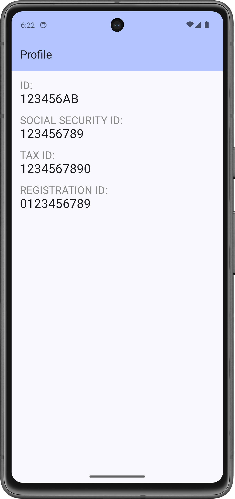

# Labor 04 - UI,HorizontalPager, Charts - HR application

## Introduction

During the lab, we will create an HR application, which allows the user to view their personal data and record time off. The application does not use persistent data storage or real login, it only works with demo data. The main topics of the lab will be creating interfaces with HorizontalPager and Charts.

<p align="center">





</p>


!!! warning "IMSc"
	After successfully completing the lab tasks, 2 IMSc points can be earned by solving the IMSc task.

## Rating

Grading:

- Main menu screen: 1 point
- Profile screen: 1 point
- Holiday screen: 1 point
- Date picker, reducing days: 1 point
- Independent task (further development of holiday): 1 point

IMSc: Implementation of the payment menu item

- Pie chart: 1 IMSc point
- Bar chart: 1 IMSc point

## Preparations

When solving the tasks, do not forget to follow the [task submission process](../github/).

### Creating and downloading a Git repository

1. Find the lab invitation URL in Moodle and use it to create your own repository.

2. Wait until the repository is ready, then checkout it.

    !!! tip ""
        In university labs, if the system does not ask for a username and password during checkout and the checkout fails, the system probably tried to use a username previously saved on the computer. First, delete the saved login data and try again.

3. Create a new branch called `solution` and work on this branch.

4. Write your Neptun code in the `neptun.txt` file. The file should contain nothing else, except the 6 characters of the Neptun code on a single line.

## Create a project

Let's create a project called WorkplaceApp in Android Studio:

1. Create a new project, select *Empty Activity*.
1. The project name should be `WorkplaceApp`, the starting package `hu.bme.aut.android.workplaceapp`, and the save location should be the WorkplaceApp folder within the checked out repository.
1. Select *Kotlin* as the language.
1. The minimum API level should be API24: Android 7.0.
1. The *Build configuration language* should be Kotlin DSL.

!!!danger "FILE PATH"
    The project should be placed in the WorkplaceApp directory in the repository, and it should be pushed when submitted! Without the code, we cannot give maximum points to the lab!

!!!danger "FILE PATH"
    The repository path should not contain accents or special characters, as AndroidStudio is sensitive to these and the code will not compile. It is worth working in the root of the C:\\ drive.

Once our project is complete, let's update the version of our dependencies in the `libs.versions.toml` file:

`libs.versions.toml`

```toml
[versions]
agp = "8.12.3"
kotlin = "2.2.20"
coreKtx = "1.17.0"
junit = "4.13.2"
junitVersion = "1.3.0"
espressoCore = "3.7.0"
lifecycleRuntimeKtx = "2.9.4"
activityCompose = "1.12.0-alpha09"
composeBom = "2025.09.01"
...
```

First, download the [compressed file] containing the application images (./downloads/res.zip) and extract it. Copy the mipmap directory in it to the app/src/main/res folder (in Studio, while standing in the res folder, press `Ctrl+V`).

!!!info "Managing screens in Android apps"
	Most mobile applications are built from a combination of distinct pages/screens. One of the first major decisions we make when designing an application is how to structure these screens and how to navigate between them. For an Android-based application, there are several options:

    - *Activity-based approach*: Each screen is an **Activity**. Since **Activity** is a system-level component of Android, the operating system is responsible for its management. We never instantiate it directly, but send an **Intent** to the system. The system is also responsible for navigation, and we can set certain options using *flags*.
    - *Composable-based approach*: In this case, our screens are built from one or more *Composable* elements. These are managed at the application level, which is why an **Activity** is definitely required, which is responsible for the display. The display and navigation are performed by the **AppNavigation** class.
    - *Other unique solution*: Using an external or own library for the display, which is typically derived from the basic **View** class. Examples include the old *Conductor* and *Jetpack Compose*.

    In Jetpack Compose, **AppNavigation** is now responsible for navigation and calls each *Composable* function separately.


## Create a main menu screen (1 point)

The first screen we will create will be the main page, from which we can navigate to the other pages. During the lab, we will implement 2 functions, these are Profile and Freedom.

On the `MenuScreen`, we want to display a *TopAppBar* and buttons. 

<p align="center">

</p>

### Components

First, let's create a `hu.bme.aut.android.workplaceapp.ui.common` *package*. This will contain our essential UI building blocks:

`TopBar.kt`: 

```kotlin
package hu.bme.aut.android.workplaceapp.ui.common

import androidx.compose.material3.ExperimentalMaterial3Api
import androidx.compose.material3.MaterialTheme
import androidx.compose.material3.Text
import androidx.compose.material3.TopAppBar
import androidx.compose.material3.TopAppBarDefaults
import androidx.compose.runtime.Composable
import androidx.compose.ui.tooling.preview.Preview

@OptIn(ExperimentalMaterial3Api::class)
@Composable
fun TopBar(
    label: String = "Title"
) {
    TopAppBar(
        title = { Text(text = label) },
        colors = TopAppBarDefaults.topAppBarColors(
            containerColor = MaterialTheme.colorScheme.inversePrimary
        )
    )
}

@Composable
@Preview
fun PreviewTopBar() {
    TopBar("Workplace App")
}
```

This is a simple *AppBar*. With which we can place a title, different *actions*, and buttons.

`ImageButton`:

```kotlin
package hu.bme.aut.android.workplaceapp.ui.common

import androidx.compose.foundation.BorderStroke
import androidx.compose.foundation.Image
import androidx.compose.foundation.layout.Box
import androidx.compose.foundation.layout.PaddingValues
import androidx.compose.foundation.layout.padding
import androidx.compose.foundation.layout.size
import androidx.compose.foundation.shape.RoundedCornerShape
import androidx.compose.material3.OutlinedButton
import androidx.compose.material3.Text
import androidx.compose.material3.darkColorScheme
import androidx.compose.runtime.Composable
import androidx.compose.ui.Alignment
import androidx.compose.ui.Modifier
import androidx.compose.ui.graphics.Color
import androidx.compose.ui.graphics.painter.Painter
import androidx.compose.ui.layout.ContentScale
import androidx.compose.ui.res.painterResource
import androidx.compose.ui.tooling.preview.Preview
import androidx.compose.ui.unit.Dp
import androidx.compose.ui.unit.dp
import hu.bme.aut.android.workplaceapp.R

@Composable
fun ImageButton(
    modifier: Modifier,
    label: String,
    painter: Painter,
    size: Dp,
    contentDescription: String? = null,
    onClick: () -> Unit
) {
    OutlinedButton(
        onClick = onClick,
        shape = RoundedCornerShape(16.dp),
        contentPadding = PaddingValues(
            start = 0.dp,
            top = 0.dp,
            end = 0.dp,
            bottom = 0.dp
        ),
        border = BorderStroke(1.dp, darkColorScheme().onPrimary)

    ) {
        Box(modifier = modifier.padding(0.dp)) {
            Image(
                contentScale = ContentScale.Crop,
                modifier = modifier
                    .align(Alignment.Center)
                    .size(size),
                painter = painter,
                contentDescription = contentDescription
            )
            Text(
                color = Color.Black,
                modifier = modifier.align(Alignment.Center),
                text = label
            )

        }
    }
}

@Composable
@Preview
fun PreviewImageButton() {
    ImageButton(
        modifier = Modifier,
        label = "Holiday",
        painter = painterResource(id = R.drawable.holiday),
        size = 160.dp,
        contentDescription = "Holiday",
        onClick = {}
    ) 
}
```

This is a simple button, on which we can easily place images and text. In order to use it universally, the essential attributes (text, image, size, onClick) have been removed as parameters.

### Screen

Now we have everything we need to write our `MainScreen` screen. To do this, let's create a new `hu.bme.aut.android.workplaceapp.ui.screen` *package*. In this, our screens will be in separate *packages*. In the `hu.bme.aut.android.workplaceapp.ui.screen.menu` *package*, we will create the `MenuScreen` *Kotlin File*:

```kotlin
package hu.bme.aut.android.workplaceapp.ui.screen.menu

import androidx.compose.foundation.background
import androidx.compose.foundation.layout.Box
import androidx.compose.foundation.layout.Column
import androidx.compose.foundation.layout.Row
import androidx.compose.foundation.layout.Spacer
import androidx.compose.foundation.layout.fillMaxSize
import androidx.compose.foundation.layout.height
import androidx.compose.foundation.layout.padding
import androidx.compose.foundation.layout.width
import androidx.compose.material3.MaterialTheme
import androidx.compose.material3.Scaffold
import androidx.compose.runtime.Composable
import androidx.compose.ui.Alignment
import androidx.compose.ui.Modifier
import androidx.compose.ui.res.painterResource
import androidx.compose.ui.res.stringResource
import androidx.compose.ui.tooling.preview.Preview
import androidx.compose.ui.unit.dp
import hu.bme.aut.android.workplaceapp.R
import hu.bme.aut.android.workplaceapp.ui.common.ImageButton
import hu.bme.aut.android.workplaceapp.ui.common.TopBar

@Composable
fun MenuScreen(
    modifier: Modifier = Modifier,
    onProfileButtonClick: () -> Unit,
    onHolidayButtonClick: () -> Unit,
    onSalaryButtonClick: () -> Unit,
    onCafeteriaButtonClick: () -> Unit
) {
    Scaffold (
        topBar = { TopBar(label = stringResource(id = R.string.app_name)) }
    ) { innerPadding ->
        Box(
            modifier = modifier
                .fillMaxSize()
                .background(MaterialTheme.colorScheme.background)
                .padding(innerPadding),
            contentAlignment = Alignment.Center
        ) {
            Row(verticalAlignment = Alignment.CenterVertically) {
                Column(horizontalAlignment = Alignment.CenterHorizontally) {
                    ImageButton(
                        onClick = onProfileButtonClick,
                        modifier = modifier,
                        label = stringResource(R.string.label_profile),
                        painter = painterResource(id = R.drawable.profile),
                        size = 160.dp,
                        contentDescription = stringResource(R.string.label_profile)
                    )
                    Spacer(
                        modifier = Modifier.height(16.dp)
                    )
                    ImageButton(
                        onClick = onSalaryButtonClick,
                        modifier = modifier,
                        label = stringResource(R.string.label_salary),
                        painter = painterResource(id = R.drawable.payment),
                        size = 160.dp,
                        contentDescription = stringResource(R.string.label_salary)
                    )

                }
                Spacer(
                    modifier = Modifier.width(16.dp)
                )
                ///TODO
            }
        }
    }
}

@Preview
@Composable
fun MenuScreenPreview() {
    MenuScreen(
        onProfileButtonClick = {},
        onHolidayButtonClick = {},
        onCafeteriaButtonClick = {},
        onSalaryButtonClick = {}
    )
}
```

Following this example, let's implement the other two buttons with the following values:

|Text|Image|
|------|---|
|`Holiday`|`@drawable.holiday`|
|`Cafeteria`|`@drawable.cafeteria`|

Let's create the referenced text resources! (While standing on the text, press <kbd>ALT</kbd>+<kbd>ENTER</kbd>)


### Navigation

Let's add the Navigation3 library to our project. To do this, we will need the module-level `build.gradle.kts` file and the `libs.versions.toml` file. Find these and add the following dependency:

`libs.versions.toml`
```toml
[versions]
...
coreSplashscreen = "1.0.1"
nav3Core = "1.0.0-alpha10"
kotlinSerialization = "2.2.20"
kotlinxSerializationCore = "1.9.0"


[libraries]
...
androidx-core-splashscreen = { module = "androidx.core:core-splashscreen", version.ref = "coreSplashscreen" }
androidx-navigation3-runtime = { module = "androidx.navigation3:navigation3-runtime", version.ref = "nav3Core" }
androidx-navigation3-ui = { module = "androidx.navigation3:navigation3-ui", version.ref = "nav3Core" }
kotlinx-serialization-core = { module = "org.jetbrains.kotlinx:kotlinx-serialization-core", version.ref = "kotlinxSerializationCore" }


[plugins]
jetbrains-kotlin-serialization = { id = "org.jetbrains.kotlin.plugin.serialization", version.ref = "kotlinSerialization"}

```

After that, add our dependencies to the module-level `build.gradle.kts` file:

`build.gradle.kts`

```kts
dependencies {
...
implementation(libs.androidx.core.splashscreen)
implementation(libs.androidx.navigation3.ui)
implementation(libs.androidx.navigation3.runtime)
implementation(libs.kotlinx.serialization.core)
}
```

Finally, enable the following plugin in the build.gradle.kts file at the top:

```kts
plugins {
...
alias(libs.plugins.jetbrains.kotlin.serialization)
}
```

Once we are done with this, we will synchronize the project with the `Sync Now` button in the upper right corner.

!!!warning "Sync"
    Don't forget to synchronize, because if this step is skipped, it will not find the necessary dependencies, and this may cause problems later!


To implement navigation, similarly to what we learned in previous labs, we will need an `AppNavigation` *Composable* class that controls navigation and a `Screen` *interface* that collects *destinations*.

Let's create them in the `hu.bme.aut.android.workplaceapp.ui.navigation` *package*. Currently, only our `MenuScreen` will be included, we will expand this later:

`Screen.kt`:

```kotlin
package hu.bme.aut.android.workplaceapp.ui.navigation

import androidx.navigation3.runtime.NavKey
import kotlinx.serialization.Serializable

interface Screen : NavKey {
    @Serializable
    data object MenuScreenDestination: Screen
```


`AppNavigation.kt`:

```kotlin
package hu.bme.aut.android.workplaceapp.ui.navigation

import androidx.compose.runtime.Composable
import androidx.compose.runtime.mutableStateListOf
import androidx.compose.runtime.remember
import androidx.compose.ui.Modifier
import androidx.navigation3.runtime.entryProvider
import androidx.navigation3.ui.NavDisplay
import hu.bme.aut.android.workplaceapp.ui.screen.menu.MenuScreen

@Composable
fun AppNavigation(modifier: Modifier = Modifier) {
    val backStack = remember { mutableStateListOf<Screen>(Screen.MenuScreenDestination) }

    NavDisplay(
        modifier = modifier,
        backStack = backStack,
        onBack = { backStack.removeLastOrNull() },
        entryProvider = entryProvider {

            entry<Screen.MenuScreenDestination> {
                MenuScreen(
                    onProfileButtonClick = {},
                    onSalaryButtonClick = {},
                    onHolidayButtonClick = {},
                    onCafeteriaButtonClick = {}
                )
            }
        }
    )
}
```

!!!info "sealed class"
	Kotlin's *sealed classes* are classes that have limited inheritance and all their descendants are known at compile time. We can use these classes in a similar way to enums. In this case, Menu is not actually a direct descendant of Screen, but an anonymous descendant.

To use navigation, we call the `AppNavigation` *composable* in `MainActivity`, which automatically brings up the configured main screen when the application is launched.

```kotlin
package hu.bme.aut.android.workplaceapp

import android.os.Bundle
import androidx.activity.ComponentActivity
import androidx.activity.compose.setContent
import androidx.activity.enableEdgeToEdge
import hu.bme.aut.android.workplaceapp.ui.navigation.AppNavigation
import hu.bme.aut.android.workplaceapp.ui.theme.WorkplaceAppTheme

class MainActivity : ComponentActivity() {
    override fun onCreate(savedInstanceState: Bundle?) {
        super.onCreate(savedInstanceState)
        enableEdgeToEdge()
        setContent {
            WorkplaceAppTheme {
                AppNavigation()
            }
        }
    }
}
```

!!!info "Multiple Navigation Graphs"
    Using the Navigation3 library it is possible to create and manage multiple navigation graphs, however for most applications a single navigation class is sufficient.


If we start the application now, we see all 4 buttons, but none of them work yet.

!!!example "TO BE SUBMITTED (1 point)"
    Make a **screenshot** showing the **finished homepage image** (on an emulator, mirroring the device or with a screen capture), a **corresponding code snippet**, and your **neptun code somewhere in the code as a comment**! Upload the image to the repository in the solution as f1.png!

    The screenshot is a necessary condition for obtaining a score.


## Creating a Profile Screen (1 point)

The Profile screen will consist of two pageable pages (`HorizontalPager`), which will contain the following information:

- First page
    - Name
    - Email
    - Address
- Second page
    - Personal number
    - Social security number
    - Tax number
    - Social security number

### Data model

Let's create a `data` *package*, with a `Person` data class inside. This is where we will store the data that appears on the pages. For data type classes, Kotlin automatically generates commonly used functions. For example, the `equals()` and `hashCode()` functions for comparing different objects, and a `toString()` function that returns the value of the stored variables.


```kotlin
package hu.bme.aut.android.workplaceapp.data

data class Person(
    val name: String,
    val email: String,
    val address: String,
    val id: String,
    val socialSecurityNumber: String,
    val taxId: String,
    val registrationId: String
)
```

To access the instance of the *Person* class, let's create a `DataManager` class (also inside the `data` *package*). This will simulate real data access (we use the Singleton pattern to make it easily accessible from all parts of the application, using the object keyword provided by Kotlin):

```kotlin
package hu.bme.aut.android.workplaceapp.data

object DataManager {
    val person = Person(
        "Test User", "testuser@domain.com",
        "1234 Test, Random Street 1.",
        "123456AB",
        "123456789",
        "1234567890",
        "0123456789"
    )
}
```

On the profile page, our goal is to display the normal and detailed data in two separate sections. You can move between the two pages with a horizontal swipe. For this, we will use a **HorizontalPager**, which can implement such interactions between Composable functions.

### Components

First, let's create a helper *Composable* called `InfoField` in the `hu.bme.aut.android.workplaceapp.ui.common` *package*, which will help display the data:

```kotlin
package hu.bme.aut.android.workplaceapp.ui.common

import androidx.compose.foundation.layout.Column
import androidx.compose.foundation.layout.padding
import androidx.compose.material3.Text
import androidx.compose.runtime.Composable
import androidx.compose.ui.Modifier
import androidx.compose.ui.graphics.Color
import androidx.compose.ui.tooling.preview.Preview
import androidx.compose.ui.unit.dp
import androidx.compose.ui.unit.sp

@Composable
fun InfoField(title: String, value: String) {
    Column(
        modifier = Modifier.padding(bottom = 16.dp)
    ) {
        Text(
            color = Color.Gray,
            text = title,
            fontSize = 20.sp
        )
        Text(
            text = value,
            fontSize = 24.sp
        )
    }
}

@Preview
@Composable
fun PreviewInfoField() {
    InfoField(title = "Name", value = "Test User")
}
```

## Screen

After that, let's create our two profile pages. We create the following files in the `hu.bme.aut.android.workplaceapp.feature.profile` *package*:

`ProfileFirstPage`

```kotlin
package hu.bme.aut.android.workplaceapp.ui.screen.profile

import androidx.compose.foundation.layout.Column
import androidx.compose.foundation.layout.fillMaxSize
import androidx.compose.foundation.layout.padding
import androidx.compose.runtime.Composable
import androidx.compose.ui.Modifier
import androidx.compose.ui.tooling.preview.Preview
import androidx.compose.ui.unit.dp
import hu.bme.aut.android.workplaceapp.ui.common.InfoField

@Composable
fun ProfileFirstPage(
    name: String,
    email: String,
    address: String
) {
    Column(
        modifier = Modifier
            .padding(16.dp)
            .fillMaxSize()
    ) {
        InfoField(title = "NAME:", value = name)
        InfoField(title = "EMAIL:", value = email)
        InfoField(title = "ADDRESS:", value = address)
    }
}

@Preview(showBackground = true)
@Composable
fun PreviewProfileFirstPage() {
    ProfileFirstPage(
        name = "Test User",
        email = "test@email",
        address = "Test Street"
    )
}
```

This *Composable* function will be responsible for the first page, and the next one for the second page.

`ProfileSecondPage`

```kotlin
package hu.bme.aut.android.workplaceapp.feature.profile

import androidx.compose.foundation.layout.Column
import androidx.compose.foundation.layout.fillMaxSize
import androidx.compose.foundation.layout.padding
import androidx.compose.runtime.Composable
import androidx.compose.ui.Modifier
import androidx.compose.ui.tooling.preview.Preview
import androidx.compose.ui.unit.dp
import hu.bme.aut.android.workplaceapp.ui.view.InfoField

@Composable
fun ProfileSecondPage(
    id: String,
    socialSecurityId: String,
    taxId: String,
    registrationId: String
) {
    Column(
        modifier = Modifier
            .padding(16.dp)
            .fillMaxSize()
    ) {
        InfoField(title = "ID:", value = id)
        InfoField(title = "SOCIAL SECURITY ID:", value = socialSecurityId)
        InfoField(title = "TAX ID:", value = taxId)
        InfoField(title = "REGISTRATION ID:", value = registrationId)
    }
}

@Preview(showBackground = true)
@Composable
fun PreviewProfileSecondPage() {
    ProfileSecondPage(
        id = "123456",
        socialSecurityId = "A89FSE568TZ",
        taxId = "GO894GE56",
        registrationId = "R6879SDLTH"
    )
}
```

The parameters of the functions will be the profile data in String format.

Once we have these, let's create our *Composable* function called `ProfileScreen` as follows:

```kotlin
package hu.bme.aut.android.workplaceapp.ui.screen.profile

import androidx.compose.foundation.ExperimentalFoundationApi
import androidx.compose.foundation.layout.fillMaxSize
import androidx.compose.foundation.layout.padding
import androidx.compose.foundation.pager.HorizontalPager
import androidx.compose.foundation.pager.rememberPagerState
import androidx.compose.material3.Scaffold
import androidx.compose.runtime.Composable
import androidx.compose.ui.Modifier
import androidx.compose.ui.res.stringResource
import androidx.compose.ui.tooling.preview.Preview
import hu.bme.aut.android.workplaceapp.R
import hu.bme.aut.android.workplaceapp.data.DataManager
import hu.bme.aut.android.workplaceapp.ui.common.TopBar

@OptIn(ExperimentalFoundationApi::class)
@Composable
fun ProfileScreen(
    modifier: Modifier = Modifier
) {
    Scaffold(
        topBar = {
            TopBar(stringResource(id = R.string.label_profile))
        }
    ) { innerPadding ->
        val pagerState = rememberPagerState(pageCount = { 2 })
        val profile = DataManager.person
        
        HorizontalPager(
            modifier = modifier
                .padding(innerPadding)
                .fillMaxSize(),
            state = pagerState
        ) {

            when (it) {
                0 -> {
                    ProfileFirstPage(
                        name = profile.name,
                        email = profile.email,
                        address = profile.address
                    )
                }

                1 -> {
                    ProfileSecondPage(
                        id = profile.id,
                        socialSecurityId = profile.socialSecurityNumber,
                        taxId = profile.taxId,
                        registrationId = profile.registrationId
                    )
                }
            }
        }
    }
}

@Composable
@Preview
fun PreviewProfileScreen() {
    ProfileScreen()
}
```

Here we first need to create a variable called `pagerState`, which we will pass to `HorizontalPager`. This contains how many pages there will be on the given *Composable*. After that, we will need a profile, which we have previously defined as an `object`. Finally, we will use `HorizontalPager` to create the pageable page, on which we will place the two *Composable* functions 1-1 as pages. And we will select the current page using `it`.

Finally, we will connect `ProfileScreen` to the navigation:

`Screen.kt`:

```kotlin
package hu.bme.aut.android.workplaceapp.ui.navigation

import androidx.navigation3.runtime.NavKey
import kotlinx.serialization.Serializable

interface Screen : NavKey {
    @Serializable
    data object MenuScreenDestination: Screen
    @Serializable
    data object ProfileScreenDestination: Screen
}
```

`AppNavigation.kt`:

```kotlin
package hu.bme.aut.android.workplaceapp.ui.navigation

import androidx.compose.runtime.Composable
import androidx.compose.runtime.mutableStateListOf
import androidx.compose.runtime.remember
import androidx.compose.ui.Modifier
import androidx.navigation3.runtime.entryProvider
import androidx.navigation3.ui.NavDisplay
import hu.bme.aut.android.workplaceapp.ui.screen.menu.MenuScreen
import hu.bme.aut.android.workplaceapp.ui.screen.profile.ProfileScreen

@Composable
fun AppNavigation(modifier: Modifier = Modifier) {
    val backStack = remember { mutableStateListOf<Screen>(Screen.MenuScreenDestination) }

    NavDisplay(
        modifier = modifier,
        backStack = backStack,
        onBack = { backStack.removeLastOrNull() },
        entryProvider = entryProvider {

            entry<Screen.MenuScreenDestination> {

                MenuScreen(
                    onProfileButtonClick = {
                        backStack.add(Screen.ProfileScreenDestination)
                    },
                    onSalaryButtonClick = {},
                    onHolidayButtonClick = {},
                    onCafeteriaButtonClick = {}
                )
            }

            entry<Screen.ProfileScreenDestination> {
                ProfileScreen()
            }
        }
    )
}
```
Let's see how we add our new *destination* to the *backStack*!

Let's try the application! Clicking on the Profile button will display the user's data, and you can also scroll through it.

!!!example "TO BE SUBMITTED (1 point)"
    Make a **screenshot** showing the **profile page** (on an emulator, mirroring the device or with a screen capture), in which one of the fields is replaced by your **neptun code**, and the **HorizontalPager** code snippet! Upload the image to the repository in the solution as f2.png!

    The screenshot is a necessary condition for obtaining a score.


## Create a Leave Screen (1 point)

On the Leave screen, we will display a pie chart that shows the percentage of leave taken and the remaining leave. In addition, we will allow the user to select a new leave interval using a button on the interface.

### Screen

!!!note "PieChart"
    Previously, we used the [MPAndroidChart](https://github.com/PhilJay/MPAndroidChart) library in the View framework to draw the PieChart, but unfortunately this does not work for *Jetpack Compose*.

We will use the [YCharts](https://github.com/codeandtheory/YCharts) library to draw the chart. To do this, first add the dependency:

Open the `settings.gradle.kts` file and add the following to the `repositories` tag:

```groovy
repositories {
    ...
    maven { url = uri("https://jitpack.io")}
}
```

This means that we can also pull in dependencies from the [jitpack](https://jitpack.io/) repository.

Then, like the previous dependencies, let's add *YCharts*:

`libs.versions.toml`:

```toml
[versions]
...
ycharts = "2.1.0"

[libraries]
...
ycharts = { module = "co.yml:ycharts", version.ref = "ycharts" }
```

`build.gradle.kts` (modul szintű):

```groovy
dependencies {
    ...
    implementation(libs.ycharts)
}
```

Also, within this file, find the `minSdk` variable and change it to 26, as this is required to use *YCharts*:

```groovy
android {
    ...
    defaultConfig{
        ...
        minSdk = 26
        ...
    }
    ...
}
```

Then Sync the Project with the `Sync Now` button on the top right.

Once the files are downloaded, create our `HolidayScreen` *composable* function in the `hu.bme.aut.android.workplaceapp.ui.screen.holiday` *package* as follows:

```kotlin
package hu.bme.aut.android.workplaceapp.ui.screen.holiday

import androidx.compose.foundation.layout.Arrangement
import androidx.compose.foundation.layout.Column
import androidx.compose.foundation.layout.fillMaxSize
import androidx.compose.foundation.layout.padding
import androidx.compose.material3.Scaffold
import androidx.compose.runtime.Composable
import androidx.compose.runtime.getValue
import androidx.compose.runtime.mutableStateOf
import androidx.compose.runtime.remember
import androidx.compose.runtime.setValue
import androidx.compose.ui.Alignment
import androidx.compose.ui.Modifier
import androidx.compose.ui.tooling.preview.Preview
import hu.bme.aut.android.workplaceapp.ui.common.TopBar

@Composable
fun HolidayScreen(
    modifier: Modifier = Modifier
) {
    var showDialog by remember { mutableStateOf(false) }

    Scaffold (
        topBar = {
            TopBar("Holiday")
        }
    ) { innerPadding ->

        Column(
            modifier = modifier
                .padding(innerPadding)
                .fillMaxSize(),
            horizontalAlignment = Alignment.CenterHorizontally,
            verticalArrangement = Arrangement.Center
        ) {

            //Creating PieChartData
            //...

            //Creating PieChartConfig
            //...

            //Creating PieChart - using PieChartData, PieChartConfig
            //...

            //Holiday Button
            //...

            //DatePicker Dialog
            //...

        }
    }

}

@Composable
@Preview
fun PreviewHolidayScreen() {
    HolidayScreen()
}
```

Then, fill the interface with content:

1. Create our `pieChardData` variable as follows (Copy it under the `//Create PieChartData` comment):
```kotlin
val pieChartData = PieChartData(
    slices = listOf(
        PieChartData.Slice("Remaining", 5f, Color(0xFFFFEB3B)),
        PieChartData.Slice("Taken", 15f, Color(0xFF00FF00)),
    ), plotType = PlotType.Pie
)
```
    * We can pass two parameters to `PieChartData`:
        - **slices**: This parameter will contain the data, the distribution of the data, and the color of the data.
        - **plotType**: We can use this variable to specify the type of the chart. In this case, it will be `Pie` type.
    * We can pass four parameters to `PieChartData.Slice`. We will only deal with the first three:
        - **label**: This String will appear on each "slice".
        - **value**: This is the distribution value of the data
        - **color**: This allows us to set the color of each data in the chart.

    We have passed the value of the distribution to our two variables stored in the ViewModel. This will change every time we submit a new leave time slot, and it will still retain its value if we exit the Leave screen to the main menu and back.

2.  Similarly to the previous example, we also create the `pieChartConfig` variable:
```kotlin
val pieChartConfig = PieChartConfig(
    backgroundColor = Color.Transparent,
    labelType = PieChartConfig.LabelType.VALUE,
    isAnimationEnable = true,
    labelVisible = true,
    sliceLabelTextSize = TextUnit(20f, TextUnitType.Sp),
    animationDuration = 1000,
    sliceLabelTextColor = Color.Black,
    inActiveSliceAlpha = .8f,
    activeSliceAlpha = 1.0f,
)
```
    * `PieChartConfig` has a lot of parameters, we will only look at a few of them during the lab.
        - **backgroundColor**: This allows us to change the background of the diagram. In this case, we need transparent.
        - **labelType**: This allows us to set whether the value or percentage is displayed on each slice of the diagram, but this does not currently work :)
        - **isAnimationEnable**: Turns animation on and off.
        - **labelVisible**: This allows us to turn the label visible on the slices of the diagram.
        - **sliceLabelTextSize**: Size of the label on the slices.
        - **animationDuration**: Duration of the animation.
        - **sliceLabelTextColor**: Color of the label.
        - **inActiveSliceAlpha**: Transparency of inactive slices.
        - **activeSliceAlpha**: Transparency of active slices.

3. Creating `PieChart`:
```kotlin
PieChart(
    modifier = Modifier
        .width(400.dp)
        .height(400.dp),
    pieChartData,
    pieChartConfig
)
```
    * We pass the two variables we created earlier to the `PieChart` *Composable* function, and it uses them to create the pie chart.

### Navigation

Finally, we also connect `HolidayScreen` to the navigation:

```kotlin
package hu.bme.aut.android.workplaceapp.ui.navigation

import androidx.navigation3.runtime.NavKey
import kotlinx.serialization.Serializable

interface Screen : NavKey {
    @Serializable
    data object MenuScreenDestination: Screen
    @Serializable
    data object ProfileScreenDestination: Screen
    @Serializable
    data object HolidayScreenDestination: Screen
}
```

```kotlin
package hu.bme.aut.android.workplaceapp.ui.navigation

import androidx.compose.runtime.Composable
import androidx.compose.runtime.mutableStateListOf
import androidx.compose.runtime.remember
import androidx.compose.ui.Modifier
import androidx.navigation3.runtime.entryProvider
import androidx.navigation3.ui.NavDisplay
import hu.bme.aut.android.workplaceapp.ui.screen.holiday.HolidayScreen
import hu.bme.aut.android.workplaceapp.ui.screen.menu.MenuScreen
import hu.bme.aut.android.workplaceapp.ui.screen.profile.ProfileScreen

@Composable
fun AppNavigation(modifier: Modifier = Modifier) {
    val backStack = remember { mutableStateListOf<Screen>(Screen.MenuScreenDestination) }

    NavDisplay(
        modifier = modifier,
        backStack = backStack,
        onBack = { backStack.removeLastOrNull() },
        entryProvider = entryProvider {

            entry<Screen.MenuScreenDestination> {
                MenuScreen(
                    onProfileButtonClick = {
                        backStack.add(Screen.ProfileScreenDestination)
                    },
                    onSalaryButtonClick = {},
                    onHolidayButtonClick = {
                        backStack.add(Screen.HolidayScreenDestination)
                    },
                    onCafeteriaButtonClick = {}
                )
            }

            entry<Screen.ProfileScreenDestination> {
                ProfileScreen()
            }

            entry<Screen.HolidayScreenDestination> {
                HolidayScreen()
            }
        }
    )
}
```


So that if we start the application now, we can already see the diagram for the Holiday option, but we can't change it yet.

!!!example "TO BE SUBMITTED (1 point)"
    Create a **screenshot** showing the **holiday screen** (on an emulator, by mirroring the device or by taking a screenshot), a **corresponding code snippet**, and your **neptun code somewhere in the code as a comment**! Upload the image to the repository in the solution as f3.png!

    The screenshot is a necessary condition for getting a score.

## Implementing a date picker (1 point)

The next step is to implement the `Take Holiday` button:

* We'll need a `DialogWindow` in step 4 for this, but we can set the button's behavior in the meantime. When we press the *Take Holiday* button, we set the variable indicating that the dialog should be displayed to true:

	```kotlin
	Button(
	    onClick = { showDialog = true }
	) {
	    Text("Take holiday")
	}
	```

### ViewModel

To avoid losing track of holidays when navigating between screens (and for architectural reasons), we cannot store this state in *screens*.
Create a new *Kotlin File* called `HolidayViewModel` in the `holiday` *package*. This is where we will store the maximum number of holidays and the number of holidays already taken. (Of course, in a real application, this data would come from some kind of backend or network, and the *viewmodel* would get it from there.)

The code for `HolidayViewModel` is:

```kotlin
package hu.bme.aut.android.workplaceapp.ui.screen.holiday

import androidx.lifecycle.ViewModel
import androidx.lifecycle.viewModelScope
import kotlinx.coroutines.flow.MutableStateFlow
import kotlinx.coroutines.flow.StateFlow
import kotlinx.coroutines.launch

class HolidayViewModel : ViewModel() {
    private val _holidayMaxValue = MutableStateFlow(20)
    val maxHolidayValue: StateFlow<Int> = _holidayMaxValue

    private val _takenHolidayValue = MutableStateFlow(15)
    val takenHolidayValue: StateFlow<Int> = _takenHolidayValue

    fun takeHoliday(days: Int) {
        viewModelScope.launch {
            _takenHolidayValue.value += days
        }
    }
}
```

!!!warning "ViewModel"
    We will see examples of "prettier" and more complex uses of the viewmodel in later labs.

To use *viewModel*, we first need to add a new dependency:

`libs.versions.toml`:

```toml
[versions]
...
lifecycleVersion = "2.9.4"

[libraries]
androidx-lifecycle-viewmodel-compose = { group = "androidx.lifecycle", name="lifecycle-viewmodel-compose", version.ref = "lifecycleVersion" }
```

`build.gradle.kts`:

```kts
implementation(libs.androidx.lifecycle.viewmodel.compose)
```

Next, let's modify the *composable* parameters of `HolidayScreen` to take the *viewmodel* and then get the appropriate states from them:

```kotlin
@Composable
fun HolidayScreen(
    modifier: Modifier = Modifier,
    viewModel: HolidayViewModel = viewModel()
) {
    
    val maxHolidayValue by viewModel.maxHolidayValue.collectAsState()
    val takenHolidayValue by viewModel.takenHolidayValue.collectAsState()
    val remainingHolidays = maxHolidayValue - takenHolidayValue
    
    val currentDate = Calendar.getInstance()

    var showDialog by remember { mutableStateOf(false) }

    Scaffold (
        topBar = {
            TopBar("Holiday")
        }
    ) { innerPadding ->

        Column(
            modifier = modifier
                .padding(innerPadding)
                .fillMaxSize(),
            horizontalAlignment = Alignment.CenterHorizontally,
            verticalArrangement = Arrangement.Center
        ) {

            //creating PieChartData
            val pieChartData = PieChartData(
                slices = listOf(
                    PieChartData.Slice("Remaining", remainingHolidays.toFloat(), Color(0xFFFFEB3B)),
                    PieChartData.Slice("Taken", takenHolidayValue.toFloat(), Color(0xFF00FF00)),
                ), plotType = PlotType.Pie
            )
			...
		}
	}
}
```
!!!danger "pieChartData"
    Make sure to update `pieChartData` as well, as we are no longer using a baked distribution value here, but a variable in the viewModel!

!!!warning "viewModel"
    Often Android Studio cannot find the import required for `viewModel()`. In this case, we manually write the following import for the imports:
    ```kotlin
    import androidx.lifecycle.viewmodel.compose.viewModel
    ```

### Dialog

After that, we create the dialog window as follows:

```kotlin
//DatePicker Dialog
if (showDialog) {

    val datePickerState = rememberDatePickerState()

    DatePickerDialog(
        onDismissRequest = {
            showDialog = false
        },
        confirmButton = {
            TextButton(
                onClick = {
                    showDialog = false
                    if (datePickerState.selectedDateMillis != null) {

                        val diff =
                            ((datePickerState.selectedDateMillis!! - currentDate.timeInMillis) / (24 * 60 * 60 * 1000)).toInt() + 1
                        viewModel.takeHoliday(diff)
                    }
                }
            ) {
                Text(stringResource(R.string.dialog_ok_button_text))
            }
        },
        dismissButton = {
            TextButton(
                onClick = {
                    showDialog = false
                }
            ) {
                Text(stringResource(R.string.dialog_dismiss_button_text))
            }
        }
    ) {
        DatePicker(state = datePickerState)
    }
}
```

We pass the following parameters to `DatePickerDialog`:

* **onDismissRequest**: event handler in case the user does not press a button, but clicks next to the dialog.
* **confirmButton**: confirmation button to accept the selection.
* **dismissButton**: button to cancel the process.

In `DatePickerDialog`, we display a `DatePicker`, to which we pass the created state.

Then, when you start the application, our `Take Holiday` button will work.

!!!example "TO BE SUBMITTED (1 point)"
    Make a **screenshot** showing the **date selection image** (on an emulator, mirroring the device or with a screenshot), a **corresponding code snippet**, and your **neptun code somewhere in the code as a comment**! Upload the image to the repository in the solution as f4a.png! **In addition**, make a **screenshot** showing the **date selection result on the holiday screen** (on an emulator, mirroring the device or with a screenshot), a **corresponding code snippet**, and your **neptun code somewhere in the code as a comment**! Upload the image to the repository in the solution as f4b.png!

    The screenshot is a necessary condition for obtaining a score.


## Independent task (1 point)

* Only allow taking a new holiday if the selected day is later than today. (0.5 points)

    !!!tip
        Let's use the `selectableDates` parameter of `rememberDatePickerState`.

* If our holiday frame is exhausted, the Take Holiday button should be disabled. (0.5 points)

!!!example "TO BE SUBMITTED (0.5 points)"
    Create a **screenshot** showing the **date selection page** (on emulator, device mirroring or screen capture), the **code snippet for disabling earlier days**, and your **neptun code somewhere in the code as a comment**! Upload the image to the repository in the solution as f5a.png!

    The screenshot is a necessary condition for getting a score.

!!!example "TO BE SUBMITTED (0.5 points)"
    Create a **screenshot** showing the **disabled button** (on an emulator, by mirroring the device or by taking a screenshot), a **corresponding code snippet**, and your **neptun code somewhere in the code as a comment**! Upload the image to the repository in the solution as f5b.png!

    The screenshot is a necessary condition for obtaining a score.

## iMSc task (2 points)

### Payment menu item implementation

Clicking on the Payment menu item should display a `PaymentScreen` with a HorizontalPager and two screens (similar to the Profile menu item):
- `PaymentTaxesScreen`: a pie chart with the current payment written in the middle and showing the net income and taxes deducted (separately for each tax)
- `MonthlyPaymentScreen`: show a bar chart with 12 columns, showing payments broken down by month - it is worth storing the data in the DataManager class here too

[Help](https://github.com/codeandtheory/YCharts)

!!!example "TO BE SUBMITTED (1 iMSc point)"
    Create a **screenshot** showing the **current payment and net income with taxes deducted** (on an emulator, by mirroring the device or by taking a screenshot), a **corresponding code snippet**, and your **neptune code somewhere in the code as a comment**! Upload the image to the repository in the solution as f6.png!

    The screenshot is a required condition for obtaining a score.

!!!example "TO BE SUBMITTED (1 iMSc point)"
    Create a **screenshot** showing the **12 columns with monthly payment data** (on an emulator, mirroring the device or with a screenshot), a **corresponding code fragment**, and your **neptune code somewhere in the code as a comment**! Upload the image to the repository in the solution as f7.png!

    The screenshot is a required condition for obtaining a score.

## Extra task

For those interested, there is an extra task in this lab, but it is only for gaining your own experience. **No points for this task!**

* Similar to the standalone task, now set the DatePicker dialog box to only allow you to choose between today or today + maximum days off.
