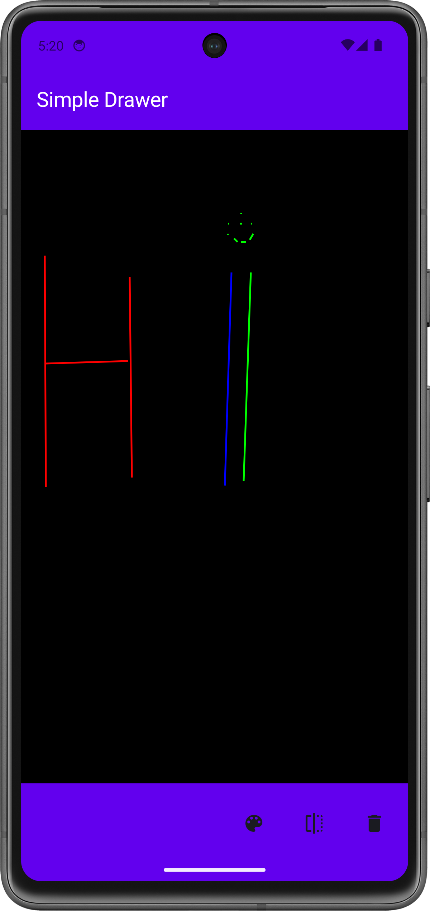
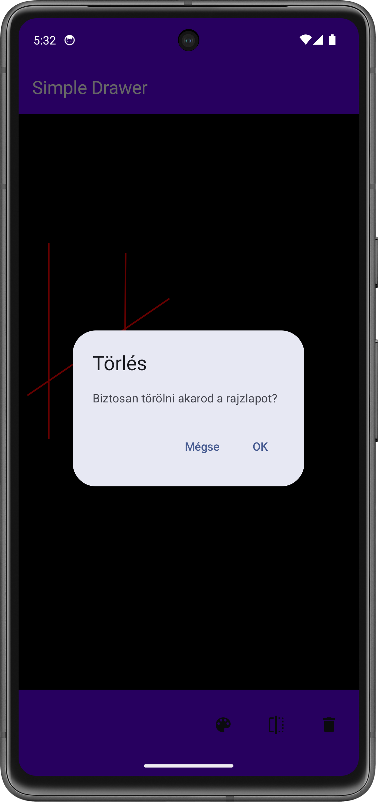

# Labor 05 - SQLite - Drawing Application

## Introduction

The task of this lab is to create a simple drawing application. The application allows you to draw lines or points on a canvas and then persistently save the drawn figure so that it can be reloaded even after the application is restarted.

<p align="center">




</p>

During the lab we will encounter the following technologies:

- SQLite
- Scaffold
    - TopBar
    - BottomBar
- DrawingCanvas
- ViewModel
- DropDownMenu

!!!info "Room library"
    During the lab, we will get acquainted with the SQLite library, which allows us to persistently store data in a local SQL database. Modern Android-based developments usually use Room, which is built on SQLite and provides an easy-to-use ORM layer combined with Android lifecycles. However, we considered it important to make the material easy to understand, so we will only examine the SQLite solution for now.

!!! warning "IMSc"
    After successfully completing the lab tasks, 2 IMSc points can be earned by solving the IMSc task.


## Preparations

When solving the tasks, do not forget to follow the [task submission process](../github/).

### Creating and downloading a Git repository

1. Find the lab invitation URL in Moodle and use it to create your own repository.

2. Wait until the repository is ready, then checkout it.

    !!! tip ""
        In university labs, if the system does not ask for a username and password during checkout and the checkout fails, the system probably tried to use a username previously saved on the computer. First, delete the saved login data and try again.

3. Create a new branch called `solution` and work on this branch.

4. Write your Neptun code in the `neptun.txt` file. The file should contain nothing else, only the 6 characters of the Neptun code on a single line.


## Preparing the project

### Creating the project

Let's create a project called `SimpleDrawer` in Android Studio:

1. Create a new project, select the *Empty Activity* option.
1. The project name should be `SimpleDrawer`, the starting package `hu.bme.aut.android.simpledrawer`, and the save location should be the SimpleDrawer folder within the checked-out repository.
1. Select *Kotlin* as the language.
1. The minimum API level should be API24: Android 7.0.
1. The *Build configuration language* should be Kotlin DSL.

!!!danger "FILE PATH"
    The project should be placed in the SimpleDrawer directory in the repository, and it should be pushed when submitted! Without the code, we cannot give maximum points to the lab!

!!!danger "FILE PATH"
    The repository path should not contain accents or special characters, as AndroidStudio is sensitive to these and the code will not compile. It is worth working in the root of the C:\\ drive.

### Adding Resources

First, download the [compressed file containing the application images](./downloads/res.zip), which contains all the images we will need. Copy its contents into the `app/src/main/res` folder (it helps if you switch from the regular _Android_ view in the top left of _Android Studio_ to the _Project_ view for this time).

Copy the following _string resources_ required for the application into the `res/values/strings.xml` file:

```xml
<resources>
    <string name="app_name">Simple Drawer</string>

    <string name="style">Style</string>
    <string name="line">Line</string>
    <string name="point">Point</string>

    <string name="color">Color</string>
    <string name="red">Red</string>
    <string name="green">Green</string>
    <string name="blue">Blue</string>
    
    <string name="clear">Clear</string>

    <string name="are_you_sure_want_to_clear">Are you sure you want to clear the drawing sheet??</string>
    <string name="ok">OK</string>
    <string name="cancel">Cancel</string>
</resources>
```

## Creating the home screen (1 point)

### Enforcing portrait layout

For the sake of simplicity, we are only supporting portrait mode in our application right now. To do this, in `AndroidManifest.xml`, within the `<activity>` tag, modify the following: 

Drawing page

```xml
<activity
    android:name=".MainActivity"
    android:exported="true"
    android:label="@string/app_name"
    android:screenOrientation="sensorPortrait"
    android:theme="@style/Theme.SimpleDrawer">
    <intent-filter>
        <action android:name="android.intent.action.MAIN" />

        <category android:name="android.intent.category.LAUNCHER" />
    </intent-filter>
</activity>
```

### Creating AppBars

Within the existing `ui` *package*, create a `common` *package*, including a `TopBar` and a `BottomBar` *Kotlin File*, and then write the following into it:

`TopBar.kt`:

```kotlin
package hu.bme.aut.android.simpledrawer.ui.common

import androidx.compose.material3.ExperimentalMaterial3Api
import androidx.compose.material3.Text
import androidx.compose.material3.TopAppBar
import androidx.compose.material3.TopAppBarDefaults
import androidx.compose.runtime.Composable
import androidx.compose.ui.graphics.Color
import androidx.compose.ui.res.stringResource
import androidx.compose.ui.tooling.preview.Preview
import hu.bme.aut.android.simpledrawer.R

@OptIn(ExperimentalMaterial3Api::class)
@Composable
fun TopBar() {
    TopAppBar(
        title = {
            Text(
                text = stringResource(id = R.string.app_name),
                color = Color.White
            )
        },
        colors = TopAppBarDefaults.topAppBarColors(containerColor = Color(0xFF6200EE))
    )
}

@Composable
@Preview
fun PreviewTopBar() {
    TopBar()
}
```
This is just a simple TopBar with the name of the application written on top. The BottomBar will be a little more complex than that.

`BottomBar.kt`:

```kotlin
package hu.bme.aut.android.simpledrawer.ui.common

import androidx.compose.foundation.layout.Arrangement
import androidx.compose.foundation.layout.Row
import androidx.compose.foundation.layout.fillMaxSize
import androidx.compose.foundation.layout.height
import androidx.compose.foundation.layout.size
import androidx.compose.material3.BottomAppBar
import androidx.compose.material3.Icon
import androidx.compose.material3.IconButton
import androidx.compose.runtime.Composable
import androidx.compose.ui.Alignment
import androidx.compose.ui.Modifier
import androidx.compose.ui.graphics.Color
import androidx.compose.ui.res.painterResource
import androidx.compose.ui.res.stringResource
import androidx.compose.ui.tooling.preview.Preview
import androidx.compose.ui.unit.dp
import hu.bme.aut.android.simpledrawer.R

@Composable
fun BottomBar() {
    BottomAppBar(
        actions = {
            Row(
                modifier = Modifier
                    .fillMaxSize(),
                horizontalArrangement = Arrangement.End,
                verticalAlignment = Alignment.CenterVertically
            ) {
                IconButton(
                    onClick = { /*TODO*/ },
                    modifier = Modifier.size(64.dp)
                ) {
                    Icon(
                        painterResource(id = R.drawable.ic_style),
                        contentDescription = stringResource(id = R.string.style)
                    )
                    //Styles
                }
            }
        },
        containerColor = Color(0xFF6200EE),
    )
}

@Composable
@Preview
fun PreviewBottomBar() {
    BottomBar()
}
```

The BottomBar is a bit more complex, here we can pass composable elements with the `actions` parameter that will appear as small icons on the AppBar, and we can later add an onClick event to these. This is how we will implement the style change option, when pressed, a window will pop up where you can select the desired style (Line, point)

### The DrawingScreen interface

Within the `ui` *package*, create a `screen` *package*. Our `DrawingScreen` will be placed in this. Here we will place the *Scaffold*, with the help of which we will implement a TopBar and a BottomBar. Initially, the content of the Scaffold will only be a black `Spacer`, which will later be replaced by `Canvas`.

```kotlin
package hu.bme.aut.android.simpledrawer.ui.screen

import androidx.compose.foundation.background
import androidx.compose.foundation.layout.Spacer
import androidx.compose.foundation.layout.fillMaxSize
import androidx.compose.foundation.layout.padding
import androidx.compose.material3.Scaffold
import androidx.compose.runtime.Composable
import androidx.compose.ui.Modifier
import androidx.compose.ui.graphics.Color
import androidx.compose.ui.tooling.preview.Preview
import hu.bme.aut.android.simpledrawer.ui.common.BottomBar
import hu.bme.aut.android.simpledrawer.ui.common.TopBar

@Composable
fun DrawingScreen(modifier: Modifier = Modifier) {

    Scaffold(
        modifier = modifier,
        topBar = {
            TopBar()
        },
        bottomBar = {
            BottomBar()
        }
    ) { innerPadding ->
        //TODO replace with canvas
        Spacer(
            modifier = Modifier
                .background(Color.Black)
                .padding(innerPadding)
                .fillMaxSize()
        )
    }
}

@Composable
@Preview
fun PreviewDrawingScreen() {
    DrawingScreen()
}
```

Finally, let's rewrite the code in `MainActivity.kt` so that it instantiates the `DrawingScreen` we just created:

```kotlin
package hu.bme.aut.android.simpledrawer

import android.os.Bundle
import androidx.activity.ComponentActivity
import androidx.activity.compose.setContent
import androidx.activity.enableEdgeToEdge
import hu.bme.aut.android.simpledrawer.ui.screen.DrawingScreen
import hu.bme.aut.android.simpledrawer.ui.theme.SimpleDrawerTheme

class MainActivity : ComponentActivity() {
    override fun onCreate(savedInstanceState: Bundle?) {
        super.onCreate(savedInstanceState)
        enableEdgeToEdge()
        setContent {
            SimpleDrawerTheme {
                DrawingScreen()
            }
        }
    }
}
```

So that we are done with this, let's start the application! Now we can see the two *AppBars* and the black screen between them. An icon also appears on the *BottomBar*, pressing which does nothing yet.

!!!example "TO BE SUBMITTED (1 point)"
    Create a **screenshot** showing the **finished home screen** (on an emulator, by mirroring the device or by taking a screen shot), a **corresponding code snippet**, and **your neptun code somewhere in the code as a comment**' Upload the image to the repository in the solution as f1.png!

    The screenshot is a necessary condition for obtaining a score.

## Implementing the style selector (1 point)

After we have created the *BottomBar* and the home screen frame, let's implement the style selector. To do this, we need to modify the `BottomBar` so that when we click on the *Style selector* button, a menu appears where we can select the drawing mode. This mode can be implemented as a state of the drawing. And as we have seen in previous labs, these states are stored in a separate *viewModel*.

### Creating the ViewModel

To use the *viewModel*, we first need to add a new dependency:

`libs.versions.toml`:

```toml
[versions]
...
lifecycleVersion = "2.9.4"

[libraries]
androidx-lifecycle-viewmodel-compose = { group = "androidx.lifecycle", name="lifecycle-viewmodel-compose", version.ref = "lifecycleVersion" }
```

 `build.gradle.kts`:

```kts
implementation(libs.androidx.lifecycle.viewmodel.compose)
```

After adding the dependency, don't forget to click the `Sync Now` button.

After synchronization, we can also create our *viewModel*. This will help with color/style switching, and later with persistent data storage.

Let's create a `DrawingViewModel` *Kotlin File* in the `screen` *package* next to `DrawingScreen` and write the following code in it:

```kotlin
package hu.bme.aut.android.simpledrawer.ui.screen

import androidx.lifecycle.ViewModel
import androidx.lifecycle.viewModelScope
import kotlinx.coroutines.flow.MutableStateFlow
import kotlinx.coroutines.flow.StateFlow
import kotlinx.coroutines.launch

class DrawingViewModel : ViewModel() {

    private val _drawingMode = MutableStateFlow(DrawingMode.LINE)
    val drawingMode: StateFlow<DrawingMode> = _drawingMode

    private val _drawElements = MutableStateFlow<List<Any>>(emptyList())
    val drawElements: StateFlow<List<Any>> = _drawElements

    fun setDrawingMode(mode: DrawingMode) {
        viewModelScope.launch {
            _drawingMode.value = mode
        }
    }

    fun addDrawElement(element: Any) {
        viewModelScope.launch {
            _drawElements.value += element
        }
    }
}

enum class DrawingMode {
    LINE,
    POINT
}
```

`DrawingViewModel` stores two states (drawing mode and drawn shapes) and returns them as *StateFlow*.

To represent the drawing style, we need another class, `DrawingMode`. Since this can only take two values, we will implement it as an *Enum Class*.

!!!warning "Code Interpretation"
    Let's interpret the viewModel code with the help of the lab instructor!

Now that we have the *viewModel*, we just need to modify the `BottomBar` so that we can set the state.


### Style Selector

Let's modify the `BottomBar` so that when we click the Style Selector button, a window appears where we can select the drawing mode. We can do this as follows:

```kotlin
@Composable
fun BottomBar(
    viewModel: DrawingViewModel
){
    var showStyle by remember { mutableStateOf(false) }
    val drawingMode by viewModel.drawingMode.collectAsState()

    BottomAppBar(
        actions = {
            Row (
                ...
            ){
                IconButton(
                    onClick = { showStyle = !showStyle },
                    modifier = Modifier.size(64.dp)
                ) {
                    Icon(
                        painterResource(id = R.drawable.ic_style),
                        contentDescription = stringResource(id = R.string.style)
                    )
                    DropdownMenu(
                        expanded = showStyle,
                        onDismissRequest = { showStyle = false}) {
                        DropdownMenuItem(
                            text = { Text(
                                stringResource(id = R.string.point),
                                color = if (drawingMode == DrawingMode.POINT) Color.Magenta else Color.Black
                            ) },
                            onClick = {
                                viewModel.setDrawingMode(DrawingMode.POINT)
                                showStyle = false
                            }
                        )
                        DropdownMenuItem(
                            text = { Text(
                                stringResource(id = R.string.line),
                                color = if (drawingMode == DrawingMode.LINE) Color.Magenta else Color.Black)
                            },
                            onClick = {
                                viewModel.setDrawingMode(DrawingMode.LINE)
                                showStyle = false
                            }
                        )
                    }
                }
                ...
            }
        },
        ...
    )
}

@Composable
@Preview
fun PreviewBottomBar() {
    BottomBar(viewModel = viewModel())
}
```

!!!warning "viewModel"
    Many times Android Studio cannot find the import required for `viewModel()`. In such cases, we manually specify the following import:
    ```kotlin
    import androidx.lifecycle.viewmodel.compose.viewModel
    ```

Then we modify the `BottomBar` function call on `DrawingScreen` and add the viewModel parameter.

```kotlin
package hu.bme.aut.android.simpledrawer.ui.screen

import androidx.compose.foundation.background
import androidx.compose.foundation.layout.Spacer
import androidx.compose.foundation.layout.fillMaxSize
import androidx.compose.foundation.layout.padding
import androidx.compose.material3.Scaffold
import androidx.compose.runtime.Composable
import androidx.compose.ui.Modifier
import androidx.compose.ui.graphics.Color
import androidx.compose.ui.tooling.preview.Preview
import androidx.lifecycle.viewmodel.compose.viewModel
import hu.bme.aut.android.simpledrawer.ui.common.BottomBar
import hu.bme.aut.android.simpledrawer.ui.common.TopBar

@Composable
fun DrawingScreen(
    modifier: Modifier = Modifier,
    viewModel: DrawingViewModel = viewModel()
) {

    Scaffold(
        modifier = modifier,
        topBar = {
            TopBar()
        },
        bottomBar = {
            BottomBar(viewModel = viewModel)
        }
    ) { innerPadding ->
        //TODO replace with canvas
        Spacer(
            modifier = Modifier
                .background(Color.Black)
                .padding(innerPadding)
                .fillMaxSize()
        )
    }
}

@Composable
@Preview
fun PreviewDrawingScreen() {
    DrawingScreen()
}
```
Let's run the application and try out the style selector!

!!!example "TO BE SUBMITTED (1 point)"
    Create a **screenshot** showing the **completed Style Selector opened** (on an emulator, mirroring the device or with a screen capture), a **corresponding code snippet**, and your **neptun code somewhere in the code as a comment**! Upload the image to the repository in the solution as f2.png!

    The screenshot is a necessary condition for getting a score.


## Implementing the canvas (1 point)


### Model classes

During the drawing process, we want to draw points and lines. To handle these, let's create two data classes named `Line` and `Point`. Let's create a `model` *package* in our main *package*, then implement the two classes:

`Point.kt`:

```kotlin
package hu.bme.aut.android.simpledrawer.model

import androidx.compose.ui.graphics.Color

data class Point(
    var x: Float = 0F,
    var y: Float = 0F,
    var color: Color = Color.Yellow
)
```

`Line.kt`:

```kotlin
package hu.bme.aut.android.simpledrawer.model

import androidx.compose.ui.graphics.Color

data class Line(
    var start: Point,
    var end: Point,
    var color: Color = Color.Yellow
)
```

This is how we will store our data in the list. It is true that the `Line` data class will receive the color twice more, but this is just for the sake of simplicity, we will not deal with this parameter.

### Canvas

Then, inside the `common` *package*, create a `DrawingCanvas` *Kotlin File*. In this *Composable* class, we will implement the drawing using the built-in `Canvas` *Composable*. This class has a `Modifier.pointerInteropFilter` parameter, which we will use to handle gestures.

```kotlin
package hu.bme.aut.android.simpledrawer.ui.common

import androidx.compose.foundation.Canvas
import androidx.compose.foundation.background
import androidx.compose.runtime.Composable
import androidx.compose.runtime.getValue
import androidx.compose.runtime.mutableStateOf
import androidx.compose.runtime.remember
import androidx.compose.runtime.setValue
import androidx.compose.ui.ExperimentalComposeUiApi
import androidx.compose.ui.Modifier
import androidx.compose.ui.geometry.Offset
import androidx.compose.ui.graphics.Color
import androidx.compose.ui.input.pointer.pointerInteropFilter
import hu.bme.aut.android.simpledrawer.ui.screen.DrawingMode
import hu.bme.aut.android.simpledrawer.ui.screen.DrawingViewModel

@OptIn(ExperimentalComposeUiApi::class)
@Composable
fun DrawingCanvas(
    modifier: Modifier = Modifier,
    currentColor: Color = Color.Red,
    drawingMode: DrawingMode,
    viewModel: DrawingViewModel,
    drawElements: List<Any>
) {
    var startPoint by remember { mutableStateOf<Offset?>(null) }
    var endPoint by remember { mutableStateOf<Offset?>(null) }
    var tempPoint by remember { mutableStateOf<Offset?>(null) }

    Canvas(
        modifier = modifier
            .background(Color.Black)
            .pointerInteropFilter { event ->
                when (event.action) {
                    /*TODO*/
                    //ACTION_DOWN

                    //ACTION_MOVE

                    //ACTION_UP
                }
                true
            }
    ) {

        //TODO drawElements
        
    }
}
```

Within `event.action` we will handle the `MotionEvent.ACTION_DOWN`, `MotionEvent.ACTION_MOVE`, `MotionEvent.ACTION_UP` events, as well as drawing on the `Canvas`.

`ACTION_DOWN`:

```kotlin
MotionEvent.ACTION_DOWN -> {
    startPoint = Offset(event.x, event.y)
    tempPoint = startPoint
}
```
This event occurs when we place our finger on the screen. At that time, we save this parameter in a `startPoint` variable.

`ACTION_MOVE`:

```kotlin
MotionEvent.ACTION_MOVE -> {
    tempPoint = Offset(event.x, event.y)
    if (drawingMode == DrawingMode.LINE) {
        endPoint = tempPoint
    }
}
```
After we place our finger, we can move it. This is when this event occurs. Here the process is divided into two parts, namely, if we draw a point and move our finger, we want to place the point at the last position, so we write the position in `tempPoint`. If we draw a line, we need to write the position in `endPoint`.

`ACTION_UP`:

```kotlin
MotionEvent.ACTION_UP -> {
    if (drawingMode == DrawingMode.POINT) {
        tempPoint?.let {
            viewModel.addDrawElement(Point(it.x, it.y, currentColor))
        }
    } else if (drawingMode == DrawingMode.LINE) {
        endPoint?.let {
            startPoint?.let { start ->
                viewModel.addDrawElement(
                    Line(
                        Point(start.x, start.y, currentColor),
                        Point(it.x, it.y, currentColor),
                        currentColor
                    )
                )
            }
        }

    }
    startPoint = null
    endPoint = null
    tempPoint = null
}
```

In this event, we handle when the user lifts their finger from the screen. Here too, the algorithm is divided into two options, namely, if it is a point, then only the value of `tempPoint` needs to be recorded. However, if it is a line, then the values ​​of `endPoint` and `startPoint` need to be recorded as a line. **Null checking is required for both events**!

Once the events are available, all that remains is to draw them. We can do this by drawing the data stored in drawElements one by one, depending on their type:

```kotlin
Canvas (..){
    drawElements.forEach { element ->
        when (element) {
            is Point -> drawCircle(
                color = element.color,
                center = Offset(element.x, element.y),
                radius = 5f
            )

            is Line -> drawLine(
                color = element.color,
                start = Offset(element.start.x, element.start.y),
                end = Offset(element.end.x, element.end.y),
                strokeWidth = 5f
            )
        }
    }
}
```
This completes the `DrawingCanvas`, but we still can't see the drawing until we lift our finger from the screen. This can be fixed as follows:

```kotlin
Canvas (..){
    ...
    tempPoint?.let {
        if (drawingMode == DrawingMode.POINT) {
            drawCircle(color = currentColor, center = it, radius = 5f)
        } else if (drawingMode == DrawingMode.LINE && startPoint != null) {
            drawLine(color = currentColor, start = startPoint!!, end = it, strokeWidth = 5f)
        }
    }
}
```
In this case, we draw the element whose starting point is the point where we placed our finger, and whose ending point is where our finger is. If we move this, it will update in real time, so we can see the final result in advance.

Then modify the `DrawingScreen` and replace the `Spacer` with the `DrawingCanvas` we just created.

```kotlin
@Composable
fun DrawingScreen(
    modifier: Modifier = Modifier,
    viewModel: DrawingViewModel = viewModel()
) {
    val drawingMode by viewModel.drawingMode.collectAsState()
    val drawElements by viewModel.drawElements.collectAsState()

    Scaffold(
        ...
    ) { innerPadding ->
        DrawingCanvas(
            modifier = Modifier
                .padding(innerPadding)
                .fillMaxSize(),
            drawingMode = drawingMode,
            viewModel = viewModel,
            drawElements = drawElements
        )
    }
}
```

!!!example "TO BE SUBMITTED (1 point)"
    Create a **screenshot** showing the **finished DrawingScreen** (on emulator, mirroring device or with a screen capture) with a few lines and dots, **a code snippet of the DrawingCanvas**, and **your neptun code somewhere in the code as a comment**! Upload the image to the repository in the solution as f3.png!

    The screenshot is a necessary condition for getting a score.


## Implementing persistence using a *SQLite* database (1 point)

In order for the objects we draw to persist even after exiting the application, we need to somehow organize our data in a form that we can easily store in a *SQLite* database.

Let's create a new package within `hu.bme.aut.android.simpledrawer`, which we will name `sqlite`.

### Defining tables

During database management, we have to work with many constant variables, such as the names of columns in tables, table names, database file names, schema creation and deletion scripts, etc. It is worth storing these in a common place, so that when editing or introducing a new entity, you do not have to jump between source files, and it is easier to generate scripts that create and delete the entire database. Let's create a new singleton class with the `object` keyword within the `sqlite` package called `DbConstants`.

First of all, we add the database name and version as constants. If we want to change the schema of our database, we need to increment the latter, so that we can avoid unwanted errors due to incompatibility.

```kotlin
package hu.bme.aut.android.simpledrawer.sqlite

object DbConstants{

    const val DATABASE_NAME = "simpledrawer.db"
    const val DATABASE_VERSION = 1

    //Points
    
    //Lines
}
```
After that, we create the constants for the `Point` class in a class called `DbConstants`. Within the classes, we also create an `enum` to make it easier to manage the table columns, and then we store the SQL statement used to create the table and the table name in constants. Finally, we create the functions that need to be called when the table is created or upgraded:

```kotlin
object Points {
    const val DATABASE_TABLE = "points"

    enum class Columns {
        ID, COORD_X, COORD_Y
    }

    private val DATABASE_CREATE = """create table if not exists $DATABASE_TABLE (
        ${Columns.ID.name} integer primary key autoincrement,
        ${Columns.COORD_X.name} real not null,
        ${Columns.COORD_Y.name} real not null
        );"""

    private const val DATABASE_DROP = "drop table if exists $DATABASE_TABLE;"

    fun onCreate(database: SQLiteDatabase) {
        database.execSQL(DATABASE_CREATE)
    }

    fun onUpgrade(database: SQLiteDatabase, oldVersion: Int, newVersion: Int) {
        database.execSQL(DATABASE_DROP)
        onCreate(database)
    }
}
```

Notice that we have created an inner class called `Points` inside the `DbConstants` class, in which we store the constant values ​​belonging to the table that stores the `Points` entities. If our application stores multiple entities in a database, it is worth storing the constants belonging to each class in separate inner classes. This way, the code will be much more transparent and maintainable than if we were to add all the constants of all the tables to DbConstants in bulk. These inner classes practically exist with the same name as the entity classes. So let's add the `Lines` class in a similar way:

```kotlin
object Lines {
    const val DATABASE_TABLE = "lines"

    enum class Columns {
        ID, START_X, START_Y, END_X, END_Y
    }

    private val DATABASE_CREATE = """create table if not exists $DATABASE_TABLE (
        ${Columns.ID.name} integer primary key autoincrement,
        ${Columns.START_X.name} real not null,
        ${Columns.START_Y.name} real not null,
        ${Columns.END_X.name} real not null,
        ${Columns.END_Y.name} real not null
        );"""

    private const val DATABASE_DROP = "drop table if exists $DATABASE_TABLE;"

    fun onCreate(database: SQLiteDatabase) {
        database.execSQL(DATABASE_CREATE)
    }

    fun onUpgrade(database: SQLiteDatabase, oldVersion: Int, newVersion: Int) {
        database.execSQL(DATABASE_DROP)
        onCreate(database)
    }
}
```

It is also worth noting that we did not declare the classes with the class keyword. Instead, we use `object`, which the Kotlin language uses to ensure that `DbConstants` and the `Points` and `Lines` classes in it behave as singletons, meaning that an instance of them is created when the application is run, and no further instances can be created of them.

### Creating the helper class

To create the database, we need a helper class that creates the database itself and initializes the tables within it. In our case, this will be the `DbHelper` class, which is derived from the `SQLiteOpenHelper` class. Let's add this to the `sqlite` package as well.

```kotlin
package hu.bme.aut.android.simpledrawer.sqlite

import android.content.Context
import android.database.sqlite.SQLiteDatabase
import android.database.sqlite.SQLiteOpenHelper

class DbHelper(context: Context):
    SQLiteOpenHelper(context, DbConstants.DATABASE_NAME, null, DbConstants.DATABASE_VERSION) {

    override fun onCreate(sqLiteDatabase: SQLiteDatabase) {
        DbConstants.Lines.onCreate(sqLiteDatabase)
        DbConstants.Points.onCreate(sqLiteDatabase)
    }

    override fun onUpgrade(
        sqLiteDatabase: SQLiteDatabase,
        oldVersion: Int,
        newVersion: Int
    ) {
        DbConstants.Lines.onUpgrade(sqLiteDatabase, oldVersion, newVersion)
        DbConstants.Points.onUpgrade(sqLiteDatabase, oldVersion, newVersion)
    }
}
```

In addition, we need a helper class that brings all this together and allows us to easily manage our database. This will be `PersistentDataHelper`, still in the `sqlite` package. In it, we will implement functions such as `open()` and `close()`, which we can use to open and close the database connection. In addition, in this class, we will also implement the functions that are responsible for writing data to and reading it from the database. Make sure to select your own Point class during the import.

```kotlin
package hu.bme.aut.android.simpledrawer.sqlite

import android.content.Context
import android.database.sqlite.SQLiteDatabase
import android.database.sqlite.SQLiteException

class PersistentDataHelper(context: Context) {
    private var database: SQLiteDatabase? = null
    private val dbHelper: DbHelper = DbHelper(context)


    private val pointColumns = arrayOf(
        DbConstants.Points.Columns.ID.name,
        DbConstants.Points.Columns.COORD_X.name,
        DbConstants.Points.Columns.COORD_Y.name,
    )

    private val lineColumns = arrayOf(
        DbConstants.Lines.Columns.ID.name,
        DbConstants.Lines.Columns.START_X.name,
        DbConstants.Lines.Columns.START_Y.name,
        DbConstants.Lines.Columns.END_X.name,
        DbConstants.Lines.Columns.END_Y.name,
    )


    @Throws(SQLiteException::class)
    fun open() {
        database = dbHelper.writableDatabase
    }

    fun close() {
        dbHelper.close()
    }

    //PersistPoints


    //RestorePoints


    //ClearPoints


    //CursorToPoint


    //PersistLines


    //RestoreLines


    //ClearLines


    //CursorToLine

}
```

Complete the `PersistentDataHelper` class as follows:

1. PersistPoints: Here we need to implement the storage of points. First, we empty the database, then we go through the received List parameter and save the points one by one.
1. RestorePoints: Here we need to implement the loading of points. For this, we use a temporary MutableList, to which we add the read points.
1. ClearPoints: With this function, we delete the Points table from the database.
1. CursorToPoint: With this function, we read the data of a single point from the database.
1. PersistLines: Here we need to implement the storage of lines. First, we empty the database, then we go through the received List parameter and save the lines one by one.
1. RestoreLines: Here we need to implement the loading of lines. For this we use a temporary MutableList, to which we add the read lines.
1. ClearLines: With this function we delete the Lines table from the database.
1. CursorToLine: With this function we read the data of a single line from the database.

**1. PersistPoints**
```kotlin
fun persistPoints(points: List<Point>) {
    clearPoints()
    for (point in points) {
        val values = ContentValues()
        values.put(DbConstants.Points.Columns.COORD_X.name, point.x)
        values.put(DbConstants.Points.Columns.COORD_Y.name, point.y)
        database!!.insert(DbConstants.Points.DATABASE_TABLE, null, values)
    }
}
```
**2. RestorePoints**
```kotlin
fun restorePoints(): MutableList<Point> {
    val points: MutableList<Point> = ArrayList()
    val cursor = database!!.query(
        DbConstants.Points.DATABASE_TABLE,
        pointColumns,
        null,
        null,
        null,
        null,
        null
    )
    cursor.moveToFirst()
    while (!cursor.isAfterLast) {
        val point: Point = cursorToPoint(cursor)
        points.add(point)
        cursor.moveToNext()
    }
    cursor.close()
    return points
}
```

**3. ClearPoints**
```kotlin
fun clearPoints() {
    database!!.delete(DbConstants.Points.DATABASE_TABLE, null, null)
}
```

**4. CursorToPoints**
```kotlin
private fun cursorToPoint(cursor: Cursor): Point {
    val point = Point(
        cursor.getFloat(DbConstants.Points.Columns.COORD_X.ordinal),
        cursor.getFloat(DbConstants.Points.Columns.COORD_Y.ordinal),
        Color(Color.Red.toArgb())
    )
    return point
}
```

**5. PersistLines**
```kotlin
fun persistLines(lines: List<Line>) {
    clearLines()
    for (line in lines) {
        val values = ContentValues()
        values.put(DbConstants.Lines.Columns.START_X.name, line.start.x)
        values.put(DbConstants.Lines.Columns.START_Y.name, line.start.y)
        values.put(DbConstants.Lines.Columns.END_X.name, line.end.x)
        values.put(DbConstants.Lines.Columns.END_Y.name, line.end.y)
        database!!.insert(DbConstants.Lines.DATABASE_TABLE, null, values)
    }
}
```
**6. RestoreLines**
```kotlin
fun restoreLines(): MutableList<Line> {
    val lines: MutableList<Line> = ArrayList()
    val cursor = database!!.query(
        DbConstants.Lines.DATABASE_TABLE,
        lineColumns,
        null,
        null,
        null,
        null,
        null
    )
    cursor.moveToFirst()
    while (!cursor.isAfterLast) {
        val line: Line = cursorToLine(cursor)
        lines.add(line)
        cursor.moveToNext()
    }
    cursor.close()
    return lines
}
```

**7. ClearLines**
```kotlin
fun clearLines() {
    database!!.delete(DbConstants.Lines.DATABASE_TABLE, null, null)
}
```

**8. CursorToLine**
```kotlin
private fun cursorToLine(cursor: Cursor): Line {
    val line = Line(
        Point(
            cursor.getFloat(DbConstants.Lines.Columns.START_X.ordinal),
            cursor.getFloat(DbConstants.Lines.Columns.START_Y.ordinal)
        ),
        Point(
            cursor.getFloat(DbConstants.Lines.Columns.END_X.ordinal),
            cursor.getFloat(DbConstants.Lines.Columns.END_Y.ordinal)
        ),
        Color(Color.Red.toArgb())
    )
    return line
}
```


### ViewModel Extension

For persistence to work properly, we need to extend the viewModel so that it saves the data to the database after each drawing. This way, our data will persist even if we restart the application. In order to see this again on the drawing interface, we need to load the drawing. The `init{}` block will play a role in this.

```kotlin
class DrawingViewModel(application: Application): AndroidViewModel(application) {

    //DrawingMode

    //DrawElements

    private val dataHelper = PersistentDataHelper(application)

    init{
        loadDrawElements()
    }

    //setDrawingMode
    
    fun addDrawElement(element: Any) {
        viewModelScope.launch {
            _drawElements.value += element
            saveDrawElements()
        }
    }

    private fun saveDrawElements() {
        viewModelScope.launch {
            dataHelper.open()
            dataHelper.clearPoints()
            dataHelper.clearLines()
            val points = _drawElements.value.filterIsInstance<Point>()
            val lines = _drawElements.value.filterIsInstance<Line>()
            dataHelper.persistPoints(points)
            dataHelper.persistLines(lines)
            dataHelper.close()
        }
    }

    private fun loadDrawElements() {
        viewModelScope.launch {
            dataHelper.open()
            val points = dataHelper.restorePoints()
            val lines = dataHelper.restoreLines()
            _drawElements.value = points + lines
            dataHelper.close()
        }
    }
}
```

In the `init{}` block, `loadDrawElements()` is called, which is used to read the data from the database using the previously defined `restorePoints` and `restoreLines` functions, and then add it to our List.

Saving works in a similar way, only this function is called when we have drawn.

!!!warning "ViewModel"
    *viewModel* is basically context-independent, and it should be, but in this case we can see that `PersistentDataHelper` needs the context to access the database. So instead of the `ViewModel` class, we derive our `DrawingViewModel` from `AndroidViewModel`, which now accepts `Application` as a parameter.

    This is solved in larger projects with a more complex architecture and *Dependency Injection*, so the context-independence of the ViewModel can be maintained.

So let's change the instantiation of `DrawingViewModel` in `DrawingScreen` as well:

```kotlin
@Composable
fun DrawingScreen(
    modifier: Modifier = Modifier,
    viewModel: DrawingViewModel = viewModel(
        factory = ViewModelProvider.AndroidViewModelFactory(
            LocalContext.current.applicationContext as Application
        )
    )
) {
    ...
}
```

!!!example "TO BE SUBMITTED (1 point)"
    Create a **screenshot** showing the **finished DrawingScreen** (on an emulator, mirroring the device or with a screen capture) with a few lines and points, and the **corresponding code snippet**, as well as your **neptun code somewhere in the code as a comment**! Upload the image to the repository in the solution as f4.png!

    The screenshot is a necessary condition for obtaining a score.

## Independent task: Clearing the canvas (1 point)

Add a new control to the *BottomBar* that is responsible for clearing! When you press it, a dialog box should pop up and warn you that the clearing cannot be undone! It should have a positive and a negative button!

The button icon should be `R.drawable.ic_clear_canvas`!

!!!example "BEADANDÓ (1 point)"
    Create a **screenshot** showing the **deletion confirmation dialog box** (on an emulator, by mirroring the device or by taking a screenshot), the **code snippet that performs the clearing**, and your **Neptune code somewhere in the code as a comment**! Upload the image to the repository in the solution as f5.png!

    The screenshot is a necessary condition for getting a score.


## iMSc task (2 iMSc points)

Let's add a control to the application that can change the drawing color between the 3 main colors (_RGB_).

**Attention:** the color of the given object must also be saved in the database!

!!!tip "Database"
    It is worth starting Wipe Data or changing the version of the database, so that if we change its structure, it will be saved.

!!!example "BEADANDÓ (1 iMSc point)"
    Create a **screenshot** showing the **drawing page with the different colors** (on an emulator, mirroring the device or with a screen capture), a **corresponding code fragment**, and your **neptun code somewhere in the code as a comment**! Upload the image to the repository in the solution as f6.png!

    The screenshot is a necessary condition for obtaining a score.

!!!example "BEADANDÓ (1 iMSc point)"
    Create a **screenshot** showing the **code snippet that saves different colors**, as well as your **Neptune code somewhere in the code as a comment**! Upload the image to the repository in the solution as f7.png!

    The screenshot is a necessary condition for obtaining a score.