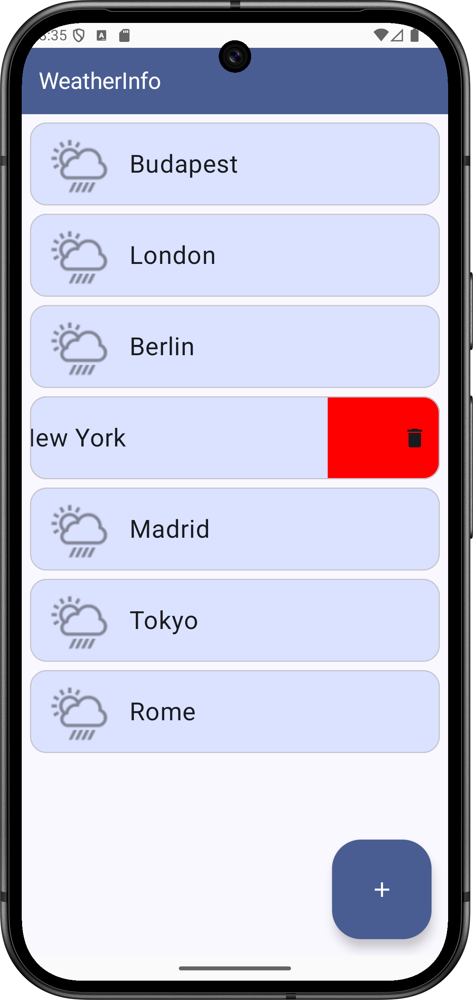
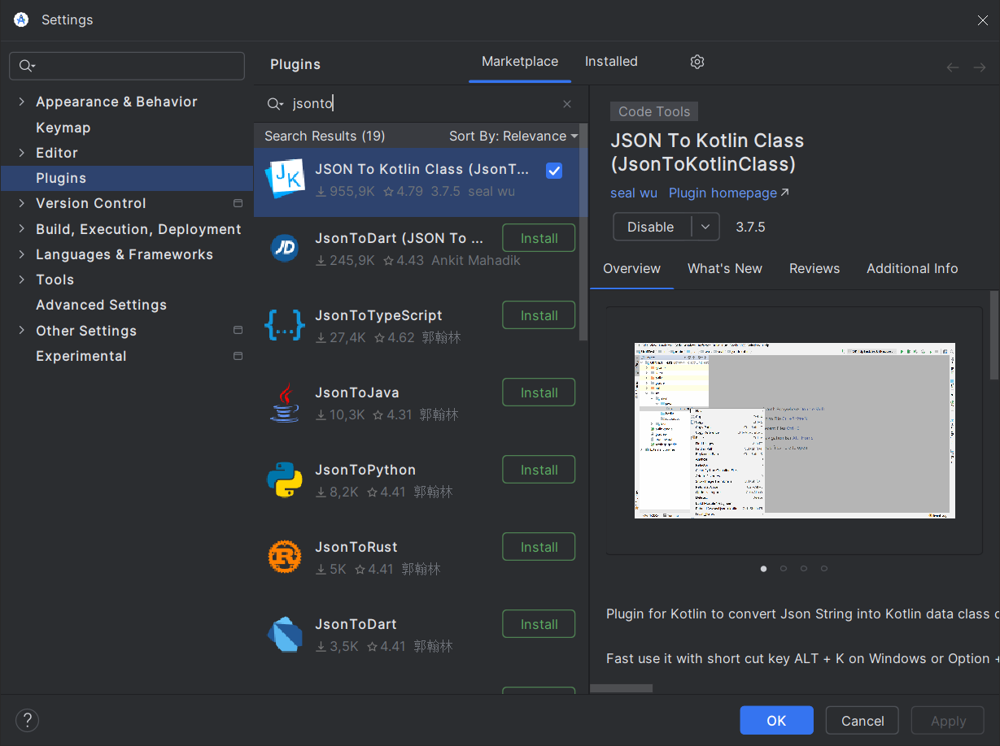

# Labor 07 - Retrofit - Weather app

## Introduction

The task of this lab is to create an application that displays weather information. In addition to using the UI elements we saw earlier, we will also see an example of an efficient implementation of network communication using the [`Retrofit`](https://square.github.io/retrofit/) library.

The application displays a list of cities in a [`LazyColumn`](https://developer.android.com/develop/ui/compose/lists) and queries the weather data of the selected city using the *REST API* of [OpenWeatherMap](https://openweathermap.org/). A new city can be added by pressing a [`FloatingActionButton`](https://developer.android.com/guide/topics/ui/floating-action-button).

!!!info "REST"
    REST = [Representational State Transfer](https://en.wikipedia.org/wiki/Representational_state_transfer)

Technologies used:

- [`Activity`](https://developer.android.com/guide/components/activities/intro-activities)
- [`LazyColumn`](https://developer.android.com/develop/ui/compose/lists)
- [`Retrofit`](https://square.github.io/retrofit/)
- [`Moshi`](https://github.com/square/moshi)
- [`Coil`](https://github.com/coil-kt/coil)
- [`ViewModel`](https://developer.android.com/topic/libraries/architecture/viewmodel)
- [`NavHost`](https://developer.android.com/develop/ui/compose/navigation)
- [`SwipeToDismissBox`](https://developer.android.com/reference/kotlin/androidx/compose/material3/package-summary#SwipeToDismissBox(androidx.compose.material3.SwipeToDismissBoxState,kotlin.Function1,androidx.compose.ui.Modifier,kotlin.Boolean,kotlin.Boolean,kotlin.Boolean,kotlin.Function1))


## Application Specification

The application consists of an `Activity`.

The `CityListScreen` that appears when the application starts displays a list of cities added by the user. Dragging the cities to the left deletes the given city from the list. A new city can be added by pressing the `FloatingActionButton` in the lower right corner of the view.

Clicking on a city brings up a new *Composable* screen with the weather data of the given city using `NavGraph`. In addition to the short description, an actual icon and the average, minimum and maximum temperature, air pressure and humidity values ​​measured in the city are displayed.

<p align="center">



</p>


## Lab tasks

During the lab, the following tasks must be completed with the help of the lab leader, and the designated tasks must be completed independently.

1. Implementing a city list: 1 point
1. Creating a weather view and connecting it to the navigation: 2 points
1. Implementing network communication: 1 point
1. Independent task: implementing deleting a city from the list: 1 point

During the lab, a complex weather application will be created. Due to the limited time frame of the lab, it will be necessary to copy larger code blocks, but in any case, pay attention to the lab leader's explanation so that the code sections are understandable. The goal is to understand the presented codes and learn how to use the libraries used.

*We apologize for the larger code blocks than before, but such a demonstration-type task cannot be solved in a smaller size, and the lab would lose its essence if we only implemented a "hello world" network communication request. Thank you for your understanding.*

## Preparations

When solving the tasks, do not forget to follow the [task submission process](../ithub/GitHub.md).


### Creating and downloading a Git repository

1. Find the lab invitation URL in Moodle and use it to create your own repository.

2. Wait until the repository is ready, then checkout it.

    !!! tip ""
        In university labs, if the system does not ask for a username and password during checkout and the checkout fails, the system probably tried to use a username previously saved on the computer. First, delete the saved login data and try again.

3. Create a new branch called `solution` and work on this branch.

4. Write your Neptun code in the `neptun.txt` file. Nothing else should be in the file, except the 6 characters of the Neptun code on a single line.

### Creating a project

First, launch Android Studio, then:
1. Create a new project, select *Empty Activity*.
2. Name the project `WeatherInfo`, and the starting package `hu.bme.aut.android.weatherinfo`
3. Select *Kotlin* as the language.
4. The minimum API level should be **API24: Android 7.0.**
5. The *Build configuration language* should be Kotlin DSL.

!!!danger "FILE PATH"
    The project should be placed in the WeatherInfo directory in the repository, and it should be pushed when submitted! Without the code, we cannot give maximum points to the lab!


### Adding dependencies

Let's add the required libraries to the `libs.versions.toml` file:
```toml
[versions]
coilCompose = "2.6.0"
moshi = "1.15.1"
retrofit = "2.11.0"
navigationCompose = "2.8.2"

[libraries]
androidx-navigation-compose = { group = "androidx.navigation", name="navigation-compose", version.ref = "navigationCompose" }
coil-compose = { group = "io.coil-kt", name="coil-compose", version.ref = "coilCompose" }
squareup-moshi = { group = "com.squareup.moshi", name = "moshi-kotlin", version.ref = "moshi" }
converter-moshi = { group = "com.squareup.retrofit2", name = "converter-moshi", version.ref = "retrofit" }
retrofit = { group = "com.squareup.retrofit2", name = "retrofit", version.ref = "retrofit" }
```

Then, in the `build.gradle` file for the *app* module, add the following to the `dependencies` block:

```kotlin
dependencies{
    implementation(libs.androidx.navigation.compose)
    implementation(libs.retrofit)
    implementation(libs.squareup.moshi)
    implementation(libs.converter.moshi)
    implementation(libs.coil.compose)
}
```

Then click the **Sync now** button in the upper right corner.

!!!info "Retrofit"
    `Retrofit` generates an implementation of HTTP calls based on simple, properly annotated interfaces described by the developer. It handles parameters given inline in the URL, URL queries, etc. It also supports the most popular serialization/deserialization solutions (e.g.: [`Gson`](https://github.com/google/gson), [`Moshi`](https://github.com/square/moshi), [`Simple XML`](https://sourceforge.net/projects/simple/), etc.), which can be used to implement bidirectional conversion between Java/Kotlin objects and JSON or XML format data. In the lab, we will use `Moshi` to convert weather data received in JSON.

!!!info "Coil"
    `Coil` is an efficient image loading and caching library for Android. We use it because of its simple *interface* and efficiency.

### Add permissions
The application will need internet access. In the `AndroidManifest.xml` file, add the *Internet permission* outside the `application` tag:

```xml
<uses-permission android:name="android.permission.INTERNET" />
```

!!!info "Permissions"
    Since API 23 (6.0, Marshmallow) on Android, permissions have been divided into two groups. For permissions in the *normal* group, it is enough to add them to the `AndroidManifest.xml` file as seen above and the application will automatically receive them. In the case of permissions in the *dangerous* group, this is no longer enough; they must be explicitly requested from the user at runtime, who can deny the application the requested permission at any time. You can learn more about managing permissions at [developer.android.com](https://developer.android.com/guide/topics/permissions/overview).

### Adding Resources

Download the [zipped file](./downloads/res.zip) containing the images used in the application, and then place its contents in the *res* folder of our project.

Add the following text resources to `res/values/strings.xml`:

```xml
<resources>
    <string name="app_name">WeatherInfo</string>
    <string name="new_city">New city</string>
    <string name="ok">OK</string>
    <string name="cancel">Cancel</string>
    <string name="weather_in">Weather in %1$s</string>
    <string name="some_error_message">Something went wrong.</string>
    <string name="label_temperature">Temperature</string>
    <string name="label_min_temperature">Min. temperature</string>
    <string name="label_max_temperature">Max. temperature</string>
    <string name="label_pressure">Pressure</string>
    <string name="label_humidity">Humidity</string>
    <string name="new_city_hint">City</string>
</resources>
```

### OpenWeatherMap API key

Let's register our own user on the [OpenWeatherMap](https://openweathermap.org/) page and create an API key, which we will use to use the service in our application!

1. Click on *Sign in* and then on the *Create an account* button.
2. Fill out the registration form
3. The value of the *Company* field should be "BME", the value of the *Purpose* should be "Education/Science"
4. After successful registration, the API key created by default can be found on the *API keys* tab.

We will need the received API key later for the API call to retrieve weather data.

## Implementing a city list (1 point)

Let's implement the `CityListScreen` consisting of a `LazyColumn`, which displays a list of cities!

By clicking on the city name, the weather view (*WeatherScreen*) will appear, where the weather information will be downloaded. A *FloatingActionButton* will be used to add a new city.

### Architecture design

The data source will be a *repository*, similar to what we saw in the previous lab. From here we will get our cities (currently only stored in memory).

#### The model class
Let's add a `data` to our main *package*, then a `local` within it, and then a `model` *package* within it. The class representing our cities will be placed here, which in this case only has an *id* and a *name*.

`City.kt`:

```kotlin
package hu.bme.aut.android.weatherinfo.data.local.model

class City(
    var id: Int,
    var name: String
)
```

#### The repository

After this, we can create our *repositories* as we have seen in the `hu.bme.aut.android.weatherinfo.data.local.repository` *package*.

`ICityRepository.kt`:

```kotlin
package hu.bme.aut.android.weatherinfo.data.local.repository

import hu.bme.aut.android.weatherinfo.data.local.model.City
import kotlinx.coroutines.flow.Flow

interface ICityRepository {

    fun getAllCities(): Flow<List<City>>
    suspend fun addCityByName(cityName: String)
}
```

`MemoryCityRepository.kt`:

```kotlin
package hu.bme.aut.android.weatherinfo.data.local.repository

import androidx.compose.runtime.mutableStateListOf
import hu.bme.aut.android.weatherinfo.data.local.model.City
import kotlinx.coroutines.flow.Flow
import kotlinx.coroutines.flow.flow

class MemoryCityRepository : ICityRepository {
    private var nextId=3

    private var cities = mutableStateListOf(
        City(id = 0, "Budapest"),
        City(id = 1, "London"),
        City(id = 2, "Berlin")
    )

    override fun getAllCities(): Flow<List<City>> = flow {
        emit(cities)
    }

    override suspend fun addCityByName(cityName: String) {
        cities.add(City(id = nextId++, name = cityName))
    }

}
```

After creating the *repository*, let's instantiate it in our *application* class in the `hu.bme.aut.android.weatherinfo` *package*.

`WeatherInfo.kt`:

```kotlin
package hu.bme.aut.android.weatherinfo

import android.app.Application
import hu.bme.aut.android.weatherinfo.data.local.repository.ICityRepository
import hu.bme.aut.android.weatherinfo.data.local.repository.MemoryCityRepository

class WeatherInfoApplication : Application() {
    companion object {

        lateinit var cityRepository: ICityRepository
    }

    override fun onCreate() {
        super.onCreate()

        cityRepository = MemoryCityRepository()
    }
}
```

Then, in `AndroidManifest.xml`, we configure the use of our *application* class.

`AndroidManifest.xml`:


```xml
...
<application
        android:name=".WeatherInfoApplication"
...
```

#### The ViewModel

Once we have the *repository*, we can continue with the next layer, the *viewmodel*. We will create the *viewmodel* and *screen* for the city list in the `hu.bme.aut.android.weatherinfo.feature.citylist` *package*. So let's create a new *package* for the state called `state`, and then place `CityListState` in it.

`CityListState.kt`:

```kotlin
package hu.bme.aut.android.weatherinfo.feature.citylist.state

import hu.bme.aut.android.weatherinfo.data.local.model.City


sealed class CityListState {
    data object Loading : CityListState()
    data class Error(val error: Throwable) : CityListState()
    data class Result(val cityList: List<City>) : CityListState()
}
```

After this, the *viewmodel* can be added to the `citylist` *package*:

`CityListViewModel.kt`:

```kotlin
package hu.bme.aut.android.weatherinfo.feature.citylist

import androidx.lifecycle.ViewModel
import androidx.lifecycle.ViewModelProvider
import androidx.lifecycle.viewModelScope
import androidx.lifecycle.viewmodel.initializer
import androidx.lifecycle.viewmodel.viewModelFactory
import hu.bme.aut.android.weatherinfo.WeatherInfoApplication
import hu.bme.aut.android.weatherinfo.data.local.model.City
import hu.bme.aut.android.weatherinfo.data.local.repository.ICityRepository
import hu.bme.aut.android.weatherinfo.feature.citylist.state.CityListState
import kotlinx.coroutines.flow.MutableStateFlow
import kotlinx.coroutines.flow.asStateFlow
import kotlinx.coroutines.flow.collectLatest
import kotlinx.coroutines.launch

class CityListViewModel(
    private val cityRepository: ICityRepository
) : ViewModel() {

    private val _state = MutableStateFlow<CityListState>(CityListState.Loading)
    val state = _state.asStateFlow()

    init {
        getAllCities()
    }

    private fun getAllCities() {
        viewModelScope.launch {
            _state.value = CityListState.Loading
            try {
                cityRepository.getAllCities().collectLatest{
                    _state.tryEmit(CityListState.Result(it))
                }
            } catch (e: Exception) {
                _state.value = CityListState.Error(e)
            }
        }
    }

    fun addCity(city: String) {
        viewModelScope.launch {
            try {
                cityRepository.addCityByName(city)
            } catch (e: Exception) {
                e.printStackTrace()
            }
        }
    }

    companion object {
        val Factory: ViewModelProvider.Factory = viewModelFactory {
            initializer {
                CityListViewModel(
                    cityRepository = WeatherInfoApplication.cityRepository
                )
            }
        }
    }
}
```

### Implementing the city list screen

Now our city data is ready to be displayed on the interface. Before creating the `CityListScreen`, however, let's first create the components that make it up.

#### Creating the components

We will display our cities on a *card*, which has an icon, which for now is just a *placeholder*, a caption, and a `SwipeToDismissBox` that will make it disappear if you swipe it to the left. Let's create this component in the `hu.bme.aut.android.weatherinfo.feature.citylist.components` *package*.

`CityCard.kt`:

```kotlin
package hu.bme.aut.android.weatherinfo.feature.citylist.components

import androidx.compose.foundation.background
import androidx.compose.foundation.clickable
import androidx.compose.foundation.layout.Arrangement
import androidx.compose.foundation.layout.Row
import androidx.compose.foundation.layout.fillMaxSize
import androidx.compose.foundation.layout.fillMaxWidth
import androidx.compose.foundation.layout.padding
import androidx.compose.foundation.layout.size
import androidx.compose.foundation.shape.RoundedCornerShape
import androidx.compose.material.icons.Icons
import androidx.compose.material.icons.filled.Delete
import androidx.compose.material3.ExperimentalMaterial3Api
import androidx.compose.material3.Icon
import androidx.compose.material3.ListItem
import androidx.compose.material3.ListItemDefaults
import androidx.compose.material3.MaterialTheme
import androidx.compose.material3.OutlinedCard
import androidx.compose.material3.SwipeToDismissBox
import androidx.compose.material3.SwipeToDismissBoxValue
import androidx.compose.material3.Text
import androidx.compose.material3.rememberSwipeToDismissBoxState
import androidx.compose.runtime.Composable
import androidx.compose.ui.Alignment
import androidx.compose.ui.Modifier
import androidx.compose.ui.graphics.Color
import androidx.compose.ui.res.painterResource
import androidx.compose.ui.tooling.preview.Preview
import androidx.compose.ui.unit.dp
import androidx.compose.ui.unit.sp
import hu.bme.aut.android.weatherinfo.R

@OptIn(ExperimentalMaterial3Api::class)
@Composable
fun CityCard(
    city: String,
    onCityClick: (String) -> Unit,
    onDelete: (String) -> Unit
) {
    val dismissState = rememberSwipeToDismissBoxState(confirmValueChange = {
        if (it == SwipeToDismissBoxValue.EndToStart) {
            onDelete(city)
        }
        return@rememberSwipeToDismissBoxState true
    },
        // positional threshold of 25%
        positionalThreshold = { it * .25f }
    )
    OutlinedCard(
        modifier = Modifier
            .fillMaxWidth(),
        shape = RoundedCornerShape(16.dp)
    ) {
        SwipeToDismissBox(
            enableDismissFromStartToEnd = false,
            state = dismissState,
            backgroundContent = {
                Row(
                    modifier = Modifier
                        .fillMaxSize()
                        .background(
                            when (dismissState.dismissDirection) {
                                SwipeToDismissBoxValue.EndToStart -> Color.Red
                                else -> MaterialTheme.colorScheme.background
                            }
                        )
                        .padding(12.dp, 8.dp),
                    verticalAlignment = Alignment.CenterVertically,
                    horizontalArrangement = Arrangement.End
                ) {
                    Icon(
                        imageVector = Icons.Default.Delete,
                        contentDescription = "Delete"
                    )
                }
            }
        ) {
            ListItem(
                colors = ListItemDefaults.colors(containerColor = MaterialTheme.colorScheme.primaryContainer),
                headlineContent = {
                    Text(
                        text = city,
                        fontSize = 24.sp
                    )

                },
                leadingContent = {
                    Icon(
                        modifier = Modifier
                            .size(64.dp),
                        painter = painterResource(id = R.drawable.ic_placeholder),
                        contentDescription = ""
                    )
                },
                modifier = Modifier.clickable(onClick = {
                    onCityClick(
                        city
                    )
                }
                )
            )
        }
    }
}

@Composable
@Preview
fun CityCardPreview() {
    CityCard(city = "Budapest", onCityClick = {}, onDelete = {})
}
```

We didn't create our own complex layout for the display, but rather used the built-in `ListItem` *composable*. The functionality we need, such as displaying text and inserting an image, can be easily done with the *headlineContent* and *leadingContent* *properties.

Notice how we disable the swipe to the left in `SwipeToDismissBox` and how we set its state!

After displaying the city list, all we have to do is enable the addition of a new city. We will do this with a simple general dialog where the user can enter text.

`StringInputDialog.kt`:

```kotlin
package hu.bme.aut.android.weatherinfo.feature.citylist.components

import androidx.compose.foundation.background
import androidx.compose.foundation.layout.Arrangement
import androidx.compose.foundation.layout.Column
import androidx.compose.foundation.layout.Row
import androidx.compose.foundation.layout.Spacer
import androidx.compose.foundation.layout.fillMaxWidth
import androidx.compose.foundation.layout.height
import androidx.compose.foundation.layout.padding
import androidx.compose.foundation.shape.RoundedCornerShape
import androidx.compose.foundation.text.KeyboardOptions
import androidx.compose.material3.Button
import androidx.compose.material3.Card
import androidx.compose.material3.MaterialTheme
import androidx.compose.material3.OutlinedButton
import androidx.compose.material3.OutlinedTextField
import androidx.compose.material3.Text
import androidx.compose.runtime.Composable
import androidx.compose.runtime.getValue
import androidx.compose.runtime.mutableStateOf
import androidx.compose.runtime.remember
import androidx.compose.runtime.setValue
import androidx.compose.ui.Alignment
import androidx.compose.ui.Modifier
import androidx.compose.ui.res.stringResource
import androidx.compose.ui.text.font.FontWeight
import androidx.compose.ui.text.input.ImeAction
import androidx.compose.ui.tooling.preview.Preview
import androidx.compose.ui.unit.dp
import androidx.compose.ui.unit.sp
import androidx.compose.ui.window.Dialog
import hu.bme.aut.android.weatherinfo.R

@Composable
fun StringInputDialog(
    modifier: Modifier = Modifier,
    title: String,
    label: String,
    onDismiss: () -> Unit,
    onConfirm: (String) -> Unit
) {
    Dialog(onDismissRequest = onDismiss) {
        Card(shape = RoundedCornerShape(16.dp)) {
            Column(
                modifier = modifier
                    .fillMaxWidth()
                    .background(MaterialTheme.colorScheme.background)
                    .padding(16.dp),
                horizontalAlignment = Alignment.CenterHorizontally,
                verticalArrangement = Arrangement.Center
            ) {
                Text(
                    text = title,
                    fontWeight = FontWeight.Bold,
                    fontSize = 24.sp
                )
                Spacer(modifier = Modifier.height(16.dp))
                var input by remember { mutableStateOf("") }
                var isInputError by remember { mutableStateOf(input.isEmpty()) }
                OutlinedTextField(
                    shape = RoundedCornerShape(8.dp),
                    value = input,
                    onValueChange = {
                        input = it
                        isInputError = it.isEmpty()
                    },
                    maxLines = 1,
                    isError = isInputError,
                    keyboardOptions = KeyboardOptions(imeAction = ImeAction.Done),
                    label = { Text(text = label) }
                )
                Spacer(modifier = Modifier.height(16.dp))
                Row(
                    modifier = Modifier.fillMaxWidth(),
                    horizontalArrangement = Arrangement.SpaceEvenly
                ) {
                    OutlinedButton(
                        onClick = onDismiss,
                        shape = RoundedCornerShape(8.dp),
                        modifier = modifier
                            .weight(1f)
                            .padding(8.dp)
                    ) {
                        Text(stringResource(id = R.string.cancel))
                    }
                    Button(
                        onClick = {
                            if (!isInputError) {
                                onConfirm(input)
                                onDismiss()
                            }
                        },
                        shape = RoundedCornerShape(8.dp),
                        modifier = modifier
                            .weight(1f)
                            .padding(8.dp)
                    ) {
                        Text(stringResource(id = R.string.ok))
                    }
                }
            }
        }
    }
}

@Composable
@Preview
fun StringInputDialogPreview() {
    StringInputDialog(
        title = "New City",
        label = "City name",
        onDismiss = {},
        onConfirm = {}
    )
}
```

This function will have two lambda parameters, `onDismiss` which will be responsible for dismissing our dialog window, and `onConfirm` which will allow us to add the new city. We will pass these lambda parameters as parameters to the other functions as follows.

- `onDismiss` - This parameter must be received by both buttons, because if we add a new city we want the window to disappear, and if we change our mind and do not want to add a new city, the window must still be deleted.

- `onConfirm` - We will only put this on the positive button, with a *string* parameter, which will be changeable according to the input field.

#### Building the CityListScreen

Once we have the *viewmodel* and the components, all that's left to do is put together the `CityListScreen` in the `hu.bme.aut.android.weatherinfo.feature.citylist` *package*.

`CityListScreen.kt`:

```kotlin
package hu.bme.aut.android.weatherinfo.feature.citylist

import androidx.compose.foundation.layout.Spacer
import androidx.compose.foundation.layout.height
import androidx.compose.foundation.layout.padding
import androidx.compose.foundation.lazy.LazyColumn
import androidx.compose.foundation.lazy.items
import androidx.compose.material.icons.Icons
import androidx.compose.material.icons.filled.Add
import androidx.compose.material3.CircularProgressIndicator
import androidx.compose.material3.ExperimentalMaterial3Api
import androidx.compose.material3.Icon
import androidx.compose.material3.LargeFloatingActionButton
import androidx.compose.material3.MaterialTheme
import androidx.compose.material3.Scaffold
import androidx.compose.material3.Text
import androidx.compose.material3.TopAppBar
import androidx.compose.material3.TopAppBarDefaults
import androidx.compose.runtime.Composable
import androidx.compose.runtime.getValue
import androidx.compose.runtime.mutableStateOf
import androidx.compose.runtime.remember
import androidx.compose.runtime.setValue
import androidx.compose.ui.Modifier
import androidx.compose.ui.res.stringResource
import androidx.compose.ui.tooling.preview.Preview
import androidx.compose.ui.unit.dp
import androidx.lifecycle.compose.collectAsStateWithLifecycle
import androidx.lifecycle.viewmodel.compose.viewModel
import hu.bme.aut.android.weatherinfo.R
import hu.bme.aut.android.weatherinfo.feature.citylist.components.CityCard
import hu.bme.aut.android.weatherinfo.feature.citylist.components.StringInputDialog
import hu.bme.aut.android.weatherinfo.feature.citylist.state.CityListState

@OptIn(ExperimentalMaterial3Api::class)
@Composable
fun CityListScreen(
    onCityClick: (String) -> Unit,
    viewModel: CityListViewModel = viewModel(factory = CityListViewModel.Factory)
) {

    val state = viewModel.state.collectAsStateWithLifecycle().value

    var isNewCityDialogOpen by remember { mutableStateOf(false) }

    Scaffold(
        topBar = {
            TopAppBar(
                title = { Text(text = stringResource(id = R.string.app_name)) },
                colors = TopAppBarDefaults.topAppBarColors(
                    containerColor = MaterialTheme.colorScheme.primary,
                    titleContentColor = MaterialTheme.colorScheme.onPrimary
                )
            )
        },
        floatingActionButton = {
            LargeFloatingActionButton(
                onClick = {
                    isNewCityDialogOpen = true
                },
                containerColor = MaterialTheme.colorScheme.primary
            ) {
                Icon(
                    imageVector = Icons.Default.Add,
                    contentDescription = null
                )
            }
        }
    ) { innerPadding ->
        when (state) {
            is CityListState.Loading -> CircularProgressIndicator()
            is CityListState.Error -> {
                Text(text = state.error.toString())
            }

            is CityListState.Result -> {
                LazyColumn(
                    modifier = Modifier
                        .padding(innerPadding)
                        .padding(8.dp)
                ) {
                    items(items = state.cityList, key = { item -> item.id }) { city ->
                        CityCard(
                            city = city.name,
                            onCityClick = onCityClick,
                            onDelete = { /*TODO remove city*/ }
                        )
                        if (state.cityList.size - 1 > state.cityList.indexOf(city)) {
                            Spacer(modifier = Modifier.height(8.dp))
                        }
                    }
                }
            }
        }


        if (isNewCityDialogOpen) {

            StringInputDialog(
                onDismiss = { isNewCityDialogOpen = false },
                onConfirm = { cityList ->
                    viewModel.addCity(cityList)
                    isNewCityDialogOpen = false
                },
                title = stringResource(id = R.string.new_city),
                label = stringResource(id = R.string.new_city_hint)
            )
        }
    }
}

@Composable
@Preview
fun CityListScreenPreview() {
    CityListScreen(onCityClick = {})
}
```

### Creating the navigation

As usual, we will use `NavGraph` for navigation. So let's create the necessary classes in the `hu.bme.aut.android.weatherinfo.navigation` *package*.

`Screen.kt`:

```kotlin
package hu.bme.aut.android.weatherinfo.navigation

sealed class Screen(val route: String) {
    object CityListScreen : Screen(route = "city_list")
}
```

`NavGraph.kt`:

```kotlin
package hu.bme.aut.android.weatherinfo.navigation

import androidx.compose.runtime.Composable
import androidx.compose.ui.Modifier
import androidx.navigation.NavHostController
import androidx.navigation.NavType
import androidx.navigation.compose.NavHost
import androidx.navigation.compose.composable
import androidx.navigation.compose.rememberNavController
import hu.bme.aut.android.weatherinfo.feature.citylist.CityListScreen

@Composable
fun NavGraph(
    modifier: Modifier = Modifier,
    navController: NavHostController = rememberNavController(),
    startDestination: String = Screen.CityListScreen.route
) {

    NavHost(
        navController = navController,
        startDestination = startDestination,
        modifier = modifier
    ) {

        composable(Screen.CityListScreen.route) {
            CityListScreen(
                onCityClick = { /*TODO navigation*/ }
            )
        }
    }
}
```

Finally, let's add our `NavGraph` to `MainActivity`.

`MainActivity.kt`:

```kotlin
package hu.bme.aut.android.weatherinfo

import android.os.Bundle
import androidx.activity.ComponentActivity
import androidx.activity.compose.setContent
import androidx.activity.enableEdgeToEdge
import hu.bme.aut.android.weatherinfo.navigation.NavGraph
import hu.bme.aut.android.weatherinfo.ui.theme.WeatherInfoTheme

class MainActivity : ComponentActivity() {
    override fun onCreate(savedInstanceState: Bundle?) {
        super.onCreate(savedInstanceState)
        enableEdgeToEdge()
        setContent {
            WeatherInfoTheme {
                NavGraph()
            }
        }
    }
}
```

At this point, the city list will appear, and we can add a new item to it.

Let's try the application!

!!!example "TO BE SUBMITTED (1 point)"
    Create a **screenshot** showing the **list of city names with a newly added city named your NEPTUN code** (on emulator, mirroring device or by screenshot), the **NewCityDialog** code, and your **neptun code somewhere in the code as a comment**! Upload the image to the repository in the solution as f1.png!

The screenshot is a necessary condition for getting a score.

## Creating the weather view and connecting it to the navigation (2 points)

### Designing the architecture

Our data flow will be similar to the ones we saw earlier, (*repository* -> *viewmodel* -> *screen*), so let's create these.

#### Model Classes

The [OpenWeatherMap API](https://openweathermap.org/current) will return the current weather in a JSON object in response to our requests.

!!!info "API call (replace {appID} with your own)"
	https://api.openweathermap.org/data/2.5/weather?q=Budapest&units=metric&appid={appId}

???info "Api response"
	```json
	{
		"coord": {
			"lon":19.0399,
			"lat":47.498
		},
		"weather": [
			{
				"id":741,
				"main":"Fog",
				"description":"fog",
				"icon":"50n"
			}
		],
		"base":"stations",
		"main": {
				"temp":9.98,
				"feels_like":9.98,
				"temp_min":8.93,
				"temp_max":10.71,
				"pressure":1013,
				"humidity":96,
				"sea_level":1013,
				"grnd_level":991
		},
		"visibility":8000,
		"wind": {
			"speed":1.03,
			"deg":0
		},
		"clouds": {
			"all":43
		},
		"dt":1728250809,
		"sys": {
			"type":2,
			"id":2009313,
			"country":"HU",
			"sunrise":1728190192,
			"sunset":1728231218},
			"timezone":7200,
			"id":3054643,
			"name":"Budapest",
		"cod":200
	}
	```

In order to make objects that we can use from this, we will need the model class(es) and the `Moshi` library, which performs the conversion. In this phase, we first create the model classes. As you can see, the resulting *JSON* is quite complicated and contains many subnodes. Fortunately, we don't have to manually parse our classes from *JSON*. On the one hand, most *APIs* provide an extensive description of the model, and on the other hand, there are many converters for the *JSON* -> *Kotlin class* conversion. We will now ask for the help of an Android Studio Plugin.

Find *Plugins* in the Android Studio settings, and there, in the *Marketplace* search box, enter *JSON To Kotlin Class*, and install the *plugin* found.

<p align="center">

</p>

Once you have this, create the *package* of the model classes at `hu.bme.aut.android.weatherinfo.data.network.model`. After that, right-click on the *package*, then *New*-> *Kotlin data class File from JSON*.

<p align="center">

</p>

In the window that appears, replace *JSON Text* with the *JSON* we received as the response, and give the name `WeatherData`.

The plugin also created all the necessary Kotlin classes for the conversion.

???info "Model classes"

	`Cloud.kt`:

	```kotlin
	@Serializable
	data class Clouds(
	    val all: Long
	)
	```

	`Coord.kt`:

	```kotlin
	@Serializable
	data class Coord(
	    val lon: Double,
	    val lat: Double
	)
	```

	
	`Main.kt`:

	```kotlin
	@Serializable
	data class Main(
	    val temp: Double,
	
	    @SerialName("feels_like")
	    val feels_like: Double,
	
	    @SerialName("temp_min")
	    val temp_min: Double,
	
	    @SerialName("temp_max")
	    val temp_max: Double,
	
	    val pressure: Long,
	    val humidity: Long,
	    val sea_level: Long,
	    val grnd_level: Long
	)
	```

	`Sys.kt`:

	```kotlin
	@Serializable
	data class Sys(
	    val type: Long,
	    val id: Long,
	    val country: String,
	    val sunrise: Long,
	    val sunset: Long
	)
	```

	`Weather.kt`:

	```kotlin
	@Serializable
	data class Weather(
	    val id: Long,
	    val main: String,
	    val description: String,
	    val icon: String
	)
	```

	`WeatherResult.kt`:

	```kotlin
	@Serializable
	data class WeatherResult(
	    val coord: Coord,
	    val weather: List<Weather>,
	    val base: String,
	    val main: Main,
	    val visibility: Long,
	    val wind: Wind,
	    val clouds: Clouds,
	    val dt: Long,
	    val sys: Sys,
	    val timezone: Long,
	    val id: Long,
	    val name: String,
	    val cod: Long
	)
	```

	`Wind.kt`:

	```kotlin
	@Serializable
	data class Wind(
	    val speed: Double,
	    val deg: Long
	)
	```

####  Repository

Once we have our model classes, we can create the *repository*. We will create a `repository` *package* in the `hu.bme.aut.android.weatherinfo.data.network` package, and then an `IWeatherRepository` *interface* in it, which will have a single *getWeather()* function.

`IWeatherRepository.kt`:

```kotlin
package hu.bme.aut.android.weatherinfo.data.network.repository

import hu.bme.aut.android.weatherinfo.data.network.model.WeatherData
import retrofit2.Call

interface IWeatherRepository {
    suspend fun getWeather(city: String?): Call<WeatherData?>?
}
```

Based on this, `RetrofitWeatherRepository` (which we will later supplement with the network call):

```kotlin
package hu.bme.aut.android.weatherinfo.data.network.repository

import hu.bme.aut.android.weatherinfo.data.network.model.WeatherData
import retrofit2.Call

class RetrofitWeatherRepository : IWeatherRepository {
    override suspend fun getWeather(city: String?): Call<WeatherData?>? {
        return null
    }
}
```

The return value of the *getWeather()* function will be an object of type `Call<WeatherData>`. (We import the retrofitted *Call* from the options that appear.) This describes a network call whose response can be converted into an object of type *WeatherData*.

Let's instantiate *repository* again in our *application class.

`WeatherInfoApplication.kt`:

```kotlin
package hu.bme.aut.android.weatherinfo

import android.app.Application
import hu.bme.aut.android.weatherinfo.data.local.repository.ICityRepository
import hu.bme.aut.android.weatherinfo.data.local.repository.MemoryCityRepository
import hu.bme.aut.android.weatherinfo.data.network.repository.IWeatherRepository
import hu.bme.aut.android.weatherinfo.data.network.repository.RetrofitWeatherRepository

class WeatherInfoApplication : Application() {
    companion object {

        lateinit var weatherRepository: IWeatherRepository
        lateinit var cityRepository: ICityRepository
    }

    override fun onCreate() {
        super.onCreate()

        weatherRepository = RetrofitWeatherRepository()
        cityRepository = MemoryCityRepository()
    }
}
```

#### The ViewModel

Our *viewmodel* will also store a state in which the weather data is in observable form. So let's first create this state in the `hu.bme.aut.android.weatherinfo.feature.weather.state` *package*.

`WeatherState.kt`:

```kotlin
package hu.bme.aut.android.weatherinfo.feature.weather.state

import hu.bme.aut.android.weatherinfo.data.network.model.WeatherData

sealed class WeatherState{
    data object Loading: WeatherState()
    data class Error(val error: Throwable): WeatherState()
    data class Success(val weatherData: WeatherData?): WeatherState()
}
```

Now the *viewmodel* can be added to the `hu.bme.aut.android.weatherinfo.feature.weather` package.

`WeatherViewModel.kt`:

```kotlin
package hu.bme.aut.android.weatherinfo.feature.weather

import androidx.lifecycle.SavedStateHandle
import androidx.lifecycle.ViewModel
import androidx.lifecycle.ViewModelProvider
import androidx.lifecycle.createSavedStateHandle
import androidx.lifecycle.viewModelScope
import androidx.lifecycle.viewmodel.initializer
import androidx.lifecycle.viewmodel.viewModelFactory
import hu.bme.aut.android.weatherinfo.WeatherInfoApplication
import hu.bme.aut.android.weatherinfo.data.network.model.WeatherData
import hu.bme.aut.android.weatherinfo.data.network.repository.IWeatherRepository
import hu.bme.aut.android.weatherinfo.feature.weather.state.WeatherState
import kotlinx.coroutines.flow.MutableStateFlow
import kotlinx.coroutines.flow.asStateFlow
import kotlinx.coroutines.launch
import retrofit2.Call
import retrofit2.Callback
import retrofit2.Response

class WeatherViewModel(
    val savedStateHandle: SavedStateHandle,
    private val weatherRepository: IWeatherRepository
) : ViewModel() {
    private var _state = MutableStateFlow<WeatherState>(WeatherState.Loading)
    val state = _state.asStateFlow()

    private var _cityName = MutableStateFlow<String>(checkNotNull(savedStateHandle["cityName"]))
    val cityName = _cityName.asStateFlow()

    init {
        getWeather(checkNotNull(savedStateHandle["cityName"]))
    }

    private fun getWeather(cityName: String) {
        viewModelScope.launch {
            _state.value = WeatherState.Loading
            try {
                weatherRepository.getWeather(cityName)
                    ?.enqueue(object : Callback<WeatherData?> {
                        override fun onResponse(
                            call: Call<WeatherData?>,
                            response: Response<WeatherData?>
                        ) {
                            if (response.isSuccessful) {
                                _state.tryEmit(WeatherState.Success(response.body()))
                            }
                        }

                        override fun onFailure(
                            call: Call<WeatherData?>,
                            t: Throwable
                        ) {
                            t.printStackTrace()
                            _state.value = WeatherState.Error(t)
                        }
                    })
            } catch (e: Exception) {
                _state.value = WeatherState.Error(e)
            }
        }
    }

    companion object {
        val Factory: ViewModelProvider.Factory = viewModelFactory {
            initializer {
                val savedStateHandle = createSavedStateHandle()
                val weatherRepository = WeatherInfoApplication.weatherRepository
                WeatherViewModel(
                    savedStateHandle = savedStateHandle,
                    weatherRepository = weatherRepository
                )
            }
        }
    }
}
```

The `WeatherViewModel` receives an instance of `IWeatherRepository` as a parameter, as well as a `SavedStateHandle` to read the city name parameter. It also stores the state and the city name (read from the `SavedStateHandle`). Its only function is *getWeather()*, which makes a network call with a coroutine. It also contains the *Factory method* needed to instantiate itself.

You can see that in the *getWeather* function, we have placed a *callback* for the response of the *getWeather* function of the `weatherRepository` (which is a *Call<WeatherData>* object). This allows us to handle the different states of our network call.

### The weather interface

#### Components

On the weather screen, in addition to the name of the city, the description of its current weather and an icon, we also want to display specific numerical values. To achieve this, let's create a helper *composable* in the `hu.bme.aut.android.weatherinfo.feature.weather.components` *package*, which will help write texts and values ​​next to each other.

`WeatherDataText.kt`:

```kotlin
package hu.bme.aut.android.weatherinfo.feature.weather.components

import androidx.compose.foundation.layout.Arrangement
import androidx.compose.foundation.layout.Row
import androidx.compose.foundation.layout.fillMaxWidth
import androidx.compose.material3.Text
import androidx.compose.runtime.Composable
import androidx.compose.ui.Modifier
import androidx.compose.ui.tooling.preview.Preview
import androidx.compose.ui.unit.TextUnit
import androidx.compose.ui.unit.sp

@Composable
fun WeatherDataText(
    modifier: Modifier = Modifier,
    label: String,
    value: String?,
    textSize: TextUnit = TextUnit.Unspecified
) {
    Row(
        modifier = modifier.fillMaxWidth(),
        horizontalArrangement = Arrangement.SpaceBetween
    ) {
        Text(
            text = label,
            fontSize = textSize
        )
        Text(
            text = value ?: "",
            fontSize = textSize
        )
    }
}

@Composable
@Preview(showBackground = true)
fun WeatherDataTextPreview() {
    WeatherDataText(
        label = "Temperature",
        value = "20",
        textSize = 16.sp
    )
}
```

### Creating the WeatherScreen

Now we are ready to create our weather screen in the `hu.bme.aut.android.weatherinfo.feature.weather` *package*.

`WeatherScreen.kt`:

```kotlin
package hu.bme.aut.android.weatherinfo.feature.weather

import androidx.compose.foundation.layout.Box
import androidx.compose.foundation.layout.Column
import androidx.compose.foundation.layout.Spacer
import androidx.compose.foundation.layout.fillMaxSize
import androidx.compose.foundation.layout.padding
import androidx.compose.foundation.layout.size
import androidx.compose.material.icons.Icons
import androidx.compose.material.icons.automirrored.filled.ArrowBack
import androidx.compose.material3.CircularProgressIndicator
import androidx.compose.material3.ExperimentalMaterial3Api
import androidx.compose.material3.Icon
import androidx.compose.material3.IconButton
import androidx.compose.material3.MaterialTheme
import androidx.compose.material3.Scaffold
import androidx.compose.material3.Text
import androidx.compose.material3.TopAppBar
import androidx.compose.material3.TopAppBarDefaults
import androidx.compose.runtime.Composable
import androidx.compose.ui.Alignment
import androidx.compose.ui.Modifier
import androidx.compose.ui.layout.ContentScale
import androidx.compose.ui.platform.LocalContext
import androidx.compose.ui.res.painterResource
import androidx.compose.ui.res.stringResource
import androidx.compose.ui.tooling.preview.Preview
import androidx.compose.ui.unit.dp
import androidx.compose.ui.unit.sp
import androidx.lifecycle.compose.collectAsStateWithLifecycle
import androidx.lifecycle.viewmodel.compose.viewModel
import coil.compose.AsyncImage
import coil.request.ImageRequest
import hu.bme.aut.android.weatherinfo.R
import hu.bme.aut.android.weatherinfo.feature.weather.components.WeatherDataText
import hu.bme.aut.android.weatherinfo.feature.weather.state.WeatherState

@OptIn(ExperimentalMaterial3Api::class)
@Composable
fun WeatherScreen(
    weatherViewModel: WeatherViewModel = viewModel(factory = WeatherViewModel.Factory),
    onNavigateBack: () -> Unit
) {
    val state = weatherViewModel.state.collectAsStateWithLifecycle().value

    val cityName = weatherViewModel.cityName.collectAsStateWithLifecycle().value

    Scaffold(
        modifier = Modifier
            .fillMaxSize(),
        topBar = {
            TopAppBar(
                title = { Text(text = stringResource(R.string.weather_in, cityName)) },
                navigationIcon = {
                    IconButton(onClick = onNavigateBack) {
                        Icon(
                            imageVector = Icons.AutoMirrored.Filled.ArrowBack,
                            contentDescription = ""
                        )
                    }
                },
                colors = TopAppBarDefaults.topAppBarColors(
                    containerColor = MaterialTheme.colorScheme.primary,
                    titleContentColor = MaterialTheme.colorScheme.onPrimary,
                    navigationIconContentColor = MaterialTheme.colorScheme.onPrimary
                )
            )
        })
    { innerPadding ->
        Box(
            modifier = Modifier
                .fillMaxSize()
                .padding(innerPadding)
                .padding(8.dp)
        ) {
            when (state) {
                is WeatherState.Loading -> {
                    CircularProgressIndicator(
                        color = MaterialTheme.colorScheme.secondaryContainer,
                        modifier = Modifier.align(Alignment.Center)
                    )
                }

                is WeatherState.Error -> {
                    Text(
                        text = state.error.message.toString()
                    )
                }

                is WeatherState.Success -> {
                    Column {
                        Text(
                            text = state.weatherData?.weather?.get(0)?.description ?: "",
                            fontSize = 24.sp
                        )
                        AsyncImage(
                            model = ImageRequest.Builder(context = LocalContext.current)
                                .data("https://openweathermap.org/img/w/${state.weatherData?.weather?.first()?.icon}.png")
                                .crossfade(enable = true)
                                .build(),
                            contentDescription = null,
                            contentScale = ContentScale.Crop,
                            placeholder = painterResource(id = R.drawable.ic_placeholder),
                            modifier = Modifier
                                .size(320.dp)
                                .align(Alignment.CenterHorizontally)
                        )

                        Spacer(modifier = Modifier.size(24.dp))

                        WeatherDataText(
                            modifier = Modifier.padding(0.dp, 8.dp, 0.dp, 8.dp),
                            label = stringResource(id = R.string.label_temperature),
                            value = "${state.weatherData?.main?.temp} \u2103",
                            textSize = 24.sp
                        )
                        WeatherDataText(
                            modifier = Modifier.padding(0.dp, 8.dp, 0.dp, 8.dp),
                            label = stringResource(id = R.string.label_min_temperature),
                            value = "${state.weatherData?.main?.temp_min} \u2103",
                            textSize = 24.sp
                        )
                        WeatherDataText(
                            modifier = Modifier.padding(0.dp, 8.dp, 0.dp, 8.dp),
                            label = stringResource(id = R.string.label_max_temperature),
                            value = "${state.weatherData?.main?.temp_max} \u2103",
                            textSize = 24.sp
                        )
                        WeatherDataText(
                            modifier = Modifier.padding(0.dp, 8.dp, 0.dp, 8.dp),
                            label = stringResource(id = R.string.label_pressure),
                            value = "${state.weatherData?.main?.pressure} hPa",
                            textSize = 24.sp
                        )
                        WeatherDataText(
                            modifier = Modifier.padding(0.dp, 8.dp, 0.dp, 8.dp),
                            label = stringResource(id = R.string.label_humidity),
                            value = "${state.weatherData?.main?.humidity} %",
                            textSize = 24.sp
                        )
                    }
                }
            }
        }
    }
}

@Composable
@Preview
fun WeatherScreenPreview() {
    WeatherScreen(onNavigateBack = {})
}
```

The framework of our interface is a `Scaffold`, in which we display the name of the city on the *topBar* and add a back navigation icon. Notice how we display a parameterized *string* from the resources.

Depending on the state, the content of the page is either a `CircularProgressIndicator`, an error text, or the weather data for the given city.

Notice how we use the *AsyncImage* function of the *Coil* library in the code to display the image found on the web!

#### Connection to navigation

Let's supplement our `Screen` class with the new screen.

`Screen.kt`:

```kotlin
package hu.bme.aut.android.weatherinfo.navigation

sealed class Screen(val route: String) {
    object CityListScreen : Screen(route = "city_list")

    object WeatherScreen : Screen(route = "weather/{${Args.cityName}}") {
        fun passCityName(cityName: String) = "weather/$cityName"

        object Args {
            const val cityName = "cityName"
        }
    }
}
```

Let's see how we implement the city name to be passed as a parameter to `WeatherScreen`.

Here's the updated `NavGraph`:

```kotlin
package hu.bme.aut.android.weatherinfo.navigation

import androidx.compose.runtime.Composable
import androidx.compose.ui.Modifier
import androidx.navigation.NavHostController
import androidx.navigation.NavType
import androidx.navigation.compose.NavHost
import androidx.navigation.compose.composable
import androidx.navigation.compose.rememberNavController
import androidx.navigation.navArgument
import hu.bme.aut.android.weatherinfo.feature.citylist.CityListScreen
import hu.bme.aut.android.weatherinfo.feature.weather.WeatherScreen

@Composable
fun NavGraph(
    modifier: Modifier = Modifier,
    navController: NavHostController = rememberNavController(),
    startDestination: String = Screen.CityListScreen.route
) {

    NavHost(
        navController = navController,
        startDestination = startDestination,
        modifier = modifier
    ) {

        composable(Screen.CityListScreen.route) {
            CityListScreen(
                onCityClick = { navController.navigate(Screen.WeatherScreen.passCityName(cityName = it)) }
            )
        }
        composable(
            Screen.WeatherScreen.route,
            arguments = listOf(navArgument(Screen.WeatherScreen.Args.cityName) {
                defaultValue = "Budapest"
                type = NavType.StringType
            })
        ) {
            WeatherScreen(onNavigateBack = { navController.popBackStack() })
        }
    }
}
```

Let's try the application!

Our weather screen appears, there is the caption in the header, but the real data is not visible, since our *repository* always returns a *null* data. Therefore, we only see the loading screen.

!!!info
    If we want to see the `WeatherScreen` in its entirety, let's change the status at the beginning of the *getWeather* function from *Loading* to *Success*.

	```kotlin
	 viewModelScope.launch {
            _state.value = WeatherState.Success(null)
            try {
				...
	```

!!!example "TO BE SUBMITTED (2 points)"
    Create a **screenshot** showing the **weather view with the appropriate header** (on emulator, device mirroring or screen capture), the **WeatherScreen** code, and your **neptun code somewhere in the code as a comment**! Upload the image to the repository in the solution as f2.png!

    The screenshot is a necessary condition for obtaining a score.

## Creating the Network Communication (1 point)

### Implementing the WeatherAPI

To execute network requests, we will use the `Retrofit` external library. We added its dependencies to the appropriate place at the beginning of the lab, now we will only use the library functions.

Let's create a `WeatherApi` Kotlin file in the `hu.bme.aut.android.weatherinfo.data.network` package.

`WeatherApi.kt`:

```kotlin
package hu.bme.aut.android.weatherinfo.data.network

import hu.bme.aut.android.weatherinfo.data.network.model.WeatherData
import retrofit2.Call
import retrofit2.http.GET
import retrofit2.http.Query

interface WeatherApi {
    @GET("/data/2.5/weather")
    fun getWeather(
        @Query("q") cityName: String?,
        @Query("units") units: String?,
        @Query("appid") appId: String?
    ): Call<WeatherData?>?
}
```

As you can see, in *Retrofit* we can use annotations to indicate what network call a given function call will correspond to. The `@GET` annotation represents an *HTTP GET* request, and the *string* given as a parameter indicates which endpoint we want to send the request to relative to the server's base *URL*.

!!!note ""
	We can describe other *HTTP* request types in a similar way: *@POST*, *@UPDATE*, *@PATCH*, *@DELETE*

The function parameters are annotated with the *@Query* annotation. This means that Retrofit appends the value of the given parameter to the request as a *query* parameter, with the key specified in the annotation.
!!!note ""
    Other noteworthy annotations, but not exhaustive: @HEAD, @Multipart, @Field

### Updating the RetrofitWeatherRepository

Now our *interface* is ready to make network calls through it. So let's replace the *null* value returned by `RetrofitWeatherRepository`'s *getWeather* function with the actual implementation.

`RetrofitWeatherRepository.kt`:

```kotlin
package hu.bme.aut.android.weatherinfo.data.network.repository

import com.squareup.moshi.Moshi
import com.squareup.moshi.kotlin.reflect.KotlinJsonAdapterFactory
import hu.bme.aut.android.weatherinfo.data.network.WeatherApi
import hu.bme.aut.android.weatherinfo.data.network.model.WeatherData
import okhttp3.OkHttpClient
import retrofit2.Call
import retrofit2.Retrofit
import retrofit2.converter.moshi.MoshiConverterFactory

class RetrofitWeatherRepository : IWeatherRepository {
    private val retrofit: Retrofit
    private val weatherApi: WeatherApi

    companion object {
        private const val SERVICE_URL = "https://api.openweathermap.org"
        private const val APP_ID = "APP_ID"
    }

    init {
        val moshi = Moshi.Builder().addLast(KotlinJsonAdapterFactory()).build()
        retrofit = Retrofit.Builder()
            .baseUrl(SERVICE_URL)
            .client(OkHttpClient.Builder().build())
            .addConverterFactory(MoshiConverterFactory.create(moshi))
            .build()
        weatherApi = retrofit.create(WeatherApi::class.java)
    }

    override suspend fun getWeather(city: String?): Call<WeatherData?>? {
        return weatherApi.getWeather(city, "metric", APP_ID)
    }
}
```

This class will be responsible for handling network requests.

We can request a parameterizable `Builder` instance by calling `Retrofit.Builder()`. In this, we can specify the properties of our network calls. In this example, we set the address of the service we want to access, the HTTP client implementation ([OkHttp](http://square.github.io/okhttp/)), and the converter between JSON and object representations (Moshi).

From the `WeatherApi` interface, we can request the parameterized implementation generated at compile time using the `Retrofit` instance created with `Builder`.

The object obtained as a result of the `retrofit.create(WeatherApi.class)` call implements the `WeatherApi` interface. If we call the `getWeather(...)` function on this object, the network call we defined in the interface will be made.

**Replace** the `APP_ID` ​​value with your own API key obtained from [OpenWeatherMap](https://openweathermap.org/)!

Let's try the application!

!!!example "TO BE SUBMITTED (1 point)"
    Create a **screenshot** showing the **weather of a city** on the emulator (on the emulator, by mirroring the device or by taking a screenshot), the **RetrofitWeatherRepository** code, and your **neptun code somewhere in the code as a comment**! Upload the image to the repository in the solution as f3.png!

    The screenshot is a necessary condition for getting points.

## Independent task: implementing deletion from city list (1 point)

Implement deletion of cities by dragging elements to the left.

???success "Steps of implementation"
    - delete function in *repository interface*
    - delete function in *repository*
    - delete function in *viewmodel*
    - delete event handler in *CityListScreen*

!!!example "TO BE SUBMITTED (1 point)"
    Create a **screenshot** showing the **list of cities ONLY with Budapest** on the emulator (on emulator, mirroring the device or with a screenshot), the **relevant** code snippet for the **deletion**, and your **neptun code somewhere in the code as a comment**! Upload the image to the repository in the solution as f4.png!

    The screenshot is a necessary condition for obtaining points.

