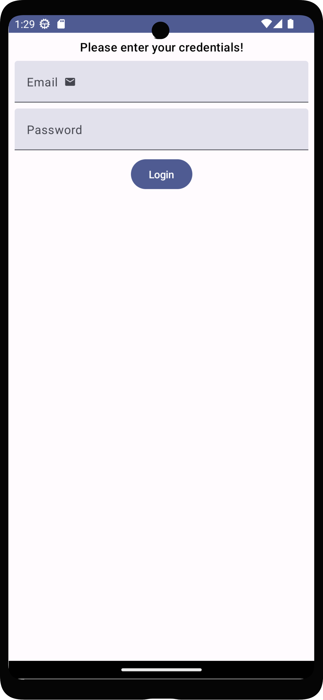
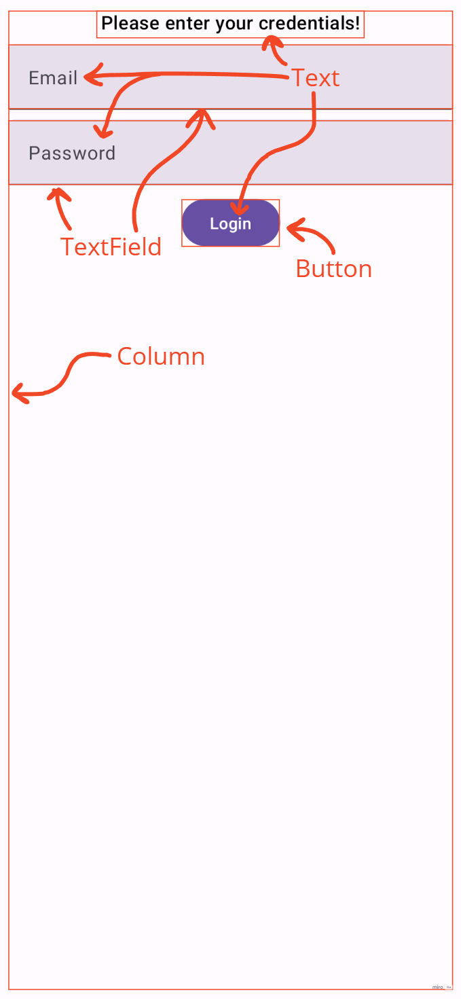
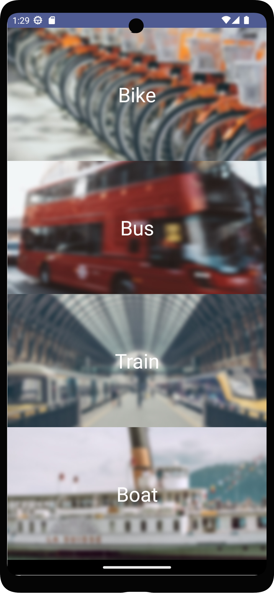
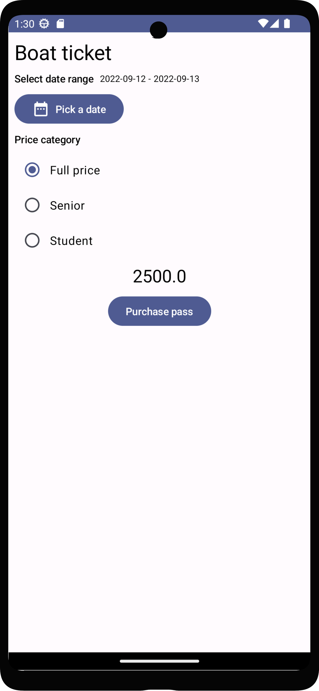
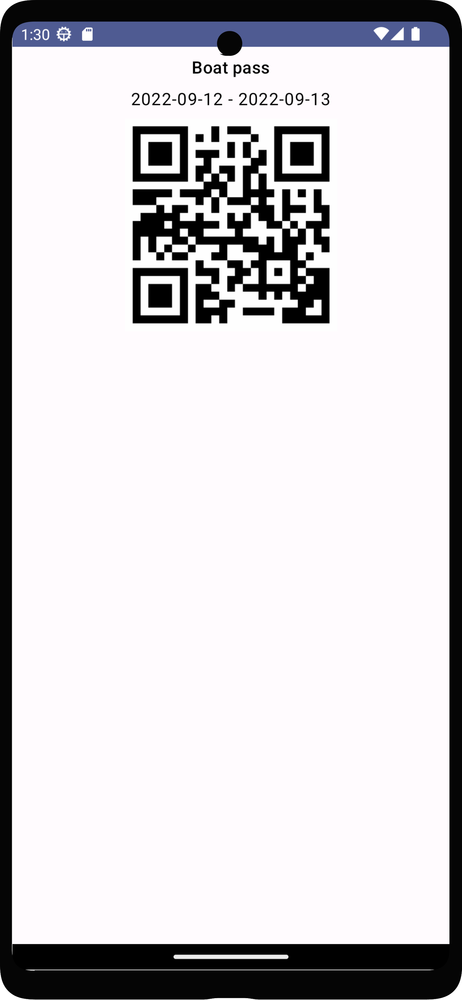

# Labor 02 Extra - Jetpackkel az égbe ☁ 🚀 ✨

***Szerző: Püspök-Kiss Balázs***

Ha bármi probléma lenne az extra laborral, ***Püspök-Kiss Balázs***-ra írjatok rá Teams-en, ő szívesen segít bármiben. Visszajelzéseket is nagy örömmel fogad. 🙂

## Bevezető

Az Extra feladat célja, hogy bemutasson egy megoldást, ami a legmodernebb eszközöket alkalmazza a
fejlesztés során. A motiváció a laborok átdolgozása mögött az, hogy szemléltesse a Compose képességeit, ezzel népszerűsítve a technológiát. A régi
technológiák támogatása szükséges, azonban mindig érdemes a jövőre figyelni, ott bővíteni a
jelenlegi tudását az embernek.

A dokumentáció segítségével egy olyan alkalmazást hozol létre, amit követendő példának ítélek meg. A
megoldás során szó fog esni ajánlott eszközökről, amik jelentősen megkönnyítették számomra a
fejlesztést, valamint nagyon hasznosnak ítélem meg őket és használatuk segíthet majd a házi feladat
megírásában is.

## Feladat előtti megjegyzés

Ez a feladat sok bónusz infót tartalmaz, aminek a használata a való életben nagyon kívánt, azonban
valószínűleg nem lesz számonkérve. A legjobb tudásom ellenére is azt kérem, hogy keressétek fel
gyakran a [Jetpack Compose] dokumentációját a hivatalos oldalán, sokkal több mindenről esik szó ott,
amire nekem nincs időm kitérni. Stackoverflow is hasznos olykor, keresni a Google-ön egyet, ha
rögtön nem működik valami.

## Setup ⚙

A kezdő projekt a [PublicTransportCompose](https://github.com/VIAUAC00/PublicTransportCompose) GitHub repository-ban van.
Egy projekt setup-olása és felkonfigurálása fontos, de nem a világot
szeretném megváltani, úgyhogy annak az elmagyarázása majd egy másik napra marad. Mindenesetre
megjegyzek néhány dolgot. *Át lehet ugrani idő hiányában a Setup részt, de nem érdemes, érdekes dolgokról van szó.*

*A `PublicTransport` starter projekt teljesen angol!*

### Erősen ajánlott pluginek

Mindenekelőtt ajánlanék néhány plugint, amik segítenek abban, hogy minél szebb és jobb minőségű kód kerüljön ki a kezeitek közül:

* [Detekt] - A root mappában található `detekt-config.yml` fájllal fel lehet konfigurálni, egy
linter, ami figyelmeztet adott formai dolgokra.
* [ktlint] - van egy unofficial pluginja JetBrains Marketplacen, ami telepítehető Android Studio-ra is, hasznos a built-in formatterje.
* [SonarLint] - egy statikus kódelemző. Szintén elérhető JetBrains Marketplacen, erősen ajánlom hogy telepítsétek, jó tippeket ad.

### 4 darab Activity

Lennie kellene 4 darab Activity fájlnak a projektben:

* `LoginActivity.kt`
* `ListActivity.kt`
* `DetailsActivity.kt`
* `PassActivity.kt`

Minden (kivéve 1) itteni Activity a [ComponentActivity]-ből származik le, ez a
default [Jetpack Compose]-nál. Ennek egyik leszármazottja
az [AppCompatActivity], amit gyakrabban használnak XML-es Activity-knél. Mindkettő az
alap [Activity]-ből származik le.

A `DetailsActivity` az [AppCompatActivity]-ből származik le, ami fontos szerepet fog játszani mikor
a dátumokat válasszuk ki a megvenni kívánt jegyhez.

### Manifest és Theme

Mindegyik Activity fel van véve az `AndroidManifest.xml` fájlba. Fontos az, hogy az Activity-khez
rendelt `res/values/themes.xml`-ben lévő `Theme.PublicTransport` az egy olyan téma legyen, ami
leszármazottja egy `Theme.AppCompat`-nek (ilyen a `Theme.Material3` is). Ez szintén ahhoz kell,
hogy a `DetailsActivity`-ben meg tudjuk jeleníteni a [DateRangePicker]-t.
Egyébként **nem sikerülne betölteni** a [DateRangePicker]-t, crashelne az app.

### Resources

**Import-tal nem kell foglalkozni**, minden be van rakva a `res` mappába. Ahelyett, hogy beégetnénk a szöveget a kódba, azt ajánlom, hogy `strings.xml`-ből nyerjük ki a szükséges kifejezéseket.
Windows-on <kbd>ALT</kbd>+<kbd>ENTER</kbd>, egyébként jobb klikk a raw String-re és rá kell nyomni
az `Extract string resource` menüre. Ekkor feljön egy dialog, hogy milyen kulccsal lehessen elérni
azt és automatikusan hozzáadja a szöveged a `strings.xml` fájlhoz, valamint refactorlálja a kódod a
legjobb tudása alapján az Android Studio (általában wrappeli így:
`stringResource(R.strings.my_string)`). Én úgy szoktam, hogy beírom raw string-ként, majd ezzel az
módszerrel be is rakom `strings.xml`-be. Key elnevezésénél érdemes követni a `snake_case`-t.

### Project `build.gradle`

Itt van meghatározva a [Jetpack Compose] verziója, valamint a használt Kotlin verziója is.
**Ne módosítsátok**, mert fura hibákat dobhat és nem fog lebuildelni a projekt, csak ha beírsz egy hosszú command line paramétert. Néha vannak ilyenek, nem lehet mindig a cutting-edge dolgokat használni.
Még annyit megjegyzek, hogy itt definiálva van egy `compose_version` érték, ami a [Jetpack Compose]
könyvtárak verzióját hivatott jellemezni. A Compose compiler-rének általában más a verziója, ezt
kézzel át kell írni egy igazi project során.

### Module `build.gradle`

Néhány fontosabb dolog, ami itt van:

```groovy
android {
    // ...
    buildFeatures {
        compose true
    }
    composeOptions {
        kotlinCompilerExtensionVersion "1.3.0" // Ez nem (feltétlenül) a compose_version!
    }
    // ...
    compileOptions {
        // ...
        coreLibraryDesugaringEnabled true
    }
}

dependencies {
    // ...
    implementation 'androidx.compose.material3:material3:1.0.0-beta01'
    // ...
    coreLibraryDesugaring 'com.android.tools:desugar_jdk_libs:1.1.6'
}
```

`buildFeatures`-nél jelezni kell egy `compose true`-val, hogy Compose-t használunk. Compose compiler
verzióját kézileg be kell állítani, ideális, ha a `compose_version` <= `compose_compiler_version`.

Aztán van egy úgynevezett desugaring könyvtár, ami az új, modern dolgokat elérhetővé teszi egy régebbi platformon,
így több készüléket tudunk támogatni ugyanazzal a kóddal. Pl. van az [Instant] osztály, ami `API 26`-ban jött ki,
viszont a desugaring használatával lemehetünk legalább `API 21`-ig (ennyi a `minSdk` a projektnél).
Ha kikommentezzük a `coreLibraryDesugaringEnabled true` sort, akkor rátok fog szólni az Android Studio,
hogy nem csekkolod azt, hogy `API 26` vagy annál modernebb készüléket használsz e, mikor
[Instant]-ot használsz a `DetailsActivity`-ben. A feladat végén kikommentezheted, hogy lásd
(gradle sync-elni kell, aztán látod). `< API 26` készülékeken desugaring nélkül crashelne az app, ha használnátok az `API 26`-tól elérhető funkciókat.

#### The more you know

Ha a groovy dependency-nél szeretnéd kiszervezni közös verziójú lib-ek verzióját, akkor azt
csakis `"`-val körbevett lib path esetén tudod megcsinálni egy `$` jellel a definiált verzió
előtt. `'`-val körbevett lib path esetén ez nem megy.

```groovy
dependencies {
    // ...
    // Ez a sor nincs benne a module build.gradle-ben, csak egy példa!
    def compose_version = "1.3.0-beta01"
    androidTestImplementation "androidx.compose.ui:ui-test-junit4:$compose_version"
    debugImplementation "androidx.compose.ui:ui-tooling:$compose_version"
    debugImplementation "androidx.compose.ui:ui-test-manifest:$compose_version"
    // ...
}
```

## Liftoff 🏖 🚀 ☁

4 Activity-t fogunk felépíteni egyesével, mindegyik valami egyedi feladatot lát el, amitől függni
fog a többi.

Röviden:

1. `LoginActivity`-nél `TextField`-et vizsgálunk, hogy beírt e a felhasználó valamit.
2. `ListActivity`-nél a kiválasztott listaelemtől függően különböző adatot továbbítunk a
`DetailActivity`-nek.
3. `DetailsActivity`-nél a `ListActivity` által küldött adatot dolgozzuk fel, valamint lehet
választani, milyen hosszú ideig és ki számára állítsunk ki egy béretet. Az ár dinamikusan változik
a napoktól függően. A napokat egy modern [DateRangePicker] által választhatjuk ki.
4. `PassActivity` megjeleníti az átvett adatok alapján a végső bérletet.

### Login 📲 ⏳ ⌛ ✅

Vannak [Jetpack Compose]-nál elemek, amik leegyszerűsítik más, XML-es elemek használatát. Egyik
ilyen a `Column`. A `Column` a `LinearLayout`-ot hivatott leváltani, egész jól ráadásul. Mindent
meg lehet vele csinálni, amit az XML counterpart-ja tud, és kevés kóddal! [Compose Layouts]
oldal egész jól összeszedi a dolgokat.

Másik fontos dolog Compose-nál, az a `Modifier`. `Modifier`-ek lényeges adatot hordozhatnak arról,
hogyan is viselkedjen a UI elem.

* Töltse ki a számára adott helyet?
* Csak vízszintesen?
* Mennyi legyen az elem körül a `padding`?
* Milyen távolság legyen az elemeim között egy `Column`-ban?

Ez csak néhány példa a több százból, amire képes a `Modifier`. Általában egy elemhez át lehet
adni egy `Modifier`-t a `modifier` paraméterén keresztül.

Egyébként erről jut eszembe, van
[ez a fantasztikus honlap][What is the euivalent of X in Jetpack Compose], ami megmondja adott
dolgoknak a Compose alternatíváját. Innen könnyebb lehet átírni a labort manuálisan, de inkább
használjátok a snippeteket, amiket adok nektek, ígérem, bőkezű leszek!

<!---
A lurkóknak, akik raw-ba nézik üzenem, hogy egy képet nem így szokás beilleszteni Markdown-ba,
viszont a center és resize miatt kénytelen voltam így megoldani. A helyes syntax egyébként
. img_path lehet url, relative vagy absolute path is (utóbbit nem
mindegyik parser támogatja).
--->
<p align="center">


</p>

A *`LoginScreen`* és layout-ja így nézne ki. Minden egyes Composable-re, mint a `Text`, `TextField`
és `Button` rá lehet keresni Google-ön, hogy hogyan működik pontosan, hogyan kell és érdemes őket
használni. Olyan sok mindent testre lehet szabni ezeknél az elemeknél, hogy el mehetne vele egy
egész labor, nem érnénk a végére ennek a három elemnek. Szerencsére open-source és [részletesen
dokumentált][Compose Layouts] minden, amit használtam, így könnyen utána lehet járni a dolgoknak.

#### ⚠ Figyelem! ⚠

***Figyelni kell arra, hogy Material Design 3 könyvtárat használtam a labor során, ez annyi különbséget
jelent, hogy pl. a `Button` az a [`androidx.compose.material3`][Androidx Compose Material 3]
könyvtárból származik, nem pedig a [`androidx.compose.material`][Androidx Compose Material]-ból.
Ha nem nézne ki úgy a UI, ahogy a képen, akkor figyelj arra, hogy a
[`androidx.compose.material3`][Androidx Compose Material 3] könyvtárból importáld a `Button`-t!***

A [`androidx.compose.material`][Androidx Compose Material] könyvtár is szükséges eleme a projektnek,
enélkül a Theme nem lehetne olyan amilyen és ez azt vonzza magával, hogy nem lehetne megnyitni a
[`DateRangePicker`][DateRangePicker]-t.

#### LoginScreen

Az alábbi kódot <kbd>CTRL</kbd>+<kbd>C</kbd> <kbd>CTRL</kbd>+<kbd>V</kbd>-vel lehet illeszteni a
`LoginActivity.kt` fájlba a `LoginActivity`osztály alá. A kommenteket érdemes feldolgozni, hogy
mi-mit csinál, bár a snippet után is van néhány dolog, amit elmagyarázok a kóddal kapcsolatban.

```kotlin
// Annotation needed to use TextField, Button, etc.
@OptIn(ExperimentalMaterial3Api::class)
@Preview(showBackground = true)
@Composable
fun LoginScreen() {
    Column(
        modifier = Modifier
            .fillMaxSize()
            .padding(8.dp),
        // There is 8.dp space between items in the Column
        verticalArrangement = Arrangement.spacedBy(8.dp)
    ) {
        Text(
            text = stringResource(R.string.please_enter_your_credentials),
            textAlign = TextAlign.Center,
            modifier = Modifier.fillMaxWidth(),
            style = MaterialTheme.typography.titleMedium
        )

        val context = LocalContext.current

        var email by remember { mutableStateOf("") }
        var emailLabel by remember { mutableStateOf(context.getString(R.string.email_label)) }
        var wasEmailValidated by remember { mutableStateOf(false) }
        val isEmailWrong = email.isBlank() && wasEmailValidated
        TextField(
            value = email,
            onValueChange = {
                email = it
                emailLabel = context.getString(R.string.email_label)
            },
            // label accepts a Composable. Can be anything! The wonders, Compose is capable of 😊.
            label = {
                Row(
                    horizontalArrangement = Arrangement.spacedBy(8.dp),
                    verticalAlignment = Alignment.CenterVertically
                ) {
                    Text(emailLabel)
                    if (!isEmailWrong) {
                        Icon(
                            imageVector = Icons.Filled.Email,
                            contentDescription = stringResource(R.string.email_icon),
                            modifier = Modifier.size(16.dp)
                        )
                    }
                }
            },
            modifier = Modifier.fillMaxWidth(),
            keyboardOptions = KeyboardOptions(
                keyboardType = KeyboardType.Email
            ),
            singleLine = true,
            // Show error state, when statement is true
            isError = isEmailWrong
        )

        var password by remember { mutableStateOf("") }
        var passwordLabel by remember { mutableStateOf(context.getString(R.string.password_label)) }
        var wasPasswordValidated by remember { mutableStateOf(false) }
        val isPasswordWrong = password.isBlank() && wasPasswordValidated
        TextField(
            value = password,
            onValueChange = {
                password = it
                passwordLabel = context.getString(R.string.password_label)
            },
            label = { Text(passwordLabel) },
            modifier = Modifier.fillMaxWidth(),
            keyboardOptions = KeyboardOptions(
                keyboardType = KeyboardType.Password
            ),
            singleLine = true,
            isError = isPasswordWrong
        )

        Button(
            onClick = {
                // Validating text fields
                wasEmailValidated = true
                wasPasswordValidated = true
                val emailEmpty = email.isBlank()
                if (emailEmpty) {
                    emailLabel = context.getString(R.string.please_enter_your_email_address)
                }
                val passwordEmpty = password.isBlank()
                if (passwordEmpty) {
                    passwordLabel = context.getString(R.string.please_enter_your_password)
                }
                if (!emailEmpty && !passwordEmpty) {
                    context.startActivity(
                        Intent(
                            context,
                            ListActivity::class.java
                        )
                    )
                }
            },
            modifier = Modifier.align(Alignment.CenterHorizontally)
        ) {
            Text(text = stringResource(R.string.login))
        }
    }
}
```

#### *remember* és *mutableStateOf*, [State and Jetpack Compose] és [Lifecycle of composables]

Compose-ban nagyon egyszerű a state handling. Minden változó, aminek a változását reflektálni
szeretnénk, becsomagoljuk egy ilyen `remember { mutableStateOf(/* Initial state */) }` blokkba,
majd ha módosítjuk a `by`-jal, vagy `=` jellel assignolt változót, akkor a **rekompozíció során nem
veszik el az adat**! Csak akkor veszik el az adat, ha maga a Composable a lifecycle végéhez ért és
leáll, mert ez a state nem perzisztens. Egyébként a [State and Jetpack Compose] cikk jól el tudja
magyarázni a dolgokat. A lifecycle-ről Composable-ök esetében [Lifecycle of composables] cikkben
tudtok olvasni.

#### Context

A `context` egy picit máshogy működik Compose-ban, mint ahogy Fragment-eknél. Ha kell a `context`,
akkor lekéred `LocalContext.current` hívással. Ez általában
ahhoz kellhet, ha valami lokalizált String-et akarsz megkapni szövekből, ha éppen nem tudod
meghívni a *`stringResource()`*-t, ami egy metódus, amit Composable scope-jában tudsz hívni.

#### State change

Ha a state változik, akkor a UI rekompózál, vagyis a friss state-tel újra lerenderelődik.
A `wasEmailValidated = true` műveletnél, mivel a `wasEmailValidated` egy state variable volt,
el fog indulni a UI rekompozíciója. Mondhatni mindig, amikor írunk az egyik `TextField`-be, elindul
egy rekompozíció, hogy reflektálja a változásokat.

#### Validáció

Megnézzük, hogy a `TextField` üres e (vagy tele van szóközökkel), ha igen, akkor jelezzük a hibát,
ha nem, akkor pedig megyünk is a `ListActivity-ben` a `TypeOfTravelScreen`-re.

### List

A `ListActivity`-nél az lesz a különbség, hogy több Composable-re fogjuk bontani a lista elemeit.
Mivel a listaelemek csak a háttérképükben, szövegükben és abban különböznek, hogy milyen típusú
utazást képviselnek.

<p align="center">

</p>

#### Kotlin Coding Conventions

Van néhány konvenció, néhány szabály, amit komolyan kell venni, hogy szép, konzisztens kódot tudjon
írni az ember. Ebben segít a [Kotlin Coding Conventions]! A dokumentációban lévő elveket segít
betartatni az Android Studio, a beállításoknál az `Editor` ➡ `Coding Style` ➡ `Kotlin` ➡
`Load/Save` tabon, lehet látni, hogy a [Kotlin Coding Conventions]-re alapszik a built-in
formatter. Ha már itt vagyunk ajánlom, hogy kapcsoljátok be az `Other` tabon a `Use trailing comma`
✅ opciót. A [Kotlin Coding Conventions] dokumentációban le van írva, miért jó.

Fontos dolog, amit innen kiemelnék, az, hogy nem mindenki követi ezeket az elveket, ami teljesen érthető, viszont szerintem nagyon sok különbséget jelent a használatuk, *madarat tolláról, informatikust kódjáról ismerni*. Ha figyeltek ezekre
a konvenciókra, akkor más is sokkal jobban fogja értékelni a munkátokat, mások munkáját is jobban
fogjátok tudni megítélni.

#### TypeOfTravelScreen és más Composable-ök

Alább is van egy code snippet, amit a `ListActivity.kt`-ba, a `TravelType` data class alá
kellene beilleszteni.

```kotlin
@Preview(showBackground = true)
@Composable
fun TypeOfTravelScreen() {
    // A Column would be fine as well, but we try
    // to reduce boilerplate code as much as possible.
    // That is why we made a list containing the travel types.
    LazyColumn(
        modifier = Modifier.fillMaxSize(),
        verticalArrangement = Arrangement.SpaceEvenly,
        userScrollEnabled = false
    ) {
        items(ListActivity.travelTypes) {
            TravelTypeButton(
                modifier = Modifier
                    .fillMaxWidth()
                    // fillMaxSize() does not work here, because of the LazyColumn
                    // not supporting it properly. It instead supports this:
                    .fillParentMaxHeight(1f / ListActivity.travelTypes.size),
                ticketType = it.ticketType,
                imageResourceId = it.imageResourceId,
                nameResourceId = it.nameResourceId
            )
        }
    }
}

// Example comment using Kotlin features. It is best not to overuse comments.
// Try writing code which documents itself and only comment when it is necessary.
/**
 * Creates a button with the background image of [imageResourceId],
 * and a label in the middle with the string of [nameResourceId].
 * Pressing the button will start [DetailsActivity] with the given
 * [context]. The [ticketType] is put into the [Intent] beforehand.
 */
@Composable
fun TravelTypeButton(
    modifier: Modifier = Modifier,
    context: Context = LocalContext.current,
    ticketType: Int = DetailsActivity.UnknownType,
    imageResourceId: Int = R.drawable.splash_image,
    nameResourceId: Int = R.string.unknown_ticket_type,
) {
    IconButton(
        onClick = {
            openTicketDetails(
                context = context,
                ticketType = ticketType
            )
        },
        modifier = modifier
    ) {
        TravelTypeImage(
            painterResourceId = imageResourceId,
            contentDescription = stringResource(nameResourceId),
        )
        TravelTypeText(text = stringResource(nameResourceId))
    }
}

// A more Java-like comment with KDoc!
// More formal, than above, but don't overuse it!
/**
 * Starts [DetailsActivity] with the given [context]
 * and the [ticketType] is put into the [Intent] beforehand.
 *
 * @param context starts [DetailsActivity].
 * @param ticketType will be put into the [Intent]
 * which starts [DetailsActivity].
 */
fun openTicketDetails(
    context: Context,
    ticketType: Int = DetailsActivity.UnknownType,
) {
    val intent = Intent(context, DetailsActivity::class.java)
        .putExtra(
            DetailsActivity.TicketTypeKey,
            ticketType
        )
    context.startActivity(intent)
}

@Composable
fun TravelTypeImage(
    modifier: Modifier = Modifier,
    painterResourceId: Int = R.drawable.splash_image,
    contentDescription: String = stringResource(R.string.unknown_ticket_type),
) {
    Image(
        painter = painterResource(painterResourceId),
        contentDescription = contentDescription,
        contentScale = ContentScale.Crop,
        modifier = modifier.fillMaxSize()
    )
}

@Composable
fun TravelTypeText(
    modifier: Modifier = Modifier,
    text: String = stringResource(R.string.unknown_ticket_type),
) {
    Text(
        text = text,
        color = Color.White,
        textAlign = TextAlign.Center,
        style = MaterialTheme.typography.headlineLarge,
        modifier = modifier
    )
}
```

#### Boilerplate megelőzése

Itt több különálló Composable-re szedtem a UI elemeket, hogy kevesebb
legyen a boilerplate (felesleges) kód. Boilerplate kód (duplikált, felesleges kód) több
programozási alapelvet megsért, köztük sokszor az *Open-Closed Principle-t* (OCP),
a *Single-Responsibility Principle-t* (SRP) és *Single Choice Principle-t* (SCP) valamint elkerüli
a jó szokásokat, mint a *Don't Repeat Yourself* (DRY) a temérdek más Principle-ökön kívül, amit
felsorolhatnék. Meg szeretném említeni itt az ***[Objektumorientált Szoftvertervezés]*** tárgyat, ami jobban részletezi ezeket az elveket és még többet a jó programozási szokásokról. Dr. Simon Balázs előadó diáiból szerintem nagyon meg lehet érteni ezeket, melegszívvel ajánlom.

#### Kommentelés

A kódkommentelésről is elrejtettem néhány jó tippet, a legjobb, ha önmagát dokumentálja a kód,
azonban egy-két komment sokat segíthet egy bonyolultabb, komplexebb mechanizmus megértésében.
Kotlin biztosít számunkra néhány hasznos eszközt, mint a `[...]`, amivel meg lehet referálni osztályokat, paramétereket. Kotlin kommentelési mintái erősen hajaznak a Javáéra, ezért van egy erős kompatibilitás a Java felől. A Kotlin is rendelkezik egy fajta dokumentálási rendszerrel, mint a `Javadoc`, ez pedig a [KDoc].

### Details 📃

Ennél a fejezetnél rendesen bele megyünk a ***RÉSZLETEK***be (kihagyhatatlan pun intended 😂).
Több, advanced Kotlin feature-t is bemutatok röviden, ami lehetőve tette, hogy működjön boilerplate
nélkül a kód.

Egyébként ez az egyetlen [Activity], amely [AppCompatActivity]-ből származik le, ez elengedhetetlen
része annak, hogy a [DateRangePicker] helyesen meg tudjon jelenni. Jelenleg ez az egyetlen módja
annak, hogy egy [DateRangePicker] szerű komponenst meg lehessen jeleníteni.

<p align="center">


</p>

`DetailsScreen` és a [DateRangePicker] képernyője. Nincs más dolgotok, csak be kell illeszteni az
alábbi kódot a `DetailsActivity` alá és el is kezdem magyarázni az újdonságokat.

```kotlin
@Preview(showBackground = true)
@Composable
fun DetailsScreen(
    ticketType: Int = DetailsActivity.UnknownType,
) {
    val scrollState = rememberScrollState()
    Column(
        modifier = Modifier
            .padding(8.dp)
            .fillMaxSize()
            .scrollable(
                state = scrollState,
                orientation = Orientation.Vertical
            ),
        verticalArrangement = Arrangement.spacedBy(8.dp)
    ) {
        // We save a lot of effort writing "DetailsActivity" when using the apply function
        DetailsActivity.apply {
            val ticketTypeText = when (ticketType) {
                BusType -> stringResource(R.string.bus_ticket)
                BikeType -> stringResource(R.string.bike_ticket)
                BoatType -> stringResource(R.string.boat_ticket)
                TrainType -> stringResource(R.string.train_ticket)
                else -> stringResource(R.string.unknown_ticket_type)
            }
            Text(
                text = ticketTypeText,
                style = MaterialTheme.typography.headlineMedium
            )
        }
        val context = LocalContext.current
        // Using Material 2 Designed Date Range Dialog fragment
        var startInstant by remember { mutableStateOf(Instant.now()) }
        var endInstant by remember {
            mutableStateOf(
                // Really cool way to convert Ints into whatever you like.
                // This x.days tells that you want x to be counted as days.
                // Then you convert x days into whatever duration you like.
                Instant.now().plusMillis(1.days.inWholeMilliseconds)
            )
        }
        Row(
            horizontalArrangement = Arrangement.spacedBy(8.dp),
            verticalAlignment = CenterVertically
        ) {
            Text(
                text = stringResource(R.string.select_date_range),
                style = MaterialTheme.typography.labelLarge
            )
            val startDate = startInstant.atZone(ZoneId.systemDefault()).toLocalDate()
            val endDate = endInstant.atZone(ZoneId.systemDefault()).toLocalDate()
            Text(
                text = "$startDate - $endDate",
                style = MaterialTheme.typography.bodySmall
            )
        }
        DateRangePickerButton(
            context = context,
            initialStartInstant = startInstant,
            initialEndInstant = endInstant,
            onSaveDateRangeListener = {
                startInstant = Instant.ofEpochMilli(it.first)
                endInstant = Instant.ofEpochMilli(it.second)
            }
        ) {
            Row(
                horizontalArrangement = Arrangement.spacedBy(8.dp),
                verticalAlignment = CenterVertically
            ) {
                Icon(
                    imageVector = Icons.Default.DateRange,
                    contentDescription = Icons.Default.DateRange.name
                )
                Text(text = stringResource(R.string.pick_a_date))
            }
        }
        Text(
            text = stringResource(R.string.price_category),
            style = MaterialTheme.typography.labelLarge
        )
        var selected by remember { mutableStateOf(DetailsActivity.FullPriceType) }
        DetailsActivity.apply {
            DetailsRadioGroup(
                options = hashMapOf(
                    // The "to" extension function makes it intuitive to make pairs!
                    FullPriceType to stringResource(R.string.full_price),
                    SeniorType to stringResource(R.string.senior),
                    StudentType to stringResource(R.string.student),
                ),
                selected = selected,
                onOptionSelectedChange = { selected = it },
            )

            val basePrice = when (ticketType) {
                BusType -> BusPrice
                BikeType -> BikePrice
                TrainType -> TrainPrice
                BoatType -> BoatPrice
                else -> maxOf(BusPrice, BikePrice, TrainPrice, BoatPrice)
            }
            val priceMultiplier = when (selected) {
                FullPriceType -> FullPriceMultiplier
                SeniorType -> SeniorMultiplier
                StudentType -> StudentMultiplier
                else -> FullPriceMultiplier
            }
            // Base price * discount * duration from start to end date (in days)
            val price = basePrice * priceMultiplier * endInstant
                .minusSeconds(startInstant.epochSecond)
                .epochSecond
                .seconds
                .inWholeDays
            Text(
                text = price.toString(),
                modifier = Modifier.fillMaxWidth(),
                textAlign = TextAlign.Center,
                style = MaterialTheme.typography.headlineSmall
            )
        }
        Button(
            onClick = {
                val startDate = startInstant.atZone(ZoneId.systemDefault()).toLocalDate()
                val endDate = endInstant.atZone(ZoneId.systemDefault()).toLocalDate()
                val dateString = "$startDate - $endDate"
                val intent = Intent(context, PassActivity::class.java)
                    .putExtra(PassActivity.TravelTypeKey, ticketType)
                    .putExtra(PassActivity.DateKey, dateString)
                context.startActivity(intent)
            },
            modifier = Modifier.align(CenterHorizontally)
        ) {
            Text(text = stringResource(R.string.purchase_pass))
        }
    }
}

@Composable
fun DateRangePickerButton(
    modifier: Modifier = Modifier,
    context: Context = LocalContext.current,
    initialStartInstant: Instant = Instant.now(),
    initialEndInstant: Instant = initialStartInstant.plusMillis(1.days.inWholeMilliseconds),
    onSaveDateRangeListener: (Pair<Long, Long>) -> Unit = {},
    content: @Composable RowScope.() -> Unit,
) {
    initialEndInstant.coerceAtLeast(initialStartInstant.plusMillis(1.days.inWholeMilliseconds))
    val constraints = CalendarConstraints.Builder()
        .setValidator(DateValidatorPointForward.now())
        .build()
    val datePickerDialog = MaterialDatePicker.Builder.dateRangePicker()
        .setTitleText(stringResource(R.string.start_date_end_date))
        .setSelection(
            Pair(
                initialStartInstant.toEpochMilli(),
                initialEndInstant.toEpochMilli()
            )
        )
        .setCalendarConstraints(constraints)
        .build()
    datePickerDialog.addOnPositiveButtonClickListener(onSaveDateRangeListener)
    Button(
        modifier = modifier,
        onClick = {
            datePickerDialog.show(
                // That is why we set DetailsActivity to be an AppCompatActivity
                // instead of a ComponentActivity.
                // Now, it can provide a supportFragmentManager!
                (context as AppCompatActivity).supportFragmentManager,
                datePickerDialog.toString()
            )
        },
        content = content
    )
}

/**
 * Creates an RadioGroup from given [options]. [options] contain an option and a String
 * to display the option with. [selected] can be null, as no option is selected yet.
 * [onOptionSelectedChange] is the observer lambda of any change in option selection.
 */
@Composable
inline fun <reified Option : Any, reified NullableOption : Option?> DetailsRadioGroup(
    modifier: Modifier = Modifier,
    options: HashMap<Option, String>,
    selected: NullableOption,
    crossinline onOptionSelectedChange: (Option) -> Unit = {},
) {
    DetailsRadioGroup(
        modifier = modifier,
        options = options.keys.toList(),
        selected = selected,
        onOptionSelectedChange = onOptionSelectedChange,
        optionToRadioButtonText = { options[it] ?: it.toString() }
    )
}

@Composable
inline fun <reified Option : Any, reified NullableOption : Option?> DetailsRadioGroup(
    modifier: Modifier = Modifier,
    options: List<Option>,
    selected: NullableOption,
    crossinline onOptionSelectedChange: (Option) -> Unit = {},
    crossinline optionToRadioButtonText: (Option) -> String = { it.toString() },
) {
    Column {
        // This is not a LazyColumn, but a less performant alternative!
        // Though it can be easier to work with.
        options.forEach { option ->
            Row(
                modifier = modifier
                    .fillMaxWidth()
                    .selectable(
                        selected = (option == selected),
                        onClick = { onOptionSelectedChange(option) }
                    ),
                verticalAlignment = CenterVertically,
            ) {
                RadioButton(
                    selected = (option == selected),
                    onClick = { onOptionSelectedChange(option) },
                )
                Text(text = optionToRadioButtonText(option))
            }
        }
    }
}
```

#### Template-ek jövője

Amikor Programozás alapjai 2-ből megismertem a template-eket, úgy érzetem, hogy egy teljesen új és nagyszerű világ nyílt meg előttem. Szerencsére átélhettem Kotlinban ugyanezt
az érzést az `inline`, `reified` és `crossinline` kulcsszavak megismerésénél. Konkrétan arra kell
gondolni, hogy a függvény automatikusan fel tudja ismerni, milyen típusú változót kap és nem kell
castolni esetleges callback-eket, ha valamilyen generikus observer/listener mintájú mechanizmust
szerenténk lekódolni.

A snippet alján vannak a `DetailsRadioGroup` ilyen template metódusok, ahol ***NEM KELL*** explicit
leírni, hogy `DetailsRadioGroup<String>("...")`, ha épp azt szeretnénk, hogy `String` legyen az
`Option` típus 😌. Boilerplate code: eliminálva.

#### Interop XML-lel (vagy Fragment-tel vagy egyéb régebbi technológiával)

Szerencsére nagyon egyszerű az interoperability [Jetpack Compose] és a régebbi technológiák között
az [Interoperability APIs] segítségével. Lényegében nagyobb probléma nélkül lehet régi, Fragment és
XML-es appba Compose alapú UI-t írni, valamint Compose-ba egy régi, még a Compose-ban nem jelenlévő
elemet tenni. Utóbbi egyébként szerintem egy jó módszer arra, hogy komplex, de kész régi eszközöket
fel lehessen használni Compose-ban, úgynevezet *Wrapping* segítségével. Konkrétan egy *Composable*
function-be helyezünk egy XML Screent [AndroidView]-t vagy [AndroidViewBinding]-ot használva.

Ez a módszer lehetővé teszi a fejlesztőket, hogy régi appokat felújítsanak, valamint az új
funkciókat már az újabb és jobb [Jetpack Compose]-ban írják.

#### [DateRangePicker] részletesebben

Beszélek itt az [Interoperability APIs]-ról, de szerencsémre/szerencsétlenségemre volt egy probléma
amit modern, [Jetpack Compose] eszközökkel nehezen tudtam megoldani. [DatePicker] létezik
Compose-ban, azonban amellett, hogy régi a fejlesztői interfésze, csak Dialog formában elérhető, és
[Material Design 2]-vel, nem [Material Design 3]-mal. Valamint csak 1 dátumot lehet vele
kiválasztani, nem egy intervallumot. Szerencsére a [DateRangePicker]-rel már tudunk intervallumot
választani, azonban a megjelenítése picit több munkát igényel, minthogy átadnánk neki egy
`Context`-tet. Mivel nem csak egy `Dialog`-ról van szó, hanem egy teljes `Fragment`-ről (egy
`FragmentDialog`-ról pontosabban), ezért szüksége van a `supportFragmentManager`-re. Ez a
[ComponentActivity]-ben nincs meg, viszont az [AppCompatActivity]-ban már biztosítja ezt számunkra. Ezért kellett
megváltoztatni a `DetailsActivity` ősét. Ez a változás azt is magával vonzotta, hogy a `Theme`-nek
le kellett származnia egy `Theme.AppCompat` theme-ből. És onnan sem akármelyikből, hanem olyanból,
aminek meg voltak adva adott attribútumai. Szerencsére a `Theme.Material3` implementálta ezeket és
rendeltetésszerűen működött tovább az applikáció.

#### Navigálás előre! 🗺

Mielőtt továbbmennék a `PassActivity`-hez, felhívnám a figyelmet, hogy a transzportáció típusát,
valamint egy date intervallumot reprezentáló String-et adunk át az Intentben.

### Pass 🛂

<p align="center">

</p>

Végső soron elértünk a `PassActivity`-hez! Ezt a kódot kellene *`copypasta`*-zni `PassActivity` alá, `PassScreen`-t helyettesítve.

```kotlin
@Preview(showBackground = true)
@Composable
fun PassScreen(
    modifier: Modifier = Modifier,
    passType: String = stringResource(R.string.unknown_pass_type),
    passDate: String = stringResource(R.string.start_date_end_date),
) {
    val scrollState = rememberScrollState()
    Column(
        modifier = modifier
            .padding(8.dp)
            .fillMaxSize()
            .scrollable(
                state = scrollState,
                orientation = Orientation.Vertical
            ),
        horizontalAlignment = Alignment.CenterHorizontally,
        verticalArrangement = Arrangement.spacedBy(8.dp)
    ) {
        Text(
            text = passType,
            style = MaterialTheme.typography.titleMedium
        )
        Text(text = passDate)
        Image(
            painter = painterResource(id = R.drawable.qrcode),
            contentDescription = stringResource(R.string.qr_code)
        )
    }
}
```

#### Intentből adat kinyerése, [Parcelable], [Parcelize]

Röviden: hasznos. Hosszabban: `best practice` az, hogy az az ideális, ha csak egy Activity-je van az embernek egy appon belül, ezért nem igazán szoktak Intent-eket használni általános navigációra.
Erre vannak jobb eszközök, amik `Fragment`-eket és `Composable`-öket vesznek igénybe. Mind a [Navigation Component],
[Compose Navigation] és a (szerintem ennek a jobb Compose alternatívája) [Compose Destinations]
között át kell adni egy egyszerűbb típusú objektumot, vagy [Parcelable]-t, hogy azt az
úticél `Fragment` vagy `Composable` fel tudja dolgozni.

Amint az ember [Parcelable]lé akarja alakítani a `data class`-szát, rájön, hogy saját maga kell implementálnia a szerializációt elősegítő absztrakt metódusokat. Egy apró tapasz erre a sebre az, hogy Android Studio felajánlja, hogy implementálja ezeket a metódusokat automatikusan és legenerálja a kódot közvetlenül az osztály tagjaként. Létezik azonban egy olyan plugin, amit úgy hívnak, hogy [Parcelize]. A plugin
segítségével elérhetővé válik számunkra a `@Parcelize` annotáció, amely segítségével automatikusan legenerálódnak ezek az implementációk. Nem kell hozzá az Android Studio segítségével legeneráltatni azokat, nincs plussz kód, amit meg kell érteni/amire figyelni kell.

## Végszó ✨ 🚀 💫

Az Extra feladat dokumentálása közben próbáltam ügyelni arra, hogy 4 fájl-ra 4 kódot kelljen csak
bemásolni, viszont maximalizálni szerettem volna a bónusz hasznos információkat, hogy az elszánt
kolléga minél több tudást és jó szokást könyvelhessen el magának. Valamint szerettem volna csinálni
egy cheat sheet-et azoknak akik [Jetpack Compose]-ban szeretnék a háziaikat írni 🥰.

Remélem, többször is előveszitek, nézegetitek a kódot,
rálestek a hyperlinkekre, módosítgatjátok a projekteket.

Egyébként jelenleg szakdolgozatomat írom a 2022-es őszi félévben, aminek része egy Android app,
ha rá szeretnétek nézni, mit-hogyan csinálok a legjobb tudásom szerint, akkor lessetek rá
[Jay]re 🐦 🥰. Szeretném, ha minél több embernek egyedi házija
legyen, GitHub-on temérdek sok open-source példa áll rendelkezésére, amiből ihletet
meríthet az ember.

[ComponentActivity]: https://developer.android.com/reference/androidx/activity/ComponentActivity

[Jetpack Compose]: https://developer.android.com/jetpack/compose

[AppCompatActivity]: https://developer.android.com/reference/androidx/appcompat/app/AppCompatActivity

[Activity]: https://developer.android.com/reference/android/app/Activity

[DateRangePicker]: https://material.io/components/date-pickers/android

[Instant]: https://developer.android.com/reference/java/time/Instant

[ktlint]: https://ktlint.github.io/

[Detekt]: https://detekt.dev/

[SonarLint]: https://www.sonarsource.com/products/sonarlint/

[What is the euivalent of X in Jetpack Compose]: https://www.jetpackcompose.app/What-is-the-equivalent-of-X-in-Jetpack-Compose

[Compose Layouts]: https://developer.android.com/jetpack/compose/layouts

[Androidx Compose Material 3]: https://developer.android.com/jetpack/androidx/releases/compose-material3

[Androidx Compose Material]: https://developer.android.com/jetpack/androidx/releases/compose-material

[State and Jetpack Compose]: https://developer.android.com/jetpack/compose/state

[Lifecycle of composables]: https://developer.android.com/jetpack/compose/lifecycle

[Kotlin Coding Conventions]: https://kotlinlang.org/docs/coding-conventions.html

[Objektumorientált Szoftvertervezés]: https://edu.vik.bme.hu/course/view.php?id=5217

[vik.wiki]: https://vik.wiki

[KDoc]: https://kotlinlang.org/docs/kotlin-doc.html

[Interoperability APIs]: https://developer.android.com/jetpack/compose/interop/interop-apis

[AndroidView]: https://developer.android.com/reference/kotlin/androidx/compose/ui/viewinterop/package-summary#AndroidView(kotlin.Function1,androidx.compose.ui.Modifier,kotlin.Function1)

[AndroidViewBinding]: https://developer.android.com/reference/kotlin/androidx/compose/ui/viewinterop/package-summary#AndroidViewBinding(kotlin.Function3,androidx.compose.ui.Modifier,kotlin.Function1)

[DatePicker]: https://material.io/components/date-pickers

[Material Design 2]: https://m2.material.io/

[Material Design 3]: https://m3.material.io/

[Compose Navigation]: https://developer.android.com/jetpack/compose/navigation

[Navigation Component]: https://developer.android.com/guide/navigation

[Compose Destinations]: https://composedestinations.rafaelcosta.xyz/

[Parcelable]: https://developer.android.com/reference/android/os/Parcelable

[Parcelize]: https://developer.android.com/kotlin/parcelize

[Jay]: https://github.com/HLCaptain/jay-android/tree/feature-compose