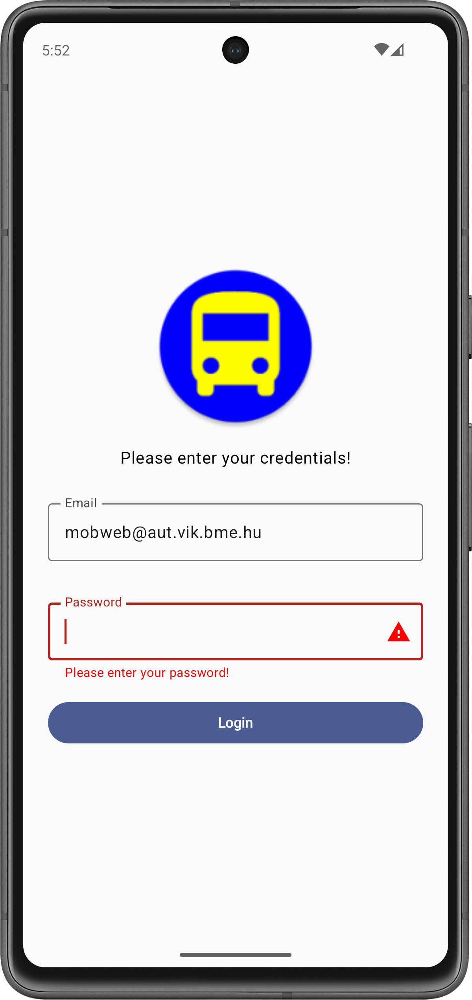
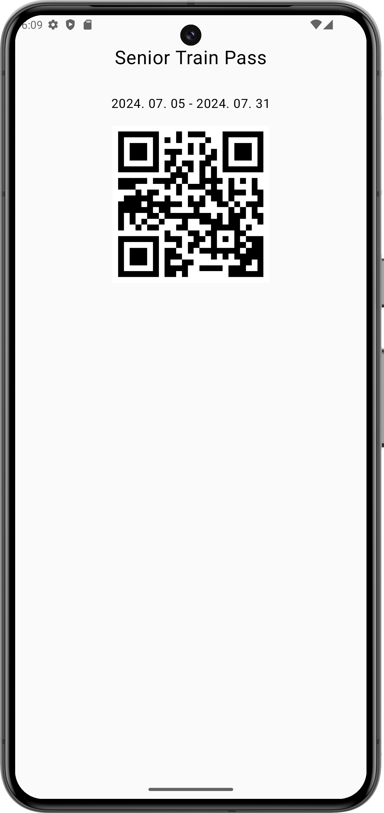
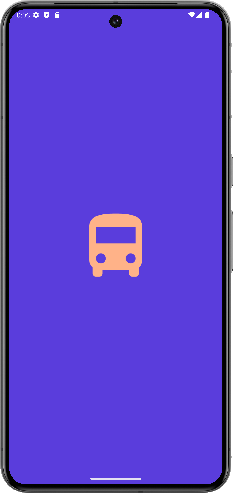
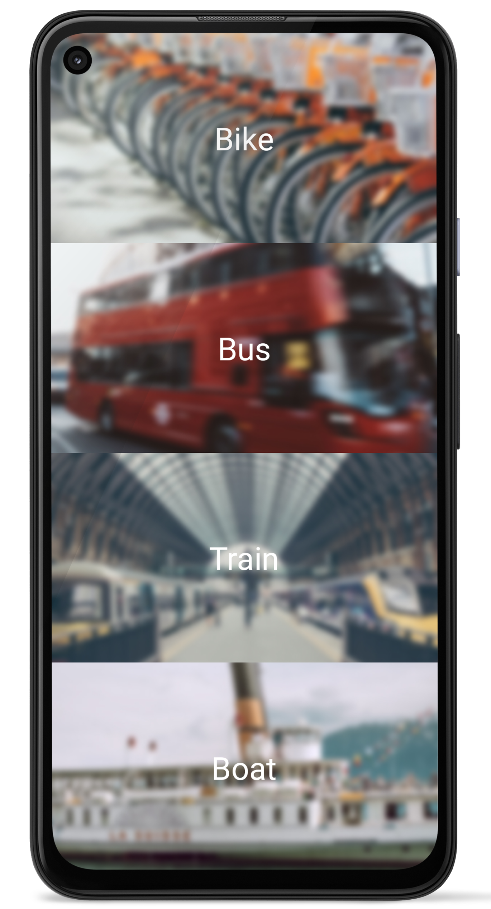
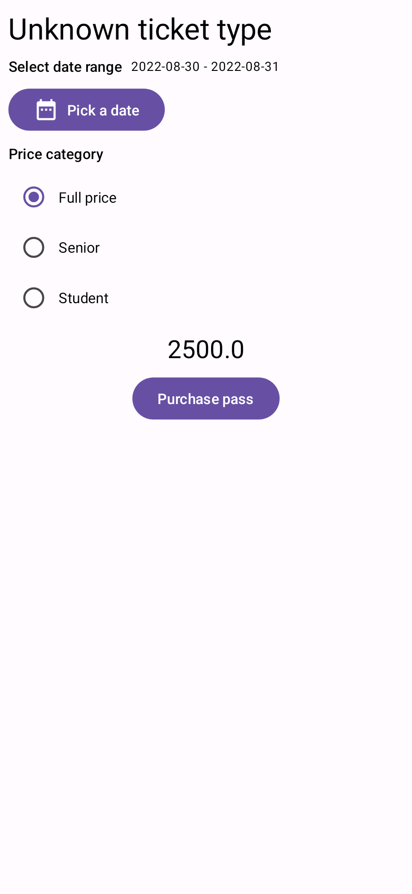

# Labor 02 - Felhasználói felület készítés

## Bevezető

A labor során egy tömegközlekedési vállalat számára megálmodott alkalmazás vázát készítjük el. Az alkalmazással a felhasználók különböző járművekre vásárolhatnak majd bérleteket. Az üzleti logikát (az authentikációt, a bevitt adatok ellenőrzését, a fizetés lebonyolítását) egyelőre csak szimulálni fogjuk, a labor fókusza a felületek és a köztük való navigáció elkészítése lesz.

<p align="center">




</p>

!!! warning "IMSc"
	A laborfeladatok sikeres befejezése után az IMSc feladat-ot megoldva 2 IMSc pont szerezhető.

## Előkészületek

A feladatok megoldása során ne felejtsd el követni a [feladat beadás folyamatát](../../tudnivalok/github/GitHub.md).

### Git repository létrehozása és letöltése

1. Moodle-ben keresd meg a laborhoz tartozó meghívó URL-jét és annak segítségével hozd létre a saját repository-dat.

1. Várd meg, míg elkészül a repository, majd checkout-old ki.

    !!! tip ""
        Egyetemi laborokban, ha a checkout során nem kér a rendszer felhasználónevet és jelszót, és nem sikerül a checkout, akkor valószínűleg a gépen korábban megjegyzett felhasználónévvel próbálkozott a rendszer. Először töröld ki a mentett belépési adatokat (lásd [itt](../../tudnivalok/github/GitHub-credentials.md)), és próbáld újra.

1. Hozz létre egy új ágat `megoldas` néven, és ezen az ágon dolgozz.

1. A `neptun.txt` fájlba írd bele a Neptun kódodat. A fájlban semmi más ne szerepeljen, csak egyetlen sorban a Neptun kód 6 karaktere.


!!! info "Android, Java, Kotlin"
	Az Android hagyományosan Java nyelven volt fejleszthető, azonban az utóbbi években a Google átállt a [Kotlin](https://kotlinlang.org/) nyelvre. Ez egy sokkal modernebb nyelv, mint a Java, sok olyan nyelvi elemet ad, amit kényelmes használni, valamint új nyelvi szabályokat, amikkel például elkerülhetőek a Java nyelven gyakori `NullPointerException` jellegű hibák.

	Másrészről viszont a nyelv sok mindenben tér el a hagyományosan C jellegű szintaktikát követő nyelvektől, amit majd látni is fogunk. A labor előtt érdemes megismerkedni a nyelvvel, egyrészt a fent látható linken, másrészt [ezt](https://developer.android.com/kotlin/learn) az összefoglaló cikket átolvasva.

## Projekt létrehozása

Első lépésként indítsuk el az Android Studio-t, majd:

1. Hozzunk létre egy új projektet, válasszuk az *Empty Activity* lehetőséget.
2. A projekt neve legyen `PublicTransport`, a kezdő package `hu.bme.aut.android.publictransport`, a mentési hely pedig a kicheckoutolt repository-n belül a PublicTransport mappa.
3. Nyelvnek válasszuk a *Kotlin*-t.
4. A minimum API szint legyen API21: Android 5.0.
5. Az instant app támogatást, valamint a *Use legacy android.support libraries* pontot **ne** pipáljuk be.

!!!danger "FILE PATH"
	A projekt a repository-ban lévő PublicTransport könyvtárba kerüljön, és beadásnál legyen is felpusholva! A kód nélkül nem tudunk maximális pontot adni a laborra!

!!!info ""
	A projekt létrehozásakor, a fordító keretrendszernek rengeteg függőséget kell letöltenie. Amíg ez nem történt meg, addig a projektben nehézkes navigálni, hiányzik a kódkiegészítés, stb... Éppen ezért ezt tanácsos kivárni, azonban ez akár 5 percet is igénybe vehet az első alkalommal! Az ablak alján látható információs sávot kell figyelni.

Láthatjuk, hogy létrejött egy projekt, amiben van egy Activity, `MainActivity` néven, valamint egy hozzá tartozó layout fájl `activity_main.xml` néven. Nevezzük ezeket át `LoginActivity`-re, illetve `activity_login.xml`-re. Ezt a jobb gomb > Refactor > Rename menüpontban lehet megtenni (vagy Shift+F6). Az átnevezésnél található egy Scope nevű beállítás. Ezt állítsuk úgy be, hogy csak a jelenlegi projekten belül nevezze át a dolgokat (Project Files).

!!!note ""
	Érdemes megfigyelni, hogy az átnevezés "okos". A layout fájl átnevezése esetén a LoginActivity-ben nem kell kézzel átírnunk a layout fájl azonosítóját, mert ezt a rendszer megteszi. Ugyanez igaz a manifest fájlra is.

## Splash képernyő (0.5 pont)

Az első Activity-nk a nevéhez híven a felhasználó bejelentkezéséért lesz felelős, azonban még mielőtt ez megjelenik a felhasználó számára, egy splash képernyővel fogjuk üdvözölni. Ez egy elegáns megoldás arra, hogy az alkalmazás betöltéséig ne egy egyszínű képernyő legyen a felhasználó előtt, hanem egy tetszőleges saját design.

<p align="center"> 

</p>

Először töltsük le [az alkalmazáshoz képeit tartalmazó tömörített fájlt](./downloads/res.zip), ami tartalmazza az összes képet, amire szükségünk lesz. A tartalmát másoljuk be az `app/src/main/res` mappába (ehhez segít, ha Android Studio-ban bal fent a szokásos Android nézetről a Project nézetre váltunk, esetleg a mappán jobb klikk > Show in Explorer).

Hozzunk létre egy új XML fájlt a `drawable` mappában `splash_background.xml` néven. Ez lesz a splash képernyőnkön megjelenő grafika. A tartalma az alábbi legyen:

```xml
<?xml version="1.0" encoding="utf-8"?>
<layer-list xmlns:android="http://schemas.android.com/apk/res/android">

    <item>
        <bitmap
            android:gravity="fill_horizontal|clip_vertical"
            android:src="@drawable/splash_image"/>
    </item>

</layer-list>
```

Jelen esetben egyetlen képet teszünk ide, de további `item`-ek felvételével komplexebb dolgokat is összeállíthatnánk itt. Tipikus megoldás például egy egyszínű háttér beállítása, amin az alkalmazás ikonja látszik.

Nyissuk meg a `values/themes.xml` fájlt. Ez definiálja az alkalmazásban használt különböző témákat. A splash képernyőhöz egy új témát fogunk létrehozni, amelyben az előbb létrehozott drawable-t állítjuk be az alkalmazásablakunk hátterének (mivel ez látszik valójában, amíg nem töltött be a UI többi része). Ezt így tehetjük meg:

```xml
<style name="SplashTheme" parent="Theme.AppCompat.NoActionBar">
    <item name="android:windowBackground">@drawable/splash_background</item>
</style>
```

A fenti témát illesszük be a `night` minősítővel ellátott `themes.xml` fájlba is.


A téma használatához az alkalmazásunk manifest fájlját (`AndroidManifest.xml`) kell módosítanunk. Ezt megnyitva láthatjuk, hogy jelenleg a teljes alkalmazás az `AppTheme` nevű témát használja.

```xml
<application
    ...
    android:theme="@style/Theme.PublicTransport" >
```

Mi ezt nem akarjuk megváltoztatni, hanem csak a `LoginActivity`-nek akarunk egy új témát adni. Ezt így tehetjük meg:

```xml
<activity
    android:name=".LoginActivity"
    android:theme="@style/SplashTheme">
    ...
</activity>
```

Mivel a betöltés után már nem lesz szükségünk erre a háttérre, a `LoginActivity.kt` fájlban a betöltés befejeztével visszaállíthatjuk az eredeti témát, amely fehér háttérrel rendelkezik. Ezt az `onCreate` függvény elején tegyük meg, még a `super` hívás előtt:

```kotlin
override fun onCreate(savedInstanceState: Bundle?) {
    setTheme(R.style.Theme_PublicTransport)
    ...
}
```

!!!warning "SDK verzió"
    Az Android a 31-es SDK verzió óta támogat egy [splash screen API](https://developer.android.com/develop/ui/views/launch/splash-screen)-t,
    így a labron bemutatott megoldás az alapértelmezett 33-as SDK verziójú emulátorokon nem fog működni.

Most már futtathatjuk az alkalmazást, és betöltés közben látnunk kell a berakott képet. A splash képernyő általában akkor hasznos, ha az alkalmazás inicializálása sokáig tart. Mivel a mostani alkalmazásunk még nagyon gyorsan indul el, szimulálhatunk egy kis töltési időt az alábbi módon:

```kotlin
override fun onCreate(savedInstanceState: Bundle?) {
    try {
        Thread.sleep(1000)
    } catch (e: InterruptedException) {
        e.printStackTrace()
    }
    setTheme(R.style.Theme_PublicTransport);
    ...
}
```

!!!example "BEADANDÓ (0.5 pont)"
	Készíts egy **képernyőképet**, amelyen látszik a **splash képernyő** (emulátoron, készüléket tükrözve vagy képernyőfelvétellel), egy **ahhoz tartozó kódrészlet**, valamint a **neptun kódod a kódban valahol kommentként**. A képet a megoldásban a repository-ba f1.png néven töltsd föl. 

	A képernyőkép szükséges feltétele a pontszám megszerzésének.
	

## Login képernyő (0.5 pont)

Most már elkészíthetjük a login képernyőt. A felhasználótól egy email címet, illetve egy számokból álló jelszót fogunk bekérni, és egyelőre csak azt fogjuk ellenőrizni, hogy beírt-e valamit a mezőkbe.

<p align="center"> 

</p>

Az `activity_login.xml` fájlba kerüljön az alábbi kód. Alapértelmezetten egy grafikus szerkesztő nyílik meg, ezt át kell állítani a szöveges szerkesztőre. Ezt az Android Studio verziójától függően a jobb felső, vagy a jobb alsó sarokban lehet megtenni:

```xml
<?xml version="1.0" encoding="utf-8"?>
<LinearLayout xmlns:android="http://schemas.android.com/apk/res/android"
    xmlns:tools="http://schemas.android.com/tools"
    android:layout_width="match_parent"
    android:layout_height="match_parent"
    android:layout_margin="16dp"
    android:orientation="vertical"
    tools:context=".LoginActivity">

    <TextView
        android:layout_width="wrap_content"
        android:layout_height="wrap_content"
        android:layout_gravity="center"
        android:layout_margin="16dp"
        android:text="Please enter your credentials" />

    <TextView
        android:layout_width="wrap_content"
        android:layout_height="wrap_content"
        android:text="Email" />

    <EditText
        android:id="@+id/etEmailAddress"
        android:layout_width="match_parent"
        android:layout_height="wrap_content" />

    <TextView
        android:layout_width="wrap_content"
        android:layout_height="wrap_content"
        android:text="Password" />

    <EditText
        android:id="@+id/etPassword"
        android:layout_width="match_parent"
        android:layout_height="wrap_content" />

    <Button
        android:id="@+id/btnLogin"
        android:layout_width="wrap_content"
        android:layout_height="wrap_content"
        android:layout_gravity="center"
        android:text="Login" />

</LinearLayout>
```

- A használt elrendezés teljesen lineáris, csak egymás alá helyezünk el benne különböző View-kat egy `LinearLayout`-ban. 
- Az `EditText`-eknek és a `Button`-nek adtunk ID-kat, hogy később kódból elérjük őket.

Az alkalmazást újra futtatva megjelenik a layout, azonban most még bármilyen szöveget be tudnunk írni a két beviteli mezőbe. Az `EditText` osztály lehetőséget ad számos speciális input kezelésére, XML kódban az [`inputType`](https://developer.android.com/reference/android/widget/TextView.html#attr_android:inputType) attribútum megadásával. Jelen esetben az email címet kezelő `EditText`-hez a `textEmailAddress` értéket, a másikhoz pedig a `numberPassword` értéket használhatjuk.

```xml
<EditText
    android:id="@+id/etEmailAddress"
    ...
    android:inputType="textEmailAddress" />

<EditText
    android:id="@+id/etPassword"
    ...
    android:inputType="numberPassword" />
```

Ha most kipróbáljuk az alkalmazást, már látjuk a beállítások hatását: 

- A legtöbb billentyűzettel az első mezőhöz most már megjelenik a `@` szimbólum, a másodiknál pedig csak számokat írhatunk be.
- Mivel a második mezőt jelszó típusúnak állítottuk be, a karakterek a megszokott módon elrejtésre kerülnek a beírásuk után.

Még egy dolgunk van ezen a képernyőn, az input ellenőrzése. Ezt a `LoginActivity.kt` fájlban tehetjük meg. A layout-unkat alkotó `View`-kat az `onCreate` függvényben lévő `setContentView` hívás után tudjuk először elérni. 

!!!note ""
	Ezt csinálhatnánk a klasszikus módon, azaz példányosítunk egy gombot, a `findViewById` metódussal referenciát szerzünk a felületen lévő vezérlőre, és a példányon beállítjuk az eseménykezelőt:
	
	```kotlin
	val btnLogin = findViewById<Button>(R.id.btnLogin)
	btnLogin.setOnClickListener {
	    ...
	}
	```

	Azonban a `findViewById` hívásnak számos problémája [van](https://developer.android.com/topic/libraries/view-binding#findviewbyid). Ezekről bővebben az előadáson lesz szó (pl.: *Null safety*, *type safety*). Ezért ehelyett "nézetkötést", azaz `ViewBinding`-ot fogunk használni.

A [`ViewBinding`](https://developer.android.com/topic/libraries/view-binding) a kódírást könnyíti meg számunkra. Amennyiben ezt használjuk, az automatikusan generálódó *binding* osztályokon keresztül közvetlen referencián keresztül tudunk elérni minden *ID*-val rendelkező erőforrást az `XML` fájljainkban.

Először is be kell kapcsolnunk a modulunkra a `ViewBinding`-ot. Az `app` modulhoz tartozó `build.gradle` fájlban az `android` tagen belülre illesszük be az engedélyezést (Ezek után kattintsunk jobb felül a `Sync Now` gombra.):

```kotlin
android {
    ...
    buildFeatures {
        viewBinding true
    }
}

```

Ezzel után már a teljes modulunkban automatikusan elérhetővé vált a `ViewBinding`. 

!!! info "ViewBinding"
	Ebben az esetben a modul minden egyes XML layout fájljához generálódik egy úgynevezett binding osztály. Minden binding osztály tartalmaz referenciát az adott XML layout erőforrás gyökér elemére és az összes ID-val rendelkező view-ra. A generált osztály neve úgy áll elő, hogy az XML layout nevét Pascal formátumba alakítja a rendszer és a végére illeszti, hogy `Binding`. Azaz például a `result_profile.xml` erőforrásfájlból az alábbi binding osztály generálódik: `ResultProfileBinding`.

	```xml
	<LinearLayout ... >
	    <TextView android:id="@+id/name" />
	    <ImageView android:cropToPadding="true" />
	    <Button android:id="@+id/button"
	        android:background="@drawable/rounded_button" />
	</LinearLayout>
	```
	
	A generált osztálynak két mezője van. A `name` id-val rendelkező `TextView` és a `button` id-jú `Button`. A layout-ban szereplő ImageView-nak nincs id-ja, ezért nem szerepel a binding osztályban.
	
	Minden generált osztály tartalmaz egy `getRoot()` metódust, amely direkt referenciaként szolgál a layout gyökerére. A példában a `getRoot()` metódus a `LinearLayout`-tal tér vissza.

A `ViewBinding` használatához tehát az `Activity`-nkben csak példányosítanunk kell a `binding` objektumot, amin keresztül majd elérhetjük az erőforrásainkat.
A `binding` példány működéséhez három dolgot kell tennünk:

1. A generált `binding` osztály *statikus* `inflate` függvényével példányosítjuk a `binding` osztályunkat az `Activity`-hez.
2. Referenciát szerzünk a gyökérelemre. Ezt kétféleképpen is megtehetjük. Vagy meghívjuk a `getRoot()` metódust, vagy a Kotlin property syntax-ot használva.
3.  Ezt a gyökérelemet odaadjuk a `setContentView()` függvénynek, hogy ez legyen az aktív *view* a képernyőn:

```kotlin
private lateinit var binding: ActivityLoginBinding

override fun onCreate(savedInstanceState: Bundle?) {
    try {
        Thread.sleep(1000)
    } catch (e: InterruptedException) {
        e.printStackTrace()
    }
    setTheme(R.style.Theme_PublicTransport)
    super.onCreate(savedInstanceState)
    binding = ActivityLoginBinding.inflate(layoutInflater)
    setContentView(binding.root)
}
```

!!!info "lateinit"
	A [`lateinit`](https://kotlinlang.org/docs/reference/properties.html#late-initialized-properties-and-variables) kulcsszóval megjelölt property-ket a fordító megengedi inicializálatlanul hagyni az osztály konstruktorának lefutása utánig, anélkül, hogy nullable-ként kéne azokat megjelölnünk (ami később kényelmetlenné tenné a használatukat, mert mindig ellenőriznünk kéne, hogy `null`-e az értékük). Ez praktikus olyan esetekben, amikor egy osztály inicializálása nem a konstruktorában történik (például ahogy az `Activity`-k esetében az `onCreate`-ben), mert később az esetleges `null` eset lekezelése nélkül használhatjuk majd a property-t. A `lateinit` használatával átvállaljuk a felelősséget a fordítótól, hogy a property-t az első használata előtt inicializálni fogjuk - ellenkező esetben kivételt kapunk.

Ezek után már be is állíthatjuk a gombunk eseménykezelőit:

```kotlin
binding.btnLogin.setOnClickListener {
    if(binding.etEmailAddress.text.toString().isEmpty()) {
        binding.etEmailAddress.requestFocus()
        binding.etEmailAddress.error = "Please enter your email address"
    }
    else if(binding.etPassword.text.toString().isEmpty()) {
        binding.etPassword.requestFocus()
        binding.etPassword.error = "Please enter your password"
    }
    else {
        // TODO login
    }
}
```

Amennyiben valamelyik `EditText` üres volt, a `requestFocus` függvény meghívásával aktívvá tesszük, majd az [`error`](https://developer.android.com/reference/android/widget/TextView.html#setError(java.lang.CharSequence)) property beállításával kiírunk rá egy hibaüzenetet. Ez egy kényelmes, beépített megoldás input hibák jelzésére. Így nem kell például egy külön `TextView`-t használnunk erre a célra, és abba beleírni a fellépő hibát. Ezt már akár ki is próbálhatjuk, bár helyes adatok megadása esetén még nem történik semmi.

!!!info "setOnClickListener"
	A [`setOnClickListener`](https://developer.android.com/reference/android/view/View.html#setOnClickListener(android.view.View.OnClickListener)) függvény valójában olyan objektumot vár paraméterként, ami megvalósítja a [`View.OnClickListener`](https://developer.android.com/reference/android/view/View.OnClickListener) interfészt. Ezt Java-ban anonim objektumokkal szokás megoldani, amit [meg lehet tenni](https://kotlinlang.org/docs/reference/object-declarations.html#object-expressions) Kotlin nyelven is.Ehelyett azonban érdemesebb kihasználni, hogy a Kotlin rendelkezik igazi függvény típusokkal, így megadható egy olyan [lambda kifejezés](https://kotlinlang.org/docs/reference/lambdas.html#lambda-expressions-and-anonymous-functions), amelynek a fejléce megegyezik az elvárt interfész egyetlen függvényének fejlécével. Ez alapján pedig a [SAM conversion](https://kotlinlang.org/docs/reference/java-interop.html#sam-conversions) nevű nyelvi funkció a háttérben a lambda alapján létrehozza a megfelelő `View.OnClickListener` példányt.

!!!example "BEADANDÓ (0.5 pont)"
	Készíts egy **képernyőképet**, amelyen látszik a **login képernyő** (emulátoron, készüléket tükrözve vagy képernyőfelvétellel), egy **ahhoz tartozó kódrészlet**, valamint a **neptun kódod az e-mail mezőbe begépelve**. A képet a megoldásban a repository-ba f2.png néven töltsd föl. 

	A képernyőkép szükséges feltétele a pontszám megszerzésének.

## Lehetőségek listája (1 pont)

A következő képernyőn a felhasználó a különböző járműtípusok közül válaszhat. Egyelőre három szolgáltatás működik a fiktív vállalatunkban: biciklik, buszok illetve vonatok.

<p align="center"> 

</p>

Hozzunk ehhez létre egy új Activity-t (a package-ünkön jobb klikk > New > Activity > Empty Activity), nevezzük el `ListActivity`-nek. Most, hogy ez már létezik, menjünk vissza a `LoginActivity` kódjában lévő TODO-hoz, és indítsuk ott el ezt az új Activity-t:


```kotlin
binding.btnLogin.setOnClickListener {
    ...
    else {
        startActivity(Intent(this, ListActivity::class.java))
    }
}
```

Folytassuk a layout elkészítésével a munkát, az `activity_list.xml` tartalmát cseréljük ki az alábbira:

```xml
<?xml version="1.0" encoding="utf-8"?>
<LinearLayout xmlns:android="http://schemas.android.com/apk/res/android"
    xmlns:tools="http://schemas.android.com/tools"
    android:layout_width="match_parent"
    android:layout_height="match_parent"
    android:orientation="vertical"
    android:weightSum="3"
    tools:context=".ListActivity">

    <FrameLayout
        android:layout_width="match_parent"
        android:layout_height="0dp"
        android:layout_weight="1">

    </FrameLayout>

    <FrameLayout
        android:layout_width="match_parent"
        android:layout_height="0dp"
        android:layout_weight="1">

    </FrameLayout>

    <FrameLayout
        android:layout_width="match_parent"
        android:layout_height="0dp"
        android:layout_weight="1">

    </FrameLayout>

</LinearLayout>
```

Ismét egy függőleges LinearLayout-ot használunk, most azonban súlyokat adunk meg benne. A gyökérelemben megadjuk, hogy a súlyok összege (`weightSum`) `3` lesz, és mindhárom gyerekének `1`-es súlyt (`layout_weight`), és `0dp` magasságot adunk. Ezzel azt érjük el, hogy három egyenlő részre osztjuk a képernyőt, amit a három `FrameLayout` fog elfoglalni.

A `FrameLayout` egy nagyon egyszerű és gyors elrendezés, amely lényegében csak egymás tetejére teszi a gyerekeiként szereplő View-kat. Ezeken belül egy-egy képet, illetve azokon egy-egy feliratot fogunk elhelyezni. A három sávból az elsőt így készíthetjük el:

```xml
<FrameLayout
    android:layout_width="match_parent"
    android:layout_height="0dp"
    android:layout_weight="1">

    <ImageButton
        android:id="@+id/btnBike"
        android:layout_width="match_parent"
        android:layout_height="match_parent"
        android:gravity="center"
        android:padding="0dp"
        android:scaleType="centerCrop"
        android:src="@drawable/bikes" />

    <TextView
        android:layout_width="wrap_content"
        android:layout_height="wrap_content"
        android:layout_gravity="center"
        android:text="@string/bike"
        android:textColor="#FFF"
        android:textSize="36sp" />

</FrameLayout>
```

Az itt használt `ImageButton` pont az, aminek hangzik: egy olyan gomb, amelyen egy képet helyezhetünk el. Azt, hogy ez melyik legyen, az `src` attribútummal adtuk meg. Az utána szereplő `TextView` fehér színnel és nagy méretű betűkkel a kép fölé fog kerülni, ebbe írjuk bele a jármű nevét.

A `@string/bike` hibát jelez. Mint látható, itt sem egy konkrét szöveget, hanem egy hivatkozást használunk. Ez azért hasznos, mert így egy helyre tudjuk szervezni a szöveges erőforrásainkat (`strings.xml`), így egyszerűen [lokalizálhatjuk](https://developer.android.com/guide/topics/resources/localization) az alkalmazásunkat `erőforrásminősítők` segítségével. 

Adjunk tehát értéket a `@strings/bike` elemnek. Ezt megtehetjük kézzel is a `strings.xml`-ben, de `Alt+Enter`rel a helyi menüben is:

```xml
<string name="bike">Bike</string>
```

Töltsük ki ehhez hasonló módon a másik két `FrameLayout`-ot is, ID-ként használjuk a `@+id/btnBus` és `@+id/btnTrain` értékeket, képnek pedig használhatjuk a korábban már bemásolt `@drawable/bus` és `@drawable/trains` erőforrásokat. Ne felejtsük el a `TextView`-k szövegét is értelemszerűen átírni.

Próbáljuk ki az alkalmazásunkat, bejelentkezés után a most elkészített lista nézethez kell jutnunk.

!!!example "BEADANDÓ (1 pont)"
	Készíts egy **képernyőképet**, amelyen látszik a **jármúvek listája** (emulátoron, készüléket tükrözve vagy képernyőfelvétellel), egy **ahhoz tartozó kódrészlet**, valamint a **neptun kódod a kódban valahol kommentként**. A képet a megoldásban a repository-ba f3.png néven töltsd föl. 

	A képernyőkép szükséges feltétele a pontszám megszerzésének.


## Részletes nézet (1 pont)

Miután a felhasználó kiválasztotta a kívánt közlekedési eszközt, néhány további opciót fogunk még felajánlani számára. Ezen a képernyőn fogja kiválasztani a bérleten szereplő dátumokat, illetve a rá vonatkozó kedvezményt, amennyiben van ilyen.

<p align="center"> 

</p>

Hozzuk létre ezt az új Activity-t `DetailsActivity` néven, a layout-ját kezdjük az alábbi kóddal:

```xml
<?xml version="1.0" encoding="utf-8"?>
<ScrollView xmlns:android="http://schemas.android.com/apk/res/android"
    xmlns:tools="http://schemas.android.com/tools"
    android:layout_width="match_parent"
    android:layout_height="match_parent"
    android:clipToPadding="false"
    android:padding="16dp"
    android:scrollbarStyle="outsideInset"
    tools:context=".DetailsActivity">

    <LinearLayout
        android:layout_width="match_parent"
        android:layout_height="wrap_content"
        android:orientation="vertical">

    </LinearLayout>

</ScrollView>
```

Az eddigiekhez képest itt újdonság, hogy a használt `LinearLayout`-ot egy `ScrollView`-ba tesszük, mivel sok nézetet fogunk egymás alatt elhelyezni, és alapértelmezetten egy `LinearLayout` nem görgethető, így ezek bizonyos eszközökön már a képernyőn kívül lennének.

Kezdjük el összerakni a szükséges layout-ot a `LinearLayout` belsejében. Az oldal tetejére elhelyezünk egy címet, amely a kiválasztott jegy típusát fogja megjeleníteni.

```xml
<TextView
    android:id="@+id/tvTicketType"
    android:layout_width="wrap_content"
    android:layout_height="wrap_content"
    android:layout_gravity="center"
    android:textSize="24sp" 
    tools:text="Bus ticket" />
```

!!!note ""
	Az itt használt `tools` névtérrel megadott `text` attribútum hatása csak az előnézetben fog megjelenni, az alkalmazásban ezt majd a Kotlin kódból állítjuk be, az előző képernyőn megnyomott gomb függvényében.

Az első beállítás ezen a képernyőn a bérlet érvényességének időtartama lesz. 

Ezt az érvényesség első és utolsó napjának megadásával tesszük, amelyhez a `DatePicker` osztályt használjuk fel. Ez alapértelmezetten egy teljes havi naptár nézetet jelenít meg, azonban a `calendarViewShown="false"` és a `datePickerMode="spinner"` beállításokkal egy kompaktabb, "pörgethető" választót kapunk.

```xml
<TextView
    android:layout_width="wrap_content"
    android:layout_height="wrap_content"
    android:text="Start date" />

<DatePicker
    android:id="@+id/dpStartDate"
    android:layout_width="match_parent"
    android:layout_height="160dp"
    android:calendarViewShown="false"
    android:datePickerMode="spinner" />

<TextView
    android:layout_width="wrap_content"
    android:layout_height="wrap_content"
    android:text="End date" />

<DatePicker
    android:id="@+id/dpEndDate"
    android:layout_width="match_parent"
    android:layout_height="160dp"
    android:calendarViewShown="false"
    android:datePickerMode="spinner" />
```

Ezeknek a `DatePicker`-eknek is adtunk ID-kat, hiszen később szükségünk lesz a Kotlin kódunkban a rajtuk beállított értékekre.


Még egy beállítás van hátra, az árkategória kiválasztása - nyugdíjasoknak és közalkalmazottaknak különböző kedvezményeket adunk a jegyek árából.

Mivel ezek közül az opciók közül egyszerre csak egynek akarjuk megengedni a kiválasztását, ezért `RadioButton`-öket fogunk használni, amelyeket Androidon egy `RadioGroup`-pal kell összefognunk, hogy jelezzük, melyikek tartoznak össze.

```xml
<TextView
    android:layout_width="wrap_content"
    android:layout_height="wrap_content"
    android:text="Price category" />

<RadioGroup
    android:id="@+id/rgPriceCategory"
    android:layout_width="wrap_content"
    android:layout_height="wrap_content">

    <RadioButton
        android:id="@+id/rbFullPrice"
        android:layout_width="wrap_content"
        android:layout_height="wrap_content"
        android:checked="true"
        android:text="Full price" />

    <RadioButton
        android:id="@+id/rbSenior"
        android:layout_width="wrap_content"
        android:layout_height="wrap_content"
        android:text="Senior" />

    <RadioButton
        android:id="@+id/rbPublicServant"
        android:layout_width="wrap_content"
        android:layout_height="wrap_content"
        android:text="Public servant" />

</RadioGroup>
```

!!!warning "FONTOS"
	Fontos, hogy adjunk ID-t a teljes csoportnak, és a benne lévő minden opciónak is, mivel később ezek alapján tudjuk majd megnézni, hogy melyik van kiválasztva.

Végül az oldal alján kiírjuk a kiválasztott bérlet árát, illetve ide kerül a megvásárláshoz használható gomb is. Az árnak egyelőre csak egy fix értéket írunk ki.

```xml
<TextView
    android:id="@+id/tvPrice"
    android:layout_width="wrap_content"
    android:layout_height="wrap_content"
    android:layout_gravity="center"
    android:layout_margin="8dp"
    android:text="42000" />

<Button
    android:id="@+id/btnPurchase"
    android:layout_width="wrap_content"
    android:layout_height="wrap_content"
    android:layout_gravity="center"
    android:layout_margin="8dp"
    android:text="Purchase pass" />
```

Ne felejtsük el, a stringeket itt is kiszervezni!

Meg kell oldanunk még azt, hogy az előző képernyőn tett választás eredménye elérhető legyen a `DetailsActivity`-ben. Ezt úgy tehetjük meg, hogy az Activity indításához használt `Intent`-be teszünk egy azonosítót, amiből kiderül, hogy melyik típust választotta a felhasználó.

Ehhez a `DetailsActivity`-ben vegyünk fel egy konstanst, ami ennek a paraméternek a kulcsaként fog szolgálni:

```kotlin
class DetailsActivity : AppCompatActivity() {
    companion object {
        const val KEY_TRANSPORT_TYPE = "KEY_TRANSPORT_TYPE"
    }
    ...
}
```

Ezután menjünk a `ListActivity` kódjához, és vegyünk fel konstansokat a különböző támogatott járműveknek:

```kotlin
class ListActivity : AppCompatActivity() {
    companion object {
        const val TYPE_BIKE = 1
        const val TYPE_BUS = 2
        const val TYPE_TRAIN = 3
    }
    ...
}
```

!!!info "static"
	A Kotlin egy nagy eltérése az eddig ismert, megszokott OOP nyelvektől, hogy nincs benne `static` kulcsszó, és így nincsenek statikus változók vagy függvények sem. Ehelyett minden osztályhoz lehet definiálni egy [`companion object`-et](https://kotlinlang.org/docs/reference/object-declarations.html#companion-objects), ami egy olyan singleton-t definiál, ami az osztály összes példányán keresztül elérhető. Röviden, minden `companion object`-en belül definiált konstans, változó, függvény úgy viselkedik, mintha statikus lenne.

Most már létrehozhatjuk a gombok listener-jeit, amelyek elindítják a `DetailsActivity`-t, extrának beletéve a kiválasztott típust. Az első gomb listenerjének beállítását így tehetjük meg a `ViewBinding`beállítása után:

```kotlin
private lateinit var binding: ActivityListBinding

...

 override fun onCreate(savedInstanceState: Bundle?) {
     super.onCreate(savedInstanceState)

     binding = ActivityListBinding.inflate(layoutInflater)
     setContentView(binding.root)

     binding.btnBike.setOnClickListener {
         val intent = Intent(this, DetailsActivity::class.java)
         intent.putExtra(DetailsActivity.KEY_TRANSPORT_TYPE, TYPE_BIKE)
         startActivity(intent)
     }
}
```

A másik két gomb listener-je ugyanerre a mintára működik, csupán az átadott típus konstanst kell megváltoztatni bennük. Hozzuk létre ezeket is! (Ezt a viselkedést érdemes lehet később kiszervezni egy külön osztályba, ami implementálja az `OnClickListener` interfészt, de ezt most nem tesszük meg.)

Még hátra van az, hogy a `DetailsActivity`-ben kiolvassuk ezt az átadott paramétert, és megjelenítsük a felhasználónak. Ezt az `onCreate` függvényében tehetjük meg, az Activity indításához használt `Intent` elkérésével (`intent` property), majd az előbbi kulcs használatával:

```kotlin
val transportType = this.intent.getIntExtra(KEY_TRANSPORT_TYPE, -1)
```

Ezt az átadott számot még le kell képeznünk egy stringre, ehhez vegyünk fel egy egyszerű segédfüggvényt:

```kotlin
private fun getTypeString(transportType: Int): String {
    return when (transportType) {
        ListActivity.TYPE_BUS -> "Bus pass"
        ListActivity.TYPE_TRAIN -> "Train pass"
        ListActivity.TYPE_BIKE -> "Bike pass"
        else -> "Unknown pass type"
    }
}
```

!!!info "when"
	Egy másik nagy eltérése a Kotlin-nak a megszokott nyelvektől, hogy nincs benne `switch`. Helyette a Kotlin egy [`when`](https://kotlinlang.org/docs/reference/control-flow.html#when-expression) nevű szerkezetet használ, ami egyrészről egy kifejezés (látható, hogy az értéke vissza van adva), másrészről pedig sokkal sokoldalúbb feltételeket kínál, mint a hagyományos *case*.

Végül pedig az `onCreate` függvénybe visszatérve meg kell keresnünk a megfelelő `TextView`-t, és beállítani a szövegének a függvény által visszaadott értéket (készítsük el a `ViewBindingot` is):

```kotlin
binding.tvTicketType.text = getTypeString(transportType)
```

Próbáljuk ki az alkalmazást! A `DetailsActivity`-ben meg kell jelennie a hozzáadott beállításoknak, illetve a tetején a megfelelő jegy típusnak.

!!!example "BEADANDÓ (1 pont)"
	Készíts egy **képernyőképet**, amelyen látszik a **részletes nézet** (emulátoron, készüléket tükrözve vagy képernyőfelvétellel), egy **ahhoz tartozó kódrészlet**, valamint a **neptun kódod a kódban valahol kommentként**. A képet a megoldásban a repository-ba f4.png néven töltsd föl. 

	A képernyőkép szükséges feltétele a pontszám megszerzésének.


## A bérlet (1 pont)

Az alkalmazás utolsó képernyője már kifejezetten egyszerű lesz, ez magát a bérletet fogja reprezentálni. Itt a bérlet típusát és érvényességi idejét fogjuk megjeleníteni, illetve egy QR kódot, amivel ellenőrizni lehet a bérletet.

<p align="center"> 

</p>

Hozzuk létre a szükséges Activity-t, `PassActivity` néven. Ennek az Activity-nek szüksége lesz a jegy típusára és a kiválasztott dátumokra - a QR kód az egyszerűség kedvéért egy fix kép lesz.

Az adatok átadásához először vegyünk fel két kulcsot a `PassActivity`-ben:

```kotlin
class PassActivity : AppCompatActivity() {
    companion object {
        const val KEY_DATE_STRING = "KEY_DATE_STRING"
        const val KEY_TYPE_STRING = "KEY_TYPE_STRING"
    }
    ...
}
```

Ezeket az adatokat a `DetailsActivity`-ben kell összekészítenünk és beleraknunk az `Intent`-be. Ehhez adjunk hozzá a vásárlás gombhoz egy listener-t az `onCreate`-ben:

```kotlin
binding.btnPurchase.setOnClickListener {
    val typeString = getTypeString(transportType)
    val dateString = "${getDateFrom(binding.dpStartDate)} - ${getDateFrom(binding.dpEndDate)}"

    val intent = Intent(this, PassActivity::class.java)
    intent.putExtra(PassActivity.KEY_TYPE_STRING, typeString)
    intent.putExtra(PassActivity.KEY_DATE_STRING, dateString)
    startActivity(intent)
}
```

!!!info ""
	 Látható, hogy a Java-val ellentétben a Kotlin támogatja a [string interpolációt](https://kotlinlang.org/docs/reference/basic-types.html#string-templates).

Ebben összegyűjtjük a szükséges adatokat, és a megfelelő kulcsokkal elhelyezzük őket a `PassActivity` indításához használt `Intent`-ben.

A `getDateFrom` egy segédfüggvény lesz, ami egy `DatePicker`-t kap paraméterként, és formázott stringként visszaadja az éppen kiválasztott dátumot, ennek implementációja a következő:

```kotlin
private fun getDateFrom(picker: DatePicker): String {
    return String.format(
        Locale.getDefault(), "%04d.%02d.%02d.",
        picker.year, picker.month + 1, picker.dayOfMonth
    )
}
```

!!!note "Megjegyzés"
	Itt a hónaphoz azért adtunk hozzá egyet, mert akárcsak a [`Calendar`](https://developer.android.com/reference/java/util/Calendar.html#MONTH) osztály esetében, a `DatePicker` osztálynál is 0 indexelésűek a hónapok.)


Most már elkészíthetjük a `PassActivity`-t. Kezdjük a layout-jával (`activity_pass.xml`), aminek már majdnem minden elemét használtuk, az egyetlen újdonság itt az `ImageView` használata.

```xml
<?xml version="1.0" encoding="utf-8"?>
<ScrollView xmlns:android="http://schemas.android.com/apk/res/android"
    xmlns:tools="http://schemas.android.com/tools"
    android:layout_width="match_parent"
    android:layout_height="match_parent"
    tools:context=".PassActivity">

    <LinearLayout
        android:layout_width="match_parent"
        android:layout_height="wrap_content"
        android:layout_margin="16dp"
        android:orientation="vertical">

        <TextView
            android:id="@+id/tvTicketType"
            android:layout_width="wrap_content"
            android:layout_height="wrap_content"
            android:layout_gravity="center"
            android:textSize="24sp"
            tools:text="Train pass" />

        <TextView
            android:id="@+id/tvDates"
            android:layout_width="wrap_content"
            android:layout_height="wrap_content"
            android:layout_gravity="center"
            android:layout_margin="16dp"
            tools:text="1999.11.22. - 2012.12.21." />

        <ImageView
            android:layout_width="300dp"
            android:layout_height="300dp"
            android:layout_gravity="center"
            android:src="@drawable/qrcode" />

    </LinearLayout>

</ScrollView>
```

Az Activity Kotlin kódjában pedig csak a két `TextView` szövegét kell az `Intent`-ben megkapott értékekre állítanunk az `onCreate` függvényben(illetve beállítani a `ViewBindingot`):

```kotlin
binding.tvTicketType.text = intent.getStringExtra(KEY_TYPE_STRING)
binding.tvDates.text = intent.getStringExtra(KEY_DATE_STRING)

```

!!!example "BEADANDÓ (1 pont)"
	Készíts egy **képernyőképet**, amelyen látszik a **bérlet képernyő** (emulátoron, készüléket tükrözve vagy képernyőfelvétellel), egy **ahhoz tartozó kódrészlet**, valamint a **neptun kódod a kódban valahol kommentként**. A képet a megoldásban a repository-ba f5.png néven töltsd föl. 

	A képernyőkép szükséges feltétele a pontszám megszerzésének.


## Önálló feladat - Hajó bérlet (1 pont)

Vállalatunk terjeszkedésével elindult a hajójáratokat ajánló szolgáltatásunk is. Adjuk hozzá ezt az új bérlet típust az alkalmazásunkhoz!

???success "Megoldás"
	A szükséges változtatások nagy része a `ListActivity`-ben lesz. Először frissítsük az Activity layout-ját: itt egy új `FrameLayout`-ot kell hozzáadnunk, amiben a gomb ID-ja legyen `@+id/btnBoat`. A szükséges képet már tartalmazza a projekt, ezt `@drawable/boat` néven találjuk meg.

	Ne felejtsük el a gyökérelemünkként szolgáló `LinearLayout`-ban átállítani a `weightSum` attribútumot `3`-ról `4`-re, hiszen most már ennyi a benne található View-k súlyainak összege. (Kipróbálhatjuk, hogy mi történik, ha például `1`-re, vagy `2.5`-re állítjuk ezt a számot, a hatásának már az előnézetben is látszania kell.)
	
	Menjünk az Activity Kotlin fájljába, és következő lépésként vegyünk fel egy új konstanst a hajó típus jelölésére.
	
	```kotlin
	const val TYPE_BOAT = 4
	```
	
	Az előző három típussal azonos módon keressük a hajót kiválasztó gombra (`btnBoat`) is állítsunk be rá egy listener-t, amely elindítja a `DetailsActivity`-t, a `TYPE_BOAT` konstanst átadva az `Intent`-ben paraméterként.
	
	Még egy dolgunk maradt, a `DetailsActivity` kódjában értelmeznünk kell ezt a paramétert. Ehhez a `getTypeString` függvényen belül vegyünk fel egy új ágat a `when`-ben:
	
	```kotlin
	ListActivity.TYPE_BOAT -> "Boat pass"
	```

!!!example "BEADANDÓ (1 pont)"
	Készíts **két képernyőképet**, amelyen látszik a **jármű választó képernyő** illetve a **hajó bérlet képernyő** (emulátoron, készüléket tükrözve vagy képernyőfelvétellel), és az **ezekhez tartozó kódrészlet**, valamint a **neptun kódod a kódban valahol kommentként**. A képeket a megoldásban a repository-ba f6.png és f7.png néven töltsd föl. 

	A képernyőképek szükséges feltételei a pontszám megszerzésének.


## iMSc feladat


Korábban a részletes nézetben egy fix árat írtunk ki a képernyőre. Írjuk meg a bérlet árát kiszámoló logikát, és ahogy a felhasználó változtatja a bérlet paramétereit, frissítsük a megjelenített árat.

Az árazás a következő módon működjön:

| Közlekedési eszköz | Bérlet ára naponta |
| ------------------ | ------------------ |
| Bicikli            | 700                |
| Busz               | 1000               |
| Vonat              | 1500               |
| Hajó               | 2500               |

Ebből még az alábbi kedvezményeket adjuk:

| Árkategória    | Kedvezmény mértéke |
| -------------- | ------------------ |
| Teljes árú     | 0%                 |
| Nyugdíjas      | 90%                |
| Közalkalmazott | 50%                |

!!!tip "Tipp"
	A számolásokhoz és az eseménykezeléshez a [`Calendar`][calendar] osztályt, a `DatePicker` osztály [`init`][picker-init-link] függvényét, illetve a `RadioGroup` osztály [`setOnCheckedChangeListener`][radio-checked-changed] osztályát érdemes használni.

	[calendar]: https://developer.android.com/reference/java/util/Calendar.html

	[picker-init-link]: https://developer.android.com/reference/android/widget/DatePicker.html#init(int%2C%20int%2C%20int%2C%20android.widget.DatePicker.OnDateChangedListener)

	[radio-checked-changed]: https://developer.android.com/reference/android/widget/RadioGroup.html#setOnCheckedChangeListener(android.widget.RadioGroup.OnCheckedChangeListener)

### Különböző bérlet napi árak (1 IMSc pont)

!!!example "BEADANDÓ (1 IMSc pont)"
	Készíts egy **képernyőképet**, amelyen látszik egy **több napos bérlet részletes nézete az árral** (emulátoron, készüléket tükrözve vagy képernyőfelvétellel), **a bérletárakkal kapcsolatos kóddal**, valamint a **neptun kódod a kódban valahol kommentként**. A képet a megoldásban a repository-ba f8.png néven töltsd föl. 

	A képernyőkép szükséges feltétele a pontszám megszerzésének.

### Százalékos kedvezmények ( 1 IMSc pont)

!!!example "BEADANDÓ (1 IMSc pont)"
	Készíts egy **képernyőképet**, amelyen látszik egy **több napos kedvezményes bérlet részletes nézete az árral** (emulátoron, készüléket tükrözve vagy képernyőfelvétellel), **a bérletkedvezményekkel kapcsolatos kóddal**, valamint a **neptun kódod a kódban valahol kommentként**. A képet a megoldásban a repository-ba f9.png néven töltsd föl. 

	A képernyőkép szükséges feltétele a pontszám megszerzésének.

### Extra feladat: Labor átírása Jetpack Compose-ra

<p align="center">





</p>

A labor a tárgy egyik fiatal laborvezetője által átírásra került [`Jetpack Compose`](https://developer.android.com/jetpack/compose)-ra. A labor feladat célja a `Jetpack Compose` és a modern eszközök, fejlesztési módszertanok népszerűsítése Android platformra. Az útmutató vezetetten, hasznos információkkal és tippekkel megtámogatva mutat be egy ideális példát a feladat megoldására. Elvégzése extra munkával jár. ***Az extra labor kísérleti jelleggel készült és nem része a pontozási rendszernek.***

Ha bármi probléma lenne az extra laborral, ***Püspök-Kiss Balázs***-ra írjatok rá Teams-en, ő szívesen segít bármiben. Visszajelzéseket is nagy örömmel fogad. 🙂
