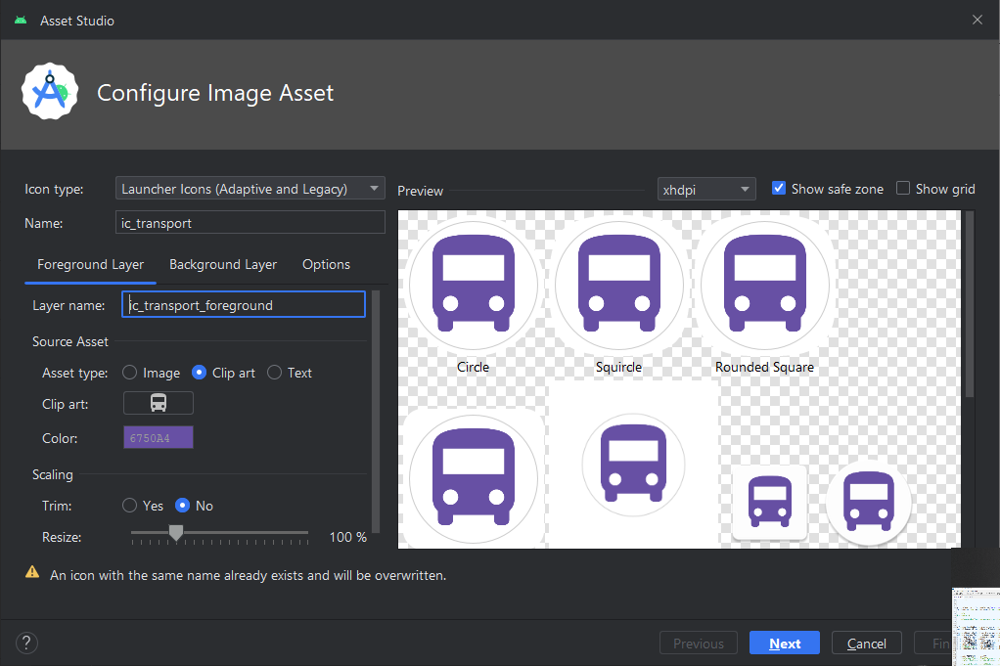
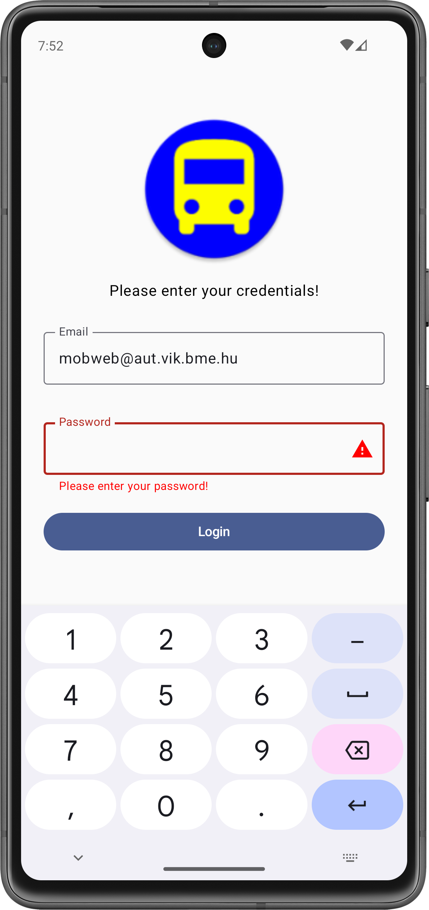

# Labor 02 - UI - Tömegközlekedési alkalmazás

## Bevezető

A labor során egy tömegközlekedési vállalat számára megálmodott alkalmazás vázát készítjük el. Az alkalmazással a felhasználók különböző járművekre vásárolhatnak majd bérleteket. Az üzleti logikát (az authentikációt, a bevitt adatok ellenőrzését, a fizetés lebonyolítását) egyelőre csak szimulálni fogjuk, a labor fókusza a felületek és a köztük való navigáció elkészítése lesz.

<p align="center">


</p>

!!! warning "IMSc"
	A laborfeladatok sikeres befejezése után az IMSc feladat-ot megoldva 2 IMSc pont szerezhető.

## Előkészületek

A feladatok megoldása során ne felejtsd el követni a [feladat beadás folyamatát](../../tudnivalok/github/GitHub.md).

### Git repository létrehozása és letöltése

1. Moodle-ben keresd meg a laborhoz tartozó meghívó URL-jét és annak segítségével hozd létre a saját repository-dat.

1. Várd meg, míg elkészül a repository, majd checkout-old ki.

    !!! tip ""
        Egyetemi laborokban, ha a checkout során nem kér a rendszer felhasználónevet és jelszót, és nem sikerül a checkout, akkor valószínűleg a gépen korábban megjegyzett felhasználónévvel próbálkozott a rendszer. Először töröld ki a mentett belépési adatokat (lásd [itt](../../tudnivalok/github/GitHub-credentials.md)), és próbáld újra.

1. Hozz létre egy új ágat `megoldas` néven, és ezen az ágon dolgozz.

1. A `neptun.txt` fájlba írd bele a Neptun kódodat. A fájlban semmi más ne szerepeljen, csak egyetlen sorban a Neptun kód 6 karaktere.


!!! info "Android, Java, Kotlin"
	Az Android hagyományosan Java nyelven volt fejleszthető, azonban az utóbbi években a Google átállt a [Kotlin](https://kotlinlang.org/) nyelvre. Ez egy sokkal modernebb nyelv, mint a Java, sok olyan nyelvi elemet ad, amit kényelmes használni, valamint új nyelvi szabályokat, amikkel például elkerülhetőek a Java nyelven gyakori `NullPointerException` jellegű hibák.

	Másrészről viszont a nyelv sok mindenben tér el a hagyományosan C jellegű szintaktikát követő nyelvektől, amit majd látni is fogunk. A labor előtt érdemes megismerkedni a nyelvvel, egyrészt a fent látható linken, másrészt [ezt](https://developer.android.com/kotlin/learn) az összefoglaló cikket átolvasva.

## Projekt létrehozása

Első lépésként indítsuk el az Android Studio-t, majd:

1. Hozzunk létre egy új projektet, válasszuk az *Empty Activity* lehetőséget.
2. A projekt neve legyen `PublicTransport`, a kezdő package `hu.bme.aut.android.publictransport`, a mentési hely pedig a kicheckoutolt repository-n belül a PublicTransport mappa.
3. Nyelvnek válasszuk a *Kotlin*-t.
4. A minimum API szint legyen API24: Android 7.0.
5. A *Build configuration language* Kotlin DSL legyen.

!!!danger "FILE PATH"
	A projekt a repository-ban lévő PublicTransport könyvtárba kerüljön, és beadásnál legyen is felpusholva! A kód nélkül nem tudunk maximális pontot adni a laborra!

!!!info ""
	A projekt létrehozásakor, a fordító keretrendszernek rengeteg függőséget kell letöltenie. Amíg ez nem történt meg, addig a projektben nehézkes navigálni, hiányzik a kódkiegészítés, stb... Éppen ezért ezt tanácsos kivárni, azonban ez akár 5 percet is igénybe vehet az első alkalommal! Az ablak alján látható információs sávot kell figyelni.

Láthatjuk, hogy létrejött egy projekt, abban egy Activity, `MainActivity` néven. Ez be is lett írva automatikusan a *Manifest* fájlba mint Activity komponens.

Következő lépésként vagyük fel a szükséges függőségeket a projektbe! Ehhez nyissuk meg a

- Modul szintű `build.gradle.kts` fájlt (*app -> build.gradle.kts*)
- Illetve a `libs.version.toml` fájlt (*gradle -> libs.versions.toml*)

Először másoljuk be a következő függőségeket a `libs.version.toml` verzió katalógus fájlba:

```toml
[versions]
agp = "8.12.3"
kotlin = "2.2.20"
coreKtx = "1.17.0"
junit = "4.13.2"
junitVersion = "1.3.0"
espressoCore = "3.7.0"
lifecycleRuntimeKtx = "2.9.3"
activityCompose = "1.12.0-alpha08"
composeBom = "2025.09.00"

coreSplashscreen = "1.0.1"
nav3Core = "1.0.0-alpha09"
kotlinSerialization = "2.2.20"
kotlinxSerializationCore = "1.9.0"


[libraries]
...
androidx-core-splashscreen = { module = "androidx.core:core-splashscreen", version.ref = "coreSplashscreen" }
androidx-navigation3-runtime = { module = "androidx.navigation3:navigation3-runtime", version.ref = "nav3Core" }
androidx-navigation3-ui = { module = "androidx.navigation3:navigation3-ui", version.ref = "nav3Core" }
kotlinx-serialization-core = { module = "org.jetbrains.kotlinx:kotlinx-serialization-core", version.ref = "kotlinxSerializationCore" }


[plugins]
jetbrains-kotlin-serialization = { id = "org.jetbrains.kotlin.plugin.serialization", version.ref = "kotlinSerialization"}
```

Itt a `[versions]` tag-en belül adhatunk egy változó nevet, majd egy verzió értéket, amit majd a következő lépésben átadunk a `version.ref`-nek. Ez mondja meg, hogy melyik verziót használja az adott modulból. A `[libraries]` tag-en belül definiálunk szintén egy változót `androidx-navigation-compose` néven, amit majd később használunk fel a `build.gradle.kts` fájlban. Ennek megadjuk, hogy melyik modul-t szeretnénk beletenni a projektbe, valamint egy verzió számot, amit korábban már definiáltunk. 

Hogy ha ezzel megvagyunk, nyissuk meg a `build.gradle.kts` fájlt, és adjuk hozzá az imént felvett modulokat a `dependencies` tag-en belülre:

```kts
dependencies {
    ...
    implementation(libs.androidx.core.splashscreen)
    implementation(libs.androidx.navigation3.ui)
    implementation(libs.androidx.navigation3.runtime)
    implementation(libs.kotlinx.serialization.core)
}
```

Itt az `implementation` függvény segítségével tudunk új függőséget felvenni a projektbe, és ezen belül meg kell adnunk a modul nevét, amit már korábban definiáltunk a `libs.version.toml`-ban. Ezt a következő képpen tehetjük meg: 

- megadjuk a fájl nevét, jelen esetben `libs` 
- majd ezután megadjuk annak a változónak a nevét amihez hozzárendeltük korábban a modulunkat.

Végezetül kapcsoljuk be az alábbi `plugint` a `build.gradle.kts` fáj tetején:

```kotlin
plugins {
	...
    alias(libs.plugins.jetbrains.kotlin.serialization)
}
```


Hogy ha ezzel is megvagyunk kattintsunk a `Sync Now` gombra a jobb fölső sarokban, és várjuk meg míg letölti a szükséges függőségeket.

!!!danger "Sync Now"
    Figyelem ha ezt a lépést kihagyjuk, akkor az Android Studio nem fogja megtalálni a szükséges elemeket, és ez később gondot okozhat!


## Splash képernyő (0.5 pont)

Miután a felhasználó elindította az alkalmazást, egy "üdvözlő/splash" képernyővel szeretnénk köszönteni. Ez egy elegáns megoldás arra, hogy az alkalmazás betöltéséig ne egy egyszínű képernyő legyen a felhasználó előtt, hanem jelen esetben egy alkalmazás logo, egy tetszőleges háttér színnel.

<p align="center">

</p>

???info "Splash scheen Android 12 (API 31) alatt"

	(A szükséges fájl [innen](./downloads/res.zip) elérhető)
	
	Hozzunk létre egy új XML fájlt a `drawable` mappában `splash_background.xml` néven. Ez lesz a splash képernyőnkön megjelenő grafika. A tartalma az alábbi legyen:
	
	```xml
	<?xml version="1.0" encoding="utf-8"?>
	<layer-list xmlns:android="http://schemas.android.com/apk/res/android">
	
	    <item>
	        <bitmap
	            android:gravity="fill_horizontal|clip_vertical"
	            android:src="@drawable/splash_image"/>
	    </item>
	
	</layer-list>
	```
	
	Jelen esetben egyetlen képet teszünk ide, de további `item`-ek felvételével komplexebb dolgokat is összeállíthatnánk itt. Tipikus megoldás például egy egyszínű háttér beállítása, amin az alkalmazás ikonja látszik.
	
	Nyissuk meg a `values/themes.xml` fájlt. Ez definiálja az alkalmazásban használt különböző témákat. A splash képernyőhöz egy új témát fogunk létrehozni, amelyben az előbb létrehozott drawable-t állítjuk be az alkalmazásablakunk hátterének (mivel ez látszik valójában, amíg nem töltött be a UI többi része). Ezt így tehetjük meg:
	
	```xml
	<style name="SplashTheme" parent="Theme.AppCompat.NoActionBar">
	    <item name="android:windowBackground">@drawable/splash_background</item>
	</style>
	```
	
	A fenti témát illesszük be a `night` minősítővel ellátott `themes.xml` fájlba is.
	
	
	A téma használatához az alkalmazásunk manifest fájlját (`AndroidManifest.xml`) kell módosítanunk. Ezt megnyitva láthatjuk, hogy jelenleg a teljes alkalmazás az `AppTheme` nevű témát használja.
	
	```xml
	<application
	    ...
	    android:theme="@style/Theme.PublicTransport" >
	```
	
	Mi ezt nem akarjuk megváltoztatni, hanem csak a `LoginActivity`-nek akarunk egy új témát adni. Ezt így tehetjük meg:
	
	```xml
	<activity
	    android:name=".LoginActivity"
	    android:theme="@style/SplashTheme">
	    ...
	</activity>
	```
	
	Mivel a betöltés után már nem lesz szükségünk erre a háttérre, a `LoginActivity.kt` fájlban a betöltés befejeztével visszaállíthatjuk az eredeti témát, amely fehér háttérrel rendelkezik. Ezt az `onCreate` függvény elején tegyük meg, még a `super` hívás előtt:
	
	```kotlin
	override fun onCreate(savedInstanceState: Bundle?) {
	    setTheme(R.style.Theme_PublicTransport)
	    ...
	}
	```
		
	Most már futtathatjuk az alkalmazást, és betöltés közben látnunk kell a berakott képet. A splash képernyő általában akkor hasznos, ha az alkalmazás inicializálása sokáig tart. Mivel a mostani alkalmazásunk még nagyon gyorsan indul el, szimulálhatunk egy kis töltési időt az alábbi módon:
	
	```kotlin
	override fun onCreate(savedInstanceState: Bundle?) {
	    try {
	        Thread.sleep(1000)
	    } catch (e: InterruptedException) {
	        e.printStackTrace()
	    }
	    setTheme(R.style.Theme_PublicTransport);
	    ...
	}
	```


API 31 felett bevezetésre került egy [Splash Screen API](https://developer.android.com/develop/ui/views/launch/splash-screen), most ezt fogjuk használni. Ehhez már korábban felvettük a szükséges függőséget a `build.gradle.kts` fájlba.

Készítsünk el egy tetszőleges ikont, amit majd fel fogunk használni a splash képernyőnk közepén. Ehhez az Android Studio beépített `Asset Studio` eszközét fogjuk használni. Bal oldalon a *Project* fül alatt nyissuk meg a `Resource Manager`-t, majd nyomjunk a <kbd>+</kbd> gombra, ott pedig az `Image Asset` lehetőségre.

1. Itt *Launcher Icon-t* szeretnénk majd generálni, tehát válasszuk azt.
2. A neve legyen *ic_transport*
3. Az egyszerűség kedvéért most *Clip Art*-ból fogjuk elkészíteni az ikonunkat, így válasszuk azt, majd az alatta lévő gombnál válasszunk egy szimpatikusat (pl. a *bus* keresési szóval).
4. Ez után válasszunk egy szimpatikus színt.
5. Ha akarunk, állíthatunk a méretezésen is.
6. A `Background Layer` fülön beállíthatjuk a háttér színét is.
7. A beállításoknál állítsuk át, hogy az ikon *PNG* formában készüljön el.
8. Ezután nyomjunk a *Next* majd a *Finish* gombra.

<p align="center"> 

</p>

Láthatjuk, hogy több féle ikon készült, több féle méretben. Ezekből a rendszer a konfiguráció függvényében fog választani.

A splash képernyő elkészítéséhez egy új stílust kell definiálnunk a `themes.xml` fájlban. Vegyük fel az alábbi kódrészletet a meglévő stílus alá. (A tárgy keretein belül nagyon kevés XML kóddal fogunk foglalkozni.)

```xml
<style name="Theme.PublicTransport.Starting" parent="Theme.SplashScreen">
    <item name="windowSplashScreenBackground">#5A3DDC</item>
    <item name="windowSplashScreenAnimatedIcon">@drawable/ic_transport_foreground</item>
    <item name="android:windowSplashScreenIconBackgroundColor">#5A3DDC</item>
    <item name="postSplashScreenTheme">@style/Theme.PublicTransport</item>
</style>
```

Az új stílusunk a `Theme.PublicTransport.Starting` nevet viseli, és a `Theme.SplashScreen` témából származik. Ezen kívül beállítottuk benne, hogy

- `windowSplashScreenBackground`: a splash képernyő háttere (természetesen más is választható),
- `windowSplashScreenAnimatedIcon`: a középen megjelenő ikon a saját ikonunk legyen, annak is csak az előtere,
- `android:windowSplashScreenIconBackgroundColor`: az ikonunk mögött milyen háttér legyen (ez is személyre szabható más színnel),
- `postSplashScreenTheme`: a splash screen után milyen stílusra kell visszaváltania az alkalmazásnak.


!!!note
	A Splash Screen API ennél jóval többet tud, akár animálhatjuk is a megjelenített képet, azonban ez sajnos túlmutat a labor keretein.

Most már, hogy bekonfiguráltuk a *splash* képernyőnket, már csak be kell állítanunk a használatát. Ehhez először az imént létrehozott stílust kell alkalmaznunk `MainActivity`-re a `AndroidManifest.xml`-ben.


```xml
<activity
    android:theme="@style/Theme.PublicTransport.Starting"
    android:name=".MainActivity"
    android:exported="true">
    ...
</activity>
```

Ezután állítsuk be az alkalmazásunk ikonját is:

```xml
<application
    ...
    android:icon="@mipmap/ic_transport"
    android:roundIcon="@mipmap/ic_transport_round">
    ...
</application>
```

!!!note "Splash Screen-navigációval"
    A Splash Screent a navigáció segítségével is meg lehet oldani, erről a labor végén egy ismertető [feladat](#extra-feladat-navigacio-splash) fog segítséget mutatni. (Ez nem szükséges a labor megszerzéséhez, a feladat nélkül is el lehet érni a maximális pontot, azonban az érdekesség kedvéért érdemes végig csinálni.)


Próbáljuk ki az alkalmazásunkat!

!!!example "BEADANDÓ (0.5 pont)"
	Készíts egy **képernyőképet**, amelyen látszik a **splash képernyő** (emulátoron, készüléket tükrözve vagy képernyőfelvétellel), egy **ahhoz tartozó kódrészlet**, valamint a **neptun kódod a kódban valahol kommentként**! A képet a megoldásban a repository-ba f1.png néven töltsd föl!

	A képernyőkép szükséges feltétele a pontszám megszerzésének!


## Login képernyő (0.5 pont)

Most már elkészíthetjük a login képernyőt. A felhasználótól egy e-mail címet, illetve egy számokból álló jelszót fogunk bekérni, és egyelőre csak azt fogjuk ellenőrizni, hogy beírt-e valamit a mezőbe.

<p align="center"> 

</p>


### Felület

Először hozzunk létre egy új *Packaget* `screen` néven a projekt mappában, majd ezen belül hozzunk létre egy új *Kotlin Filet* `LoginScreen` néven. Ezen a képernyőn fognak elhelyezkedni a szükséges feliratok, gombok, és beviteli mezők. Ehhez használjuk fel az alábbi kódot:

```kotlin
@Composable
fun LoginScreen(
    onSuccess: () -> Unit
) {
    Column(
        modifier = Modifier
            .fillMaxSize()
            .padding(16.dp),
        verticalArrangement = Arrangement.Center,
        horizontalAlignment = Alignment.CenterHorizontally
    ) {

        //TODO Logo

        //TODO Header Text
        

        //TODO Email Field
        

        //TODO Password Field
        

        //TODO Login Button
        
    }
}


private fun isEmailValid(email: String) = email.isEmpty()

private fun isPasswordValid(password: String) = password.isEmpty()

@Preview
@Composable
fun PreviewLoginScreen() {
    LoginScreen(onSuccess = {})
}
```

Hogy ha megvan a `LoginScreen` váza, akkor kezdjük el belepakolni az egyes elemeket. (Image, Text, TextField, Button)

Kezdjük az `Image` *Composable*-lel. Az egyszerűség kedvéért az alkalmazás ikonját fogjuk betenni a bejelentkező képernyő tetejére dizájn elemként.

```kotlin
//Logo
Image(
    painter = painterResource(id = R.mipmap.ic_transport_round),
	contentDescription = "Logo",
    modifier = Modifier.size(160.dp)
)
```

Mivel az `Image` *Composable* csak vektoros erőforrást fogad el, elsőre hibát kapunk. Ezt most a legegyszerűbben úgy oldhatjuk meg, ha az *ic_transport* és az *ic_transport_round* erőforrásoknak kiröröljük az *xml*-es verzióit, és csak a *png*-ket hagyjuk meg. Innen már az alkalmazás buildelése után megjelenik a felületünk előnézete is.

Folytassuk a `Text` *Composable*-lel. Ez egy üzenetként fog szolgálni a form tetején `"Please enter your credentials!"` felirattal.

```kotlin
//Header Text
Text(
    modifier = Modifier.padding(16.dp),
    text = "Please enter your credentials!"
)
```

Következőnek hozzuk létre a két `TextField`-et, amit egy `OutlinedTextField` *Composable* segítségével fogunk megvalósítani. Itt szükség lesz egyéb változókra is.

**Email Field**

```kotlin
//Email Field
var email by remember { mutableStateOf("") }
var emailError by remember { mutableStateOf(false) }

OutlinedTextField(
    modifier = Modifier
        .fillMaxWidth()
        .padding(8.dp),
    label = { Text("Email") },
    value = email,
    onValueChange =
    {
        email = it
        emailError = isEmailValid(email)
    },
    keyboardOptions = KeyboardOptions(keyboardType = KeyboardType.Email),
    isError = emailError,
    trailingIcon = {
        if (emailError) {
            Icon(Icons.Filled.Warning, contentDescription = "Error", tint = Color.Red)
        }
    },
    supportingText = {
        if (emailError) {
            Text("Please enter your e-mail address!", color = Color.Red)
        }
    }

)
```

**Password Field**

```kotlin
//Password Field
var password by remember { mutableStateOf("") }
var passwordError by remember { mutableStateOf(false) }

OutlinedTextField(
    modifier = Modifier
        .fillMaxWidth()
        .padding(8.dp),
    label = { Text("Password") },
    value = password,
    onValueChange =
    {
        password = it
        passwordError = isPasswordValid(it)
    },
    visualTransformation = PasswordVisualTransformation(),
    keyboardOptions = KeyboardOptions(keyboardType = KeyboardType.Decimal),
    isError = passwordError,
    trailingIcon = {
        if (passwordError) {
            Icon(Icons.Filled.Warning, contentDescription = "Error", tint = Color.Red)
        }
    },
    supportingText = {
        if (passwordError) {
            Text("Please enter your password!", color = Color.Red)
        }
    }
)
```

Az `OutlinedTextField` fent használt használt paraméterei:

1.   **label**: Ennek a segítségével tudjuk megadni azt a feliratot ami szerepelni fog az üres TextFieldben. Hogy ha írtunk már bele, akkor az `OutlinedTextField`-nek köszönhetően a *Label* szöveg, felcsúszik a bal fölső sarokba.
2.   **value**: Ennek a praméternek adjuk át, a beírt értéket.
3.   **onValueChange**: Ez egy lambda, aminek a segítségével adunk újra és újra értéket annak a változónak amit átadtunk a **value** paraméternek. Minden egyes változásnál frissül ez a paraméter a `remember`-nek köszönhetően.
4.   **visualTransformation**: Ennek a segítéségvel tudjuk változtatni, hogy *Password* vagy sima Input field legyen.
5.   **keyboardOptions**: Ezzel a paraméterrel be tudjuk állítani, és korlátozni a felhasználót, hogy milyen adatot tudjon beleírni a beviteli mezőbe.
6.   **isError**: Ennek szintén egy változót adunk át, amely minden egyes alkalommal frissül, hogy ha üres a beviteli mező. Ez azért lesz hasznos, ugyanis a feladatban azt szeretnénk elérni, hogy egy üzenetet írjon ki a TextField, hogy ha üresen szeretnénk bejelentkezni.
7.   **trailingIcon**: Itt be tudjuk állítani azt az Icon-t amit látni szeretnénk a TextField jobb oldalán.
8.   **supportingText**: Ez a paraméter felel azért, hogy a TextField alatt meg tudjunk jeleníteni szöveget.

Végül csináljuk meg az utolsó elemet is, ez pedig a gomb lesz, amely a bejelentkezésért fog felelni.

```kotlin
//Login Button
Button(
    onClick = {
        if (isEmailValid(email)) {
            emailError = true
        } else if (isPasswordValid(password)) {
            passwordError = true
        } else {
            onSuccess()
        }
    },
    modifier = Modifier
        .fillMaxWidth()
        .padding(8.dp)
) {
    Text("Login")
}
```

!!!danger "string erőforrások használata"
	Érdemes a Stringeket kiszervezni a `./values/strings.xml` fájlba, így [lokalizálhatjuk](https://developer.android.com/guide/topics/resources/localization) az alkalmazásunkat `erőforrásminősítők` segítségével. Ezt az <kbd>ALT</kbd> + <kbd>ENTER</kbd> billentyűkombináció segítségével tehetjük meg, hogy ha a string-re kattintunk, vagy akár kézileg is felvehetjük a `strings.xml`-ben
    ```xml
    <string name="label_email">Email</string>
    ```

!!!warning "kód értelmezése"
    A laborvezető segítségével beszéljük át, és értelmezzük a kódot!


### Navigáció

Ahhoz, hogy az új felületünket meg tudjuk jeleníteni, elég lenne egyszerűen meghívni a `LoginScreen` függvényt a `MainActivity` `onCreate` függvényében. Azomban jobban járunk, ha már most elkezdjük előkészíteni az alkalmazás navigációját. Ehhez először hozzunk létre egy új *Packaget* a projekt mappába `navigation` néven, majd ebbe hozzunk létre két *Kotlin Filet* (a *Package*-ünkön jobb klikk -> New -> Kotlin Class/File) `AppNavigation` illetve `Screen` néven. Ez utóbbira csak azért lesz szükség, hogy a későbbiekben szebben tudjuk megoldani a navigációt a képernyők között. Ezt az [Extra feladat - Átláthatóbb navigáció](#extra-feladat-atlathatobb-navigacio) résznél fogjuk részletezve leírni az érdeklődők kedvéért.


Nyissuk meg az `AppNavigation` fájlt, készítsük el a következő kódot, majd nézzük át és értelmezzük a laborvezető segítségével!

```kotlin
data object LoginScreenDestination

@Composable
fun AppNavigation(modifier: Modifier = Modifier) {
    val backStack = remember { mutableStateListOf<Any>(LoginScreenDestination) }

    NavDisplay(
        modifier = modifier,
        backStack = backStack,
        onBack = { backStack.removeLastOrNull() },
        entryProvider = { key ->
            when (key) {
                is LoginScreenDestination -> NavEntry(key) {
                    LoginScreen(onSuccess = {})
                }

                else -> {
                    error("Unknown route: $key")
                }
            }
        }
    )
}
```

Itt először létrehozunk egy singleton adat osztályt (`data object`) `LoginScreenDestination` néven. Ez reprezentálja a navigációnk egyik "állomását".

Az `AppNavigation` függvényünkben először létrehozunk egy `backStack`-et, ami a navigációs célpontjainkat fogja tartalmazni. Látható, hogy igazából bármi belepakolható ebbe a listába, mi jelenleg az egyetlen létező célpontunkat, a `LoginScreenDestination`-t raktuk bele. Ezek után a `NavDisplay` függvényparamétereként beállítuk:

* a **modifier** dekorátort,
* az imént létrehozott **backstack**-et
* azt a **viselkedést, amit a vissza gomb hatására végre kell hajtani** (jelen esetben levenni a *backstack* felső elemét),
* illetve magát a navigációs logikát, ahol attól függően, hogy melyik "állomás"-on vagyöunk, megjelenítünk valamit (jelen esetben a `LoginScreenDestination` esetén a `LoginScreen`-t.


Már csak egyetlen lépés van, hogy ezt a képernyőt az emulátoron láthassuk az indítás után. Nyissuk meg a `MainActivity` fájlt, és módosítsuk a következő szerint:


```kotlin
class MainActivity : ComponentActivity() {
    override fun onCreate(savedInstanceState: Bundle?) {
        super.onCreate(savedInstanceState)
        enableEdgeToEdge()
        setContent {
            PublicTransportTheme {
                AppNavigation(modifier = Modifier.safeDrawingPadding())
            }
        }
    }
}
```

!!!note "EdgeToEdge"
	Android 15-től (API 35) az alkalmazásunk képes a rendszer UI (StatusBar, NavigationBar, soft keyboard, stb.) alá is rajzolni. Ezzel valósították meg azt, hogy a készülék teljes képernyőjét használni tudjuk a szélétől a széléig. Ez hasznos lehet számtalan esetben, amikor "teljes képernyős" alkalmazást szeretnénk írni, nem korlátoz minket az elfedő rendszer UI. A funkció természetesen alacsonyabb API szinteken is elérhető, erre való a fent is látható `enableEdgeToEdge` függvényhívás.

	Ez viszont amennyire hasznos, annyi problémát is tud okozni, ha e miatt valami vezérlőnk becsúszik mondjuk a szoftveres billentyűzet alá, amit így nem tudunk elérni. Ennek kiküszöbölésére találták ki az [inseteket](https://developer.android.com/develop/ui/compose/layouts/insets). Ennek számos beállítása van, amellyel nem kell nekünk kézzel megtippelni, hogy például a *status bar* hány dp magas, különösen, hogy ezek az értékek futásidőben változhatnak (lásd szoftveres billentyűzet). A számos beállítás közül mi most a fent látható `safeDrawindPadding`-et használjuk, ami mint neve is mutatja, pont akkora *paddinget* állít mindenhova, hogy semmit se takarjon ki a rendszer UI. (Természetesen ez nem csak az `Activity`-ben, hanem minden `Screenen` és `Composable`-ön kölün is használható.)

	A funkció egyik jó demonstrációja, hogy a LoginScreen vezérlői, amik a teljes oldal közepére vannak helyezve, a szoftveres billentyűzet megjelenésekor nem takaródnak le, hanem a szabadon maradó hely közepére csúsznak.

	<p align="center"> 
	
	
	</p>

!!!example "BEADANDÓ (0.5 pont)"
	Készíts egy **képernyőképet**, amelyen látszik a **login képernyő egy input hibával** (emulátoron, készüléket tükrözve vagy képernyőfelvétellel), egy **ahhoz tartozó kódrészlet**, valamint a **neptun kódod az e-mail mezőbe begépelve**! A képet a megoldásban a repository-ba f2.png néven töltsd föl!

	A képernyőkép szükséges feltétele a pontszám megszerzésének!

## Lehetőségek listája (1 pont)

A következő képernyőn a felhasználó a különböző járműtípusok közül választhat. Egyelőre csak három szolgáltatás működik a fiktív vállalatunkban: bicikli, buszok illetve vonatok.

<p align="center"> 

</p>

Először töltsük le [az alkalmazás képi erőforrásait tartalmazó tömörített fájlt](./downloads/res.zip), ami tartalmazza az összes képet, amire szükségünk lesz. A tartalmát másoljuk be a projektünkön belül az `app/src/main/res` mappába (ehhez segít, ha Android Studio-ban bal fent a szokásos Android nézetről a Project nézetre váltunk, esetleg a mappán jobb klikk > Show in Explorer).

Hozzunk ehhez létre egy új *Kotlin Filet* a `screen` *Packageban* és nevezzük el `ListScreen` néven, majd írjuk bele a következőt:

```kotlin
@Composable
fun ListScreen(
    onTransportClick: (s: String) -> Unit
) {
    //TODO
}
```

Menjünk vissza az `AppNavigation` file-ba és egészítsük ki a következővel:

```kotlin
data object LoginScreenDestination
data object ListScreenDestination

@Composable
fun AppNavigation(modifier: Modifier = Modifier) {
    val backStack = remember { mutableStateListOf<Any>(LoginScreenDestination) }

    NavDisplay(
        modifier = modifier,
        backStack = backStack,
        onBack = { backStack.removeLastOrNull() },
        entryProvider = { key ->
            when (key) {
                is LoginScreenDestination -> NavEntry(key) {
                    LoginScreen(onSuccess = {
                        backStack.add(ListScreenDestination)
                    })
                }

                is ListScreenDestination -> NavEntry(key) {
                    ListScreen(onTransportClick = {})
                }

                else -> {
                    error("Unknown route: $key")
                }
            }
        }
    )
}
```

Itt három frissítés történt:

* hozzáadtunk egy új állomást reprezentáló singleton adat osztályt a `ListScreen`-ünknek,
* hozzáadtuk az új navigációs állomást,
* megvalósítottuk a `LoginScreen` `onSuccess` függvényét, amiben elvégeztük a navigációt.

Ezután készítsük el a `ListScreen`-t:

```kotlin
@Composable
fun ListScreen(
    onTransportClick: (s: String) -> Unit
) {
    Column(
        modifier = Modifier
            .fillMaxSize()
    ) {
        Box(
            modifier = Modifier
                .fillMaxWidth()
                .weight(1f)
                .clickable {
                    Log.d("ListScreen", "Bike clicked")
                    onTransportClick("Bike")
                },
        ) {

            Image(
                painter = painterResource(id = R.drawable.bikes),
                contentDescription = "Bike Button",
                modifier = Modifier.fillMaxSize(),
                contentScale = ContentScale.FillBounds
            )
            Text(
                text = "Bike",
                fontSize = 36.sp,
                color = Color.White,
                modifier = Modifier
                    .align(Alignment.Center)
            )
        }
        Box(
            modifier = Modifier
                .fillMaxWidth()
                .weight(1f)
                .clickable {
                    Log.d("ListScreen", "Bus clicked")
                    onTransportClick("Bus")
                },
        ) {

            Image(
                painter = painterResource(id = R.drawable.bus),
                contentDescription = "Bus Button",
                modifier = Modifier.fillMaxSize(),
                contentScale = ContentScale.FillBounds
            )
            Text(
                text = "Bus",
                fontSize = 36.sp,
                color = Color.White,
                modifier = Modifier
                    .align(Alignment.Center)
            )
        }
        Box(
            modifier = Modifier
                .fillMaxWidth()
                .weight(1f)
                .clickable {
                    Log.d("ListScreen", "Train clicked")
                    onTransportClick("Train")
                },
        ) {

            Image(
                painter = painterResource(id = R.drawable.trains),
                contentDescription = "Train Button",
                modifier = Modifier.fillMaxSize(),
                contentScale = ContentScale.FillBounds
            )
            Text(
                text = "Train",
                fontSize = 36.sp,
                color = Color.White,
                modifier = Modifier
                    .align(Alignment.Center)
            )
        }
    }
}

@Preview
@Composable
fun PreviewListScreen() {
    ListScreen(onTransportClick = {})
}
```


???info "kompakt megoldás"
	Vagy az érdeklődők kedvéért az alábbi kódot adtuk. Ezzel a kóddal ugyanazt érhetjük el mint az előzővel, csak kevesebbet kell írni, illetve kicsit összetettebb.

	```kotlin
	@Composable
	fun ListScreen(
	    onTransportClick: (s: String) -> Unit
	) {
	    Column (
	        modifier = Modifier
	            .fillMaxSize()
	    ) {
	        val type = mapOf(
	            "Bike" to R.drawable.bikes,
	            "Bus" to R.drawable.bus,
	            "Train" to R.drawable.trains
	        )
	
	        for (i in type) {
	            Box(
	                modifier = Modifier
	                    .fillMaxWidth()
	                    .weight(1f)
	                    .clickable {
	                        Log.d("ListScreen", "${i.key} clicked")
	                        onTransportClick(i.key)
	                    },
	            ) {
	
	                Image(
	                        painter = painterResource(id = i.value),
	                        contentDescription = "$i Button",
	                        modifier = Modifier.fillMaxSize(),
	                        contentScale = ContentScale.FillBounds
	                    )
	                Text(
	                    text = i.key,
	                    fontSize = 36.sp,
	                    color = Color.White,
	                    modifier = Modifier
	                        .align(Alignment.Center)
	                )
	            }
	        }
	    }
	}
	```

Az itt használt `Box`-ról tudjuk, hogy a benne elhelyezett Composable-k egymásra pakolódnak, így könnyen el tudjuk érni azt, hogy egy képen felirat legyen. A `Box`-nak a `modifier` segítségével tudunk kattintás eventet adni neki (`Modifier.clickable{..}`), így könnyen elérhetjük a további navigáció. Azonban ez a funkció még nem működik, mert hiányzik a navigációból az elérési út, illetve az onClick paraméter. Ezt a következő feladatban fogjuk orvosolni. 

Az `Image` *Composable* függvénynek egy `painter`, egy `contentDescription` és egy `contentScale` paramétere van. Ezeket át is tudjuk adni sorban a `painterResource`, `String` és a `ContentScale` segítségével. A `painterResource`-nak megadjuk a kép elérési útját, a `painterDescription`-nek, egy leírást, illetve a `contentScale`-nek egy `FillBounds`-ot. Ennek a segítségével el tudjuk érni, hogy a `Box` teljes területén kép legyen.

!!!warning "kód értelmezése"
    A laborvezető segítségével beszéljük át, és értelmezzük a kódot!

Próbáljuk ki az alkalmazásunkat!

A bejelentkezés után az elkészített lista nézetet kell látnunk. Habár a lista elemein való kattintás még nem navigál minket tovább, érdemes a `LogCat` segítségével leellenőrizni a logolást, ugyanis, ha mindent jól csináltunk, akkor látnunk kell az adott járműre való kattintást.


!!!example "BEADANDÓ (1 pont)"
	Készíts egy **képernyőképet**, amelyen látszik a **jármúvek listája** (emulátoron, készüléket tükrözve vagy képernyőfelvétellel), egy **ahhoz tartozó kódrészlet**, valamint a **neptun kódod a kódban valahol kommentként**! A képet a megoldásban a repository-ba f3.png néven töltsd föl!

	A képernyőkép szükséges feltétele a pontszám megszerzésének!

## Részletes nézet (1 pont)

Miután a felhasználó kiválasztotta a kívánt közlekedési eszközt, néhány további opciót fogunk még felajánlani számára. Ezen a képernyőn tudja beállítani a bérleten szereplő dátumokat, illetve a rá vonatkozó kedvezményt, amennyiben van ilyen.

<p align="center"> 

</p>

Hozzuk létre az új képernyőt `DetailsScreen` néven a `screen` *Packageban*, és készítsük el a felépítését, az alábbi szerint:

```kotlin
@Composable
fun DetailsScreen(
    onSuccess: (s: String) -> Unit,
    transportType: String
) {
    val context = LocalContext.current

    val calendar = Calendar.getInstance()
    val year = calendar.get(Calendar.YEAR)
    val month = calendar.get(Calendar.MONTH)
    val day = calendar.get(Calendar.DAY_OF_MONTH)

    var startDate by remember {
        mutableStateOf(
            String.format(
                Locale.US,
                "%d. %02d. %02d",
                year,
                month + 1,
                day
            )
        )
    }
    var endDate by remember {
        mutableStateOf(
            String.format(
                Locale.US,
                "%d. %02d. %02d",
                year,
                month + 1,
                day
            )
        )
    }
    val currentDate = "$year. ${month + 1}. $day"

    Column(
        modifier = Modifier
            .fillMaxSize()
            .padding(16.dp),
        verticalArrangement = Arrangement.Top,
        horizontalAlignment = Alignment.Start
    ) {
        //Pass category
        

		//Start date


        //End date
        

        //Price category
        

        //Price
        

        //Buy button
        
    }
}

@Preview
@Composable
fun PreviewDetailsScreen() {
    DetailsScreen(onSuccess = {}, transportType = "Senior Bus Pass")
}
```

**Pass category**
```kotlin
Text(
    modifier = Modifier
        .align(Alignment.CenterHorizontally)
        .padding(top = 16.dp),
    text = "${transportType} pass",
    fontSize = 24.sp
)
```

Ez a `Text` Composable egy fejléc lesz, ami azt fogja mutatni, hogy jelenleg milyen jegyet próbálunk megvásárolni. Ennek a `transportType` paramétert adjuk át szövegként, majd a `Modifier.align()` segítségével középre igazítjuk az oszlopban.

**Start date**
```kotlin
Text(
    modifier = Modifier.padding(top = 16.dp),
    text = "Start date",
    fontSize = 16.sp
)
TextButton(
    modifier = Modifier.padding(top = 16.dp),
    onClick = {
        DatePickerDialog(
            context,
            { _, selectedYear, selectedMonth, selectedDay ->
                startDate = String.format(
                    Locale.US,
                    "%d. %02d. %02d",
                    selectedYear,
                    selectedMonth + 1,
                    selectedDay
                )
            },
            year, month, day
        ).show()
    }) {
    Text(
        text = if (startDate.isEmpty()) currentDate else startDate,
        fontSize = 24.sp
    )
}
```
Egy `Text` és egy `TextButton` segítéségvel egy dátumválasztó mezőt valósítunk meg. A `Text` csak fejlécként nyújt információt, a `TextButton`-nak pedig egy onClick eventet adunk át, aminek a segítségével egy DatePicker dialógust valósítunk meg. Ennek átadjuk a szükséges paramétereket:

1. context
2. Lambda paraméter, ami azt írja le, hogy a dátum választás során mi történjen. Jelen esetben nekünk arra van szükség, hogy a startDate változónkat felülírjuk.
3. Year - jelenlegi év
4. Month - jelenlegi hónap
5. Day - jelenlegi nap

Ez utóbbi három a DatePicker dialógus jelenlegi nap helyzetét fogja befolyásolni.


**End date**
```kotlin
Text(
     modifier = Modifier.padding(top = 16.dp),
     text = "End date",
     fontSize = 16.sp
 )

 TextButton(
     modifier = Modifier.padding(top = 16.dp),
     onClick = {
         DatePickerDialog(
             context,
             { _, selectedYear, selectedMonth, selectedDay ->
                 endDate = String.format(
                     Locale.US,
                     "%d. %02d. %02d",
                     selectedYear,
                     selectedMonth + 1,
                     selectedDay
                 )
             },
             year, month, day
         ).show()
     }) {
     Text(
         text = if (endDate.isEmpty()) currentDate else endDate,
         fontSize = 24.sp
     )
 }
```

A *Start Date*-hez hasonlóan működik.

**Price category**
```kotlin
val categories = listOf("Full price", "Senior", "Public servant")
var selectedCategory by remember { mutableStateOf("Full price") }
Text(
    modifier = Modifier.padding(top = 16.dp),
    text = "Price category",
    fontSize = 16.sp
)
Column(
    modifier = Modifier.padding(top = 16.dp)
) {
    categories.forEach { category ->
        Row(
            verticalAlignment = Alignment.CenterVertically,
            modifier = Modifier
                .fillMaxWidth()
                .selectable(
                    selected = (category == selectedCategory),
                    onClick = { selectedCategory = category },
                    role = Role.RadioButton
                )
                .padding(vertical = 4.dp)
        ) {
            RadioButton(
                selected = (category == selectedCategory),
                onClick = { selectedCategory = category }
            )
            Spacer(modifier = Modifier.width(8.dp))
            Text(category)
        }
    }
}
```

Az árkategória résznek szintén adunk egy fejlécet a `Text` *Composable* segítségével, majd ezen belül elhelyezünk egy radio gomb szekciót, ami 3 kategóriából áll.


**Price**

```kotlin
Text(
    fontSize = 24.sp,
    text = "Price: 42000",
    modifier = Modifier
        .align(Alignment.CenterHorizontally)
        .padding(top = 16.dp),
)
```

Az ár rész jelenleg csak statikus árat ír ki, ezt az iMSc feladat során lehet változtatni.

**Buy button**

```kotlin
Button(
    modifier = Modifier
        .align(Alignment.CenterHorizontally)
        .fillMaxWidth()
        .padding(top = 16.dp),
    onClick = {
        onSuccess("${startDate};$endDate;${"$selectedCategory $transportType"}")
    }) {
    Text("Buy")
}
```

A gombnak szintén átadunk egy onClick event eseményt, mégpedig a lambda paramétert amit paraméterként kaptunk. Ennek a módosítása is az iMSc feladat során történhet meg.


!!!warning "Értelmezés"
    Az alábbi kódban nagyon sok formázás van, így jelentősen megnehezítheti az értelmezését, ezt a laborvezető segítségével nézzük át, és értelmezzük.

Ezután bővítsük ki az `AppNavigation`-ünket a következő szerint, majd beszéjük át a laborvezetővel a kód működését.

```kotlin
data object LoginScreenDestination
data object ListScreenDestination
data class DetailsScreenDestination(val type: String)

@Composable
fun AppNavigation(modifier: Modifier = Modifier) {
    val backStack = remember { mutableStateListOf<Any>(LoginScreenDestination) }

    NavDisplay(
        modifier = modifier,
        backStack = backStack,
        onBack = { backStack.removeLastOrNull() },
        entryProvider = { key ->
            when (key) {
                is LoginScreenDestination -> NavEntry(key) {
                    LoginScreen(onSuccess = {
                        backStack.add(ListScreenDestination)
                    })
                }

                is ListScreenDestination -> NavEntry(key) {
                    ListScreen(onTransportClick = { backStack.add(DetailsScreenDestination(it)) })
                }

                is DetailsScreenDestination -> NavEntry(key) {
                    DetailsScreen(onSuccess = {}, transportType = key.type)
                }

                else -> {
                    error("Unknown route: $key")
                }
            }
        }
    )
}
```

!!!warning ""
	Figyeljük meg, ho hogyan hoztunk létre olyan állomást, ami paramétert fogad, illetve hogyan adjuk át ezt a paramétert navigáció esetén!


!!!example "BEADANDÓ (1 pont)"
	Készíts egy **képernyőképet**, amelyen látszik a **részletes nézet** (emulátoron, készüléket tükrözve vagy képernyőfelvétellel), egy **ahhoz tartozó kódrészlet**, valamint a **neptun kódod a kódban valahol kommentként**! A képet a megoldásban a repository-ba f4.png néven töltsd föl!

	A képernyőkép szükséges feltétele a pontszám megszerzésének!


## A bérlet (1 pont)

Az alkalmazás utolsó képernyője már kifejezetten egyszerű lesz, ez maga a bérletet fogja reprezentálni. Itt a bérlet típusát és érvényességi idejét fogjuk megjeleníteni, illetve egy QR kódot, amivel ellenőrizni lehet a bérletet.

<p align="center"> 

</p>


Hozzuk létre a szükséges *Kotlin Filet* szintén a `screen` packageba, `PassScreen` néven, majd írjuk bele az alábbiakat.

```kotlin
@Composable
fun PassScreen(
    passDetails: String
) {

    val parts = passDetails.split(";")

    val startDate = parts[0]
    val endDate = parts[1]
    val category = parts[2]

    Box(
        modifier = Modifier
            .fillMaxSize()
            .padding(16.dp)
    ) {
        Column(
            modifier = Modifier.fillMaxWidth(),
            horizontalAlignment = Alignment.CenterHorizontally,
            verticalArrangement = Arrangement.Top
        ) {
            Text(
                text = "$category Pass",
                fontSize = 24.sp,
                modifier = Modifier.padding(16.dp)
            )
            Text(
                text = "$startDate - $endDate",
                fontSize = 16.sp,
                modifier = Modifier.padding(16.dp)
            )

        }
        Image(
            painter = painterResource(
                id = R.drawable.qrcode
            ),
            contentDescription = "Ticket",
            modifier = Modifier
                .fillMaxWidth()
                .align(Alignment.Center),
            contentScale = ContentScale.FillWidth
        )
    }
}

@Composable
@Preview
fun PreviewPassScreen() {
    PassScreen(passDetails = "2024. 09. 01.;2024. 12. 08.;Senior Train")
}
```

Mivel a `PassScreen`-nek szüksége van a jegy típusára, valamint az érvényességi idejére, ezt egy paraméterként kapja meg, majd ezt egy függvényen belül feldolgozzuk, és az alábbiak szerint használjuk fel.

- `yyyy. mm. dd.;yyyy. mm. dd.;category` a felépítése a kapott Stringnek
- Ezt feldaraboljuk a `;` mentén, majd a dátumot string interpoláció segítségével átadjuk a `Text` Composable értékének, a category-t pedig egy másik `Text` Composable-nak

!!!info ""
	 Látható, hogy a Java-val ellentétben a Kotlin támogatja a [string interpolációt](https://kotlinlang.org/docs/reference/basic-types.html#string-templates).

Végül itt is kössük be az `AppNavigation`-be az új képernyőnket az előzőhöz hasonlóan, valamint adjuk meg a lambda eseményt az előző composable-nek:


```kotlin
data object LoginScreenDestination
data object ListScreenDestination
data class DetailsScreenDestination(val type: String)
data class PassScreenDestination(val details: String)

@Composable
fun AppNavigation(modifier: Modifier = Modifier) {
    val backStack = remember { mutableStateListOf<Any>(LoginScreenDestination) }

    NavDisplay(
        modifier = modifier,
        backStack = backStack,
        onBack = { backStack.removeLastOrNull() },
        entryProvider = { key ->
            when (key) {
                is LoginScreenDestination -> NavEntry(key) {
                    LoginScreen(onSuccess = {
                        backStack.add(ListScreenDestination)
                    })
                }

                is ListScreenDestination -> NavEntry(key) {
                    ListScreen(onTransportClick = { backStack.add(DetailsScreenDestination(it)) })
                }

                is DetailsScreenDestination -> NavEntry(key) {
                    DetailsScreen(
                        onSuccess = { backStack.add(PassScreenDestination(it)) },
                        transportType = key.type
                    )
                }

                is PassScreenDestination -> NavEntry(key) {
                    PassScreen(passDetails = key.details)
                }

                else -> {
                    error("Unknown route: $key")
                }
            }
        }
    )
}
```


!!!example "BEADANDÓ (1 pont)"
	Készíts egy **képernyőképet**, amelyen látszik a **bérlet képernyő** (emulátoron, készüléket tükrözve vagy képernyőfelvétellel), egy **ahhoz tartozó kódrészlet**, valamint a **neptun kódod a kódban valahol kommentként**. A képet a megoldásban a repository-ba f5.png néven töltsd föl. 

	A képernyőkép szükséges feltétele a pontszám megszerzésének.

## Önálló feladat - Hajó bérlet (1 pont)

Vállalatunk terjeszkedésével elindult a hajójáratokat ajánló szolgáltatásunk is. Adjuk hozzá ezt az új bérlet típust az alkalmazásunkhoz!

???success "Segítség"
    A szükséges változtatások nagy része a `ListScreen`-ben lesz. Az eddigi 3 lehetőség mellé fel kell venni egy új `Box`-ot, és az előzőekhez hasonlóan át kell alakítani az új opciót.

!!!example "BEADANDÓ (1 pont)"
	Készíts **két képernyőképet**, amelyen látszik a **jármű választó képernyő** illetve a **hajó bérlet képernyő** (emulátoron, készüléket tükrözve vagy képernyőfelvétellel), és az **ezekhez tartozó kódrészlet**, valamint a **neptun kódod a kódban valahol kommentként**! A képeket a megoldásban a repository-ba f6.png és f7.png néven töltsd föl!

	A képernyőképek szükséges feltételei a pontszám megszerzésének!


## Extra feladatok

!!!warning "Ismertető"
    Ezek a feladatok nem szükségesek a labor maximális pontszámának megszerzéséhez, csupán csak ismertető jelleggel vannak a labor anyagában azok számára akik jobban beleásnák magukat a témába.


### Extra feladat - SplashScreen animáció

A SplashScreen API-nak köszönhetően, már láttuk, hogy könnyedén létre tudunk hozni egy kezdő képernyőt amit az alkalmazás megnyitása után közvetlen látunk. Ezen az a megjelenő Icont könnyen tudjuk animálni is, ehhez mindössze pár `.xml` fájlt kell létrehozunk az Android Studio segítségével, amelyekben megvalósítjuk ezeket a műveleteket.

Szükségünk van a következőkre:

*   Logo - Ezt fogjuk megjeleníteni a kezdőképernyőn. (Ezt már korábban létrehoztuk, csak módosítani fogjuk)
*   Animator - Ebben fogjuk leírni az animációt amit szeretnénk használni az adott Logo-n.
*   Animated Vector Drawable - Ennek a segítségével lesz összekötve az Animator, és a Logo.
*   Themes - Ezt is csak módosítani fogjuk
*   Animation - Ebben meg tudunk adni Interpolációkat még az animációk mellé

**Logo módosítása**

Módosítsuk a már meglévő Logo-t az alábbiak szerint. (`ic_transport_foreground.xml`)

```xml
<vector xmlns:android="http://schemas.android.com/apk/res/android"
    android:width="108dp"
    android:height="108dp"
    android:viewportWidth="24"
    android:viewportHeight="24"
    android:tint="#FFFF00">
  <group
      android:name="animationGroup"
      android:pivotX="12"
      android:pivotY="12">
    <path
        android:fillColor="@android:color/white"
        android:pathData="M4,16c0,0.88 0.39,1.67 1,2.22L5,20c0,0.55 0.45,1 1,1h1c0.55,0 1,-0.45 1,-1v-1h8v1c0,0.55 0.45,1 1,1h1c0.55,0 1,-0.45 1,-1v-1.78c0.61,-0.55 1,-1.34 1,-2.22L20,6c0,-3.5 -3.58,-4 -8,-4s-8,0.5 -8,4v10zM7.5,17c-0.83,0 -1.5,-0.67 -1.5,-1.5S6.67,14 7.5,14s1.5,0.67 1.5,1.5S8.33,17 7.5,17zM16.5,17c-0.83,0 -1.5,-0.67 -1.5,-1.5s0.67,-1.5 1.5,-1.5 1.5,0.67 1.5,1.5 -0.67,1.5 -1.5,1.5zM18,11L6,11L6,6h12v5z"/>
  </group>
</vector>
```

A már meglévő path-et belecsomagoltuk egy group tag-be, amire azért van szükség, hogy tudjuk animálni az icont. Ennek a groupnak adunk egy nevet, amit az animálásnál fogunk felhasználni, hogy melyik csoportot szeretnénk, illetve beállítjuk a pivotX, és pivotY pontokat. Ezt jelen esetben középre tesszük, ugyanis a Logo-t középről szeretnénk animálni.

**Animator létrehozása**

Ahhoz hogy a Logo-t animálni tudjuk, létre kell hozunk egy Animator típusú fájlt. Kattintsunk a `res` mappára jobb klikkel, majd *New->Android Resource file*, névnek adjuk meg a `logo_animator`-t, type-nak az `Animator` típust, és Root elementnek pedig `objectAnimator`-t, majd kattintsunk az OK gombra. Ez létrehozta a szükséges fájlt, már csak meg kell írni az animációkat. Első sorban állítsuk be az animáció időtartamát, ezt az `android:duration` segítségével tehetjük meg az `objectAnimator` tagen belül. 

*   Kezdetben állítsuk egy másodpercre (1000). 
*   Ezután adjunk a Logo-nak egy Scale animációt, ennek a segítségével el tudjuk érni azt, hogy a semmiből megjelenjen, és az animáció időtartamával lineárisan megnövekedjen. Ehhez szükségünk van egy `propertyValuesHolder` tag-re az `objectAnimator`-on belül. 

```xml
<objectAnimator xmlns:android="http://schemas.android.com/apk/res/android"
    android:duration="1000"
    android:interpolator="@android:anim/overshoot_interpolator">

    <propertyValuesHolder
        android:propertyName="scaleX"
        android:valueType="floatType"
        android:valueFrom="0.0"
        android:valueTo="0.5" />

    <propertyValuesHolder
        android:propertyName="scaleY"
        android:valueType="floatType"
        android:valueFrom="0.0"
        android:valueTo="0.5" />

</objectAnimator>
```

Ebben a rövid animációs kódban csak megnöveljük a méretét a Logo-nak 0-ról 0.5-re. A properyName-n belül tudjuk megadni az animációt, ez lehet scaleX, scaleY, roation, stb... valamint a valuesFrom/To-ban tudjuk megadni a kezdő-cél méretet.

Ahhoz, hogy ezt az animációt összekössük a Logo-val, létre kell hoznunk egy Animated Vector Drawable-t.

**Animated Vector Drawable**

Hozzuk létre az Animated Vector Drawable file-t az Android Studio segítségével. Kattintsunk jobb klikkel a drawable mappánkra, majd *New->Drawable Resource File*. Itt névnek adjuk meg a `animated_logo`-t, valamint root element-nek `animated-vector`-t, majd kattintsunk az OK gombra. Ez létrehozta a szükséges file-t. Egészítsük ki az alábbiak szerint:

```xml
<animated-vector xmlns:android="http://schemas.android.com/apk/res/android"
    android:drawable="@drawable/ic_transport_foreground">

    <target
        android:animation="@animator/logo_animator"
        android:name="animationGroup" />

</animated-vector>
```

*   Az `android:drawable` segítségével megadjuk azt a fájlt amit szeretnénk animálni.
*   Az `android:animation` segítségével pedig, hogy melyik animációt szeretnénk használni.
*   Valamint az `android:name` segítségével azt a csoportot amelyiket szeretnénk animálni az adott Logo-n belül.

A korábbiakban már elkészítettük a szükséges témát a splashscreenhez, viszont az még csak a sima Logo-ra történt meg. Ahhoz hogy az aninált Logo legyen használva módosítsuk az alábbiak szerint.

**Themes módosítása**

```xml
<style name="Theme.PublicTransport.Starting" parent="Theme.SplashScreen">
    <item name="windowSplashScreenBackground">#5A3DDC</item>
    <item name="windowSplashScreenAnimatedIcon">@drawable/animated_logo</item>
    <item name="android:windowSplashScreenIconBackgroundColor">#5A3DDC</item>
    <item name="postSplashScreenTheme">@style/Theme.PublicTransport</item>
</style>
```
Itt csak az AnimatedIcon-t lecseréltük az `animated_logo`-ra, a sima helyett.

**Animation - Interpolációk**

Az instalSplashScreen-nek van egy lambda paramétere: `apply{}`. Ezen belül meg tudunk adni különböző működéseket is. Például `setKeepOnScreenCondition` ennek a segítségével a SplashScreent addig tudjuk a képernyőn tartani amíg nem teljesül valamilyen feltétel. Általánan ezen a blokkon belül érdemes végezni az adatbázis kiolvasásokat, vagy olyan dolgokat amik időigényesek és csak az alkalmazás indítása során egyszer kell végrehajtani. Hogy ha ezek végrehajtódtak teljesül egy feltétel, és eltűnik a SplashScreen. `setOnExitAnimationListener` - Ezen belül meg tudunk adni olyan animációt ami akkor hajtódik végre, hogy ha a `setKeepOnScreenCondition` nem tartja előtérben a SplashScreen-t, és éppen váltana képernyőt az alkalmazás. Ilyenkor végrehajthatunk egy kilépő animációt is. Például az alábbit:

```kotlin
installSplashScreen().apply {
    setOnExitAnimationListener{ splashScreenView ->
        val zoomX = ObjectAnimator.ofFloat(
            splashScreenView.iconView,
            "scaleX",
            0.5f,
            0f
        )
        zoomX.interpolator = OvershootInterpolator()
        zoomX.duration = 500
        zoomX.doOnEnd { splashScreenView.remove() }
        val zoomY = ObjectAnimator.ofFloat(
            splashScreenView.iconView,
            "scaleY",
            0.5f,
            0f
        )
        zoomY.interpolator = OvershootInterpolator()
        zoomY.duration = 500
        zoomY.doOnEnd { splashScreenView.remove()}
        zoomX.start()
        zoomY.start()
    }
}
```

Illesszük ezt be a `MainActivity` `onCreate()` függvényébe a megfelelő helyre, majd próbáljuk ki az alkalmazást!

### Extra feladat - Navigáció-Splash

Korábban ezt a képernyőt a [Splash Screen API](https://developer.android.com/develop/ui/views/launch/splash-screen) segítségével oldottuk meg, azonban többfajta lehetőség is van, ezek közül most návigáció segítségével fogunk egyet megnézni.

Ez a képernyő lényegében egy ugyanolyan képernyő mint a többi. Itt első sorban hozzunk létre egy új *Kotlin Filet* a `screen` packagen belül, majd nevezzük el `SplashScreen`-nek, és írjuk bele az alábbi kódot:

```kotlin
@Composable
fun SplashScreen(
    onSuccess: () -> Unit
) {
    LaunchedEffect(key1 = true) {
        delay(1000)
        onSuccess()
    }
    Column(
        modifier = Modifier
            .fillMaxSize()
            .background(Color.Blue),
        verticalArrangement = Arrangement.Center,
        horizontalAlignment = Alignment.CenterHorizontally
    ) {
        Image(
            modifier = Modifier
                .size(128.dp),
            painter = painterResource(id = R.drawable.ic_transport_foreground),
            contentDescription = "Public Transport",
        )
    }
}
```

A LaunchedEffect-ről bővebben előadáson lesz szó. Itt szükség volt rá, ugyanis a benne lévő delay függvényt nem lehet csak önmagában meghívni: egy *suspend* függvényen vagy egy *coroutinon* belül lehet használni. A delay függvény felel azért, hogy mennyi ideig legyen a képernyőn a SplashScreen. Jelen esetben ez 1 másodperc (1000 milisec), majd ezután meghívódik az onSucces lambda, ami átnavigál minket a LoginScreen-re.


Módosítsuk az `AppNavigation`-ünkat a következő szerint:

```kotlin
data object SplashScreenDestination
...

@Composable
fun AppNavigation(modifier: Modifier = Modifier) {
    val backStack = remember { mutableStateListOf<Any>(SplashScreenDestination) }

    NavDisplay(
        modifier = modifier,
        backStack = backStack,
        onBack = { backStack.removeLastOrNull() },
        entryProvider = { key ->
            when (key) {
                is SplashScreenDestination -> NavEntry(key) {
                    SplashScreen(onSuccess = {
                        backStack.removeLastOrNull()
                        backStack.add(LoginScreenDestination)
                    })
                }

                ...
            }
        }
    )
}
```

A `SplashScreen` képernyő testreszabásával a labor keretein belül nem fogunk foglalkozni, ez teljesen egyénre szabható. 

Figyeljük meg, hogy itt nem csak a navigációt végezzük el az `onSuccess` *callback*-ben, hanem először levesszük a `SplashScreen`-t a *backstack*-ről, hogy oda semmi esetre se lehessen visszanavigálni.

Majd ezután a `Manifest` fájl személyre szabható, hogy milyen témát jelenítsen meg.


### Extra feladat - Átláthatóbb navigáció

Nagy projektekben, ahol több képernyő található, egy idő után nagyra nőhet a navigációs fájl. Egyrészt ilyenkor a navigációt szétszedhetjük kisebb al navigációkra, majd ezeket egyesíthetjük egy főbb navigációs fájlban. Másrészt kicsit jobban megszervezhetjük az *állomásaink* kezelését.  Erre általános megoldás, hogy a képernyőket, és a hozzájuk kapcsolódó navigációs utakat egy különálló `Screen` osztályba gyűjtjük, majd a navigációs fájlban csak a belőlük képzett objektumokat használjuk. A korábban létrehozott `Screen` fájl az alábbi kódot fogja tartalmazni:

```kotlin
sealed interface Screen : NavKey {
	@Serializable
    data object SplashScreenDestination : Screen
	@Serializable
    data object LoginScreenDestination : Screen
	@Serializable
    data object ListScreenDestination : Screen
	@Serializable
    data class DetailsScreenDestination(val type: String) : Screen
	@Serializable
    data class PassScreenDestination(val details: String) : Screen
}
```
Látható, hogy az *interface*-ünk megvalósít egy `NavKey` *interface*-t. Ez nem tartalmaz releváns kódot, csak egy jelzés arra, hogy ezeket az objektumokat navigáció során fogjuk használni.

!!!info "sealed class"
	A Kotlin sealed class-ai olyan osztályok, amelyekből korlátozott az öröklés, és fordítási időben minden leszármazott osztálya ismert. Ezeket az osztályokat az enumokhoz hasonló módon tudjuk alkalmazni. Jelen esetben a `Details` valójában nem a `Screen` közvetlen leszármazottja, hanem anonim leszármazott osztálya, mivel a felhasználónév paraméterként történő kezelését is tartalmazza.

Ez után tehát az `AppNavigation`-ünkből kitörölhetjük az állomásokat, valamint az `entryProvider`-t is egyszerűsíthetjük:

```kotlin
@Composable
fun AppNavigation(modifier: Modifier = Modifier) {
    val backStack = remember { mutableStateListOf<Screen>(Screen.LoginScreenDestination) }

    NavDisplay(
        modifier = modifier,
        backStack = backStack,
        onBack = { backStack.removeLastOrNull() },
        entryProvider = entryProvider {

            entry<Screen.LoginScreenDestination> {
                LoginScreen(onSuccess = {
                    backStack.add(Screen.ListScreenDestination)
                })
            }

            entry<Screen.ListScreenDestination> {
                ListScreen(onTransportClick = { backStack.add(Screen.DetailsScreenDestination(it)) })
            }

            entry<Screen.DetailsScreenDestination> { key ->
                DetailsScreen(
                    onSuccess = { backStack.add(Screen.PassScreenDestination(it)) },
                    transportType = key.type
                )
            }

            entry<Screen.PassScreenDestination> { key ->
                PassScreen(passDetails = key.details)
            }
        }
    )
}
```

A labor során észrevehettük, hogy amennyiben elforgattuk az eszközünket, mindig a visszakerültünk a bejelentkező oldalra. Ez azért van, mert az *Activity* megszűnésével megszűnik a benne lévő *backstack* is. Ha szeretnénk, hogy az alkalmazásunk megfelelően működjön és megmaradjon a navigációnk állapota, akkor jeleznünk kell, hogy amit a `backStack`-ben tárolunk az egy valós *navigációs backstack*.

Változtassuk meg tehát az `AppNavigation`-ünkben a `backStack` definícióját:

```kotlin
val backStack = rememberNavBackStack(Screen.LoginScreenDestination)
```

Próbáljuk ki, hogy így már elforgatás esetén is helyesen működik az alkalmazásunk!


## iMSc feladat


Korábban a részletes nézetben egy fix árat írtunk ki a képernyőre. Írjuk meg a bérlet árát kiszámoló logikát, és ahogy a felhasználó változtatja a bérlet paramétereit, frissítsük a megjelenített árat.

Az árazás a következő módon működjön:

| Közlekedési eszköz | Bérlet ára naponta |
| ------------------ | ------------------ |
| Bicikli            | 700                |
| Busz               | 1000               |
| Vonat              | 1500               |
| Hajó               | 2500               |

Ebből még az alábbi kedvezményeket adjuk:

| Árkategória    | Kedvezmény mértéke |
| -------------- | ------------------ |
| Teljes árú     | 0%                 |
| Nyugdíjas      | 90%                |
| Közalkalmazott | 50%                |

???tip "Tipp"
	A számolásokhoz és az eseménykezeléshez a [`Calendar`](https://developer.android.com/reference/java/util/Calendar.html) osztályt, a valamint a *Calendar.set* függvényt érdemes használni.

    Érdemes két függvényt írni, a számoláshoz:
    
    - Az egyik függvény egy különbség számító, ami két dátum között eltelt napokat számol
    - A másik függvény pedig ami a napok, és a kategória alapján kiszámolja az árat

### Különböző bérlet napi árak (1 IMSc pont)

!!!example "BEADANDÓ (1 IMSc pont)"
	Készíts egy **képernyőképet**, amelyen látszik egy **több napos bérlet részletes nézete az árral** (emulátoron, készüléket tükrözve vagy képernyőfelvétellel), **a bérletárakkal kapcsolatos kóddal**, valamint a **neptun kódod a kódban valahol kommentként**! A képet a megoldásban a repository-ba f8.png néven töltsd föl! 

	A képernyőkép szükséges feltétele a pontszám megszerzésének!

### Százalékos kedvezmények ( 1 IMSc pont)

!!!example "BEADANDÓ (1 IMSc pont)"
	Készíts egy **képernyőképet**, amelyen látszik egy **több napos kedvezményes bérlet részletes nézete az árral** (emulátoron, készüléket tükrözve vagy képernyőfelvétellel), **a bérletkedvezményekkel kapcsolatos kóddal**, valamint a **neptun kódod a kódban valahol kommentként**! A képet a megoldásban a repository-ba f9.png néven töltsd föl! 

	A képernyőkép szükséges feltétele a pontszám megszerzésének!
