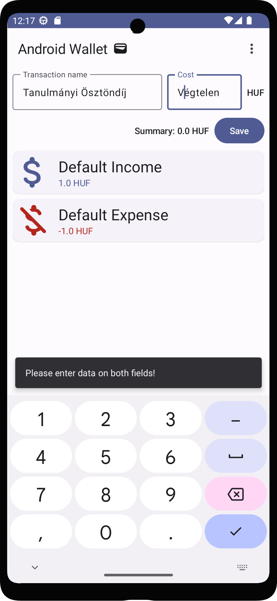

# Labor 03 Extra - Jetpackkel az égbe és tovább ✨ 🚀 🌌

***Szerző: Püspök-Kiss Balázs***

Ha bármi probléma lenne az extra laborral, ***Püspök-Kiss Balázs***-ra írjatok rá Teams-en, ő szívesen segít bármiben. Visszajelzéseket is nagy örömmel fogad. 🙂

## Bevezető

Az Extra feladat célja, hogy bemutasson egy megoldást, ami a legmodernebb eszközöket alkalmazza a
fejlesztés során. A motiváció a laborok átdolgozása mögött az, hogy szemléltesse a Compose képességeit, ezzel népszerűsítve a technológiát. A régi
technológiák támogatása szükséges, azonban mindig érdemes a jövőre figyelni, ott bővíteni a
jelenlegi tudását az embernek.

A dokumentáció segítségével egy olyan alkalmazást hozol létre, amit követendő példának ítélek meg. A
megoldás során szó fog esni ajánlott eszközökről, amik jelentősen megkönnyítették számomra a
fejlesztést, valamint nagyon hasznosnak ítélem meg őket és használatuk segíthet majd a házi feladat
megírásában is.

## Feladat előtti megjegyzés

Ez a feladat sok bónusz infót tartalmaz, aminek a használata a való életben nagyon kívánt, azonban
valószínűleg nem lesz számonkérve. A legjobb tudásom ellenére is azt kérem, hogy keressétek fel
gyakran a [Jetpack Compose] dokumentációját a hivatalos oldalán, sokkal több mindenről esik szó ott,
amire nekem nincs időm kitérni. StackOverflow is hasznos olykor, keresni a Google-ön egyet, ha
rögtön nem működik valami. Az előző labor (`PublicTransport`) Extra feladatánál sok olyan hasznos
dolgot elmagyaráztam, amit ennél a labornál nem fogok kifejteni. Ennek ismerete nem
feltétele a labor elvégzésének. Önálló feladat során inkább a hivatalos dokumentációkra
és Google-re lehet támaszkodni. Egyszerűbb feladatokat próbáltam tervezni, ahol a kreativitás is szerepet kap.

## Setup ⚙

A kezdő projekt az [AndroidWalletCompose](https://github.com/VIAUAC00/AndroidWalletCompose) GitHub repository-ban van.
Egy projekt setup-olása és felkonfigurálása fontos, viszont erre most nem igazán fogok kitérni részletekben.
Mindenesetre megjegyzek néhány dolgot. Át lehet ugrani idő hiányában a Setup részt, de ez nem
lesz hosszú. A setup kb. ugyanaz, mint a 2. labor Extra feladatánál, azonban van néhány különbség.

### [Proguard], R8 és [MaterialIcons]

A Module `build.gradle` fájlban feltűnik néhány különbség az alap filehoz képest. `minifyEnabled`
lehetővé teszi a felesleges kód eltávolítását, a kód obfuszkációját, valamint optimalizálja azt.
`shrinkResources` eltávolítja a nem használt resource fájlokat, ezzel is helyet spórolva. A meglévő
fájlok minősége nem romlik! Ezeket a kulcsszavakat egyébként a [Proguard] és R8 biztosítja
számunkra. Ezek az eszközök optimalizálják a kódot és lekicsinyítik az alkalmazást igény szerint,
de sokkal többet tudnak, mint amiről itt szót ejtettem.

```groovy
android {
    //...
    buildTypes {
        release {
            minifyEnabled true
            shrinkResources true // removes unused resources from /res folder
            proguardFiles getDefaultProguardFile('proguard-android-optimize.txt'), 'proguard-rules.pro'
        }
    }
    //...
}
```

[MaterialIcons] egy elég nagy könyvtár, ami amellett, hogy nagyon hasznos, elég sok erőforrás van
benne kihasználatlanul. [Proguard] és R8 segít a fel nem használt részeket kihagyni az
alkalmazásból, ezáltal az gyorsabban települ és fut. Egyébként [MaterialIcons] extended verziója
a [Google Icons] teljes kínálatával fel van szerelve, így egy pici idő lehet, míg betölti a built-in
linter a dolgokat a suggestion-öknél, viszont minden ikon elérhető programmatikusan, `ImageVector`-ként.

```groovy
dependencies {
    //...
    // Material design icons
    implementation "androidx.compose.material:material-icons-core:$compose_version"
    // Extended version contains all the Icons!
    implementation "androidx.compose.material:material-icons-extended:$compose_version"
    //...
}
```

## Lightspeed ☀ 💫 ✨ 🚀

A példa megoldásom kinézete. Nektek nem feltétlenül kell így kinéznie, rátok bízom, hogyan
jelenítitek meg az adatokat.

<p align="center">

</p>

A labor jelentős része meg van írva, viszont van néhány rész, amit a képzelőerőitekre szerettem
volna hagyni. Kérlek olvassátok el és kísérletezzetek az adott részekkel, mert érdekesek lehetnek,
ha egy apró paramétert megváltoztattok és megfigyelitek a megváltozott viselkedést.

Lesz olyan feladat, ami kívánja azt, hogy rakjatok össze egy UI komponenst a már meglévő
`Composable`-ökből! Ügyeltem arra, hogy ne legyen túlságosan nehéz, hogy a példákból lehessen
csipegetni, de ha elakadtok, vagy kísérletezni szeretnétek, akkor a [Jetpack Compose] dokumentációja
mindig kéznél van. Ha egy Compose-os alternatíváját szeretnétek megtudni egy XML és Fragment-es
elemhez, akkor [ez a honlap][Equivalent of X in Compose] kisegíthet titeket.

### Keyboard kezelése ⌨

<p align="center">

</p>

`Snackbar` így jelenne meg ideális esetben.

Az alkalmazás feldob egy `SnackBar`-t, mikor hibás adatok kerülnek be a `TextField`-be. Ha éppen
meg van nyitva a szoftveres billentyűzet, akkor ez a billentyűzet alapesetben kitakarja a
`SnackBar`-t. ***Ez veszélyes!*** Szerencsére [Jetpack Compose]ban nagyon egyszerű a fix.
A `ui/theme/Theme.kt` file-ba, a *SideEffect* scope-jába be kell rakni az alábbi sort.

```kotlin
WindowCompat.setDecorFitsSystemWindows(window, false)
```

Azonban ez még nem oldja meg magába a problémát! Ahhoz, hogy a `SnackBar` jól reagálja le a keyboard
változását, meg kell mondani, melyik UI komponens-en legyen az az adott *`padding`*, ami
beleszámítja a billentyűzetet. Én 3 népszerű *`padding`*-et szoktam ilyenkor használni, amik
egyébként `Modifier`-ek:

```kotlin
Modifier
    .imePadding()
    .statusBarsPadding()
    .navigationBarsPadding()
```

Ezeket a paddingeket egyébként be is lehet illeszteni a `SnackbarHost` `modifier` paraméteréhez.

### `TransactionCard` 💳

Hogy egy picit gyakoroljatok, üresen hagytam egy-két apró részt, pl. a `TransactionCard` composable
belsejét. Egyedileg testre tudjátok szabni, tudtok kísérletezni, hogy hogyan legyenek elrendezve
az `imageVector`-t és `color`-t felhasználó UI komponensek az `ElevatedCard`-on belül.
A fenti kép ad egy példát, hogy mit kellene alkotni, hogyan nézhet ki egy végleges layout.
Ezeknél a részeknél többnyire nincs rossz megoldás, csak legyenek megjelenítve az elvárt
információk, mint a `Transaction` neve (`name`) és értéke (`worth`). Ha van bármi plussz
amit hozzá szeretnétek adni, csak bíztatni tudlak titeket! 😊

## Határ a csillagos ég 🌉 🌃 🌌

Egyelőre ezt a két (`PublicTransport` és `AndroidWallet`) labort írtam át [Jetpack Compose]ra,
hogy példát mutassak, hogyan lehetne akár egy háziban felhasználni ezt a technológiát. Egy kicsi tréningnek
szántam ezt a labort, hogy gyakoroljátok, miként is lehet UI-t írni XML nélkül. Remélem jó és hasznos
introduction projektek voltak ezek, lehet látni, hogy olykor elég sok kódot meg lehet spórolni [Jetpack Compose]zal.

## Néhány hasznos [Jetpack Compose] lib

A labort néhány szerintem hasznos könyvtárral zárnám Compose-hoz, hogy minél több eszköz álljon
rendelkezésetekre egy esetleges házi megírásához.

### [Compose Destinations]

[Navigation Component] szerintem nagyon jó ha az ember XML-t és Fragment-eket használ, azonban
a Compose változatát elég nehéz használni. NavComponent használatáról a [Navigating with Compose]
cikkben olvashattok. Mindenesetre van egy nagyon jó alternatívája, ami egy wrapper a
NavComponent köré, ez pedig nem más, mint a [Compose Destinations]. Destinations annotációkkal
oldja meg a munka többségét, ami egy elég manuális munka lenne NavComponent esetén. Az annotációk segítségével generálódnak ki a navigációt megvalósító kódok compile időben. Szerintem ez
egy nagyon egyszerű és kényelmes megoldás a navigáció problémájára.

### [Accompanist]

A Google egyik könyvtára Compose-hoz, ami minden hasznos funkciót tartalmaz, amit a Compose még
nem támogat natívan. Van benne animáció, permission kezelés, Flow layoutok, Swipe to refresh és
még nagyon sok minden!

### [Coil]

Ha XML-t használtok, valószínűleg szó fog esni [Glide]ról. Mint ahogy a [Glide], ez is egy képeket
betöltő és automatikusan cache-elő könyvtár, ami `Kotlin Coroutine`-okat használ. `Lightweight`,könnyű használni, van Compose implementációja is. Sajnos [Glide] oldalán nem találok
hivatalos információt, hogy lenne.

### [Hilt with Compose]

Az iparban alapvető, hogy valamilyen Dependency Injection-t használva adjuk meg a függőségeinket. A Strategy Design Pattern implementálását és a Unit tesztelést is könnyebbé teszi. Ha jobban elmerültök az Android világában, akkor találkozhattok ViewModel-lekkel, az [MVVM] architektúrával, valamint [Hilt]tel, ami egy DI-t megkönnyítő külső könyvtár a Google-től. Szerencsére van [Jetpack Compose] támogatása is, ez a [Hilt with Compose]. Összességében egy nagyon hasznos eszközről van szó, jelentős mennyiségű boilerplate kódtól lehet megszabadulni és sokkal egyszerűbbé válik tőle a megírt kódunk.

### [Compose Material 3]

Előző laborban nagy szerepet kapott, viszont a [Material Design 3] az Android design jövője, így
kihagyhatatlan egy ilyen felsorolásból. Aki eddig nem használta, használja, sokkal szebb lesz az
applikációtok, ami szerintem legalább annyira fontos, mint a technikai része az appnak.

Azért vannak hiányosságai [Material Design 3]-nak [Material Design 2]-vel szemben, pl. nem elérhető néhány elem az új verzióban, főleg nem a Compose könyvtárában, viszont ami késik nem múlik és idővel minden fontos dolog át fog íródni az új Design Language-re.

## Végszó

Köszönöm szépen, hogy részt vettetek ezen az extra laboron, remélem egy pozitív első élményt adtam a [Jetpack Compose] használatáról és a jövőben is fel tudjátok használni az itt tanultakat. Ha bármilyen visszajelzésetek lenne a laborral kapcsolatban, írjatok rám, Teams-en elérhető vagyok, örülök mind negatív, mind pozitív visszajelzésnek, szívesen segítek a háziban is, ha a Compose mellett rakjátok le a voksaitokat 😊.

[Jetpack Compose]: https://developer.android.com/jetpack/compose

[MVVM]: https://developer.android.com/topic/architecture

[RainbowCake]: https://rainbowcake.dev/

[Room]: https://developer.android.com/training/data-storage/room

[Kotlin Coding Conventions]: https://kotlinlang.org/docs/coding-conventions.html

[MaterialIcons]: https://developer.android.com/reference/kotlin/androidx/compose/material/icons/package-summary

[Proguard]: https://developer.android.com/studio/build/shrink-code

[Google Icons]: https://fonts.google.com/icons

[Equivalent of X in Compose]: https://www.jetpackcompose.app/What-is-the-equivalent-of-X-in-Jetpack-Compose

[Compose Destinations]: https://composedestinations.rafaelcosta.xyz/

[Navigation Component]: https://developer.android.com/guide/navigation

[Navigating with Compose]: https://developer.android.com/jetpack/compose/navigation

[Accompanist]: https://google.github.io/accompanist/

[Coil]: https://coil-kt.github.io/coil/

[Glide]: https://bumptech.github.io/glide/

[Compose Material 3]: https://developer.android.com/jetpack/androidx/releases/compose-material3

[Material Design 3]: https://m3.material.io/

[Material Design 2]: https://m2.material.io/

[Hilt with Compose]: https://developer.android.com/jetpack/compose/libraries#hilt

[MockK]: https://mockk.io/

[Hilt]: https://dagger.dev/hilt/
