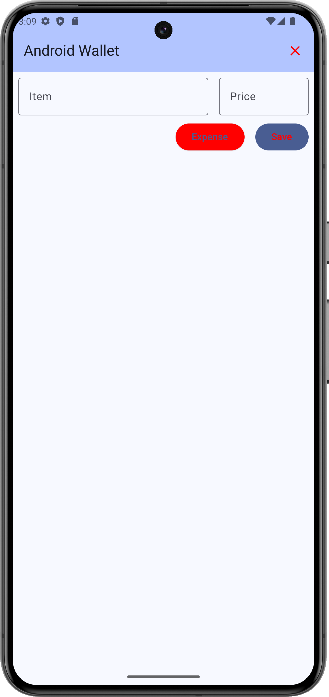
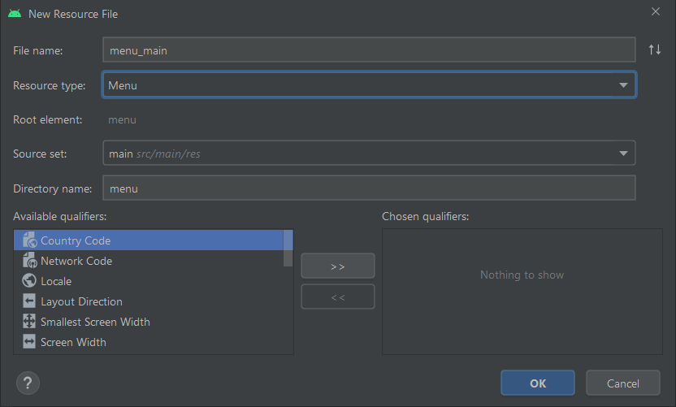

# Labor 03 - Felhasználói felület tervezése és készítése Android platformon

## Bevezető

A labor célja egy egyszerű felhasználói felület tervezése, kivitelezése. 

A feladat egy kiadás / bevétel naplózására alkalmas alkalmazás elkészítése AndroidWallet néven. Az alkalmazás alap funkcionalitása, hogy a felhasználó fel tudja venni egy listába a kiadásait, bevételeit, illetve törölni tudja az egész lista tartalmát.

A kész alkalmazás mintaképe: 

<p align="center">

</p>
 
Az alkalmazás felépítése és működése a következő:

- Kezdőképernyő a listával illetve egy beviteli résszel, amelyen a felhasználó beír egy megnevezést és egy összeget, megadja a pénzforgalom irányát, és el tudja menteni a listába a tranzakcióját. Amennyiben itt bármelyik mező üres, a mentést meg kell akadályoznunk.
- Egy listaelem felépítése:
	- Ikon a pénzforgalom irányától függően.
	- A megadott megnevezés és alatta az összeg.
	- A Toolbaron egy menüpont a lista teljes törlésére.
	- A lista görgethető kell legyen

### Felhasznált technológiák:
- Activity
- LinearLayout, TextView, ImageView, EditText, Button, ToggleButton
- LayoutInflater

## Előkészületek

A feladatok megoldása során ne felejtsd el követni a [feladat beadás folyamatát](../../tudnivalok/github/GitHub.md).

### Git repository létrehozása és letöltése

1. Moodle-ben keresd meg a laborhoz tartozó meghívó URL-jét és annak segítségével hozd létre a saját repository-dat.

1. Várd meg, míg elkészül a repository, majd checkout-old ki.

    !!! tip ""
        Egyetemi laborokban, ha a checkout során nem kér a rendszer felhasználónevet és jelszót, és nem sikerül a checkout, akkor valószínűleg a gépen korábban megjegyzett felhasználónévvel próbálkozott a rendszer. Először töröld ki a mentett belépési adatokat (lásd [itt](../../tudnivalok/github/GitHub-credentials.md)), és próbáld újra.

1. Hozz létre egy új ágat `megoldas` néven, és ezen az ágon dolgozz.

1. A `neptun.txt` fájlba írd bele a Neptun kódodat. A fájlban semmi más ne szerepeljen, csak egyetlen sorban a Neptun kód 6 karaktere.

## Projekt létrehozása

Hozzunk létre egy AndroidWallet nevű projektet Android Studioban:

- File->New->New Project
- válasszuk az Empty Activity-t
- Application name: AndroidWallet
- package name: hu.bme.aut.android.androidwallet
- a mentési hely a kicheckoutolt repository-n belül az AndroidWallet mappa
- Minumum API level: 21
- Finish, és várjuk meg amíg a Studio mindent legenerál. (Ez első alkalomkor valamivel hosszabb időt vesz igénybe.)

## Menü elkészítése

Első lépésben készítsük el a menüt. Bal oldalon a `res` könyvtáron nyomjunk jobb klikket és a menüből hozzunk létre egy új `Android Resource File` elemet. Itt a varázslóban mindent kis is tudunk választani:



A `menu_main` tartalma legyen az alábbi:

```xml
<?xml version="1.0" encoding="utf-8"?>
<menu xmlns:android="http://schemas.android.com/apk/res/android">
    <item android:id="@+id/action_delete_all"
        android:title="Delete All" />
</menu>
```

Ne felejtsük el kiszervezni a string erőforrást! Ezt egyszerűen megtehetjük a *Delete All* szövegen állva az `Alt`+`Enter` konbinációt megnyomva, az `Extract string resource` opcióval. Adjuk meg a nevet: `delete_all`

!!!note ""
	Láthatjuk, hogy Android platformon a menüt is egyszerű XML erőforrásból tudjuk felvenni. A fenti esetben egyetlen elemet tettünk a menübe, amelyet majd az `action_delete_all` id-val tudunk hivatkozni.

Ahhoz, hogy az imént létrehozott menü felkerüljön a felületre a `MainActivity`-ből fel kell "fújjuk" azt, és le kell kezelnünk a kattintásokat.Ezt az `onCreateOptionsMenu` és az `onOptionsItemSelected` függvényekkel tudjuk megtenni:

```kotlin
override fun onCreateOptionsMenu(menu: Menu): Boolean {
        menuInflater.inflate(R.menu.menu_main, menu)
        return super.onCreateOptionsMenu(menu)
    }

    override fun onOptionsItemSelected(item: MenuItem): Boolean {
        return when (item.itemId) {
            R.id.action_delete_all -> {
                // TODO: itt fogjuk kezelni a kattintást
                true
            }
            else -> super.onOptionsItemSelected(item)
        }
    }
```

## Beviteli rész megvalósítása (1 pont)

Az alkalmazás működéséhez szükség lesz két `EditText`-re, amelyekben a felhasználó a megnevezést és az összeget adhatja meg. Szükséges továbbá egy kapcsoló működésű gomb, például egy `ToggleButton`, amellyel a pénzforgalom iránya állítható, illetve kell egy mentés gomb, amelyet egy egyszerű `Button` fog megvalósítani.

Egy XML fájlt megnyitva két lehetőségünk van: vagy a beépített grafikus szerkesztőn drag and drop módszerrel összerakjuk a felületet, vagy kézzel XML-ben írjuk meg a komponenseket és a tulajdonságaikat. Előbbi a tanulási fázisban nagyon hasznos, mert könnyen tudunk puskázni, viszont később sok fejfájást okozhat, ezért az XML leírás plusz előnézettel fogjuk megvalósítani a feladatot.

Mivel a feladatunk lineárisan összerakható elemekből épül fel, ezért érdemes egy ilyen magvalósításban gondolkodnunk. Nyissuk meg a `res/layout/activity_main.xml` fájlt. (Akinek nem jelenik meg egyből a preview nézet, jobb oldalon találja a gombot.) Módosítsuk az előre legenerált `ConstraintLayoutot` `LinearLayoutra`, és adjuk hozzá az `android:orientation="vertical"` attribútomot.

Szükségünk lesz másik három LinearLayout-ra:

- A név és összeg mezőnek, horizontális elrendezéssel
- A kiadás/bevétel kapcsolónak és mentés gombnak, szintén horizontális elrendezéssel és jobbra zárással
- A tényleges listának, amelyet mivel a lista elemek vertikálisan követik egymást, vertikálisra állítunk.
  
Így az `activity_main.xml`-ben a `LinearLayout`-ok elrendezése az alábbi lesz:

```xml
<?xml version="1.0" encoding="utf-8"?>
<LinearLayout xmlns:android="http://schemas.android.com/apk/res/android"
    xmlns:app="http://schemas.android.com/apk/res-auto"
    xmlns:tools="http://schemas.android.com/tools"
    android:layout_width="match_parent"
    android:layout_height="match_parent"
    android:orientation="vertical"
    tools:context=".MainActivity"
    tools:showIn="@layout/activity_main">

    <LinearLayout
        android:layout_width="match_parent"
        android:layout_height="wrap_content"
        android:orientation="horizontal">
	</LinearLayout>

    <LinearLayout
        android:layout_width="match_parent"
        android:layout_height="wrap_content"
        android:gravity="end"
        android:orientation="horizontal">
	</LinearLayout>

    <LinearLayout
        android:layout_width="match_parent"
        android:layout_height="wrap_content"
        android:orientation="vertical">
	</LinearLayout>
</LinearLayout>
```

Az első (nem gyökér) `LinearLayout`-ba vegyük fel a két `EditText`-et, adjunk nekik *id*-t, hogy a Kotlin kódból is egyszerűen elérjük őket. A két `EditText` egymáshoz képesti elhelyezkedését súlyozással fogjuk beállítani.  Mindkettő legyen `singleLine`, így nem fog szétcsúszni a UI, illetve érdemes a megnevezés `EditText`-nek egy `actionNext` `imeOptions`-t adni, így a felhasználó billentyűzete a következő `EditText`-re fog ugrani az Enter/Ok billentyűre:

```xml
<LinearLayout
    android:layout_width="match_parent"
    android:layout_height="wrap_content"
    android:orientation="horizontal">

    <EditText
        android:id="@+id/salary_name"
        android:layout_width="0dp"
        android:layout_height="wrap_content"
        android:layout_weight="0.6"
        android:imeOptions="actionNext"
        android:inputType="textCapWords"
        android:singleLine="true" />

    <EditText
        android:id="@+id/salary_amount"
        android:layout_width="0dp"
        android:layout_height="wrap_content"
        android:layout_weight="0.4"
        android:singleLine="true" />
</LinearLayout>
```

A középső, gombokat tartalmazó `LinearLayout`-ban a gombokat jobbra szeretnénk igazítani, ezért a `LinearLayout`*gravity*-jét *end* értékre állítjuk. Így a két gombot az operációs rendszer szerint beállított szövegirányultság szerinti végére zárja a UI. A `LinearLayout`-ba felvesszük a `ToggleButton`-t, a sima `Button`-t és *id*-t adunk nekik.  A mentés gombon beállítsuk be a megjelenített feliratot, ez legyen "SAVE". Ne felejtsük el ezt is kiszervezni erőforrásba!

```xml
<LinearLayout
    android:layout_width="match_parent"
    android:layout_height="wrap_content"
    android:gravity="end"
    android:orientation="horizontal">

    <ToggleButton
        android:id="@+id/expense_or_income"
        android:layout_width="wrap_content"
        android:layout_height="wrap_content" />

    <Button
        android:id="@+id/save_button"
        android:layout_width="wrap_content"
        android:layout_height="wrap_content"
        android:text="Save" />
</LinearLayout>
```

Mivel erre is van lehetőség bármi kódolás nélkül, érdemes már most beállítani a `ToggleButton` két állapotának feliratát a `textOn` illetve `textOff` attribútomokkal, amelyhez az "INCOME" illetve "EXPENSE" string erőforrásokat kell felvennünk. 

```xml
<ToggleButton
    android:id="@+id/expense_or_income"
    android:layout_width="wrap_content"
    android:layout_height="wrap_content"
    android:textOff="@string/income"
    android:textOn="@string/expense" />
```

!!!example "BEADANDÓ (1 pont)"
	Készíts egy **képernyőképet**, amelyen látszik a **MainActivity felülete a beviteli mezőkkel és gombokkal** (emulátoron, készüléket tükrözve vagy képernyőfelvétellel), **a hozzá tartozó kóddal**, valamint a **neptun kódoddal a termék neveként**. A képet a megoldásban a repository-ba f1.png néven töltsd föl.

	A képernyőkép szükséges feltétele a pontszám megszerzésének.

## A listaelem XML-jének összeállítása (1 pont)

Új elem felvételekor azt várjuk, hogy a *Save* gomb hatására az adott tételből egy új sor jelenjen meg a listában. Ezek a sorok komplexek és egymáshoz nagyon hasonlóak, így érdemes az elrendezésüket külön elkészíteni, és hozzáadáskor csak felhasználni ezt a megfelelő paraméterekkel.

Egy-egy ilyen elem felhasználásakor példányosítanunk kell a felületi elemet, amit a rendszer *inflater* szolgáltatásával tudunk megtenni. Az *inflate*-elés során az operációs rendszer egy olyan szolgáltatását kérjük el, amelyet egyéb elemeknél (pl. Toolbar menu) automatikusan elvégez. Mi ezzel most egy előre meghatározott komponenst, a listánk egy elemét szeretnénk "felfújni" a megfelelő pillanatban.

!!! danger "Figyelem"
	Fontos megjegyezni hogy a későbbiekben a profi lista kezeléshez majd a [`RecyclerView`](https://developer.android.com/develop/ui/views/layout/recyclerview?gclid=EAIaIQobChMIuPGHwNnu-QIVHY1oCR1V0gRbEAAYASAAEgJSTfD_BwE&gclsrc=aw.ds) komponenst fogjuk használni. `LineraLayout`-ot lista jellegű viselkedésre használni nem ajánlott, most csak az *inflate*-elés gyakorlásához használjuk.

Rakjuk össze először a felületi erőforrást. A listaelemünk felépítése, az előzőekhez hasonlóan, kivitelezhető teljesen lineáris elrendezéssel, így ismét a `LinearLayout`-ot használjuk. Adjunk hozzá a projektünkhöz a `salary_row.xml`-t. (res/layout mappán jobb klikk, New -> Layout Resource File)

Egy horizontális `LinearLayout`-tal kezdünk, mivel az *icon* és a feliratok egymás mellett helyezkednek el. Mivel ez csak egy listaelem lesz, ezért `wrap_content`-re kell vennünk a szélességét magasságát. Adjunk neki *id*-t is. Ebbe a `LinearLayout`-ba bal oldalra kerül az `ImageView`. A méretét állítsuk be 40x40-re, illetve adjunk neki *id*-t is. Az `ImageView` mellett egy függőleges `LinearLayout` kövezkezik, amiben egymás alatt helyezkedik el a tétel neve és összege. A `LinearLayout` szélessége legyen `match_parent`, magassága `wrap_content`, a `TextView`-knak pedig mindenképpen adjunk *id*-t. 

Mivel igényes kinézetet szeretnénk, a megfelelő *marginokat* illetve *paddingeket* adjuk hozzá a különböző elemeinkhez: a gyökérre 4dp *padding,* a beágyazottra `marginStart` attribútum *16dp* értékkel, illetve `layout_gravity` paramétert `center_vertical`-ra állítjuk, így biztosítva a gyerekelemek középre rendezését.

A `salary_row.xml` végleges kódja:

```xml
<?xml version="1.0" encoding="utf-8"?>
<LinearLayout xmlns:android="http://schemas.android.com/apk/res/android"
    xmlns:tools="http://schemas.android.com/tools"
    android:id="@+id/salary_row"
    android:layout_width="wrap_content"
    android:layout_height="wrap_content"
    android:orientation="horizontal"
    android:padding="4dp">

    <ImageView
        android:id="@+id/salary_direction_icon"
        android:layout_width="40dp"
        android:layout_height="40dp"
        tools:src="@mipmap/ic_launcher" />

    <LinearLayout
        android:layout_width="match_parent"
        android:layout_height="wrap_content"
        android:layout_gravity="center_vertical"
        android:layout_marginStart="16dp"
        android:orientation="vertical">

        <TextView
            android:id="@+id/row_salary_name"
            android:layout_width="wrap_content"
            android:layout_height="wrap_content"
            tools:text="hétszőnyű" />

        <TextView
            android:id="@+id/row_salary_amount"
            android:layout_width="wrap_content"
            android:layout_height="wrap_content"
            tools:text="kapanyányimonyók" />
    </LinearLayout>
</LinearLayout>
```

!!!note "Megjegyzés"
	A „tools” névtérnek csak a preview-ra van hatása, tervezés közben beírhatunk oda bármit a lefordított alkalmazásban sehol nem fog látszani.

!!!example "BEADANDÓ (1 pont)"
	Készíts egy **képernyőképet**, amelyen látszik a **egy sor layout-ja** (*previewként*), **a hozzá tartozó kóddal**, valamint a **neptun kódoddal a termék neveként**. A képet a megoldásban a repository-ba f2.png néven töltsd föl.

	A képernyőkép szükséges feltétele a pontszám megszerzésének.


## A listaelem példányosítása (1 pont)

Mostanra minden összetevőnk készen áll, már csak a mögöttes logikát kell megvalósítanunk. A kódban szükségünk lesz a mezők elérésére, illetve a kapcsolónk állapotának vizsgálatára a kattintás pillanatában. Ezeket a részeket a *Save* gombunk kattintás eseménykezelőjében
fogjuk megvalósítani. Továbbá az említett *inflate*-elendő komponensünk példányosítását is itt kell végrehajtanunk a kapott adatok alapján. `Toast` üzenetben jelezzük, ha valamelyik mező nincs kitöltve!

Először készítsük el az eseménykezelő vázát. Figyeljük meg, hogy kódot adunk át paraméterként, ezért nem kerek zárójeleket, hanem kapcsos zárójelpárt használunk. Szintén fontos, hogy ha Kotlinban készítünk Android alkalmazást, akkor a `layout`-ban definiált komponenseket az *id*-jükkel el tudjuk érni. Ehhez először meg kell csinálnunk a `viewBinding`-ot az `Activity`-n. Nem szabad elfelejteni, hogy a modul szintű `build.gradle` fájlban fel kell vennünk a `viewBinding`  `buildFeature`-t. 

```
buildFeatures {
    viewBinding true
}
```

Ezt követően az `Activity`:

```kotlin
private lateinit var binding: ActivityMainBinding

override fun onCreate(savedInstanceState: Bundle?) {
    super.onCreate(savedInstanceState)
    binding = ActivityMainBinding.inflate(layoutInflater)
    setContentView(binding.root)

    binding.saveButton.setOnClickListener {
        // TODO: ide jön az eseménykezelő kód
    }
}
```

Az eseménykezelőben először a kitöltöttség ellenőrzését végezzük el, ehhez egy hibaüzenetet is meg kell adnunk. Ezt a jó gyakorlatnak megfelelően a `strings.xml` fájlba szervezzük is ki. A hibaüzenet legyen mondjuk "Missing data!":

```kotlin
if (binding.salaryName.text.toString().isEmpty() || binding.salaryAmount.text.toString().isEmpty()) {
    Toast.makeText(this, R.string.warn_message, Toast.LENGTH_LONG).show()
    return@setOnClickListener
}
```

Ha minden adat helyes, akkor már fel is vehetünk egy új sort. Egy sor kezeléséhez szükségünk van egy `SalaryRowBinding` példányra:

```kotlin
private lateinit var rowBinding: SalaryRowBinding
```

Ezután egy row itemet példányosítunk, (*inflate*-elünk) a korábban elkészített XML-ből az `OnCreate` metódus eseménykezelőjében:

```kotlin
rowBinding = SalaryRowBinding.inflate(layoutInflater)
```

A példányosítás után már elérjük az adott példány különböző részeit, tehát az ikont, a nevet, és az összeget. Állítsuk is be ezeket a megadott adatok alapján.
Az ikont a `ToggleButton` állapota alapján kell kitöltenünk. Az ikonokhoz az [income.png](downloads/income.png) és az [expense.png](downloads/expense.png) képeket fogjuk használni.

!!!tip "Android Asset Studio"
	A letöltött képeket használhatjuk egyből a res/drawable mappába helyezve, azonban ha igényes alkalmazást akarunk készíteni, akkor célszerű több méretben is elérhetővé tenni ezeket. A különböző méretek legenerálásához használjuk az [Asset Studio](https://romannurik.github.io/AndroidAssetStudio/)-t (azon belül a Generic icon generator-t), forrásként válasszuk ki a képeinket, állítsuk be a Color paramétert Alpha értékét 0-ra, majd a letöltött zip fájlokat csomagoljuk ki a res mappába.
	

```kotlin
rowBinding.salaryDirectionIcon.setImageResource(if (binding.expenseOrIncome.isChecked) R.drawable.expense else R.drawable.income)
rowBinding.rowSalaryName.text = binding.salaryName.text.toString()
rowBinding.rowSalaryAmount.text = binding.salaryAmount.text.toString()
```

Most, hogy megvagyunk a példányosítással és az adatok feltöltésével, hozzá kell adnunk az elemet a listához (`LinearLayout`). Ehhez az `activity_main.xml` alsó `LinearLayout`-jának egy *id*-t is kell adnunk, hogy hivatkozni tudjunk rá:

```xml
<LinearLayout
    android:id="@+id/list_of_rows"
    android:layout_width="match_parent"
    android:layout_height="wrap_content"
    android:orientation="vertical" />
```
 
```kotlin
binding.listOfRows.addView(rowBinding.root)
```

És ezen a ponton akár futtathatjuk is az alkalmazásunkut. Próbáljuk is ki! 

Ezen a ponton már majdnem készen is vagyunk: hozzá tudunk adni adni elemeket a listánkhoz. Azonban két helyen még hiányos az alkalmazásunk. Nem lehet törölni a teljes listát, illetve ha elég sok elemet veszünk fel észrevesszük, hogy nem férnek ki, viszont görgetni nem tudunk. Az előbbi probléma megoldását már előkészítettük, erre fog szolgálni a „Delete All”-ra átalakított menüpontunk, amely megjelenni már helyesen jelenik de még nem csinál semmit. Az eseménykezelő vázát már elkészítettük az `onOptionsItemSelected()` metódusban, most ezt kell kiegészítenünk az alábbira:

```kotlin
override fun onOptionsItemSelected(item: MenuItem): Boolean {
    return when (item.itemId) {
        R.id.action_delete_all -> {
            binding.listOfRows.removeAllViews()
            true
        }
        else -> super.onOptionsItemSelected(item)
    }
}
```

Próbáljuk ki a törlés funkciót! 

Utóbbi problémánkra pedig nagyon egyszerű a megoldás, a listánkat tartalmazó `LinearLayoutot` egy `ScrollView`-ba kell foglalnunk és már működik is.

```xml
<ScrollView
    android:layout_width="match_parent"
    android:layout_height="wrap_content">

    <LinearLayout
        android:id="@+id/list_of_rows"
        android:layout_width="match_parent"
        android:layout_height="wrap_content"
        android:orientation="vertical" />
</ScrollView>
```

!!!example "BEADANDÓ (1 pont)"
	Készíts egy **képernyőképet**, amelyen látszik hogy **a lista scrollozható** (emulátoron, készüléket tükrözve vagy képernyőfelvétellel), **lista törlésének kódjával**, valamint a **neptun kódoddal valamelyik termék neveként**. A képet a megoldásban a repository-ba f3.png néven töltsd föl.

	A képernyőkép szükséges feltétele a pontszám megszerzésének.


## Önálló feladatok

### Snack bar (1 pont)

A Toast üzeneteknél már van egy sokkal szebb megoldás, ami a Material Designt követi, a [SnackBar](https://material.io/develop/android/components/snackbar/). Cseréljük le a Toast figyelmeztetést SnackBarra!

!!!example "BEADANDÓ (1 pont)"
	Készíts egy **képernyőképet**, amelyen látszik **a SnackBar használata** (emulátoron, készüléket tükrözve vagy képernyőfelvétellel), **a kódja**, valamint a **neptun kódoddal a termék neveként**. A képet a megoldásban a repository-ba f4.png néven töltsd föl.

	A képernyőkép szükséges feltétele a pontszám megszerzésének.


### Összegző mező (1 pont)

Vegyünk fel egy összegző mezőt a gombok mellé, amely minden bevitt érték után frissül. Figyeljünk rá, hogy ha még nincs egy bejegyzés sem, akkor ne jelenjen meg semmi, illetve hogy a felhasználó nem fog mínusz karaktert beírni tehát a kapcsoló alapján kell eldöntenünk, hogy ez pozitív vagy negatív érték. Az egyszerűség kedvéért megengedjük, hogy az összeg mező `inputType`-ját `numberDecimal`-ra állítsuk, így a felhasználó nem tud betűket beírni.

!!!warning "Figyelem"
	Figyeljünk az összegző mező helyes működésére! Ha töröljük a listából a bejegyzéseket, akkor a számláló is nullázódjon és tűnjön el! (-0.5 pont)

!!!example "BEADANDÓ (1 pont)"
	Készíts egy **képernyőképet**, amelyen látszik **az összegző mező használata** (emulátoron, készüléket tükrözve vagy képernyőfelvétellel), **a kódja**, valamint a **neptun kódod valameilyik termék neveként**. A képet a megoldásban a repository-ba f5.png néven töltsd föl.

	A képernyőkép szükséges feltétele a pontszám megszerzésének.


### Bonus

Vizsgáljuk meg mi történik, ha az `EditText`-et (`TextInputEditTextet`) `TextInputLayout`-tal használjuk. (https://developer.android.com/reference/android/support/design/widget/TextInputLayout.html)

### Bonus 2.0

A tárgy egyik fiatal laborvezetője által átírásra került ez a labor Jetpack Compose-ra, vezetetten, hasznos információkkal és tippekkel megtámogatva mutat be egy ideális példát a feladat megoldására. A labor feladat során kell dolgozni, viszont a célja a Jetpack Compose és modern eszközök, fejlesztési módszertanok népszerűsítése Android platformra.
