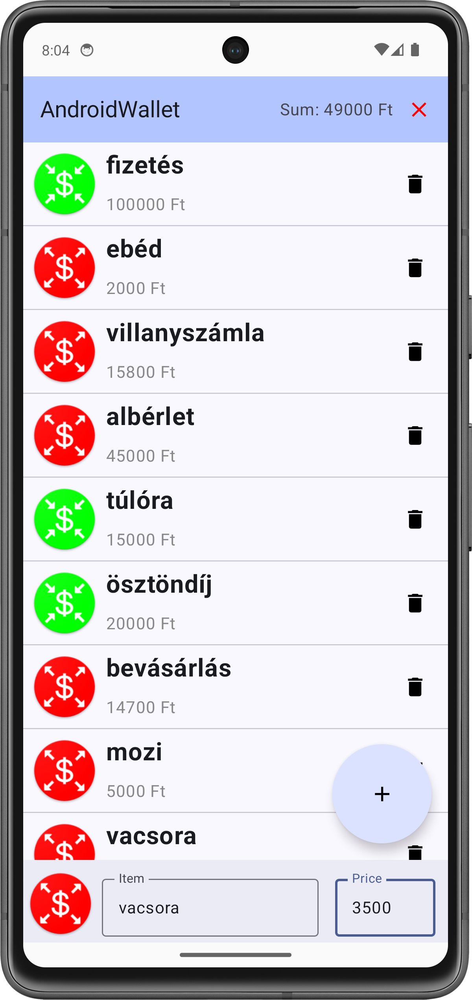
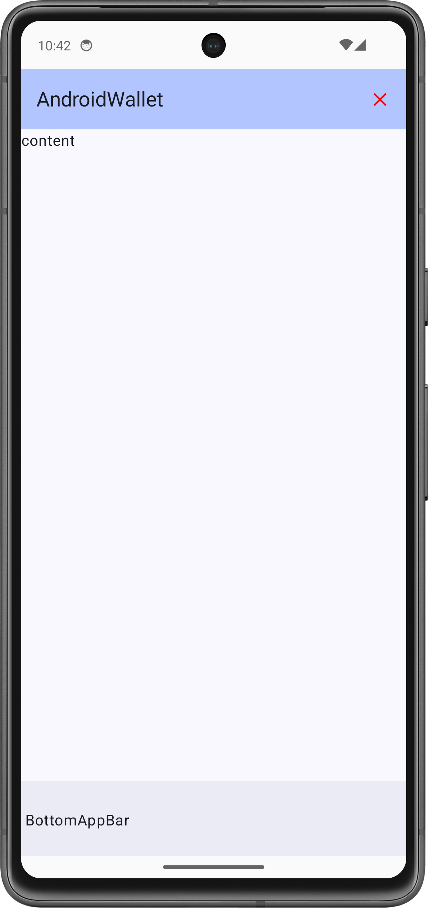
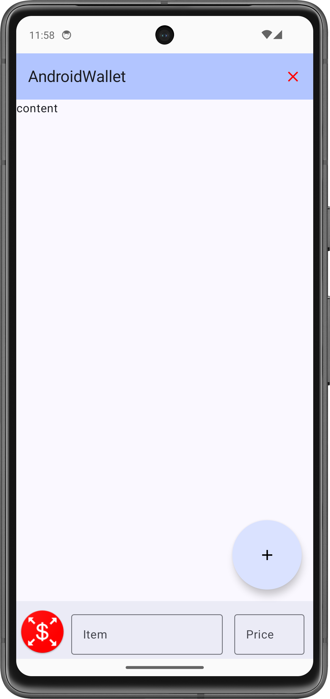

# Labor 03 - Felhasználói felület tervezése és készítése Android platformon

## Bevezető

A labor célja egy egyszerű felhasználói felület tervezése és kivitelezése Android platformon, Jetpack Compose felhasználásával. 

A feladat egy kiadás és bevétel naplózására alkalmas alkalmazás elkészítése AndroidWallet néven. Az alkalmazás alap funkcionalitása, hogy a felhasználó fel tudja venni egy listába a kiadásait és a bevételeit, törölni tudja őket, illetve törölni tudja az egész lista tartalmát.

A kész alkalmazás mintaképe: 

<p align="center">

</p>

Az alkalmazás felépítése és működése a következő:

- Kezdőképernyő egy listával (LazyColumn) illetve egy beviteli résszel rendelkezik. Itt a felhasználó beír egy megnevezést és egy összeget, megadja a pénzforgalom irányát, majd ezután el tudja menteni a listába a tranzakcióját. Amennyiben itt bármelyik mező üres, a mentést meg kell akadályoznunk.
- Egy listaelem felépítése:
	- Ikon a pénzforgalom irányától függően.
	- A megadott megnevezés és alatta az összeg.
	- Egy gomb a tétel törlésére.

### Felhasznált technológiák:
- **Scaffold**, TopBar, BottomBar, FloatingActionButton, Column, Row, Image, Text, Spacer, OutlinedTextField, IconButton, IconToggleButton, **LazyColumn**
- data class


## Előkészületek

A feladatok megoldása során ne felejtsd el követni a [feladat beadás folyamatát](../../tudnivalok/github/GitHub.md).

### Git repository létrehozása és letöltése

1. Moodle-ben keresd meg a laborhoz tartozó meghívó URL-jét és annak segítségével hozd létre a saját repository-dat.

1. Várd meg, míg elkészül a repository, majd checkout-old ki.

    !!! tip ""
        Egyetemi laborokban, ha a checkout során nem kér a rendszer felhasználónevet és jelszót, és nem sikerül a checkout, akkor valószínűleg a gépen korábban megjegyzett felhasználónévvel próbálkozott a rendszer. Először töröld ki a mentett belépési adatokat (lásd [itt](../../tudnivalok/github/GitHub-credentials.md)), és próbáld újra.

1. Hozz létre egy új ágat `megoldas` néven, és ezen az ágon dolgozz.

1. A `neptun.txt` fájlba írd bele a Neptun kódodat. A fájlban semmi más ne szerepeljen, csak egyetlen sorban a Neptun kód 6 karaktere.

## Projekt létrehozása

Hozzunk létre egy AndroidWallet nevű projektet Android Studioban:

1. Hozzunk létre egy új projektet, válasszuk az *Empty Activity* lehetőséget.
1. A projekt neve legyen `AndroidWallet`, a kezdő package `hu.bme.aut.android.androidwallet`, a mentési hely pedig a kicheckoutolt repository-n belül az AndroidWallet mappa.
1. Nyelvnek válasszuk a *Kotlin*-t.
1. A minimum API szint legyen API24: Android 7.0.
1. A *Build configuration language* Kotlin DSL legyen.

!!!danger "FILE PATH"
	A projekt a repository-ban lévő AndroidWallet könyvtárba kerüljön, és beadásnál legyen is felpusholva! A kód nélkül nem tudunk maximális pontot adni a laborra!

!!!danger "FILE PATH"
    A repository elérési helye ne tartalmazzon ékezeteket, illetve speciális karaktereket, mert az AndroidStudio ezekre érzékeny, így nem fog a kód lefordulni. Érdemes a C:\\ meghajtó gyökerében dolgozni.


## Főképernyő elkészítése

Első lépésként, hogy ezzel a fejlesztés során a későbbiekben ne legyen gond, illesszük be a szöveges erőforrásainkat a `strings.xml` fájlba:

```xml
<resources>
    <string name="app_name">AndroidWallet</string>
    <string name="item">Item</string>
    <string name="price">Price</string>
    <string name="label_empty_list">List is empty. Start adding salary.</string>
</resources>
```

Második lépésként, hogy a felhasználói felületületét akadálytalanul el tudjuk készíteni, készítsük el az adat struktúrát, ami a tárolandó adatokat fogja tartalmazni. Szükégünk vagy egy listára, amely az adatokat tartalmazza. Ebben a listában az alábbi `SalaryData` *data class* objektumokat fogunk tárolni. Hozzunk létre egy `data` *package*-et a fő *package*-ünkön belül, majd abba tegyük bele a `SalaryData` osztályt:

```kotlin
package hu.bme.aut.android.androidwallet.data

data class SalaryData(
    val isIncome: Boolean,
    val item: String,
    val price: String
)
```

Az osztály három változója az alábbiakat reprezentálja:

- `isIncome - Boolean változó amely a kiadás/bevétel állapotért felel.`   
- `item - kiadás/bevétel neve`
- `price - kiadás/bevétel értéke`


Miután megvagyunk a modell osztállyal, áttérhetünk a felhasználói felületre. Készítsük el a főképernyő vázát, amit majd a labor során feltöltünk tartalommal. Ehhez hozzunk létre egy `screen` *package*-et a `ui` *package*-en belül, majd ebbe egy `MainScreen` nevű új Kotlin classt. Írjuk meg a főképernyőnek a felépítését az alábbi kód alapján:

```kotlin
package hu.bme.aut.android.androidwallet.ui.screen

import androidx.compose.foundation.layout.padding
import androidx.compose.foundation.layout.safeDrawingPadding
import androidx.compose.material3.BottomAppBar
import androidx.compose.material3.ExperimentalMaterial3Api
import androidx.compose.material3.Scaffold
import androidx.compose.material3.Text
import androidx.compose.material3.TopAppBar
import androidx.compose.runtime.Composable
import androidx.compose.runtime.getValue
import androidx.compose.runtime.mutableStateListOf
import androidx.compose.runtime.mutableStateOf
import androidx.compose.runtime.remember
import androidx.compose.runtime.setValue
import androidx.compose.ui.Modifier
import androidx.compose.ui.platform.LocalContext
import androidx.compose.ui.tooling.preview.Preview
import hu.bme.aut.android.androidwallet.data.SalaryData

@OptIn(ExperimentalMaterial3Api::class)
@Composable
fun MainScreen() {
    val context = LocalContext.current
    val salaryItems = remember { mutableStateListOf<SalaryData>() }

    var isIncome by remember { mutableStateOf(false) }
    var item by remember { mutableStateOf("") }
    var price by remember { mutableStateOf("") }


    Scaffold(
        modifier = Modifier.safeDrawingPadding(),
        topBar = {

            ///TODO (topbar)
            TopAppBar(title = { Text(text = "TopAppbar") })

        },
        floatingActionButton = {
            ///TODO (floatingactionbutton)

        },
        content =
        { innerPadding ->

            ///TODO (lista)
            Text(
                text = "content",
                modifier = Modifier.padding(innerPadding)
            )


        },
        bottomBar = {
            BottomAppBar {
                ///TODO (TextFields)
                Text(text = "BottomAppBar")

            }

        }
    )
}

@Composable
@Preview
fun PreviewMainScreen() {
    MainScreen()
}
```

A `MainScreen` tartalmaz egy [`Scaffold`](https://developer.android.com/develop/ui/compose/components/scaffold)-ot, ami segít minket a felület struktúrájának kialakítában. A `Scaffold` lényege, hogy megad egy vázat (állványt), aminek az előre definiált helyeire ([lyukaiba](https://developer.android.com/develop/ui/compose/layouts/basics#slot-based-layouts)) tudunk saját *Composable*-öket illeszteni.

Ahhoz, hogy az alkalmazásunk máris futtatható legyen, és ki tudjuk próbálni minden lépés után, cseréljük le a `MainActivity` tartalmát:

```kotlin
package hu.bme.aut.android.androidwallet

import android.os.Bundle
import androidx.activity.ComponentActivity
import androidx.activity.compose.setContent
import androidx.activity.enableEdgeToEdge
import androidx.compose.runtime.Composable
import androidx.compose.ui.tooling.preview.Preview
import hu.bme.aut.android.androidwallet.ui.screen.MainScreen
import hu.bme.aut.android.androidwallet.ui.theme.AndroidWalletTheme

class MainActivity : ComponentActivity() {
    override fun onCreate(savedInstanceState: Bundle?) {
        super.onCreate(savedInstanceState)
        enableEdgeToEdge()
        setContent {
            AndroidWalletTheme {
                MainScreen()
            }
        }
    }
}

@Preview(showBackground = true)
@Composable
fun PreviewMainActivity() {
    AndroidWalletTheme {
        MainScreen()
    }
}
```

Jelenleg így néz ki az alkalmazásunk:

<p align="center">

</p>


### A menüsáv elkészítése ( 1 pont)

Azt szeretnénk, hogy a képernyő tetején legyen egy `ActionBar` az alkalmazás nevével és egy törlési opcióval, vagy akár egy legördülő menüvel. Mint feljebb láttuk, ehhez a megvalósításhoz, nagyon jól alkalmazható a `Scaffold` *Composable*, ugyanis ennek van egy *topBar* attribútuma, aminek könnyen adhatunk egy ilyen `ActionBar`-t. 

Hozzunk létre egy új *package*-et a már meglévő `ui` csomagban `view` néven, majd ezen belül egy új *Kotlin* classt `TopBar` néven. Töltsük föl a fájlt az alábbi kóddal:

```kotlin
package hu.bme.aut.android.androidwallet.ui.view

import androidx.compose.material.icons.Icons
import androidx.compose.material.icons.filled.Clear
import androidx.compose.material3.ExperimentalMaterial3Api
import androidx.compose.material3.Icon
import androidx.compose.material3.IconButton
import androidx.compose.material3.MaterialTheme
import androidx.compose.material3.Text
import androidx.compose.material3.TopAppBar
import androidx.compose.material3.TopAppBarDefaults
import androidx.compose.runtime.Composable
import androidx.compose.ui.graphics.Color
import androidx.compose.ui.graphics.vector.ImageVector
import androidx.compose.ui.tooling.preview.Preview


@OptIn(ExperimentalMaterial3Api::class)
@Composable
fun TopBar(title: String, icon: ImageVector, onIconClick: () -> Unit) {
    TopAppBar(
        title = { Text(text = title) },
        actions = {
            IconButton(onClick = onIconClick) {
                Icon(imageVector = icon, contentDescription = "Delete", tint = Color.Red)
            }
        },
        colors = TopAppBarDefaults.topAppBarColors(containerColor = MaterialTheme.colorScheme.inversePrimary)
    )
}

@Preview
@Composable
@OptIn(ExperimentalMaterial3Api::class)
fun PreviewTopBar() {
    TopBar(title = "AndroidWallet", icon = Icons.Default.Clear) {

    }
}
```

A `TopAppBar`-nak a cím és a szín mellett megadtunk egy akciót is: egy `IconButton`-t amivel a lista törlését fogjuk majd megvalósítani.


Miután elkészültünk a `TopBar`-unkkal, illesszük is ezt be a `MainScreen` beli `Scaffold` megfelelő helyére. Ezt a következő képpen tesszük meg: adunk neki egy tetszőleges *title*-t (általában az alkalmazás nevét), ez most *Android Wallet* lesz, majd egy icon-t. Használjuk az Android Studio beépített iconjait. Ezután meg kell adnunk egy Lambdát, aminek a segítségével leírjuk, hogy mi történjen, hogyha a felhasználó rákattint az iconra. Jelen esetben ki kell ürítenünk a listánkat. Mivel a listánk állapotként van tárolva `val salaryItems = remember { mutableStateListOf<SalaryData>() }`, ezért ha változás történik, akkor az összes Composable újrafordul ami függ tőle:

```kotlin
Scaffold(
        modifier = Modifier.safeDrawingPadding(),
        topBar = {
            TopBar(
                title = stringResource(id = R.string.app_name),
                icon = Icons.Default.Clear,
                onIconClick = {
                    salaryItems.clear()
                }
            )
        },
        floatingActionButton = {
			...
```

Ha ezzel megvagyunk, akkor már a következőt kell látnunk az alkalmazásunkban:

<p align="center">

</p>


Ezzel a `TopBar` kész is. Folytassuk most a beviteli résszel, amit az oldal alján található `BottomAppBar`-ban fogunk megvalósítani.

!!!example "BEADANDÓ (1 pont)"
	Készíts egy **képernyőképet**, amelyen látszik a **TopBar** *Composable* Kotlin kódja, a **neptun kódod kommentként**, illetve a **futó alkalmazás** (emulátoron vagy a készüléket türközve)! A képet a megoldásban a repository-ba f1.png néven töltsd föl!

	A képernyőkép szükséges feltétele a pontszám megszerzésének.


### Beviteli mezők megvalósítása (1 pont)

A beviteli részt ezúttal nem egy külön *Composable*-ben, hanem a `MainScreen`-en belüli `Scaffold`-ban, helyben fogjuk megvalósítani. 

Ide kerül egy `IconButton`, ami a tranzakció irányát mutatja, majd két `OutlinedTextField` a névnek és az árnak. 

Első lépésként töltsük le a tranzakció irányához használt [erőforrásokat](./downloads/res.zip)! 

Letöltés után másoljuk be a mappa tartalmát a projektünk erőforrásait tartalmazó res mappába. (...\AndroidWallet\app\src\main\res)

Illesszük be az alábbi kódot a `Scaffold` megfelelő pontjára:

```kotlin
bottomBar = {
	BottomAppBar {
	
	    Row(
	        modifier = Modifier
	            .fillMaxWidth(),
	    ) {
	        IconToggleButton(
                modifier = Modifier.size(64.dp),
                checked = isIncome,
                onCheckedChange = { isIncome = !isIncome },
            ) {
                Image(
                    modifier = Modifier.size(64.dp),
                    painter = painterResource(id = if (isIncome) R.drawable.ic_income else R.drawable.ic_expense),
                    contentDescription = "expense/income button"
                )
            }
	        OutlinedTextField(
	            label = { Text(stringResource(R.string.item)) },
	            modifier = Modifier
	                .padding(start = 8.dp, end = 8.dp)
	                .weight(2f),
	            singleLine = true,
	            keyboardOptions = KeyboardOptions(keyboardType = KeyboardType.Text),
	            value = item,
	            onValueChange = {
	                item = it
	            }
	        )
	        OutlinedTextField(
	            label = { Text(stringResource(R.string.price)) },
	            modifier = Modifier
	                .padding(start = 8.dp, end = 8.dp)
	                .weight(1f),
	            singleLine = true,
	            keyboardOptions = KeyboardOptions(keyboardType = KeyboardType.Number),
	            value = price,
	            onValueChange = {
	                price = it
	            }
	        )
	    }
	}
}
```

Itt szintén elvégezzük a szükséges beállításokat. A legtöbb azért felel, hogy barátibb UI-t láthassunk, viszont a legfontosabb a `value`, valamint az `onValueChange` értéke, ugyanis, ha ezek nincsenek beállítva, akkor nem fog megjelenni a begépelt szöveg. A `value`-nak átadjuk az *item* értéket, valamint az `onValueChange` esetén beállítjuk, hogy minden egyes karakter leütésnél új értéket kapjon a változó. Ezzel érhetjük el azt, hogy futási időben láthassuk a *TextField* értékét.

!!!note "Állapottól függő megjelenítés"
	Az `Image` *painter* attribútumánál jól megfigyelhető a *Jetpack Compose* egyik nagy előnye. A megjelenített képet egy állapottól tesszük függővé, amit ott helyben meg tudunk oldani:
	```kotlin
	...
	painter = painterResource(id = if (isIncome) R.drawable.ic_income else R.drawable.ic_expense)
	...
	```


### Új elem felvétele

Új elem felvételét a `FloatingActionButton` gomb megnyomásának hatására fogunk felvenni. Szerencsére a `Scaffold` ennek is biztosít helyet. Illesszük tehát be az alábbi kódot:

```kotlin
floatingActionButton = {
    LargeFloatingActionButton(
        shape = CircleShape,
        onClick = {
            if (item.isNotEmpty() && price.isNotEmpty()) {
                salaryItems += SalaryData(isIncome, item, price)
            } else {

                Toast.makeText(
                    context,
                    "",
                    Toast.LENGTH_SHORT
                )
                    .show()
            }
        })
    {
        Image(
            imageVector = Icons.Default.Add,
            contentDescription = "save button"
        )
    }
},
```

Az itteni gomb esetén az *onClick* eseményt először egy feltétellel ellenőrizzük. Ha üresen maradt a név vagy az ár, akkor egy `Toast` üzenettel figyelmeztetjük a felhasználót. Ha megfelelő a kitöltés, akkor a *salaryItems* listához hozzáadunk egy új elemet a bevitt adatnak megfelelően. Ez az elem a már korábban definiált `data class` egy példánya. 

Jelenleg így néz ki a felületünk:

<p align="center">

</p>


!!!example "BEADANDÓ (1 pont)"
	Készíts egy **képernyőképet**, amelyen látszik a **MainScreen** kódja, **a futó alkalmazás** (emulátoron vagy a készüléket türközve), valamint a **neptun kódod a beviteli mezőbe beleírva elemként a listában, vagy a kódban kommentként**! A képet a megoldásban a repository-ba f2.png néven töltsd föl!

	A képernyőkép szükséges feltétele a pontszám megszerzésének.


## Lista elkészítése (1 pont)

###Listaelem létrehozása

A vezérlőink megvannak, azonban ahhoz, hogy a listát elkészítsük, létre kell hoznunk egy listaelemet, amit majd a `LazyColumn`-ben fogunk látni. 

- Egy listaelem felépítése:
	- Ikon a pénzforgalom irányától függően.
	- A megadott megnevezés és alatta az összeg.
	- Egy gomb a tétel törlésére.

Hozzunk létre egy a `ui/view` *package*-be egy új *Kotlin* fájlt `SalaryCard` néven.

Ennek a következő képpen kell kinéznie:

```kotlin
package hu.bme.aut.android.androidwallet.ui.view

import androidx.compose.foundation.Image
import androidx.compose.foundation.layout.Column
import androidx.compose.foundation.layout.Row
import androidx.compose.foundation.layout.Spacer
import androidx.compose.foundation.layout.fillMaxWidth
import androidx.compose.foundation.layout.padding
import androidx.compose.foundation.layout.size
import androidx.compose.material.icons.Icons
import androidx.compose.material.icons.filled.Delete
import androidx.compose.material3.IconButton
import androidx.compose.material3.Text
import androidx.compose.runtime.Composable
import androidx.compose.ui.Alignment
import androidx.compose.ui.Modifier
import androidx.compose.ui.graphics.Color
import androidx.compose.ui.res.painterResource
import androidx.compose.ui.text.font.FontWeight
import androidx.compose.ui.tooling.preview.Preview
import androidx.compose.ui.unit.dp
import androidx.compose.ui.unit.sp
import hu.bme.aut.android.androidwallet.R

@Composable
fun SalaryCard(isIncome: Boolean, item: String, price: String) {
    Row(
        modifier = Modifier
            .fillMaxWidth()
            .padding(8.dp)
    ) {
        Image(
            modifier = Modifier.size(64.dp),
            painter = painterResource(id = if (isIncome) R.drawable.ic_income else R.drawable.ic_expense),
            contentDescription = "Income/Expense"
        )
        Spacer(modifier = Modifier.size(8.dp))
        Column(modifier = Modifier.weight(1f)) {
            Text(
                fontSize = 24.sp,
                fontWeight = FontWeight.Bold,
                text = item,
                maxLines = 1
            )
            Spacer(modifier = Modifier.size(12.dp))
            Text(
                text = price,
                color = Color.Gray,
                maxLines = 1
            )
        }
        Spacer(modifier = Modifier.size(8.dp))
        IconButton(
            modifier = Modifier.align(Alignment.CenterVertically),
            onClick = {
                ///TODO
            }
        ) {
            Image(
                imageVector = Icons.Default.Delete,
                contentDescription = "delete button",
            )
        }
    }
}

@Composable
@Preview(showBackground = true)
fun PreviewIncomeSalaryCard() {
    SalaryCard(isIncome = true, item = "item", price = "500 Ft")
}

@Composable
@Preview(showBackground = true)
fun PreviewExpenseSalaryCard() {
    SalaryCard(isIncome = false, item = "item", price = "500 Ft")
}
```

A *SalaryCard* Composable függvény 3 paramétert tartalmaz:

- `isIncome - Boolean változó amely a kiadás/bevétel állapotért felel.`   
- `item - kiadás/bevétel neve`
- `price - kiadás/bevétel értéke`

A függvényen belül megtalálható egy `Row`, egy `Spacer`, egy `Column`, még egy `Spacer`, valamint egy `ImageButton`. A `Row` felel azért, hogy az elemeket horizontálisan egymás mellé lehessen rakni, a `Column` pedig, hogy az elemeket egymás alá. (A kiadás/bevétel neve, illetve értéke.) A képet egy `Image` *Composable*-lel helyezzük el. Itt a `modifier` segítségével sok fajta beállításra van lehetőség, most csak a size-zal foglalkozunk, hogy átláthatóbb legyen a kód. A `painter` segítségével adhatjuk meg a képet, amit szeretnénk megjeleníteni, ezt egy if-else elágazással oldjuk meg, mégpedig a paraméterként kapott *isIncome* segítségével. Miután megvagyunk az `Image`-dzsel, a `Row`-n belül a `Column`-be elhelyezünk kettő `Text`-et a maradék kettő paraméterrel. A sor végi törlő gomb funkcionalitásának megoldása önálló feladat lesz.


### Listaelem példányosítása LazyColumn-ben

Végül a `MainScreen`-ünkön a `Scaffold` *content* részébe valósítsuk meg a listát:

```kotlin
content =
{ innerPadding ->
    Box(
        modifier = Modifier
            .fillMaxSize()
            .padding(innerPadding)
    ) {
        if (salaryItems.size == 0) {
            Text(
                text = stringResource(R.string.label_empty_list),
                modifier = Modifier.fillMaxSize(),
                textAlign = TextAlign.Center,
            )
        } else
            LazyColumn(
                modifier = Modifier
                    .fillMaxSize()
            ) {
                items(salaryItems.size) {
                    SalaryCard(
                        isIncome = salaryItems[it].isIncome,
                        item = salaryItems[it].item,
                        price = "${salaryItems[it].price} Ft",
                    )
                    if (salaryItems.size - 1 > it) {
                        HorizontalDivider(modifier = Modifier.fillMaxWidth())
                    }
                }
            }

    }
},
```

Itt is megfigyelhetjük, hogy a lista elemszámától (állapotától) függően vagy egy szöveget, vagy a `LazyColumn` listát helyezzük el a felületre. 

A `LazyColumn`-ön belül az `items(..)` függvénynek egy méretet kell átadni, ami azt jelöli, hogy mekkora a lista. Ez után a blokk törzsében el kell helyezni azt a *Composable* elemet amit látni szeretnénk a listában. Ez a `SalaryCard` *Composable* lesz, amit már korábban implementáltunk. Ennek paraméterként megadjuk az *salaryItems* aktuális (`it`) elemeit. Ezen fog végig iterálni a `LazyColumn`, és minden elemet ki fog rajzolni.

Ezzel a lépéssel elérkeztünk a kész alkalmazáshoz, és indítás során a következőt kell látnunk:

<p align="center">

</p>


!!!example "BEADANDÓ (1 pont)"
	Készíts egy **képernyőképet**, amelyen látszik a **LazyColumn** kódja, a futó alkalmazás (emulátoron vagy a készüléket türközve), valamint a **neptun kódod egy elemként a listában, vagy a kódban kommentként**! A képet a megoldásban a repository-ba f3.png néven töltsd föl!

	A képernyőkép szükséges feltétele a pontszám megszerzésének.


## Önálló feladatok

### Összegző mező (1 pont)

Vegyünk fel egy összegző mezőt valahova a felületre, amely minden bevitt érték után frissül. Figyeljünk arra, hogyha nincs még egyetlen bejegyzés sem, akkor ne jelenjen meg semmi, valamint a felhasználó nem mínusz karakter alapján állítja a kiadás/bevétel állapotot, hanem a kapcsoló alapján kell eldöntenünk, hogy pozitív vagy negatív érték. 

!!!tip "Tipp"
    Érdemes használni a `Modifier.alpha()` paramétert.

!!!warning "Figyelem"
	Figyeljünk az összegző mező helyes működésére! Ha töröljük a listából a bejegyzéseket, akkor a számláló is nullázódjon és tűnjön el! (Nem elég csak akkor eltüntetni, hogyha a `sum` 0 értéket vesz fel.) (-0.5 pont)


!!!example "BEADANDÓ (1 pont)"
    Készíts egy **képernyőképet**, amelyen látszik az **összegző mező használata** (emulátoron, készüléket tükrözve vagy képernyőfelvétellel), **a kódja**, valamint a **neptun kódod valamelyik termék neveként**! A képet a megoldásban a repository-ba f4.png néven töltsd föl!

    A képernyőkép szükséges feltétele a pontszám megszerzésének.

### Egyes elemek törlése (1 pont)

Az egyes listaelemeken már jelen van a törlés gomb, azonban még nem működik. Valósítsuk meg az egyedi törlést!

!!!example "BEADANDÓ (1 pont)"
	Készíts egy **képernyőképet**, amelyen látszik a **törlés** kódja, az emulátor a működő alkalmazásról, valamint a **neptun kódod egy elemként a listában, vagy a kódban kommentként**! A képet a megoldásban a repository-ba f5.png néven töltsd föl!

	A képernyőkép szükséges feltétele a pontszám megszerzésének.


### Bonus

Módosítsuk a *TopBar* menü gombját, úgy hogy legördülő menü lista legyen belőle, ahol 3 opció található meg.

- Delete Expenses
- Delete Incomes
- Delete All

Ehhez módosítsuk a TopBar Composable függvényünket.

???success "Segítség"
      - Plusz két lambda operátor
      - DropdownMenu
      - DropdownMenuItem
      - .filter használata a listán/sum-on