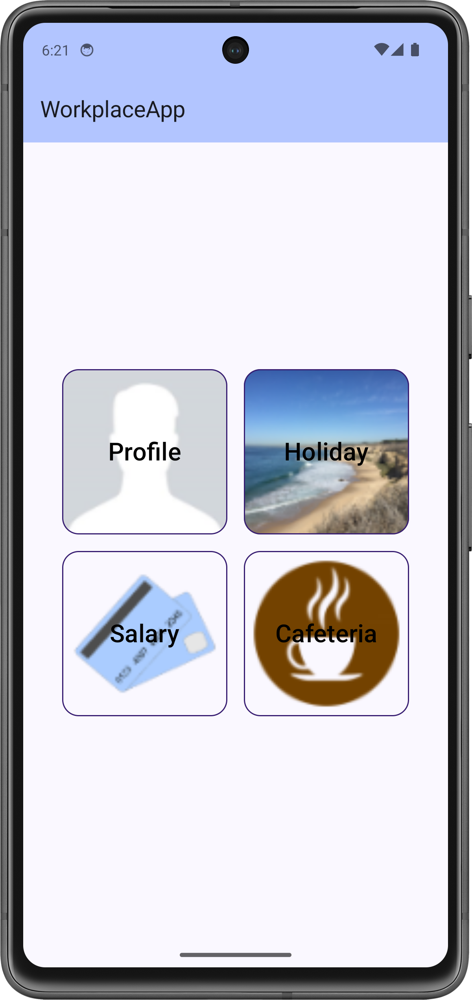
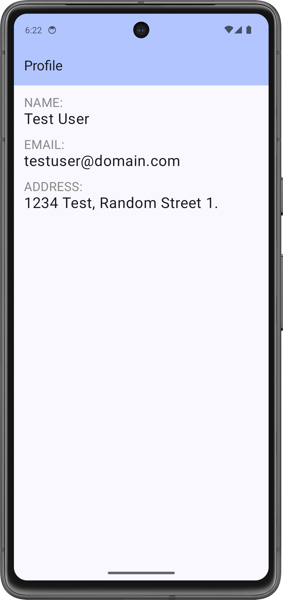
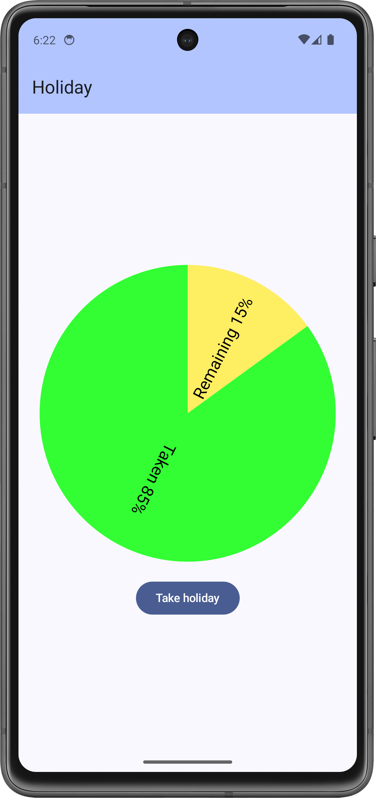
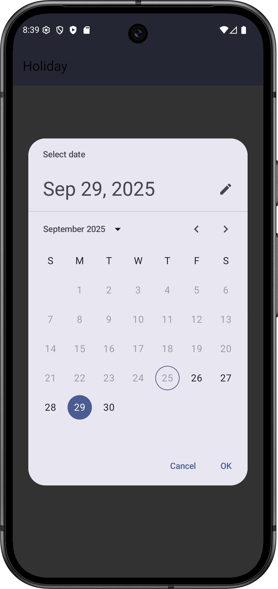

# Labor 04 - Felhasználói felület készítése - HorizontalPager, Chartok

## Bevezető

A labor során egy HR alkalmazást készítünk el, amelybe belépve a felhasználó meg tudja tekinteni személyes adatait, illetve szabadságot tud rögzíteni. Az alkalmazás nem használ perzisztens adattárolást és valós bejelentkeztetést, csak demo adatokkal dolgozik. A labor fő témái a HorizontalPagerrel való felületkészítés, illetve a Chartok lesznek.

<p align="center">





</p>


!!! warning "IMSc"
	A laborfeladatok sikeres befejezése után az IMSc feladat-ot megoldva 2 IMSc pont szerezhető.

## Értékelés

Osztályzás:

- Főmenü képernyő: 1 pont
- Profil képernyő: 1 pont
- Szabadság képernyő: 1 pont
- Dátumválasztó, napok csökkentése: 1 pont
- Önálló feladat (szabadság továbbfejlesztése): 1 pont

IMSc: Fizetés menüpont megvalósítása

- Kördiagram: 1 IMSc pont
- Oszlopdiagram: 1 IMSc pont

## Előkészületek

A feladatok megoldása során ne felejtsd el követni a [feladat beadás folyamatát](../../tudnivalok/github/GitHub.md).

### Git repository létrehozása és letöltése

1. Moodle-ben keresd meg a laborhoz tartozó meghívó URL-jét és annak segítségével hozd létre a saját repository-dat.

2. Várd meg, míg elkészül a repository, majd checkout-old ki.

    !!! tip ""
        Egyetemi laborokban, ha a checkout során nem kér a rendszer felhasználónevet és jelszót, és nem sikerül a checkout, akkor valószínűleg a gépen korábban megjegyzett felhasználónévvel próbálkozott a rendszer. Először töröld ki a mentett belépési adatokat (lásd [itt](../../tudnivalok/github/GitHub-credentials.md)), és próbáld újra.

3. Hozz létre egy új ágat `megoldas` néven, és ezen az ágon dolgozz.

4. A `neptun.txt` fájlba írd bele a Neptun kódodat. A fájlban semmi más ne szerepeljen, csak egyetlen sorban a Neptun kód 6 karaktere.

## Projekt létrehozása

Hozzunk létre egy új Android projektet 'Empty Activity' sablonnal! Az alkalmazás neve legyen `WorkplaceApp`, a Package name pedig `hu.bme.aut.android.workplaceapp`.

!!!danger "FILE PATH"
	A projekt a repository-ban lévő WorkplaceApp könyvtárba kerüljön, és beadásnál legyen is felpusholva! A kód nélkül nem tudunk maximális pontot adni a laborra!

Használhatjuk az alapértelmezett 24-es minimum SDK szintet és a Kotlin DSL-t.

Előzetesen töltsük le az alkalmazás képeit tartalmazó [tömörített fájlt](./downloads/res.zip) és bontsuk ki. A benne lévő mipmap könyvtárat másoljuk be az app/src/main/res mappába (Studio-ban res mappán állva `Ctrl+V`).

!!!info "Képernyők kezelése Android alkalmazásokban"
	A legtöbb mobilalkalmazás jól elkülöníthető oldalak/képernyők kombinációjából épül fel. Az egyik első fő döntés, amit alkalmazástervezés közben meg kell hoznunk, ezeknek a képernyőknek a felépítése, illetve a képernyők közötti navigáció megvalósítása. Egy Android alapú alkalmazás esetén több megoldás közül is választhatunk:
	
	-  *Activity alapú megközelítés*: Minden képernyő egy **Activity**. Mivel az **Activity** egy rendszerszintű komponense az Androidnak, ezért ennek kezeléséért is az operációs rendszer a felelős. Mi közvetlenül sose példányosítjuk, hanem **Intent**-et küldünk a rendszer felé. A navigációért is a rendszer felel, bizonyos opciókat *flagek* segítségével tudunk beállítani.
	- *Composable alapú megközelítés*: Ez esetben a képernyőink egy vagy több *Composable* elemből épülnek fel. Ezeknek a kezelése az alkalmazás szintjén történik meg, emiatt mindenképp szükséges egy **Activity**, mely a megjelenítésért felel. A megjelenítést illetve a navigációt a **NavGraph** osztály végzi.
	- *Egyéb egyedi megoldás*: Külső vagy saját könyvtár használata a megjelenítéshez, mely tipikusan az alap **View** osztályból származik le. Ilyen például a régi *Conductor*, illetve a *Jetpack Compose*.
	
	Régebben az alkalmazások az Activity alapú megközelítést használták, később azonban áttértek a Fragmentekre. Az ilyen alkalmazásoknál összesen egy fő **Activity** van, mely tartalmazza azt a **FragmentManager** példányt, amit a későbbiekben a **Fragment** alapú képernyők megjelenítésére használunk.
	
	Ez egy alapvetően rugalmas és jól használható megoldás volt, azonban ehhez részleteiben meg kellett ismerni a **FragmentManager** működését, különben könnyen hibákba futhattunk. Ennek a megoldására fejlesztette ki a Google a *Navigation Component* csomagot, mellyel az Android Studió környezetében egy grafikus eszközzel könnyen létre tudjuk hozni az oldalak közötti navigációt, illetve ezt a kódból egyszerűen el tudjuk indítani. 
	
	A Jetpack Compose-ban már a **NavHost** felel a navigációért, és külön-külön hívja meg az egyes *Composable* függvényeket.

## NavHost Compose inicializálás
Első lépésként adjuk hozzá a Navigation Component csomagot az üres projektünkhöz. Ehhez a modul szintű `build.gradle.kts` fájlra illetve a `libs.versions.toml` fájlra lesz szükségünk. Keressük meg ezeket, majd írjuk bele a következő függőséget:

`libs.versions.toml`
```toml
[versions]
...
navigationCompose = "2.7.7"


[libs]
...
androidx-navigation-compose = { module = "androidx.navigation:navigation-compose", version.ref = "navigationCompose" }
```

`build.gradle.kts`

```kts
dependencies {
    ...
    implementation(libs.androidx.navigation.compose)

}
```

Ha ezzel megvagyunk akkor Synceljük a projektet, a jobb fölső sarokban lévő `Sync Now` gombbal.


!!!warning "Sync"
    Figyeljünk rá, hogy Synceljük, ugyanis, hogy ha ez a lépés kimarad, akkor nem fogja megtalálni a szükséges függőségeket, és később ez gondot okozhat!

A Navigation Component *Jetpack Compose* használatával is navigációs gráfot alkalmaz a képernyők és a közöttük lévő kapcsolatok definiálására. Ezt a gráfot azonban közvetlenül *Kotlin* kódban tudjuk megadni. Létrehozásához kövessük az alábbi lépéseket:

1. Hozzuk létre a navigációs gráfot a Jetpack Compose használatával.

2. Készítsünk egy *package*-et `navigation` néven, majd ebbe a *package*-be egy új *Kotlin File*-t `NavGraph` néven (*jobb klikk -> New Kotlin Class/File*)

3. Az előző laborokon látott `NavGrap`-hoz hasonlóan hozzuk létre a `NavGraph`-ot:
```kotlin
package hu.bme.aut.android.workplaceapp.navigation

import androidx.compose.runtime.Composable
import androidx.navigation.NavHostController
import androidx.navigation.compose.NavHost
import androidx.navigation.compose.rememberNavController

@Composable
fun NavGraph(
    navController: NavHostController = rememberNavController(),
){
    NavHost(
        navController = navController,
        startDestination = Screen.Screen1.route
    ){
//        composable(Screen.Screen1.route){
//            Screen1()
//        }
//        composable(Screen.Screen2.route){
//            Screen2()
//        }
    }
}
```

4. Mint látható, itt a sima kézzel megadott *stringek* helyett hivatkozásokat használunk a *destination*-ök azonosítására. Ezeket a hivatkozásokat egy külön `Screen` *sealed class*-ban gyűjtjük össze:
```kotlin
package hu.bme.aut.android.workplaceapp.navigation

sealed class Screen(val route: String) {
    object Menu : Screen("menu")
    object Screen1: Screen("screen1")
    object Screen2: Screen("scren2")
}
```
!!!info "sealed class"
	A Kotlin *sealed class*-jai olyan osztályok, amelyekből korlátozott az öröklés, és fordítási időben minden leszármazott osztálya ismert. Ezeket az osztályokat az enumokhoz hasonló módon tudjuk alkalmazni. Jelen esetben a Menu valójában nem a Screen közvetlen leszármazottja, hanem anonim leszármazott osztálya.

5. Hogy ha ezzel megvagyunk, már, csak bővíteni kell igény szerint ezt a `NavGraph`-ot, illetve a `MainActivity`-ben, ezt a Composable függvényt kell meghívni, majd ez automatikusan a beállított főképernyőt hozza be az alkalmazás elindításakor.
```kotlin
package hu.bme.aut.android.workplaceapp

import android.os.Bundle
import androidx.activity.ComponentActivity
import androidx.activity.compose.setContent
import androidx.activity.enableEdgeToEdge
import hu.bme.aut.android.workplaceapp.navigation.NavGraph
import hu.bme.aut.android.workplaceapp.ui.theme.WorkplaceAppTheme

class MainActivity : ComponentActivity() {
    override fun onCreate(savedInstanceState: Bundle?) {
        super.onCreate(savedInstanceState)
        enableEdgeToEdge()
        setContent {
            WorkplaceAppTheme {
                NavGraph()
            }
        }
    }
}
```

!!!info "Több navigációs gráf"
    A Jetpack Compose használatával több navigációs gráf létrehozása és kezelése is lehetséges, azonban a legtöbb alkalmazásnál elegendő egyetlen `NavGraph`


## Főmenü képernyő (1 pont)

Az első képernyő, amit létrehozunk, a főoldal lesz, melyről a többi oldalra tudunk navigálni. A labor során 2 funkciót fogunk meghvalósítani, ezek a Profil és a Szabadság.

A `MenuScreen`-en egy TopAppBar-t és a gombokat szeretnénk megjeleníteni. 

<p align="center">

</p>

Először hozzunk létre egy `hu.bme.aut.android.workplaceapp.ui.view` *package*-et. Ebbe fognak kerülni az alapvető fontosságú UI építőelemeink:

`TopBar.kt`: 

```kotlin
package hu.bme.aut.android.workplaceapp.ui.view

import androidx.compose.material3.ExperimentalMaterial3Api
import androidx.compose.material3.MaterialTheme
import androidx.compose.material3.Text
import androidx.compose.material3.TopAppBar
import androidx.compose.material3.TopAppBarDefaults
import androidx.compose.runtime.Composable
import androidx.compose.ui.tooling.preview.Preview

@OptIn(ExperimentalMaterial3Api::class)
@Composable
fun TopBar(
    label: String = "Title"
) {
    TopAppBar(
        title = { Text(text = label) },
        colors = TopAppBarDefaults.topAppBarColors(
            containerColor = MaterialTheme.colorScheme.inversePrimary
        )
    )
}

@Composable
@Preview
fun PreviewTopBar() {
    TopBar("Workplace App")
}
```

Ez egy egyszerű *AppBar*, ennek segítségével elhelyezhetünk címet, különbőző *action*-öket, valamint gombokat.

`ImageButton`:

```kotlin
package hu.bme.aut.android.workplaceapp.ui.view

import androidx.compose.foundation.BorderStroke
import androidx.compose.foundation.Image
import androidx.compose.foundation.background
import androidx.compose.foundation.clickable
import androidx.compose.foundation.layout.Box
import androidx.compose.foundation.layout.PaddingValues
import androidx.compose.foundation.layout.fillMaxSize
import androidx.compose.foundation.layout.padding
import androidx.compose.foundation.layout.size
import androidx.compose.foundation.shape.RoundedCornerShape
import androidx.compose.material3.OutlinedButton
import androidx.compose.material3.Text
import androidx.compose.material3.darkColorScheme
import androidx.compose.runtime.Composable
import androidx.compose.ui.Alignment
import androidx.compose.ui.Modifier
import androidx.compose.ui.graphics.Color
import androidx.compose.ui.graphics.painter.Painter
import androidx.compose.ui.layout.ContentScale
import androidx.compose.ui.res.painterResource
import androidx.compose.ui.tooling.preview.Preview
import androidx.compose.ui.unit.Dp
import androidx.compose.ui.unit.dp
import hu.bme.aut.android.workplaceapp.R

@Composable
fun ImageButton(
    modifier: Modifier,
    label: String,
    painter: Painter,
    size: Dp,
    contentDescription: String? = null,
    onClick: () -> Unit
) {
    OutlinedButton(
        onClick = onClick,
        shape = RoundedCornerShape(16.dp),
        contentPadding = PaddingValues(
            start = 0.dp,
            top = 0.dp,
            end = 0.dp,
            bottom = 0.dp
        ),
        border = BorderStroke(1.dp, darkColorScheme().onPrimary)

    ) {
        Box(modifier = modifier.padding(0.dp)) {
            Image(
                contentScale = ContentScale.Crop,
                modifier = modifier
                    .align(Alignment.Center)
                    .size(size),
                painter = painter,
                contentDescription = contentDescription
            )
            Text(
                color = Color.Black,
                modifier = modifier.align(Alignment.Center),
                text = label
            )

        }
    }
}

@Composable
@Preview
fun PreviewImageButton() {
    ImageButton(
        modifier = Modifier,
        label = "Holiday",
        painter = painterResource(id = R.drawable.holiday),
        size = 160.dp,
        contentDescription = "Holiday",
        onClick = {}
    ) 
}
```

Ez egy egyszerű gomb, amin képeket és szövekeget is könnyen tudunk elhelyezni. Az univerzális felhasználás érdekében a lényeges attribútumok kivezetésre kerültek paraméterekként. 

Most már minden rendelkezésünkre áll, hogy megírjuk a `MainScreen` képernyőnket is. Ehhez hozzunk létre egy új `hu.bme.aut.android.workplaceapp.feature` *package*-et. Ebben lesznek külön *package*-ekben a képernyőink. A `hu.bme.aut.android.workplaceapp.feature.menu` *package*-be hozzuk létre a  `MenuScreen` *Kotlin File*-t:

```kotlin
package hu.bme.aut.android.workplaceapp.feature.menu

import androidx.compose.foundation.background
import androidx.compose.foundation.layout.Box
import androidx.compose.foundation.layout.Column
import androidx.compose.foundation.layout.Row
import androidx.compose.foundation.layout.Spacer
import androidx.compose.foundation.layout.fillMaxSize
import androidx.compose.foundation.layout.height
import androidx.compose.foundation.layout.padding
import androidx.compose.foundation.layout.width
import androidx.compose.material3.MaterialTheme
import androidx.compose.material3.Scaffold
import androidx.compose.runtime.Composable
import androidx.compose.ui.Alignment
import androidx.compose.ui.Modifier
import androidx.compose.ui.res.painterResource
import androidx.compose.ui.res.stringResource
import androidx.compose.ui.tooling.preview.Preview
import androidx.compose.ui.unit.dp
import hu.bme.aut.android.workplaceapp.R
import hu.bme.aut.android.workplaceapp.ui.view.ImageButton
import hu.bme.aut.android.workplaceapp.ui.view.TopBar

@Composable
fun MenuScreen(
    modifier: Modifier = Modifier,
    onProfileButtonClick: () -> Unit,
    onHolidayButtonClick: () -> Unit,
    onSalaryButtonClick: () -> Unit,
    onCafeteriaButtonClick: () -> Unit
) {
    Scaffold (
        topBar = { TopBar(label = stringResource(id = R.string.app_name)) }
    ) { innerPadding ->
        Box(
            modifier = modifier
                .fillMaxSize()
                .background(MaterialTheme.colorScheme.background)
                .padding(innerPadding),
            contentAlignment = Alignment.Center
        ) {
            Row(verticalAlignment = Alignment.CenterVertically) {
                Column(horizontalAlignment = Alignment.CenterHorizontally) {
                    ImageButton(
                        onClick = onProfileButtonClick,
                        modifier = modifier,
                        label = stringResource(R.string.profile),
                        painter = painterResource(id = R.drawable.profile),
                        size = 160.dp,
                        contentDescription = stringResource(R.string.profile)
                    )
                    Spacer(
                        modifier = Modifier.height(16.dp)
                    )
                    ImageButton(
                        onClick = onSalaryButtonClick,
                        modifier = modifier,
                        label = stringResource(R.string.salary),
                        painter = painterResource(id = R.drawable.payment),
                        size = 160.dp,
                        contentDescription = stringResource(R.string.salary)
                    )

                }
                Spacer(
                    modifier = Modifier.width(16.dp)
                )
                ///TODO
            }
        }
    }
}

@Preview
@Composable
fun MenuScreenPreview() {
    MenuScreen(
        onProfileButtonClick = {},
        onHolidayButtonClick = {},
        onCafeteriaButtonClick = {},
        onSalaryButtonClick = {}
    )
}
```

Ennek mintájára, valósítsuk meg a másik két gombot is az alábbi értékekkel:

|Szöveg|Kép|
|------|---|
|`Holiday`|`@drawable.holiday`|
|`Cafeteria`|`@drawable.cafeteria`|

Hozzuk létre a hivatkozott szöveges erőforrásokat! (A szövegen állva <kbd>ALT</kbd>+<kbd>ENTER</kbd>)

Ezek után egészítsük ki a `Screen` osztályunkat és a `NavGraph`-unkat:

```kotlin
package hu.bme.aut.android.workplaceapp.navigation

sealed class Screen(val route: String) {
    object Menu : Screen("menu")
}
```

```kotlin
package hu.bme.aut.android.workplaceapp.navigation

import androidx.compose.runtime.Composable
import androidx.navigation.NavHostController
import androidx.navigation.compose.NavHost
import androidx.navigation.compose.composable
import androidx.navigation.compose.rememberNavController
import hu.bme.aut.android.workplaceapp.feature.menu.MenuScreen

@Composable
fun NavGraph(
    navController: NavHostController = rememberNavController(),
) {
    NavHost(
        navController = navController,
        startDestination = Screen.Menu.route
    ) {
        composable("menu") {
            MenuScreen(
                onProfileButtonClick = {},
                onHolidayButtonClick = {},
                onSalaryButtonClick = {},
                onCafeteriaButtonClick = {})
        }
}
```

Ha most elindítjuk az alkalmazást, akkor már mind a 4 gombot látjuk, azonban még egyik sem működik. 

!!!example "BEADANDÓ (1 pont)"
	Készíts egy **képernyőképet**, amelyen látszik a **elkészült főoldal kép** (emulátoron, készüléket tükrözve vagy képernyőfelvétellel), egy **ahhoz tartozó kódrészlet**, valamint a **neptun kódod a kódban valahol kommentként**! A képet a megoldásban a repository-ba f1.png néven töltsd föl! 

	A képernyőkép szükséges feltétele a pontszám megszerzésének.


## Profil képernyő elkészítése (1 pont)

A Profil képernyő két lapozható oldalból fog állni (`HorizontalPager`), amelyen a következő információk lesznek megtalálhatóak:

- Első oldal
    - Név
    - Email
    - Lakcím
- Második oldal
    - Személyi szám
    - TAJ szám
    - Adószám
    - Törzsszám

Hozzunk létre egy `data` *package*-et, azon belül egy `Person` adatosztályt. Ebben fogjuk tárolni az oldalakon megjelenő adatokat. Az adat típusú osztályok esetében a Kotlin automatikusan generál gyakran használt függvényeket, mint például az `equals()` és `hashCode()` függvényeket különböző objektumok összehasonlításához, illetve egy `toString()` függvényt, mely visszaadja a tárolt változók értékét.


```kotlin
package hu.bme.aut.android.workplaceapp.data

data class Person(
    val name: String,
    val email: String,
    val address: String,
    val id: String,
    val socialSecurityNumber: String,
    val taxId: String,
    val registrationId: String
)
```

A *Person* osztály példányának elérésére hozzunk létre egy `DataManager` osztályt (szintén a `data` *package*-en belül). Ezzel fogjuk szimulálni a valós adatelérést (Singleton mintát használunk, hogy az alkalmazás minden részéből egyszerűen elérhető legyen, ehhez a Kotlin által biztosított object kulcsszót használjuk):

```kotlin
package hu.bme.aut.android.workplaceapp.data

object DataManager {
    val person = Person(
        "Test User", "testuser@domain.com",
        "1234 Test, Random Street 1.",
        "123456AB",
        "123456789",
        "1234567890",
        "0123456789"
    )
}
```

A profiloldalon az a célunk, hogy két külön részben megjelenítsük a normál és részletes adatokat. A két oldal között vízszintes swipe-al lehet majd lépni. Ehhez egy **HorizontalPager**-t fogunk használni, mely Composable függvények között képes ilyen interakciókat megvalósítani.

Először hozzunk létre a `hu.bme.aut.android.workplaceapp.ui.view` *package*be egy `InfoField` nevű segéd *Composable*-t, ami az adatok megjelenítését fogja segíteni:

```kotlin
package hu.bme.aut.android.workplaceapp.ui.view

import androidx.compose.foundation.layout.Column
import androidx.compose.foundation.layout.padding
import androidx.compose.material3.Text
import androidx.compose.runtime.Composable
import androidx.compose.ui.Modifier
import androidx.compose.ui.graphics.Color
import androidx.compose.ui.tooling.preview.Preview
import androidx.compose.ui.unit.dp
import androidx.compose.ui.unit.sp

@Composable
fun InfoField(title: String, value: String) {
    Column(
        modifier = Modifier.padding(bottom = 16.dp)
    ) {
        Text(
            color = Color.Gray,
            text = title,
            fontSize = 20.sp
        )
        Text(
            text = value,
            fontSize = 24.sp
        )
    }
}

@Preview
@Composable
fun PreviewInfoField() {
    InfoField(title = "Name", value = "Test User")
}
```

Ezek után készítsük el a két profil oldalunkat. A `hu.bme.aut.android.workplaceapp.feature.profile` *package*-be hozzuk létre az alábbi fájlokat:

`ProfileFirstPage`

```kotlin
package hu.bme.aut.android.workplaceapp.feature.profile

import androidx.compose.foundation.layout.Column
import androidx.compose.foundation.layout.fillMaxSize
import androidx.compose.foundation.layout.padding
import androidx.compose.runtime.Composable
import androidx.compose.ui.Modifier
import androidx.compose.ui.tooling.preview.Preview
import androidx.compose.ui.unit.dp
import hu.bme.aut.android.workplaceapp.ui.view.InfoField

@Composable
fun ProfileFirstPage(
    name: String,
    email: String,
    address: String
) {
    Column(
        modifier = Modifier
            .padding(16.dp)
            .fillMaxSize()
    ) {
        InfoField(title = "NAME:", value = name)
        InfoField(title = "EMAIL:", value = email)
        InfoField(title = "ADDRESS:", value = address)
    }
}

@Preview(showBackground = true)
@Composable
fun PreviewProfileFirstPage() {
    ProfileFirstPage(
        name = "Test User",
        email = "test@email",
        address = "Test Street"
    )
}
```

Ez a *Composable* függvény fog felelni az első oldalért, a következő pedig a második oldalért.

`ProfileSecondPage`

```kotlin
package hu.bme.aut.android.workplaceapp.feature.profile

import androidx.compose.foundation.layout.Column
import androidx.compose.foundation.layout.fillMaxSize
import androidx.compose.foundation.layout.padding
import androidx.compose.runtime.Composable
import androidx.compose.ui.Modifier
import androidx.compose.ui.tooling.preview.Preview
import androidx.compose.ui.unit.dp
import hu.bme.aut.android.workplaceapp.ui.view.InfoField

@Composable
fun ProfileSecondPage(
    id: String,
    socialSecurityId: String,
    taxId: String,
    registrationId: String
) {
    Column(
        modifier = Modifier
            .padding(16.dp)
            .fillMaxSize()
    ) {
        InfoField(title = "ID:", value = id)
        InfoField(title = "SOCIAL SECURITY ID:", value = socialSecurityId)
        InfoField(title = "TAX ID:", value = taxId)
        InfoField(title = "REGISTRATION ID:", value = registrationId)
    }
}

@Preview(showBackground = true)
@Composable
fun PreviewProfileSecondPage() {
    ProfileSecondPage(
        id = "123456",
        socialSecurityId = "A89FSE568TZ",
        taxId = "GO894GE56",
        registrationId = "R6879SDLTH"
    )
}
```

A függvény paraméterei a profil egyes adatai lesznek String formátumban. 

Ha ezekkel megvagyunk, készítsük el a `ProfileScreen` nevű *Composable* függvényünket az alábbiak szerint:

```kotlin
package hu.bme.aut.android.workplaceapp.feature.profile

import androidx.compose.foundation.ExperimentalFoundationApi
import androidx.compose.foundation.layout.Arrangement
import androidx.compose.foundation.layout.Column
import androidx.compose.foundation.layout.PaddingValues
import androidx.compose.foundation.layout.fillMaxSize
import androidx.compose.foundation.layout.padding
import androidx.compose.foundation.pager.HorizontalPager
import androidx.compose.foundation.pager.rememberPagerState
import androidx.compose.material3.Scaffold
import androidx.compose.runtime.Composable
import androidx.compose.ui.Alignment
import androidx.compose.ui.Modifier
import androidx.compose.ui.res.stringResource
import androidx.compose.ui.tooling.preview.Preview
import androidx.compose.ui.unit.dp
import hu.bme.aut.android.workplaceapp.R
import hu.bme.aut.android.workplaceapp.data.DataManager
import hu.bme.aut.android.workplaceapp.ui.view.TopBar

@OptIn(ExperimentalFoundationApi::class)
@Composable
fun ProfileScreen(
    modifier: Modifier = Modifier
) {
    Scaffold(
        topBar = {
            TopBar(stringResource(id = R.string.profile))
        }
    ) { innerPadding ->
        val pagerState = rememberPagerState(pageCount = { 2 })
        val profile = DataManager.person
        
        HorizontalPager(
            modifier = modifier
                .padding(innerPadding)
                .fillMaxSize(),
            state = pagerState
        ) {

            when (pagerState.currentPage) {
                0 -> {
                    ProfileFirstPage(
                        name = profile.name,
                        email = profile.email,
                        address = profile.address
                    )
                }

                1 -> {
                    ProfileSecondPage(
                        id = profile.id,
                        socialSecurityId = profile.socialSecurityNumber,
                        taxId = profile.taxId,
                        registrationId = profile.registrationId
                    )
                }
            }
        }
    }
}

@Composable
@Preview
fun PrevewProfileScreen() {
    ProfileScreen()
}
```

Itt először is létre kell hozunk egy `pagerState` nevű változót, amit át fogunk adni a `HorizontalPager`-nek. Ez tartalmazza, hogy hány oldal lesz az adott *Composable*-ön. Ezt követően szükség lesz egy profilra, amit már korábban definiáltunk egy `object`-ként. Végül a `HorizontalPager` segítségével létrehozzuk a lapozható oldalt, amin elhelyezzük a két *Composable* függvényt 1-1 oldalként.

Végük kössük be a `ProfileScreen`-t a navigáciba:

```kotlin
package hu.bme.aut.android.workplaceapp.navigation

sealed class Screen(val route: String) {
    object Menu : Screen("menu")
    object Profile: Screen("profile")
}
```

```kotlin
package hu.bme.aut.android.workplaceapp.navigation

import androidx.compose.runtime.Composable
import androidx.lifecycle.viewmodel.compose.viewModel
import androidx.navigation.NavHostController
import androidx.navigation.compose.NavHost
import androidx.navigation.compose.composable
import androidx.navigation.compose.rememberNavController
import hu.bme.aut.android.workplaceapp.feature.menu.MenuScreen
import hu.bme.aut.android.workplaceapp.feature.profile.ProfileScreen

@Composable
fun NavGraph(
    navController: NavHostController = rememberNavController(),
) {
    NavHost(
        navController = navController,
        startDestination = Screen.Menu.route
    ) {
        composable("menu") {
            MenuScreen(
                onProfileButtonClick = { navController.navigate(Screen.Profile.route) },
                onHolidayButtonClick = {},
                onSalaryButtonClick = {},
                onCafeteriaButtonClick = {})
        }
        composable(Screen.Profile.route) {
            ProfileScreen()
        }
    }
}
```

Próbáljuk ki az alkalmazást! A Profile gombra kattintva megjelennek a felhasználó adatai, és lehet lapozni is.

!!!example "BEADANDÓ (1 pont)"
	Készíts egy **képernyőképet**, amelyen látszik a **profil oldal** (emulátoron, készüléket tükrözve vagy képernyőfelvétellel), melyben az egyik mező helyére a **neptun kódod** van kírva, illetve a **HorizontalPager** kódrészlete! A képet a megoldásban a repository-ba f2.png néven töltsd föl! 

	A képernyőkép szükséges feltétele a pontszám megszerzésének.


## Szabadság képernyő elkészítése (1 pont)

A Szabadság képernyőn egy kördiagrammot fogunk megjeleníteni, ami azt mutatja meg százalékos arányban, hogy mennyi szabadságot vettünk már ki, és mennyi maradt még. A felületen ezen kívül egy gomb segítségével egy új szabadság intervallum kivételét is megengedjük a felhasználónak.

!!!note "PieChart"
	A PieChart kirajzoláshoz korábban, a View keretrendszerben az [MPAndroidChart](https://github.com/PhilJay/MPAndroidChart) library-t használtuk, azonban ez sajnos *Jetpack Compose*-ra nem működik.

A diagram kirajzolásáta [YCharts](https://github.com/codeandtheory/YCharts) könyvtárral fogjuk megoldani. Ehhez először vegyük is fel a függőséget:

Nyissuk meg a `settings.gradle.kts` fájlt, és vegyük fel a `repositories` tagen belülre a következőt:

```groovy
repositories {
    ...
    maven { url = uri("https://jitpack.io")}
}
```

Ezzel megadtuk, hogy a [jitpack](https://jitpack.io/) repository-ból is húzhatunk be függőségeket.

Ezután pedig vegyük fel az korábbi függőségekhez hasonlóan a *YCharts*-ot is:

`libs.versions.toml`:

```toml
[versions]
...
ycharts = "2.1.0"

[libraries]
...
ycharts = { module = "co.yml:ycharts", version.ref = "ycharts" }
```

`build.gradle.kts` (modul szintű):

```groovy
dependencies {
    ...
    implementation(libs.ycharts)
}
```

Valamint ezen a fájlon belül keressük meg a `minSdk` változót, és írjuk át 26-ra, ugyanis ez szükséges a *YCharts* használatához:

```groovy
android {
    ...
    defaultConfig{
        ...
        minSdk = 26
        ...
    }
    ...
}
```

Ezután Synceljük a Projectet a jobb fent lévő `Sync Now` gombbal. 

Ha a fájlok letöltődtek készítsük el a `hu.bme.aut.android.workplaceapp.feature.holiday` *package*-be a `HolidayScreen` *Composable* függvényünket az alábbiak szerint:

```kotlin
package hu.bme.aut.android.workplaceapp.feature.holiday

import androidx.compose.foundation.layout.Arrangement
import androidx.compose.foundation.layout.Column
import androidx.compose.foundation.layout.fillMaxSize
import androidx.compose.foundation.layout.padding
import androidx.compose.material3.Scaffold
import androidx.compose.runtime.Composable
import androidx.compose.runtime.getValue
import androidx.compose.runtime.mutableStateOf
import androidx.compose.runtime.remember
import androidx.compose.runtime.setValue
import androidx.compose.ui.Alignment
import androidx.compose.ui.Modifier
import androidx.compose.ui.tooling.preview.Preview
import hu.bme.aut.android.workplaceapp.ui.view.TopBar

@Composable
fun HolidayScreen(
    modifier: Modifier = Modifier
) {
    var showDialog by remember { mutableStateOf(false) }

    Scaffold (
        topBar = {
            TopBar("Holiday")
        }
    ) { innerPadding ->

        Column(
            modifier = modifier
                .padding(innerPadding)
                .fillMaxSize(),
            horizontalAlignment = Alignment.CenterHorizontally,
            verticalArrangement = Arrangement.Center
        ) {

            //PieChartData létrehozása
            //...

            //PieChartConfig létrehozása
            //...

            //PieChart létrehozása - PieChartData, PieChartConfig segítségével
            //...

            //Holiday Button
            //...

            //DatePicker Dialog
            //...

        }
    }

}

@Composable
@Preview
fun PreviewHolidayScreen() {
    HolidayScreen()
}
```

Majd ezt követően töltsük föl a felületet tartalommal:

1. Hozzuk létre a `pieChardData` változónkat az alábbiak szerint (Másoljuk be a `//PieChartData létrehozása` comment alá):
```kotlin
val pieChartData = PieChartData(
    slices = listOf(
        PieChartData.Slice("Remaining", 5f, Color(0xFFFFEB3B)),
        PieChartData.Slice("Taken", 15f, Color(0xFF00FF00)),
    ), plotType = PlotType.Pie
)
```
    * `PieChartData`-nak két paramétert tudunk átadni ezek:
        - **slices**: Ez a paraméter fogja tartalmazni az adatokat, és az adatok eloszlását, valamint az adatok színét.
        - **plotType**: Ezzel a változóval tudjuk megadni a diagram típusát. Jelen esetben ez most `Pie` típus lesz.
    * `PieChartData.Slice`-nak négy paramétert tudunk átadni, mi most csak az első hárommal foglalkozunk:
        - **label**: Ez a String fog megjelenni az egyes "szeleteken".
        - **value**: Ez az eloszlás értéke az adatoknak
        - **color**: Ezzel tudjuk beállítani az egyes adatok színét a diagramon.

    Az eloszlás értékének átadtuk a ViewModel-ben tárolt két változónkat. Ez minden egyes alkalommal változni fog, hogy ha új szabadság időintervallumot nyújtunk be, valamint, hogy ha kilépünk a Szabadság képernyőről a főmenübe, és vissza, továbbra is meg fogja tartani az értéket.

2.  Az előzőhöz hasonlóan hozzuk létre a `pieChartConfig` változót is:
```kotlin
val pieChartConfig = PieChartConfig(
    backgroundColor = Color.Transparent,
    labelType = PieChartConfig.LabelType.VALUE,
    isAnimationEnable = true,
    labelVisible = true,
    sliceLabelTextSize = TextUnit(20f, TextUnitType.Sp),
    animationDuration = 1000,
    sliceLabelTextColor = Color.Black,
    inActiveSliceAlpha = .8f,
    activeSliceAlpha = 1.0f,
)
```
    * A `PieChartConfig`-nak nagyon sok paramétere van, ezek közül csak párat fogunk megnézni a labor során.
        - **backgroundColor**: Ezzel tudjuk módosítani a diagram hátterét. Jelen esetben átlátszóra van szükségünk.
        - **labelType**: Ezzel lehet(ne) állítani, hogy az értéket, vagy a százalékot írja ki a diagram egyes szeletein, de ez jelenleg nem működik :)
        - **isAnimationEnable**: Animáció ki-be kapcsolása.
        - **labelVisible**: Ezzel tudjuk ki-be kapcsolni, hogy látszódjon a felirat a diagram szeletein.
        - **sliceLabelTextSize**: Felirat mérete a szeleteken.
        - **animationDuration**: Animáció időtartama.
        - **sliceLabelTextColor**: Felirat színe.
        - **inActiveSliceAlpha**: Inaktív szeletek átlátszósága.
        - **activeSliceAlpha**: Aktív szeletek átlátszósága.

3. `PieChart` létrehozása:
```kotlin
PieChart(
    modifier = Modifier
        .width(400.dp)
        .height(400.dp),
    pieChartData,
    pieChartConfig
)
```
    * Az előbb létrehozott két változót átadjuk a `PieChart` *Composable* függvénynek, és ezeknek a segítségével létrehozza a kördiagrammot.

Végül pedig a `HolidayScreen`-t is kössük be a navigációba:

```kotlin
package hu.bme.aut.android.workplaceapp.navigation

sealed class Screen(val route: String) {
    object Menu : Screen("menu")
    object Profile: Screen("profile")
    object Holiday: Screen("holiday")
}
```

```kotlin
package hu.bme.aut.android.workplaceapp.navigation

import androidx.compose.runtime.Composable
import androidx.lifecycle.viewmodel.compose.viewModel
import androidx.navigation.NavHostController
import androidx.navigation.compose.NavHost
import androidx.navigation.compose.composable
import androidx.navigation.compose.rememberNavController
import hu.bme.aut.android.workplaceapp.feature.holiday.HolidayScreen
import hu.bme.aut.android.workplaceapp.feature.holiday.HolidayViewModel
import hu.bme.aut.android.workplaceapp.feature.menu.MenuScreen
import hu.bme.aut.android.workplaceapp.feature.profile.ProfileScreen

@Composable
fun NavGraph(
    navController: NavHostController = rememberNavController(),
) {
    NavHost(
        navController = navController,
        startDestination = Screen.Menu.route
    ) {
        composable("menu") {
            MenuScreen(
                onProfileButtonClick = { navController.navigate(Screen.Profile.route) },
                onHolidayButtonClick = { navController.navigate(Screen.Holiday.route) },
                onSalaryButtonClick = {},
                onCafeteriaButtonClick = {})
        }
        composable(Screen.Profile.route) {
            ProfileScreen()
        }
        composable(Screen.Holiday.route) {
            HolidayScreen()
        }
    }
}
```


Hogy ha most elindítjuk az alkalmazást, akkor a Holiday opciónál már látjuk a diagrammot, azonban változtatni még nem tudunk rajta.

!!!example "BEADANDÓ (1 pont)"
	Készíts egy **képernyőképet**, amelyen látszik a **szabadságképernyő** (emulátoron, készüléket tükrözve vagy képernyőfelvétellel), egy **ahhoz tartozó kódrészlet**, valamint a **neptun kódod a kódban valahol kommentként**! A képet a megoldásban a repository-ba f3.png néven töltsd föl!

	A képernyőkép szükséges feltétele a pontszám megszerzésének.


## Dátumválasztó megvalósítása (1 pont)

Következő lépésként valósítsuk meg a `Take Holiday` gombot:
    * Ehhez szükségünk lesz a 4. lépésben egy `DialogWindow`-ra, de addig is be tudjuk állítani a Gomb működését. Ha megnyomjuk a gombot, a dialog megjelenítését jelző változót igazra állítjuk:

```kotlin
Button(
    onClick = { showDialog = true }
) {
    Text("Take holiday")
}
```

### Képernyők közötti állapot megtartása ViewModel segítségével

Ahhoz, hogy a képernyők közötti navigációkor ne veszítsük el a szabadságok nyilvántartását (és persze architekturális szempontból is), nem tárolhatjuk ezeket az állapotokat a *screen*-ekben. 
Hozzunk létre a `holiday` *package*-ben egy új *Kotlin Filet* `HolidayViewModel` néven. Itt fogjuk tárolni a szabadnapok maximális számát, illetve a már kivett szabadnapok számát. (Természetesen ezek az adatok egy valós alkalmazásban valamilyen háttértárról vagy hálózatról jönnének, a *viewmodel* onnan szerezné be ezeket.) 

A `HolidayViewModel` kódja:

```kotlin
package hu.bme.aut.android.workplaceapp.feature.holiday

import androidx.lifecycle.ViewModel
import androidx.lifecycle.viewModelScope
import kotlinx.coroutines.flow.MutableStateFlow
import kotlinx.coroutines.flow.StateFlow
import kotlinx.coroutines.launch

class HolidayViewModel : ViewModel() {
    private val _holidayMaxValue = MutableStateFlow(20)
    val maxHolidayValue: StateFlow<Int> = _holidayMaxValue

    private val _takenHolidayValue = MutableStateFlow(15)
    val takenHolidayValue: StateFlow<Int> = _takenHolidayValue

    fun takeHoliday(days: Int) {
        viewModelScope.launch {
            _takenHolidayValue.value += days
        }
    }
}
```

!!!warning "ViewModel"
	A viewmodel "szebb" és komplexebb használatára a későbbi laborokon lesze példa.

Ezután módosítsuk a `HolidayScreen` fejlécét, hogy átvegye a *viewmodel*.t, majd azokból szerezzük be a megfelelő álalpotokat:

```kotlin
package hu.bme.aut.android.workplaceapp.feature.holiday

import androidx.compose.foundation.layout.Arrangement
import androidx.compose.foundation.layout.Column
import androidx.compose.foundation.layout.fillMaxSize
import androidx.compose.foundation.layout.height
import androidx.compose.foundation.layout.padding
import androidx.compose.foundation.layout.width
import androidx.compose.material3.Button
import androidx.compose.material3.Scaffold
import androidx.compose.material3.Text
import androidx.compose.runtime.Composable
import androidx.compose.runtime.collectAsState
import androidx.compose.runtime.getValue
import androidx.compose.runtime.mutableStateOf
import androidx.compose.runtime.remember
import androidx.compose.runtime.setValue
import androidx.compose.ui.Alignment
import androidx.compose.ui.Modifier
import androidx.compose.ui.graphics.Color
import androidx.compose.ui.platform.LocalContext
import androidx.compose.ui.tooling.preview.Preview
import androidx.compose.ui.unit.TextUnit
import androidx.compose.ui.unit.TextUnitType
import androidx.compose.ui.unit.dp
import co.yml.charts.common.model.PlotType
import co.yml.charts.ui.piechart.charts.PieChart
import co.yml.charts.ui.piechart.models.PieChartConfig
import co.yml.charts.ui.piechart.models.PieChartData
import hu.bme.aut.android.workplaceapp.ui.view.TopBar
import androidx.lifecycle.viewmodel.compose.viewModel
import java.util.Calendar

@Composable
fun HolidayScreen(
    modifier: Modifier = Modifier,
    viewModel: HolidayViewModel = viewModel()
) {

    val maxHolidayValueVM by viewModel.maxHolidayValue.collectAsState()
    val takenHolidayValueVM by viewModel.takenHolidayValue.collectAsState()
    val remainingHolidaysVM = maxHolidayValueVM - takenHolidayValueVM

    val currentDate = Calendar.getInstance()
    val context = LocalContext.current

    var showDialog by remember { mutableStateOf(false) }

    Scaffold (
        topBar = {
            TopBar("Holiday")
        }
    ) { innerPadding ->

        Column(
            modifier = modifier
                .padding(innerPadding)
                .fillMaxSize(),
            horizontalAlignment = Alignment.CenterHorizontally,
            verticalArrangement = Arrangement.Center
        ) {

            //PieChartData létrehozása
            val pieChartData = PieChartData(
                slices = listOf(
                    PieChartData.Slice("Remaining", remainingHolidaysVM.toFloat(), Color(0xFFFFEB3B)),
                    PieChartData.Slice("Taken", takenHolidayValueVM.toFloat(), Color(0xFF00FF00)),
                ), plotType = PlotType.Pie
            )

            //PieChartConfig létrehozása
            val pieChartConfig = PieChartConfig(
                backgroundColor = Color.Transparent,
                labelType = PieChartConfig.LabelType.VALUE,
                isAnimationEnable = true,
                labelVisible = true,
                sliceLabelTextSize = TextUnit(20f, TextUnitType.Sp),
                animationDuration = 1000,
                sliceLabelTextColor = Color.Black,
                inActiveSliceAlpha = .8f,
                activeSliceAlpha = 1.0f,
            )

            //PieChart létrehozása - PieChartData, PieChartConfig segítségével
            PieChart(
                modifier = Modifier
                    .width(400.dp)
                    .height(400.dp),
                pieChartData,
                pieChartConfig
            )

            //Holiday Button
            Button(
                onClick = { showDialog = true }
            ) {
                Text("Take holiday")
            }

            //DatePicker Dialog
            //...

        }
    }

}

@Composable
@Preview
fun PreviewHolidayScreen() {
    HolidayScreen()
}
```
!!!danger "pieChartData"
    Figyeljünk arra, hogy a `pieChartData`-t is frissítsük, ugyanis itt már nem beégetett eloszlás értéket használunk, hanem a viewModel-ben lévő változót!

!!!warning "viewModel"
    Sokszor az Android Studio nem tudja megtalálni a `viewModel()`-hez szükséges importot. Ilyenkor kézileg írjuk az importokhoz az alábbi importot:
    ```kotlin
    import androidx.lifecycle.viewmodel.compose.viewModel
    ```

Ezek után hozzuk létre a dialógus ablakot az alábbiak szerint:

```kotlin
//DatePicker Dialog
if (showDialog) {
    DatePickerDialog(
        context,
        { _, _year, _months, _days ->
            showDialog = false
            val selectedDate = Calendar.getInstance().apply{
                set(_year, _months, _days)
            }
            val diff = ((selectedDate.timeInMillis - currentDate.timeInMillis) / (24 * 60 * 60 * 1000)).toInt()
            viewModel.takeHoliday(
                days = diff
            )
        },
        currentDate.get(Calendar.YEAR), currentDate.get(Calendar.MONTH), currentDate.get(Calendar.DAY_OF_MONTH)
    ).apply {
        setOnCancelListener { showDialog = false }
        show()
    }
}
```

Az előző laborokon látottakhoz hasonló módon használjuk a DataPicker Dialógust. Átadunk neki egy context-et, ezután egy lambda paramétert, ami a működést fogja leírni, abban az esetben, hogy ha dátumot választunk ki, majd végül utolsó három paraméternek átadjuk a jelenlegi dátumot.

!!!tip "DatePickerDialog import"
    A `DatePickerDialog`-nál használjuk az alábbi importot:
    ```kotlin
    import android.app.DatePickerDialog
    ```

Hogy ha ezzel megvagyunk, akkor már csak a `NavGraph`-ot kell úgy módosítani, hogy az értékeket megtartsa az alkalmazás, hogy ha ki-és belépünk a Holiday képernyőre. Ezt a következő képpen tudjuk megtenni:

```kotlin
package hu.bme.aut.android.workplaceapp.navigation

sealed class Screen(val route: String) {
    object Menu : Screen("menu")
    object Profile: Screen("profile")
    object Holiday: Screen("holiday")
}
```

```kotlin
@Composable
fun NavGraph(
    ...
){
    val holidayViewModel: HolidayViewModel = viewModel()

    NavHost(
        ...
    ){
        ...
        composable(Screen.Holiday.route) {
            HolidayScreen(viewModel = holidayViewModel)
        }

    }
}
```

Ezután az alkalmazást elindítva már működik a `Take Holiday` gombunk.

!!!example "BEADANDÓ (1 pont)"
	Készíts egy **képernyőképet**, amelyen látszik a **dátumválasztó kép** (emulátoron, készüléket tükrözve vagy képernyőfelvétellel), egy **ahhoz tartozó kódrészlet**, valamint a **neptun kódod a kódban valahol kommentként**! A képet a megoldásban a repository-ba f4a.png néven töltsd föl! **Emellett**  készíts egy **képernyőképet**, amelyen látszik a **dátumválasztás eredménye a szabadság képernyőn** (emulátoron, készüléket tükrözve vagy képernyőfelvétellel), egy **a kommunikációhoz tartozó kódrészlet**, valamint a **neptun kódod a kódban valahol kommentként**! A képet a megoldásban a repository-ba f4b.png néven töltsd föl!

	A képernyőkép szükséges feltétele a pontszám megszerzésének.


## Önálló feladat (1 pont)

*   Csak akkor engedjünk új szabadságot kivenni, hogy ha a kiválasztott nap a mai napnál későbbi. (0.5 pont)
*   Ha elfogyott a szabadságkeretünk, akkor a Take Holiday gomb legyen letiltva. (0.5 pont)

!!!example "BEADANDÓ (0.5 pont)"
	Készíts egy **képernyőképet**, amelyen látszik a **dátumválasztó oldal** (emulátoron, készüléket tükrözve vagy képernyőfelvétellel), a **korábbi napok tiltásához tartozó kódrészlet**, valamint a **neptun kódod a kódban valahol kommentként**! A képet a megoldásban a repository-ba f5a.png néven töltsd föl!

	A képernyőkép szükséges feltétele a pontszám megszerzésének.
	
!!!example "BEADANDÓ (0.5 pont)"
	Készíts egy **képernyőképet**, amelyen látszik a **letiltott gomb** (emulátoron, készüléket tükrözve vagy képernyőfelvétellel), egy **ahhoz tartozó kódrészlet**, valamint a **neptun kódod a kódban valahol kommentként**! A képet a megoldásban a repository-ba f5b.png néven töltsd föl!

	A képernyőkép szükséges feltétele a pontszám megszerzésének.

## iMSc feladat (2 pont)

### Fizetés menüpont megvalósítása

A Payment menüpontra kattintva jelenjen meg egy `PaymentScreen` rajta egy HorizontalPager-rel és két képernyővel (A Profile menüponthoz hasonlóan):
- `PaymentTaxesScreen`: kördiagram, aminek a közepébe van írva az aktuális fizetés és mutatja a nettó jövedelmet illetve a levont adókat (adónként külön)
- `MonthlyPaymentScreen`: egy oszlopdiagramot mutasson 12 oszloppal, a havi szinten lebontott fizetéseket mutatva - érdemes az adatokat itt is a DataManager osztályban tárolni

[Segítség](https://github.com/codeandtheory/YCharts)

!!!example "BEADANDÓ (1 iMSc pont)"
	Készíts egy **képernyőképet**, amelyen látszik az **aktuális fizetés és nettó jövedelem a levont adókkal** (emulátoron, készüléket tükrözve vagy képernyőfelvétellel), egy **ahhoz tartozó kódrészlet**, valamint a **neptun kódod a kódban valahol kommentként**! A képet a megoldásban a repository-ba f6.png néven töltsd föl!

	A képernyőkép szükséges feltétele a pontszám megszerzésének.
	

!!!example "BEADANDÓ (1 iMSc pont)"
	Készíts egy **képernyőképet**, amelyen látszik a **12 oszlop a havi fizetési adatokkal** (emulátoron, készüléket tükrözve vagy képernyőfelvétellel), egy **ahhoz tartozó kódrészlet**, valamint a **neptun kódod a kódban valahol kommentként**! A képet a megoldásban a repository-ba f7.png néven töltsd föl!

	A képernyőkép szükséges feltétele a pontszám megszerzésének.

## Extra feladat

Az érdeklődők kedvéért ezen a laboron egy extra feladat is van, viszont ez csak saját tapasztalat szerzésért. **Ezért a feladatért nem jár pont!**

*   Az önálló feladathoz hasonlóan most azt állítsuk be, hogy a DatePicker dialógus ablakon csak a mai illetve a mai + maximális szabadnapok között lehessen választani. 
