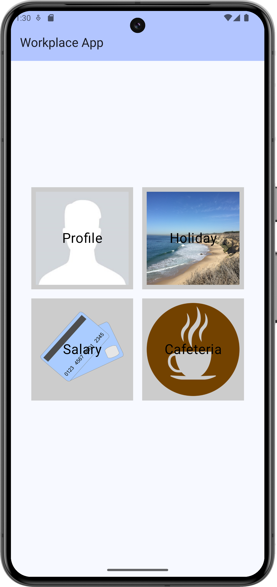
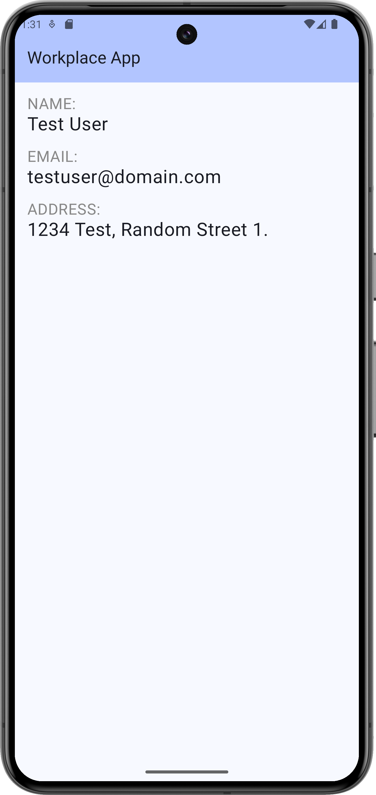
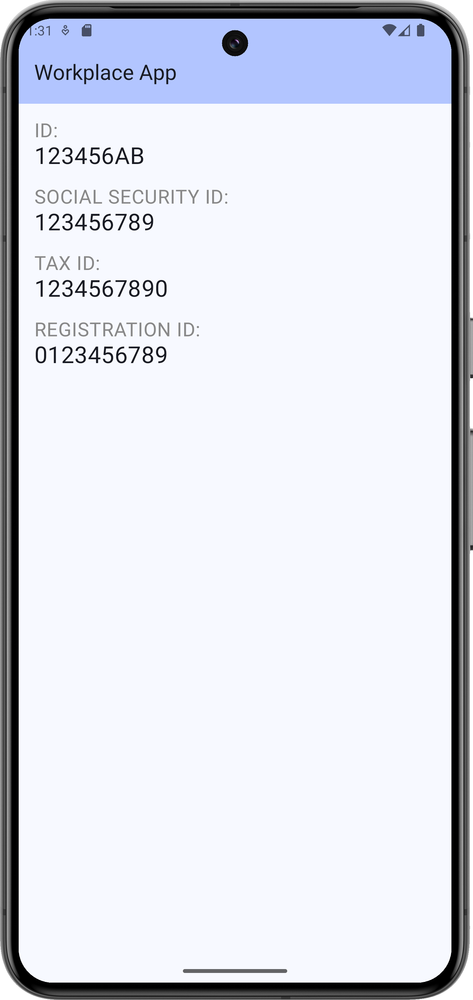
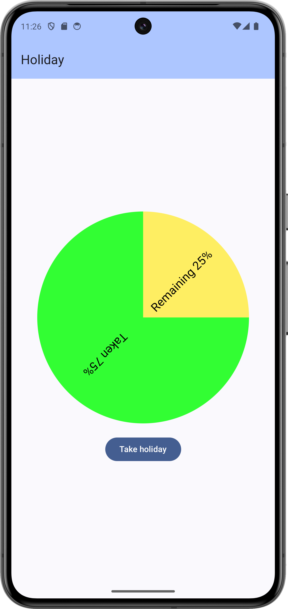
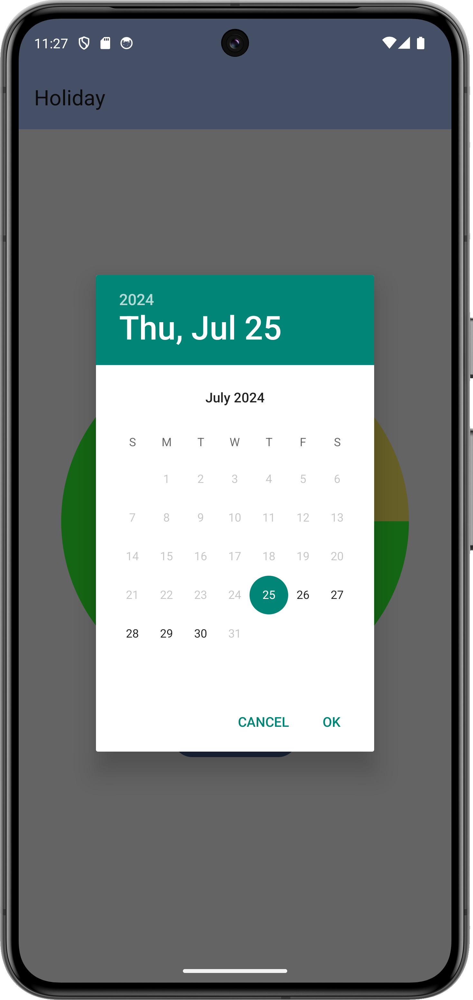

# Labor 04 - Felhasználói felület készítése - Fragmentek, Chartok

## Bevezető

A labor során egy HR alkalmazást készítünk el, amelybe belépve a felhasználó meg tudja tekinteni személyes adatait, illetve szabadságot tud rögzíteni. Az alkalmazás nem használ perzisztens adattárolást és valós bejelentkeztetést, csak demo adatokkal dolgozik. A labor fő témája a Fragmentekkel való felületkészítés, illetve a Navigation Component használata lesz.

<p align="center">





</p>


!!! warning "IMSc"
	A laborfeladatok sikeres befejezése után az IMSc feladat-ot megoldva 2 IMSc pont szerezhető.

## Értékelés

Osztályzás:

- Főmenü képernyő: 1 pont
- Profil képernyő: 1 pont
- Szabadság képernyő: 1 pont
- Dátumválasztó, napok csökkentése: 1 pont
- Önálló feladat (szabadság továbbfejlesztése): 1 pont

IMSc: Fizetés menüpont megvalósítása

- Kördiagram: 1 IMSc pont
- Oszlopdiagram: 1 IMSc pont

## Előkészületek

A feladatok megoldása során ne felejtsd el követni a [feladat beadás folyamatát](../../tudnivalok/github/GitHub.md).

### Git repository létrehozása és letöltése

1. Moodle-ben keresd meg a laborhoz tartozó meghívó URL-jét és annak segítségével hozd létre a saját repository-dat.

2. Várd meg, míg elkészül a repository, majd checkout-old ki.

    !!! tip ""
        Egyetemi laborokban, ha a checkout során nem kér a rendszer felhasználónevet és jelszót, és nem sikerül a checkout, akkor valószínűleg a gépen korábban megjegyzett felhasználónévvel próbálkozott a rendszer. Először töröld ki a mentett belépési adatokat (lásd [itt](../../tudnivalok/github/GitHub-credentials.md)), és próbáld újra.

3. Hozz létre egy új ágat `megoldas` néven, és ezen az ágon dolgozz.

4. A `neptun.txt` fájlba írd bele a Neptun kódodat. A fájlban semmi más ne szerepeljen, csak egyetlen sorban a Neptun kód 6 karaktere.

## Projekt létrehozása

Hozzunk létre egy új Android projektet 'Empty Activity' sablonnal! Az alkalmazás neve legyen `WorkplaceApp`, a Package name pedig `hu.bme.aut.workplaceapp`.

Az alkalmazást természetesen telefonra készítjük, és használhatjuk az alapértelmezett 21-ös minimum SDK szintet.

Előzetesen töltsük le az alkalmazás képeit tartalmazó [tömörített fájlt](./downloads/res.zip) és bontsuk ki. A benne lévő drawable könyvtárat másoljuk be az app/src/main/res mappába (Studio-ban res mappán állva `Ctrl+V`).

!!!danger "FILE PATH"
	A projekt a repository-ban lévő WorkplaceApp könyvtárba kerüljön, és beadásnál legyen is felpusholva! A kód nélkül nem tudunk maximális pontot adni a laborra!

## Képernyők kezelése Android alkalmazásokban
A legtöbb mobilalkalmazás jól elkülöníthető oldalak/képernyők kombinációjából épül fel. Az egyik első fő döntés, amit alkalmazástervezés közben meg kell hoznunk, ezeknek a képernyőknek a felépítése, illetve a képernyők közötti navigáció megvalósítása. Egy Android alapú alkalmazás esetén több megoldás közül is választhatunk:

-  *Activity alapú megközelítés*: Minden képernyő egy **Activity**. Mivel az **Activity** egy rendszerszintű komponense az Androidnak, ezért ennek kezeléséért is az operációs rendszer a felelős. Mi közvetlenül sose példányosítjuk, hanem **Intent**-et küldünk a rendszer felé. A navigációért is a rendszer felel, bizonyos opciókat *flagek* segítségével tudunk beállítani.
- *Fragment alapú megközelítés*: Ez esetben a képernyőink egy vagy több **Fragment**-ből épülnek fel. Ezeknek kezelése az alkalmazás szintjén történik meg, emiatt mindenképp szükséges egy **Activity**, mely a megjelenítésért felel. A megjelenítést, illetve a navigációt a **FragmentManager** osztály végzi.
- *Egyéb egyedi megoldás*: Külső vagy saját könyvtár használata a megjelenítéshez, mely tipikusan az alap **View** osztályból származik le. Ilyen például a régi *Conductor*, illetve az újabb *Jetpack Compose*.

Régebben az alkalmazások az Activity alapú megközelítést használták, később azonban áttértek a Fragmentekre. Az ilyen alkalmazásoknál összesen egy fő **Activity** van, mely tartalmazza azt a **FragmentManager** példányt, amit a későbbiekben a **Fragment** alapú képernyők megjelenítésére használunk.

Ez egy alapvetően rugalmas és jól használható megoldás volt, azonban ehhez részleteiben meg kellett ismerni a **FragmentManager** működését, különben könnyen hibákba futhattunk. Ennek a megoldására fejlesztette ki a Google a *Navigation Component* csomagot, mellyel az Android Studió környezetében egy grafikus eszközzel könnyen létre tudjuk hozni az oldalak közötti navigációt, illetve ezt a kódból egyszerűen el tudjuk indítani. 

## Navigation Component inicializálás
Első lépésként adjuk hozzá a Navigation Component csomagot az üres projektünkhöz. Ehhez a modul szintű `build.gradle` fájlban a `dependencies` részhez vegyük fel a következő függőségeket:
```
 def nav_version =  "2.5.1"
 
 implementation "androidx.navigation:navigation-fragment-ktx:$nav_version" 
 implementation "androidx.navigation:navigation-ui-ktx:$nav_version"
```
Illetve engedélyezzük a *View Binding*-ot az `android` részben:
```
buildFeatures {
    viewBinding true
}
```

A Navigation Component egy *navigációs gráfot* használ a képernyők, illetve a közöttük lévő kapcsolatok definiálására. Ezt a gráfot a többi erőforráshoz hasonlóan egy `.xml` kiterjesztésű fájlban tudjuk megadni. Hozzuk létre ezt a fájlt:

1. A `res` mappán jobb gombbal kattintva válasszuk ki a **New &rarr; Android Resource Directory** opciót, majd a *Resource Type* mezőben válasszuk ki a *navigation* lehetőséget.
2. Az így létrejött `navigation` mappán jobb klikkelve válasszuk ki a **new &rarr; Navigation Resource File** opciót, legyen a fájl neve *nav_graph*.

Ahhoz, hogy a létrehozott navigációs gráf által működjön az alkalmazásunk, fel kell vennünk az alkalmazásunkban is. Ehhez módosítanunk kell az üres Activity példányunkat. Nyissuk meg az `activity_main.xml` fájlt, és írjuk felül a tartalmát az alábbi kóddal:
```
<?xml version="1.0" encoding="utf-8"?>  
<androidx.constraintlayout.widget.ConstraintLayout xmlns:android="http://schemas.android.com/apk/res/android"  
  xmlns:app="http://schemas.android.com/apk/res-auto"  
  xmlns:tools="http://schemas.android.com/tools"  
  android:layout_width="match_parent"  
  android:layout_height="match_parent"  
  tools:context=".MainActivity">  
      
  <androidx.fragment.app.FragmentContainerView  
	  android:id="@+id/nav_host_fragment"  
	  android:name="androidx.navigation.fragment.NavHostFragment"  
	  android:layout_width="0dp"  
	  android:layout_height="0dp"  
	  app:layout_constraintLeft_toLeftOf="parent"  
	  app:layout_constraintRight_toRightOf="parent"  
	  app:layout_constraintTop_toTopOf="parent"  
	  app:layout_constraintBottom_toBottomOf="parent"  
  
	  app:defaultNavHost="true"  
	  app:navGraph="@navigation/nav_graph" />  
  
  
</androidx.constraintlayout.widget.ConstraintLayout>
```
A most hozzáadott `FragmentContainerView` lesz az a nézet, melyben a navigációs gráfban felvett képernyők meg fognak jelenni. A `navGraph` paraméterrel tudjuk megadni az aktuális navigációs gráfot, míg a `defaultNavHost`-al tudjuk jelezni, hogy a rendszer vissza gombját alapértelmezetten ennek a nézetnek kell lekezelnie.

!!!info "Több navigációs gráf"
    Bár a Navigation Component támogatja, hogy több különböző navigáció gráfot is létrehozzunk az alkalmazásunkban, a legtöbb alkalmazásnál elegendő egy darab.

Próbáljuk meg futtatni az alkalmazást! Az indulás után az alkalmazásunk crashelni fog, mivel még nem vettünk fel képernyőket a navigáció gráfban, az Activity semmit se tud megjeleníteni, hibára fut.

## Főmenü képernyő (1 pont)
Az első képernyő, amit létrehozunk, a főoldal lesz, melyről a többi oldalra tudunk navigálni. A labor során 2 funkciót fogunk megvalósítani, ezek a Profil és a Szabadság.

Nyissuk meg a `nav_graph.xml` fájlt, és kattintsunk a *New Destination* gombra (bal felső gomb), majd a *Create new destination* gombra:
<p align="center"> 

</p>
Válasszuk ki a *Fragment (Blank)* gombot, és legyen az oldal neve *MenuFragment*. Ezzel létrehoztunk az első oldalunkat, ami automatikusan megkapta a *Home Destination* jelölőt, ezzel mutatva, hogy az alkalmazás indulásakor ez lesz az első oldalunk.
A létrejött `fragment_menu.xml` tartalmát cseréljük ki az alábbira:

```xml
<?xml version="1.0" encoding="utf-8"?>
<LinearLayout xmlns:android="http://schemas.android.com/apk/res/android"
    android:layout_width="match_parent"
    android:layout_height="match_parent"
    android:layout_margin="16dp"
    android:gravity="center"
    android:orientation="vertical">

    <LinearLayout
        android:layout_width="match_parent"
        android:layout_height="wrap_content"
        android:orientation="horizontal">

        <FrameLayout
            android:layout_width="0dp"
            android:layout_height="wrap_content"
            android:layout_weight="1">

        </FrameLayout>

        <FrameLayout
            android:layout_width="0dp"
            android:layout_height="wrap_content"
            android:layout_weight="1">

        </FrameLayout>
    </LinearLayout>

    <LinearLayout
        android:layout_width="match_parent"
        android:layout_height="wrap_content"
        android:orientation="horizontal">

        <FrameLayout
            android:layout_width="0dp"
            android:layout_height="wrap_content"
            android:layout_weight="1">

        </FrameLayout>

        <FrameLayout
            android:layout_width="0dp"
            android:layout_height="wrap_content"
            android:layout_weight="1">

        </FrameLayout>

    </LinearLayout>

</LinearLayout>
```

Egy függőleges LinearLayout-ba tettünk bele 2 vízszintes LinearLayout-ot, mindkettő 2 gombot fog tartalmazni. Súlyozás segítségével 2 részre osztottuk a vízszintes LinearLayout-okat.
A gombon a háttér és a felirat elhelyezéséhez a korábbi laboron már látotthoz hasonlóan FrameLayout-ot fogunk használni.

Az első gombot például így készíthetjük el (a `FrameLayout` tagbe írjuk):
```xml
<ImageButton
    android:id="@+id/btnProfile"
    android:layout_width="match_parent"
    android:layout_height="match_parent"
    android:adjustViewBounds="true"
    android:scaleType="fitCenter"
    android:src="@drawable/profile" />

<TextView
    android:layout_width="wrap_content"
    android:layout_height="wrap_content"
    android:layout_gravity="center"
    android:text="Profile"
    android:textSize="34sp" />
```

A további 3 gombot ennek a mintájára készítsük el ezekkel az értékekkel:

| Szöveg | ID | Kép |
| -- | -- | -- |
| Holiday | `@+id/btnHoliday` | `@drawable/holiday` |
| Payment | `@+id/btnPayment` | `@drawable/payment` |
| Cafeteria | `@+id/btnCafeteria` | `@drawable/cafeteria` |

Ne felejtsük el a szövegeket kiszervezni erőforrásba! (a szövegen állva `Alt+Enter`)

Valósítsuk meg a navigációt a két oldalra. Hozzunk létre két új *Fragment (Blank)* képernyőt (`ProfileFragment` és `HolidayFragment`). A navigációs gráfban az oldalak közötti navigációt akciókkal tudjuk meghatározni. Egy új akcióhoz fogjuk meg a kiindulási képernyő jobb oldalán lévő kis pöttyöt, és húzzuk a cél oldalra. A két akció létrehozása után így fog kinézni a navigációs gráf:

<p align="center"> 

</p>

Az akciók meghívásához használjuk a view binding-ot a `MenuFragment`-ben:

```kotlin
class MenuFragment : Fragment() {  
	private lateinit var binding : FragmentMenuBinding  

	override fun onCreateView(
		inflater: LayoutInflater,
		container: ViewGroup?,
		savedInstanceState: Bundle?
	): View {  
        binding = FragmentMenuBinding.inflate(inflater, container, false)  
        return binding.root;  
    }  
  
    override fun onViewCreated(view: View, savedInstanceState: Bundle?) {  
        super.onViewCreated(view, savedInstanceState)  
  
        binding.btnProfile.setOnClickListener {
	        findNavController().navigate(R.id.action_menuFragment_to_profileFragment)  
        }  
        binding.btnHoliday.setOnClickListener {
	        findNavController().navigate(R.id.action_menuFragment_to_holidayFragment)  
        }  
    }  
}
```
A `findNavController()` függvénnyel érhetjük el a **NavController** osztály aktuális példányát, mellyel a navigációt tudjuk megvalósítani. A navigációhoz használt akciókhoz automatikusan generálódik egy azonosító, de ezeket a szerkesztőben módosíthatjuk, ha szeretnénk.

Próbáljuk ki az alkalmazást! 4 gombnak kell megjelennie és a felső kettőn működnie kell a navigációnak a (még) üres Fragment-kbe.

!!!example "BEADANDÓ (1 pont)"
	Készíts egy **képernyőképet**, amelyen látszik a **elkészült főoldal kép** (emulátoron, készüléket tükrözve vagy képernyőfelvétellel), egy **ahhoz tartozó kódrészlet**, valamint a **neptun kódod a kódban valahol kommentként**. A képet a megoldásban a repository-ba f1.png néven töltsd föl. 

## Profil képernyő elkészítése (1 pont)

A Profil képernyő két lapozható oldalból fog állni, ezen a név, email, lakcím (első oldal), illetve a személyigazolvány szám, TAJ szám, adószám és törzsszám (második oldal) fognak megjelenni.

Hozzunk létre egy `data` package-et, azon belül egy `Person` adatosztályt, ebben fogjuk tárolni az oldalakon megjelenő adatokat.
Az adat típusú osztályok esetében a Kotlin automatikusan deklarál gyakran használt függvényeket, mint például az `equals()` és `hashCode()` függvényeket különböző objektumok összehasonlításához, illetve egy `toString()` függvényt, mely visszaadja a tárolt változók értékét.

```kotlin
data class Person(
    val name: String,
    val email: String,
    val address: String,
    val id: String,
    val socialSecurityNumber: String,
    val taxId: String,
    val registrationId: String
)
```

A Person osztály példányának elérésére hozzunk létre egy `DataManager` osztályt (szintén a `data` package-en belül), ezzel fogjuk szimulálni a valós adatelérést (Singleton mintát használunk, hogy az alkalmazás minden részéből egyszerűen elérhető legyen, ehhez a Kotlin által biztosított `object` kulcsszót használjuk):

```kotlin
object DataManager {
    val person = Person(
        "Test User", "testuser@domain.com",
        "1234 Test, Random Street 1.",
        "123456AB",
        "123456789",
        "1234567890",
        "0123456789"
    )
}
```
A profiloldalon az a célunk, hogy két külön részben megjelenítsük a normál és részletes adatokat. A két oldal között vízszintes swipe-al lehet majd lépni. Ehhez egy **ViewPager**-t fogunk használni, mely Fragment oldalak között képes ilyen interakciót megvalósítani.

Hozzunk létre egy új *package*-et `profile` néven, majd mozgassuk át ebbe a `ProfileFragment` osztályunkat. A mozgatás után a következő helyeken javítani kell a fájl útvonalát:
- `fragment_profile.xml` context rész
- `nav_graph.xml` megfelelő tag `name` paramétere
- `R` importálása a `ProfileFragment` fájlban.

Ezután elkészíthetjük a két oldalt, Fragmentekkel. Hozzuk létre a `profile` package-ben a két Fragmentet (New -> Kotlin Class), ezek neve legyen `MainProfileFragment` és `DetailsProfileFragment`.

A két Fragmentben származzunk le a Fragment osztályból (androidx-es verziót válasszuk) és definiáljuk felül az onCreateView metódust. Ebben betöltjük a layout-ot és a Person objektum adatait kiírjuk a TextView-kra.

`MainProfileFragment.kt`:
```kotlin
class MainProfileFragment : Fragment(){
    private lateinit var binding: FragmentProfileMainBinding

    override fun onCreateView(inflater: LayoutInflater, container: ViewGroup?, savedInstanceState: Bundle?): View? {
        binding = FragmentProfileMainBinding.inflate(inflater, container, false)
        return binding.root
    }

    override fun onViewCreated(view: View, savedInstanceState: Bundle?) {
        super.onViewCreated(view, savedInstanceState)

        val person = DataManager.person
        binding.tvName.text = person.name
        binding.tvEmail.text = person.email
        binding.tvAddress.text = person.address
    }
}
```

`DetailsProfileFragment.kt`:
```kotlin
class DetailsProfileFragment : Fragment(){
    private lateinit var binding: FragmentProfileDetailBinding

    override fun onCreateView(inflater: LayoutInflater, container: ViewGroup?, savedInstanceState: Bundle?): View? {
        binding = FragmentProfileDetailBinding.inflate(inflater, container, false)
        return binding.root
    }

    override fun onViewCreated(view: View, savedInstanceState: Bundle?) {
        super.onViewCreated(view, savedInstanceState)

        val person = DataManager.person
        binding.tvId.text = person.id
        binding.tvSSN.text = person.socialSecurityNumber
        binding.tvTaxId.text = person.taxId
        binding.tvRegistrationId.text = person.registrationId
    }
}
```

Készítsük el a megfelelő layout-okat a Fragmentekhez (`fragment_profile_main.xml` és `fragment_profile_detail.xml`).

`fragment_profile_main.xml`:
```xml
<?xml version="1.0" encoding="utf-8"?>
<LinearLayout xmlns:android="http://schemas.android.com/apk/res/android"
    android:layout_width="match_parent"
    android:layout_height="match_parent"
    android:orientation="vertical"
    android:padding="16dp">

    <TextView
        android:layout_width="wrap_content"
        android:layout_height="wrap_content"
        android:text="Name:"
        android:textAllCaps="true"
        android:textSize="20sp" />

    <TextView
        android:id="@+id/tvName"
        android:layout_width="match_parent"
        android:layout_height="wrap_content"
        android:layout_marginBottom="20dp"
        android:textColor="#000000"
        android:textSize="34sp" />

    <TextView
        android:layout_width="wrap_content"
        android:layout_height="wrap_content"
        android:text="Email:"
        android:textAllCaps="true"
        android:textSize="20sp" />

    <TextView
        android:id="@+id/tvEmail"
        android:layout_width="match_parent"
        android:layout_height="wrap_content"
        android:layout_marginBottom="20dp"
        android:textColor="#000000"
        android:textSize="34sp" />

    <TextView
        android:layout_width="wrap_content"
        android:layout_height="wrap_content"
        android:text="Address:"
        android:textAllCaps="true"
        android:textSize="20sp" />

    <TextView
        android:id="@+id/tvAddress"
        android:layout_width="match_parent"
        android:layout_height="wrap_content"
        android:layout_marginBottom="20dp"
        android:textColor="#000000"
        android:textSize="34sp" />

</LinearLayout>
```

`fragment_profile_detail.xml`:
```xml
<?xml version="1.0" encoding="utf-8"?>
<LinearLayout xmlns:android="http://schemas.android.com/apk/res/android"
    android:layout_width="match_parent"
    android:layout_height="match_parent"
    android:orientation="vertical"
    android:padding="16dp">

    <TextView
        android:layout_width="wrap_content"
        android:layout_height="wrap_content"
        android:text="ID:"
        android:textAllCaps="true"
        android:textSize="20sp" />

    <TextView
        android:id="@+id/tvId"
        android:layout_width="match_parent"
        android:layout_height="wrap_content"
        android:layout_marginBottom="20dp"
        android:textColor="#000000"
        android:textSize="34sp" />

    <TextView
        android:layout_width="wrap_content"
        android:layout_height="wrap_content"
        android:text="Social Security ID:"
        android:textAllCaps="true"
        android:textSize="20sp" />

    <TextView
        android:id="@+id/tvSSN"
        android:layout_width="match_parent"
        android:layout_height="wrap_content"
        android:layout_marginBottom="20dp"
        android:textColor="#000000"
        android:textSize="34sp" />

    <TextView
        android:layout_width="wrap_content"
        android:layout_height="wrap_content"
        android:text="Tax ID:"
        android:textAllCaps="true"
        android:textSize="20sp" />

    <TextView
        android:id="@+id/tvTaxId"
        android:layout_width="match_parent"
        android:layout_height="wrap_content"
        android:layout_marginBottom="20dp"
        android:textColor="#000000"
        android:textSize="34sp" />

    <TextView
        android:layout_width="wrap_content"
        android:layout_height="wrap_content"
        android:text="Registration ID:"
        android:textAllCaps="true"
        android:textSize="20sp" />

    <TextView
        android:id="@+id/tvRegistrationId"
        android:layout_width="match_parent"
        android:layout_height="wrap_content"
        android:layout_marginBottom="20dp"
        android:textColor="#000000"
        android:textSize="34sp" />

</LinearLayout>
```

(Szervezzük ki a szövegeket erőforrásba)

Már csak a lapozás megvalósítása maradt hátra, ezt a ViewPager osztállyal fogjuk megvalósítani.

A `fragment_profile.xml` fájlba hozzunk létre egy `ViewPager`-t:
```xml
<?xml version="1.0" encoding="utf-8"?>
<LinearLayout xmlns:android="http://schemas.android.com/apk/res/android"
    xmlns:tools="http://schemas.android.com/tools"
    android:layout_width="match_parent"
    android:layout_height="match_parent"
    tools:context="hu.bme.aut.workplaceapp.profile.ProfileFragment">

    <androidx.viewpager2.widget.ViewPager2
        android:id="@+id/vpProfile"
        android:layout_width="match_parent"
        android:layout_height="match_parent" />
</LinearLayout>
```
!!!info "ViewPager2"
	A ViewPager2 osztály egy teljes újraírása az eredeti ViewPager osztálynak, a RecyclerView-re alapozva.

A ViewPager osztály egy PagerAdapter osztály segítségével tudja az oldalakat létrehozni. Hozzunk létre egy új  PagerAdaptert a két Fragmentünkhöz.
`ProfilePagerAdapter.kt`:
```kotlin
class ProfilePageAdapter(fragment: Fragment) : FragmentStateAdapter(fragment) {  
  
  override fun getItemCount(): Int = NUM_PAGES  
  
  override fun createFragment(position: Int): Fragment = when(position){  
      0 -> MainProfileFragment()  
      1 -> DetailsProfileFragment()  
      else -> MainProfileFragment()  
  }  
  
  companion object{  
      const val NUM_PAGES = 2  
  }  
}
```

A ProfileFragment-ben rendeljük hozzá a ViewPagerhez a most elkészített adaptert: 
```kotlin
class ProfileFragment : Fragment() {  
      
    private lateinit var binding: FragmentProfileBinding  
  
  override fun onCreateView(  
        inflater: LayoutInflater,   
        container: ViewGroup?,   
        savedInstanceState: Bundle?  
    ): View {  
        binding = FragmentProfileBinding.inflate(inflater, container, false)  
        return binding.root  
  }  
  
    override fun onViewCreated(view: View, savedInstanceState: Bundle?) {  
        super.onViewCreated(view, savedInstanceState)  
      
        binding.vpProfile.adapter = ProfilePageAdapter(this)  
    }  
}
```

Próbáljuk ki az alkalmazást. A Profile gombra kattinva megjelennek a felhasználó adatai és lehet lapozni is.

!!!example "BEADANDÓ (1 pont)"
	Készíts egy **képernyőképet**, amelyen látszik a **profil oldal** (emulátoron, készüléket tükrözve vagy képernyőfelvétellel), melyben az egyik mező helyére a **neptun kódod** van kírva, illetve a **ProfilePageAdapter** kódrészlete. A képet a megoldásban a repository-ba f2.png néven töltsd föl. 

## Szabadság képernyő elkészítése (1 pont)

A Szabadság képernyőn egy kördiagramot fogunk megjeleníteni, ami mutatja, hogy mennyi szabadságot vettünk már ki és mennyi maradt. Ezen kívül egy gomb segítségével új szabadnap kivételét is megengedjük a felhasználónak.

Először egészítsük ki a DataManager osztályunkat, hogy kezelje a szabadsághoz kapcsolódó adatokat is:
```kotlin
const val HOLIDAY_MAX_VALUE = 20
const val HOLIDAY_DEFAULT_VALUE = 15

var holidays = HOLIDAY_DEFAULT_VALUE
val remainingHolidays get() = HOLIDAY_MAX_VALUE - holidays
```

A PieChart kirajzolásához az [MPAndroidChart](https://github.com/PhilJay/MPAndroidChart) library-t fogjuk használni.

settings.gradle:
```groovy
dependencyResolutionManagement {
    repositories {
        ...
        maven { url "https://jitpack.io" }
    }
}
```

App szintű build.gradle:
```groovy
dependencies {
    ...
    implementation 'com.github.PhilJay:MPAndroidChart:v3.1.0'
}
```

Ezután kattinsunk az Android Studioban jobb fent megjelenő `Sync Now` feliratra vagy a fejlécen szereplő mérges gradle elefánt gombra, hogy a library fájljai letöltődjenek.

Ha a library fájljai letöltődtek, akkor írjuk meg a Fragment layout-ját (`fragment_holiday.xml`):
```xml
<?xml version="1.0" encoding="utf-8"?>
<LinearLayout xmlns:android="http://schemas.android.com/apk/res/android"
    xmlns:tools="http://schemas.android.com/tools"
    android:layout_width="match_parent"
    android:layout_height="match_parent"
    android:orientation="vertical"
    tools:context="hu.bme.aut.workplaceapp.HolidayFragment">

    <com.github.mikephil.charting.charts.PieChart
        android:id="@+id/chartHoliday"
        android:layout_width="match_parent"
        android:layout_height="0dp"
        android:layout_weight="1" />

    <Button
        android:id="@+id/btnTakeHoliday"
        android:layout_width="wrap_content"
        android:layout_height="wrap_content"
        android:text="Take Holiday"
        android:layout_gravity="center" />

</LinearLayout>
```

Írjuk meg a Fragment kódját (`HolidayFragment.kt`):
```kotlin
class HolidayFragment : Fragment() {

    private lateinit var binding : FragmentHolidayBinding

    override fun onCreateView(
        inflater: LayoutInflater,
        container: ViewGroup?,
        savedInstanceState: Bundle?
    ): View {
        binding = FragmentHolidayBinding.inflate(layoutInflater, container, false)
        return binding.root
    }

    override fun onViewCreated(view: View, savedInstanceState: Bundle?) {
        super.onViewCreated(view, savedInstanceState)

        binding.btnTakeHoliday.setOnClickListener {
            //TODO: DatePickerDialogFragment megjelenítése
        }
        loadHolidays()
    }

    private fun loadHolidays(){
        val entries = listOf(
            PieEntry(DataManager.holidays.toFloat(), "Taken"),
            PieEntry(DataManager.remainingHolidays.toFloat(), "Remaining")
        )

        val dataSet = PieDataSet(entries, "Holidays")
        dataSet.colors = ColorTemplate.MATERIAL_COLORS.toList()

        val data = PieData(dataSet)
        binding.chartHoliday.data = data
        binding.chartHoliday.invalidate()
    }
}
```

Próbáljuk ki az alkalmazást! A PieChart most már megjelenik, de a gomb még nem kell, hogy működjön.

!!!example "BEADANDÓ (1 pont)"
	Készíts egy **képernyőképet**, amelyen látszik a **elkészült szabadság képernyő** (emulátoron, készüléket tükrözve vagy képernyőfelvétellel), egy **ahhoz tartozó kódrészlet**, valamint a **neptun kódod a kódban valahol kommentként**. A képet a megoldásban a repository-ba f3.png néven töltsd föl. 
 
## Dátumválasztó megvalósítása (1 pont)

A következő lépésben a Take Holiday gombra megjelenő dátumválasztó működését fogjuk megvalósítani. A gomb lenyomására megjelenik egy dátumválasztó és a dátum kiválasztása után a szabad napok eggyel csökkennek.

Hozzunk létre egy DatePickerDialogFragment osztályt:
```kotlin
class DatePickerDialogFragment : DialogFragment(), DatePickerDialog.OnDateSetListener{

    override fun onCreateDialog(savedInstanceState: Bundle?): Dialog {
        val c = Calendar.getInstance()
        val year = c.get(Calendar.YEAR)
        val month = c.get(Calendar.MONTH)
        val day = c.get(Calendar.DAY_OF_MONTH)
        return DatePickerDialog(requireContext(), this, year, month, day)
    }

    override fun onDateSet(view: DatePicker?, year: Int, month: Int, dayOfMonth: Int) {
        //TODO: return result
    }
}
```

Az importoknál a `java.util`-t válasszuk a Calendarhoz, a Fragment-hez pedig az `androidx`-es verziót.

Vegyük fel a dialógust a navigációs gráfba! Ehhez kattintsunk a **New Destination** gombra, és válasszuk ki a most létrehozott DatePickerDialogFragment osztályt.

!!!note "Dialog a navigációs gráfban"
	A kiválasztásnál észrevehetjük, hogy a típusnál a *Fragment (dialog)* van megadva, míg a többi képernyőnél csak *Fragment*. Ez azért van, mert az osztály a **DialogFragment**-ből származik le, ami a navigációs gráf máshogy kezel, mivel ez nem egy teljes képernyős nézet. Ha átváltunk a kód nézetbe, ott is látható, hogy `dialog` taggel van felvéve ez az útvonal.

Adjunk hozzá a navigációhoz egy akciót, mely a **HolidayFragment**-ből a **DatePickerDialogFragment**-re mutat. Állítsuk be a gomb eseménykezelőjét a HolidayFragment-ben, hogy lenyomáskor jelenítse meg a dátumválasztót:
```kotlin
binding.btnTakeHoliday.setOnClickListener {
    findNavController().navigate(R.id.action_holidayFragment_to_datePickerDialogFragment)
}
```

Próbáljuk ki az alkalmazást! Mostmár megjelenik a dialógus egy kisebb ablakban, de még a dátumválasztás eredménye nem jut vissza a kiinduló képernyőre. 

### Fragmentek közötti kommunikáció a Navigation Component segítségével

Ahogy láthattuk az eddigi feladatok megoldásaiból, a Navigation Component a használata során maga kezeli a Fragmenteket, ő felelős a példányosításért. Ennek köszönhetően ha kommunikálni akarunk a képernyők között, akkor azt is a Navigation Component segítségével tudjuk megtenni.
Kommunikáció során alapvetően két irányről beszélhetünk:

- A hívó fél szeretne valamilyen paramétert átadni az új oldalnak.
- Az új, jelenleg látható oldal szeretne valamilyen értéket visszaadni az előző oldalnak.

!!!note "Több oldalon keresztüli navigáció"
	A Navigation Component csak a szomszédos oldalak közötti navigációt teszi lehetővé. Több oldal esetén érdemesebb valamilyen egész alkalmazásra vonatkozó állapotkezelési megoldást használni.

Az új oldalnak való paraméterátadás esetében a felületi szerkesztőben a megfelelő oldalt kiválasztva tudunk felvenni új paramétereket. Itt megadhatjuk a paraméter nevét, típusát, illetve pár egyéb opcionális beállítást. Ezekből a *Safe Args* csomag segítségével minden akcióhoz egy segédosztály fog generálódni, melyet példányosítva meg tudjuk adni a paramétereket, és ezt átadva a **NavController** `navigate()` függvényének, át tudunk navigálni az új oldalra. Az új oldalon pedig a `by navArgs()` használatával el tudunk kérni egy olyan objektumot, mely tartalmazni fogja ezeket a paramétereket. Ezen a laboron erre nem lesz szükségünk.

Az érték visszaadására a Navigation Component egy elsőre bonyolultnak tűnő megoldást ad, viszont erre szükség van, mivel nincsen garantálva, hogy visszatéréskor az előző Fragment objektum még létezik. A Navigation Component minden képernyőjéhez egy **[`NavBackStackEntry`](https://developer.android.com/reference/androidx/navigation/NavBackStackEntry)**-t rendel, mely többek között tartalmaz egy tárolásra alkalmas objektumot ([`SavedStateHandle`](https://developer.android.com/reference/androidx/lifecycle/SavedStateHandle)). Az új oldal ebbe tud küldeni egy új értéket, míg az eredeti oldal meg tudja figyelni az ezeken történő változásokat.
!!!note "Lifecycle"
	A `SavedStateHandle` épít az Androidban elterjedt **Lifecycle** koncepcióra, ennek részletes bemutatása azonban túlmutat a labor anyagán, elég csak magát a kommunikáció módját érteni.

Valósítsuk meg a dátumválasztó felület kommunikációját! Először vizsgáljuk meg a dátumválasztás oldalát. 
Vegyünk fel egy új kulcsot a `HolidayFragment` osztályba, mellyel az eredményt tudjuk azonosítani a fogadóoldalon:
```kotlin
companion object {
    const val DATE_SELECTED_KEY = "date_selected"
}
```
Hozzunk létre a egy új osztályt a  `DatePickerDialogFragment`-en belül, mely az eredményt fogja tárolni:
```kotlin
data class DatePickerResult(
    val year: Int,
    val month: Int,
    val dayOfMonth: Int,
) : Serializable
```
!!!info "Serializable"
	A Navigation Component kommunikációja a **Bundle** osztályt használja, ezért nem lehet tetszőleges objektumot átadni neki. A **Serializable** interfész használata egy könnyű megoldást biztosít erre.

Majd készítsük el a dátumkiválasztás függvényét:
```kotlin
override fun onDateSet(view: DatePicker?, year: Int, month: Int, dayOfMonth: Int) {
    val result = DatePickerResult(year, month, dayOfMonth)
    findNavController()
        .previousBackStackEntry
        ?.savedStateHandle
        ?.set(HolidayFragment.DATE_SELECTED_KEY, result)
}
```

Vizsgáljuk meg, hogyan működik a kommunikáció! Mivel az előző oldalnak akarok értéket visszaadni, a `previousBackStackEntry` paramétert használom, mely így a `HolidayFragment`-hez fog tartozni. Ennek a **SavedStateHandle** objektumán a `set()` metódushívással tudok paramétert átadni.

Készítsük el a fogadó fél oldalát is. Ehhez az **HolidayFragment** `onViewCreated()` metódusában fel kell iratkoznunk a megfelelő eredmény objektumra:
```kotlin
override fun onViewCreated(view: View, savedInstanceState: Bundle?) {
    super.onViewCreated(view, savedInstanceState)

    binding.btnTakeHoliday.setOnClickListener {
        findNavController().navigate(R.id.action_holidayFragment_to_datePickerDialogFragment)
    }
    findNavController()
        .currentBackStackEntry
        ?.savedStateHandle
        ?.getLiveData<DatePickerDialogFragment.DatePickerResult>(DATE_SELECTED_KEY)
        ?.observe(viewLifecycleOwner) {
            val numHolidays = DataManager.holidays
            if (DataManager.remainingHolidays > 0){
                DataManager.holidays = numHolidays + 1
            }
            loadHolidays()
        }
    loadHolidays()
}
```
Itt az `observe()` metódusnak átadott callback metódus (a kapcsos zárójel közötti rész) minden alkalommal meg fog hívodni, amikor valamilyen változás történik az eredményben.

Próbáljuk ki az alkalmazást! Most már a gomb is jól kell, hogy működjön, a napok számának is csökkennie kell a diagramon.

!!!example "BEADANDÓ (1 pont)"
	Készíts egy **képernyőképet**, amelyen látszik a **dátumválasztó kép** (emulátoron, készüléket tükrözve vagy képernyőfelvétellel), egy **ahhoz tartozó kódrészlet**, valamint a **neptun kódod a kódban valahol kommentként**. A képet a megoldásban a repository-ba f4a.png néven töltsd föl. **Emellett**  készíts egy **képernyőképet**, amelyen látszik a **dátumválasztás eredménye a szabadság képernyőn** (emulátoron, készüléket tükrözve vagy képernyőfelvétellel), egy **a kommunikációhoz tartozó kódrészlet**, valamint a **neptun kódod a kódban valahol kommentként**. A képet a megoldásban a repository-ba f4b.png néven töltsd föl.

## Önálló feladat

- Csak akkor engedjünk új szabadságot kivenni, ha a kiválasztott nap a mai napnál későbbi. (0.5 pont)
- Ha elfogyott a szabadságkeretünk, akkor a Take Holiday gomb legyen letiltva. (0.5 pont)

!!!example "BEADANDÓ (0.5 pont)"
	Készíts egy **képernyőképet**, amelyen látszik a **dátumválasztó oldal** (emulátoron, készüléket tükrözve vagy képernyőfelvétellel), a **korábbi napok tiltásához tartozó kódrészlet**, valamint a **neptun kódod a kódban valahol kommentként**. A képet a megoldásban a repository-ba f5a.png néven töltsd föl.
	
!!!example "BEADANDÓ (0.5 pont)"
	Készíts egy **képernyőképet**, amelyen látszik a **letiltott gomb** (emulátoron, készüléket tükrözve vagy képernyőfelvétellel), egy **ahhoz tartozó kódrészlet**, valamint a **neptun kódod a kódban valahol kommentként**. A képet a megoldásban a repository-ba f5b.png néven töltsd föl.

## iMSc feladat

### Fizetés menüpont megvalósítása

A Payment menüpontra kattintva jelenjen meg egy PaymentActivity rajta egy ViewPager-rel és 2 Fragment-tel (A Profile menüponthoz hasonlóan):
- `PaymentTaxesFragment`: kördiagram, aminek a közepébe van írva az aktuális fizetés és mutatja a nettó jövedelmet illetve a levont adókat (adónként külön)
- `MonthlyPaymentFragment`: egy oszlopdiagramot mutasson 12 oszloppal, a havi szinten lebontott fizetéseket mutatva - érdemes az adatokat itt is a DataManager osztályban tárolni

[Segítség](https://github.com/PhilJay/MPAndroidChart/wiki)

!!!example "BEADANDÓ (1 iMSc pont)"
	Készíts egy **képernyőképet**, amelyen látszik az **aktuális fizetés és nettó jövedelem a levont adókkal** (emulátoron, készüléket tükrözve vagy képernyőfelvétellel), egy **ahhoz tartozó kódrészlet**, valamint a **neptun kódod a kódban valahol kommentként**. A képet a megoldásban a repository-ba f6.png néven töltsd föl.
	

!!!example "BEADANDÓ (1 iMSc pont)"
	Készíts egy **képernyőképet**, amelyen látszik a **12 oszlop a havi fizetési adatokkal** (emulátoron, készüléket tükrözve vagy képernyőfelvétellel), egy **ahhoz tartozó kódrészlet**, valamint a **neptun kódod a kódban valahol kommentként**. A képet a megoldásban a repository-ba f7.png néven töltsd föl.
