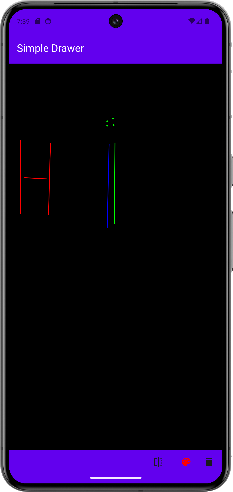
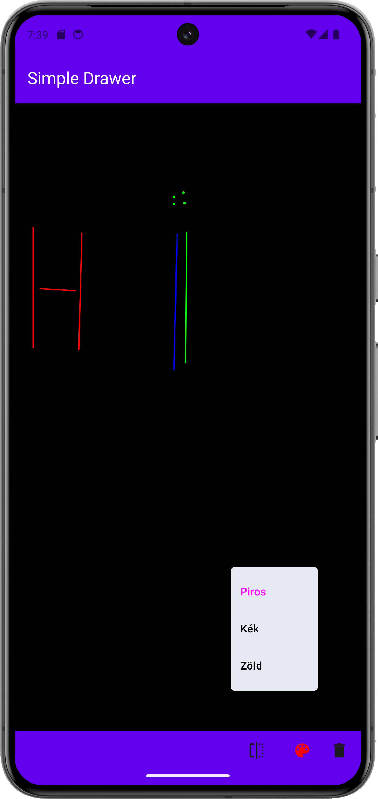
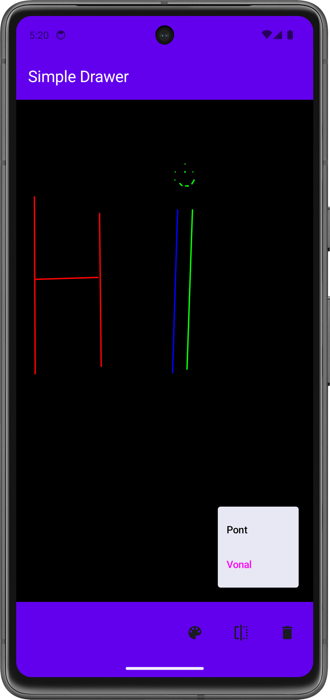

# Labor 05 - SQLite - Rajzoló alkalmazás

## Bevezető

A labor során egy egyszerű rajzoló alkalmazás elkészítése a feladat. Az alkalmazással egy vászonra lehet vonalakat vagy pontokat rajzolni, majd a rajzolt ábrát perzisztensen elmenteni, hogy az alkalmazás újraindítása után is visszatöltődjön.

<p align="center">




</p>

!!!info "Room könyvtár"
    A labor során meg fogunk ismerkedni az SQLite könyvtárral, mellyel egy lokális SQL adatbázisban tudunk adatokat perszisztensen tárolni. A modern Android alapú fejlesztéseknél már általában a Room-ot használják, mely az SQLite-ra építve biztosít egy könnyen használható ORM réteget az Android életciklusokkal kombinálva. Fontosnak tartottuk viszont, hogy könnyen érthető legyen az anyag, ezért most csak az SQLite-os megoldást fogjuk vizsgálni.

!!! warning "IMSc"
	A laborfeladatok sikeres befejezése után az IMSc feladat-ot megoldva 2 IMSc pont szerezhető.


## Előkészületek

A feladatok megoldása során ne felejtsd el követni a [feladat beadás folyamatát](../../tudnivalok/github/GitHub.md).

### Git repository létrehozása és letöltése

1. Moodle-ben keresd meg a laborhoz tartozó meghívó URL-jét és annak segítségével hozd létre a saját repository-dat.

2. Várd meg, míg elkészül a repository, majd checkout-old ki.

    !!! tip ""
        Egyetemi laborokban, ha a checkout során nem kér a rendszer felhasználónevet és jelszót, és nem sikerül a checkout, akkor valószínűleg a gépen korábban megjegyzett felhasználónévvel próbálkozott a rendszer. Először töröld ki a mentett belépési adatokat (lásd [itt](../../tudnivalok/github/GitHub-credentials.md)), és próbáld újra.

3. Hozz létre egy új ágat `megoldas` néven, és ezen az ágon dolgozz.

4. A `neptun.txt` fájlba írd bele a Neptun kódodat. A fájlban semmi más ne szerepeljen, csak egyetlen sorban a Neptun kód 6 karaktere.


## A projekt előkészítése

### A projekt létrehozása

Hozzunk létre egy `Simple Drawer` nevű projektet Android Studioban:

1. Hozzunk létre egy új projektet, válasszuk az *Empty Activity* lehetőséget.
1. A projekt neve legyen `Simple Drawer`, a kezdő package `hu.bme.aut.android.simpledrawer`, a mentési hely pedig a kicheckoutolt repository-n belül az SimpleDrawer mappa.
1. Nyelvnek válasszuk a *Kotlin*-t.
1. A minimum API szint legyen API24: Android 7.0.
1. A *Build configuration language* Kotlin DSL legyen.

!!!danger "FILE PATH"
	A projekt a repository-ban lévő SimpleDrawer könyvtárba kerüljön, és beadásnál legyen is felpusholva! A kód nélkül nem tudunk maximális pontot adni a laborra!

A labor során az alábbi technológiákkal fogunk találkozni:

- SQLite
- Scaffold
    - TopBar
    - BottomBar
- ViewModel
- Dialog


### A resource-ok hozzáadása

Először töltsük le [az alkalmazás képeit tartalmazó tömörített fájlt](./downloads/res.zip), ami tartalmazza az összes képet, amire szükségünk lesz. A tartalmát másoljuk be az `app/src/main/res` mappába (ehhez segít, ha _Android Studio_-ban bal fent a szokásos _Android_ nézetről a _Project_ nézetre váltunk erre az időre).

Az alábbi, alkalmazáshoz szükséges _string resource_-okat másoljuk be a `res/values/strings.xml` fájlba:

```xml
<resources>
    <string name="app_name">Simple Drawer</string>

    <string name="style">Stílus</string>
    <string name="line">Vonal</string>
    <string name="point">Pont</string>

    <string name="color">Szín</string>
    <string name="red">Piros</string>
    <string name="green">Zöld</string>
    <string name="blue">Kék</string>
    
    <string name="clear">Törlés</string>

    <string name="are_you_sure_want_to_clear">Biztosan törölni akarod a rajzlapot?</string>
    <string name="ok">OK</string>
    <string name="cancel">Mégse</string>
</resources>
```

## A kezdő képernyő létrehozása (1 pont)

### Álló layout kikényszerítése

Az alkalmazásunkban az egyszerűség kedvéért most csak az álló módot támogatjuk. Ehhez az `AndroidManifest.xml`-ben az `<activity>` tagen belül módosítsuk az alábbiakat:

```xml
<activity
    android:name=".MainActivity"
    android:exported="true"
    android:label="@string/app_name"
    android:screenOrientation="sensorPortrait"
    android:theme="@style/Theme.SimpleDrawer">
    <intent-filter>
        <action android:name="android.intent.action.MAIN" />

        <category android:name="android.intent.category.LAUNCHER" />
    </intent-filter>
</activity>
```


### AppBar-ok létrehozása

A már létező `ui` *package*-en belül hozzunk létre egy `view` *package*-et, ezen belül egy `TopBar` és egy `BottomBar` *Kotlin File*-t, majd írjuk bele a következőt:

`TopBar.kt`:

```kotlin
package hu.bme.aut.android.simpledrawer.ui.view

import androidx.compose.material3.ExperimentalMaterial3Api
import androidx.compose.material3.Text
import androidx.compose.material3.TopAppBar
import androidx.compose.material3.TopAppBarDefaults
import androidx.compose.runtime.Composable
import androidx.compose.ui.graphics.Color
import androidx.compose.ui.res.stringResource
import androidx.compose.ui.tooling.preview.Preview
import hu.bme.aut.android.simpledrawer.R

@OptIn(ExperimentalMaterial3Api::class)
@Composable
fun TopBar() {
    TopAppBar(
        title = {
            Text(
                text = stringResource(id = R.string.app_name),
                color = Color.White
            )
        },
        colors = TopAppBarDefaults.topAppBarColors(containerColor = Color(0xFF6200EE))
    )
}

@Composable
@Preview
fun PreviewTopBar() {
    TopBar()
}
```
Ez csak egy egyszerű TopBar aminek a tetejére kiírhatjuk az alkalmazás nevét. A BottomBar kicsit összetettebb lesz ennél.

`BottomBar.kt`:

```kotlin
package hu.bme.aut.android.simpledrawer.ui.view

import androidx.compose.foundation.layout.Arrangement
import androidx.compose.foundation.layout.Row
import androidx.compose.foundation.layout.fillMaxSize
import androidx.compose.foundation.layout.height
import androidx.compose.foundation.layout.size
import androidx.compose.material3.BottomAppBar
import androidx.compose.material3.Icon
import androidx.compose.material3.IconButton
import androidx.compose.runtime.Composable
import androidx.compose.ui.Alignment
import androidx.compose.ui.Modifier
import androidx.compose.ui.graphics.Color
import androidx.compose.ui.res.painterResource
import androidx.compose.ui.res.stringResource
import androidx.compose.ui.tooling.preview.Preview
import androidx.compose.ui.unit.dp
import hu.bme.aut.android.simpledrawer.R

@Composable
fun BottomBar() {
    BottomAppBar(
        actions = {
            Row(
                modifier = Modifier
                    .fillMaxSize(),
                horizontalArrangement = Arrangement.End,
                verticalAlignment = Alignment.CenterVertically
            ) {
                IconButton(
                    onClick = { /*TODO*/ },
                    modifier = Modifier.size(64.dp)
                ) {
                    Icon(
                        painterResource(id = R.drawable.ic_style),
                        contentDescription = stringResource(id = R.string.style)
                    )
                    //Stílusok
                }
            }
        },
        containerColor = Color(0xFF6200EE),
    )
}

@Composable
@Preview
fun PreviewBottomBar() {
    BottomBar()
}
```

A BottomBar már kicsit összetettebb, itt az `actions` paraméterrel át tudunk adni olyan composable elemeket, amik megjelennek majd kis iconként az AppBar-on, ezekhez később akár onClick eseményt is tudunk adni. Így fogjuk megvalósítani a stílusváltás opciót, amelynek a megnyomására egy ablak ugrik fel, amin ki lehet választani a kívánt stílust (Vonal, pont)

### A DrawingScreen felület

A `ui` *package*-en belül hozzunk létre egy `screen` *package*-t. Ebbe fog kerülni a `DrawingScreen`-ünk. Itt fogjuk elhelyezni a *Scaffold*-ot, aminek a segítségével egy TopBar-t és egy BottomBar-t is megvalósítunk. Kezdetben a Scaffold tartalma csak egy fekete `Spacer` lesz, ezt később a `Canvas` fogja helyettesíteni.

```kotlin
package hu.bme.aut.android.simpledrawer.ui.screen

import androidx.compose.foundation.background
import androidx.compose.foundation.layout.Spacer
import androidx.compose.foundation.layout.fillMaxSize
import androidx.compose.foundation.layout.padding
import androidx.compose.material3.Scaffold
import androidx.compose.runtime.Composable
import androidx.compose.ui.Modifier
import androidx.compose.ui.graphics.Color
import androidx.compose.ui.tooling.preview.Preview
import hu.bme.aut.android.simpledrawer.ui.view.BottomBar
import hu.bme.aut.android.simpledrawer.ui.view.TopBar

@Composable
fun DrawingScreen() {

    Scaffold(
        topBar = {
            TopBar()
        },
        bottomBar = {
            BottomBar()
        }
    ) { innerPadding ->
        //TODO replace with canvas
        Spacer(
            modifier = Modifier
                .background(Color.Black)
                .padding(innerPadding)
                .fillMaxSize()
        )
    }
}

@Composable
@Preview
fun PreviewDrawingScreen() {
    DrawingScreen()
}
```

Végül írjuk át a `MainActivity.kt` kódját, úgy hogy az imént létrehozott `DrawingScreent` példányosítsa:

```kotlin
package hu.bme.aut.android.simpledrawer

import android.os.Bundle
import androidx.activity.ComponentActivity
import androidx.activity.compose.setContent
import androidx.activity.enableEdgeToEdge
import hu.bme.aut.android.simpledrawer.ui.screen.DrawingScreen
import hu.bme.aut.android.simpledrawer.ui.theme.SimpleDrawerTheme

class MainActivity : ComponentActivity() {
    override fun onCreate(savedInstanceState: Bundle?) {
        super.onCreate(savedInstanceState)
        enableEdgeToEdge()
        setContent {
            SimpleDrawerTheme {
                DrawingScreen()
            }
        }
    }
}
```

Hogy ha ezzel is megvagyunk indítsuk el az alkalmazást! Most már látjuk a két AppBar-t illetve a közötte elhelyezkedő fekete képernyőt. A BottomBar-on feltűnik egy icon is, aminek a megnyomása még semmit nem csinál.

!!!example "BEADANDÓ (1 pont)"
	Készíts egy **képernyőképet**, amelyen látszik az **elkészült kezdőképernyő** (emulátoron, készüléket tükrözve vagy képernyőfelvétellel), egy **ahhoz tartozó kódrészlet**, valamint a **neptun kódod a kódban valahol kommentként**' A képet a megoldásban a repository-ba f1.png néven töltsd föl!

	A képernyőkép szükséges feltétele a pontszám megszerzésének.


## A stílusválasztó megvalósítása (1 pont)

Most, hogy már létre van hozva a BottomBar, illetve a kezdőképernyő váza, valósítsuk meg a stílus választást is. Ehhez módosítanunk kell a `BottomBar`-t, úgy, hogy ha a Stílus választó gombra kattintunk, akkor megjelenjen egy menü, amin ki lehet választani a rajzmódot. Ez a mód a rajzolás egy állapotaként valósítható meg. Ezeket az állapotokat pedig a korábbi laborokon látottak szerint egy külön *viewModel*-ben tároljuk. 

### Szükséges függőség hozzáadása

A *viewModel* használatához fel kell vennünk egy függőséget a `build.gradles.kts` fájlba. Ehhez nyissuk meg a `libs.versions.toml` fájlt a `gradle` *package*-ben, majd írjuk bele a következőt:

```toml
[versions]
...
lifecycleCompose = "2.8.6"

[libraries]
...
androidx-lifecycle-compose = {group = "androidx.lifecycle", name = "lifecycle-viewmodel-compose", version.ref = "lifecycleCompose" }
```
Ezután frissítsük a `build.gradle.kts`-t is:
```kts
dependencies{
    ...
    implementation(libs.androidx.lifecycle.compose)
}
```

A függőség felvétele után ne felejtsünk el rányomni a `Sync Now` gombra.


### ViewModel létrehozás

Hozzuk tehát a *viewModel*-ünket. Ez segítésget fog nyújtani a szín/stílus váltásban, és később a perzisztens adattárolásban.

Hozzunk létre a `screen` *package*-be a `DrawingScreen` mellé egy `DrawingViewModel` *Kotlin Filet* majd írjuk bele a következő kódot:

```kotlin
package hu.bme.aut.android.simpledrawer.ui.screen

import android.app.Application
import androidx.lifecycle.AndroidViewModel
import androidx.lifecycle.viewModelScope
import kotlinx.coroutines.flow.MutableStateFlow
import kotlinx.coroutines.flow.StateFlow
import kotlinx.coroutines.launch

class DrawingViewModel(application: Application): AndroidViewModel(application){

    private val _drawingMode = MutableStateFlow(DrawingMode.LINE)
    val drawingMode: StateFlow<DrawingMode> = _drawingMode


    private val _drawElements = MutableStateFlow<List<Any>>(emptyList())
    val drawElements: StateFlow<List<Any>> = _drawElements


    fun setDrawingMode(mode: DrawingMode){
        viewModelScope.launch {
            _drawingMode.value = mode
        }
    }

    fun addDrawElement(element: Any) {
        viewModelScope.launch {
            _drawElements.value += element
        }
    }
}

enum class DrawingMode{
    LINE,
    POINT
}
```


Az viewModel-hez szükségünk van még egy osztályra a `DrawingMode`-ra. Ezzel tudjuk majd állítani a rajz stílust.

!!!warning "Kód értelmezése"
    A laborvezető segítségével értelmezzük a viewModel kódját!

Most, hogy megvan a *viewModel*-ünk, már csak a `BottomBar`-t kell módosítani, hogy be tudjuk állítani az állapotot.


### Stílusválasztó

Módosítsuk a `BottomBar`-t, úgy, hogy ha a Stílus választó gombra kattintunk, akkor megjelenjen egy ablak, amin ki lehet választani a rajzmódot. Ezt a következő képpen tehetjük meg:

```kotlin
@Composable
fun BottomBar(
    viewModel: DrawingViewModel = viewModel()
){
    var showStyle by remember { mutableStateOf(false) }
    val drawingMode by viewModel.drawingMode.collectAsState()

    BottomAppBar(
        ...
        actions = {
            Row (
                ...
            ){
                IconButton(
                    onClick = { showStyle = !showStyle },
                    modifier = Modifier.size(64.dp)
                ) {
                    Icon(
                        painterResource(id = R.drawable.ic_style),
                        contentDescription = stringResource(id = R.string.style)
                    )
                    DropdownMenu(
                        expanded = showStyle,
                        onDismissRequest = { showStyle = false}) {
                        DropdownMenuItem(
                            text = { Text(
                                stringResource(id = R.string.point),
                                color = if (drawingMode == DrawingMode.POINT) Color.Magenta else Color.Black
                            ) },
                            onClick = {
                                viewModel.setDrawingMode(DrawingMode.POINT)
                                showStyle = false
                            }
                        )
                        DropdownMenuItem(
                            text = { Text(
                                stringResource(id = R.string.line),
                                color = if (drawingMode == DrawingMode.LINE) Color.Magenta else Color.Black)
                            },
                            onClick = {
                                viewModel.setDrawingMode(DrawingMode.LINE)
                                showStyle = false
                            }
                        )
                    }
                }
                ...
            }
        },
        ...
    )
}
```

!!!warning "viewModel"
    Sokszor az Android Studio nem tudja megtalálni a `viewModel()`-hez szükséges importot. Ilyenkor kézileg írjuk az importokhoz az alábbi importot:
    ```kotlin
    import androidx.lifecycle.viewmodel.compose.viewModel
    ```

Ezután módosítsuk a `DrawingScreen`-en a `BottomBar` függvény hívást, és vegyük hozzá a viewModel paramétert.

```kotlin
package hu.bme.aut.android.simpledrawer.ui.screen

import android.app.Application
import androidx.compose.foundation.background
import androidx.compose.foundation.layout.Spacer
import androidx.compose.foundation.layout.fillMaxSize
import androidx.compose.foundation.layout.padding
import androidx.compose.material3.Scaffold
import androidx.compose.runtime.Composable
import androidx.compose.ui.Modifier
import androidx.compose.ui.graphics.Color
import androidx.compose.ui.platform.LocalContext
import androidx.compose.ui.tooling.preview.Preview
import androidx.lifecycle.ViewModelProvider
import androidx.lifecycle.viewmodel.compose.viewModel
import hu.bme.aut.android.simpledrawer.ui.view.BottomBar
import hu.bme.aut.android.simpledrawer.ui.view.TopBar

@Composable
fun DrawingScreen() {
    val viewModel: DrawingViewModel = viewModel(
        factory = ViewModelProvider.AndroidViewModelFactory(
            LocalContext.current.applicationContext as Application
        )
    )
    Scaffold(
        topBar = {
            TopBar()
        },
        bottomBar = {
            BottomBar(viewModel = viewModel)
        }
    ) { innerPadding ->
        //TODO replace with canvas
        Spacer(
            modifier = Modifier
                .background(Color.Black)
                .padding(innerPadding)
                .fillMaxSize()
        )
    }
}

@Composable
@Preview
fun PreviewDrawingScreen() {
    DrawingScreen()
}
```

!!!example "BEADANDÓ (1 pont)"
	Készíts egy **képernyőképet**, amelyen látszik az **elkészült Stílusválasztó kinyitva** (emulátoron, készüléket tükrözve vagy képernyőfelvétellel), egy **ahhoz tartozó kódrészlet**, valamint a **neptun kódod a kódban valahol kommentként**! A képet a megoldásban a repository-ba f2.png néven töltsd föl!

	A képernyőkép szükséges feltétele a pontszám megszerzésének.


## A canvas megvalósítása (1 pont)

A rajzolás folyamán pontokat és vonalakat szeretnénk rajzolni. Ezek kezeléséhez hozzunk létre két data class-t `Line` és `Point` néven. Hozzunk létre egy `model` *package*-et a fő *package*-ünkben, majd implementáljuk a két osztályt:

`Point.kt`:

```kotlin
package hu.bme.aut.android.simpledrawer.ui.model

import androidx.compose.ui.graphics.Color

data class Point(
    var x: Float = 0F,
    var y: Float = 0F,
    var color: Color = Color.Yellow
)
```

`Line.kt`:

```kotlin
package hu.bme.aut.android.simpledrawer.ui.model

import androidx.compose.ui.graphics.Color

data class Line(
    var start: Point,
    var end: Point,
    var color: Color = Color.Yellow
)
```

Ilyen formában fogjuk tárolni az adatunkat a listában. Igaz, hogy a `Line` data class még kétszer megkapja a színt, de ez csak az egyszerűség kedvéért lesz így, ezzel a paraméterrel nem fogunk foglalkozni.

Ezután a `view` *package*-en belül hozzunk létre egy `DrawingCanvas` *Kotolin File-t*. Ebben a Composable osztályban a beépített `Canvas` *Composable* segítségével fogjuk a rajzolást megvalósítani. Ennek az osztálynak van egy `Modifier.pointerInteropFilter` paramétere, aminek a segítségével fogjuk a gesztusokat lekezelni.

```kotlin
package hu.bme.aut.android.simpledrawer.ui.view

import androidx.compose.foundation.Canvas
import androidx.compose.foundation.background
import androidx.compose.runtime.Composable
import androidx.compose.runtime.getValue
import androidx.compose.runtime.mutableStateOf
import androidx.compose.runtime.remember
import androidx.compose.runtime.setValue
import androidx.compose.ui.ExperimentalComposeUiApi
import androidx.compose.ui.Modifier
import androidx.compose.ui.geometry.Offset
import androidx.compose.ui.graphics.Color
import androidx.compose.ui.input.pointer.pointerInteropFilter
import hu.bme.aut.android.simpledrawer.ui.screen.DrawingMode
import hu.bme.aut.android.simpledrawer.ui.screen.DrawingViewModel

@OptIn(ExperimentalComposeUiApi::class)
@Composable
fun DrawingCanvas(
    modifier: Modifier = Modifier,
    currentColor: Color = Color.Red,
    drawingMode: DrawingMode,
    viewModel: DrawingViewModel,
    drawElements: List<Any>
) {
    var startPoint by remember { mutableStateOf<Offset?>(null) }
    var endPoint by remember { mutableStateOf<Offset?>(null) }
    var tempPoint by remember { mutableStateOf<Offset?>(null) }

    Canvas(
        modifier = modifier
            .background(Color.Black)
            .pointerInteropFilter { event ->
                when (event.action) {
                    /*TODO*/
                    //ACTION_DOWN

                    //ACTION_MOVE

                    //ACTION_UP
                }
                true
            }
    ) {

        //TODO drawElements
        
    }
}
```

Az `event.action`-ön belül kezelni fogjuk a `MotionEvent.ACTION_DOWN`, `MotionEvent.ACTION_MOVE`, `MotionEvent.ACTION_UP` eventeket, valamint a `Canvas`-re rajzolást is.

`ACTION_DOWN`:

```kotlin
MotionEvent.ACTION_DOWN -> {
    startPoint = Offset(event.x, event.y)
    tempPoint = startPoint
}
```
Ez az esemény akkor következik be, amikor az ujjunkat a képernyőre ráhelyezzük. Ilyenkor elmentjük ezt a paramétert, egy `startPoint` váltózóba.

`ACTION_MOVE`:

```kotlin
MotionEvent.ACTION_MOVE -> {
    tempPoint = Offset(event.x, event.y)
    if (drawingMode == DrawingMode.LINE) {
        endPoint = tempPoint
    }
}
```
Miután lehelyezük az ujjunkat, tudjuk mozgatni is. Ilyenkor következik be ez az esemény. Itt két részre bontódik a folyamat, ugyanis, hogy ha pont-ot rajzolunk és mozgatjuk az ujjunkat, akkor a pontot az utolsó pozícióra szeretnénk helyezni, így a `tempPoint`-ba írjuk bele a pozíciót. Hogy ha vonalat rajzolunk, akkor az `endPoint`-ba kell beleírnunk a pozíciót.

`ACTION_UP`:

```kotlin
MotionEvent.ACTION_UP -> {
    if (drawingMode == DrawingMode.POINT) {
        tempPoint?.let {
            viewModel.addDrawElement(Point(it.x, it.y, currentColor))
        }
    } else if (drawingMode == DrawingMode.LINE) {
        endPoint?.let {
            startPoint?.let { start ->
                viewModel.addDrawElement(
                    Line(
                        Point(start.x, start.y, currentColor),
                        Point(it.x, it.y, currentColor),
                        currentColor
                    )
                )
            }
        }

    }
    startPoint = null
    endPoint = null
    tempPoint = null
}
```

Ennél az eseménynél már azt kezeljük mikor a felhasználó felemelte az újját a képernyőről. Itt is két lehetőségre bomlik az algoritmus, ugyanis, hogy ha pontról van szó, akkor csak a `tempPoint` értékét kell rögzíteni. Azonban, ha már vonalról, akkor az `endPoint` illetve a `startPoint` értékeit kell rögzíteni vonalként. **Mindkét eseménynél szükséges a null ellenőrzés**!


Miután az események megvannak, már csak a kirajzolást kell megoldani. Ezt úgy tehetjük meg, hogy a drawElements-be eltárolt adatokat egyesével kirajzoljuk típusuktól függően:

```kotlin
Canvas (..){
    drawElements.forEach { element ->
        when (element) {
            is Point -> drawCircle(color = element.color, center = Offset(element.x, element.y), radius = 5f)
            is Line -> drawLine(color = element.color, start = Offset(element.start.x, element.start.y), end = Offset(element.end.x, element.end.y), strokeWidth = 5f)
        }
    }
    ...
}
```
Ezzel kész is van a `DrawingCanvas`, azonban így még nem látjuk a rajzot, csak ha az ujjunkat felemeltük a kijelzőről. Ezt a következő képpen lehet javítani:

```kotlin
Canvas (..){
    ...
    tempPoint?.let {
        if (drawingMode == DrawingMode.POINT) {
            drawCircle(color = currentColor, center = it, radius = 5f)
        } else if (drawingMode == DrawingMode.LINE && startPoint != null) {
            drawLine(color = currentColor, start = startPoint!!, end = it, strokeWidth = 5f)
        }
    }
}
```
Ebben az esetben kirajzoljuk azt az elemet aminek a kezdőpontja az a pont ahol lehelyeztük az ujjunkat, a végpontja pedig az ahol az ujjunk van. Ha ezt mozgatjuk akkor valós időben frissülni fog, így láthatjuk előre a végeredményt.

Ezután módosítsuk a `DrawingScreen`-t és cseréljük le a `Spacer`-t az imént elkészített `DrawingCanvas`-re.

```kotlin
@Composable
fun DrawingScreen() {
    val viewModel: DrawingViewModel = viewModel(
        factory = ViewModelProvider.AndroidViewModelFactory(
            LocalContext.current.applicationContext as Application
        )
    )
    val drawingMode by viewModel.drawingMode.collectAsState()
    val drawElements by viewModel.drawElements.collectAsState()
    Scaffold(
        ...
    ) { innerPadding ->
        DrawingCanvas(
            modifier = Modifier
                .padding(innerPadding)
                .fillMaxSize(),
            drawingMode = drawingMode,
            viewModel = viewModel,
            drawElements = drawElements
        )
    }
}
```

!!!example "BEADANDÓ (1 pont)"
	Készíts egy **képernyőképet**, amelyen látszik az **elkészült DrawingScreen** (emulátoron, készüléket tükrözve vagy képernyőfelvétellel) pár vonallal és ponttal, **a DrawingCanvas egy kódrészlete**, valamint a **neptun kódod a kódban valahol kommentként**! A képet a megoldásban a repository-ba f3.png néven töltsd föl!

	A képernyőkép szükséges feltétele a pontszám megszerzésének.


## Perzisztencia megvalósítása *SQLite* adatbázis segítségével (1 pont)

Ahhoz, hogy az általunk rajzolt objektumok megmaradjanak az alkalmazásból való kilépés után is, az adatainkat valahogy olyan formába kell rendeznünk, hogy azt könnyedén el tudjuk tárolni egy *SQLite* adatbázisban.

Hozzunk létre egy új package-et az `hu.bme.aut.android.simpledrawer`-en belül, aminek adjuk az `sqlite` nevet.

### Táblák definiálása

Az adatbáziskezelés során sok konstans jellegű változóval kell dolgoznunk, mint például a táblákban lévő oszlopok nevei, táblák neve, adatbázis fájl neve, séma létrehozó és törlő szkiptek, stb. Ezeket érdemes egy közös helyen tárolni, így szerkesztéskor vagy új entitás bevezetésekor nem kell a forrásfájlok között ugrálni, valamint egyszerűbb a teljes adatbázist létrehozó és törlő szkripteket generálni. Hozzunk létre egy új singleton osztályt az `object` kulcsszóval az `sqlite` package-en belül `DbConstants` néven.

Ezen belül először is konstansként felvesszük az adatbázis nevét és verzióját is. Ha az adatbázisunk sémáján szeretnénk változtatni, akkor ez utóbbit kell inkrementálnunk, így elkerülhetjük az inkompatibilitás miatti nem kívánatos hibákat.

```kotlin
package hu.bme.aut.android.simpledrawer.sqlite

object DbConstants{

    const val DATABASE_NAME = "simpledrawer.db"
    const val DATABASE_VERSION = 1

    //Points
    
    //Lines
}
```
Ezek után a `DbConstants` nevű osztályba hozzuk létre a `Point` osztályhoz a konstansokat. Az osztályokon belül létrehozunk egy `enum`-ot is, hogy könnyebben tudjuk kezelni a tábla oszlopait, majd konstansokban eltároljuk a tábla létrehozását szolgáló SQL utasítást valamint a tábla nevét is. Végezetül elkészítjük azokat a függvényeket, amelyeket a tábla létrehozásakor, illetve upgrade-elésekor kell meghívni:

```kotlin
object Points {
    const val DATABASE_TABLE = "points"

    enum class Columns {
        ID, COORD_X, COORD_Y
    }

    private val DATABASE_CREATE = """create table if not exists $DATABASE_TABLE (
        ${Columns.ID.name} integer primary key autoincrement,
        ${Columns.COORD_X.name} real not null,
        ${Columns.COORD_Y.name} real not null
        );"""

    private const val DATABASE_DROP = "drop table if exists $DATABASE_TABLE;"

    fun onCreate(database: SQLiteDatabase) {
        database.execSQL(DATABASE_CREATE)
    }

    fun onUpgrade(database: SQLiteDatabase, oldVersion: Int, newVersion: Int) {
        database.execSQL(DATABASE_DROP)
        onCreate(database)
    }
}
```

Figyeljük meg, hogy a `DbConstants` osztályon belül létrehoztunk egy belső `Points` nevű osztályt, amiben a `Points` entitásokat tároló táblához tartozó konstans értékeket tároljuk. Amennyiben az alkalmazásunk több entitást is adatbázisban tárol, akkor érdemes az egyes osztályokhoz tartozó konstansokat külön-külön belső osztályokban tárolni. Így sokkal átláthatóbb és karbantarthatóbb lesz a kód, mint ha ömlesztve felvennénk a DbConstants-ba az összes tábla összes konstansát. Ezek a belső osztályok praktikusan ugyanolyan névvel léteznek, mint az entitás osztályok. Vegyük tehát fel hasonló módon a `Lines` nevű osztályt is:

```kotlin
object Lines {
    const val DATABASE_TABLE = "lines"

    enum class Columns {
        ID, START_X, START_Y, END_X, END_Y
    }

    private val DATABASE_CREATE = """create table if not exists $DATABASE_TABLE (
        ${Columns.ID.name} integer primary key autoincrement,
        ${Columns.START_X.name} real not null,
        ${Columns.START_Y.name} real not null,
        ${Columns.END_X.name} real not null,
        ${Columns.END_Y.name} real not null
        );"""

    private const val DATABASE_DROP = "drop table if exists $DATABASE_TABLE;"

    fun onCreate(database: SQLiteDatabase) {
        database.execSQL(DATABASE_CREATE)
    }

    fun onUpgrade(database: SQLiteDatabase, oldVersion: Int, newVersion: Int) {
        database.execSQL(DATABASE_DROP)
        onCreate(database)
    }
}
```

Érdemes megfigyelni továbbá azt is, hogy az osztályokat nem a class kulcsszóval deklaráltuk. Helyette az `object`-et használjuk, amivel a Kotlin nyelv azt biztosítja számunkra, hogy a `DbConstants` és a benne lévő `Points` és `Lines` osztály is singletonként viselkednek, azaz az alkalmazás futtatásakor létrejön belőlük egy példány, további példányokat pedig nem lehet létrehozni belőlük.

### A segédosztály létrehozása
Az adatbázis létrehozásához szükség van egy olyan segédosztályra, ami létrehozza magát az adatbázist, és azon belül inicializálja a táblákat is. Esetünkben ez lesz a `DbHelper` osztály, ami az `SQLiteOpenHelper` osztályból származik. Vegyük fel ezt is az `sqlite` package-be.

```kotlin
package hu.bme.aut.android.simpledrawer.sqlite

import android.content.Context
import android.database.sqlite.SQLiteDatabase
import android.database.sqlite.SQLiteOpenHelper

class DbHelper(context: Context):
    SQLiteOpenHelper(context, DbConstants.DATABASE_NAME, null, DbConstants.DATABASE_VERSION) {

    override fun onCreate(sqLiteDatabase: SQLiteDatabase) {
        DbConstants.Lines.onCreate(sqLiteDatabase)
        DbConstants.Points.onCreate(sqLiteDatabase)
    }

    override fun onUpgrade(
        sqLiteDatabase: SQLiteDatabase,
        oldVersion: Int,
        newVersion: Int
    ) {
        DbConstants.Lines.onUpgrade(sqLiteDatabase, oldVersion, newVersion)
        DbConstants.Points.onUpgrade(sqLiteDatabase, oldVersion, newVersion)
    }
}
```

Ezen kívül szükségünk van még egy olyan segédosztályra is, ami ezt az egészet összefogja, és amivel egyszerűen tudjuk kezelni az adatbázisunkat. Ez lesz a `PersistentDataHelper` továbbra is az `sqlite` package-ben. Ebben olyan függényeket fogunk megvalósítani, mint pl. az `open()` és a `close()`, amikkel az adatbáziskapcsolatot nyithatjuk meg, illetve zárhatjuk le. Ezen kívül ebben az osztályban valósítjuk meg azokat a függvényeket is, amik az adatok adatbázisba való kiírásáért, illetve az onnan való kiolvasásáért felelősek. Figyeljünk rá, hogy a saját Point osztályunkat válasszuk az import során.

```kotlin
package hu.bme.aut.android.simpledrawer.sqlite

import android.content.Context
import android.database.sqlite.SQLiteDatabase
import android.database.sqlite.SQLiteException

class PersistentDataHelper(context: Context) {
    private var database: SQLiteDatabase? = null
    private val dbHelper: DbHelper = DbHelper(context)


    private val pointColumns = arrayOf(
        DbConstants.Points.Columns.ID.name,
        DbConstants.Points.Columns.COORD_X.name,
        DbConstants.Points.Columns.COORD_Y.name,
    )

    private val lineColumns = arrayOf(
        DbConstants.Lines.Columns.ID.name,
        DbConstants.Lines.Columns.START_X.name,
        DbConstants.Lines.Columns.START_Y.name,
        DbConstants.Lines.Columns.END_X.name,
        DbConstants.Lines.Columns.END_Y.name,
    )


    @Throws(SQLiteException::class)
    fun open() {
        database = dbHelper.writableDatabase
    }

    fun close() {
        dbHelper.close()
    }

    //PersistPoints


    //RestorePoints


    //ClearPoints


    //CursorToPoint


    //PersistLines


    //RestoreLines


    //ClearLines


    //CursorToLine

}
```

Egészítsük ki a `PersistentDataHelper` osztályt az alábbiak szerint:

1.   PersistPoints: Itt kell megvalósítanunk a pontok eltárolását. Elsősorban ürítjük az adatbázist, utána pedig a kapott Lista paraméteren végigmegyünk és egyesével elmentjük a pontokat.
1.   RestorePoints: Itt kell megvalósítanunk a pontok betöltését. Ehhez egy ideiglenes MutableList-et használunk, amelyhez hozzáadjuk a kiolvasott pontokat.
1.   ClearPoints: Ezzel a függvénnyel érjük el hogy az adatbázisból töröljük a Points táblát.
1.   CursorToPoint: Ezzel a függvénnyel olvasunk ki egyetlen pontnak az adatát az adatbázisból.
1.   PersistLines: Itt kell megvalósítanunk a vonalak eltárolását. Elsősorban ürítjük az adatbázist, utána pedig a kapott Lista paraméteren végigmegyünk és egyesével elmentjük a vonalakat.
1.   RestoreLines: Itt kell megvalósítanunk a vonalak betöltését. Ehhez egy ideiglenes MutableList-et használunk, amelyhez hozzáadjuk a kiolvasott vonalakat.
1.   ClearLines: Ezzel a függvénnyel érjük el hogy az adatbázisból töröljük a Lines táblát.
1.   CursorToLine: Ezzel a függvénnyel olvasunk ki egyetlen vonalnak adatát az adatbázisból.

**1. PersistPoints**
```kotlin
fun persistPoints(points: List<Point>) {
    clearPoints()
    for (point in points) {
        val values = ContentValues()
        values.put(DbConstants.Points.Columns.COORD_X.name, point.x)
        values.put(DbConstants.Points.Columns.COORD_Y.name, point.y)
        database!!.insert(DbConstants.Points.DATABASE_TABLE, null, values)
    }
}
```
**2. RestorePoints**
```kotlin
fun restorePoints(): MutableList<Point> {
    val points: MutableList<Point> = ArrayList()
    val cursor = database!!.query(
        DbConstants.Points.DATABASE_TABLE,
        pointColumns,
        null,
        null,
        null,
        null,
        null
    )
    cursor.moveToFirst()
    while (!cursor.isAfterLast) {
        val point: Point = cursorToPoint(cursor)
        points.add(point)
        cursor.moveToNext()
    }
    cursor.close()
    return points
}
```

**3. ClearPoints**
```kotlin
fun clearPoints() {
    database!!.delete(DbConstants.Points.DATABASE_TABLE, null, null)
}
```

**4. CursorToPoints**
```kotlin
private fun cursorToPoint(cursor: Cursor): Point {
    val point = Point(
        cursor.getFloat(DbConstants.Points.Columns.COORD_X.ordinal),
        cursor.getFloat(DbConstants.Points.Columns.COORD_Y.ordinal),
        Color(Color.Red.toArgb())
    )
    return point
}
```

**5. PersistLines**
```kotlin
fun persistLines(lines: List<Line>) {
    clearLines()
    for (line in lines) {
        val values = ContentValues()
        values.put(DbConstants.Lines.Columns.START_X.name, line.start.x)
        values.put(DbConstants.Lines.Columns.START_Y.name, line.start.y)
        values.put(DbConstants.Lines.Columns.END_X.name, line.end.x)
        values.put(DbConstants.Lines.Columns.END_Y.name, line.end.y)
        database!!.insert(DbConstants.Lines.DATABASE_TABLE, null, values)
    }
}
```
**6. RestoreLines**
```kotlin
fun restoreLines(): MutableList<Line> {
    val lines: MutableList<Line> = ArrayList()
    val cursor = database!!.query(
        DbConstants.Lines.DATABASE_TABLE,
        lineColumns,
        null,
        null,
        null,
        null,
        null
    )
    cursor.moveToFirst()
    while (!cursor.isAfterLast) {
        val line: Line = cursorToLine(cursor)
        lines.add(line)
        cursor.moveToNext()
    }
    cursor.close()
    return lines
}
```

**7. ClearLines**
```kotlin
fun clearLines() {
    database!!.delete(DbConstants.Lines.DATABASE_TABLE, null, null)
}
```

**8. CursorToLine**
```kotlin
private fun cursorToLine(cursor: Cursor): Line {
    val line = Line(
        Point(
            cursor.getFloat(DbConstants.Lines.Columns.START_X.ordinal),
            cursor.getFloat(DbConstants.Lines.Columns.START_Y.ordinal)
        ),
        Point(
            cursor.getFloat(DbConstants.Lines.Columns.END_X.ordinal),
            cursor.getFloat(DbConstants.Lines.Columns.END_Y.ordinal)
        ),
        Color(Color.Red.toArgb())
    )
    return line
}
```


### ViewModel kiegészítése

Ahhoz hogy a perzisztencia rendesen működjön ki kell egészítenünk a viewModel-t, úgy hogy minden egyes rajzolás után elmentse az adatbázisba az adatokat. Így az adataink akkor is megmaradnak, ha újraindítjuk az alkalmazást. Ahhoz hogy ezt lássuk is újra a rajzoló felületen, be is kell tölteni a rajzot. Ebben szerpet fog játszani az `init{}` blokk.

```kotlin
class DrawingViewModel(application: Application): AndroidViewModel(application){


    //DrawingMode

    //DrawElements


    private val dataHelper = PersistentDataHelper(application)


    init{
        loadDrawElements()
    }


    //setDrawingMode
    
    
    fun addDrawElement(element: Any) {
        viewModelScope.launch {
            _drawElements.value += element
            saveDrawElements()
        }
    }


    private fun saveDrawElements() {
        viewModelScope.launch {
            dataHelper.open()
            dataHelper.clearPoints()
            dataHelper.clearLines()
            val points = _drawElements.value.filterIsInstance<Point>()
            val lines = _drawElements.value.filterIsInstance<Line>()
            dataHelper.persistPoints(points)
            dataHelper.persistLines(lines)
            dataHelper.close()
        }
    }

    private fun loadDrawElements() {
        viewModelScope.launch {
            dataHelper.open()
            val points = dataHelper.restorePoints()
            val lines = dataHelper.restoreLines()
            _drawElements.value = points + lines
            dataHelper.close()
        }
    }
}
```

Láthatjuk, hogy az `init{}` blokkban meghívódik a `loadDrawElements()` aminek a segítségével, kiolvassuk a korábban definiált `restorePoints` és `restoreLines` függvényekkel az adatokat az adatbázisból, majd hozzáadjuk a Listánkhoz.

A mentés hasonló módon működik csak ezt a függvényt akkor hívjuk, hogyha rajzoltunk.

!!!example "BEADANDÓ (1 pont)"
	Készíts egy **képernyőképet**, amelyen látszik az **elkészült CanvasScreen** (emulátoron, készüléket tükrözve vagy képernyőfelvétellel) pár vonallal és ponttal, és az **ahhoz tartozó kódrészlet**, valamint a **neptun kódod a kódban valahol kommentként**! A képet a megoldásban a repository-ba f4.png néven töltsd föl! 

	A képernyőkép szükséges feltétele a pontszám megszerzésének.


## Önállo feladat: A vászon törlése (1 pont)

A *BottomBar*-on vegyünk fel egy új vezérlőt, ami a törlésért felelős! Ennek megnyomása esetén egy dialógus ablak ugorjon fel, és figyelmeztessen minket, hogy a törlés nem visszavonható! Legyen egy pozitív és egy negatív gombja!

A gomb iconja legyen a `R.drawable.ic_clear_canvas`!

!!!example "BEADANDÓ (1 pont)"
	Készíts egy **képernyőképet**, amelyen látszik a **törlést megerősítő dialógus ablak** (emulátoron, készüléket tükrözve vagy képernyőfelvétellel), a **törlést elvégző kódrészlet**, valamint a **neptun kódod a kódban valahol kommentként**! A képet a megoldásban a repository-ba f5.png néven töltsd föl!

	A képernyőkép szükséges feltétele a pontszám megszerzésének.


## iMSc feladat (2 iMSc pont)

Vegyünk fel az alkalmazásba egy olyan vezérlőt, amivel változtatni lehet a rajzolás színét a 3 fő szín között (_RGB_).

**Figyelem:** az adatbázisban is el kell menteni az adott objektum színét!

!!!tip "Adatbázis"
    Érdemes Wipe Data-t indítani, vagy verziót váltani az adatbázisnál, hogy ha változtatjuk a felépítését.


!!!example "BEADANDÓ (1 iMSc pont)"
	Készíts egy **képernyőképet**, amelyen látszik a **rajzoló oldal a különböző színekkel** (emulátoron, készüléket tükrözve vagy képernyőfelvétellel), egy **ahhoz tartozó kódrészlet**, valamint a **neptun kódod a kódban valahol kommentként**! A képet a megoldásban a repository-ba f6.png néven töltsd föl!

	A képernyőkép szükséges feltétele a pontszám megszerzésének.
	
	
!!!example "BEADANDÓ (1 iMSc pont)"
	Készíts egy **képernyőképet**, amelyen látszik a **különböző színek mentését végző kódrészletet**, valamint a **neptun kódod a kódban valahol kommentként**! A képet a megoldásban a repository-ba f7.png néven töltsd föl!

	A képernyőkép szükséges feltétele a pontszám megszerzésének.
