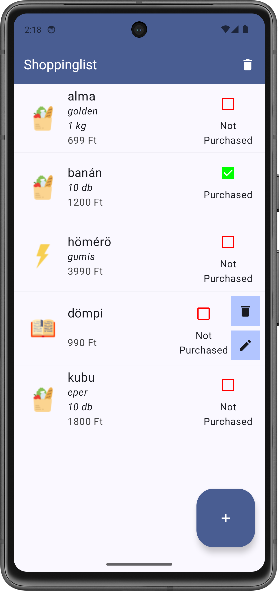
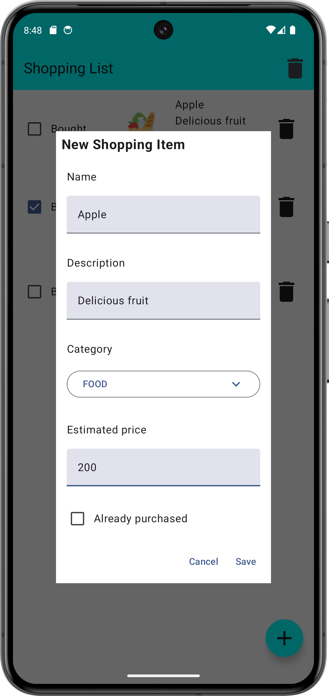

# Labor 06 - Room - Bevásárló lista alkalmazás

## Bevezető
A labor során egy bevásárló lista alkalmazás elkészítése a feladat. Az alkalmazásban lehetőség van rögzíteni, törölni és megvásároltnak jelölni a kívánt termékeket. Az alkalmazás perzisztensen tárolja a temékeket. A funkcionalitás mellett a projekt nagy hangsúlyt fektet az architekturális kérdésekre is.

Az alkalmazás a termékek listáját [`LazyColumn`](https://developer.android.com/develop/ui/compose/lists)-ban jeleníti meg, a lista elemeket és azok állapotát a [`Room`](https://developer.android.com/training/data-storage/room) nevű ORM library segítségével tárolja perzisztensen. Új elem felvételére egy [`FloatingActionButton`](https://developer.android.com/develop/ui/compose/components/fab) megnyomásával van lehetőség.


!!!info "ORM"
    ORM = [Object-relational mapping](https://en.wikipedia.org/wiki/Object-relational_mapping)

Felhasznált technológiák:

- [`Scaffold`](https://developer.android.com/develop/ui/compose/components/scaffold)
- [`AppBar`](https://developer.android.com/develop/ui/compose/components/app-bars)
- [`FloatingActionButton`](https://developer.android.com/develop/ui/compose/components/fab)
- [`Dialog`](https://developer.android.com/develop/ui/compose/components/dialog)
- [`ExposedDropdownMenu`](https://developer.android.com/reference/kotlin/androidx/compose/material/ExposedDropdownMenuBoxScope)
- [`LazyColumn`](https://developer.android.com/develop/ui/compose/lists)
- [`ViewModel`](https://developer.android.com/topic/libraries/architecture/viewmodel)
- [`Repository Pattern`](https://developer.android.com/codelabs/basic-android-kotlin-compose-add-repository)
- [`Room`](https://developer.android.com/training/data-storage/room)

### Az alkalmazás specifikációja
Az alkalmazás egy `Activity`-ből áll, amin egy *Composable* osztály fog szerepelni, a `MainScreen`. Új elemet a jobb alsó sarokban található `FloatingActionButton` segítségével vehetünk fel. Erre kattintva egy dialógus jelenik meg, amin megadhatjuk a vásárolni kívánt áru nevét, leírását, becsült árát és kategóriáját.

A dialóguson a *Save* gombra kattintva a dialógus eltűnik, a benne megadott adatokkal létrejön egy új elem a listában. Az egyes lista elemeken `CheckBox` segítségével jelezhetjük, hogy már megvásároltuk őket. A kuka ikonra kattintva törölhetjük az adott elemet.
A menüben található *Delete all* opcióval az összes lista elemet törölhetjük.


<p align="center">


</p>

### Laborfeladatok
A labor során az alábbi feladatokat a laborvezető segítségével, illetve a jelölt feladatokat önállóan kell megvalósítani.

1. Új elem felvételének megvalósítása: 1 pont
1. A *viewModel* és a *repository* kialakítása: 1 pont
1. A perzisztens adattárolás megvalósítása: 1 pont
1. **Önálló feladat** (törlés megvalósítása): 1 pont
1. **Önálló feladat** (megerősítő dialógus): 1 pont


## Előkészületek

A feladatok megoldása során ne felejtsd el követni a [feladat beadás folyamatát](../../tudnivalok/github/GitHub.md).

### Git repository létrehozása és letöltése

1. Moodle-ben keresd meg a laborhoz tartozó meghívó URL-jét és annak segítségével hozd létre a saját repository-dat.

1. Várd meg, míg elkészül a repository, majd checkout-old ki.

    !!! tip ""
        Egyetemi laborokban, ha a checkout során nem kér a rendszer felhasználónevet és jelszót, és nem sikerül a checkout, akkor valószínűleg a gépen korábban megjegyzett felhasználónévvel próbálkozott a rendszer. Először töröld ki a mentett belépési adatokat (lásd [itt](../../tudnivalok/github/GitHub-credentials.md)), és próbáld újra.

1. Hozz létre egy új ágat `megoldas` néven, és ezen az ágon dolgozz.

1. A `neptun.txt` fájlba írd bele a Neptun kódodat. A fájlban semmi más ne szerepeljen, csak egyetlen sorban a Neptun kód 6 karaktere.


### Projekt megnyitása

Ezen a laboron nem új projektet fogunk létrehozni, hanem egy már létezőből indulunk ki, amiben már megtalálhatóak az elmúlt laborokon tanult alapok. A projekt megtalálható a kicheckoutolt repositoryban *ShoppingList* néven. Nyissuk meg a projektet és a laborvezetővel nézzük át a felépítését!

#### Függéségek

A projektben szerepel a labor során szükséges összes függőség, ezeket a későbbiekben már nem kell újra hozzáadni, de azért az adott résznél szerepeltetni fogjuk őket.

`libs.versions.toml`:

```toml
[versions]
agp = "8.12.3"
kotlin = "2.2.20"
coreKtx = "1.17.0"
junit = "4.13.2"
junitVersion = "1.3.0"
espressoCore = "3.7.0"
lifecycleRuntimeKtx = "2.9.4"
activityCompose = "1.11.0"
composeBom = "2025.10.00"

viewModel = "2.9.4"

ksp = "2.2.10-2.0.2"
room = "2.8.2"

[libraries]
androidx-core-ktx = { group = "androidx.core", name = "core-ktx", version.ref = "coreKtx" }
junit = { group = "junit", name = "junit", version.ref = "junit" }
androidx-junit = { group = "androidx.test.ext", name = "junit", version.ref = "junitVersion" }
androidx-espresso-core = { group = "androidx.test.espresso", name = "espresso-core", version.ref = "espressoCore" }
androidx-lifecycle-runtime-ktx = { group = "androidx.lifecycle", name = "lifecycle-runtime-ktx", version.ref = "lifecycleRuntimeKtx" }
androidx-activity-compose = { group = "androidx.activity", name = "activity-compose", version.ref = "activityCompose" }
androidx-compose-bom = { group = "androidx.compose", name = "compose-bom", version.ref = "composeBom" }
androidx-ui = { group = "androidx.compose.ui", name = "ui" }
androidx-ui-graphics = { group = "androidx.compose.ui", name = "ui-graphics" }
androidx-ui-tooling = { group = "androidx.compose.ui", name = "ui-tooling" }
androidx-ui-tooling-preview = { group = "androidx.compose.ui", name = "ui-tooling-preview" }
androidx-ui-test-manifest = { group = "androidx.compose.ui", name = "ui-test-manifest" }
androidx-ui-test-junit4 = { group = "androidx.compose.ui", name = "ui-test-junit4" }
androidx-material3 = { group = "androidx.compose.material3", name = "material3" }

androidx-material-icons-extended = { group = "androidx.compose.material", name="material-icons-extended" }

androidx-lifecycle-viewmodel-compose = {group = "androidx.lifecycle", name="lifecycle-viewmodel-compose", version.ref = "viewModel" }

androidx-room-runtime = {group = "androidx.room", name="room-runtime", version.ref= "room" }
androidx-room-compiler = {group = "androidx.room", name="room-compiler", version.ref= "room" }
androidx-room-ktx = {group = "androidx.room", name="room-ktx", version.ref= "room" }

[plugins]
android-application = { id = "com.android.application", version.ref = "agp" }
kotlin-android = { id = "org.jetbrains.kotlin.android", version.ref = "kotlin" }
kotlin-compose = { id = "org.jetbrains.kotlin.plugin.compose", version.ref = "kotlin" }

google-devtools-ksp = { id = "com.google.devtools.ksp", version.ref="ksp"}
```

Projekt szintű `build.gradle.kts`:

```kts
plugins {
    alias(libs.plugins.android.application) apply false
    alias(libs.plugins.kotlin.android) apply false
    alias(libs.plugins.kotlin.compose) apply false

    alias(libs.plugins.google.devtools.ksp) apply false
}
```

Modul szintű `build.gradle.kts`:

```kts
plugins {
    alias(libs.plugins.android.application)
    alias(libs.plugins.kotlin.android)
    alias(libs.plugins.kotlin.compose)

    alias(libs.plugins.google.devtools.ksp)
}

android {
    namespace = "hu.bme.aut.android.shoppinglist"
    compileSdk = 36

    defaultConfig {
        applicationId = "hu.bme.aut.android.shoppinglist"
        minSdk = 24
        targetSdk = 36
        versionCode = 1
        versionName = "1.0"

        testInstrumentationRunner = "androidx.test.runner.AndroidJUnitRunner"
    }

    buildTypes {
        release {
            isMinifyEnabled = false
            proguardFiles(
                getDefaultProguardFile("proguard-android-optimize.txt"),
                "proguard-rules.pro"
            )
        }
    }
    compileOptions {
        sourceCompatibility = JavaVersion.VERSION_11
        targetCompatibility = JavaVersion.VERSION_11
    }
    kotlinOptions {
        jvmTarget = "11"
    }
    buildFeatures {
        compose = true
    }
}

dependencies {

    implementation(libs.androidx.core.ktx)
    implementation(libs.androidx.lifecycle.runtime.ktx)
    implementation(libs.androidx.activity.compose)
    implementation(platform(libs.androidx.compose.bom))
    implementation(libs.androidx.ui)
    implementation(libs.androidx.ui.graphics)
    implementation(libs.androidx.ui.tooling.preview)
    implementation(libs.androidx.material3)
    testImplementation(libs.junit)
    androidTestImplementation(libs.androidx.junit)
    androidTestImplementation(libs.androidx.espresso.core)
    androidTestImplementation(platform(libs.androidx.compose.bom))
    androidTestImplementation(libs.androidx.ui.test.junit4)
    debugImplementation(libs.androidx.ui.tooling)
    debugImplementation(libs.androidx.ui.test.manifest)

    implementation(libs.androidx.material.icons.extended)

    implementation(libs.androidx.lifecycle.viewmodel.compose)

    ksp(libs.androidx.room.compiler)
    implementation(libs.androidx.room.runtime)
    implementation(libs.androidx.room.ktx)
}
```

#### Erőforrások

A projektben szerepelnek az alkalmazás ikonjai, a szükséges grafikus erőforrások és a szöveges erőforrások:

`strings.xml`:

```xml
<resources>
    <string name="app_name">ShoppingList</string>
    <string name="add_shopping_item">Add Shopping Item</string>
    <string name="edit_shopping_item">Edit Shopping Item</string>
    <string name="label_name">Name</string>
    <string name="label_description">Description</string>
    <string name="label_estimated_price">Estimated price</string>
    <string name="label_already_purchased">Already purchased</string>
    <string name="label_category">Category</string>
    <string name="cancel">Cancel</string>
    <string name="save">Save</string>
    <string name="label_purchased">Purchased\n</string>
    <string name="label_not_purchased">Not\nPurchased</string>
    <string name="category_food">Food</string>
    <string name="category_book">Book</string>
    <string name="category_electronics">Electronics</string>
</resources>
```

#### A modell 

Az alkalmazásunk egy bevásárló listát, azon belül is vásárlási tételeket fog megjeleníteni. Ez fontos lesz mind a felhasználói felület, mind a perzisztens adattárolás szempontjából. A `data` *package*-en belül az `entities` *package*-ben van egy `ShoppingItem` adat osztályunk.

`ShoppingItem.kt`:

```kotlin
package hu.bme.aut.android.shoppinglist.data.entities

data class ShoppingItem(
		var id: Long? = null,
        var name: String,
        var description: String,
        var category: Category,
        var estimatedPrice: Int,
        var isBought: Boolean
){
    enum class Category{
        FOOD, ELECTRONIC, BOOK
    }
}
```

A tételünk tartalmaz egy ID-t, egy nevet, egy leírást, egy kategóriát, egy árat és egy kapcsolót, ami megmondja, hogy az adott tételt megvettük-e már vagy sem. A választható kategóriákat egy belső *enum class*-ként valósítottuk meg.

!!!info "data class"
    Kotlinban van lehetőség úgynevezett data class létrehozására. Ezt talán legkönnyebben a Java-s POJO (Plain-Old-Java-Object) osztályoknak lehet megfeleltetni. A céljuk, hogy publikus property-kben összefüggő adatokat tároljanak, semmi több! Ezen kívül automatikusan létrejönnek bizonyos segédfüggvények is, például egy megfelelő equals, toString és copy implementáció.

#### A felhasználói felület

Az alkalmazásunk felhasználói felülete elég egyszerű. Egy *screen*-t tartalmaz, amin található egy `TopBar`, a lista az elemekről és egy `FloatingActionButton`. A gomb megnyomásának hatására fog megnyílni az új elem felvételére szolgáló dialógus ablak. A `ShoppingListScreen` a `hu.bme.aut.android.shoppinglist.ui.screen.shoppinglist` *package*-ben található, az építőelemei pedig ezen belül egy `components` *package*-ben:

`ShoppingListTopBar.kt`:

```kotlin
package hu.bme.aut.android.shoppinglist.ui.screen.shoppinglist.components

import androidx.compose.material.icons.Icons
import androidx.compose.material.icons.filled.Delete
import androidx.compose.material3.ExperimentalMaterial3Api
import androidx.compose.material3.Icon
import androidx.compose.material3.IconButton
import androidx.compose.material3.MaterialTheme
import androidx.compose.material3.Text
import androidx.compose.material3.TopAppBar
import androidx.compose.material3.TopAppBarDefaults
import androidx.compose.runtime.Composable
import androidx.compose.ui.res.stringResource
import androidx.compose.ui.tooling.preview.Preview
import hu.bme.aut.android.shoppinglist.R

@OptIn(ExperimentalMaterial3Api::class)
@Composable
fun ShoppingListTopBar() {
    TopAppBar(
        title = {
            Text(
                text = stringResource(id = R.string.app_name),
                color = MaterialTheme.colorScheme.onPrimary
            )
        },
        actions = {
            IconButton(
                onClick = {
                    /*TODO*/
                }
            ) {
                Icon(
                    imageVector = Icons.Default.Delete,
                    tint = MaterialTheme.colorScheme.onPrimary,
                    contentDescription = "Delete all items"
                )
            }
        },
        colors = TopAppBarDefaults.topAppBarColors(containerColor = MaterialTheme.colorScheme.primary)
    )
}

@Preview
@Composable
fun MainTopBarPreview() {
    ShoppingListTopBar()
}
```

A `TopAppBar` beépített *Composable* függvénynek adunk át egy nevet a *title* paraméterrel és egy akciógombot az *actions* paraméterrel. Jelen esetben egy `Delete all items` gombot fogunk hozzáadni, aminek a működését az önálló feladatrésznél kell megvalósítani.

`UIShoppingItem.kt`:

```kotlin
package hu.bme.aut.android.shoppinglist.ui.screen.shoppinglist.components

import androidx.compose.foundation.Image
import androidx.compose.foundation.background
import androidx.compose.foundation.clickable
import androidx.compose.foundation.layout.Arrangement
import androidx.compose.foundation.layout.Column
import androidx.compose.foundation.layout.Row
import androidx.compose.foundation.layout.Spacer
import androidx.compose.foundation.layout.fillMaxWidth
import androidx.compose.foundation.layout.height
import androidx.compose.foundation.layout.padding
import androidx.compose.foundation.layout.size
import androidx.compose.material.icons.Icons
import androidx.compose.material.icons.filled.Delete
import androidx.compose.material.icons.filled.Edit
import androidx.compose.material3.Checkbox
import androidx.compose.material3.CheckboxDefaults
import androidx.compose.material3.Icon
import androidx.compose.material3.IconButton
import androidx.compose.material3.MaterialTheme
import androidx.compose.material3.Text
import androidx.compose.runtime.Composable
import androidx.compose.runtime.getValue
import androidx.compose.runtime.mutableStateOf
import androidx.compose.runtime.remember
import androidx.compose.runtime.setValue
import androidx.compose.ui.Alignment
import androidx.compose.ui.Modifier
import androidx.compose.ui.graphics.Color
import androidx.compose.ui.res.painterResource
import androidx.compose.ui.res.stringResource
import androidx.compose.ui.text.font.FontStyle
import androidx.compose.ui.text.style.TextAlign
import androidx.compose.ui.tooling.preview.Preview
import androidx.compose.ui.unit.dp
import androidx.compose.ui.unit.sp
import hu.bme.aut.android.shoppinglist.R
import hu.bme.aut.android.shoppinglist.data.entities.ShoppingItem

@Composable
fun UIShoppingItem(
    shoppingItem: ShoppingItem,
    onCheckBoxClick: (ShoppingItem) -> Unit,
    onDeleteIconClick: () -> Unit,
    onEditIconClick: (ShoppingItem) -> Unit
) {
    var isChecked by remember { mutableStateOf(shoppingItem.isBought) }
    var isInteractionPanelExpanded by remember { mutableStateOf(false) }
    val image = when (shoppingItem.category) {
        ShoppingItem.Category.FOOD -> R.drawable.groceries
        ShoppingItem.Category.ELECTRONIC -> R.drawable.lightning
        ShoppingItem.Category.BOOK -> R.drawable.open_book
        else -> R.drawable.groceries
    }

    Row(
        modifier = Modifier
            .padding(8.dp)
            .fillMaxWidth()
            .clickable(onClick = { isInteractionPanelExpanded = !isInteractionPanelExpanded }),
        verticalAlignment = Alignment.CenterVertically
    ) {

        Image(
            modifier = Modifier
                .size(80.dp),
            painter = painterResource(image),
            contentDescription = "image"
        )
        Column(
            modifier = Modifier
                .fillMaxWidth()
                .weight(2f),
            horizontalAlignment = Alignment.Start
        ) {
            Text(
                text = shoppingItem.name,
                fontSize = 20.sp,
                maxLines = 1
            )
            Text(
                text = shoppingItem.description,
                maxLines = 2,
                fontStyle = FontStyle.Italic
            )
            Text(
                text = "${shoppingItem.estimatedPrice} Ft",
                color = Color.DarkGray,
                maxLines = 1
            )
        }
        Column(
            verticalArrangement = Arrangement.Center,
            horizontalAlignment = Alignment.CenterHorizontally,
            modifier = Modifier.weight(1f)
        ) {
            Checkbox(
                checked = shoppingItem.isBought,
                onCheckedChange = {
                    isChecked = it

                    onCheckBoxClick(shoppingItem.copy(isBought = isChecked))
                },
                colors = CheckboxDefaults.colors(
                    checkedColor = Color.Green,
                    uncheckedColor = Color.Red,
                    checkmarkColor = Color.White
                ),
            )
            Text(
                text = if (shoppingItem.isBought) stringResource(R.string.label_purchased) else stringResource(R.string.label_not_purchased),
                textAlign = TextAlign.Center
            )
        }
        if (isInteractionPanelExpanded)
            Column() {
                IconButton(
                    modifier = Modifier.background(MaterialTheme.colorScheme.inversePrimary),
                    onClick = {
                        /*TODO*/
                        isInteractionPanelExpanded = false
                    }
                ) {
                    Icon(
                        imageVector = Icons.Default.Delete,
                        contentDescription = "Delete"
                    )
                }
                Spacer(modifier = Modifier.height(8.dp))
                IconButton(
                    modifier = Modifier.background(MaterialTheme.colorScheme.inversePrimary),
                    onClick = {
                        /*TODO*/
                        isInteractionPanelExpanded = false
                    }
                ) {
                    Icon(
                        imageVector = Icons.Default.Edit,
                        contentDescription = "Edit"
                    )
                }
            }
    }
}

@Preview(showBackground = true)
@Composable
fun ItemShoppingItemPurchasedPreview() {
    UIShoppingItem(
        shoppingItem = ShoppingItem(
            name = "LongItemName",
            description = "description",
            estimatedPrice = 500,
            category = ShoppingItem.Category.BOOK,
            isBought = true
        ),
        onDeleteIconClick = {},
        onCheckBoxClick = {},
        onEditIconClick = {}
    )
}

@Preview(showBackground = true)
@Composable
fun ItemShoppingItemNotPurchasedPreview() {
    UIShoppingItem(
        shoppingItem = ShoppingItem(
            name = "LongItemName",
            description = "description description description description description",
            estimatedPrice = 500,
            category = ShoppingItem.Category.ELECTRONIC,
            isBought = false
        ),
        onDeleteIconClick = {},
        onCheckBoxClick = {},
        onEditIconClick = {}
    )
}
```

A felület a `ShoppingItem` adatait jeleníti meg. Bal oldalon a kategóriától függő képet, középen a nevet, a leírást valamint az árat, jobb oldalon pedig a *CheckBox*-ot, ami a termék megvásárlását jelzi. E mellett érintés hatására a felület jobb szélére kinyitható egy panel, ami a törlés és módosítás gombokat tartalmazza.

Látható, hogy a felület átveszi a megjelenítendő `ShoppingItem`-et, valamint három *callback* függvényt: a *CheckBox*, a törlés valamint a módosítás ikonok érintés eseményeinek lekezelésére. Ezek közül egyelőre csak a *CheckBox* van használva (a többi önálló feladat lesz), ahol a megváltozott állapotot visszaküldjük a metódussal. 

Most, hogy megvagyunk a komponenseinkkel, végre összeállíthatjuk belőlük a `ShoppingListScreen`-ünket:

`ShoppingListScreen.kt`:

```kotlin
package hu.bme.aut.android.shoppinglist.ui.screen.shoppinglist

import androidx.compose.foundation.layout.padding
import androidx.compose.foundation.lazy.LazyColumn
import androidx.compose.material.icons.Icons
import androidx.compose.material.icons.filled.Add
import androidx.compose.material3.HorizontalDivider
import androidx.compose.material3.Icon
import androidx.compose.material3.LargeFloatingActionButton
import androidx.compose.material3.MaterialTheme
import androidx.compose.material3.Scaffold
import androidx.compose.runtime.Composable
import androidx.compose.ui.Modifier
import androidx.compose.ui.tooling.preview.Preview
import hu.bme.aut.android.shoppinglist.data.entities.ShoppingItem
import androidx.compose.foundation.lazy.items
import androidx.compose.runtime.mutableStateListOf
import androidx.compose.runtime.remember
import hu.bme.aut.android.shoppinglist.ui.screen.shoppinglist.components.ShoppingListTopBar
import hu.bme.aut.android.shoppinglist.ui.screen.shoppinglist.components.UIShoppingItem


@Composable
fun ShoppingListScreen(modifier : Modifier = Modifier) {

    val list = remember {
        mutableStateListOf(
            ShoppingItem(
                id = 1,
                name = "Alma",
                description = "jonatán\n1 kg",
                estimatedPrice = 500,
                category = ShoppingItem.Category.FOOD,
                isBought = true
            ),
            ShoppingItem(
                id = 2,
                name = "A gyűrűk ura",
                description = "A gyűrű szövetsége",
                estimatedPrice = 8000,
                category = ShoppingItem.Category.BOOK,
                isBought = false
            )
        )
    }

    Scaffold(
        modifier = modifier,
        topBar = {
            ShoppingListTopBar()
        },
        floatingActionButton = {
            LargeFloatingActionButton(
                containerColor = MaterialTheme.colorScheme.primary,
                onClick = {
                    /*TODO*/
                }) {
                Icon(
                    imageVector = Icons.Default.Add,
                    contentDescription = "Add new item"
                )
            }
        }
    ) { innerPadding ->

        LazyColumn(
            modifier = Modifier.padding(innerPadding)
        ) {
            items(list, key = { item -> item.id!! }) {

                UIShoppingItem(
                    shoppingItem = it,
                    onCheckBoxClick = { shoppingItem ->
                        /*TODO*/
                    },
                    onDeleteIconClick = {
                        /*TODO*/
                    },
                    onEditIconClick = {
                        /*TODO*/
                    }
                )
                if (list.indexOf(it) < list.size - 1) {
                    HorizontalDivider()
                }
            }
        }
    }

}

@Preview
@Composable
fun MainScreenPreview() {
    ShoppingListScreen()
}
```

Most már csak annyi dolgunk van, hogy a saját `ShoppingListScreen`-ünket jelenítsük meg a `MainActivity`-n:

`MainActivity.kt`:

```kotlin
package hu.bme.aut.android.shoppinglist

import android.os.Bundle
import androidx.activity.ComponentActivity
import androidx.activity.compose.setContent
import androidx.activity.enableEdgeToEdge
import androidx.compose.foundation.layout.safeDrawingPadding
import androidx.compose.ui.Modifier
import hu.bme.aut.android.shoppinglist.ui.screen.shoppinglist.ShoppingListScreen
import hu.bme.aut.android.shoppinglist.ui.theme.ShoppingListTheme

class MainActivity : ComponentActivity() {
    override fun onCreate(savedInstanceState: Bundle?) {
        super.onCreate(savedInstanceState)
        enableEdgeToEdge()
        setContent {
            ShoppingListTheme {
                ShoppingListScreen(modifier = Modifier.safeDrawingPadding())
            }
        }
    }
}
```

Próbáljuk ki az alkalmazást!

A listánk már megjelenik, azonban sem az egyes elemeket nem lehet módosítani, sem új elemet nem lehet felvenni.

## Új elem felvétele (1 pont)

### Dialógus

Azt szeretnénk, ha a  `ShoppingListScreen`-en található *FloatingActionButton* megnyomásának hatására megnyílna egy dialógusablak, ahol meg tudjuk adni az új termékek adatait, majd fel tudjuk venni őket a listánkra. Készítsük el ezt a dialógust is a `hu.bme.aut.android.shoppinglist.ui.screen.shoppinglist.components` *package*-ben.

A felületen egymás alatt található:

- a dialógus címe,
- a név beviteli mező,
- az ár beviteli mező, amibe csak számot tutunk beírni,
- a leírás beviteli mező,
- a kategória legördülő menü, ami egy *OutlinedTextField*-ből és egy *ExposedDropdownMenu*-ből áll,
- a vásárlás állapotát jelző *CheckBox* és
- a két akció gomb, amelynek *callback*-jeit paraméterként vesszük át.

`ShoppingItemDialog.kt`:

```kotlin
package hu.bme.aut.android.shoppinglist.ui.screen.shoppinglist.components

import androidx.compose.foundation.background
import androidx.compose.foundation.layout.Arrangement
import androidx.compose.foundation.layout.Column
import androidx.compose.foundation.layout.Row
import androidx.compose.foundation.layout.Spacer
import androidx.compose.foundation.layout.fillMaxWidth
import androidx.compose.foundation.layout.padding
import androidx.compose.foundation.layout.width
import androidx.compose.foundation.text.KeyboardOptions
import androidx.compose.material3.Button
import androidx.compose.material3.Checkbox
import androidx.compose.material3.CheckboxDefaults
import androidx.compose.material3.DropdownMenuItem
import androidx.compose.material3.ExperimentalMaterial3Api
import androidx.compose.material3.ExposedDropdownMenuAnchorType
import androidx.compose.material3.ExposedDropdownMenuBox
import androidx.compose.material3.ExposedDropdownMenuDefaults
import androidx.compose.material3.OutlinedButton
import androidx.compose.material3.OutlinedTextField
import androidx.compose.material3.Text
import androidx.compose.runtime.Composable
import androidx.compose.runtime.getValue
import androidx.compose.runtime.mutableStateOf
import androidx.compose.runtime.remember
import androidx.compose.runtime.rememberCoroutineScope
import androidx.compose.runtime.setValue
import androidx.compose.ui.Alignment
import androidx.compose.ui.Modifier
import androidx.compose.ui.graphics.Color
import androidx.compose.ui.graphics.RectangleShape
import androidx.compose.ui.res.stringResource
import androidx.compose.ui.text.font.FontWeight
import androidx.compose.ui.text.input.ImeAction
import androidx.compose.ui.text.input.KeyboardType
import androidx.compose.ui.tooling.preview.Preview
import androidx.compose.ui.unit.dp
import androidx.compose.ui.unit.sp
import hu.bme.aut.android.shoppinglist.R
import hu.bme.aut.android.shoppinglist.data.entities.ShoppingItem
import kotlinx.coroutines.launch

@OptIn(ExperimentalMaterial3Api::class)
@Composable
fun ShoppingItemDialog(
    modifier : Modifier = Modifier,
    shoppingItem: ShoppingItem? = null,
    onDismissRequest: () -> Unit = {},
    onSaveClick: (ShoppingItem) -> Unit
) {

    val coroutineScope = rememberCoroutineScope()
    var name by remember { mutableStateOf(shoppingItem?.name ?: "") }
    var description by remember { mutableStateOf(shoppingItem?.description ?: "") }
    var price by remember { mutableStateOf(shoppingItem?.estimatedPrice?.toString() ?: "") }
    var category by remember {
        mutableStateOf(
            shoppingItem?.category ?: ShoppingItem.Category.FOOD
        )
    }
    var isBought by remember { mutableStateOf(shoppingItem?.isBought ?: false) }

    var isCategoryDropdownExpanded by remember { mutableStateOf(false) }
    var isNameError by remember { mutableStateOf(name.isEmpty()) }
    val categoryOptions = ShoppingItem.Category.entries.toList()

    Column(
        modifier = modifier
            .background(Color.White)
    ) {
        //Title of the Dialog Window
        Text(
            text =
            if (shoppingItem?.id == null)
                stringResource(id = R.string.add_shopping_item)
            else
                stringResource(id = R.string.edit_shopping_item),
            modifier = Modifier
                .fillMaxWidth()
                .padding(8.dp),
            fontWeight = FontWeight.Bold,
            fontSize = 20.sp
        )

        //Name of the item
        OutlinedTextField(
            modifier = Modifier
                .padding(8.dp)
                .fillMaxWidth(),
            value = name,
            label = { Text(text = stringResource(R.string.label_name)) },
            onValueChange = {
                name = it
                isNameError = it.isEmpty()
            },
            maxLines = 1,
            keyboardOptions = KeyboardOptions(imeAction = ImeAction.Next),
            isError = isNameError
        )

        //Price of the item
        OutlinedTextField(
            value = price,
            label = { Text(text = stringResource(R.string.label_estimated_price)) },
            modifier = Modifier
                .padding(8.dp)
                .fillMaxWidth(),
            onValueChange = { price = it },
            maxLines = 1,
            keyboardOptions = KeyboardOptions(
                keyboardType = KeyboardType.Decimal,
                imeAction = ImeAction.Next
            )
        )

        //Description of the item
        OutlinedTextField(
            modifier = Modifier
                .padding(8.dp)
                .fillMaxWidth(),
            value = description,
            label = { Text(text = stringResource(R.string.label_description)) },
            onValueChange = { description = it },
            maxLines = 2
        )

        //Dropdown Menu for the category of the item
        ExposedDropdownMenuBox(
            expanded = isCategoryDropdownExpanded,
            onExpandedChange = { isCategoryDropdownExpanded = !isCategoryDropdownExpanded }) {

            OutlinedTextField(
                modifier = Modifier
                    .menuAnchor(type = ExposedDropdownMenuAnchorType.PrimaryNotEditable)
                    .padding(8.dp)
                    .fillMaxWidth(),
                value = getCategoryTextByCategory(category = category),
                label = {
                    Text(text = stringResource(id = R.string.label_category))
                },
                onValueChange = {},
                readOnly = true,
                trailingIcon = {
                    ExposedDropdownMenuDefaults.TrailingIcon(expanded = isCategoryDropdownExpanded)
                })

            ExposedDropdownMenu(
                expanded = isCategoryDropdownExpanded,
                onDismissRequest = { isCategoryDropdownExpanded = false }) {
                categoryOptions.forEach { option ->
                    DropdownMenuItem(
                        onClick = {
                            category = option
                            isCategoryDropdownExpanded = false
                        },
                        text = {
                            Text(
                                text = getCategoryTextByCategory(option)
                            )
                        },
                        contentPadding = ExposedDropdownMenuDefaults.ItemContentPadding
                    )
                }
            }
        }

        //Row for the checkbox if the item is already bought
        Row(
            modifier = Modifier.padding(8.dp),
            verticalAlignment = Alignment.CenterVertically
        ) {
            Checkbox(
                checked = isBought,
                onCheckedChange = {
                    isBought = it
                },
                colors = CheckboxDefaults.colors(
                    checkedColor = Color.Green,
                    uncheckedColor = Color.Black,
                    checkmarkColor = Color.White
                )
            )
            Text(text = stringResource(R.string.label_already_purchased))
        }

        //Row for the buttons
        Row( //Row for the buttons
            modifier = Modifier
                .fillMaxWidth()
                .padding(8.dp),
            verticalAlignment = Alignment.CenterVertically,
            horizontalArrangement = Arrangement.End
        ) {
            OutlinedButton(
                onClick = {
                    onDismissRequest()
                },
                shape = RectangleShape
            ) {
                Text(text = stringResource(R.string.cancel))
            }
            Spacer(modifier = Modifier.width(16.dp))
            Button(
                onClick = {
                    if (!isNameError) {
                        coroutineScope.launch {
                            onDismissRequest()
                            onSaveClick(
                                ShoppingItem(
                                    id = shoppingItem?.id,
                                    name = name,
                                    description = description,
                                    estimatedPrice = if (price.isNotEmpty()) price.toInt() else 0,
                                    category = category,
                                    isBought = isBought
                                )
                            )
                        }
                    }
                },
                shape = RectangleShape
            ) {
                Text(text = stringResource(R.string.save))
            }
        }
    }
}

@Composable
private fun getCategoryTextByCategory(category: ShoppingItem.Category) =
    when (category) {
        ShoppingItem.Category.ELECTRONIC -> stringResource(id = R.string.category_electronics)
        ShoppingItem.Category.BOOK -> stringResource(id = R.string.category_book)
        else -> stringResource(id = R.string.category_food)
    }


@Preview
@Composable
fun NewShoppingItemDialogPreview() {
    ShoppingItemDialog(onSaveClick = {})
}

@Preview
@Composable
fun EditShoppingItemDialogPreview() {
    ShoppingItemDialog(
        shoppingItem = ShoppingItem(
            name = "name",
            description = "description",
            estimatedPrice = 500,
            category = ShoppingItem.Category.BOOK,
            isBought = true
        ),
        onSaveClick = {}
    )
}
```

Mint látható, a `ShoppingItemDialog`-ban állapotként tároljuk:

- a nevet: `name`,
- a leírást: `description`,
- az árat: `price`:
- a kategóriát: `category`,
- a vásárlás állapotát: `isBought`,
- azt, hogy a category *Dropdown* nyitva van-e: `isCategoryDropdownExpanded` és
- azt, hogy a név mezőben van-e hiba, azaz üres-e: `isNameError`.

Szeretnénk, hogy a `ShoppingItemDialog` többször is felhasználható legyen, azaz nem csak új elem felvételekor, hanem szerkesztéshor is használhassuk. Ennek érdekében paraméterként átveszünk egy *shoppingItem*-et. Ha ez null, akkor új elemet veszünk föl, ha nem, akkor szerkesztünk.

### Megjelenítés és frissítés

Most, hogy elkészült a dialógus felületünk, jelenítsük is meg azt! A `ShoppingItemDialog` láthatóságát egy állapotváltozóhoz fogjuk kötni a `ShoppingListScreen`-en, amit a *FloatingActionButton* megnyomásakor állítunk be:

```kotlin
@Composable
fun ShoppingListScreen(modifier : Modifier = Modifier) {

    var isDialogOpen by remember { mutableStateOf(false) }

    ...

    Scaffold(
        modifier = modifier,
        topBar = {
            ShoppingListTopBar()
        },
        floatingActionButton = {
            LargeFloatingActionButton(
                containerColor = MaterialTheme.colorScheme.primary,
                onClick = {
                    isDialogOpen = true
                }) {
                Icon(
                    imageVector = Icons.Default.Add,
                    contentDescription = "Add new item"
                )
            }
        }
    ) { 
		...
    }

    if (isDialogOpen) {
        Dialog(onDismissRequest = { isDialogOpen = false }) {
            ShoppingItemDialog(
                onDismissRequest = { isDialogOpen = false },
                onSaveClick = { newShoppingItem ->
                    newShoppingItem.id = Random.nextLong()
                    list += newShoppingItem
                }
            )
        }
    }
}
```

Az alkalmazásunkban most már megjelenik a dialógus ablak, tudunk is új elemet felvenni a listánkra, azonban a módosítás még mindig nem működik. Valósítsuk meg azt is, hogy a *CheckBox* megnyomásakor frissüljün a felület. Ehhez a megfelelő *callBack* függvényt kell megadnunk:

```kotlin
onCheckBoxClick = { shoppingItem ->
    list[list.indexOf(it)] = shoppingItem
},
```

Próbáljuk ki az alkalmazást!

!!!example "BEADANDÓ (1 pont)"
	Készíts egy **képernyőképet**, amelyen látszik a **frissített és kibővített lista** (emulátoron, készüléket tükrözve vagy képernyőfelvétellel), egy **ahhoz tartozó kódrészlet**, valamint a **neptun kódod az egyik termék neveként**! A képet a megoldásban a repository-ba **f1.png** néven töltsd föl!

	A képernyőkép szükséges feltétele a pontszám megszerzésének.


## Az architektúra kialakítása (1 pont)

Látható, hogy a listánkat egyelőre beégettünk, és elég csúnya módon egy *screen composable*-ben tároljuk. (Ráadásul ha elforgatjuk az eszközünket az egész lista visszaáll.) Ezt a gyors kipróbálhatóság érdekében tettük, azonban most kialakítjuk a megfelelő architektúrát. Kezdetben még maradunk a memóriában tárolt listánál, azonban azok helyét architekturálisan megfelelőbben választjuk meg.

### A repository létrehozása

Az adataink tipikusan egy adatforrásból, egy *repository*-ból jönnek. Ennek számos megvalósítása lehet, akár párhuzamosan is. Definiáljunk egy *interface*-t és egy konkrét megvalósítást is (ami még mindig memória alapú) a `hu.bme.aut.android.shoppinglist.data.repository` *package*-ben:

`IShoppingItemRepository.kt`:

```kotlin
package hu.bme.aut.android.shoppinglist.data.repository

import hu.bme.aut.android.shoppinglist.data.entities.ShoppingItem
import kotlinx.coroutines.flow.Flow

interface IShoppingItemRepository {

    fun getAllItems(): Flow<List<ShoppingItem>>
    suspend fun insert(shoppingItem: ShoppingItem)
    suspend fun update(shoppingItem: ShoppingItem)
    suspend fun delete(shoppingItem: ShoppingItem)
}
```

`MemoryShoppingItemRepository.kt`:

```kotlin
package hu.bme.aut.android.shoppinglist.data.repository

import androidx.compose.runtime.mutableStateListOf
import hu.bme.aut.android.shoppinglist.data.entities.ShoppingItem
import kotlinx.coroutines.delay
import kotlinx.coroutines.flow.Flow
import kotlinx.coroutines.flow.flow

class MemoryShoppingItemRepository : IShoppingItemRepository {

    private var list = mutableStateListOf(
        ShoppingItem(
            id = 1,
            name = "Alma",
            description = "jonatán\n1 kg",
            estimatedPrice = 500,
            category = ShoppingItem.Category.FOOD,
            isBought = true
        ),
        ShoppingItem(
            id = 2,
            name = "A gyűrűk ura",
            description = "A gyűrű szövetsége",
            estimatedPrice = 8000,
            category = ShoppingItem.Category.BOOK,
            isBought = false
        )
    )

    override fun getAllItems(): Flow<List<ShoppingItem>> = flow {
            emit(list)
        }

    override suspend fun insert(shoppingItem: ShoppingItem) {
        delay(1000)
        list.add(shoppingItem.copy(id = (Long.MAX_VALUE*Math.random()).toLong()))
    }

    override suspend fun update(shoppingItem: ShoppingItem) {
        delay(1000)
        for (item in list) {
            if (item.id == shoppingItem.id)
                list[list.indexOf(item)] = shoppingItem
        }
    }

    override suspend fun delete(shoppingItem: ShoppingItem) {
        delay(1000)
        list.remove(shoppingItem)
    }
}
```

Az `IShoppingItemRepository`egy általános interfészt ír le, mellyel elérhetővé válnak a feladatok az alkalmazás számára, míg a `MemoryShoppingListRepository` egy memória alapú megvalósítását mutatja be. Bár itt most nem lenne szükség a suspend kulcsszó használatára, ezzel tudjuk biztosítani, hogy a későbbiekben egy adatbázis vagy hálózati TodoRepository elkészítése után könnyedén tudjuk migrálni a projektet, ezt a késleltetést imitáljuk a delay() függvény hívásával is. Látható, hogy a listánkat privát módon tároljuk, és csak egy függvényen keresztül egy `Flow`-ba ágyazva tesszük elérhetővé.

!!!info "Flow"
	A *korutin*-okban a [Flow](https://developer.android.com/kotlin/flow) olyan típus, amely több értéket is képes kiadni egymás után, szemben az olyan függvényekkel, amelyek csak egyetlen értéket adnak vissza. A *Flow* segítségével tehát folyamatosan megfigyelhetünk egy adatforrást, és élő frissítéseket kaphatunk például egy adatbázisból.

### A repository inicializálása

Az imént létrehoztuk a *repository*-nkat, azonban azt még semmi sem példányosítja azt, és nem teszi elérhetővé számunkra. Ennek a problémának a megoldására több opció is létezik. Mi most azt választjuk, hogy a *repository*-nkat az *alkalmazás objektumunkhoz* kötjük. Így mindig létezni fog, amikor az alkalmazás fut, és bárhonnan elérhető lesz. Hozzunk létre a projektünk alap *package*-ében egy `ShoppingListApplication.kt` fájlt, majd inicializáljuk benne a *repository-nkat:

`ShoppingListApplication.kt`:

```kotlin
package hu.bme.aut.android.shoppinglist

import android.app.Application
import hu.bme.aut.android.shoppinglist.data.repository.IShoppingItemRepository
import hu.bme.aut.android.shoppinglist.data.repository.MemoryShoppingItemRepository

class ShoppingListApplication : Application() {

    companion object {
        lateinit var repository: IShoppingItemRepository
    }

    override fun onCreate() {
        super.onCreate()

        repository = MemoryShoppingItemRepository()
    }
}
```

!!!info "static"
	A Kotlin egy nagy eltérése az eddig ismert, megszokott OOP nyelvektől, hogy nincs benne `static` kulcsszó, és így nincsenek statikus változók vagy függvények sem. Ehelyett minden osztályhoz lehet definiálni egy [`companion object`-et](https://kotlinlang.org/docs/reference/object-declarations.html#companion-objects), ami egy olyan singleton-t definiál, ami az osztály összes példányán keresztül elérhető. Röviden, minden `companion object`-en belül definiált konstans, változó, függvény úgy viselkedik, mintha statikus lenne.

Az *appilication* osztály létrehozása után állítsuk be az `AndroidManifest.xml`-ben, hogy az alapértelmezett helyett a sajátunkat használja az alkalmazás:

```xml
<application
    android:name=".ShoppingListApplication"
	...
```

### A ViewModel elkészítése

Így már bármikor, bárhonnan elérhetjük a *repository*-nkat, azonban az egyáltalán nem lenne szép, ha a *screen*-ek közvetlenül érnék el a *repository*-t, ráadásul a lista tárolása ugyan úgy a *screen* osztályban maradna. Vezessünk be ennek az állapotnak a tárolására egy `ShoppingListViewModel`-t. A `ShoppingListScreen` mellett, a `hu.bme.aut.android.shoppinglist.ui.screen.shoppinglist` *package*-ben hozzuk létre a *viewModel*-t:

???success "viewModel"
	A *viewModel* keretrendszer használatához szükségünk lesz egy függőségre. Adjuk hozzá a projektünkhöz az alábbiakat:

	`libs.versions.toml`:
	
	```toml
	[versions]
	viewModel = "2.9.4"
	...
	
	[libraries]
	androidx-lifecycle-viewmodel-compose = {group = "androidx.lifecycle", name="lifecycle-viewmodel-compose", version.ref = "viewModel" }
	...
	```
	
	Modul szintű `build.gradle.kts`:
	
	```kotlin
	dependencies {
		implementation(libs.androidx.lifecycle.viewmodel.compose)
		...
	```

`ShoppingListViewModel.kt`:

```kotlin
package hu.bme.aut.android.shoppinglist.ui.screen.shoppinglist

import androidx.lifecycle.ViewModel
import androidx.lifecycle.ViewModelProvider
import androidx.lifecycle.viewModelScope
import androidx.lifecycle.viewmodel.initializer
import androidx.lifecycle.viewmodel.viewModelFactory
import hu.bme.aut.android.shoppinglist.ShoppingListApplication
import hu.bme.aut.android.shoppinglist.data.entities.ShoppingItem
import hu.bme.aut.android.shoppinglist.data.repository.IShoppingItemRepository
import kotlinx.coroutines.flow.MutableStateFlow
import kotlinx.coroutines.flow.asStateFlow
import kotlinx.coroutines.flow.collectLatest
import kotlinx.coroutines.launch


class ShoppingListViewModel(
    private val repository: IShoppingItemRepository
) : ViewModel() {
    private val _list = MutableStateFlow<List<ShoppingItem>>(listOf())
    val shoppingItemList = _list.asStateFlow()

    init {
        getAllItems()
    }

    fun getAllItems() {
        viewModelScope.launch {
            repository.getAllItems().collectLatest {
                _list.tryEmit(it)
            }
        }
    }

    fun insert(item: ShoppingItem) {
        viewModelScope.launch {
            try {
                repository.insert(shoppingItem = item)
            } catch (e: Exception) {
                e.printStackTrace()
            }
        }
    }

    fun update(item: ShoppingItem) {
        viewModelScope.launch {
            try {
                repository.update(shoppingItem = item)
            } catch (e: Exception) {
                e.printStackTrace()
            }
        }
    }

    fun delete(item: ShoppingItem) {
        viewModelScope.launch {
            try {
                repository.delete(shoppingItem = item)
            } catch (e: Exception) {
                e.printStackTrace()
            }
        }
    }

    companion object {
        val Factory: ViewModelProvider.Factory = viewModelFactory {
            initializer {
                ShoppingListViewModel(repository = ShoppingListApplication.repository)
            }
        }
    }
}
```

Látható, hogy a `ShoppingListViewModel` átvette a lista (vagyis jelenleg állapot) tárolását, valamint elérést biztosít a *repository* egyes függvényeihez. Ezeket a függvényeket a saját *viewModelScope*-jában, háttérszálon, blokkolás nélkül hívja meg.

Mivel a *viewModel* képes túlélni az őt létrehozó komponenst, ezért a kódból mi nem a konstruktor hívásával fogjuk létrehozni a példányt, hanem a keretrendszernek tudunk átadni egy speciális factory metódust, amit a rendszer az első alkalommal meg fog hívni. Ezt a metódust szerveztük ki a *companion object* részbe, ami jelenleg csak létrehoz egy példányt, a későbbiekben azonban hasznos lehet különböző külső értékek inicializálására.

### A ViewModel használata

Most már tehát lecserélhetjük a `ShoppingListScreen` implementációjának azon részét, amiben a listát inicializálja egy `ShoppingListViewModel`-en keresztüli elérésre. Ehhez a `ShoppingListScreen` konstruktorában adjuk át a *ViewModel*-t. Ha ez megvan, cseréljük le az *onCheckBoxClick* és a dialógus ablak *onSaveClick* eseménykezelőjét: 

```kotlin
@Composable
fun ShoppingListScreen(
    modifier: Modifier = Modifier,
    viewModel: ShoppingListViewModel = viewModel(factory = ShoppingListViewModel.Factory)
) {

    val list = viewModel.shoppingItemList.collectAsStateWithLifecycle().value

    var isDialogOpen by remember { mutableStateOf(false) }

    Scaffold(
        ...
    ) { innerPadding ->

        LazyColumn(
            modifier = Modifier.padding(innerPadding)
        ) {
            items(list, key = { item -> item.id!! }) {

                UIShoppingItem(
                    shoppingItem = it,
                    onCheckBoxClick = { shoppingItem ->
                        viewModel.update(shoppingItem)
                    },
                    ...

	if (isDialogOpen) {
        Dialog(onDismissRequest = { isDialogOpen = false }) {
            ShoppingItemDialog(
                onDismissRequest = { isDialogOpen = false },
                onSaveClick = { newShoppingItem ->
                    viewModel.insert(newShoppingItem)
                }
            )
        }
    }

	...
```

Figyeljük meg, hogy hogyan gyűjtjük be a *viewModel*-ből a bevásárlólistát állapotként!

Próbáljuk ki az alkalmazást!

Most már, ha a *CheckBox*-okra klikkelünk, vagy új elemet adunk hozzá a listánkhoz, az rövid időn belül (1000ms késleltetés) megjelenik a felületen is. Amit valójában csinálunk ilyenkor, hogy a *screen*-en végrehajtott interakció hatására a *viewModel*-en keresztül *korutin*-okkal (háttérszálon) manipuláljuk a *repository*-ban található listánkat. Amennyiben ez a *repository* egy perzisztens tárból férne hozzá az adatokhoz, az alkalmazásunk már készen is lenne. 

Azt is megfigyelhetjük, hogy a listánk most már túléli a forgatásokat is, mivel már nem a *screen* tárolja.

!!!example "BEADANDÓ (1 pont)"
	Készíts egy **képernyőképet**, amelyen látszik a **lista több elemmel** (emulátoron, készüléket tükrözve vagy képernyőfelvétellel), a **ShoppingListViewModel kódja**, valamint a **neptun kódod egy termék neveként**! A képet a megoldásban a repository-ba **f2.png** néven töltsd föl!

	A képernyőkép szükséges feltétele a pontszám megszerzésének.

## Perzisztens adattárolás megvalósítása (1 pont)

Az adatok perzisztens tárolásához a `Room` könyvtárat fogjuk használni.

!!!info "Room"
    A  [`Room`](https://developer.android.com/training/data-storage/room/) egy kényelmes adatbazáskezelést lehetővé tevő API-t nyújt a platform szintű SQLite implementáció fölé. Megspórolható vele a korábban látott sok újra és újra megírandó kód, például a táblák adatait és létrehozó scriptjét tartalmazó *Table osztályok, a DBHelper és a PersistentDataHelper*. Ezeket, és más segédosztályokat a `Room` *annotation* alapú kódgenerálással hozza létre a *build* folyamat részeként.


???success "Room hozzáadása a projekthez"
	Először nyissuk meg a `libs.versions.toml` fájlt, és írjuk bele a következőket:
	
	`libs.versions.toml`:
	
	```toml
	[versions]
	...
	ksp = "2.2.10-2.0.2"
	room = "2.8.2"
	
	[libraries]
	...
	androidx-room-runtime = {group = "androidx.room", name="room-runtime", version.ref= "room" }
	androidx-room-compiler = {group = "androidx.room", name="room-compiler", version.ref= "room" }
	androidx-room-ktx = {group = "androidx.room", name="room-ktx", version.ref= "room" }
	
	[plugins]
	...
	google-devtools-ksp = { id = "com.google.devtools.ksp", version.ref="ksp"}
	```
	
	Ez után engedélyezzük a [Kotlin Symbol Processing API](https://kotlinlang.org/docs/ksp-overview.html) használatát a projekt szintű `build.gradle.kts` fájlban:
	
	Projekt szintű `build.gradle.kts`:
	
	```kotlin
	plugins {
	    ...
	    alias(libs.plugins.google.devtools.ksp) apply false
	}
	```
	
	Majd az app modulhoz tartozó `build.gradle.kts` fájlban is kapcsoljuk be a *KSP*-t, és adjuk hozzá a függőségeket:
	
	Modul szintű `build.gradle.kts`:
	
	```kotlin
	plugins {
		...
	    alias(libs.plugins.google.devtools.ksp)
	}
	...
	dependencies {
	    ksp(libs.androidx.room.compiler)
	    implementation(libs.androidx.room.runtime)
	    implementation(libs.androidx.room.ktx)
		...
	}
	```
	
	Ezután kattintsunk a jobb felső sarokban megjelenő **Sync Now** gombra.

### A modell osztály elkészítése

Az ORM lényege, hogy objektumokat tudunk adatbázisban tárolni, vagyis szükségünk van egy modell osztályra. Eddig a teljes projektben a korábban létrehozott `ShoppingItem` osztályt használtuk az adataink tárolására. Szerencsére a `Room`-ra való áttéréssel nem kell ezt teljesen kidobnunk, kisebb módosítással továbbra is használhatjuk. Egészítsük tehát ki a `ShoppingItem` osztályunkat:

`ShoppingItem.kt`:

```kotlin
package hu.bme.aut.android.shoppinglist.data.entities

import androidx.room.ColumnInfo;
import androidx.room.Entity;
import androidx.room.PrimaryKey;
import androidx.room.TypeConverter

@Entity(tableName = "shoppingItem")
data class ShoppingItem(
    @ColumnInfo(name = "id") @PrimaryKey(autoGenerate = true) var id: Long? = null,
    @ColumnInfo(name = "name") var name: String,
    @ColumnInfo(name = "description") var description: String,
    @ColumnInfo(name = "category") var category: Category,
    @ColumnInfo(name = "estimatedPrice") var estimatedPrice: Int,
    @ColumnInfo(name = "isBought") var isBought: Boolean
) {
    enum class Category {
        FOOD, ELECTRONIC, BOOK;

        companion object {
            @JvmStatic
            @TypeConverter
            fun getByOrdinal(ordinal: Int): Category? {
                var ret: Category? = null
                for (cat in values()) {
                    if (cat.ordinal == ordinal) {
                        ret = cat
                        break
                    }
                }
                return ret
            }

            @JvmStatic
            @TypeConverter
            fun toInt(category: Category): Int {
                return category.ordinal
            }
        }
    }
}
```

Látható, hogy az osztályon, az osztály változóin, valamint az osztályon belül lévő enum osztály függvényein annotációkat helyeztünk el. Az `@Entity` jelzi a *Room* kódgenerátorának, hogy ennek az osztálynak a példányai adatbázis rekordoknak fognak megfelelni egy táblában és hogy az egyes változói felelnek majd meg a tábla oszlopainak. A `@ColumnInfo` annotációval megadjuk, hogy mi legyen a tagváltozónak megfelelő oszlop neve. `@PrimaryKey`-jel jelöljük a tábla egyszerű kulcs attribútumát.

Az osztályban létrehoztunk egy *enum*-ot is, amivel egy kategóriát akarunk kódolni. Az *enum*-nak van két statikus metódusa, `@TypeConverter` annotációval ellátva. Ezekkel oldható meg, hogy az adatbázis akár összetett adatszerkezeteket is tárolni tudjon. Ezek a függvények felelősek azért, hogy egy felhasználói típust lefordítsanak egy, az adatbázis által támogatott típusra, illetve fordítva.

Megfigyelhető továbbá, hogy ezen függvények el vannak látva a `@JvmStatic` annotációval is. Erre azért van szükség, mert alapvetően, amikor a *companion object*-ek *Jvm* bájtkódra fordulnak, akkor egy külön statikus osztály jön számukra létre. Ezzel az annotációval lehet megadni, hogy ne jöjjön létre külön statikus osztály, ehelyett a bennfoglaló osztály (jelen esetben *Category*) statikus függvényei legyenek. Erre a speciális viselkedésre pedig a *Room* működése miatt van szükség, ugyanis tudnia kell, hol keresse egy-egy típusra a konvertereket.


### Egy DAO osztály létrehozása

!!!info "DAO"
    DAO = [Data Access Object](https://en.wikipedia.org/wiki/Data_access_object)

A `hu.bme.aut.android.shoppinglist.data` *package*-ben hozzunk létre egy új *package*-et `dao` névvel, majd ebben egy új Kotlin *interface*-t, aminek a neve legyen  `ShoppingItemDao`:

`ShoppingItemDao.kt`:

```kotlin
package hu.bme.aut.android.shoppinglist.data.dao

import androidx.room.Dao
import androidx.room.Delete
import androidx.room.Insert
import androidx.room.Query
import androidx.room.Update
import hu.bme.aut.android.shoppinglist.data.entities.ShoppingItem
import kotlinx.coroutines.flow.Flow

@Dao
interface ShoppingItemDao {

    @Query("SELECT * FROM shoppingitem")
    fun getAll(): Flow<List<ShoppingItem>>

    @Insert
    suspend fun insert(item: ShoppingItem)

    @Update
    suspend fun update(item: ShoppingItem)

    @Delete
    suspend fun delete(item: ShoppingItem)
}
```

Egy `@Dao` annotációval ellátott *interface* a `Room` kódgenerátora számára azt jelzi, hogy generálni kell az *interface*-hez egy olyan implementációt, ami az *interface* függvényeket az azokon lévő annotációk (`@Query`, `@Insert`, `@Update`, `@Delete`) alapján valósítja meg.

Figyeljük meg, hogy az Android Studio a `@Query` annotáció paramétereként átadott *SQLite script*-re is nyújt kódkiegészítést, hiba jelzést!

### Az adatbázis osztály létrehozása

A `hu.bme.aut.android.shoppinglist.data` *package*-ben hozzunk létre egy új *package*-et `database` néven, majd ebben egy új Kotlin osztályt, aminek a neve legyen  `ShoppingListDatabase`:

`ShoppingListDatabase.kt`:

```kotlin
package hu.bme.aut.android.shoppinglist.data.database

import androidx.room.Database
import androidx.room.RoomDatabase
import androidx.room.TypeConverters
import hu.bme.aut.android.shoppinglist.data.dao.ShoppingItemDao
import hu.bme.aut.android.shoppinglist.data.entities.ShoppingItem

@Database(entities = [ShoppingItem::class], version = 1)
@TypeConverters(value = [ShoppingItem.Category::class])
abstract class ShoppingListDatabase : RoomDatabase() {
    abstract val shoppingItemDao: ShoppingItemDao
}
```
A `@Database` annotációval lehet jelezni a kódgenerátornak, hogy egy osztály egy adatbázist fog reprezentálni. Az ilyen osztálynak *absztraktnak* kell lennie, valamint a `RoomDatabase`-ből kell származnia. Az annotáció `entities` paraméterének egy listát kell átadni, ami az adatbázis tábláknak megfelelő `@Entity`-vel jelzett osztályokat tartalmazza. A `version` paraméter értéke a lokális adatbázis verzió. A `@TypeConverters` annotációval tudjuk felsorolni az egyes összetett típusokra vonatkozó konvertereinket. 

A `ShoppingListDatabase` osztály felelős a megfelelő DAO osztályok elérhetőségéért is.

### A repository létrehozása

Most, hogy megvan az adatbázisunk, már el tudjuk készíteni az azt elérő *repository*-nkat a `MemoryShoppingItemRepository`-hoz hasonlóan. Hozzunk létre tehát a `hu.bme.aut.android.shoppinglist.data.repository` *package*-ben egy `RoomShoppingItemRepository` osztályt, ami paraméterül kapja a *DAO*-t, és megvalósítja az `IShoppingItemRepository` *interface*-t.

`RoomShoppingItemRepository.kt`:

```kotlin
package hu.bme.aut.android.shoppinglist.data.repository

import hu.bme.aut.android.shoppinglist.data.dao.ShoppingItemDao
import hu.bme.aut.android.shoppinglist.data.entities.ShoppingItem
import kotlinx.coroutines.flow.Flow

class RoomShoppingItemRepository(private val dao: ShoppingItemDao) : IShoppingItemRepository {

    override fun getAllItems(): Flow<List<ShoppingItem>> = dao.getAll()
    override suspend fun insert(shoppingItem: ShoppingItem) = dao.insert(shoppingItem)
    override suspend fun update(shoppingItem: ShoppingItem) = dao.update(shoppingItem)
    override suspend fun delete(shoppingItem: ShoppingItem) = dao.delete(shoppingItem)
}
```

### A repository inicializálása

Most már teljesen készen vagyunk az adatbázis megvalósításával. Már csak példányosítani kell valahol, és lecserélni az eddig adatelérésre használt `MemoryShoppingItemRepository`-t. Tegyük ezt meg a *application* osztályunkban:

`ShoppingListApplication.kt`:

```kotlin
package hu.bme.aut.android.shoppinglist

import android.app.Application
import androidx.room.Room
import hu.bme.aut.android.shoppinglist.data.repository.IShoppingItemRepository
import hu.bme.aut.android.shoppinglist.data.repository.RoomShoppingItemRepository
import hu.bme.aut.android.shoppinglist.data.database.ShoppingListDatabase

class ShoppingListApplication : Application() {

    companion object {

        lateinit var repository: IShoppingItemRepository

        private lateinit var database: ShoppingListDatabase
    }

    override fun onCreate() {
        super.onCreate()

        database = Room.databaseBuilder(
            applicationContext,
            ShoppingListDatabase::class.java,
            "shoppinglist_database"
        ).fallbackToDestructiveMigration(false).build()

        repository = RoomShoppingItemRepository(database.shoppingItemDao)

        //repository = MemoryShoppingItemRepository()
    }
}
```

Próbáljuk ki az alkalmazást!

Az alkalmazásunk most már képes tételek felvételére, és azok elmentésére is. 

Az iménti feladatrészben nem csak a perzisztens tárolást valósítottuk meg, hanem architekturálisan is jól átgondolt alkalmazást készítettünk. Ezt támasztja alá az is, hogy ahhoz, hogy az adataink ne csak a memóriában tárolódjanak, hanem adatbázisba kerüljenek, csak a *Room* adatbázishoz tartozó implementációs részeket kellett megírnunk, és a megfelelő *repository*-t inicializálni. Nem kellett változtatnunk sem a *viewModel*-en, sem a *screen*-en.

!!!example "BEADANDÓ (1 pont)"
	Készíts egy **képernyőképet**, amelyen látszik a **bevásárlólista több tétellel** (emulátoron, készüléket tükrözve vagy képernyőfelvétellel), a **`RoomShoppingListRepository` kódja**, valamint a **neptun kódod egy termék neveként**! A képet a megoldásban a repository-ba **f3.png** néven töltsd föl! 

	A képernyőkép szükséges feltétele a pontszám megszerzésének.

## Önálló feladat: törlés megvalósítása (1 pont)

Valósítsd meg a tételek törlését egyesével, az elemeken található szemetes ikonra kattintás hatására!

???success "Megoldás"
      - Gomb eseménykezelőjének megvalósítása az `ItemShoppingItem`-ben
      - A törlés *callback* megvalósítása a `ShoppingListScreen`-en

!!!example "BEADANDÓ (1 pont)"
	Készíts egy **képernyőképet**, amelyen látszik az **üres lista** (emulátoron, készüléket tükrözve vagy képernyőfelvétellel), egy **a törléshez tartozó kódrészlet**, valamint a **neptun kódod a kódban valahol kommentként**! A képet a megoldásban a repository-ba **f4.png** néven töltsd föl! 

	A képernyőkép szükséges feltétele a pontszám megszerzésének.

## Önálló feladat: megerősítő dialógus (1 pont)

Implementálj egy *Delete all* menüpontot és a hozzá tartozó funkciót!

Az alkalmazás jelenítsen meg egy megerősítő dialógust, amikor a felhasználó a *Delete all* menüpontra kattint. A dialógus tartalmazzon egy rövid szöveges figyelmeztetést, hogy minden elem törlődni fog, egy pozitív és negatív gombot (*OK* és *Cancel*). A pozitív gomb lenyomásakor törlődjenek csak az elemek.

!!!example "BEADANDÓ (1 pont)"
	Készíts egy **képernyőképet**, amelyen látszik az **megerősítő dialógus** (emulátoron, készüléket tükrözve vagy képernyőfelvétellel), egy **ahhoz tartozó kódrészlet**, valamint a **neptun kódod a kódban valahol kommentként**! A képet a megoldásban a repository-ba **f5.png** néven töltsd föl!
	
	A képernyőkép szükséges feltétele a pontszám megszerzésének.

## Bonus feladat: elemek szerkesztése

Teremtsd meg a lista elemek szerkesztésének lehetőségét! 

A lista elemen lévő szerkesztés gomb hatására nyíljon meg a már korábban implementált felviteli dialógus, a beviteli mezők pedig legyenek előre kitöltve a mentett értékekkel. A *Save* gomb hatására a meglévő lista elem módosuljon az adatbázisban és a nézeten is.
