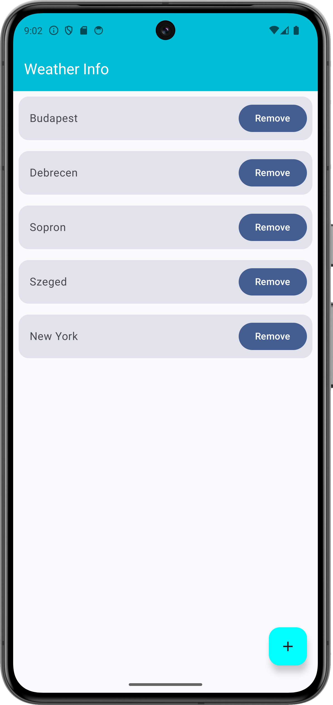
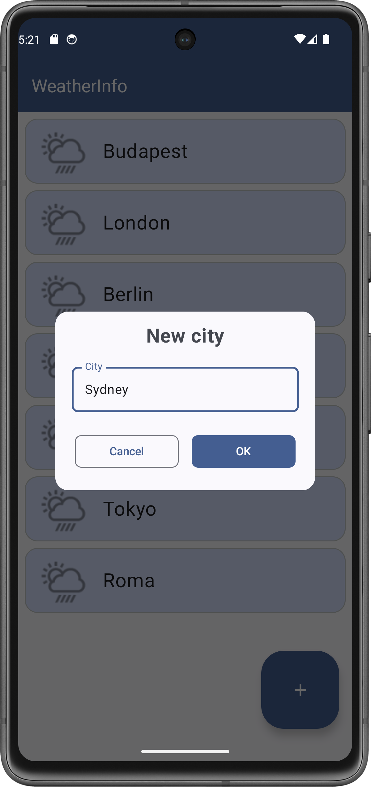
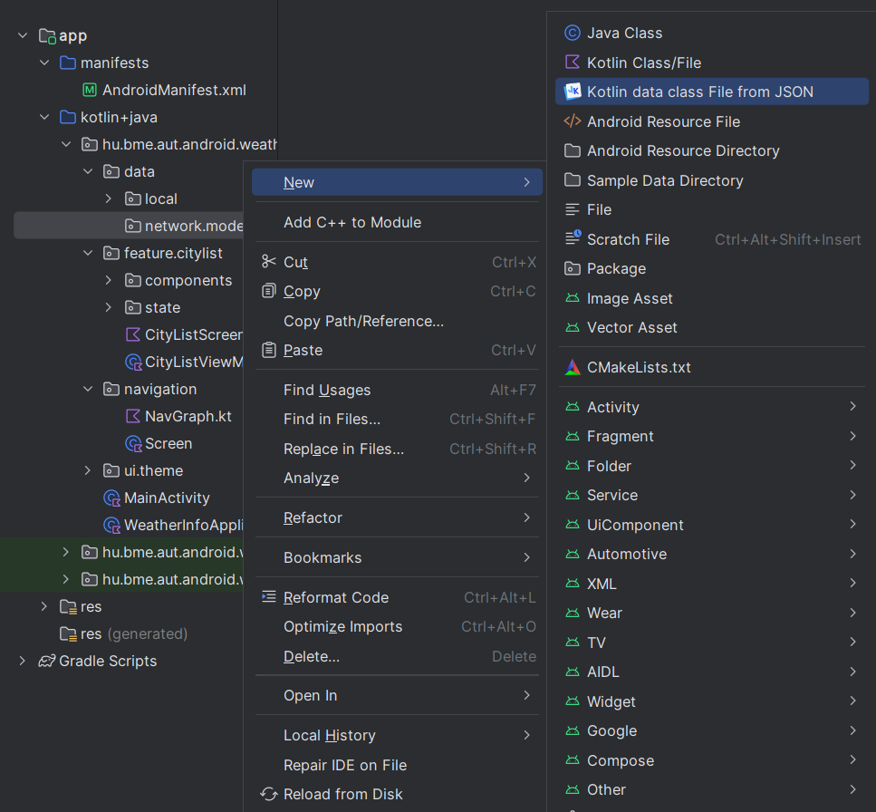

# Labor 07 - Retrofit - Időjárás alkalmazás

## Bevezető

A labor során egy időjárás információkat megjelenítő alkalmazás elkészítése a feladat. A korábban látott UI elemek használata mellett láthatunk majd példát hálózati kommunkáció hatékony megvalósítására is a [`Retrofit`](https://square.github.io/retrofit/) könyvtár felhasználásával.

Az alkalmazás városok listáját jeleníti meg egy [`LazyColumn`](https://developer.android.com/develop/ui/compose/lists)-ban, a kiválasztott város időjárás adatait pedig az [OpenWeatherMap](https://openweathermap.org/) *REST API*-jának segítségével kérdezi le.  Új város hozzáadására egy  [`FloatingActionButton`](https://developer.android.com/guide/topics/ui/floating-action-button) megnyomásával van lehetőség. 

!!!info "REST"
    REST = [Representational State Transfer](https://en.wikipedia.org/wiki/Representational_state_transfer)

Felhasznált technológiák: 

- [`Activity`](https://developer.android.com/guide/components/activities/intro-activities)
- [`LazyColumn`](https://developer.android.com/develop/ui/compose/lists)
- [`Retrofit`](https://square.github.io/retrofit/)
- [`Moshi`](https://github.com/square/moshi)
- [`Coil`](https://github.com/coil-kt/coil)
- [`ViewModel`](https://developer.android.com/topic/libraries/architecture/viewmodel)
- [`NavHost`](https://developer.android.com/develop/ui/compose/navigation)
- [`SwipeToDismissBox`](https://developer.android.com/reference/kotlin/androidx/compose/material3/package-summary#SwipeToDismissBox(androidx.compose.material3.SwipeToDismissBoxState,kotlin.Function1,androidx.compose.ui.Modifier,kotlin.Boolean,kotlin.Boolean,kotlin.Boolean,kotlin.Function1))


## Az alkalmazás specifikációja

Az alkalmazás egy `Activity`-ből áll. 

Az alkalmazás indulásakor megjelenő `CityListScreen` a felhasználó által felvett városok listáját jeleníti meg. A városokat balra elhúzva az adott város törlődik a listából. Új várost a nézet jobb alsó sarkában található `FloatingActionButton` megnyomásával lehet felvenni.

Egy városra való kattintás hatására a `NavGraph` segítségével egy új *Composable* képernyőt hozunk előtérbe az adott város időjárás adataival. A rövid jellemzés mellett egy akutális ikon és a  városban mért átlagos, minimum és maximum hőmérséklet, a légnyomás és a páratartalom értéke látható.

<p align="center">



</p>


## Laborfeladatok

A labor során az alábbi feladatokat a laborvezető segítségével, illetve a jelölt feladatokat önállóan kell megvalósítani.

1. Város lista megvalósítása: 1 pont
1. Időjárás nézet létrehozása és bekötése a navigációba: 2 pont
1. Hálózati kommunikáció megvalósítása: 1 pont
1. Önálló feladat: város listából törlés megvalósítása: 1 pont

A labor során egy komplex időjárás alkalmazás készül el. A labor szűkös időkerete miatt szükség lesz nagyobb kódblokkok másolására, azonban minden esetben figyeljünk a laborvezető magyarázatára, hogy a kódrészek érthetőek legyenek. A cél a bemutatott kódok megértése és a felhasznált libraryk használatának elsajátítása.

*Elnézést kérünk  az eddigieknél nagyobb kód blokkokért, de egy ilyen, bemutató jellegű feladat kisebb méretben nem oldható meg, illetve a labor elveszítené a lényegét, ha csak egy „hello world” hálózati kommunikációs lekérést valósítanánk meg. Köszönjük a megértést.*


## Előkészületek

A feladatok megoldása során ne felejtsd el követni a [feladat beadás folyamatát](../../tudnivalok/github/GitHub.md).


### Git repository létrehozása és letöltése

1. Moodle-ben keresd meg a laborhoz tartozó meghívó URL-jét és annak segítségével hozd létre a saját repository-dat.

2. Várd meg, míg elkészül a repository, majd checkout-old ki.

    !!! tip ""
        Egyetemi laborokban, ha a checkout során nem kér a rendszer felhasználónevet és jelszót, és nem sikerül a checkout, akkor valószínűleg a gépen korábban megjegyzett felhasználónévvel próbálkozott a rendszer. Először töröld ki a mentett belépési adatokat (lásd [itt](../../tudnivalok/github/GitHub-credentials.md)), és próbáld újra.

3. Hozz létre egy új ágat `megoldas` néven, és ezen az ágon dolgozz.

4. A `neptun.txt` fájlba írd bele a Neptun kódodat. A fájlban semmi más ne szerepeljen, csak egyetlen sorban a Neptun kód 6 karaktere.

### Projekt létrehozása

Első lépésként indítsuk el az Android Studio-t, majd:  
1. Hozzunk létre egy új projektet, válasszuk az *Empty Activity* lehetőséget.  
2. A projekt neve legyen `WeatherInfo`, a kezdő package pedig `hu.bme.aut.android.weatherinfo`  
3. Nyelvnek válasszuk a *Kotlin*-t.
4. A minimum API szint legyen **API24: Android 7.0.**
5. A *Build configuration language* Kotlin DSL legyen.

!!!danger "FILE PATH"
	A projekt a repository-ban lévő WeatherInfo könyvtárba kerüljön, és beadásnál legyen is felpusholva! A kód nélkül nem tudunk maximális pontot adni a laborra!


### Függőségek felvétele

Vegyük fel a szükséges könyvtárakat a `libs.versions.toml` fájlban:
```toml
[versions]
coilCompose = "2.6.0"
moshi = "1.15.1"
retrofit = "2.11.0"
navigationCompose = "2.8.2"

[libraries]
androidx-navigation-compose = { group = "androidx.navigation", name="navigation-compose", version.ref = "navigationCompose" }
coil-compose = { group = "io.coil-kt", name="coil-compose", version.ref = "coilCompose" }
squareup-moshi = { group = "com.squareup.moshi", name = "moshi-kotlin", version.ref = "moshi" }
converter-moshi = { group = "com.squareup.retrofit2", name = "converter-moshi", version.ref = "retrofit" }
retrofit = { group = "com.squareup.retrofit2", name = "retrofit", version.ref = "retrofit" }
```

Majd az *app* modulhoz tartozó `build.gradle` fájlban a `dependencies` blokkhoz adjuk hozzá az alábbiakat:

```kotlin
dependencies{
    implementation(libs.androidx.navigation.compose)
    implementation(libs.retrofit)
    implementation(libs.squareup.moshi)
    implementation(libs.converter.moshi)
    implementation(libs.coil.compose)
}
```

Ezután kattintsunk a jobb felső sarokban megjelenő **Sync now** gombra.


!!!info "Retrofit"
    A `Retrofit` a fejlesztő által leírt egyszerű, megfelelően annotált interfészek alapján kódgenerálással állít elő HTTP hivásokat lebonyolító implementációt. Kezeli az URL-ben inline módon adott paramétereket, az URL queryket, stb. Támogatja a legnépszerűbb szerializáló/deszerializáló megoldásokat is (pl.: [`Gson`](https://github.com/google/gson), [`Moshi`](https://github.com/square/moshi), [`Simple XML`](https://sourceforge.net/projects/simple/), stb.), amikkel Java/Kotlin objektumok, és JSON vagy XML formátumú adatok közötti kétirányú átalakítás valósítható meg. A laboron ezek közül a `Moshi`-t fogjuk használni a JSON-ban érkező időjárás adatok konvertálására.

!!!info "Coil"
    A `Coil`  egy hatékony képbetöltést és cache-elést megvalósító library Androidra. Egyszerű *interface*-e és hatékonysága miatt használjuk.

### Engedélyek felvétele
Az alkalmazásban szükségünk lesz internet elérésre. Vegyük fel az `AndroidManifest.xml` állományban az *Internet permission*-t az `application` tagen *kívülre*:

```xml
<uses-permission android:name="android.permission.INTERNET" />
```

!!!info "Engedélyek"
    Androidon API 23-tól (6.0, Marshmallow) az engedélyek két csoportba lettek osztva. A *normal* csoportba tartozó engedélyeket elég felvenni az `AndroidManifest.xml` fájlba az előbb látott módon és az alkalmazás automatikusan megkapja őket. A *dangerous* csoportba tartozó engedélyek esetén ez már nem elég, futás időben explicit módon el kell kérni őket a felhasználótól, aki akármikor meg is tagadhatja az alkalmazástól a kért engedélyt. Az engedélyek kezeléséről bővebben a [developer.android.com](https://developer.android.com/guide/topics/permissions/overview) oldalon lehet tájékozódni.


### Erőforrások hozzáadása

Töltsük le az alkalmazásban használt képeket tartalmazó [tömörített fájlt](./downloads/res.zip), majd helyezzük el a tartalmát a projektünk *res* mappájába.

Vegyük fel az alábbi szöveges erőforrásokat a `res/values/strings.xml`-be:

```xml
<resources>
    <string name="app_name">WeatherInfo</string>
    <string name="new_city">New city</string>
    <string name="ok">OK</string>
    <string name="cancel">Cancel</string>
    <string name="weather_in">Weather in %1$s</string>
    <string name="some_error_message">Something went wrong.</string>
    <string name="label_temperature">Temperature</string>
    <string name="label_min_temperature">Min. temperature</string>
    <string name="label_max_temperature">Max. temperature</string>
    <string name="label_pressure">Pressure</string>
    <string name="label_humidity">Humidity</string>
    <string name="new_city_hint">City</string>
</resources>
```

### OpenWeatherMap API kulcs

Regisztráljunk saját felhasználót az [OpenWeatherMap](https://openweathermap.org/) oldalon, és hozzunk létre egy API kulcsot, aminek a segítségével használhatjuk majd a szolgáltatást az alkalmazásunkban! 

1. Kattintsunk a *Sign in* majd a *Create an account* gombra.
2. Töltsük ki a regisztrációs formot
3. A *Company* mező értéke legyen "BME", a *Purpose* értéke legyen "Education/Science"
4. Sikeres regisztráció után az *API keys* tabon található az alapértelmezettként létrehozott API kulcs.

A kapott API kulcsra később szükségünk lesz az időjárás adatokat lekérő API hívásnál.

## Városlista megvalósítása (1 pont)

Valósítsuk meg az egy `LazyColumn`-ból álló, városok listáját megjelenítő `CityListScreen`-t!

A város nevére kattintva jelenik majd meg az időjárás nézet (*WeatherScreen*), ahol az időjárás információk letöltése fog történni. Új város felvételére egy *FloatingActionButton* fog szolgálni.

### Az architektúra kialakítása

Az adatok forrása az előző laboron látottakhoz hasonlóan egy *repository* lesz. Innen fogjuk visszakapni a (jelenleg csak a memóriában tárolt) várokainkat.

#### A modell osztály
Vegyünk fel a fő *package*-ünkbe egy `data`, majd ezen belül egy `local`, majd ezen belül egy `model` *package*-et. Ide fog kerülni a városainkat reprezentáló osztály, ami jelen esetben csupán egy *id*-val és egy *névvel* rendelkezik.

`City.kt`:

```kotlin
package hu.bme.aut.android.weatherinfo.data.local.model

class City(
    var id: Int,
    var name: String
)
```

#### A repository

Ez után már elkészíthetjük a *repository*-jainkat a már látott módon a `hu.bme.aut.android.weatherinfo.data.local.repository` *package*-ben.

`ICityRepository.kt`:

```kotlin
package hu.bme.aut.android.weatherinfo.data.local.repository

import hu.bme.aut.android.weatherinfo.data.local.model.City
import kotlinx.coroutines.flow.Flow

interface ICityRepository {

    fun getAllCities(): Flow<List<City>>
    suspend fun addCityByName(cityName: String)
}
```

`MemoryCityRepository.kt`:

```kotlin
package hu.bme.aut.android.weatherinfo.data.local.repository

import androidx.compose.runtime.mutableStateListOf
import hu.bme.aut.android.weatherinfo.data.local.model.City
import kotlinx.coroutines.flow.Flow
import kotlinx.coroutines.flow.flow

class MemoryCityRepository : ICityRepository {
    private var nextId=3

    private var cities = mutableStateListOf(
        City(id = 0, "Budapest"),
        City(id = 1, "London"),
        City(id = 2, "Berlin")
    )

    override fun getAllCities(): Flow<List<City>> = flow {
        emit(cities)
    }

    override suspend fun addCityByName(cityName: String) {
        cities.add(City(id = nextId++, name = cityName))
    }

}
```

A *repository* elkészítése után példányosítsuk is azt az *application* osztályunkban a `hu.bme.aut.android.weatherinfo` *package*-ben.

`WeatherInfo.kt`:

```kotlin
package hu.bme.aut.android.weatherinfo

import android.app.Application
import hu.bme.aut.android.weatherinfo.data.local.repository.ICityRepository
import hu.bme.aut.android.weatherinfo.data.local.repository.MemoryCityRepository

class WeatherInfoApplication : Application() {
    companion object {

        lateinit var cityRepository: ICityRepository
    }

    override fun onCreate() {
        super.onCreate()

        cityRepository = MemoryCityRepository()
    }
}
```

Majd pedig az `AndroidManifest.xml`-ben állítsuk be az *application* osztályunk használatát.

`AndroidManifest.xml`:


```xml
...
<application
        android:name=".WeatherInfoApplication"
...
```

#### A ViewModel

Miután a *repository*-val megvagyunk, folytathatjuk a következő réteggel, a *viewmodel*-lel. A városlistához tartozó *viewmodel*-t és *screen*-t a `hu.bme.aut.android.weatherinfo.feature.citylist` *package*-ben fogjuk elkészíteni. Hozzunk tehát létre itt egy új *package*-et az állapotnak `state` néven, majd helyezzük is el benne a `CityListState`-et.

`CityListState.kt`:

```kotlin
package hu.bme.aut.android.weatherinfo.feature.citylist.state

import hu.bme.aut.android.weatherinfo.data.local.model.City


sealed class CityListState {
    data object Loading : CityListState()
    data class Error(val error: Throwable) : CityListState()
    data class Result(val cityList: List<City>) : CityListState()
}
```

Ezek után a `citylist` *package*-be jöhet a *viewmodel*:

`CityListViewModel.kt`:

```kotlin
package hu.bme.aut.android.weatherinfo.feature.citylist

import androidx.lifecycle.ViewModel
import androidx.lifecycle.ViewModelProvider
import androidx.lifecycle.viewModelScope
import androidx.lifecycle.viewmodel.initializer
import androidx.lifecycle.viewmodel.viewModelFactory
import hu.bme.aut.android.weatherinfo.WeatherInfoApplication
import hu.bme.aut.android.weatherinfo.data.local.model.City
import hu.bme.aut.android.weatherinfo.data.local.repository.ICityRepository
import hu.bme.aut.android.weatherinfo.feature.citylist.state.CityListState
import kotlinx.coroutines.flow.MutableStateFlow
import kotlinx.coroutines.flow.asStateFlow
import kotlinx.coroutines.flow.collectLatest
import kotlinx.coroutines.launch

class CityListViewModel(
    private val cityRepository: ICityRepository
) : ViewModel() {

    private val _state = MutableStateFlow<CityListState>(CityListState.Loading)
    val state = _state.asStateFlow()

    init {
        getAllCities()
    }

    private fun getAllCities() {
        viewModelScope.launch {
            _state.value = CityListState.Loading
            try {
                cityRepository.getAllCities().collectLatest{
                    _state.tryEmit(CityListState.Result(it))
                }
            } catch (e: Exception) {
                _state.value = CityListState.Error(e)
            }
        }
    }

    fun addCity(city: String) {
        viewModelScope.launch {
            try {
                cityRepository.addCityByName(city)
            } catch (e: Exception) {
                e.printStackTrace()
            }
        }
    }

    companion object {
        val Factory: ViewModelProvider.Factory = viewModelFactory {
            initializer {
                CityListViewModel(
                    cityRepository = WeatherInfoApplication.cityRepository
                )
            }
        }
    }
}
```

### A városlista képernyő megvalósítása

Immáron a város adataink készen állnak arra, hogy megjelenítsük azokat a felületen. A `CityListScreen` elkészítése előtt azonban először az azt alkotó komponenseket készítsük el.

#### A komponensek elkészítése

A városainkat egy *kártyán* fogjuk megjeleníteni, aminek van egy ikonja, ami egyelőre csak egy *placeholder*, egy felirata, valamint egy `SwipeToDismissBox` segítségével megvalósítja azt, hogy ha balra húzzuk, akkor törlődik. Készítsük el ezt a komponenst a `hu.bme.aut.android.weatherinfo.feature.citylist.components` *package*-ben.

`CityCard.kt`:

```kotlin
package hu.bme.aut.android.weatherinfo.feature.citylist.components

import androidx.compose.foundation.background
import androidx.compose.foundation.clickable
import androidx.compose.foundation.layout.Arrangement
import androidx.compose.foundation.layout.Row
import androidx.compose.foundation.layout.fillMaxSize
import androidx.compose.foundation.layout.fillMaxWidth
import androidx.compose.foundation.layout.padding
import androidx.compose.foundation.layout.size
import androidx.compose.foundation.shape.RoundedCornerShape
import androidx.compose.material.icons.Icons
import androidx.compose.material.icons.filled.Delete
import androidx.compose.material3.ExperimentalMaterial3Api
import androidx.compose.material3.Icon
import androidx.compose.material3.ListItem
import androidx.compose.material3.ListItemDefaults
import androidx.compose.material3.MaterialTheme
import androidx.compose.material3.OutlinedCard
import androidx.compose.material3.SwipeToDismissBox
import androidx.compose.material3.SwipeToDismissBoxValue
import androidx.compose.material3.Text
import androidx.compose.material3.rememberSwipeToDismissBoxState
import androidx.compose.runtime.Composable
import androidx.compose.ui.Alignment
import androidx.compose.ui.Modifier
import androidx.compose.ui.graphics.Color
import androidx.compose.ui.res.painterResource
import androidx.compose.ui.tooling.preview.Preview
import androidx.compose.ui.unit.dp
import androidx.compose.ui.unit.sp
import hu.bme.aut.android.weatherinfo.R

@OptIn(ExperimentalMaterial3Api::class)
@Composable
fun CityCard(
    city: String,
    onCityClick: (String) -> Unit,
    onDelete: (String) -> Unit
) {
    val dismissState = rememberSwipeToDismissBoxState(confirmValueChange = {
        if (it == SwipeToDismissBoxValue.EndToStart) {
            onDelete(city)
        }
        return@rememberSwipeToDismissBoxState true
    },
        // positional threshold of 25%
        positionalThreshold = { it * .25f }
    )
    OutlinedCard(
        modifier = Modifier
            .fillMaxWidth(),
        shape = RoundedCornerShape(16.dp)
    ) {
        SwipeToDismissBox(
            enableDismissFromStartToEnd = false,
            state = dismissState,
            backgroundContent = {
                Row(
                    modifier = Modifier
                        .fillMaxSize()
                        .background(
                            when (dismissState.dismissDirection) {
                                SwipeToDismissBoxValue.EndToStart -> Color.Red
                                else -> MaterialTheme.colorScheme.background
                            }
                        )
                        .padding(12.dp, 8.dp),
                    verticalAlignment = Alignment.CenterVertically,
                    horizontalArrangement = Arrangement.End
                ) {
                    Icon(
                        imageVector = Icons.Default.Delete,
                        contentDescription = "Delete"
                    )
                }
            }
        ) {
            ListItem(
                colors = ListItemDefaults.colors(containerColor = MaterialTheme.colorScheme.primaryContainer),
                headlineContent = {
                    Text(
                        text = city,
                        fontSize = 24.sp
                    )

                },
                leadingContent = {
                    Icon(
                        modifier = Modifier
                            .size(64.dp),
                        painter = painterResource(id = R.drawable.ic_placeholder),
                        contentDescription = ""
                    )
                },
                modifier = Modifier.clickable(onClick = {
                    onCityClick(
                        city
                    )
                }
                )
            )
        }
    }
}

@Composable
@Preview
fun CityCardPreview() {
    CityCard(city = "Budapest", onCityClick = {}, onDelete = {})
}
```

A megjelenítéshez most nem készítettünk saját komplex elrendezést, inkább a beépített `ListItem` *composable*-t használjuk. A nekünk kellő funkcionalitást, hogy kiírunk egy szöveget, és felhelyezünk egy képet, könnyen megtehetjük a *headlineContent* és a *leadingContent* *property*-kkel.

Figyeljük meg, hogy a `SwipeToDismissBox`-nál hogyan tiltjuk le a balra húzást, és hogyan állítjuk be az állapotát!

A város lista kiírása után már csak annyi dolgunk van, hogy lehetővé tegyük új város felvételét is. Ezt egy egyszerű általános dialógussal fogjuk megtenni, amibe a felhasználó egy szöveget írhat be.

`StringInputDialog.kt`:

```kotlin
package hu.bme.aut.android.weatherinfo.feature.citylist.components

import androidx.compose.foundation.background
import androidx.compose.foundation.layout.Arrangement
import androidx.compose.foundation.layout.Column
import androidx.compose.foundation.layout.Row
import androidx.compose.foundation.layout.Spacer
import androidx.compose.foundation.layout.fillMaxWidth
import androidx.compose.foundation.layout.height
import androidx.compose.foundation.layout.padding
import androidx.compose.foundation.shape.RoundedCornerShape
import androidx.compose.foundation.text.KeyboardOptions
import androidx.compose.material3.Button
import androidx.compose.material3.Card
import androidx.compose.material3.MaterialTheme
import androidx.compose.material3.OutlinedButton
import androidx.compose.material3.OutlinedTextField
import androidx.compose.material3.Text
import androidx.compose.runtime.Composable
import androidx.compose.runtime.getValue
import androidx.compose.runtime.mutableStateOf
import androidx.compose.runtime.remember
import androidx.compose.runtime.setValue
import androidx.compose.ui.Alignment
import androidx.compose.ui.Modifier
import androidx.compose.ui.res.stringResource
import androidx.compose.ui.text.font.FontWeight
import androidx.compose.ui.text.input.ImeAction
import androidx.compose.ui.tooling.preview.Preview
import androidx.compose.ui.unit.dp
import androidx.compose.ui.unit.sp
import androidx.compose.ui.window.Dialog
import hu.bme.aut.android.weatherinfo.R

@Composable
fun StringInputDialog(
    modifier: Modifier = Modifier,
    title: String,
    label: String,
    onDismiss: () -> Unit,
    onConfirm: (String) -> Unit
) {
    Dialog(onDismissRequest = onDismiss) {
        Card(shape = RoundedCornerShape(16.dp)) {
            Column(
                modifier = modifier
                    .fillMaxWidth()
                    .background(MaterialTheme.colorScheme.background)
                    .padding(16.dp),
                horizontalAlignment = Alignment.CenterHorizontally,
                verticalArrangement = Arrangement.Center
            ) {
                Text(
                    text = title,
                    fontWeight = FontWeight.Bold,
                    fontSize = 24.sp
                )
                Spacer(modifier = Modifier.height(16.dp))
                var input by remember { mutableStateOf("") }
                var isInputError by remember { mutableStateOf(input.isEmpty()) }
                OutlinedTextField(
                    shape = RoundedCornerShape(8.dp),
                    value = input,
                    onValueChange = {
                        input = it
                        isInputError = it.isEmpty()
                    },
                    maxLines = 1,
                    isError = isInputError,
                    keyboardOptions = KeyboardOptions(imeAction = ImeAction.Done),
                    label = { Text(text = label) }
                )
                Spacer(modifier = Modifier.height(16.dp))
                Row(
                    modifier = Modifier.fillMaxWidth(),
                    horizontalArrangement = Arrangement.SpaceEvenly
                ) {
                    OutlinedButton(
                        onClick = onDismiss,
                        shape = RoundedCornerShape(8.dp),
                        modifier = modifier
                            .weight(1f)
                            .padding(8.dp)
                    ) {
                        Text(stringResource(id = R.string.cancel))
                    }
                    Button(
                        onClick = {
                            if (!isInputError) {
                                onConfirm(input)
                                onDismiss()
                            }
                        },
                        shape = RoundedCornerShape(8.dp),
                        modifier = modifier
                            .weight(1f)
                            .padding(8.dp)
                    ) {
                        Text(stringResource(id = R.string.ok))
                    }
                }
            }
        }
    }
}

@Composable
@Preview
fun StringInputDialogPreview() {
    StringInputDialog(
        title = "New City",
        label = "City name",
        onDismiss = {},
        onConfirm = {}
    )
}
```

Ennek a függvénynek két lambda paramétere lesz, `onDismiss` ez fog felelni azért hogy a dialógus ablakunkat el tudjuk tüntetni, illetve az `onConfirm`, ami pedig az új város hozzáadását teszi lehetővé. Ezeket a lambda paramétereket továbbadjuk paraméterként a többi függvénynek a következő képpen.

- `onDismiss` - Ezt a paramétert mind a két gomb meg kell hogy kapja, ugyanis ha hozzáadtunk egy új várost azt szeretnénk hogy eltűnjön az ablak, illetve ha meggondolnánk magunkat és nem szeretnénk új várost felvenni akkor is el kell tüntetni az ablakot.
- `onConfirm` - Ezt csak a pozitív gombra fogjuk rátenni, egy *string* paraméterrel, ami pedig a beviteli mező szerint lesz változtatható.


#### A CityListScreen elkészítése

Miután elkészültönk a *viewmodel*-lel és a komponensekkel is, nincs más hátra, minthogy összerakjuk a `CityListScreen`-t a `hu.bme.aut.android.weatherinfo.feature.citylist` *package*-ben.

`CityListScreen.kt`:

```kotlin
package hu.bme.aut.android.weatherinfo.feature.citylist

import androidx.compose.foundation.layout.Spacer
import androidx.compose.foundation.layout.height
import androidx.compose.foundation.layout.padding
import androidx.compose.foundation.lazy.LazyColumn
import androidx.compose.foundation.lazy.items
import androidx.compose.material.icons.Icons
import androidx.compose.material.icons.filled.Add
import androidx.compose.material3.CircularProgressIndicator
import androidx.compose.material3.ExperimentalMaterial3Api
import androidx.compose.material3.Icon
import androidx.compose.material3.LargeFloatingActionButton
import androidx.compose.material3.MaterialTheme
import androidx.compose.material3.Scaffold
import androidx.compose.material3.Text
import androidx.compose.material3.TopAppBar
import androidx.compose.material3.TopAppBarDefaults
import androidx.compose.runtime.Composable
import androidx.compose.runtime.getValue
import androidx.compose.runtime.mutableStateOf
import androidx.compose.runtime.remember
import androidx.compose.runtime.setValue
import androidx.compose.ui.Modifier
import androidx.compose.ui.res.stringResource
import androidx.compose.ui.tooling.preview.Preview
import androidx.compose.ui.unit.dp
import androidx.lifecycle.compose.collectAsStateWithLifecycle
import androidx.lifecycle.viewmodel.compose.viewModel
import hu.bme.aut.android.weatherinfo.R
import hu.bme.aut.android.weatherinfo.feature.citylist.components.CityCard
import hu.bme.aut.android.weatherinfo.feature.citylist.components.StringInputDialog
import hu.bme.aut.android.weatherinfo.feature.citylist.state.CityListState

@OptIn(ExperimentalMaterial3Api::class)
@Composable
fun CityListScreen(
    onCityClick: (String) -> Unit,
    viewModel: CityListViewModel = viewModel(factory = CityListViewModel.Factory)
) {

    val state = viewModel.state.collectAsStateWithLifecycle().value

    var isNewCityDialogOpen by remember { mutableStateOf(false) }

    Scaffold(
        topBar = {
            TopAppBar(
                title = { Text(text = stringResource(id = R.string.app_name)) },
                colors = TopAppBarDefaults.topAppBarColors(
                    containerColor = MaterialTheme.colorScheme.primary,
                    titleContentColor = MaterialTheme.colorScheme.onPrimary
                )
            )
        },
        floatingActionButton = {
            LargeFloatingActionButton(
                onClick = {
                    isNewCityDialogOpen = true
                },
                containerColor = MaterialTheme.colorScheme.primary
            ) {
                Icon(
                    imageVector = Icons.Default.Add,
                    contentDescription = null
                )
            }
        }
    ) { innerPadding ->
        when (state) {
            is CityListState.Loading -> CircularProgressIndicator()
            is CityListState.Error -> {
                Text(text = state.error.toString())
            }

            is CityListState.Result -> {
                LazyColumn(
                    modifier = Modifier
                        .padding(innerPadding)
                        .padding(8.dp)
                ) {
                    items(items = state.cityList, key = { item -> item.id }) { city ->
                        CityCard(
                            city = city.name,
                            onCityClick = onCityClick,
                            onDelete = { /*TODO remove city*/ }
                        )
                        if (state.cityList.size - 1 > state.cityList.indexOf(city)) {
                            Spacer(modifier = Modifier.height(8.dp))
                        }
                    }
                }
            }
        }


        if (isNewCityDialogOpen) {

            StringInputDialog(
                onDismiss = { isNewCityDialogOpen = false },
                onConfirm = { cityList ->
                    viewModel.addCity(cityList)
                    isNewCityDialogOpen = false
                },
                title = stringResource(id = R.string.new_city),
                label = stringResource(id = R.string.new_city_hint)
            )
        }
    }
}

@Composable
@Preview
fun CityListScreenPreview() {
    CityListScreen(onCityClick = {})
}
```

### A navigáció elkészítése

A szokásoknak megfelelően, a navigációhoz `NavGraph`-ot fogunk használni. Készítsük tehát el a `hu.bme.aut.android.weatherinfo.navigation` *package*-ben a szükséges osztályokat.

`Screen.kt`:

```kotlin
package hu.bme.aut.android.weatherinfo.navigation

sealed class Screen(val route: String) {
    object CityListScreen : Screen(route = "city_list")
}
```

`NavGraph.kt`:

```kotlin
package hu.bme.aut.android.weatherinfo.navigation

import androidx.compose.runtime.Composable
import androidx.compose.ui.Modifier
import androidx.navigation.NavHostController
import androidx.navigation.NavType
import androidx.navigation.compose.NavHost
import androidx.navigation.compose.composable
import androidx.navigation.compose.rememberNavController
import hu.bme.aut.android.weatherinfo.feature.citylist.CityListScreen

@Composable
fun NavGraph(
    modifier: Modifier = Modifier,
    navController: NavHostController = rememberNavController(),
    startDestination: String = Screen.CityListScreen.route
) {

    NavHost(
        navController = navController,
        startDestination = startDestination,
        modifier = modifier
    ) {

        composable(Screen.CityListScreen.route) {
            CityListScreen(
                onCityClick = { /*TODO navigation*/ }
            )
        }
    }
}
```

Végül tegyük fel a `MainActivity`-re a `NavGraph`-unkat.

`MainActivity.kt`:

```kotlin
package hu.bme.aut.android.weatherinfo

import android.os.Bundle
import androidx.activity.ComponentActivity
import androidx.activity.compose.setContent
import androidx.activity.enableEdgeToEdge
import hu.bme.aut.android.weatherinfo.navigation.NavGraph
import hu.bme.aut.android.weatherinfo.ui.theme.WeatherInfoTheme

class MainActivity : ComponentActivity() {
    override fun onCreate(savedInstanceState: Bundle?) {
        super.onCreate(savedInstanceState)
        enableEdgeToEdge()
        setContent {
            WeatherInfoTheme {
                NavGraph()
            }
        }
    }
}
```

Ezen a ponton már megjelenik a város lista, és fel is tudunk venni bele új elemet.

Próbáljuk ki az alkalmazást!

!!!example "BEADANDÓ (1 pont)"
	Készíts egy **képernyőképet**, amelyen látszik a **városnevek listája egy újonnan hozzáadott várossal amelynek a neve a NEPTUN kódod** (emulátoron, készüléket tükrözve vagy képernyőfelvétellel), a **NewCityDialog** kódja, valamint a **neptun kódod a kódban valahol kommentként**! A képet a megoldásban a repository-ba f1.png néven töltsd föl!

	A képernyőkép szükséges feltétele a pontszám megszerzésének.

## Az időjárás nézet létrehozása és bekötése a navigációba (2 pont)

### Az architektúra kialakítása

Az adataink áramlása hasonló lesz a már korábban látottakhoz, (*repository* -> *viewmodel* -> *screen*) szóval készítsük is el ezeket.

#### Modell osztályok

Az [OpenWeatherMAp API](https://openweathermap.org/current) a kéréseinkre válaszként egy JSON objektumban fogja visszaadni az aktuális időjárást. 

!!!info "API hívás (az {appID} lecserélendő a sajátra)"
	https://api.openweathermap.org/data/2.5/weather?q=Budapest&units=metric&appid={appId}

???info "Api válasz"
	```json
	{
		"coord": {
			"lon":19.0399,
			"lat":47.498
		},
		"weather": [
			{
				"id":741,
				"main":"Fog",
				"description":"fog",
				"icon":"50n"
			}
		],
		"base":"stations",
		"main": {
				"temp":9.98,
				"feels_like":9.98,
				"temp_min":8.93,
				"temp_max":10.71,
				"pressure":1013,
				"humidity":96,
				"sea_level":1013,
				"grnd_level":991
		},
		"visibility":8000,
		"wind": {
			"speed":1.03,
			"deg":0
		},
		"clouds": {
			"all":43
		},
		"dt":1728250809,
		"sys": {
			"type":2,
			"id":2009313,
			"country":"HU",
			"sunrise":1728190192,
			"sunset":1728231218},
			"timezone":7200,
			"id":3054643,
			"name":"Budapest",
		"cod":200
	}
	```

Ahhoz, hogy ebből általunk is használható objektumok legyenek, szükségünk lesz a modell osztály(ok)ra, illetve a `Moshi` könyvtárra, ami a konverziót végzi. Ebben a fázisban először a modell osztályokat készítsük el. Mint látható a kapott *JSON* elég bonyolult, és sok al csomópontot tartalmaz. Szerencsére az osztályainkat nem kell kézzel a *JSON*-ből kisilabizálni. Egyrészt a legtöbb *API*-nál kiterjedt leírást kapunk a modellről, másrészt számos konverter létezik a *JSON* -> *Kotlin class* konverzióra. Mi most egy Android Studio Plugin segítségét fogjuk kérni.

Keressük meg az Android Studio beállításai között a *Plugins*-t, ott pedig a *Marketplace* keresőbe írjuk be, hogy *JSPN To Kotlin Class*, és telepítsük a megtalált *plugint*.

<p align="center">

</p>

Ha ez megvan, hozzuk létra a modell osztályok *package*-ét a `hu.bme.aut.android.weatherinfo.data.network.model` helye. Ez után nyomjunk a *package*-re jobb klikket, majd *New*-> *Kotlin data class File from JSON*.

<p align="center">

</p>

A megjelenő ablakban pedig a *JSON Text* helyére illesszük be a válaszként kapott *JSON*-ünket, névnek pedig adjuk meg a `WeatherData`-t.

A plugin létre is hozta nekünk az összes szükséges Kotlin osztált a konverzióhoz.

???info "Modell osztályok"

	`Cloud.kt`:

	```kotlin
	@Serializable
	data class Clouds(
	    val all: Long
	)
	```

	`Coord.kt`:

	```kotlin
	@Serializable
	data class Coord(
	    val lon: Double,
	    val lat: Double
	)
	```

	
	`Main.kt`:

	```kotlin
	@Serializable
	data class Main(
	    val temp: Double,
	
	    @SerialName("feels_like")
	    val feels_like: Double,
	
	    @SerialName("temp_min")
	    val temp_min: Double,
	
	    @SerialName("temp_max")
	    val temp_max: Double,
	
	    val pressure: Long,
	    val humidity: Long,
	    val sea_level: Long,
	    val grnd_level: Long
	)
	```

	`Sys.kt`:

	```kotlin
	@Serializable
	data class Sys(
	    val type: Long,
	    val id: Long,
	    val country: String,
	    val sunrise: Long,
	    val sunset: Long
	)
	```

	`Weather.kt`:

	```kotlin
	@Serializable
	data class Weather(
	    val id: Long,
	    val main: String,
	    val description: String,
	    val icon: String
	)
	```

	`WeatherResult.kt`:

	```kotlin
	@Serializable
	data class WeatherResult(
	    val coord: Coord,
	    val weather: List<Weather>,
	    val base: String,
	    val main: Main,
	    val visibility: Long,
	    val wind: Wind,
	    val clouds: Clouds,
	    val dt: Long,
	    val sys: Sys,
	    val timezone: Long,
	    val id: Long,
	    val name: String,
	    val cod: Long
	)
	```

	`Wind.kt`:

	```kotlin
	@Serializable
	data class Wind(
	    val speed: Double,
	    val deg: Long
	)
	```

####  Repository

Miután megvannak a modell osztályaink, elkészíthetjük a *repository*-t. A `hu.bme.aut.android.weatherinfo.data.network` csomagba készísünk egy `repository` *package*-et, majd abba egy `IWeatherRepository` *interface*-t, aminek egyetlen egy *getWeather()* függvénye lesz.

`IWeatherRepository.kt`:

```kotlin
package hu.bme.aut.android.weatherinfo.data.network.repository

import hu.bme.aut.android.weatherinfo.data.network.model.WeatherData
import retrofit2.Call

interface IWeatherRepository {
    suspend fun getWeather(city: String?): Call<WeatherData?>?
}
```

Ezek alapján a `RetrofitWeatherRepository` (amit majd később kiegészítünk a hálózati hívással):

```kotlin
package hu.bme.aut.android.weatherinfo.data.network.repository

import hu.bme.aut.android.weatherinfo.data.network.model.WeatherData
import retrofit2.Call

class RetrofitWeatherRepository : IWeatherRepository {
    override suspend fun getWeather(city: String?): Call<WeatherData?>? {
        return null
    }
}
```

A *getWeather()* függvény visszatérési értéke egy `Call<WeatherData>` típusú objektum lesz. (A retrofites *Call*-t importáljuk a megjelenő lehetőségek közül.) Ez egy olyan hálózati hívást ír le, aminek a válasza *WeatherData* típusú objektummá alakítható.

Példányosítsuk ismét a *repository*-t az *application osztályunkban.

`WeatherInfoApplication.kt`:

```kotlin
package hu.bme.aut.android.weatherinfo

import android.app.Application
import hu.bme.aut.android.weatherinfo.data.local.repository.ICityRepository
import hu.bme.aut.android.weatherinfo.data.local.repository.MemoryCityRepository
import hu.bme.aut.android.weatherinfo.data.network.repository.IWeatherRepository
import hu.bme.aut.android.weatherinfo.data.network.repository.RetrofitWeatherRepository

class WeatherInfoApplication : Application() {
    companion object {

        lateinit var weatherRepository: IWeatherRepository
        lateinit var cityRepository: ICityRepository
    }

    override fun onCreate() {
        super.onCreate()

        weatherRepository = RetrofitWeatherRepository()
        cityRepository = MemoryCityRepository()
    }
}
```

#### A ViewModel

A *viewmodel*-ünk itt is egy állapotot fog tárolni, amiben az időjárásadatok vannak megfigyelhető formában. Készítsük el tehát először ezt az állapotot a `hu.bme.aut.android.weatherinfo.feature.weather.state` *package*-ben.

`WeatherState.kt`:

```kotlin
package hu.bme.aut.android.weatherinfo.feature.weather.state

import hu.bme.aut.android.weatherinfo.data.network.model.WeatherData

sealed class WeatherState{
    data object Loading: WeatherState()
    data class Error(val error: Throwable): WeatherState()
    data class Success(val weatherData: WeatherData?): WeatherState()
}
```

Most már jöhet a *viewmodel* a `hu.bme.aut.android.weatherinfo.feature.weather` csomagba.

`WeatherViewModel.kt`:

```kotlin
package hu.bme.aut.android.weatherinfo.feature.weather

import androidx.lifecycle.SavedStateHandle
import androidx.lifecycle.ViewModel
import androidx.lifecycle.ViewModelProvider
import androidx.lifecycle.createSavedStateHandle
import androidx.lifecycle.viewModelScope
import androidx.lifecycle.viewmodel.initializer
import androidx.lifecycle.viewmodel.viewModelFactory
import hu.bme.aut.android.weatherinfo.WeatherInfoApplication
import hu.bme.aut.android.weatherinfo.data.network.model.WeatherData
import hu.bme.aut.android.weatherinfo.data.network.repository.IWeatherRepository
import hu.bme.aut.android.weatherinfo.feature.weather.state.WeatherState
import kotlinx.coroutines.flow.MutableStateFlow
import kotlinx.coroutines.flow.asStateFlow
import kotlinx.coroutines.launch
import retrofit2.Call
import retrofit2.Callback
import retrofit2.Response

class WeatherViewModel(
    val savedStateHandle: SavedStateHandle,
    private val weatherRepository: IWeatherRepository
) : ViewModel() {
    private var _state = MutableStateFlow<WeatherState>(WeatherState.Loading)
    val state = _state.asStateFlow()

    private var _cityName = MutableStateFlow<String>(checkNotNull(savedStateHandle["cityName"]))
    val cityName = _cityName.asStateFlow()

    init {
        getWeather(checkNotNull(savedStateHandle["cityName"]))
    }

    private fun getWeather(cityName: String) {
        viewModelScope.launch {
            _state.value = WeatherState.Loading
            try {
                weatherRepository.getWeather(cityName)
                    ?.enqueue(object : Callback<WeatherData?> {
                        override fun onResponse(
                            call: Call<WeatherData?>,
                            response: Response<WeatherData?>
                        ) {
                            if (response.isSuccessful) {
                                _state.tryEmit(WeatherState.Success(response.body()))
                            }
                        }

                        override fun onFailure(
                            call: Call<WeatherData?>,
                            t: Throwable
                        ) {
                            t.printStackTrace()
                            _state.value = WeatherState.Error(t)
                        }
                    })
            } catch (e: Exception) {
                _state.value = WeatherState.Error(e)
            }
        }
    }

    companion object {
        val Factory: ViewModelProvider.Factory = viewModelFactory {
            initializer {
                val savedStateHandle = createSavedStateHandle()
                val weatherReposotory = WeatherInfoApplication.weatherRepository
                WeatherViewModel(
                    savedStateHandle = savedStateHandle,
                    weatherRepository = weatherReposotory
                )
            }
        }
    }
}
```

A `WeatherViewModel` paraméterként megkapja az `IWeatherRepository` egy példányát, valamint egy `SavedStateHandle`-t a városnév paraméter kiolvasásához. Ezen kívül tárolja az állapotot, és a városnevet (a `SavedStateHandle`-ből kiolvasva). Egyetlen függvénye a hálózati hívást korutinnal elvégző *getWeather()*. Tartalmazza még a saját példányosításához szükséges *Factory method*-ot.

Látható, hogy a *getWeather* függvényben a `weatherRepository` *getWeather* függvényének válaszára (ami egy *Call<WeatherData>* objektum, egy *callbacket* helyeztünk el. Ezzel tudjuk kezelni a hálózati hívásunk különböző állapotait.

### Az időjárás felület

#### Komponensek

Az időjárás képernyőn a város neve, aktuális időjárásának jellemzése és egy ikon mellett a konkrét számszerű értékeket is ki szeretnénk írni. Ennek a megvalósításához hozzunk létre egy segéd *composable*-t a `hu.bme.aut.android.weatherinfo.feature.weather.components` *package*-ben, ami a szövegek és értékek egymás mellé írását fogja segíteni.

`WeatherDataText.kt`:

```kotlin
package hu.bme.aut.android.weatherinfo.feature.weather.components

import androidx.compose.foundation.layout.Arrangement
import androidx.compose.foundation.layout.Row
import androidx.compose.foundation.layout.fillMaxWidth
import androidx.compose.material3.Text
import androidx.compose.runtime.Composable
import androidx.compose.ui.Modifier
import androidx.compose.ui.tooling.preview.Preview
import androidx.compose.ui.unit.TextUnit
import androidx.compose.ui.unit.sp

@Composable
fun WeatherDataText(
    modifier: Modifier = Modifier,
    label: String,
    value: String?,
    textSize: TextUnit = TextUnit.Unspecified
) {
    Row(
        modifier = modifier.fillMaxWidth(),
        horizontalArrangement = Arrangement.SpaceBetween
    ) {
        Text(
            text = label,
            fontSize = textSize
        )
        Text(
            text = value ?: "",
            fontSize = textSize
        )
    }
}

@Composable
@Preview(showBackground = true)
fun WeatherDataTextPreview() {
    WeatherDataText(
        label = "Temperature",
        value = "20",
        textSize = 16.sp
    )
}
```

### A WeatherScreen elkészítése

Most már minden készen áll ahhoz, hogy elkészítsük az időjárás képernyőnket a `hu.bme.aut.android.weatherinfo.feature.weather` *package*-ben.

`WeatherScreen.kt`:

```kotlin
package hu.bme.aut.android.weatherinfo.feature.weather

import androidx.compose.foundation.layout.Box
import androidx.compose.foundation.layout.Column
import androidx.compose.foundation.layout.Spacer
import androidx.compose.foundation.layout.fillMaxSize
import androidx.compose.foundation.layout.padding
import androidx.compose.foundation.layout.size
import androidx.compose.material.icons.Icons
import androidx.compose.material.icons.automirrored.filled.ArrowBack
import androidx.compose.material3.CircularProgressIndicator
import androidx.compose.material3.ExperimentalMaterial3Api
import androidx.compose.material3.Icon
import androidx.compose.material3.IconButton
import androidx.compose.material3.MaterialTheme
import androidx.compose.material3.Scaffold
import androidx.compose.material3.Text
import androidx.compose.material3.TopAppBar
import androidx.compose.material3.TopAppBarDefaults
import androidx.compose.runtime.Composable
import androidx.compose.ui.Alignment
import androidx.compose.ui.Modifier
import androidx.compose.ui.layout.ContentScale
import androidx.compose.ui.platform.LocalContext
import androidx.compose.ui.res.painterResource
import androidx.compose.ui.res.stringResource
import androidx.compose.ui.tooling.preview.Preview
import androidx.compose.ui.unit.dp
import androidx.compose.ui.unit.sp
import androidx.lifecycle.compose.collectAsStateWithLifecycle
import androidx.lifecycle.viewmodel.compose.viewModel
import coil.compose.AsyncImage
import coil.request.ImageRequest
import hu.bme.aut.android.weatherinfo.R
import hu.bme.aut.android.weatherinfo.feature.weather.components.WeatherDataText
import hu.bme.aut.android.weatherinfo.feature.weather.state.WeatherState

@OptIn(ExperimentalMaterial3Api::class)
@Composable
fun WeatherScreen(
    weatherViewModel: WeatherViewModel = viewModel(factory = WeatherViewModel.Factory),
    onNavigateBack: () -> Unit
) {
    val state = weatherViewModel.state.collectAsStateWithLifecycle().value

    val cityName = weatherViewModel.cityName.collectAsStateWithLifecycle().value

    Scaffold(
        modifier = Modifier
            .fillMaxSize(),
        topBar = {
            TopAppBar(
                title = { Text(text = stringResource(R.string.weather_in, cityName)) },
                navigationIcon = {
                    IconButton(onClick = onNavigateBack) {
                        Icon(
                            imageVector = Icons.AutoMirrored.Filled.ArrowBack,
                            contentDescription = ""
                        )
                    }
                },
                colors = TopAppBarDefaults.topAppBarColors(
                    containerColor = MaterialTheme.colorScheme.primary,
                    titleContentColor = MaterialTheme.colorScheme.onPrimary,
                    navigationIconContentColor = MaterialTheme.colorScheme.onPrimary
                )
            )
        })
    { innerPadding ->
        Box(
            modifier = Modifier
                .fillMaxSize()
                .padding(innerPadding)
                .padding(8.dp)
        ) {
            when (state) {
                is WeatherState.Loading -> {
                    CircularProgressIndicator(
                        color = MaterialTheme.colorScheme.secondaryContainer,
                        modifier = Modifier.align(Alignment.Center)
                    )
                }

                is WeatherState.Error -> {
                    Text(
                        text = state.error.message.toString()
                    )
                }

                is WeatherState.Success -> {
                    Column {
                        Text(
                            text = state.weatherData?.weather?.get(0)?.description ?: "",
                            fontSize = 24.sp
                        )
                        AsyncImage(
                            model = ImageRequest.Builder(context = LocalContext.current)
                                .data("https://openweathermap.org/img/w/${state.weatherData?.weather?.first()?.icon}.png")
                                .crossfade(enable = true)
                                .build(),
                            contentDescription = null,
                            contentScale = ContentScale.Crop,
                            placeholder = painterResource(id = R.drawable.ic_placeholder),
                            modifier = Modifier
                                .size(320.dp)
                                .align(Alignment.CenterHorizontally)
                        )

                        Spacer(modifier = Modifier.size(24.dp))

                        WeatherDataText(
                            modifier = Modifier.padding(0.dp, 8.dp, 0.dp, 8.dp),
                            label = stringResource(id = R.string.label_temperature),
                            value = "${state.weatherData?.main?.temp} \u2103",
                            textSize = 24.sp
                        )
                        WeatherDataText(
                            modifier = Modifier.padding(0.dp, 8.dp, 0.dp, 8.dp),
                            label = stringResource(id = R.string.label_min_temperature),
                            value = "${state.weatherData?.main?.temp_min} \u2103",
                            textSize = 24.sp
                        )
                        WeatherDataText(
                            modifier = Modifier.padding(0.dp, 8.dp, 0.dp, 8.dp),
                            label = stringResource(id = R.string.label_max_temperature),
                            value = "${state.weatherData?.main?.temp_max} \u2103",
                            textSize = 24.sp
                        )
                        WeatherDataText(
                            modifier = Modifier.padding(0.dp, 8.dp, 0.dp, 8.dp),
                            label = stringResource(id = R.string.label_pressure),
                            value = "${state.weatherData?.main?.pressure} hPa",
                            textSize = 24.sp
                        )
                        WeatherDataText(
                            modifier = Modifier.padding(0.dp, 8.dp, 0.dp, 8.dp),
                            label = stringResource(id = R.string.label_humidity),
                            value = "${state.weatherData?.main?.humidity} %",
                            textSize = 24.sp
                        )
                    }
                }
            }
        }
    }
}

@Composable
@Preview
fun WeatherScreenPreview() {
    WeatherScreen(onNavigateBack = {})
}
```

A felületünk vázát egy `Scaffold` adja, amiben *topBar*-on kiírjuk a város nevét és felteszünk egy vissza navigációs ikont. Figyeljük meg, hogy hogyan írunk ki paraméteres *stringet* az erőforrások közül.

Az oldal tartalma pedig állapottól függően vagy egy `CircularProgressIndicator`, vagy egy hiba szöveg, vagy pedig az adott város időjárásának adatai. 

Figyeljük meg, hogy hogyan használjuk a kódban a *Coil* library *AsyncImage* függvényét a weben található kép megjelenítésére!

#### Bekötés a navigációba

Egészítsük ki a `Screen` osztályunkat az új képernyővel.

`Screen.kt`:

```kotlin
package hu.bme.aut.android.weatherinfo.navigation

sealed class Screen(val route: String) {
    object CityListScreen : Screen(route = "city_list")

    object WeatherScreen : Screen(route = "weather/{${Args.cityName}}") {
        fun passCityName(cityName: String) = "weather/$cityName"

        object Args {
            const val cityName = "cityName"
        }
    }
}
```

Figyeljük meg, hogy hogyan valósítjuk meg azt, hogy a `WeatherScreen`-nek paraméterül át lehessen adni a városnevet.

Ezek után a frissített `NavGraph`:

```kotlin
package hu.bme.aut.android.weatherinfo.navigation

import androidx.compose.runtime.Composable
import androidx.compose.ui.Modifier
import androidx.navigation.NavHostController
import androidx.navigation.NavType
import androidx.navigation.compose.NavHost
import androidx.navigation.compose.composable
import androidx.navigation.compose.rememberNavController
import androidx.navigation.navArgument
import hu.bme.aut.android.weatherinfo.feature.citylist.CityListScreen
import hu.bme.aut.android.weatherinfo.feature.weather.WeatherScreen

@Composable
fun NavGraph(
    modifier: Modifier = Modifier,
    navController: NavHostController = rememberNavController(),
    startDestination: String = Screen.CityListScreen.route
) {

    NavHost(
        navController = navController,
        startDestination = startDestination,
        modifier = modifier
    ) {

        composable(Screen.CityListScreen.route) {
            CityListScreen(
                onCityClick = { navController.navigate(Screen.WeatherScreen.passCityName(cityName = it)) }
            )
        }
        composable(
            Screen.WeatherScreen.route,
            arguments = listOf(navArgument(Screen.WeatherScreen.Args.cityName) {
                defaultValue = "Budapest"
                type = NavType.StringType
            })
        ) {
            WeatherScreen(onNavigateBack = { navController.popBackStack() })
        }
    }
}
```

Próbáljuk ki az alkalmazást!

Az időjárás képernyőnk megjelenik, ott van a felirat a fejlécen, de a valós adatok nem láthatóak, hiszen a *repository*-nk mindig egy *null* adattal tér vissza. Ezért csak a töltő képernyőt látjuk.

!!!info
	Ha meg akarjuk nézni a `WeatherScreen`-t teljes egészében, írjuk át a *getWeather* függvény elején az állapotot *Loading*-ról *Success*-re.

	```kotlin
	 viewModelScope.launch {
            _state.value = WeatherState.Success(null)
            try {
				...
	```

!!!example "BEADANDÓ (1 pont)"
	Készíts egy **képernyőképet**, amelyen látszik az **időjárás nézet a megfelelő fejléccel** (emulátoron, készüléket tükrözve vagy képernyőfelvétellel), a **WeatherScreen** kódja, valamint a **neptun kódod a kódban valahol kommentként**! A képet a megoldásban a repository-ba f2.png néven töltsd föl! 

	A képernyőkép szükséges feltétele a pontszám megszerzésének.


## A Hálózati kommunikáció elkészítése (1 pont)

### A WeatherAPI megvalósítása

A hálózati kérések végrahajtásához a `Retrofit` külső könyvtárat fogjuk használni. Ennek a függőségeit már a labor elején felvettük a megfelelő helyre, most már csak alkalmazni fogjuk a könyvtár funkcióit.

Hozzunk létre a `hu.bme.aut.android.weatherinfo.data.network` csomagban egy `WeatherApi` Kotlin fájlt.

`WeatherApi.kt`:

```kotlin
package hu.bme.aut.android.weatherinfo.data.network

import hu.bme.aut.android.weatherinfo.data.network.model.WeatherData
import retrofit2.Call
import retrofit2.http.GET
import retrofit2.http.Query

interface WeatherApi {
    @GET("/data/2.5/weather")
    fun getWeather(
        @Query("q") cityName: String?,
        @Query("units") units: String?,
        @Query("appid") appId: String?
    ): Call<WeatherData?>?
}
```

Látható, hogy a *Retrofit*-ben annotációk alkalmazásával tuduk jelezni, hogy az adott függvényhívás milyen hálózati hívásnak fog megfelelni. A `@GET` annotáció *HTTP GET* kérést jelent, a paraméterként adott *string* pedig azt jelzi, hogy hogy a szerver alap *URL*-éhez képest melyik végpontra szeretnénk küldeni a kérést.

!!!note ""
	Hasonló módon tudjuk leírni a többi *HTTP* kérés típust is: *@POST*, *@UPDATE*, *@PATCH*, *@DELETE*

A függvény paremétereit a *@Query* annotációval láttuk el. Ez azt jelenti, hogy a Retrofit az adott paraméter értékét a kéréshez fűzi *query* paraméterként, az annotációban megadott kulccsal.
!!!note ""
	További említésre méltó annotációk a teljesség igénye nélkül: @HEAD, @Multipart, @Field

### A RetrofitWeatherRepository frissítése

Most már készen áll az *interface*-ünk arra, hogy hálózati hívásokat végezzünk rajta keresztül. Cseréljük tehát le a `RetrofitWeatherRepository` *getWeather* függvényében visszaadott *null* értéket az igazi megvalósításra.

`RetrofitWeatherRepository.kt`:

```kotlin
package hu.bme.aut.android.weatherinfo.data.network.repository

import com.squareup.moshi.Moshi
import com.squareup.moshi.kotlin.reflect.KotlinJsonAdapterFactory
import hu.bme.aut.android.weatherinfo.data.network.WeatherApi
import hu.bme.aut.android.weatherinfo.data.network.model.WeatherData
import okhttp3.OkHttpClient
import retrofit2.Call
import retrofit2.Retrofit
import retrofit2.converter.moshi.MoshiConverterFactory

class RetrofitWeatherRepository : IWeatherRepository {
    private val retrofit: Retrofit
    private val weatherApi: WeatherApi

    companion object {
        private const val SERVICE_URL = "https://api.openweathermap.org"
        private const val APP_ID = "APP_ID"
    }

    init {
        val moshi = Moshi.Builder().addLast(KotlinJsonAdapterFactory()).build()
        retrofit = Retrofit.Builder()
            .baseUrl(SERVICE_URL)
            .client(OkHttpClient.Builder().build())
            .addConverterFactory(MoshiConverterFactory.create(moshi))
            .build()
        weatherApi = retrofit.create(WeatherApi::class.java)
    }

    override suspend fun getWeather(city: String?): Call<WeatherData?>? {
        return weatherApi.getWeather(city, "metric", APP_ID)
    }
}
```

Ez az osztály lesz felelős a hálózati kérések lebonyolításáért. 

A `Retrofit.Builder()` hívással kérhetünk egy pareméterezhető `Builder` példányt. Ebben adhatjuk meg a hálózati hívásaink tulajdonságait. Jelen példában beállítjuk az elérni kívánt szolgáltatás címét, a HTTP kliens implementációt ([OkHttp](http://square.github.io/okhttp/)), valamint a JSON és objektum reprezentációk közötti konvertert (Moshi).

A `WeatherApi` interfészből a `Builder`-rel létrehozott `Retrofit` példány segítségével tudjuk elkérni a fordítási időben generált, paraméterezett implementációt.

 A `retrofit.create(WeatherApi.class)` hívás eredményeként kapott objektum megvalósítja a `WeatherApi` interfészt.  Ha ezen az objektumon meghívjuk a `getWeather(...)` függvényt, akkor megtörténik az általunk az interfészben definiált hálózati hívás. 

**Cseréljük le** az `APP_ID` értékét az [OpenWeatherMap](https://openweathermap.org/) oldalon kapott saját API kulcsunkra!

Próbáljuk ki az alkalmazást!

!!!example "BEADANDÓ (1 pont)"
	Készíts egy **képernyőképet**, amelyen látszik az emulátoron egy **város időjárása** (emulátoron, készüléket tükrözve vagy képernyőfelvétellel), a **RetrofitWeatherRepository** kódja, valamint a **neptun kódod a kódban valahol kommentként**! A képet a megoldásban a repository-ba f3.png néven töltsd föl! 

	A képernyőkép szükséges feltétele a pontszám megszerzésének.

## Önálló feladat: város listából törlés megvalósítása (1 pont)

Valósítsuk meg a városok törlését az elemek balra elhúzásának hatására.

???success "A megvalósítás lépései"
	- törlés függvény a *repository interface*-be
	- törlés függvény a *rapository*-ba
	- törlés függvény a *viewmodel*-be
	- törlés eseménykezelő a *CityListScreen*-be

!!!example "BEADANDÓ (1 pont)"
	Készíts egy **képernyőképet**, amelyen látszik az emulátoron a **városok listája CSAK Budapesttel** (emulátoron, készüléket tükrözve vagy képernyőfelvétellel), a **törlés releváns** kódrészlete, valamint a **neptun kódod a kódban valahol kommentként**! A képet a megoldásban a repository-ba f4.png néven töltsd föl!

	A képernyőkép szükséges feltétele a pontszám megszerzésének.

