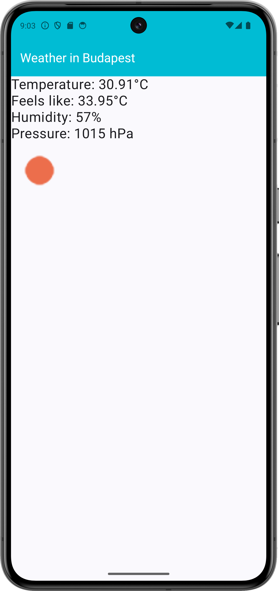
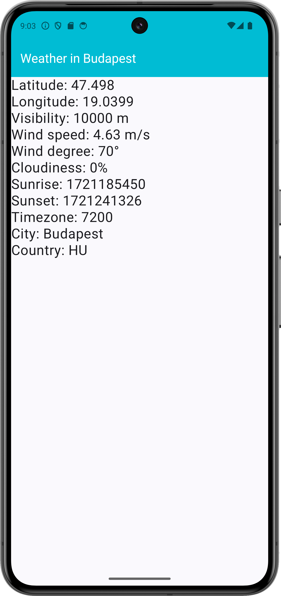

# Labor 07 - Weather Info alkalmazás készítése

## Bevezető

A labor során egy időjárás információkat megjelenítő alkalmazás elkészítése a feladat. A korábban látott UI elemek használata mellett láthatunk majd példát hálózati kommunkáció hatékony megvalósítására is a [`Retrofit`](https://square.github.io/retrofit/) library felhasználásával.

Az alkalmazás városok listáját jeleníti meg egy [`LazyColumn`](https://developer.android.com/develop/ui/compose/lists)-ban, egy kiválasztott város részletes időjárás adatait pedig az [OpenWeatherMap](https://openweathermap.org/) REST API-jának segítségével kérdezi le. A részletező nézeten egy [`HorizontalPager`](https://developer.android.com/develop/ui/compose/layouts/pager)-ben két [`Composable`]()-en lehet megtekinteni a részleteket. Új város hozzáadására egy  [`FloatingActionButton`](https://developer.android.com/guide/topics/ui/floating-action-button) megnyomásával van lehetőség. 

!!!info "REST"
    REST = [Representational State Transfer](https://en.wikipedia.org/wiki/Representational_state_transfer)

<p align="center">



</p>

Felhasznált technológiák: 

- [`Activity`](https://developer.android.com/guide/components/activities/intro-activities)
- [`LazyColumn`](https://developer.android.com/develop/ui/compose/lists)
- [`HorizontalPager`](https://developer.android.com/develop/ui/compose/layouts/pager)
- [`Retrofit`](https://square.github.io/retrofit/)
- [`Gson`](https://github.com/google/gson)
- [`Coil`](https://github.com/coil-kt/coil)
- [`ViewModel`](https://developer.android.com/topic/libraries/architecture/viewmodel)
- [`NavHost`](https://developer.android.com/develop/ui/compose/navigation)

## Az alkalmazás specifikációja

Az alkalmazás egy `Activity`-ből áll. 

Az alkalmazás indulásakor megjelenő `MainScreen` a felhasználó által felvett városok listáját jeleníti meg. Minden lista elemhez tartozik egy *Remove* gomb, aminek a megnyomására az adott város törlődik a listából. Új várost a nézet jobb alsó sarkában található `FloatingActionButton` megnyomásával lehet felvenni.

Egy városra való kattintás hatására a `NavGraph` segítségével egy új *Composable* képernyőt hozunk előtérbe, amelyen egy `HorizontalPager` található az adott város időjárás adataival. Az első oldalon a kiválasztott város időjárásának leírását, és az ahhoz tartozó ikont jeleníti meg. A második oldalon a városban mért átlagos, minimum és maximum hőmérséklet, a légnyomás és a páratartalom értéke látható.

## Laborfeladatok

A labor során az alábbi feladatokat a laborvezető segítségével, illetve a jelölt feladatokat önállóan kell megvalósítani.

1. Város lista megvalósítása: 1 pont
2. Részletező nézet létrehozása és bekötése a navigációba: 1 pont
3. Hálózati kommunikáció megvalósítása: 1 pont
4. A hálózati réteg bekötése a részletező nézetbe: 1 pont
5. Önálló feladat: város listából törlés megvalósítása: 1 pont

A labor során egy komplex időjárás alkalmazás készül el. A labor szűkös időkerete miatt szükség lesz nagyobb kódblokkok másolására, azonban minden esetben figyeljünk a laborvezető magyarázatára, hogy a kódrészek érthetőek legyenek. A cél a bemutatott kódok megértése és a felhasznált libraryk használatának elsajátítása.

*Elnézést kérünk  az eddigieknél nagyobb kód blokkokért, de egy ilyen, bemutató jellegű feladat kisebb méretben nem oldható meg, illetve a labor elveszítené a lényegét, ha csak egy „hello world” hálózati kommunikációs lekérést valósítanánk meg. Köszönjük a megértést.*


## Előkészületek

A feladatok megoldása során ne felejtsd el követni a [feladat beadás folyamatát](../../tudnivalok/github/GitHub.md).


### Git repository létrehozása és letöltése

1. Moodle-ben keresd meg a laborhoz tartozó meghívó URL-jét és annak segítségével hozd létre a saját repository-dat.

2. Várd meg, míg elkészül a repository, majd checkout-old ki.

    !!! tip ""
        Egyetemi laborokban, ha a checkout során nem kér a rendszer felhasználónevet és jelszót, és nem sikerül a checkout, akkor valószínűleg a gépen korábban megjegyzett felhasználónévvel próbálkozott a rendszer. Először töröld ki a mentett belépési adatokat (lásd [itt](../../tudnivalok/github/GitHub-credentials.md)), és próbáld újra.

3. Hozz létre egy új ágat `megoldas` néven, és ezen az ágon dolgozz.

4. A `neptun.txt` fájlba írd bele a Neptun kódodat. A fájlban semmi más ne szerepeljen, csak egyetlen sorban a Neptun kód 6 karaktere.

### Projekt létrehozása

Első lépésként indítsuk el az Android Studio-t, majd:  
1. Hozzunk létre egy új projektet, válasszuk az *Empty Activity* lehetőséget.  
2. A projekt neve legyen `WeatherInfo`, a kezdő package pedig `hu.bme.aut.android.weatherinfo`  
3. A többi beállítást hagyjuk érintetlenül.

!!!danger "FILE PATH"
	A projekt a repository-ban lévő WeatherInfo könyvtárba kerüljön, és beadásnál legyen is felpusholva! A kód nélkül nem tudunk maximális pontot adni a laborra!


Vegyük fel a szükséges könyvtárakat a `libs.versions.toml` fájlban:
```toml
[versions]
coilCompose = "2.6.0"
converterGson = "2.9.0"
retrofit = "2.9.0"
kotlinxSerializationJson = "1.4.0"
retrofit2KotlinxSerializationConverter = "0.8.0"
navigationCompose = "2.7.7"

[libraries]
androidx-navigation-compose = { module = "androidx.navigation:navigation-compose", version.ref = "navigationCompose" }
coil-compose = { module = "io.coil-kt:coil-compose", version.ref = "coilCompose" }
converter-gson = { module = "com.squareup.retrofit2:converter-gson", version.ref = "converterGson" }
retrofit2-kotlinx-serialization-converter = { module = "com.jakewharton.retrofit:retrofit2-kotlinx-serialization-converter", version.ref = "retrofit2KotlinxSerializationConverter" }
kotlinx-serialization-json = { module = "org.jetbrains.kotlinx:kotlinx-serialization-json", version.ref = "kotlinxSerializationJson" }
retrofit = { module = "com.squareup.retrofit2:retrofit", version.ref = "retrofit" }
```

Majd az *app* modulhoz tartozó `build.gradle` fájlban a `dependencies` blokkhoz adjuk hozzá az alábbiakat:

```kotlin
dependencies{
    implementation(libs.androidx.navigation.compose)
    implementation(libs.retrofit)
    implementation(libs.converter.gson)
    implementation(libs.kotlinx.serialization.json)
    implementation(libs.retrofit2.kotlinx.serialization.converter)
    implementation(libs.coil.compose)
}
```

Ezután kattintsunk a jobb felső sarokban megjelenő **Sync now** gombra.


!!!info "Retrofit"
    A `Retrofit` a fejlesztő által leírt egyszerű, megfelelően annotált interfészek alapján kódgenerálással állít elő HTTP hivásokat lebonyolító implementációt. Kezeli az URL-ben inline módon adott paramétereket, az URL queryket, stb. Támogatja a legnépszerűbb szerializáló/deszerializáló megoldásokat is (pl.: [`Gson`](https://github.com/google/gson), [`Moshi`](https://github.com/square/moshi), [`Simple XML`](simple.sourceforge.net), stb.), amikkel Java/Kotlin objektumok, és JSON vagy XML formátumú adatok közötti kétirányú átalakítás valósítható meg. A laboron ezek közül a Gsont fogjuk használni a JSON-ban érkező időjárás adatok konvertálására.

!!!info "Coik"
    A `Coil`  egy hatékony képbetöltést és -cache-elést megvalósító library Androidra. Egyszerű interfésze és hatékonysága miatt használjuk.

Az alkalmazásban szükségünk lesz internet elérésre. Vegyük fel az `AndroidManifest.xml` állományban az *Internet permission*-t az `application` tagen *kívülre*:

```xml
<uses-permission android:name="android.permission.INTERNET" />
```

!!!info "Engedélyek"
    Androidon API 23-tól (6.0, Marshmallow) az engedélyek két csoportba lettek osztva. A *normal* csoportba tartozó engedélyeket elég felvenni az `AndroidManifest.xml` fájlba az előbb látott módon és az alkalmazás automatikusan megkapja őket. A *dangerous* csoportba tartozó engedélyek esetén ez már nem elég, futás időben explicit módon el kell kérni őket a felhasználótól, aki akármikor meg is tagadhatja az alkalmazástól a kért engedélyt. Az engedélyek kezeléséről bővebben a [developer.android.com](https://developer.android.com/guide/topics/permissions/overview) oldalon lehet tájékozódni.


Vegyük fel az alábbi szöveges erőforrásokat a `res/values/strings.xml`-be:

```xml
<resources>
    <string name="app_name">WeatherInfo</string>
    
    <string name="action_settings">Settings</string>
    
    <string name="title_activity_city">Cities</string>
    <string name="remove">Remove</string>
    
    <string name="new_city">New city</string>
   	<string name="new_city_hint">City</string>
    <string name="ok">OK</string>
    <string name="cancel">Cancel</string>
    
    <string name="title_activity_details">DetailsActivity</string>
    <string name="weather">Weather</string>
    <string name="temperature">Temperature</string>
    <string name="min_temperature">Min temperature</string>
    <string name="max_temperature">Max temperature</string>
    <string name="pressure">Pressure</string>
    <string name="humidity">Humidity</string>
    <string name="main">Main</string>
    <string name="details">Details</string>
</resources>

```
#### OpenWeatherMap API kulcs

Regisztráljunk saját felhasználót az [OpenWeatherMap](https://openweathermap.org/) oldalon, és hozzunk létre egy API kulcsot, aminek a segítségével használhatjuk majd a szolgáltatást az alkalmazásunkban! 

1. Kattintsunk a *Sign in* majd a *Create an account* gombra.
2. Töltsük ki a regisztrációs formot
3. A *Company* mező értéke legyen "BME", a *Purpose* értéke legyen "Education/Science"
4. Sikeres regisztráció után az *API keys* tabon található az alapértelmezettként létrehozott API kulcs.

A kapott API kulcsra később szükségünk lesz az időjárás adatokat lekérő API hívásnál.

### 1. Városlista megvalósítása (1 pont)

Valósítsuk meg az egy `LazyColumn`-ból álló, városok listáját megjelenítő `MainScreen`-t!

A város nevére kattintva jelenik majd meg egy részletező nézet (*WeatherScreen*), ahol az időjárás információk letöltése fog történni. Új város felvételére egy *FloatingActionButton* fog szolgálni.


Hozzunk létre egy `screen` *Packaget* a projektünkben, majd ebben egy `MainScreen` *Kotlin Filet*. Itt valósítsuk meg a főképernyőnket az alábbiak szerint (ezt később módosítani fogjuk):


```kotlin
@Composable
fun MainScreen(
    modifier: Modifier = Modifier,
    navController: NavController,
) {
    Scaffold (
        topBar = {
            /*TODO*/
        },
        floatingActionButton = {
            FloatingActionButton(
                onClick = {
                    /*TODO*/
                },
                containerColor = Color.Cyan
            ) {
                Icon(
                    imageVector = Icons.Default.Add,
                    contentDescription = null)
            }
        }
    ) { innerPadding ->
        LazyColumn (
            modifier = Modifier.padding(innerPadding)
        ) {
            items (...){
                ...
            }
        }
    }
}
```

Az egyes funkciókhoz tartozó osztályokat külön package-ekbe fogjuk szervezni. Előfordulhat, hogy a másolások miatt az Android Studio nem ismeri fel egyből a package szerkezetet, így ha ilyen problémánk lenne, az osztály néven állva Alt+Enter után állítassuk be a megfelelő package nevet.

Hozzuk létre a navigáláshoz szükséges `NavGraph`-ot. Ehhez csináljunk egy új *Packaget* `navigation` néven, majd ebben egy új *Kotlin Filet* `NavGraph` néven. Ez fog felelni a navigációért a két képernyőnk között. 

```kotlin
@Composable
fun NavGraph(
    modifier: Modifier = Modifier,
    navController: NavHostController = rememberNavController(),
    startDestination: String = "mainscreen"
    ) {

    NavHost(
        navController = navController,
        startDestination = startDestination,
        modifier = modifier
    ) {

        composable("mainscreen") {
            MainScreen(
                navController = navController
            )
        }
    }
}
```

Szükségünk van egy *LazyCard Composable* függvényre is, amely a `LazyColumn` egy elemét fogja modellezni. Ehhez hozzunk létre `element` *Packaget* a már meglévő `screen` *Packagen* belül, majd ezen belül egy `LazyCard` nevű új *Kotlin Filet`, majd hozzuk létre a függvényünket:

```kotlin
@Composable
fun LazyCard(
    cityName: String = "CityName",
    onDelete: () -> Unit = {},
    navController: NavController
) {
    Card (
        modifier = Modifier
            .fillMaxWidth()
            .clickable {
                navController.navigate("weather/$cityName")
            }
            .padding(8.dp),
        shape = RoundedCornerShape(15.dp),
        ) {
        Row (
            modifier = Modifier
                .padding(8.dp)
                .fillMaxWidth(),
            horizontalArrangement = Arrangement.SpaceBetween,
            verticalAlignment = Alignment.CenterVertically
        ){

            Text(
                text = cityName,
                modifier = Modifier.padding(8.dp)
            )
            Button(onClick = {
                onDelete()
            }) {
                Text(stringResource(id = R.string.remove))
            }
        }
    }
}
```

A példányunk két elemet fog tartalmazni. Egy `Text`-et amire kiírjuk az adott város nevét, illetve egy `Button`-t amivel a törlést valósíthatjuk meg. Ennek egy onDelete lambdát adunk át amit majd később fogunk implementálni. Magának a `Card` *Composable* függvénynek, adunk egy `clickable` Modifiert, aminek a segítségével fogjuk létrehozni a navigációt. 

Ezzel el is készítettük nagyjából a városlistánkat, azonban még három dolog hátravan a feladat teljesítéséhez:

- MainScreenViewModel - Erre azért lesz szükség, mert nem szeretnénk hogy a hozzáadott városok minden egyes alkalommal eltűnjenek ha elnavigálunk a főképernyőről a részletező képernyőre.
- TopBar - Ez fog felelni a TopBar-ért ami a képernyő felső részén helyezkedik el.
- NewCityDialog - Ezzel a Dialógus ablakkal fogunk új várost hozzáadni a meglévő listánkhoz.

#### MainScreenViewModel megvalósítása

Ehhez hozzunk létre egy új packaget `model` néven a Projekt mappában, majd ezen belül egy `MainScreenViewModel` Kotlin Filet, és írjuk meg a kódját a következők szerint:

```kotlin
class MainScreenViewModel: ViewModel() {

    private val _cityList = MutableStateFlow(listOf<String>())
    val cityList: StateFlow<List<String>> = _cityList

    init{
        _cityList.value = listOf("Budapest", "London", "Berlin")
    }

    fun addCity(city: String){
        _cityList.value += city
    }

    fun removeCity(city: String){
        _cityList.value -= city
    }

}
```

Itt tulajdonképpen csak egy listát fogunk tárolni, amihez lehet hozzáadni új elemeket, illetve törölni belőle meglévőket. Ezt kössük be a `MainScreen`-be az alábbi alapján:

```kotlin
@Composable
fun MainScreen(
    modifier: Modifier = Modifier,
    navController: NavController,
    viewModel: MainScreenViewModel
) {

    val cityList by viewModel.cityList.collectAsState()

    Scaffold (
        topBar = {
            /*TODO*/
        },
        floatingActionButton = {
            /*FAB*/
        }
    ) { innerPadding ->
        LazyColumn (
            modifier = Modifier.padding(innerPadding)
        ) {
            items (cityList.size){
                LazyCard(
                    cityName = cityList[it],
                    navController = navController,
                    onDelete = {
                        viewModel.removeCity(cityList[it])
                    }
                )
            }
        }
    }
}
```

Ezután rögtön hozzuk is létre a `TopBar`-t is. 

#### TopBar megvalósítása

Ehhez csináljunk egy új *Packaget* a `screen`-en belül `appbar` néven, majd ebben egy `TopBar` nevű *Kotlin Filet*, és írjuk meg ennek is a kódját:

```kotlin
@OptIn(ExperimentalMaterial3Api::class)
@Composable
@Preview
fun TopBar(text: String = stringResource(id = R.string.app_name)){
    TopAppBar(
        title = { Text(text = text)},
        colors = TopAppBarColors(
            containerColor = Color(0xFF00BCD4),
            scrolledContainerColor = Color(0xFF00BCD4),
            navigationIconContentColor = Color.White,
            titleContentColor = Color.White,
            actionIconContentColor = Color.White
    ))
}
```
Ez csak egy egyszerű TopBar ami a felső részben megjeleníti az alkalmazás nevét. Ezután módosítsuk ismét a `MainScreen`-t, és hívjuk meg ezt a *Composable* függvényt a topBar helyén:

```kotlin
@Composable
fun MainScreen(
    modifier: Modifier = Modifier,
    navController: NavController,
    viewModel: MainScreenViewModel
) {

    /*CityList*/

    Scaffold (
        topBar = {
            TopBar()
        },
        floatingActionButton = {
            /*FAB*/
        }
    ) { innerPadding ->
        /*LazyColumn*/
    }
}
```

#### Dialógus ablak megvalósítása

Hozzunk létre egy új *Packaget* a `screen`-en belül `dialog` néven, majd ebben egy új *Kotlin Filet* `NewCityDialog` néven és valósítsuk meg ennek a felépítését:

```kotlin
@Composable
fun NewCityDialog(
    onDismiss: () -> Unit,
    onAddCity: (String) -> Unit
) {
    Column (
        modifier = Modifier
            .fillMaxWidth()
            .background(Color.White)
            .padding(16.dp),
        horizontalAlignment = Alignment.CenterHorizontally,
        verticalArrangement = Arrangement.Center
    ) {
        Text(
            text = stringResource(id = R.string.new_city),
            fontWeight = FontWeight.Bold
        )
        Spacer(modifier = Modifier.height(16.dp))
        var city by remember { mutableStateOf("") }
        OutlinedTextField(
            value = city,
            onValueChange = { city = it },
            label = { Text(stringResource(id = R.string.new_city_hint)) }
        )
        Spacer(modifier = Modifier.height(16.dp))
        Row(
            modifier = Modifier.fillMaxWidth(),
            horizontalArrangement = Arrangement.SpaceEvenly
        ) {
            Button(onClick = {
                onAddCity(city)
                onDismiss()
            }) {
                Text(stringResource(id = R.string.ok))
            }
            Button(onClick = onDismiss) {
                Text(stringResource(id = R.string.cancel))
            }
        }
    }
}
```

Ennek a függvénynek két lambda paramétere lesz, `onDismiss` ez fog felelni azért hogy a dialógus ablakunkat el tudjuk tüntetni, illetve az `onAddCity`, ami pedig az új város hozzáadását teszi lehetővé. Ezeket a lambda paramétereket továbbadjuk paraméterként a többi függvénynek a következő képpen.

- onDismiss - Ezt a paramétert mind a két gomb meg kell hogy kapja, ugyanis ha hozzáadtunk egy új várost azt szeretnénk hogy eltűnjön az ablak, illetve ha meggondolnánk magunkat és nem szeretnénk új várost felvenni akkor is el kell tüntetni az ablakot.
- onAddCity - Ezt csak a pozitív gombra fogjuk rátenni, egy string paraméterrel, ami pedig a beviteli mező szerint lesz változtatható


Kössük be a létrehozott dialógus ablakunkat a `MainScreen`-be:

```kotlin
@Composable
fun MainScreen(
    modifier: Modifier = Modifier,
    navController: NavController,
    viewModel: MainScreenViewModel
) {
    val cityList by viewModel.cityList.collectAsState()
    var isDialog by remember { mutableStateOf(false) }

    Scaffold (
        //...
        /*topBar*/
        //...
        floatingActionButton = {
            FloatingActionButton(
                onClick = {
                    isDialog = true
                },
                containerColor = Color.Cyan
            ) {
                Icon(
                    imageVector = Icons.Default.Add,
                    contentDescription = null)
            }
        }
    ) { innerPadding ->
        //...
        /*LazyColumn*/
        //...
        if (isDialog) {
            Dialog(
                onDismissRequest = { isDialog = false }) {
                NewCityDialog(
                    onDismiss = { isDialog = false },
                    onAddCity = { city ->
                        viewModel.addCity(city)
                        isDialog = false
                    }
                )
            }
        }
    }
}
```
!!!note ""
    Szorgalmi feladat otthonra: az alkalmazás ne engedje a város létrehozását, ha a városnév mező üres!

!!!example "BEADANDÓ (1 pont)"
	Készíts egy **képernyőképet**, amelyen látszik a **városnevek listája egy újonnan hozzáadott várossal amelynek a neve a NEPTUN kódod**, a **NewCityDialog** kódja, valamint a **neptun kódod a kódban valahol kommentként**. A képet a megoldásban a repository-ba f1.png néven töltsd föl. 

	A képernyőkép szükséges feltétele a pontszám megszerzésének.

### 2. Részletező nézet létrehozása és bekötése a navigációba (1 pont)

A következő lépésben hozzunk létre egy új *Packaget* a `screen`-en belül `weather` néven, majd ebben egy `WeatherScreen`, `MainWeather`, `DetailsWeather` *Kotlin Filet*. Első lépésben valósítsuk meg a `WeatherScreen` Filet:

```kotlin
@OptIn(ExperimentalFoundationApi::class)
@Composable
fun WeatherScreen(
    modifier: Modifier = Modifier,
    cityName: String
) {
    val pagerState = rememberPagerState { 2 }

    Scaffold (
        topBar = { TopBar("Weather in $cityName")}
    ) { innerPadding ->
        HorizontalPager(
            modifier = modifier
                .padding(innerPadding)
                .fillMaxSize(),
            state = pagerState
        ) {
            when(it){
                0 -> MainWeather()
                1 -> DetailsWeather()
            }
        }
    }
}
```

Létre kell hoznunk egy `pagerState` változót, annak érdekében, hogy a `HorinzontalPager`-ünk működőképes legyen. Itt megadhatjuk, hogy hány oldalt szeretnénk használni. Jelen esetben ez nekünk kettő oldalra fog eloszlani. Ezután egy `when(..){..}` segítségével rajzoltatjuk ki a megfelelő oldalt.

Hozzuk létre a `MainWeather` felépítését is:

```kotlin
@Composable
fun MainWeather() {

    Column (
        modifier = Modifier
            .fillMaxSize()
    ) {
        Text(
            text = "${stringResource(id = R.string.main)}:",
            fontSize = 24.sp,
            modifier = Modifier.fillMaxWidth()
        )
        Text(
            text = "${stringResource(id = R.string.details)}:",
            fontSize = 24.sp,
            modifier = Modifier.fillMaxWidth()
        )
        AsyncImage(
            model = "https://openweathermap.org/img/wn/10d.png",
            contentDescription = "Weather icon",
            modifier = Modifier
                .size(100.dp)
        )
    }
}
```

Itt ideiglenesen beégetett adatot fogunk használni, de ezt később lecseréljük a megfelelő paraméterekre, mikor már létrehoztuk a hálózati hívást is.

Majd végül hozzuk létre a `DetailsWeather` nézetünket is:

```kotlin
@Composable
fun DetailsWeather() {
    Column (
        modifier = Modifier
            .fillMaxSize()
    ) {
        Text(
            text = "${stringResource(id = R.string.temperature)}:",
            fontSize = 24.sp,
            modifier = Modifier.fillMaxWidth()
        )
        Text(
            text = "${stringResource(id = R.string.min_temperature)}:",
            fontSize = 24.sp,
            modifier = Modifier.fillMaxWidth()
        )
        Text(
            text = "${stringResource(id = R.string.max_temperature)}:",
            fontSize = 24.sp,
            modifier = Modifier.fillMaxWidth()
        )
        Text(
            text = "${stringResource(id = R.string.humidity)}:",
            fontSize = 24.sp,
            modifier = Modifier.fillMaxWidth()
        )
        Text(
            text = "${stringResource(id = R.string.pressure)}:",
            fontSize = 24.sp,
            modifier = Modifier.fillMaxWidth()
        )
    }
}
```

Ezek után ideiglenesen hozzunk létre egy navigációt, aminek a segítségével át tudunk navigálni az új oldalunkra. Ehhez adjunk hozzá egy új `composable(..)`-t a `NavGraph`-hoz:

```kotlin
@Composable
fun NavGraph(
    modifier: Modifier = Modifier,
    navController: NavHostController = rememberNavController(),
    startDestination: String = "mainscreen"
) {

    val mainScreenVM = MainScreenViewModel()

    NavHost(
        navController = navController,
        startDestination = startDestination,
        modifier = modifier
    ) {
        //...
        /*mainscreen*/
        //...
        composable("weather/{city}",
            arguments = listOf(navArgument("city") {
                defaultValue = "Budapest"
                type = NavType.StringType
            })){
            val city = it.arguments?.getString("city")
            city?.let {
                WeatherScreen(cityName = it)
            }
        }
    }
}
```

Ennél a lépésnél kiszedjük a megfelelő navargument-et, ennek a segítségével érhetjük el, hogy a megfelelő fejléc jelenjen meg.


Ezután indítsuk el az alkalmazásunkat és próbáljuk ki, hogy valóban megjelenik-e az új nézetünk a megfelelő fejléccel, hogy ha az egyes elemekre kattintunk.

!!!example "BEADANDÓ (1 pont)"
	Készíts egy **képernyőképet**, amelyen látszik az **üres részletes nézet a megfelelő fejléccel**, a **WeatherScreen** kódja, valamint a **neptun kódod a kódban valahol kommentként**. A képet a megoldásban a repository-ba f2.png néven töltsd föl. 

	A képernyőkép szükséges feltétele a pontszám megszerzésének.

### 3. Hálózati kommunikáció megvalósítása (1 pont)

#### Modell osztályok létrehozása 

Hozzunk létre egy új *Packaget* `weather` néven a `model` *Packageban* majd ebben egy `WeatherResult`nevű *Kotlin Filet*

```kotlin
@Serializable
data class WeatherResult(
    val coord: Coord,
    val weather: List<Weather>,
    val base: String,
    val main: Main,
    val visibility: Long,
    val wind: Wind,
    val clouds: Clouds,
    val dt: Long,
    val sys: Sys,
    val timezone: Long,
    val id: Long,
    val name: String,
    val cod: Long
)
```

Az időjárás szolgáltatástól kapott *JSON* válasz alapján egy ilyen `WeatherResult` példány fog létrejönni a `Retrofit` és a `Gson` együttműködésének köszönhetően.

A `weather` package-ben hozzuk létre a `Weather` osztályt:

```kotlin
@Serializable
data class Weather(
    val id: Long,
    val main: String,
    val description: String,
    val icon: String
)
```

Szintén a `weather` package-ben hozzuk létre a `Main` osztályt:

```kotlin
@Serializable
data class Main(
    val temp: Double,

    @SerialName("feels_like")
    val feels_like: Double,

    @SerialName("temp_min")
    val temp_min: Double,

    @SerialName("temp_max")
    val temp_max: Double,

    val pressure: Long,
    val humidity: Long,
    val sea_level: Long,
    val grnd_level: Long
)
```

Majd a `Coord` osztályt:

```kotlin
@Serializable
data class Coord(
    val lon: Double,
    val lat: Double
)
```

A `Cloud` osztályt 

```kotlin
@Serializable
data class Clouds(
    val all: Long
)
```

A `Sys` osztályt

```kotlin
@Serializable
data class Sys(
    val type: Long,
    val id: Long,
    val country: String,
    val sunrise: Long,
    val sunset: Long
)
```

Végül hozzuk létre a `Wind` osztályt is:

```kotlin
@Serializable
data class Wind(
    val speed: Double,
    val deg: Long
)
```


#### Hálózati réteg megvalósítása
##### ViewModel létrehozása
Ahhoz hogy a hálózati kommunikációt kezelni tudjuk szükségünk van ehhez is egy ViewModel-re, aminek a segítségével kezelni fogjuk az API kérés válaszát:

*   Success
*   Error
*   Loading

Ehhez hozzunk létre egy új *Kotlin Filet* a `model` *Package*-ban `WeatherViewModel` néven, hozzunk létre egy *sealed interfacet*:

```kotlin
sealed interface WeatherUiState{
    data class Success(val weatherResult: WeatherResult): WeatherUiState
    data class Error(val error: String): WeatherUiState
    object Loading: WeatherUiState
}
```

Majd közvetlen alá hozzuk létre a viewModellünket is:

```kotlin
class WeatherViewModel(savedStateHandle: SavedStateHandle) : ViewModel(){
    var weatherUiState: WeatherUiState by mutableStateOf(WeatherUiState.Loading)
        private set

    init {
        savedStateHandle.get<String>("city")?.let {
            getWeather(it)
        }
    }

    private fun getWeather(cityName: String){
        viewModelScope.launch {
            weatherUiState = try {
                val result = WAPI.retrofitService.getWeatherData(
                    cityName, "metric", "API_KEY"
                )
                WeatherUiState.Success(result)
            } catch (e: IOException){
                WeatherUiState.Error("${e.message}")
            } catch (e: HttpException){
                WeatherUiState.Error("${e.message}")
            }
        }
    }
}
```

Itt az `API_KEY` helyére illesszük be a saját API kulcsunkat. Az `init` blokkban kiszedjük a város string-et, majd erre a string-re meghívjuk a `getWeather` függvényt, aminek a segítségével lekérdezi az időjárás adatokat. 

Hogy ha ez sikeresen megtörtént akkor a WeatherUiState-re meghívjuk a Success data class-t, ami vissza adja az időjárás adatokat.

##### PreWeatherScreen létrehozása

Ahhoz, hogy tudjuk kezelni a viewModel-t egy külön Composable függvényt kell létrehozni, aminek a paramétere megkapja a viewModellünket. Ez alapján fogja a kiválasztani, hogy melyik képernyőt láthatjuk a lekérdezés alapján.

*   LoadingScreen - Az adat még nem lett lekérdezve sikeresen
*   ErrorScreen - Valamilyen hibába ütközött a lekérdezés
*   WeatherScreen - Az adat sikeresen megérkezett.

Ez alapján hozzunk létre egy `PreWeatherScreen` *Kotlin Filet* amiben az alábbi kódot helyezzük el:

```kotlin
@Composable
fun PreWeatherScreen(
    weatherViewModel: WeatherViewModel = viewModel(),
    modifier: Modifier = Modifier
){
    when(weatherViewModel.weatherUiState){
        is WeatherUiState.Loading -> {
            LoadingScreen()
        }
        is WeatherUiState.Error -> {
            ErrorScreen(message = (weatherViewModel.weatherUiState as WeatherUiState.Error).error)
        }
        is WeatherUiState.Success -> {
            WeatherScreen(
                modifier = modifier,
                weatherResult = (weatherViewModel.weatherUiState as WeatherUiState.Success).weatherResult
            )
        }
    }
}
```

A weatherUiState állapota alapján fogja kiválasztani, hogy melyik képernyő legyen megjelenítve. Ehhez hozzuk létre a `LoadingScreen`, illetve az `ErrorScreen`-t.

```kotlin
@Composable
fun LoadingScreen(
    modifier: Modifier = Modifier
){
    Column (
        modifier = modifier.fillMaxSize(),
        horizontalAlignment = Alignment.CenterHorizontally,
        verticalArrangement = Arrangement.Center
    ){
        CircularProgressIndicator()
    }
}
```

Itt a `CircularProgressIndicator` segítségével megjelenítünk egy töltő indikátort, ami mind addig tölt amíg nem lépünk a következő képernyőre. Ez akkor következik be, hogy ha sikeresen megérkezett az adat, vagy hibába ütközött a lekérdezés során, illetve ha timeOut következne be.


```kotlin
@Composable
fun ErrorScreen(
    modifier: Modifier = Modifier,
    message: String
){
    Column (
        modifier = modifier.fillMaxSize(),
        horizontalAlignment = Alignment.CenterHorizontally,
        verticalArrangement = Arrangement.Center
    ){
        Text(
            text = message,
            color = Color.Red
        )
    }
}
```

Az `ErrorScreen`-en megjelenítjük az aktuális hibát. Ennek az előtérbe helyezése akkor következik be, hogy ha hibára fut a lekérdezés.

Ezután módosítsuk a `NavGraph`-ot és cseréljük le az ideiglenes navigációt.

```kotlin
@Composable
fun NavGraph(
    modifier: Modifier = Modifier,
    navController: NavHostController = rememberNavController(),
    startDestination: String = "mainscreen"
    ) {

    NavHost(
        navController = navController,
        startDestination = startDestination,
        modifier = modifier
    ) {
        //...
        /*MainScreen*/
        //...

        composable("weather/{city}",
            arguments = listOf(navArgument("city") {
                defaultValue = "Budapest"
                type = NavType.StringType
            })){
            val city = it.arguments?.getString("city")
            city?.let {
                PreWeatherScreen()
            }
        }
    }
}
```

Most hogy bekötöttük a Navigációba is a képernyőnket, már csak módosítani kell a `WeatherScreen` Composable paraméterét, úgy hogy egy `WeatherResult` paramétert kapjon.

```kotlin
@OptIn(ExperimentalFoundationApi::class)
@Composable
fun WeatherScreen(
    modifier: Modifier = Modifier,
    weatherResult: WeatherResult
) {
    val pagerState = rememberPagerState { 2 }

    Scaffold (
        topBar = { TopBar("Weather in ${weatherResult.name}")}
    ) { innerPadding ->
        HorizontalPager(
            modifier = modifier
                .padding(innerPadding)
                .fillMaxSize(),
            state = pagerState
        ) {
            when(it){
                0 -> MainWeather()
                1 -> DetailsWeather()
            }
        }
    }
}
```

Nyissuk meg az alkalmazásunkat, és próbáljuk ki. A részletező nézetben ugyan még semmi adat nem fog megjelenni, de a fejlécen a jelenlegi városnak a nevét kell látni.


!!!example "BEADANDÓ (1 pont)"
	Készíts egy **képernyőképet**, amelyen látszanak a **Project nézetben a létrehozott modell osztályok**, az editorban a **WeatherApiService** osztály kódja, valamint a **neptun kódod a kódban valahol kommentként**. A képet a megoldásban a repository-ba f3.png néven töltsd föl. 

	A képernyőkép szükséges feltétele a pontszám megszerzésének.

### 4. A hálózati réteg bekötése a részletező nézetbe (1 pont)

A modell elemek és a hálózati réteg megvalósítása után a részletező nézetbe fogjuk bekötni a hálózati réteget.

#### MainWeather továbbfejlesztése

Fejlesszük tovább a `MainWeather` Composable függvényt, úgy hogy paraméterként megkapja a lekérdezett adatokat. Ehhez használjuk fel az alábbi kódot:

```kotlin
fun MainWeather(
    weatherResult: WeatherResult
) {
    //...
}
```
Hogy ha ezzel megvagyunk módosítsuk a két Text field-et illetve az AsyncImaget, hogy felhasználja a szükséges adatokat weatherResult paraméterből. Ehhez segítséget nyújt az alábbi lista:

*   Main: weatherResult.weather[0].main
*   Details: weatherResult.weather[0].description
*   AsyncImage: weatherResult.weather[0].icon ("10d" stringet kell lecserélni.)

#### DetailsWeather továbbfejlesztése

Szintén az `MainWeather`-hez hasonlóan fejlesszük tovább a `DetailsWeather`-ünket.

```kotlin
fun DetailsWeather(
    weatherResult: WeatherResult
) {
    //...
}
```

Majd a `Text`-eket fejlesszük tovább az alábbi lista alapján:

*   Temperature: weatherResult.main.temp
*   Min temperature: weatherResult.main.temp_min
*   Max temperature: weatherResult.main.temp_max
*   Humidity: weatherResult.main.humidity
*   Pressure: weatherResult.main.pressure

Ezután módosítsuk a `WeatherScreen`-en meghívott Composableket:

```kotlin
@OptIn(ExperimentalFoundationApi::class)
@Composable
fun WeatherScreen(
    modifier: Modifier = Modifier,
    weatherResult: WeatherResult
) {
    val pagerState = rememberPagerState { 2 }

    Scaffold (
        topBar = { TopBar("Weather in ${weatherResult.name}")}
    ) { innerPadding ->
        HorizontalPager(
            modifier = modifier
                .padding(innerPadding)
                .fillMaxSize(),
            state = pagerState
        ) {
            when(it){
                0 -> MainWeather(weatherResult)
                1 -> DetailsWeather(weatherResult)
            }
        }
    }
}
```


Hogy ha ezzel végeztünk, indítsuk el az alkalmazást és próbáljuk ki, hogy a részletes nézeten is megjelennek-e az adatok.


!!!example "BEADANDÓ (1 pont)"
	Készíts egy **képernyőképet**, amelyen látszanak az emulátoron a **betöltött adatok**, a **WeatherScreen** kódja, valamint a **neptun kódod a kódban valahol kommentként**. A képet a megoldásban a repository-ba f4.png néven töltsd föl. 

	A képernyőkép szükséges feltétele a pontszám megszerzésének.

### 5. Önálló feladat: város listából törlés megvalósítása (1 pont)

Valósítsuk meg a városok törlését a *Remove* gomb megnyomásának hatására.

!!!example "BEADANDÓ (1 pont)"
	Készíts egy **képernyőképet**, amelyen látszik az emulátoron a **városok listája CSAK Budapesttel**, a **törlés releváns** kódrészlete, valamint a **neptun kódod a kódban valahol kommentként**. A képet a megoldásban a repository-ba f5.png néven töltsd föl. 

	A képernyőkép szükséges feltétele a pontszám megszerzésének.