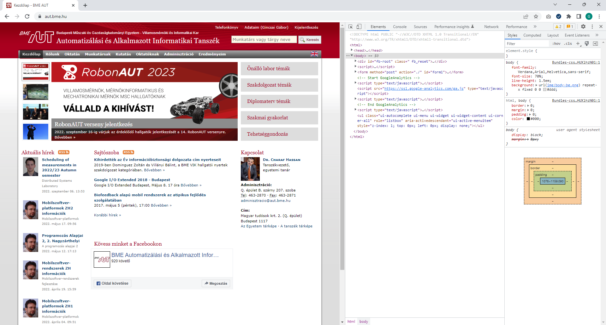
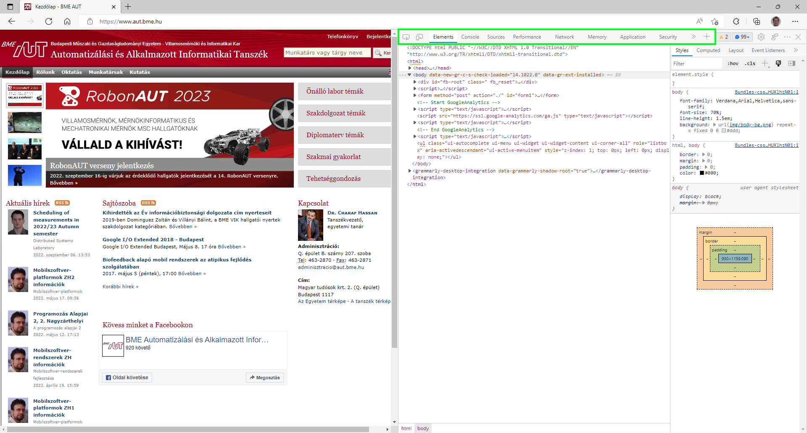
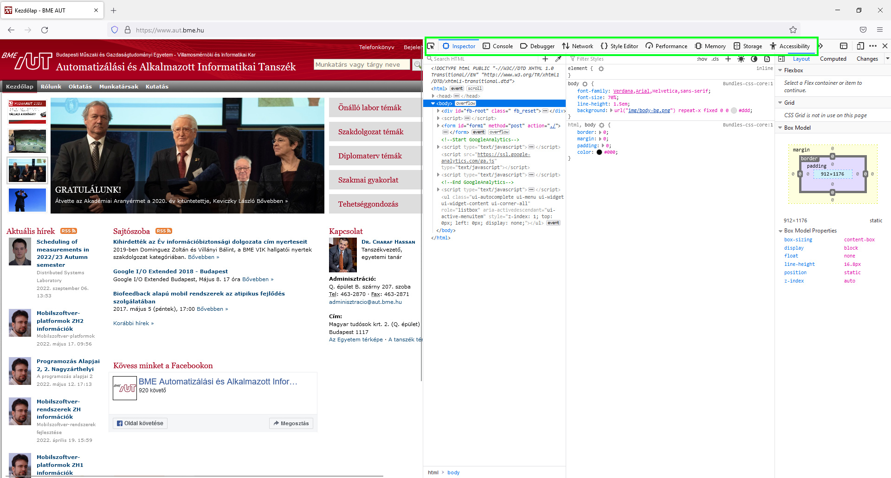
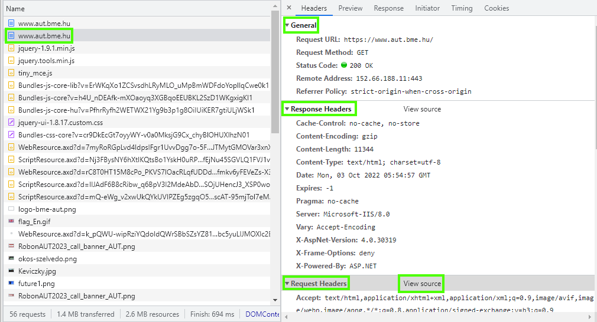
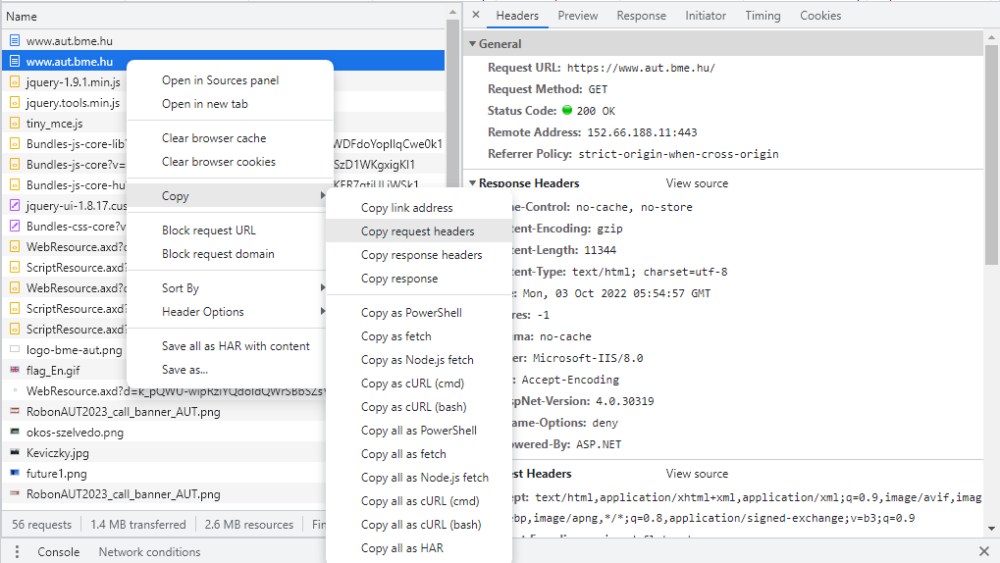
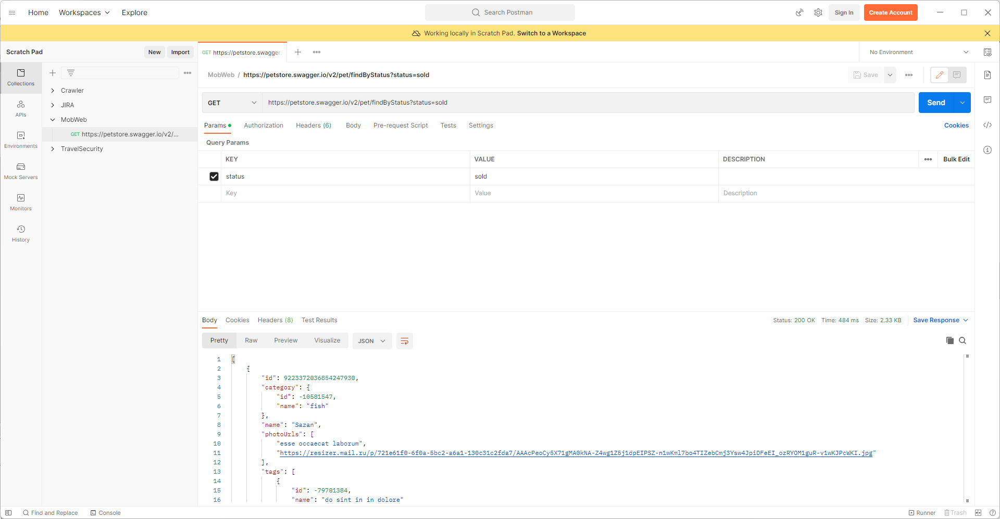
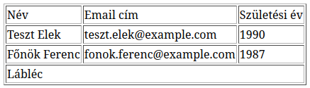
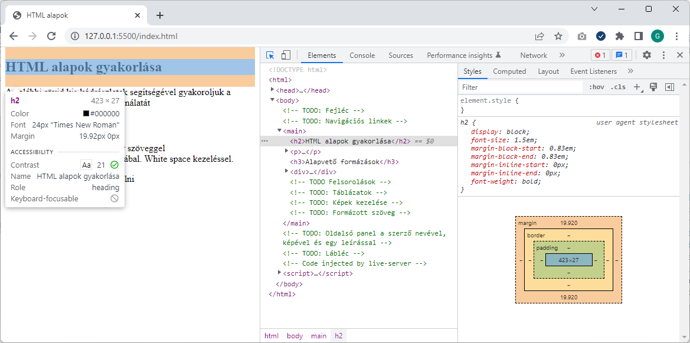

# Labor 08 - HTTP, HTML

## Bevezetés

A labor során laborvezetői segítséggel, majd önállóan készítesz el feladatokat a webes technológiák gyakorlati megismerése érdekében.

A labor célja, a böngésző fejlesztői eszközeinek (dev toolbar) megismerése, a HTTP kérések és válaszok vizsgálata, valamint HTML oldalak készítésének gyakorlása.

### Félév során használt eszközök

* Webböngésző (Chrome, Edge vagy Firefox) és a beépített hibakereső eszközei,
* [Visual Studio Code](https://code.visualstudio.com/download) kódszerkesztő alkalmazás,
    * otthoni vagy egyéni munkavégzéshez használható bármilyen más kódszerkesztő vagy fejlesztőkörnyezet, de a laborokban a VS Code-ot használjuk.
    * A laborban előre telepítésre kerültek az alábbi kiegészítők a VS Code-hoz,
        * [C#](https://marketplace.visualstudio.com/items?itemName=ms-dotnettools.csharp) - C# és .NET Core támogatás.
        * [Live Server](https://marketplace.visualstudio.com/items?itemName=ritwickdey.LiveServer) - egy nagyon egyszerű, fejlesztési célra szánt HTTP kiszolgáló.
        * [Live Saas Compiler](https://marketplace.visualstudio.com/items?itemName=glenn2223.live-sass) - SCSS fájlokból CSS-t tud generálni.
        * [ESLint](https://marketplace.visualstudio.com/items?itemName=dbaeumer.vscode-eslint) - Statikus kódelemző JS-hez.
        * [IntelliSense for Css class names in HTML](https://marketplace.visualstudio.com/items?itemName=Zignd.html-css-class-completion) - CSS osztály nevekhez automatikus kiegészítés.
* npm, a [NodeJS](https://nodejs.org/en/download/) csomagkezelője,
    * Az npm parancs futtatásához telepített NodeJS-re is szükség van.

## Előkészület

A feladatok megoldása során ne felejtsd el követni a feladat beadás folyamatát [GitHub](../../tudnivalok/github/GitHub.md).

### Git repository létrehozása és letöltése

1. Moodle-ben keresd meg a laborhoz tartozó meghívó URL-jét és annak segítségével hozd létre a saját repository-dat.
2. Várd meg, míg elkészül a repository, majd checkout-old ki.
    * Egyetemi laborokban, ha a checkout során nem kér a rendszer felhasználónevet és jelszót, és nem sikerül a checkout, akkor valószínűleg a gépen korábban megjegyzett felhasználónévvel próbálkozott a rendszer. Először töröld ki a mentett belépési adatokat (lásd [itt](../../tudnivalok/github/GitHub-credentials.md)), és próbáld újra.
3. Hozz létre egy új ágat `megoldas` néven, és ezen az ágon dolgozz.
4. A neptun.txt fájlba írd bele a Neptun kódodat. A fájlban semmi más ne szerepeljen, csak egyetlen sorban a Neptun kód 6 karaktere.

## Böngésző hibakereső eszközei

Weboldalak készítésekor szükség lehet a HTTP forgalom megvizsgálására, viszont az esetek jelentős részében elegendő lehet, ha a böngésző forgalmát meg tudjuk vizsgálni. A mai böngészők mindegyike tartalmaz eszközöket, amellyel a weboldalak hibakeresése nagyon egyszerűen kezelhetővé válik.

Nyissuk meg a laborvezető által kijelölt böngészőben a https://www.bme.hu oldalt, majd nyissuk meg a Developer tools nézetét az **F12** billentyűvel.

Vizsgáljuk meg, mit kínálnak az egyes böngészőkbe épített hibakereső eszközök!

<figure markdown>
  
  <figcaption>BME AUT kezdőlapja - Chrome Dev Toolbars</figcaption>
</figure>

??? info "További böngészőkben található Dev Toolbarok"
    <figure markdown>
    
    <figcaption>BME AUT kezdőlapja - Edge Dev Toolbars</figcaption>
    </figure>

    <figure markdown>
    
    <figcaption>BME AUT kezdőlapja - FireFox Dev Toolbars</figcaption>
    </figure>

A Chrome, Edge és Firefox böngészők eszközkészlete kisebb eltérésektől eltekintve megegyezik, a leggyakoribb funkciók az alábbiak:

* A dokkolás módja megadható: az ablak alsó részére vagy oldalára is (Chrome, Firefox) dokkolható az eszköztár, ill. kivehető a saját ablakába.
* **DOM vizsgálata (DOM Explorer, Elements, Inspector)**: a dokumentumfa felépítését tudjuk megvizsgálni, látható a kirajzolt HTML tartalom. Lehetőségünk van szerkeszteni az elemeket, beszúrni attribútumokat, elemeket, törölni őket. Kiválasztható egy DOM elem egérrel a kirajzolt oldalon vagy a szöveges megjelenítőben is. Egy elemet kiválasztva jobb oldalon az elemre illeszkedő stíluslap-szabályok (CSS) láthatók, ezek is szerkeszthetők. CSS készítésekor egy nagyon hasznos eszköz.
* **JavaScript konzol (Console)**: a JavaScript standard outputja a konzol, az alkalmazások által írt tartalmak itt láthatók. Lehetőségünk van kód futtatására is a konzol ablakban, ami azonnal kiértékelődik.
* **Források (Sources)**: Itt látható, hogy a teljes weboldal betöltéséhez honnan és mit töltött le a böngésző. Ha itt kiválasztunk egy JS fájlt, akkor annak a teljes kódját láthatjuk, sőt töréspontokat is tehetünk bele, így lehetővé téve a JS fájlok debuggolását.
* **Hálózat (Network)**: itt láthatjuk a kimenő kéréseket és a rájuk érkező válaszokat. Előnye, hogy csak a konkrét oldalhoz tartozik, nem a teljes böngészőhöz, így könnyebb leszűrnünk, melyik kérések tartoznak melyik alkalmazáshoz/oldalhoz. Láthatók a pontos időzítések is, HTTP kérések indítását viszont nem lehetséges kézzel megejtenünk a beépített lehetőségekkel.
* **Teljesítménymérők (Performance)**: különböző teljesítménymérő eszközök állnak rendelkezésünkre a weboldalak elemzéséhez, amik jellemzően a memória- és processzorhasználatot mérik.
* **Alkalmazás (Application)**: az alkalmazás által a különböző tárolókban - Local Storage, Session Storage, Cookies, ... - tárolt kulcs-érték párokat tudjuk megtekinteni.

Az eszközök legalább alapszintű ismerete (elsősorban a DOM Explorer, Console és Network használata) a laborokon elengedhetetlen.

## 1. Feladat 

### HTTP kérések

A hálózati kéréseket csak akkor rögzíti a Network fül, ha a Dev Toolbart korábban nyitjuk meg, minthogy az oldalt betöltenénk.
Az alábbi ábrán látható, hogy milyen funkciókat és beállításokat rejt a hálózat fül.

<figure markdown>
  
  <figcaption>Network tab</figcaption>
</figure>

**Disable cache**: bekapcsolása nagyon fontos JS és HTML kód debuggolása során, ugyanis a böngészők elég agresszívan gyorsítotárazzák ezeket a kéréseket. Fontos azonban tudni, hogy a gyorsítótár csak addig van letiltva amíg a Dev Toolban meg van nyitva és csak arra az egy oldalra (fülre) vonatkozik.

**Preserve log**: bekapcsolásával lehetőségünk van a logok megőrzésére navigációkor is. Azonban ezt a pipát óvatosan használjuk, mert a sok log nagyon be tudja lassítani a böngészőt.

### Közös feladat

1. Nyissuk meg a böngészőben a https://www.aut.bme.hu oldalt úgy, hogy a Dev Toolbar Network füle már meg van nyitva.
2. Keressük meg és kattintsunk arra a kérésre, amiben a HTML tartalom letöltődik.
3. A megjelenő ablakban láthatók a HTTP kérés fejlécei
    * **General**: A legfontosabb adatokat láthatjuk itt a kérésről és a válaszról.
        * Request URL: https://www.aut.bme.hu/ 
        * HTTP Method: GET
        * Status Code: 200
    * **Response Headers**: Itt találjuk a HTTP válasz fejléceit. Alapértelmezés szerint egy feldolgozott formában látjuk az adatokat, viszont a View Source gombra kattintva meg tudjuk nézni a nyers adatokat is.
    * **Request Headers**: Itt találjuk a HTTP kérés fejléc mezőit. Alapértelmezés szerint egy feldolgozott formában látjuk az adatokat, viszont a View Source gombra kattintva meg tudjuk nézni a nyers adatokat is.

    <figure markdown>
        
        <figcaption>HTTP kérés-válaszok fejlécei</figcaption>
    </figure>

    ??? info "Hogyan másoljuk ki egy kéréshez tartozó fejléc adatokat"
        A kérésen kattints jobb egérgombbal majd ott válaszd a Copy menüpontból, hogy mit szeretnénk másolni.
        <figure markdown>
            
            <figcaption>HTTP kérés-válaszok fejlécek másolása</figcaption>
        </figure>

4. Nézzük meg, hogy milyen HTTP kérés ment ki az oldal letöltéséhez.
    ``` http
    GET / HTTP/1.1
    Accept: text/html,application/xhtml+xml,application/xml;q=0.9,image/avif,image/webp,image/apng,*/*;q=0.8,application/signed-exchange;v=b3;q=0.9
    Accept-Encoding: gzip, deflate, br
    Accept-Language: hu-HU,hu;q=0.9,en-US;q=0.8,en;q=0.7
    Host: www.aut.bme.hu
    User-Agent: Mozilla/5.0 (Windows NT 10.0; Win64; x64) AppleWebKit/537.36 (KHTML, like Gecko) Chrome/106.0.0.0 Safari/537.36
    ```
5. Nézzük meg a kérésre kapott választ.
    ``` http
    HTTP/1.1 200 OK
    Cache-Control: no-cache, no-store
    Pragma: no-cache
    Content-Type: text/html; charset=utf-8
    Content-Encoding: gzip
    Expires: -1
    Vary: Accept-Encoding
    Server: Microsoft-IIS/8.0
    X-AspNet-Version: 4.0.30319
    X-Powered-By: ASP.NET
    X-Frame-Options: deny
    Date: Mon, 03 Oct 2022 05:54:57 GMT
    Content-Length: 11344
    ```


!!! info "Info"
    Ha még nem tetted volna meg, nyisd meg a GitHub Classroom leklónozott beadandójának repositoryját, aminek gyökér könyvtárát nyisd meg a VS Code szerkesztőben! A `index.html` fájlban dolgozzunk és a `megoldas` ágra pusholjunk.

### Önálló feladat beadandó

!!! example "1. feladat beadandó (0.5 pont)"
    * Nyisd meg a böngészőben a http://www.aut.bme.hu oldalt. **HTTP kérés nem HTTPS**
    * Keresd meg az azt a kérést, ami a http://www.aut.bme.hu -ra érkezett és vizsgáld meg a kapott HTTP választ.
    * Készíts képernyőképet a Dev Toolbar Network füléről ahol látszódnak a kérés fejlécei. (General, Request Headers, Response Headers)
    * A készített képernyőképet másold be **`f1.png`** néven a repository gyökerébe!

## 2. Feladat 

### Postman

Postman segítségével egyszerűen tudunk HTTP kéréseket indítani és a kapott válaszokat vizsgálni.
Leggyakrabban akkor használjuk ha egy REST API-t kell kipróbálni vagy tesztelni.

Webes és desktopos verzió is létezik belőle.

* A webes felület regisztráció után használható a https://www.postman.com/ oldalon.
* Az asztali verziót a https://www.postman.com/downloads/ oldalról lehet letölteni.

A labor gépekre az asztali verzió fel van telepítve, így azt fogjuk használni.
Ahhoz, hogy ne kelljen szerver oldali kódot készíteni egy tesztelésre kiadott REST API-t használunk melynek leírása a **https://petstore.swagger.io/** oldalon érhető el. A legfontosabb végpontok az alábbi swagger ábrán is látható.

<figure markdown>
  
  <figcaption>PetStore REST API</figcaption>
</figure>

### Keresés státusz alapján

1. Indítsuk el a Postmant.
2. Bal oldalon hozzunk létre egy új kategóriát és nevezzük át MobWeb-re.
3. Állítsunk össze egy kérést, ami státusz alapján kérdez le kutyákat. A leírása a swagger oldalon található. (Akár onnan is ki lehet próbálni.)
    * Method: **GET**
    * URL: **https://petstore.swagger.io/v2/pet/findByStatus**
    * Query paramétert a Params fülön tudunk felvenni (vagy beírhatjuk az URL-be is)
        * Key: **status**
        * Value: **sold**
4. Küldjük el a kérést a **Send** gombra kattintva és ellenőrizzük a visszakapott adatokat.
5. Mentsük el a jobb felső sarokban lévő **Save** gombbal a MobWeb kategóriába.

<figure markdown>
  
  <figcaption>Postman - Filter kérés összeállítása</figcaption>
</figure>

### Új elem létrehozása

1. Állítsunk össze egy új kérést, ami egy kutyát hoz létre. Ehhez a */pet* URL-re kell egy *POST* kérést küldeni a *Body* -ban megadva azt a JSON-t amivel létre kell hozni a kutyát. A pontos leírás a swagger oldalon érhető el.
    * Method: **POST**
    * URL: **https://petstore.swagger.io/v2/pet**
2. Válasszuk ki a Body fület, ott a raw opciót és adjuk meg hogy JSON adat lesz a bodyban.
3. A body-t az alábbiak szerint állítsd össze. A kutya neve legyen a neptunkódod.
    ``` json
    {
        "id": 0,
        "name": "Z2I8RG",
        "status": "available"
    }
    ```
4. Ha minden jól megy a válaszban visszakapjuk a létrehozott kutyát, amiből az ID lesz számunkra fontos
    ``` json
    {
        "id": 9223372036854248826,
        "name": "Z2I8RG",
        "photoUrls": [],
        "tags": [],
        "status": "available"
    }
    ```

### Közös feladat beadandó

!!! example "2. a) Feladat beadandó (0.5 pont)"
    * A kutya létrehozásához összeállított kérés sikeres lefuttatásáról készíts egy képernyőképet.
    * A képernyőképet másold be **`f2a.png`** néven a repository gyökerébe! 

### Önálló feladat beadandó

1. Készíts egy új kérést, ami módosítja a közösen létrehozott azonosítójú kutya állapotát (`status`) `sold`-ra.
2. Készíts egy új kérést, ami törli a korábban módosított kutyát.

!!! example "2. b) Önálló feladat beadandó (1 pont)"
    * Készíts képernyőképet a sikeresen lefuttatott módosításról és törlésről.
    * A képernyőképeket másold be **`f2b.png`** és **`f2c.png`** néven a repository gyökerébe! 

## 3. Feladat 

### HTML alapok

A HTML (HyperText Markup Language) a web nyelve. A böngészők elsősorban HTTP-n keresztül eljuttatott HTML tartalom  kirajzolásáért és feldolgozásáért felelősek.

A HTML egy XML-szerű nyelv, amelyben elemek (tag) írják le a dokumentumunkat. Az egyes elemeknek lehetnek tulajdonságai, amiket attribútumoknak (attribute) nevezünk. Az attribútum értéke leggyakrabban szám, szöveg, korlátozott értékkészletű szöveg (enumeráció), ritkábban felsorolás vagy objektum lehet. A HTML-ben bizonyos szabályrendszernek kell eleget tennünk: megkötések vonatkoznak arra, hogy milyen jellegű elemeket milyen más elemekben helyezhetünk el.

A kód könnyen értelmezhető, az egyes elemek nyitó és záró tag-je között találhatók a hozzárendelt gyerekelemek. A whitespace-ek, behúzások csak az olvashatóságot segítik.

!!! tip "Fontos"
    A HTML-ben vétett esetleges hibák **csendes** hibák, az esetleges hibás elhelyezések vagy helytelen formázás/szintaxis következtében a böngésző meg fogja jeleníteni az oldalt, amennyire a HTML alapján azt meg tudja tenni. Egy lemaradt `</lezáró tag>` pl. nem minden esetben rontja el a HTML oldal kinézetét, de okozhat nemkívánatos mellékhatásokat.

### Szemantikus web

Mielőtt belevágnánk a feladatba érdemes feleleveníteni a szemantikus HTML tageket, amit a `div`-ek helyett használunk a kódban, ezzel jelölve a nagyobb logikai egységeket.


Forrás: https://internetingishard.com/html-and-css/semantic-html/

### Feladat

1. Nyisd meg az `index.html` fájlt és jobb gombbal kattints bele, majd választ az **Open with Live Server** opciót. Ezzel elindul egy fejlesztő webszerver a 5500-as porton és az alapértelmezett böngészőt is megnyitja a kiválasztott oldal tartalmával. (http://127.0.0.1:5500/index.html)

    !!! tip  Fontos
        Ez az opció csak könyvtárakra működik, tehát ha csak simán a fájlt nyitod meg (nem a projekt könyvtárát) akkor nem fog működni.

2. Egyszerű HTML elemek áttekintése

    A kiinduló kódban már megtalálható ez a részlet így csak a viselkedésüket kell megvizsgálni. Láthatjuk, hogy egy-egy elemnek van egy alapértelmezett kinézete, amit a böngésző definiál. A későbbiekben ezt a Dev Toolbar segítségével közelebbről is megnézzük.

    * `div` - blokk elem (új sorban kezdődik)
    * `span` - inline elem (nem kezd új sort)
    * `p` - bekezdés
    * `b` vagy`strong` vagy `em` - kiemelt szöveg
    * `i` - dőlt betűs
    * `br` - sortörés

3. A következő pontokban az `index.html` oldalban található *TODO* elemek helyére készítsd el a szükséges HTML kódrészletet.

4. Fejléc
    * A megfelelő szemantikus HTML taget használd.
    * A megfelelő heading-ben jelenítsd meg a "Mobil- és Webes szoftverek fejlesztése" szöveget.

5. Navigációs linkek
    * A megfelelő szemantikus HTML taget használd.
    * Az alábbi két linket hozd létre
        * Főoldal az az `index.html`-re mutat
        * Form ami a `form.html`-re mutat.
    
    ??? info "Segítség"
        * `a` - hyperlink készítése a nyitó és záró tag közé kerül a megjelenített szöveg.
        * `href` - az `a` tag attribútuma, hova kell navigálni.
        * `target` - az `a` tag attribútuma, hol nyissa meg a linket (új tab, vagy ebben az ablakban).

6. Fő tartalmi blokk
    Az alább felsorolt blokkokat kell létrehozni. Minden blokk előtt legyen egy megfelelő heading és alatta a szükséges kódrészlet.
    
    * **Felsorolások** 
        Egy heading-ben jelezd, hogy ez a rész a "Felsorolások", majd készíts egy bullet pointos listát és egy sorszámozott listát 2-2 elemmel.

        ??? info "Segítség"
            * `ul` - bullet pointos felsorolás.
            * `ol` - számozott felsorolás.
            * `li` - lista elem.

    * **Táblázatok** 
        Egy heading-ben jelezd, hogy ez a rész a "Táblázatok", majd készítsd el az alábbi képen látható táblázatot.
        
        

        ??? info "Segítség"
            * `table` - táblázat
            * `thead` - táblázat fejléce (legelső sor)
            * `tbody` - táblázat törzse
            * `tfoot` - táblázat lábléce (legalsó sor)
            * `tr` - táblázat sor
            * `td` - táblázat cella
            * `th` - táblázat fejléc oszlop
            * `colspan` - oszlopok összevonása (attribútum a `td`-re)
            * `rowspan` - sorok összevonása (attribútum a `td`-re)
            * `border` - táblázat keretének a vastagsága (attribútum a `table`-re)

    * **Kép kezelése képaláírással**:
        * Egy heading-ben jelezd, hogy ez a rész a "Képek", majd adj az oldalhoz egy képet képfelirattal.
        * A képeknél használjunk placeholder-t pl: https://placehold.co/200x200. Adj meg alternative textet is.

        ??? info "Segítség"
            * `figure` - tag, ami összefogja a képet és a képaláírást.
            * `img` - maga a kép
            * `alt` - Az `img` tagnek egy attribútuma, amit érdemes mindig megadni. Ez egy helyettesítő szöveg, ha a képet nem lehet letölteni.
            * `figcaption` - képaláírás

    * **Formázott szöveg**:
        * Egy heading-ben jelezd, hogy ez a rész a "Formázott szöveg"
        * `pre` - olyan előre formázott szöveg amiben megtartja rendereléskor a white space-eket és sortöréseket is. Olyan szöveget írj bele, ami demonstrálja ezt a viselkedést.

7. Készítsünk egy tartalomtól független részt a szerzőről
    * A szerző neve a megfelelő heading típussal.
    * Egy kép a szerzőről. Keress egy képet és azt is tedd a repositoryba, vagy használd a https://placehold.co/80x80 placeholdert.
    * Egy bekezdés szöveg, amit legegyszerűbben a https://www.lipsum.com/ oldal segítségével generálhatunk.

8. Készítsük el a láblécet, amibe az évszám és a BME AUT felirat kerüljön.

### Beadandó
!!! example "3. feladat beadandó (1.5 pont)"
    * Az `index.html` módosításait commitold!
    * Az elkészült weboldal képernyőképét másold be `f3.png` néven a repository gyökerébe!

## 4. Feladat 

### HTML oldal vizsgálata

Láthatjuk, hogy a szövegek formázását nem a whitespace-ek, hanem az elemek típusa adja. Ha szeretnénk látni, melyik elem hol helyezkedik el a felületen illetve a DOM-ban, az F12 eszköztáron, a DOM Explorer felső során levő ikonokkal változtathatjuk, hogy a felületen navigálva a DOM elem kijelölődjön-e, illetve a DOM-ban navigálva a felületen jelezve legyen-e a kiválasztott elem. 

Az alapértelmezett formázást a böngészők beépítetten adják, ezért nagyobbak az egyes címsor (`<h1>`, `<h2>`) mezők, ill. ezért törik a `<div>` (ami blockszintű elem), és marad folyószöveg a `<span>` (ami inline).

A beépített stílusokat megvizsgálhatjuk egy elemet kijelölve. A CSS szabály mellett látható a "user agent stylesheet" jelzi, hogy a böngésző beépített stíluslapjában található ez a formázás.

<figure markdown>
  
  <figcaption>A böngésző beépített stílusainak vizsgálata Developer Tools segítségével</figcaption>
</figure>

### Beadandó

!!! example "4. feladat beadandó (0.5 pont)"
    Készíts egy képernyőképet, ahol látható, hogy a `h3` tagre milyen alapértelmezett stílusok vonatkoznak. Az így készült képernyőképet másold be `f4.png` néven a repository gyökerébe!

## 5. Feladat 

### HTML űrlapok

A HTML űrlapok egységes, megszokott adatbeviteli eszközként szolgálnak számunkra a felhasználóval való kommunikációra. 

Állíts össze egy űrlapot a repositoryban található `form.html` fájlba, az alábbiak szerint.

* Az űrlap az alábbi adatokat kéri be a felületen a felhasználótól (a *-gal jelölt mezők kötelezően kitöltendők):
    * **Név***: szöveges mező
    * **Jelszó***: jelszó mező (nem látható karakterek – használja a "mobweb" jelszót szemléltetésre)
    * **Leírás**: szöveges mező, többsoros
    * **Születési dátum***: dátum
    * **Nem**: fiú/lány/egyéb, legördülő menüből
    * **Lábméret**: szám, 0.5-ös léptékkel

* Minden mezőhöz tartozzon egy címke is, amely tőle balra helyezkedjen el! A címkére kattintva a fókusz kerüljön a releváns mezőbe (használd az `id` és `for` attribútumokat)! Az egyes mezők egymás alatt helyezkedjenek el!
* Legyen egy *Küldés* feliratú gomb, amely az adatokat a saját szerverünknek küldi a **/postform.html** URL-re, ahol egy egyszerű oldal jelenjen meg GET kérés hatására (POST kérés esetén nem szükséges betöltődnie az oldalnak, de az URL legyen ugyanez)!

??? info "Segítség"
    * Szükséges elemek
        * `form` - maga az űrlap
        * `input` - beviteli mező, aminek a `type` attribútuma adja meg, hogy milyen típusú.
        * `label` - címke ahol a `for` attribútum adja meg, hogy melyik beviteli mezőhöz tartozik.
        * `select` - Legördülő lista.
        * `option` - Legördülő lista elem.
        * `textarea` - többsoros beviteli mező.
    * Szükséges attribútumok
        * `action` - az `form` milyen URL-re irányítson át.
        * `for` - a `label` melyik `input`-hoz tartozik.
        * `id` - a tag egyedi azonosítója.
        * `method` - A `form` elküldésekor milyen HTTP method-ot használjon (GET / POST)
        * `name` - a tag neve. Ha nincs megadva az `input`-nál, akkor nem tudja a szerverre elküldeni az inputban lévő adatot.
        * `required` - kötelező `input` mező.
        * `step` - szám típusú `input` esetén a fel/le nyílra kattintva mennyivel változzon az érték.
        * `type` - az `input` típusa
        * `value` - az `input`-ban szereplő kezdeti érték.

### Beadandó

!!! example "5. feladat beadandó (1 pont)"
    * Commitold a `form.html` módosított tartalmát!
    * Készíts képernyőképet `f5a.png` néven tetszőleges böngészőben a teljesen kitöltött űrlapról, amin pontosan egy validációs hiba található!
    * Demonstráld a böngésző Network fülének segítségével az űrlapadatok elküldésének tényét GET `f5b.png` és POST `f5c.png` igék használatával is! Fontos, hogy a képen láthatóak legyenek az elküldött paraméterek.
