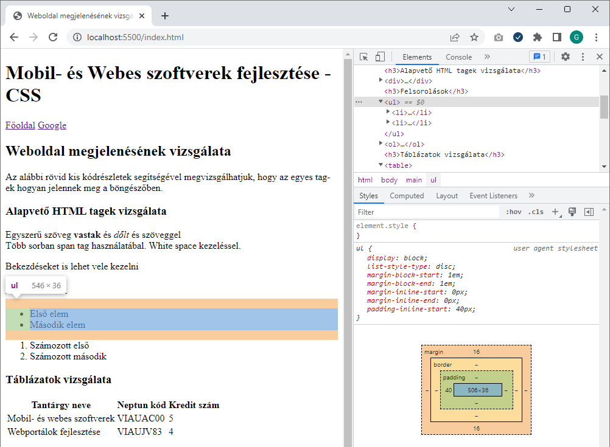
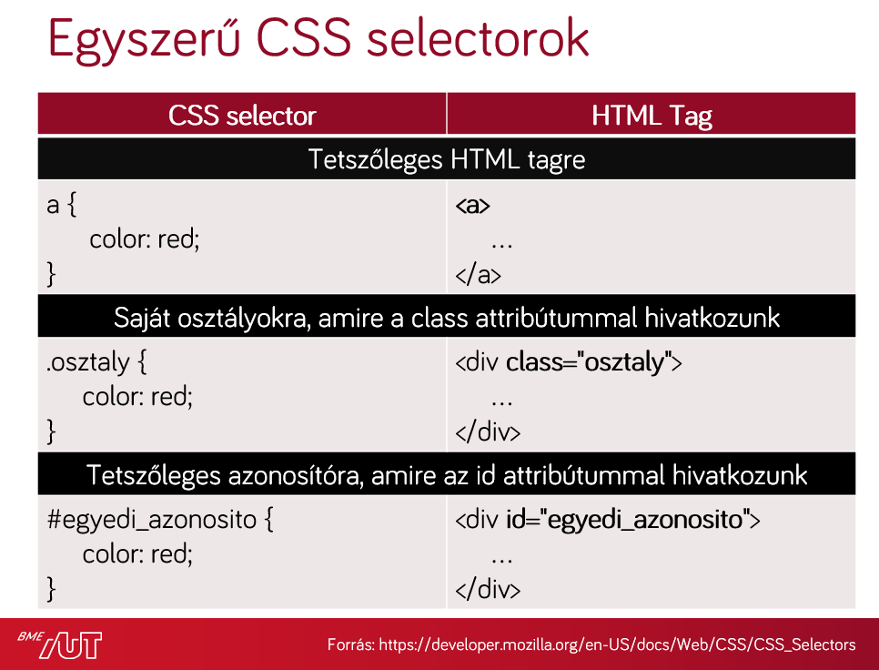
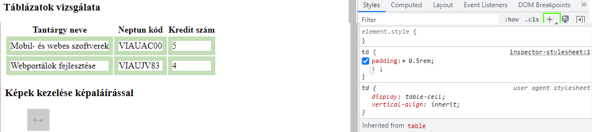
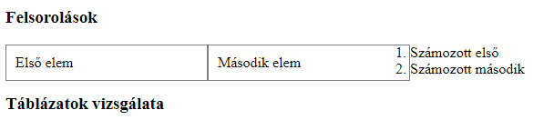
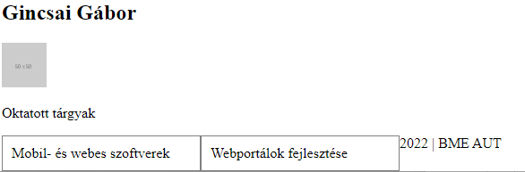
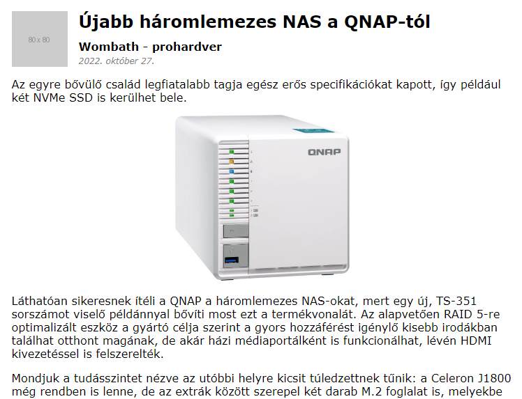
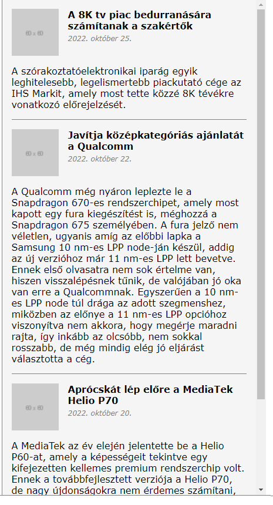

# Labor 09 - CSS

## Bevezetés

A labor során laborvezetői segítséggel, majd önállóan készítesz el feladatokat a webes technológiák gyakorlati megismerése érdekében.

A labor célja, CSS alapjainak elsajátítása és a CSS debuggolására használt eszközök gyakorlása.

## Előkészület

A feladatok megoldása során ne felejtsd el követni a feladat beadás folyamatát [Github](../../tudnivalok/github/GitHub.md).

### Git repository létrehozása és letöltése

1. Moodle-ben keresd meg a laborhoz tartozó meghívó URL-jét és annak segítségével hozd létre a saját repository-dat.
2. Várd meg, míg elkészül a repository, majd checkout-old ki.
    * Egyetemi laborokban, ha a checkout során nem kér a rendszer felhasználónevet és jelszót, és nem sikerül a checkout, akkor valószínűleg a gépen korábban megjegyzett felhasználónévvel próbálkozott a rendszer. Először töröld ki a mentett belépési adatokat (lásd [itt](../../tudnivalok/github/GitHub-credentials.md)), és próbáld újra.
3. Hozz létre egy új ágat `megoldas` néven, és ezen az ágon dolgozz.
4. A neptun.txt fájlba írd bele a Neptun kódodat. A fájlban semmi más ne szerepeljen, csak egyetlen sorban a Neptun kód 6 karaktere.

## 1. Feladat

### Stíluslapok, inline stílusok

Webes HTML tartalmak stílusozására CSS-t használunk. A CSS alapjai:

* szabály (mintaillesztés) alapú, deklaratív programozási nyelv,
* DOM elemekhez megjelenést rendel.

A böngészőben megjelenített HTML tartalmak alapértelmezés szerint formázatlanok, viszont bizonyos szabályokat a böngésző alapértelmezetten illeszt az egyes elemekre, az elem típusa szerint.

Vizsgáljuk meg, milyen szabályokat illeszt a böngésző a HTML, a BODY, a DIV, a SPAN, a H1, H2 és egyéb elemekre!

Nyissuk meg a Visual Studio Code-ban a leklónozott repositorynkat, és a gyökér könyvtárba található `index.html` fájlba dolgozzunk.

Ahhoz, hogy böngészőben is lássuk a weboldalt az `index.html`-en kattintsunk jobb gombbal és válasszuk az **Open with Live Server** opciót, ami elindítja a fejlesztői webszervert és az alapértelmezett böngészőben megnyitja az oldal.

Vegyük észre, hogy az oldalhoz nem vettünk fel saját stíluslapot, valamilyen formázás mégis érvényesült. Egyes elemek félkövérek, kisebbek-nagyobbak, elrendezésük sorfolytonos vagy tördelt.

Vizsgáljuk meg, milyen szabályok érvényesülnek az egyes elemekre!

Nyissuk meg a böngésző beépített fejlesztői eszközeit (**F12**)! Lehetőségünk van az elemeket kijelölni (**Jobb klikk** > **Inspect**), megnézni elhelyezkedésüket a felületen és a DOM szöveges reprezentációjában egyaránt.

<figure markdown>
  
  <figcaption>A HTML alapértelmezett megjelenése a böngészőben</figcaption>
</figure>

!!! tip "Fontos"
    A böngészők és/vagy bizonyos szerverek túl agresszívan gyorsítótárazhatnak bizonyos fájlokat, pl. a HTML és CSS fájljainkat, így a változásokat nem biztos, hogy látni fogjuk egyszerű újratöltés után. Ha ez előfordul, le kell tiltanunk a cache-t a Developer Tools eszköztáron.

Jellemzően a menüsor bal oldalán találhatók a kijelöléshez szükséges műveletek ikonjai, jobb oldalon a részletes nézet.

A kiválasztott elemhez a jobb oldali **Computed** fülön a ténylegesen érvényre lépett szabályokat láthatjuk. Mivel nincs explicit CSS fájlunk linkelve és CSS szabályokat sem írtunk a HTML-ben, ezért kizárólag a böngésző beépített **user agent stylesheet**-je érvényesül. Itt láthatjuk a **CSS Box model**-t is, ami az elem **tartalma**, a hozzá tartozó **padding**, **border** és **margin** értékek egymásra halmozását jelenti a *2 dimenziós téglalap* oldalaihoz mérten.

A CSS feloldásában a `cascading`, azaz "egymásba ágyazható" rész szerint több stíluslap létezik a származás szempontjából; mi most a *böngészőbe beépített*, ún. `user agent stylesheet`-et látjuk.

A Computed fülön lenyitva az egyes szabályokat látható, hogy honnan származik az a stílus, sőt az is, hogy egy érték beállítása pontosan melyik szabályból származik, azaz melyik szabály melyiket írta felül.

<figure markdown>
  
  <figcaption>Chrome computed fül</figcaption>
</figure>

A fenti szűrőt használva van lehetőségünk az alkalmazott CSS szabályok között keresni is.

A **h1**, **h2** és **b** elemek alapértelmezetten félkövérek, ezt a `font-weight: 700;` tulajdonság írja le nekünk.

A **html**, **body**, **div**, **h1**, **h2** elemek `display` tulajdonsága `block`, a **span**, **a** és **b** elemek pedig `inline` típusúak. A `display: block;` tulajdonságú elemek egy blokkot (sort) foglalnak el az őket befoglaló elemben, az inline típusúak sorfolytonosak (egymás mellett is elhelyezkedhetnek).

Láthatjuk, hogy a `body` elemen található `8px` margó (`margin`) mind a 4 irányban:

<figure markdown>
  
  <figcaption>Margók vizsgálata</figcaption>
</figure>

### Beadandó

!!! example "1. feladat beadandó (0.5 pont)"
    Egy-egy képernyőképpel alátámasztva demonstrálja az alábbi kérdéseket:

    * Mekkora a **margin**, **padding** és **border** értéke az `<ol>` elemnek?
    * Hány pixel a (függőleges) távolság a `<h1>` és `<h2>` elemek tartalma között (ügyelve az átfedő margókra)?
    * A készített képernyőképet másold **`f1-1.png`** és **`f1-2.png`** néven a repository gyökerébe!

## 2. Feladat

### Megjelenés módosítása futási időben

??? note "Emlékeztető a CSS szabályok definiálásához"
    Saját CSS szabályokat többféle módon tudunk az oldalunkhoz rendelni:

    * CSS fájlokra történő hivatkozással,
    * CSS szabályok felvételével a HTML tartalmán belüli `<style>` tagben,
    * inline, a HTML elemek `style` attribútumának beállításával.

    Ütköző CSS szabályok közül az érvényesül, amelynek nagyobb a specificitása (megegyező specificitás esetében az utoljára definiált).

    Emlékeztetőként a szabályok specificitási sorrendje:

    * inline stílus (`<div style="..."> `),
    * ID-k száma (`#azonosito`),
    * osztályok, attribútumok és pszeudo-osztályok száma (`.osztaly`, `[attributum]`, `[attributum="ertek"]`, `:hover`),
    * pszeudo-elemek (`:before`, `:after`).

    A sorrendhez hozzátartozik az `!important` kulcsszó, ami önmagában a fentiektől specifikusabb, viszont az `!important` szabályokra a fenti specificitási sorrend szintén érvényesül.

    A szabályok definiálása:

    
    

* Ha új szabályt akarunk felvenni, akkor a kapcsos zárójelek közé kattintva tehetjük ezt meg, ezután az automatikus kiegészítés funkcióval láthatjuk az összes, a böngésző által ismert CSS tulajdonságot (Firefox Developerben ezt az üres kurzoron a **fel-le nyilak**-kal tehetjük meg, Edge-ben és Chrome-ban a **Ctrl+szóköz**-zel).
* Vegyük fel a `<h1>` elemhez az alábbi CSS tulajdonságot:

    ```css
    color: red;
    ```

* Közben vegyük észre a DOM reprezentációban, hogy bár a jobb oldali panelen szerkesztünk, pontosan ugyanaz történik, mintha a HTML elem `style` attribútumát adtuk volna meg.
* Ha beállítjuk a `font-weight: bold;` tulajdonságot a `<body>`-n, akkor láthatjuk, hogy az összes gyermekére is érvényesül a szabály. Bizonyos szabályok öröklődnek (a `font-weight` ilyen), mások (például a `padding` és `margin`) viszont nem.

Lehetőség van esetenként több szabály aggregált megadására is ún. shorthandek használatával. Gyakori például a 4-irányú értékadás, ami a **top-right-bottom-left** iránysorrend szerint ad meg több értéket.

* A `padding: 50px 30px 10px 5px;` szabály mind a négy értéket beállítja a fenti sorrendben.
* A `padding: 10% 1mm;` szabály a fenti-lenti értékeket 10%-ra, a jobb-balt 1 mm-re.
* A `padding: 0;` mind a 4 oldalon 0-ra állítja a paddingot (nem szükséges mértékegység 0 esetén).

!!! tip "Fontos"
    Ha százalékban adjuk meg a paddingot vagy a margót akkor az a **szülő elem szélességének** a százalékát jelenti. Még akkor is ha `margin-top`, vagy `margin-bottom`-ot állítunk be! 
    
    Forrás: https://www.w3.org/TR/CSS21/box.html#margin-properties 

!!! warning "Inline stílusok"
    Inline stílusokat csak kivételes esetekben használjunk, jellemzően programozottan (JavaScriptből) elfogadott lehet egy elem megjelenését ilyen módon állítani, de a nyers HTML-ben nem!

* Vegyünk fel egy új szabályt, amiben megadjuk, hogy a táblázat cellák `td` paddingja 1rem legyen minden irányba. Ehhez a Syles fülön a jobb oldalon található + jelre kell kattintani és akkor létrejön egy új szabály ahol megadhatjuk a selectort és a beállításokat is.
    ``` css
    td {
        padding: 1rem;
    }
    ```
    <figure markdown>
    
    <figcaption>Új szabály létrehozása</figcaption>
    </figure>

* Az új szabály mellett azt látjuk, hogy az *inspector-stylesheet*-ben jött létre. Tehát a háttérben a böngésző létrehoz egy CSS fájlt és abban tárolja a létrehozott stílusokat, amit meg is tudunk nézni ha rákattintunk az *inspector-stylesheet*-re.
* Az így létrehzott szabályok csak az oldal újratöltéséig maradnak meg.
* Figyeljük meg a fenti képernyőn, hogy az új szabállyal nem egy cellára állítottuk be a padding-ot hanem minden cellára.
* Az új szabály alatt egyébként láthatóak a user agent styleheet-ből érvényre jutott szabályok is, illetve ez alatt az örökölt szabályok is.

### Beadandó

!!! example "2. feladat beadandó (0.5 pont)"
    * Hozz létre egy új szabályt a `table`-re ahol beállítod az alábbi szabályt
    ``` css
    table {
        border: solid 1px red;
        border-collapse: collapse;
    }
    ```
    * Hozz létre egy új szabályt, amiben a `th` tagekre beállítod, hogy a háttérszín fekete legyen, a betű színe fehér, a padding pedig 1rem.
    * Az első sor utolsó cellájának tartalmát (de csak azt az egyet) igazítsd középre. Tipp: `text-align: center`
    * Készíts egy képernyőképek amin látható az összes fenti módosítás és a készített képernyőképet másold **`f2.png`** néven a repository gyökerébe!

## 3. Feladat - CSS alapok

A HTML oldalhoz kétféleképpen tudunk stíluslapot rendelni: külső CSS fájlból vagy az oldal `head` tagjében definiált `<style>` tagben.

### Float használata

Az `index.html` forráskódját egészítsük ki, a `<head>` elembe helyezzük el az alábbi kódot:

```html
<style>
    ul {
        list-style: none;
        padding: 0;
    }

    ul > li {
        float: left;
        padding: 10px;
        min-width: 200px;
        border: 1px solid grey;
    }
</style>
```

Ha frissítjük az oldalt (nem szükséges újraindítani a szervert, csak menteni a fájlt), akkor az elrendezés módosul.

* A listaelemet jelző pötty eltűnik.
* A listánkban a listaelemek egymás mellé kerülnek
* A felsorolás után következő elem felcsúszott a listával egy sorba.

<figure markdown>
  
  <figcaption>Float</figcaption>
</figure>

!!! warning "float: left"
    A `float: left;` tulajdonság állításával nem ugyanazt érjük el, mintha a listaelemet `display: inline-block;`-ra állítanánk, mert az `inline-block` megtartja az egymást követő elemek közötti whitespace-eket, a `float: left;` viszont nem.

A float segítségével komplexebb elrendezéseket is el tudunk érni, viszont a float-olást meg kell tudnunk szüntetni. Ehhez a `clear: both;` értéket állíthatjuk be egy elemen. A float-olás azon kevés CSS tulajdonság egyike, ami az elemet sorban követő további testvérekre is közvetlenül hat.

Az alábbi szabályt használhatjuk a float-olás megszüntetéséhez, ekkor az `<ol>` elemre a `clearfix` osztályt alkalmazva az már új sorba is kerül.

```css
.clearfix {
    clear: both;
}
```

```html
<ol class="clearfix">
  <!-- ... -->
</ol>
```

<figure markdown>
  
  <figcaption>Float megtörése a clear segítségével</figcaption>
</figure>

Vegyük észre, hogy az oldal alján is volt egy felsorolás, és sajnos olyan általános szabályt sikerült íni, hogy az ott lévő felsorolásra is érvényre jutott.

<figure markdown>
  
  <figcaption>Túl általános szabály</figcaption>
</figure>


### Specifikus szabályok

A CSS szabályainknak az esetek nagy többségében nem tesz jót, ha túl általánosak. A fenti szabályok minden listaelemre általánosan illeszkedni fognak, ami ebben a konkrét esetben nem jó döntés, ugyanis valahol az oldal törzsében lehet, hogy szeretnénk használni a "klasszikus" listás megjelenítést is. Ezért a szabályunkat át kell gondolnunk, specifikusabb szabályt érdemes írni:

```css
ul.menu {
    list-style: none;
    padding: 0;
}

ul.menu > li {
    float: left;
    padding: 10px;
    min-width: 200px;
    border: 1px solid grey;
}
```

A fenti osztállyal megkülönböztettük a `menu` osztállyal ellátott `ul` elemeket azoktól, amiken nincs rajta az osztály.

### Pszeudo osztályok

A pszeudoosztályok használatával az elemek különböző állapotainak különböző stílust tudunk adni. Ha a listaelemek kijelölése a felhasználó számára speciális állapot, ezt érdemes jeleznünk a felületen. Használjuk az alábbi szabályt:

```css
ul.menu > li:focus {
    font-weight: bold;
    color: #44AA44;
}
```

Önmagában a `focus` pszeudoosztály használata nem elegendő, ugyanis a li elem nem fókuszálható. A `<li>` elemen elhelyezett tabindex attribútum jelzi a böngészőnek, hogy az elem képes fókuszt kapni:

```html
<ul class="menu">
    <li tabindex="1">Első elem</li>
    <li tabindex="2">Mádosik elem</li>
</ul>
```

Ezután lehetséges az egér kattintással vagy a Tab billentyű használatával kijelölni az elemet.

### CSS külön fájlban

A HTML-be ágyazott CSS-sel a probléma, hogy ugyanaz a stílus nem újrahasznosítható a különböző oldalaink között. Ezért érdemes kiszervezni a CSS tartalmainkat a saját dedikált CSS fájljainkba. A CSS tartalmát mozgassuk át a HTML `<head>` részéből egy új fájlba az `index.html` mellett, legyen a neve `index.css`.

A fájlt a HTML-ből az alábbi módon tudjuk linkelni: tegyük az oldal `<head>` részébe (a korábbi oldalon belüli stílus-definíciók helyére) az alábbi hivatkozást:

```html
<link rel="stylesheet" type="text/css" href="index.css">
```

### Reszponzív elrendezés

A weboldalakat különböző képernyőméretű és felbontású eszközökről szoktuk látogatni. A túl részletes táblázatok, hosszú, meg nem törő sorok nem felhasználóbarátak kisebb méretű kijelzőkön, még ha az eszköz felbontása kellően nagy is. A mobil eszközök ezért szorzókat alkalmaznak a valós és a hasznos felbontás közötti megkülönböztetésképpen.

A reszponzív elrendezés során a legfontosabb koncepciók közé tartozik a szélesség függvényében történő átméretezése az oldalnak. Ezeket az alábbi szintaxis alapján, ún. media query-vel tudjuk implementálni:

```css
.medium-only {
    display: none;
}

@media (min-width: 768px) and (max-width: 991px) {
    .medium-only {
        display: block;
    }
}
```

A fenti szabály 768 és 991 pixel közötti szélességű viewport-on jelenik meg, tehát nem a képernyő mérete, hanem a rendelkezésre álló hely függvényében változik (pl. ablak átméretezésekor is). A `medium-only` osztállyal ellátott elemek csak ilyen képernyőméreten jelennek meg, ugyanis a media query szabály specifikusabb, mint az azon kívül definiált.

Próbáljuk ki, mi történik, hogyha a két szabály sorrendjét felcseréljük!

### Beadandó

!!! example "3. feladat beadandó (1 pont)"
    * Commitolja a módosított HTML fájlt és a létrehozott CSS fájlt a repositoryba!
    
    * Készítsen képernyőképet **`f3-1.png`** névvel és másolja a repository gyökerébe, amin az egyik listaelem kijelölt állapotban van. A képernyőképen az érvényre jutott CSS szabály is legyen látható. (Styles a dev toolbarban).

    * Képernyőképekkel demonstrálja, hogy a fenti szabályt a table elemre alkalmazva a táblázat az ablak méretének függvényében látható vagy el van rejtve! **`f3-2.png`**, **`f3-3.png`**

## 4. Feladat 

Mostantól a `Feladat4` mappában lévő állományokkal dolgozz.

Készítsd el az alábbi ábrán látható HTML oldal designját. Figyelj rá, hogy a megvalósítás során nem alkalmazhatsz inline stílusokat, és kerüld a HTML fájl módosítását.

<figure markdown>
  
  <figcaption>Magas felbontáson</figcaption>
</figure>

<figure markdown>
  
  <figcaption>900px alatt</figcaption>
</figure>

### 4.1 Layout vizsgálata

Az oldalnak az alapvető elrendezése már elkészült, melyhez a formázások a **`css/main.css`** fájlban találhatók, melyekből a legfontosabbakat tekintsük is át.

* A `html` és `body` tagen nincs margin és padding sem, és itt adtuk meg a betűtípust is.
* A hivatkozások (`a` tagek) nincsenek aláhúzva.
* Van egy `.container` CSS osztály, amiben megadtuk, hogy a tartalmi rész 1200px széles legyen és  középre igazítottuk.
    * Itt a `margin-left: auto` és `margin-right: auto` segítségével igazítjuk a tartalmat  középre.
    * Figyeljük meg, hogy a `position: relative` beállítás is szerepel, hogy az abszolút pozícionált elemek ehhez képest legyenek igazítva. 
* Mivel fix fejlécet szeretnénk ezért a fő tartalmi részre (`main` tag) beállítottunk egy 76px-es paddingot. 60px a fejléc magassága és 16px távolságot szeretnénk a fejléc és a tartalmi rész között.
* Az `aside` jobb oldalra van igazítva.
    * Mivel a végső cél az, hogy teljesen függetlenül tudjuk görgetni, és akkor is teljes magasságú legyen, ha a mellette lévő fő tartalmi rész kevés, ezért `position: absolute` segítségével pozícionáljuk a `container` tetejéhez és jobb oldalra (`top: 60px` és `right: 0`).
    * Ezen felül megadtuk, hogy 450px széles legyen, a hátterét és egy bal oldali margót.
* A láblécben lévő szöveget középre igazítottuk, kapott egy első margót és a betű színe és mérete is beállításra került.

Mint láthatjuk tényleg van egy alapvető beállítás, de nagyon sok formázást még be kell állítani, hogy elérjük a kívánt eredményt.

### 4.2 Fejléc

A fejléc megjelenését a `navbar.css` fájlba készítsd el, amit megtalálsz a repository `feladat4/css` könyvtárában.

A fejlécnek így kell kinéznie

<figure markdown>
  
  <figcaption>A megvalósítandó fejléc</figcaption>
</figure>

A logó mellett két elemből álló **menüsor** található, ahol az elemek átnavigálnak rendre az `index.html` és `contact.html` oldalakra az aktuális oldalról, megnevezésük: *Főoldal*, *Kapcsolat* (ezeket az oldalakat nem kell elkészíteni)!

* A menüsort `<ul>` és `<li>` elemek használatával strukturáld. (Tipp: `display: inline-block`)
* A menüpontok betűmérete 1.1em legyen, előtérszíne fehér. Az egeret a menüpontra helyezve (Tipp: `:hover` pszeudoclass) a háttérszín legyen szürke.
* A menüpontok szövege legyen függőlegesen középre igazítva. (Tipp: `line-height`)
* Ügyeljen rá, hogy görgetéskor a tartalom ne takarja ki a menüsort! (Tipp: `z-index`)

#### Megvalósítás lépései

1. A fejléchez alapvető kinézetének beállítása.
    * Készíts egy `.page-header` CSS osztályt amit tegyél rá az első `header` tagre.
    * A page-header CSS osztályban az alábbiakat állítsd be:
        * Legyen 100% széles
        * A magassága 60px legyen
        * A háttér legyen bordó
        * A fejléc legyen fix (nem tűnik el, ha kigörgetünk a tartalomból)
        * Mivel fix a fejléc ezért be kell majd állítani, hogy a fő tartalmi blokk lentebb kezdődjön. Most rálóg és ha majd padding-ot állítunk be akkor is rá fog lógni, tehát be kell állítani, hogy a fejléc legyen fentebb, mert egyébként nem fogja érzékeli ha fölé visszük az egeret. Tipp: `z-index`

    ??? info "Segítség"
        A fenti beállításokhoz az alábbi CSS osztályt kell létrehozni.
        ``` css
        header.page-header {
            width: 100%;
            height: 60px;
            background-color: #A60010;
            position: fixed;
            z-index: 1;
        }
        ```

2. Fejlécen belüli layout kialakítása.
    * Készíts egy `.logo` CSS osztályt, amit rendelj a fejlécben lévő képhez.
    * A CSS osztályan igazítsd balra a képet úgy, hogy mellé fel tudjon csúszni felsorolás.
    ??? info "Segítség"
        A fenti beállításokhoz az alábbi CSS osztályt kell létrehozni.
        ``` css
            .logo {
                float: left;
            }
        ```

3. A navigációban lévő linkből menüpont készítése.
    * Ne hozz létre CSS osztályt, hanem a HTML tagekhez rendeld a szabályokat.
    * Csak a navigáción belüli felsorolás nézzen így ki.
    * Az `ul` tagre állítsd be, hogy ne legyen margó és ne legyenek előtte pöttyök
    * Az `li` tagekre állítsd be, hogy egymás mellé kerüljenek (`inline-block`), legyen köztük 40px távolság és függőlegesen középre legyenek igazítva.

    ??? info "Segítség"
        * Két szabályt kell létrehozni `nav ul` és `nav ul li`
        * A felsorolás pöttyeit az `ul`-en lehet megadni a `list-style` segítségével
        * Az `li`-ket `inline-block`-ként érdemes megjeleníteni
        * Az egyes elemek közötti távolságokra a `padding`-ot érdemes használni.
        * Függőleges igazításhoz a `line-height`-t kell beállítani a fejléc magasságára. (60px)

4. Navigációs linkek színének beállítása
    * A fejlécben lévő navigációs linkek legyenek fehér színűek, a betűméter pedig 1.1em
    * Ha egy menupont (link) fölé visszük az egeret, akkor a betű színe legyen szürke.

#### Beadandó

!!! example "4. feladat - Fejléc beadandó (1 pont)"
    Commitolja a `index.html` és `navbar.css` fájlokat a repositoryba!

    Demonstrálja képernyőképpel a megoldást! **`f4-2.png`**

### 4.3 Fő hír megjelenítése

A fő hír megjelenését a `news.css` fájlba készítse el, ami már létre van hozva, viszont egyelőre üres. (A HTML oldal már hivatkozik rá.)

<figure markdown>
  
  <figcaption>Fő hír megjelenítése</figcaption>
</figure>

A kezdőoldalon a legfrissebb hír jelenik meg.

* A hírnek van egy fejléce amiben megtalálható a **szerző profilképe**, **cím**, **szerző** és a **publikálási dátum**.  Ezeket a csatolt képernyőkép alapján rendezze és formázza!
    * A szerző profilképe 
        * 80px x 80px legyen. Akkor is állítsuk ezt be a CSS-ben ha a kép pont ekkora. 
        * Igazítsuk balra, hogy a cím, szerző és dátum mellé kerüljön.
        * A kép és a szöveg között legyen 1rem távolság.
    * A címnek csak alsó margója legyen `.75rem`
    * A név legyen félkövér és az alsó paddingja `.25rem`
    * A publikálás dátuma legyen szürke, dőlt betűvel és a betűmérete legyen `.75rem`

* Állítsd be, hogy a hír elem 1rem távolságot tartson a befoglaló elemektől. (Tipp: `padding`)
* A hír törzse egy **bevezető**, **kép** majd **további tartalomból** áll.
* A hírhez tartozó képek legyen középre igazítva. Ehhez a beállítást az `.image` CSS osztályon érdemes beállítani.
* Egy kép maximális szélessége 250px legyen, de csak azok, amik az `.images` alatt vannak.

* Állítsd be a fő tartalmi rész `main` tag szélességét úgy, hogy ne lógjon be az oldalsó hasáb alá, de úgy, hogy reszponzív maradjon. Mivel ez a módosítás a layoutot érinti ezért a **`main.css`** -ben végezd el.

??? info "Segítség"
    * Az egyik megoldás, hogy a fő tartalmi rész `main` tagre beállítasz egy jobb oldali margót, ami éppen akkora mint a jobb oldali hasáb, így az oldalsó sáv csak a margót fogja kitakarni.
    * A másik megoldás, hogy a szélesség megadásánál a `calc` segítségével ki lehet számolni, hogy a teljes szélességből adott pixelt levonva mennyi hely marad. Ezt a böngésző rendereléskor mindig újraszámolja. Azért kell ilyen megoldást választani, mert a jobb oldali hasáb abszolút pozícionált, így nekünk kell figyelni arra, hogy te takarjon ki semmit se.
        * Így a `width: calc(100% - 450px)` tűnik a jó választásnak, mert 450px széles a jobb oldali hasáb.
    * Ellenőrizzük, hogy tényleg helyes értéket állítottunk-e be, mert a jobb oldali hasáb szélessége attúl függ, hogy milyen box model van rajta beállítva. Most a jobb oldali hasáb szélessége 450px + a padding. Állítsd át a box modellt úgy, hogy a padding ne számolódjon bele. Tipp: `box-sizing`

#### Beadandó

!!! example "4. feladat - Hír szövege beadandó (1 pont)"
    Demonstrálja képernyőképpel a megoldást! **`f4-3.png`**

### 4.4 Oldalsó sáv

Az oldalsó sáv megjelenítését is a `news.css` fájlba készítsd el.

<figure markdown>
  
  <figcaption>Oldalsó sáv</figcaption>
</figure>

* Az oldalsó sávban lévő cikkek címének betűmérete legyen `1rem`, és az alsó margója legyen `.5rem` a többi legyen `0`.
* Készíts CSS szabályt, hogy az egyes hírek között (csak ami az oldalsó sávban van) legyen egy elválasztó vonal és `1rem` távolság a következő elemtől.
* Az utolsó hír után viszont már ne legyen elválasztó vonal (Tipp: `:last-child`)

* Állítsd be, hogy a jobb oldali hasáb a rendelkezésre álló teljes magasságot töltse ki. Mivel ez is layout beállítás ezért a **`main.css`** -ben állítsd be az `aside` tagen.
    * A magasságot a `calc` segítségével lehet kiszámolni, de ez robosztusság szempontjából azért nem a legjobb megoldás, mert ha változik a fix rész (fejléc, lábléc, margók...) akkor módosítani kell ezt a szabályt is.
    * A másik megoldás egy jelenleg *experimental* fázisban lévő megoldás használata. Hivatalosan a `height: stretch` érték lenne, de ez még ezen a néven nem támogatott. Viszont a Chromium alapú böngészők a `height: -webkit-fill-available` névvel támogatják. Ez a beállítás azt jelenti, hogy az elem magassága annyi legyen amennyi hely rendelkezésre áll. (Részletek a támogatottságról: https://caniuse.com/mdn-css_properties_height_stretch)
    * Ezen felül még be kell állítani, hogy a szöveg ne lógjon ki az elemből, azaz automatikusan jelenjen meg a scroll, ha szükséges.

#### Beadandó

!!! example "4. feladat - Oldalsó sáv beadandó (1 pont)"
    Demonstrálja képernyőképpel a megoldást! **`f4-4.png`**

#### IMSc Beadandó
!!! example "4. feladat - Oldalsó sáv beadandó (1 IMSc pont)"
    * Ha az oldalsó hír címe rövid, akkor a tartalmi rész felcsúszik alá a `float` miatt. Készítsd szabályt, ami a HTML módosítása nélkül az oldalsó sávban lévő hírek fejléce után törli a floatolást.
    * Használt a `::after` -t a megoldáshoz
    Demonstrálja képernyőképpel a megoldást! **`f4-4-iMsc.png`**

### 4.5 Reszponzivitás

Egészítse ki a `main.css` fájlt úgy, hogy ha 900px-nél kisebbre állítjuk az ablakot, akkor a jobb oldali sáv tűnjön el, és a teljes oldalt a fő hír foglalja el. (Tipp: `@media( max-width: 900px )`)

**Tippek a megoldáshoz**

* Használja a böngésző DOM vizualizáló eszközt, így láthatja, hogy a kijelölt elemre milyen CSS szabályok illeszkednek, így könnyen kideríthető, hogy kisebb ablak méretnél mit kell módosítani.
* A megoldás attól függ, hogy szélességet, vagy margót állítottál annak érdekében, hogy a jobb oldali hasáb ne takarja ki a tartalmat, hiszen pont ezt az értéket kell majd átállítani, ha nem látszódik a jobb oldali hasáb
* Elsőként el kell rejteni a teljes jobb oldali hasábot.
* Be kell állítani alapértelmezettre a szélességet / jobb oldali margót, hogy ha nem látszódik a jobb oldali hasáb, akkor a teljes képernyőt kitöltse a fő tartalmi rész.
* `@media` query-ket az `and` és az `or` logikai operátorokkal tud egymás után fűzni, pl. `@media screen and (min-width: 200px) {...}`, negálni a `not` kulcsszóval lehetséges, bár ebben a megoldásban erre nem lesz szükség.

#### Beadandó

!!! example "4. Feladat - Reszponzivitás beadandó (0.5 pont)"
    Demonstrálja képernyőképpel (**`f4-5.png`**), hogy 900px alatt nem látszódik a jobb oldali hasáb.
