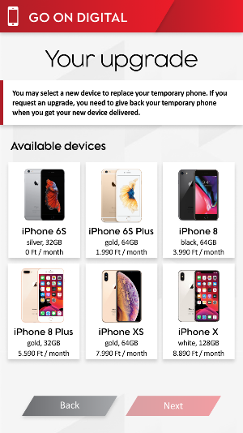
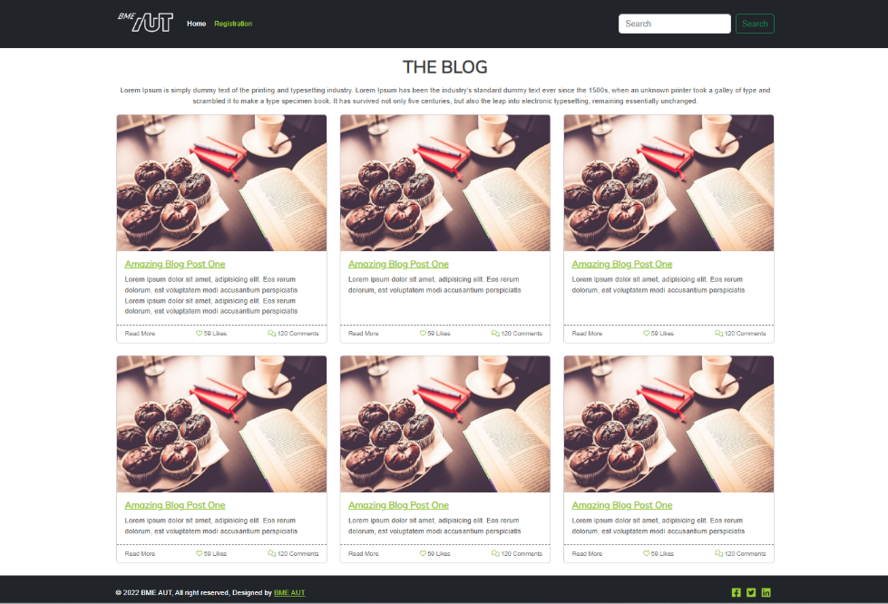
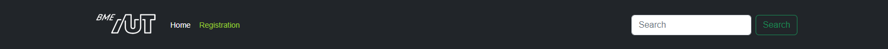
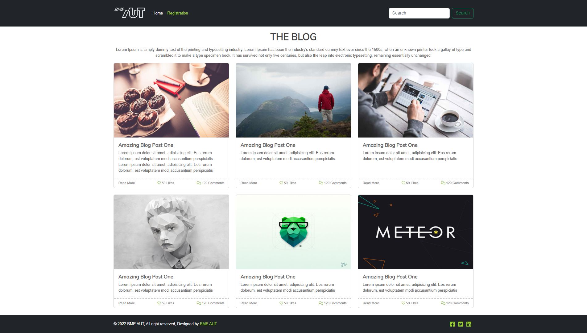
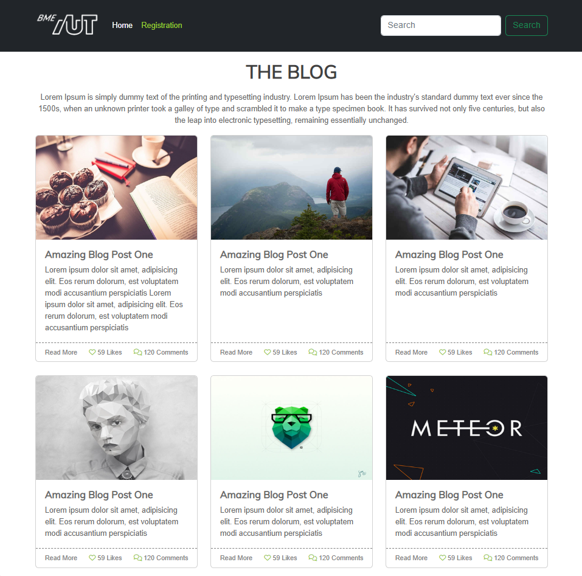
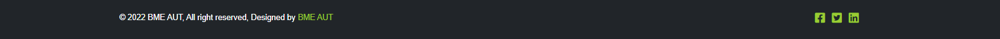
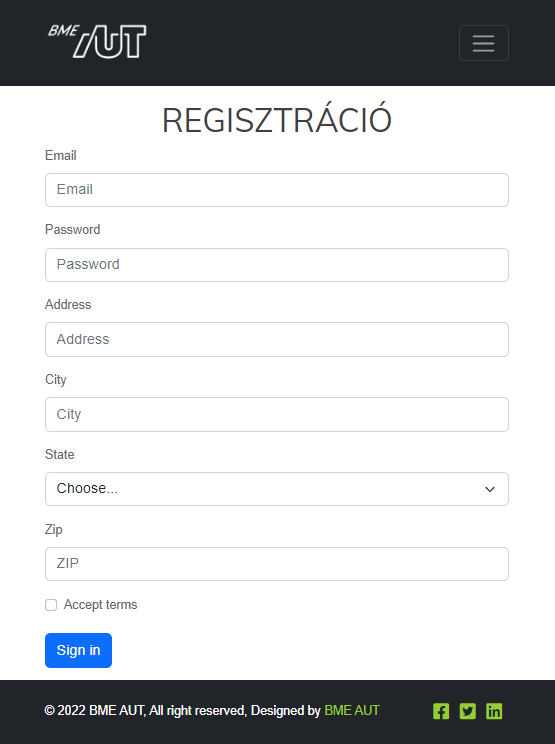

# Labor 10 - Bootstrap

## Előkészület

A feladatok megoldása során ne felejtsd el követni a feladat beadás folyamatát [Github](../../tudnivalok/github/GitHub.md).

### Git repository létrehozása és letöltése

1. Moodle-ben keresd meg a laborhoz tartozó meghívó URL-jét és annak segítségével hozd létre a saját repository-dat.
2. Várd meg, míg elkészül a repository, majd checkout-old ki.
    * Egyetemi laborokban, ha a checkout során nem kér a rendszer felhasználónevet és jelszót, és nem sikerül a checkout, akkor valószínűleg a gépen korábban megjegyzett felhasználónévvel próbálkozott a rendszer. Először töröld ki a mentett belépési adatokat (lásd [itt](../../tudnivalok/github/GitHub-credentials.md)), és próbáld újra.
3. Hozz létre egy új ágat `megoldas` néven, és ezen az ágon dolgozz.
4. A neptun.txt fájlba írd bele a Neptun kódodat. A fájlban semmi más ne szerepeljen, csak egyetlen sorban a Neptun kód 6 karaktere.

## Bevezetés

A webfejlesztésben általános jelenség, hogy a dizájnerek "csak" UI / UX terveket állítanak össze HTML és CSS kódot nem írnak, így a fejlesztők kapják azt a feladatot, hogy a megtervezett kinézetűre varázsolják az alkalmazást.

A UI/UX tervek különböző szoftverekkel készülnek attól függően, hogy mi a célja. Azonban egy dolog mindegyikben közös. Gyorsan lehet prototipizálni vele, ami könnyen demózható a megrendelőnek.

* A drótváz (wireframe), ahol a hangsúly az elrendezésen és az adatokon van, nem a színeken ott gyakran [Figma](https://www.figma.com/)-ban készül a kinézet.
    <figure markdown>
      
      <figcaption>Elkészített oldalváz figma segítségével</figcaption>
    </figure>
* Ha a hangsúly inkább a színvilágon és a designon van, akkor pedig a [Zeplin](https://app.zeplin.io/) egy gyakori választás.
    <figure markdown>
      
      <figcaption>Zeplin</figcaption>
    </figure>

A fejlesztés céljából mindegy is, hogy melyik alkalmazásban készül el az oldal designja, a rajzokból CSS és HTML kódot a fejlesztőnek kell készítenie.

A mai labor alkalmával az alábbi képből (és egy kicsi HTML váz segítségével) kell az oldalt elkészíteni.

<figure markdown>
  
  <figcaption>Elkészítendő oldal designja</figcaption>
</figure>

## Ismerkedés a kiinduló projekttel

1. Nyissuk meg a VS Code-dal leklónozott repository `feladat` mappáját (File -> Open Folder)!
2. Az alkalmazás futtatásához használjuk a VS Code Live Servert a megszokott módon (Go Live lehetőség a jobb alsó sarokban az `index.html` megnyitása után, vagy F1 > "Live Server: Open with Live Server")!
3. Ellenőrizzük, hogy megfelelően betöltődik-e az alkalmazás!

A dizájnolás folyamán általában valamilyen keretrendszerből indulunk ki, mely kész megoldásokat ad a leggyakoribb feladatokra, így csökkentve az egyedi CSS mennyiségét. A [Bootstrap](http://getbootstrap.com) két alapvető funkciót nyújt:

* Layout rendszer 
    * Reszponzív megjelenés.
    * Bootstrap Gridre épül, ami flexbox alapú
    * 5.1-től lehetőséged az, hogy a SASS forráskóban lecseréljük a BootStrap Grid-et **CSS Grid**-re, ez még egyelőre *exparimental* státuszban van. (Részletek [itt](https://getbootstrap.com/docs/5.2/layout/css-grid/) találhatók.)
* Egységes színek és formázás az alapvető elemekre.
* Gyakori komponensek (felugró ablakok, kártyák, nyitható-zárható blokkok, kiemelések, panelek) CSS és JS segítségével.

A laboron ezekből a kész komponensekből fogunk megismerni egy párat közelebbről is.

### Bootstrap hozzáadása egy oldalhoz

* Nyissuk meg az `index.html` fájlt, amit a labor során meg fogunk formázni.
* Nézzük meg, hogy az oldal `head`-jében milyen állományokat és honnan töltünk be.
  ```html
  <head>
    <meta charset="utf-8">
    <meta name="viewport" content="width=device-width, initial-scale=1">
    <title>MyBlog</title>

    <!-- Bootstrap linkelése CDN-ről -->
    <link href="https://cdn.jsdelivr.net/npm/bootstrap@5.2.2/dist/css/bootstrap.min.css" rel="stylesheet" integrity="sha384-Zenh87qX5JnK2Jl0vWa8Ck2rdkQ2Bzep5IDxbcnCeuOxjzrPF/et3URy9Bv1WTRi" crossorigin="anonymous">

    <!-- Font awesome 6 CDN-ről (solid, regular és brand is) -->
    <link rel="stylesheet" href="https://use.fontawesome.com/releases/v6.2.0/css/all.css" crossorigin="anonymous">

    <!-- Google font (Muli) letöltése -->
    <link href="https://fonts.googleapis.com/css?family=Muli" rel="stylesheet">

    <!-- Saját CSS -->
    <link rel="stylesheet" href="assets/css/site.css">
  </head>
  ```
* Figyeljük meg, hogy négy különböző CSS állományt töltünk be, egy kivételével CDN-ről:
    * Az első magát a Bootstrap-et tölti be.
    * Ezt követően egy gyakran használt ikongyűjteményt, a Font Awesome-ot töltjük le.
    * Ezen felül, mivel egyedi betűtípust használunk, azt a Google fonts oldaláról töltjük le.
    * A legutolsó hivatkozás pedig az általunk készített CSS fájlt hivatkozza be.

!!! note "Betöltési lehetőségek"
    A CSS és JS könyvtárakat többféleképpen is be tudjuk tölteni:

    * CDN-ről, publikus webről tölti le a CSS fájlt, amit most is használunk,
    * van lehetőségünk csomagkezelőt (npm, bower) használni letöltésre és magunk kiszolgálni a fájlt,
    * akár saját magunk kézzel is letölthetjük a megfelelő fájlokat, ebben az esetben is a saját webszerverünk szolgálja ki ezeket a fájlokat.

Ha az alkalmazás elrendezését szeretnénk megadni, elég sok boilerplate-jellegű CSS kódot kellene írnunk. A Bootstrap megközelítése, hogy a gyakori elrendezési lehetőségeket és stílusozási lehetőségeket készen és konfigurálhatóan adja nekünk.

A megvalósítandó oldal az alábbi főbb részekből áll:

* navigációs sáv,
* oldal központi eleme, ami blogbejegyzések listáját tartalmazza,
* lábléc.

## 1. Feladat - Reszponzív navigációs sáv

Első lépésként az oldal navigációs sávját készítjük el.

A navigációs sáv felépítése a következő:

* bal szélen található a BME AUT logo, ami az `./assets/img/logo-bme-aut.png` útvonalon érhető el,
* ezt követően a két navigációs link: Home és Registration,
* a sáv jobb szélén pedig egy keresés szövegdoboz és egy Search feliratú gomb található.

A HTML váz szerepel a kiinduló `index.html`-ben, de ebben is kell majd módosításokat végezni.

???+ tip "Fejléc tervezett kinézete az egyes felbontásokon"
    <figure markdown>
    
    <figcaption>Fejléc magas felbontáson</figcaption>
    </figure>

    <figure markdown>
    
    <figcaption>Fejléc alacsony felbontáson</figcaption>
    </figure>

    <figure markdown>
    
    <figcaption>Fejléc alacsony felbontáson nyitva</figcaption>
    </figure>

A navigációs sáv formázása gyakori feladat, így a Bootstrap ad rá kész komponenst, a **navbar** -t. 

A navigációt is reszponzívan kell megvalósítani, tehát ha átméretezzük az oldalt, akkor a navigációs menüpontokat el kell rejteni és egy úgynevezett hamburger menüt kell megjeleníteni helyette, amire kattintva megjelennek a menüpontok.

A feladat elkészítése előtt nézzük meg, hogyan épül fel a [Bootstrap navbar](https://getbootstrap.com/docs/5.2/components/navbar/) komponense. Az oldalon találunk kész HTML vázakat is.

Alapvetően két irányba indulhatunk el

* A Bootstrap mintakódját másoljuk át egyben és ebbe illesztjük bele a saját tartalmunkat.
* A saját HTML oldalvázunkból indulunk ki és egészítjük ki lépésről lépésre a Bootstrap mintában szereplő elemekkel és osztályokkal.

???+ warning "A legfontosabb osztályok, amire a navbar épít"
    * `nav` tagen értelmezett osztályok
        * **`navbar`**: Maga a navigációs sáv.
        * **`navbar-expand{-sm|-md|-lg|-xl|-xxl}`**: Töréspont definiálása ami alatt a hamburger ikonnak kell látszódia, fölötte pedig a rendes navigációs linkeknek.
        * **`navbar-dark`** és **`bg-dark`**: Sötét téma használata. 
    * **`.navbar-brand`**: brand logo megjelenítésére.
    * Hamburger ikon formázása
        * **`navbar-toggler`**: A hamburger ikon gombjára kell tenni. Mobil nézeten el lehessen rejteni a linkeket egy hamburger menü alá.
        * **`data-bs-toggle`**: Ha rákattintanak minek kell történnie. Valójában ez váltja ki az a JS hívást, aminek hatására a `data-bs-target`-ben megadott elemen mit hajtson végre.
        * **`data-bs-target`**: Melyik elemen kell végrehatani a toggle műveletet.
        * Az `aria-*` tagek az Accessibility szempontjából fontosak, de ezek megadása nélkül is működik minden.
            * `aria-controls`: Melyik HTML elemet vezérli ez az elem.
            * `aria-expanded`: Azt adja meg, hogy az elem éppen zárva `collapsed` vagy nyitva `expanded` van.
            * `aria-label`: Mivel itt labelt nem tudunk megadni, ide lehet megadni azt a szöveget, amit a `label`-nek adnánk.
    * Menüelemek formázása
        * **`collapse`** és **`navbar-collapse`**: Ez mondja meg, hogy az adott elem nyitva vagy zárva jelenjen meg, ha a hamburger ikon aktív. Ezen az elemen kell beállítani azt az `id`-t amit a `data-bs-target`-ben megadtunk.
        * **`.navbar-nav`**: teljes magasságú egyszerű navigációs elemek megadásához (a legördülő lista is támogatott).
        * **`.nav-item`**: Egy menüpont a navigációs listában.
        * **`.nav-link`**: Egy menüponton belüli linkre kell rátenni.
        * **`.active`**: Kiválasztott navigációs elem. Értemes az `aria-current="page"`-el együtt állítani.
    * `.navbar-text`: ha függőlegesen középre igazított szöveget szeretnénk használni.
    * `.collapse.navbar-collapse`: elemek csoportos elrejtésére használható.

* Válasszuk kiindulásnak [ezt](https://getbootstrap.com/docs/5.2/components/navbar/#supported-content) a template-et. Ebben már benne van minden fontos funkció, csak testre kell szabni a tartalmát és egy-egy helyen a megjelenését.

* Ennél a feladatnál azt a megoldást választjuk, hogy a Boostrap által nyúltott minta kódot szabjuk testre, hogy azok a tartalmi elemek legyenek benne ami nekünk kell.
* Másoljuk be a template teljes kódját a `index.html`-be.

``` html
<!-- Navigációs sáv -->
<nav class="navbar navbar-expand-lg bg-light">
    <div class="container">

        <!-- Brand -->
        <a class="navbar-brand" href="#">Navbar</a>

        <!-- Hamburger menü  -->
        <button class="navbar-toggler" type="button" 
            data-bs-toggle="collapse" data-bs-target="#navbarSupportedContent"
            aria-controls="navbarSupportedContent" aria-expanded="false" 
            aria-label="Toggle navigation">
        <span class="navbar-toggler-icon"></span>
        </button>

        <!-- Ez az elem záródik be ha a hamburger ikonra kattintunk -->
        <div class="collapse navbar-collapse" id="navbarSupportedContent">

        <!-- Navigációs linkek -->
        <ul class="navbar-nav me-auto mb-2 mb-lg-0">
            <li class="nav-item">
                <a class="nav-link active" aria-current="page" href="#">Home</a>
            </li>
            <li class="nav-item">
                <a class="nav-link" href="#">Link</a>
            </li>
            <li class="nav-item dropdown">
                <a class="nav-link dropdown-toggle" href="#" role="button"
                    data-bs-toggle="dropdown" aria-expanded="false">
                    Dropdown
                </a>
            <ul class="dropdown-menu">
                <li><a class="dropdown-item" href="#">Action</a></li>
                <li><a class="dropdown-item" href="#">Another action</a></li>
                <li><hr class="dropdown-divider"></li>
                <li><a class="dropdown-item" href="#">Something else here</a></li>
            </ul>
            </li>
            <li class="nav-item">
            <a class="nav-link disabled">Disabled</a>
            </li>
        </ul>

        <!-- Kereső form -->
        <form class="d-flex" role="search">
            <input class="form-control me-2" type="search" placeholder="Search" aria-label="Search">
            <button class="btn btn-outline-success" type="submit">Search</button>
        </form>
        </div>
    </div>
</nav>
```

* Figyeljük meg, hogy a `nav` tagen már rajta van a `navbar` és `navbar-expand-lg` osztály, viszont be kell állítani, hogy sötét témát használjon. Ehhez a `navbar-dark` és `bg-dark` osztályt kell használni. Részletek: [Sötét téma használata](https://getbootstrap.com/docs/5.2/components/navbar/#color-schemes).
* A `nav` alatt lévő `div` tag szolgál arra, hogy megadhassuk milyen széles legyen a fejlécünk. Itt a `container` vagy `container-fluid` értékeket célszerű használni.
* A következő elem a brand, ami a template-ben egy link, amiben csak sima szöveg található. 
    * A link a https://www.aut.bme.hu oldalra navigáljon.
    * A linken belül tanszéki logó képe szerepeljen ami a `./assets/img/logo-bme-aut.png` URL-en érhető el.
    * *Részletek: [Kép használata a brandben](https://getbootstrap.com/docs/5.2/components/navbar/#image).*
* Ezt egy `button` tag követi, ami a hamburger menü.
    * A `navbar-toggler` osztály már szerepel is rajta
    * Be van állítva, a `data-bs-target` tagben hogy melyik elemet kell megjelenítenie / elrejtenie és az is
    * És láthatjuk, hogy a `data-bs-toggle` tagben meg van adva, hogy a kattintásra minek kell történnie. 
    * A gombban pedig egy `span` található ami pedig maga a hamburger menü képe.
    * *Részletek: [Collapse használata](https://getbootstrap.com/docs/5.2/components/collapse/)*
* A következő részben az egyes navigációs linkek szerepelnek itt kell a legnagyobb változtatás.
    * Az első `li` tagben lévő link legyen a *Home* link ami az **index.html** oldara navigáljon.
    * A második `li` tagben lévő link pedig a *Registration* ami a **register.html** oldalra navigáljon.
    * A többi elemre nincs szükség, töröljük ki.
    * *Részletek: [Navigációs linkek](https://getbootstrap.com/docs/5.2/components/navbar/#nav)*.
* Az utolsó blokk pedig a kereső form.
    * Állítsuk be, hogy a `form` alsó margóra 0 legyen. Tipp: `mb-0`.
    * *Részletek [Kereső form](https://getbootstrap.com/docs/5.2/components/navbar/#forms).*

### Beadandó

!!! example "1. feladat beadandó (1 pont)"
    Készítsd el a fent ismertetett navigációs sávot Bootstrap segítségével. Ügyelj a reszpozív megjelenítésre.

    Készítsd el az alábbi képernyőképeket az elkészült navigációs sávról és másold be őket a repository gyökerébe!

    * Magas felbontáson, ahol a kereső szövegdobozban a neptunkódod szerepel **`f1-high.png`**
    * Kis felbontás zárt hamburger menü **`f1-low.png`**
    * Kis felbontás lenyitott hamburger menü, ahol a kereső szövegdobozban a neptunkódod szerepel **`f1-low-open.png`**

    Commitold a módosított HTML fájlt a repositoryba!

### iMSc - Szabály felüldefiniálása

A navigációs menüben a linkek fehér színűek, hiszen a Bootstrap erre állítja be.

Definiáld felül a Bootstrapben megadott menüpont színeket a **`site.css`** -ben úgy, hogy 

* a linkek - kivéve az aktív elemet - zöldek legyenek;
* ha egy menüpont fölé visszük az egeret, akkor váltson sötétzöldre;
* ha az aktív elem menüpontja fölé visszük az egeret az is legyen sötétzöld.
* Az `!important` kulcsszót nem használhatod!

A template amiből kiindultunk elég nagy felbontásnál vált át mobil nézetre. 
* Módosítsd az index.html oldal kódjában, hogy alacsonyabb felbontáson váltson át mobil nézetre.

### Beadandó iMSc

!!! example "1. feladat iMSc BEADANDÓ (1 iMSc pont)"
    Készíts képernyőképet **`f1-imsc-1.png`** névvel és másold a repository gyökerébe  a böngésző devTool (F12) ablakáról, amin látható, hogy milyen CSS osztály határozza meg most az egyes menüpontok (pl.: Home) betűszínét.

    Commitold a módosított HTML és CSS fájlt a repositoryba!

## 2. Feladat - Blog bejegyzés

A navigációs sáv elkészítése után térjünk át a fő tartalmi elemre, a blog bejegyzések formázására. Először csak egy bejegyzést formázzunk meg úgy, hogy az alábbi designt kapjuk.

<figure markdown>
  
  <figcaption>Egy blogbejegyzés megjelenése card használatával</figcaption>
</figure>

A blog post HTML váza már szerepel az index oldalon, ezt kell kiegészíteni a megfelelő Bootstrap osztályokkal és helyenként készíteni egy-egy egyedi CSS szabályt, amivel kiegészítjük a Bootstrap-es osztályokat.

A feladat megoldása előtt vizsgáljuk meg a [Bootstrap card](https://getbootstrap.com/docs/5.2/components/card/) komponenst!

A card komponens legfontosabb CSS osztályai az alábbiak:

* `card`: Maga a kártya
* `card-body`: A kártya tartalmi része
* `card-title`: A bodyban használjuk a cím kiemelésére.
* `card-footer`: A kártya lábléce. [Card header and footer](https://getbootstrap.com/docs/5.2/components/card/#images)
* `card-img-top`: A kártyába helyezett kép fent jelenjen meg. [Card image caps](https://getbootstrap.com/docs/5.2/components/card/#image-caps)

Az alábbi kódrészlet egy kártya felépítését mutatja, melyben kép és lábléc is szerepel.

``` html
<div class="card">
  
  <div class="card-body">
    <h5 class="card-title">Card title</h5>
    <p class="card-text">
        Some quick example text to build on the card title and make up the bulk of the card's content.
    </p>
  </div>
  <div class="card-footer">
    Footer
  </div>
</div>
```

### Megvalósítás lépései

Először az oldal címsorát és az alatta lévő bekezést formázzuk

* Állítsd be, hogy a cím alatt és fölött legyen margó. Tipp: `my-3`
* A címsor alatti bekezdés legyen középre igazítva. Tipp: `text-center`

A fenti kártya template alapján kell kiegészíteni az előre elkészített kódvázat.

* A kép legyen a kártya tetején egy linkbe ágyazva. A kép igazításához használd a `card-img-top` osztályt.
* A kép után kezdődik kártya törzse `card-body`.
* A címhez a `card-title` osztályt használd, ami szintén link is egyben. Itt készíteni kell egy külön CSS szabályt, hogy a link szövege szürke legyen `#666`. Ha fölé viszik az egeret, akkor pedig sötétzöld. Ha jó helyre illeszted a CSS-ben az új szabályt, akkor csak egyet kell létrehozni.
* A szöveges részhez a `card-text` osztályt használd.
* Az egyéb adatok pedig a kártya láblécében `card-footer` jelenjenek meg. Tipp: A lábléchez érdemes egyedi CSS osztály(oka)t is definiálni, melyben az alábbiakat kell beállítani:
    * a lábléc fölötti vonal legyen szaggatott,
    * a betűméret 0.75rem,
    * a háttérszín átlátszó,
    * a láblécben szereplő linkek legyenek szürkék és ha fölé visszük az egeret akkor zöldek. Az ikonok mindig legyenek zöldek.
    * a láblécben lévő szöveg elrendezésére is figyelj! Tip: használj flexboxot `d-flex` úgy hogy az elemek közötti távolság nőjön csak. `justify-content-between`.

### Beadandó

!!! example "2. feladat beadandó (1 pont)"
    Készíts egy képernyőképet a teljes oldalról, amin látható az elkészített blogpost - csak ez az egy - megformázva és másold a képernyőképet **`f2.png`** néven a repository gyökerébe!

## 3. Feladat - Reszponzív blog

Egészítsd ki a HTML kódot úgy, hogy az oldalon összesen 6 blogbejegyzés jelenjen meg. Az egyes bejegyzések minden adata lehet azonos, csak a képeket cseréld le. A képeket az `assets/img` könyvtárban találod. 

Mivel több kártya kerül egymás mellé egy layout megoldást kell készíteni. Az alábbi két lehetőség közül válaszd ki a szimpatikusat és az alapján készítsd el az oldal elrendezését úgy, hogy magas felbontáson 3, közepesen 2, kicsin pedig 1 bejegyzés kerüljön egy sorba.

* Az egyik megoldás a [Card groups](https://getbootstrap.com/docs/5.2/components/card/#card-groups) használata. Itt nincs padding az egyes kártyák között.
* A másik megoldás a [Grid cards](https://getbootstrap.com/docs/5.2/components/card/#grid-cards) használata, ami a bootstrap grid rendszerén alapszik.

* Állítsd be, hogy a kátyák a benne lévő szövegtől függetlenül egyforma magasak legyenek. Ahhoz, hogy látható legyen a helyes működés az első blogbejegyzés szövegét vedd hosszabbra! Tipp: `h-100`

??? info "Képernyőképek különböző felbontások"
    <figure markdown>
    
    <figcaption>Nagy képernyőméret</figcaption>
    </figure>

    <figure markdown>
    
    <figcaption>Közepes képernyőméret</figcaption>
    </figure>

    <figure markdown>
    
    <figcaption>Kicsi képernyőméret</figcaption>
    </figure>

### Beadandó

!!! example "3. feladat beadandó (1 pont)"
    Készíts egy képernyőképet, közepes felbontáson, ahol két hasábban jelennek meg a képek. A képernyőn legyen látható a böngésző DevToolbarja, ahol ki van jelölve az első `div` amin a `col` osztály szerepel és látható a rajta beállított CSS szabályok is. 

    A képernyőképet **`f3.png`** névvel másold a repository gyökerébe!

## 4. Feladat - Oldal lábléc

A következő rész a lábléc elkészítése.

* Adj meg megfelelő méretű paddingot, amihez a `p-4` CSS osztályt vagy annak egyéb változatait használd. [Bootstrap spacing](https://getbootstrap.com/docs/5.0/utilities/spacing/)
* Állítd be a sötét hátteret, úgy mint ahogy az a fejlécben is megadásra került.
* A copyright szöveg kerüljön balra, az ikonok pedig jobbra. Ehhez a flexboxot használd a bootstapben definiált osztályok segítségével. [Bootstrap felx](https://getbootstrap.com/docs/5.2/utilities/flex/)
* Készíts egyedi CSS szabályokat a láblécre ahol az alábbiakat állítod be
    * A szöveg fehér színű legyen.
    * Az egyes ikonok mérete 1.25rem legyen

<figure markdown>
  
  <figcaption>Lábléc</figcaption>
</figure>

### Beadandó

!!! example "4. feladat beadandó (1 pont)"
    Készíts egy képernyőképet **`f4.png`** névvel az elkészített láblécről, melyen a DevToolbarban látszódnak a `footer`-en beállított CSS szabályok és másold a repository gyökerébe!

## 5. Feladat - Regisztrációs űrlap

Az elkészített oldal tetején található egy Register feliratú link, ami a register.html oldalra irányít. A feladat ennek az oldalnak az elkészítése.

Mielőtt nekikezdesz a feladatnak érdemes átnézni a [Bootstrap form kezelését](https://getbootstrap.com/docs/5.2/forms/overview/).

A legfontosabb CSS osztályok az űrlapok formázásához az alábbiak:

* `form-label`: a labelre tesszük, ami egy alsó margót állít be, hogy az egymás alatt elhelyezhető `label` és `input` tagek között megfelelő távolság legyen.
* `form-control`: ezzel formázzuk a beviteli mezőket.
* `form-text`: Ha a szövegdoboz alatt szeretnénk apróbb betűs információs szöveget elhelyezni.
* Ha a címke és szövegdoboz párokat egymás alá szeretnénk tenni, akkor egy `div` tagben szoktuk összefogni a címke, szövegdoboz és az esetleges magyarázó szöveget. Így ezeket a blokkokat a `row` és `col` CSS osztályok segítségével már tetszőlegesen el tudjuk rendezni.

``` html
<div class="mb-3">
    <label for="exampleInputEmail" class="form-label">Email address</label>
    <input type="email" class="form-control" id="exampleInputEmail" aria-describedby="emailHelp">
    <div id="emailHelp" class="form-text">
        We'll never share your email with anyone else.
    </div>
</div>
```

### Megvalósítás lépései

* Hozd létre a **register.html**-t a repository gyökerében.
* Az oldal fejléc és lábléc része változatlan, tehát azt másold át a meglévő index.html oldalról. Csak az oldal középső `section` tagen belüli része fog változni.
* Adj az oldalhoz egy headinget a *Regisztráció* szöveggel. A headingek megjeléséhez is vannak előre definiált (és felüldefiniálható) CSS osztályok: [Bootstrap heading](https://getbootstrap.com/docs/5.2/content/typography/#display-headings)
* A címsor alatt egy regisztrációs űrlapot kell készíteni, ahol a felhasználótó bekérjük a következő alábbi adatokat: 
    * **Email**: A felhasználó email címe.
    * **Password**: Választott jelszó, ahol a beírt karakterek nem látszódnak.
    * **State**: Előre feltöltött legödülő lista. Tipp: [Bootstrap select](https://getbootstrap.com/docs/5.2/forms/select/) 
    * **ZIP**: Irányítószám (csak szám lehet)
    * **City**: Város szabad szöveges mező
    * **Address**: Utca, házszám szabad szöveges mező
    * **Accept terms**: Checkbox, hogy elfogadja a feltételeket. Tipp: [Bootstrap checkbox](https://getbootstrap.com/docs/5.2/forms/checks-radios/)
    * **Sign in**: gomb, ami elküldi az űrlapot a szerverre.

* Az inputok létrehozásánál ügyelj mindig a megfelelő típus használatára és mindenhol adj meg name attribútumot, hogy az adatokat el lehessen küldeni a szerverre.
* A szövegdobozokba tegyél placeholder szöveget is.
* Az alábbi képen látható elrendezést valósítsd meg.

A layout kialakításához vizsgáld meg a [Bootstrap form layout](https://getbootstrap.com/docs/5.2/forms/layout/) megoldásokat.

<figure markdown>
  
  <figcaption>Regisztrációs űrlap asztali nézetben</figcaption>
</figure>

* Ellenőrizd, hogy az oldal kis képernyő méreten az alábbi elrendezésben jelenik-e meg. Ha nem, akkor javítsd a kódot, hogy az alábbi kinézetet kell kapnod.

<figure markdown>
  
  <figcaption>Regisztrációs űrlap mobil nézetben</figcaption>
</figure>

!!! example "5. feladat beadandó (1 pont)"
    Az elkészített űrlapot töltsd ki és a Address mezőbe a **neptun kódodat** írd be, majd kattints a Sing in gombra. Ekkor az URL-ben láthatóak lesznek a formban megadott adatok is. Erről készíts egy képernyőképet, amit **`f5.png`** néven másolj be a repository gyökerébe.

### iMSc - Űrlap középre igazítása

* Flexbox segítségével igazítsd a regisztrációs űrlapot függőlegesen középre.
    * Először állítsd be, hogy a `body` is flexboxot használjon és olyan magas legyen mind a böngésző. Használd az oszlop-os elrendezést.
    * Add meg, hogy középre legyen igazíva a tartalmi rész. Itt érdemes a `margin: auto` használta.
    * A középre igazított rész köré tegyél egy 1px vastag keretet is.
* Definiáld felül a placeholder szövegek megjelenítését is. Legyen piros dőlt betű a placeholder mindenhol. Tipp: `::placeholder`

!!! example "5. feladat iMSc BEADANDÓ (1 iMSc pont)"
    Demonstráld képernyőképpel **`f5-iMsc.png`** a fenti megjelenést.
