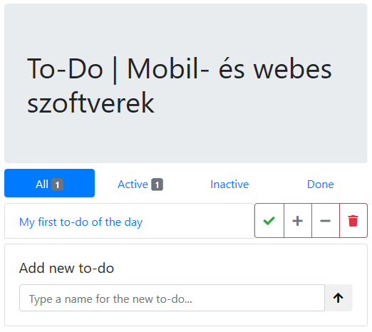

# Labor 11 - JavaScript alapok

## Bevezetés

A laborok során a hallgatók laborvezetői segítséggel, majd önállóan végeznek feladatokat a webes technológiák gyakorlati megismerése érdekében.

??? note "A JavaScriptről dióhéjban"
    A korábban megismert HTML és CSS adják a weboldalunk vázát, alapműködését és kinézetét, viszont a korai dokumentum-alapú weboldalaktól áttértünk a dinamikus weboldalakra, melyek futás időben módosítják az aktuális dokumentumot (a DOM-ot), így interakciót kezelhetünk, és a weboldalunkra (a kliens oldalra) önálló alkalmazásként tekintünk.

    Az alkalmazásainkhoz dinamizmust (időbeni változást) szkripteléssel rendelünk, erre JavaScriptet használunk. A JavaScript egy dinamikusan típusos, interpretált szkriptnyelv, a hozzá tartozó futtatókörnyezetek végrehajtó egységei pedig alapvetően egyszálúak, így nincsen kölcsönös kizárási problémánk.

    Érdemes továbbá megemlíteni a felhasználandó típusokat (`function`, `object`, `string`, `number`, `undefined`, `boolean`, `symbol`), az ezek közötti szabad konverziót és a JavaScript eseményhurkot (**event loop**). Az event loop a JavaScriptet folyamatosan befejeződésig futtatja (**"Run-to-completion"**), amíg a futás be nem fejeződik, majd aszinkron eseményre vár. Az események bekövetkeztével az eseményhez regisztrált eseménykezelők lefutnak. Az események lehetnek:

    * felhasználói interakció,
    * időzítés,
    * IO műveletek eredménye (pl. AJAX, Websocket).

    !!! summary "A fontosabb kulcsgondolatok tehát röviden"
        * interpretált futtatás,
        * DOM dinamikus manipulációja,
        * dinamikus típusosság és típuskonverzió,
        * egyszálúság, event loop és aszinkronitás.

    Említésre méltó még, hogy a JavaScript (klasszikus értelemben véve) nem objektum-orientált, az osztályok koncepciója a nyelvben később jelent meg; a nyelv a **prototipikus öröklés** módszerét alkalmazza az objektumorientált megközelítéshez. Ezen kívül különös sajátosságai vannak, a `this` kulcsszó pl. nem az aktuális *objektumra*, hanem az aktuális *függvényre* mutat (kivétel az *arrow syntax*, ami a `this`-t az eredeti értéken hagyja).

    !!! note Lábjegyzet
        Az Internet Explorer elhíresült arról, hogy a fejlesztés rá jelentősen nehézkesebb, mint bármely alternatívára. Ma már a Microsoft is hivatalosan is az új, Chromium alapú Edge böngészőt támogatja, amely - a már nem is támogatott - Windows 7 OS-en is működik, így új weboldalakat Internet Explorer támogatással már nem kell készítenünk.

### Git repository létrehozása és letöltése

A feladatok megoldása során ne felejtsd el követni a feladat beadás folyamatát [Github](../../tudnivalok/github/GitHub.md).

1. Moodle-ben keresd meg a laborhoz tartozó meghívó URL-jét és annak segítségével hozd létre a saját repository-dat.
2. Várd meg, míg elkészül a repository, majd checkout-old ki.
    * Egyetemi laborokban, ha a checkout során nem kér a rendszer felhasználónevet és jelszót, és nem sikerül a checkout, akkor valószínűleg a gépen korábban megjegyzett felhasználónévvel próbálkozott a rendszer. Először töröld ki a mentett belépési adatokat (lásd [itt](../../tudnivalok/github/GitHub-credentials.md)), és próbáld újra.
3. Hozz létre egy új ágat `megoldas` néven, és ezen az ágon dolgozz.
4. A neptun.txt fájlba írd bele a Neptun kódodat. A fájlban semmi más ne szerepeljen, csak egyetlen sorban a Neptun kód 6 karaktere.
5. Nyissuk meg a Visual Studio Code-dal leklónozott repository `feladat` mappáját (File -> Open Folder)!
6. Az alkalmazás futtatásához adjuk ki a Terminalban (Ctrl+ö) az alábbi parancsot: `http-server` (ügyeljünk arra, hogy a helyes útvonalon adjuk ki a parancsot), vagy használjuk a VS Code Live Servert a megszokott módon (Go Live lehetőség a jobb alsó sarokban az `index.html` megnyitása után, vagy F1 > "Live Server: Open with Live Server")!
7. Ellenőrizzük, hogy megfelelően betöltődik-e az alkalmazás!

## Feladat 1 - Egyszerű eseménykezelés

A laboron egy egyszerű "offline" To-Do alkalmazást készítünk.

Az alkalmazás alapjaként egy egyszerű HTML oldal szolgál, amihez a saját JavaScriptünket írjuk. A JS kódot HTML-ben is elhelyezhetnénk, viszont az nem karbantartható és alapvetően nem best practice, úgyhogy a saját `todo.js` fájlba fogjuk tenni a kódot, amit behivatkozunk. A stílusozást Bootstrappel oldjuk meg.

!!! warning cache
    A böngésző különböző körülmények függvényében **cache-elheti a fájljainkat**, ezért a frissítést ilyenkor kézzel kell megoldanunk. Ne felejtsük el menteni a fájlt, ezután a böngészőben állítsuk be az F12 Developer Tools-ban a Network fülön az "Always refresh from server"/"Disable cache" vagy hasonló elnevezésű beállítást!



Láthatjuk, hogy a statikus oldal az alábbiakból tevődik össze:

* cím,
* fülek az összes, aktív, inaktív és kész elemek szűrésére,
* a to-do elemek listája, az egyes elemek mellett az értelmezett műveletek,
* új elem hozzáadása panel, melyen az új to-do bejegyzés szövegét kell megadnunk egy űrlapon.

A `<body>` végén egy `<script>` a `todo.js` fájlra hivatkozik! A szkript az oldal lényegi tartalmának betöltődése után fut le, így nem kell majd várakoznunk a dokumentum teljes betöltődésére (a gyakorlatban ez azt jelenti, hogy a szkript futásának kezdetén a DOM a HTML-nek megfelelő állapotban már létrejött). A gyakorlatban ez változó, szokás a `<head>` elemben in betölteni JS fájlokat amikor kritikus, viszont az gátolja a HTML megjelenését, amíg a JS fájl le nem töltődik.

Az egyes to-do-k modelljére érdemes saját osztályt definiálnunk.

!!! tip Osztályok
    Modern (ES6/ES2015 és magasabb) JavaScriptben konstruktor függvény helyett használhatunk valós osztályokat is, a gyakorlaton ezt fogjuk látni. JavaScriptben egy (nem osztály) függvény konstruktorfüggvény, ha a `this` változón tulajdonságokat helyez el és nem tér vissza semmivel. Ekkor a `new` kulcsszóval meghívva a függvényt az konstruktorként funkcionál és a `this` (tulajdonságokkal "felaggatott") értékét kapjuk vissza. Ezen felül az `instanceof` kulcsszóval megvizsgálhatjuk, hogy egy adott függvény konstruktora által készített objektumról van-e szó, tehát *szinte* már osztálypéldányként kezelhetjük az objektumot.

A fülek lehetséges állapotai az "all", "active", "inactive" és "done", az "all" kivételével ezeket az állapotokat veheti fel egy to-do elem is.

A `todo.js` elejére vegyük fel a Todo osztályt, annak konstruktorfüggvényét és a konkrét példányokat tároló (üres) tömböt, valamint a lehetséges állapotokat:

```js
class Todo {
    constructor(name, state) {
        this.name = name;
        this.state = state;
    }
}

const todos = [];
const states = ["active", "inactive", "done"];
const tabs = ["all"].concat(states);

console.log(tabs);
```

!!! info "JavaScript változók"
    JavaScriptben három kulcsszóval deklarálhatunk lokális változót:

    * `var`: az "eredeti" módja a változó deklarációjának, modern JS-ben érdemes kerülni. Engedi ugyanazon változó újradeklarációját, sőt, nem köti scope-hoz a változót.
    * `let`: scope-hoz köti a változót, ezért nem deklarálható újra és nem is "szivárog" át a scope-ok között.
    * `const`: konstans értékű/referenciájú "változót" (érdekes változónak nevezni, ha nem változhat) tárol. A változó nem kaphat új értéket (tehát ha referenciatípus, pl. objektum vagy tömb, akkor nem lehet új objektumot/értéket adni a változónak), de ha objektumot tárol, annak tagjai (vagy a tömb elemei) értelemszerűen változhatnak.

A legnyilvánvalóbb (ha nem is a legrobusztusabb) módja a hibakeresésnek az, ha a konzolra írunk. Az F12 segítségével a Console fülön láthatjuk a kimenetet.

Iratkozzunk fel a form `submit` eseményére és kezeljük az új to-do elem létrehozását! A feliratkozást megtehetjük HTML-ből és JavaScriptből is, most az utóbbit alkalmazzuk! Illesszük be az alábbi kódrészletet a korábbi kódrészletek után!

```js
const form = document.getElementById("new-todo-form");
const input = document.getElementById("new-todo-title");

form.onsubmit = event => {
    event.preventDefault(); // meggátoljuk az alapértelmezett működést, ami frissítené az oldalt
    if (input?.value?.length) { // ha érvényes érték van benne -- ekvivalens ezzel: if (input && input.value && input.value.length) vagy if (input != null && input.value != null && input.value.length > 0)
        todos.push(new Todo(input.value, "active")); // új to-do-t aktív állapotban hozunk létre
        input.value = ""; // kiürítjük az inputot
        // TODO: újrarajzolni a listát
    }
}
```

Definiálnunk kell még a gombokat, amiket a Todo-hoz fogunk rendelni. Nem volna *szükség* a modellek definiálására, elvégre is a JS egy dinamikus nyelv, de struktúrát ad a kódnak, objektum-orientáltabban kezelhető.

!!! info IntelliSense
    A VS Code-ban valószínűleg az IntelliSense nyomára tudunk bukkanni a JS kód írása közben. Ennek az oka nem a JavaScript, hanem a háttérben futó TypeScript fordító. Mivel minden JavaScript egyben TypeScript kód is, ezért a típusinformációk kinyerhetők a kódból. Ez a TypeScript nagy előnye a JS-sel szemben. Fordítási hibáink nem lesznek JavaScriptben, de az IntelliSense segítségét ki lehet így használni.

```js
class Button {
    constructor(action, icon, type, title) {
        this.action = action; // a művelet, amit a gomb végez
        this.icon = icon; // a FontAwesome ikon neve (class="fas fa-*")
        this.type = type; // a gomb Bootstrapbeni típusa ("secondary", "danger" stb.)
        this.title = title; // a gomb tooltip szövege
    }
}

const buttons = [ // a gombokat reprezentáló modell objektumok tömbje
    new Button("done", "check", "success", "Mark as done"),
    new Button("active", "plus", "secondary", "Mark as active"),
    // az objektumot dinamikusan is kezelhetjük, ekkor nem a konstruktorral példányosítjuk:
    { action: "inactive", icon: "minus", type: "secondary", title: "Mark as inactive" },
    new Button("remove", "trash", "danger", "Remove"),
];
```

Így már gyakorlatilag fel tudunk venni új elemet, viszont ez nem látszik a felületen, ugyanis csak memóriában dolgoztunk, és nem módosítottuk megfelelően a DOM-ot. Írjunk egy függvényt, ami az összes to-do elemet kirajzolja a felületre! A jelenlegi sablon alapján kódból összeállítjuk a DOM-részletet.

Előszöris készítsünk egy segédfüggvényt, aminek átadhatunk tetszőleges HTML stringet, és ő elkészít nekünk memóriában egy virtuális DOM elemet:

```js
function createElementFromHTML(html) {
    const virtualElement = document.createElement("div");
    virtualElement.innerHTML = html;
    return virtualElement.childElementCount == 1 ? virtualElement.firstChild : virtualElement.children;
}
```

Erre azért van szükség, mert nincs arra natív JavaScript API (jelenleg), hogy stringből HTML elemet hozzunk létre, viszont bármely (akár virtuális, tehát az aktuális DOM-ban nem, de memóriában létező) DOM elem innerHTML-jének beállításával a DOM elem(ek) ténylegesen létrejön/nek. Alternatív megoldásként megtehetnénk, hogy létrehozzuk a `createElement` segítségével az elemet, majd egyesével beállítjuk az attribútumait, de az jóval körülményesebb, kódolósabb megoldást eredményez.

```js
function renderTodos() {
    const todoList = document.getElementById("todo-list"); // megkeressük a konténert, ahová az elemeket tesszük
    todoList.innerHTML = ""; // a jelenleg a DOM-ban levő to-do elemeket töröljük
    todos.forEach(todo => { // bejárjuk a jelenlegi todo elemeket (alternatív, funkcionális bejárással)
        const row = createElementFromHTML(
            `<div class="row">
                <div class="col d-flex p-0">
                    <a class="list-group-item flex-grow-1" href="#">
                        ${todo.name}
                    </a>
                    <div class="btn-group action-buttons"></div>
                </div>
            </div>`);

        buttons.forEach(button => { // a gomb modellek alapján legyártjuk a DOM gombokat
            const btn = createElementFromHTML(
                `<button class="btn btn-outline-${button.type} fas fa-${button.icon}" title="${button.title}"></button>`
            );
            if (todo.state === button.action) // azt a gombot letiljuk, amilyen állapotban van egy elem
                btn.disabled = true;

            // TODO: a gomb klikk eseményének kezelése

            row.querySelector(".action-buttons").appendChild(btn); // a virtuális elem gomb konténerébe beletesszük a gombot
        });

        todoList.appendChild(row); // az összeállított HTML-t a DOM-ban levő #todo-list elemhez fűzzük
    });
}

renderTodos(); // kezdeti állapot kirajzolása
```

!!! tip selectorok
    A `querySelector()/querySelectorAll()` API-kkal egy CSS szelektort adhatunk meg a document-en vagy egy elemen, és az illeszkedő első/összes elemet kapjuk vissza.

Most már látjuk, hogy mi fog kerülni a `// TODO` komment helyére a form elküldésekor:

```js
renderTodos();
```

!!! warning Törlés
    Ha abba a hibába esnénk, hogy a DOM elemeket egyesével szeretnénk eltávolítani a DOM-ból a `#todo-list` elem `children` tulajdonságának segítségével, vigyáznunk kell, ugyanis ez egy "élő" kollekció: miközben az elemeket töröljük, a kollekció length tulajdonsága is változik! Persze egy egyszerű `for` ciklussal megoldható, de mindenképpen a végétől indulva járjuk be a kollekciót, amíg az ki nem ürül!

!!! example "BEADANDÓ (1 pont)"
    Illesszen be egy képernyőképet néhány hozzáadott tennivalóról! (`f1.png`)

## Feladat 2 - Állapotok

A DOM elemekre kattintva be tudjuk állítani az aktuális állapotot, ezt a **DOM elemhez eseménykezelő rendelésével** tehetjük meg. Eseménykezelőt a HTML-ben az `on\*` attribútumok megadásával tudunk kötni, JavaScriptben a DOM API-t használva pl. az elem referenciáját megszerezve az `.addEventListener("eseménynév", callbackFüggvény)` függvény meghívásával vagy a megfelelő feliratkoztató függvény beállításával (pl. `onclick = callbackFüggvény`). A JS kódot az alábbival egészítsük ki:

```js
let currentTab; // a jelenleg kiválasztott fül

function selectTab(type) {
    currentTab = type; // eltároljuk a jelenlegi fül értéket
    for (let tab of document.getElementsByClassName("todo-tab")) {
        tab.classList.remove("active"); // az összes fülről levesszük az .active osztályt
        if (tab.getAttribute("data-tab-name") == type) // ha ez a fül van épp kiválasztva
            tab.classList.add("active"); // erre az egyre visszatesszük az .active osztályt
    }

    renderTodos(); // újrarajzolunk mindent
}

selectTab("all"); // app indulásakor kiválasztjuk az "all" fület
```

!!! info "self-invoking function declaration"
    A fenti minta, amikor egy függvényt a definiálása után közvetlenül meghívunk, egy "csúnyább", de elterjedt alternatívával szokták alkalmazni, ez az ún. *self-invoking function declaration*, aminek sok változata ismeretes, ez az egyik:
    ```js
    (const selectTab = function(type) { /* ... */})("all");
    ```

A `selectTab` függvény hívását a HTML-ből kössük a klikk eseményre (megtehetnénk kódból is, de lássunk erre is példát), cseréljük le a tabok tartalmát:

```html
<li class="nav-item">
    <a class="todo-tab nav-link" data-tab-name="all" href="#all" onclick="selectTab('all')">
        All <span class="badge bg-secondary">1</span>
    </a>
</li>
<li class="nav-item">
    <a class="todo-tab nav-link" data-tab-name="active" href="#active" onclick="selectTab('active')">
        Active <span class="badge bg-secondary">1</span>
    </a>
</li>
<li class="nav-item">
    <a class="todo-tab nav-link" data-tab-name="inactive" href="#inactive" onclick="selectTab('inactive')">
        Inactive <span class="badge bg-secondary"></span>
    </a>
</li>
<li class="nav-item">
    <a class="todo-tab nav-link" data-tab-name="done" href="#done" onclick="selectTab('done')">
        Done <span class="badge bg-secondary"></span>
    </a>
</li>
```

Az elemhez adattároló attribútumot is rendeltünk, ezt az attribútumot a `data-` előtaggal láttuk el jelezvén, hogy az attribútum kizárólag adathordozásra szolgál.

Az elemek állapotának változását hasonlóképpen kezelhetjük, amikor a gombokat gyártjuk a `renderTodos()` függvényben, az eseménykezelőket ott helyben fel tudjuk regisztrálni (a `// TODO` komment helyére kerüljön):

```js
btn.onclick = () => { // klikk eseményre
    if (button.action === "remove") { // ha törlés
        if (confirm("Are you sure you want to delete the todo titled '" + todo.name + "'?")) { // megerősítés után
            todos.splice(todos.indexOf(todo), 1); // kiveszünk a 'todo'-adik elemtől 1 elemet a todos tömbből
            renderTodos();
        }
    }
    else { // ha nem törlés
        todo.state = button.action; // átállítjuk a kiválasztott todo állapotát a gomb állapotára
        renderTodos();
    }
}
```

!!! tip Confirm
    Érdekesség a `confirm()` függvény, amely böngészőben natívan implementált: a felhasználónak egy egyszerű megerősítő ablakot dob fel a megadott szöveggel, és blokkolva várakozik a válaszra. A válasz egy boolean érték, így az `if` törzse csak akkor fut le, ha a felhasználó OK-val válaszol. Hasonló az `alert()`, az viszont csak egy OK-zható figyelmeztetést dob fel, ami nem tér vissza semmivel, ill. a `prompt()`, amivel stringet kérhetünk be. Ezeket ritkán, lehetőleg soha nem használjuk, helyettük nem blokkoló, aszinkron egyedi megoldást készítünk.

    Ha `for (var ... in ...)` ciklust és `function`-t használnánk a `buttons` és `todos` tömbökön, akkor a klikk eseménykezelő ebben a formában hibás lesz, mert az iterációk újrahasznosítanák a todo és button változókat. Az arrow function viszont ezeket a változókat ún. "closure"-be helyezi, technikailag a változókból egy lokális másolat készül, így a függvény helyesen fog lefutni.

Egészítsük ki a `renderTodos()` függvényt, hogy frissítse a fülek mellett található badge-ben megjelenő számértékeket:

```js
document.querySelector(".todo-tab[data-tab-name='all'] .badge").innerHTML = todos.length || "";

for (let state of states)
    document.querySelector(`.todo-tab[data-tab-name='${state}'] .badge`).innerHTML = todos.filter(t => t.state === state).length || "";
```

!!! info Filter
    A `filter()` függvénynek egy callbacket adunk át, ez fog kiértékelődni minden elemre: ha a feltétel igaz, akkor az elemet visszakapjuk, különben nem. Magyarul: azokra az elemekre szűrünk, amelyek állapota az aktuálisan bejárt állapot ("active", "inactive", "done"), tehát megszámoljuk, hány elem van az adott státuszban. Ezen felül, ha az érték `falsey`, tehát esetünkben 0, helyette üres stringet adunk vissza, így nem fog megjelenni a badge.

Utolsó lépésként logikus, hogy az aktuális fül alapján szűrjük le az elemeket, ne mindig az összes látszódjon. Ezt a `renderTodos()` apró módosításával tudjuk megtenni, a `todos.forEach(todo =>` helyett írjuk az alábbit:

```js
todos.filter(todo => ["all", todo.state].includes(currentTab)).forEach(todo => {
```

!!! tip Alternatíva
    Kicsit bőbeszédűbb, de ekvivalens megoldás az alábbi:

    ```js
    const filtered = todos.filter(function(todo){ return todo.state === currentTab || currentTab === "all"; });
    filtered.forEach(function (todo) { // ...
    ```

    Tehát az eredeti `todos` tömböt a `filter` segítségével szűrjük úgy, hogy csak azok az elemek maradjanak a szűrt tömbben, ami az aktuális fülnek megfelel VAGY az "all" fülön gyunk (tehát látszódjon minden).

    Szintén alternatív megoldásként, valamivel optimálisabban futó, a fül vizsgálatot kiszervezhetjük:

    ```js
    (currentTab === 'all' ? todos : todos.filter(todo => todo.state === currentTab)).forEach(todo => {
    ```

!!! example "BEADANDÓ (1 pont)"
    Illesszen be egy-egy képernyőképet (`f2.1.png`, `f2.2.png`, `f2.3.png`) a tennivalók állapotainak változtatásáról, a különböző oldalakon történő megjelenésükről!

## Feladat 3 (Önálló) - Sorrendezés

Legyenek fel-le mozgathatók a to-do elemek az `all` listában!

* Hozzon létre két új gombot, amely a felfelé és lefelé mozgatást jelzik az elemnél! Használja a `fas fa-arrow-up` és `fas fa-arrow-down` osztályokat az ikonokhoz! A gombok csak az `all` fülön legyenek láthatók!
* A gomb legyen letiltva, ha nem mozgatható a megadott irányba az elem!
* A gombra kattintva az elem kerüljön előrébb/hátrébb az elemek listájában!

!!! example "BEADANDÓ (1.5 pont)"
    Illesszen be egy-egy képernyőképet néhány tennivalóról sorrendezés előtt és után! (`f3.1.png`, `f3.2.png`)

## Feladat 4 (Önálló) - Perzisztálás

Egy to-do listának nem sok értelme van, ha nem menthetők el az adataink. A mentésre egyértelmű lehetőséget biztosít a `localStorage` és a `sessionStorage`. Mindkettő kulcs-érték tároló, a kulcsok és értékek egyaránt `string` típusúak. A különbség a kettő között az élettartamuk: míg a `localStorage` - bár korlátos méretű - a böngészőt újraindítva is megtartja állapotát, a `sessionStorage` a böngészőt/fület bezárva elvész. A `sessionStorage` adatokat memóriában, a `localStorage` adatokat viszont perzisztensen, fájlban tárolja a böngésző.

A tároláshoz minden renderelési ciklus elején volna érdemes mentenünk. Bár az alkalmazásunk `renderTodos()` függvénye nevéből fakadóan a DOM-ot manipulálja, ez az a pont, ahol bármilyen változásról értesülünk. Fontos, hogy tartsuk be a *separation of concerns* elvet: mindenki a saját feladatával foglalkozzon! Ezért ne itt valósítsuk meg a perzisztálást, hanem egy saját függvényben, amit meghívunk minden változást indukáló ponton a kódban:

* elem állapotának változása,
* elem létrehozása,
* elem törlése.

! note Változásdetektálás
    Komplexebb alkalmazásfejlesztő keretrendszerekben is problémát okoz a változásokról történő értesülés, a React, az AngularJS és az Angular mind más és más módszereket alkalmaznak a változások detektálására.

A tároláshoz a `localStorage.setItem(key, value)` függvényt használjuk. A sorosítandó objektumot egyszerűen JSON-be sorosíthatjuk: `JSON.stringify(object)`, illetve visszafejthetjük: `JSON.parse(string)`.

!!! warning "Objektum sorosítás"
    Fontos, hogy a `JSON.parse()` által visszafejtett objektumok egyszerű objektumok, ha a forrás objektumunkon pl. függvények is szerepeltek, azok a deszerializált objektumon nem lesznek elérhetők!

A részfeladatok tehát:

* készítsen egy függvényt, ami elmenti a teljes todos tömb tartalmát `localStorage`-ba,
* bármilyen változás hatására (elem állapotváltozása, létrejötte, törlése) mentse el a függvény segítségével az elemeket,
* alkalmazás indulásakor egyetlen alkalommal töltse vissza az összes eltárolt todo elemet, és ez legyen a `todos` változó kiinduló tartalma!

!!! tip "Storage debuggolás"
    A storage tartalmát böngészőtől függően különböző helyen tudjuk megvizsgálni, jellemzően a Storage vagy Debugger fülön található.

!!! example "BEADANDÓ (1.5 pont)"
    Illesszen be egy képernyőképet a lokális tárolóban (localStorage) található perzisztált to-do elemekről! (`f4.png`)
