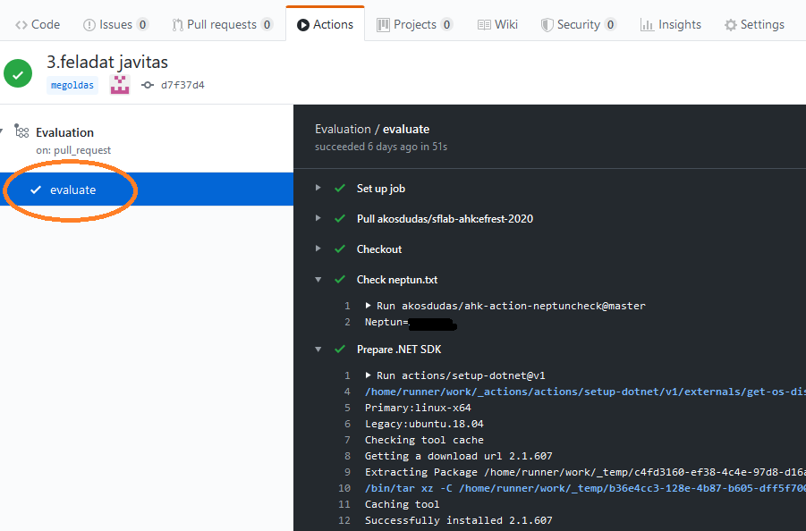
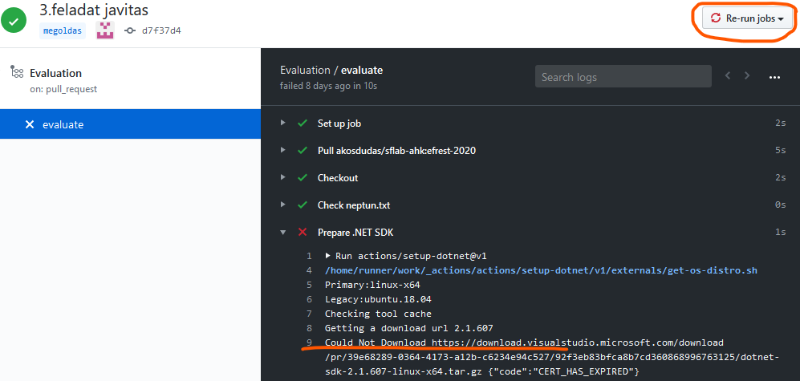

# GitHub Actions ismertető

A laborfeladatok kiértékelésében a [GitHub Actions](https://github.com/features/actions)-re támaszkodunk. Segítségével a git repository-kon műveleteket és programokat tudunk futtatni. Ilyen művelet például a C# kód lefordítása, vagy a beadott kód tesztelése.

A lefutott kiértékelésről a pull request-ben fogsz értesítést kapni. Ha meg szeretnéd nézni részletesebben a háttérben történteket, vagy például az alkalmazás naplókat, a GitHub felületén az _Actions_ alatt indulhatsz el.

Az _Actions_ felületén un. _Workflow_-kat látsz; minden egyes kiértékelés futtatás egy-egy elem lesz itt (tehát historikusan is visszakereshetőek).

Ezek közül egyet kiválasztva (pl. a legfelső mindig a legutolsó) láthatod a workflow futásának részleteit. A futás naplójához a bal oldali listában még kattintani kell egyet. Jobb oldalon látható a folyamat teljes naplója.

Minden zöld pipa egy-egy sikeres lépést jelent. Ezen lépések nem azonosak a feladatokokkal, hanem a kiértékelés folyamatának lépései lesznek. Ilyen lépés például a környezet előkészítése, pl. a .NET SDK telepítése (minden kiértékelés egy vadiúj környezetben indul, így mindent elő kell készíteni).

Alapvetően a lépések mindig sikeresek, akkor is, ha a megoldásodban hiba van, mert a kiértékelés erre fel van készítve. Kivételt ez alól csak a `neptun.txt` hiánya ill. a C# kód lefordítása jelent. Előbbi feltétlenül szükséges, ezért semmilyen folyamatot nem hajtunk végre nélküle. Utóbbi esetében a C# kód fordítása szintén szükséges a továbblépéshez, ezért sikertelenség esetén leáll a folyamat.

Néha előfordulhat azonban tranziens, időszakos hiba is. Például a .NET környezet letöltése nem sikerül hálózati hiba miatt. Ilyen esetben a futtatást kézzel meg lehet ismételni. Ez persze csak akkor segít, ha tényleg átmeneti hibáról van szó, tehát pl. egy C# fordítási hibán nem fog segíteni. (Ezt a hibaüzenetből illetve a lépés nevéből tudod kideríteni, vagy legalább is megtippelni kellő bizonyossággal.)

A feladat függvényében akár az alkalmazás naplókat is meg tudod nézni itt. Pl. amikor .NET alkalmazást készítesz, az alkalmazást elindítjuk, és minden, amit naplóz, itt megtekinthető.

Az alábbi például egy Entity Framework-öt használó alkalmazás inicializását mutatja, köztük például a kiadott SQL parancsokat is. Debuggolás közben a Visual Studio _Output_ ablakában is hasonlókat láthatsz. Ez természetesen nagyban függ a konkrét feladattól.

