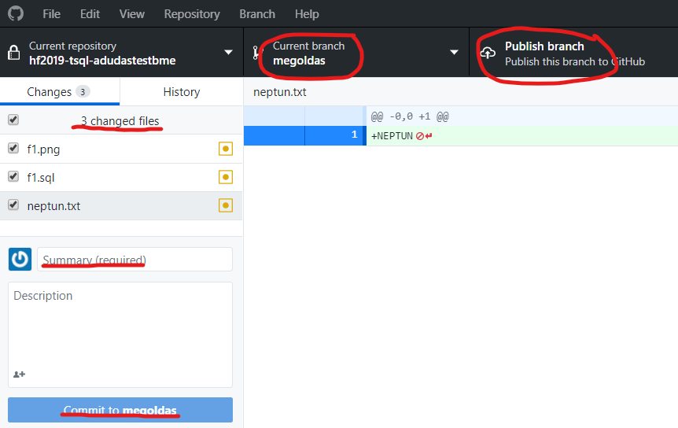
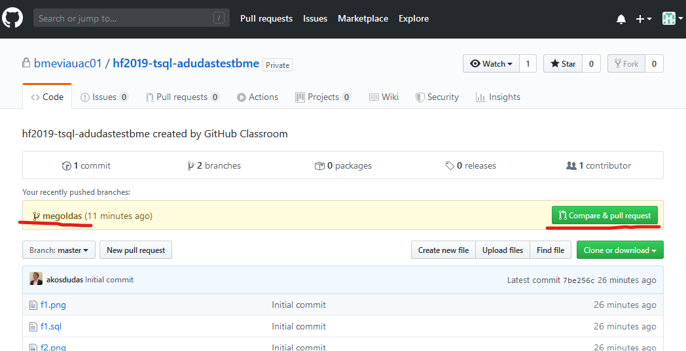
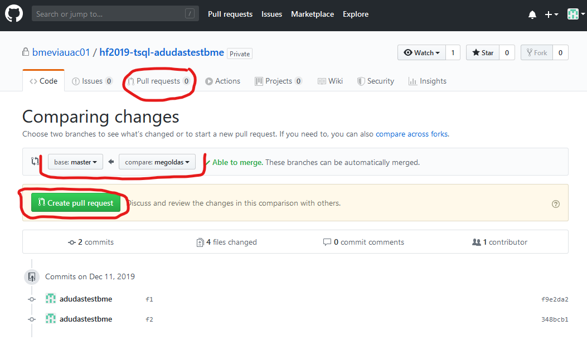
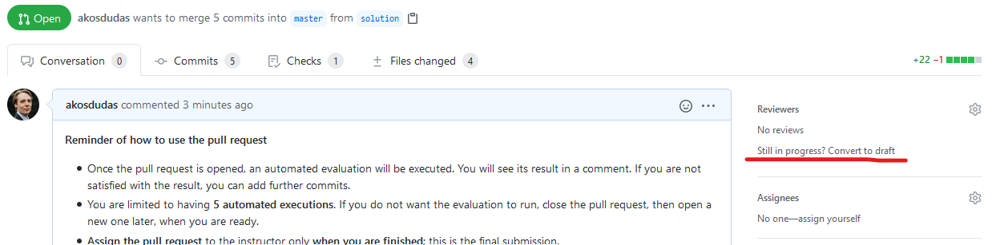
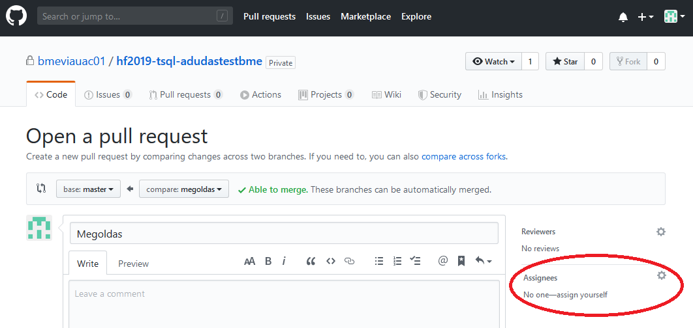

# Feladatok beadása (GitHub)

A feladatok beadásához a GitHub platformot használjuk. Minden labor beadása egy-egy GitHub repository-ban történik, melyet a feladatleírásban található linken keresztül kapsz meg. A labor feladatainak megoldását ezen repository-ban kell elkészítened, és ide kell feltöltened. A kész megoldás beadása a repository-ba való feltöltés után egy un. _pull request_ formájában történik, amelyet a laborvezetődhöz rendelsz.

!!! important "FONTOS"
    Az itt leírt formai előírások betartása elvárás. A nem ilyen formában beadott megoldásokat nem értékeljük.

## Rövidített verzió

Alább részletesen bemutatjuk a beadás menetét. Itt egy rövid összefoglaló az áttekintéshez, illetve a helyes beadás ellenőrzéséhez.

1. A munkádat Moodle-ben található GitHub Classroom meghívó linken keresztül létrehozott GitHub repository-ban kell elkészítsd.

1. A megoldáshoz készíts egy külön ágat, ne a _master_-en dolgozz. Erre az ágra akárhány kommitot tehetsz. Mindenképpen pushold a megoldást.

1. A beadást egy pull request jelzi, amely pull request-et a laborvezetődhöz kell rendelned.

1. Ha az eredménnyel vagy értékeléssel kapcsolatban kérdésed van, pull request kommentben kérdezhetsz. A laborvezető értesítéséhez használd a `@név` címzést a komment szövegében.

## A munka elkezdése: git checkout

1. [Regisztrálj](https://github.com/join) egy GitHub accountot, ha még nincs.

1. Moodle-ben a kurzus oldalán keresd meg a laborhoz tartozó meghívó URL-t. Ez minden laborhoz más lesz, ügyelj rá, hogy a megfelelő linket használd.

1. Ha kéri, adj engedélyt a _GitHub Classroom_ alkalmazásnak, hogy használja az account adataidat.

    

1. Látni fogsz egy oldalt, ahol elfogadhatod a feladatot ("Accept the ... assignment"). Kattints a gombra.

    

1. Várd meg, amíg elkészül a repository. A repository linkjét itt kapod meg.

    !!! note "Megjegyzés"
        A repository privát lesz, azaz az senki nem látja, csak te, és az oktatók.

    

1. Nyisd meg a repository-t a webes felületen a linkre kattintva. Ezt az URL-t írd fel, vagy mentsd el.

    

1. Klónozd le a repository-t. Ehhez szükséges lesz a repository címére, amit a repository webes felületén a _Clone or download_ alatt találsz.

    A git repository kezeléséhez tetszőleges klienst használhatsz. Ha nincs kedvenced még, akkor legegyszerűbb a [GitHub Desktop](https://desktop.github.com/). Ebben az alkalmazásban közvetlenül tudod listázni a repository-kat GitHub-ról, vagy használhatod az URL-t is a klónozáshoz.

    

    Ha konzolt használnál, az alábbi parancs klónozza a repository-t (ha a `git` parancs elérhető): `git clone <repository link>`

    !!! note "Sikertelen klónozás"
        Amennyiben a bejelentkezés sikertelen felhasználónév/jelszó párossal a "Clone with HTTPS" esetén, (régebb óta használt felhasználónál) érdemes ellenőrizni a git-en található Personal Access token lejárati dátumát. 
        
        `Jobb felső sarokban a profilkép melletti lefelé mutató nyil > Settings > bal oldalon (legalsó) Developer settings > ugyanitt Personal access tokens.`
        
		*Alternatív módszerként: HTTP klónozás helyett, SSH kulcs használatához, angol nyelvű instrukciók [itt](https://docs.github.com/en/get-started/getting-started-with-git/about-remote-repositories#cloning-with-https-urls) találhatóak.*

1. Ha sikerült a klónozás, **MÉG NE KEZDJ EL DOLGOZNI!** A megoldást _ne_ a repository `master`/`main` ágán készítsd el. Hozz létre egy új ágat (branch) `megoldas` néven.

    GitHub Desktop-ban a _Branch_ menüben teheted ezt meg.

    

    Ha konzolt használsz, az új ág elkészíthető ezzel a paranccsal: `git checkout -b megoldas`

1. Ezen a megoldás ágon dolgozva készítsd el a beadandókat. Akárhányszor kommitolhatsz és pusholhatsz. A megoldás része a forráskód és a feladatokban elvárt képernyőképek. Ha a feladat képernyőképet vár el, akkor azt a repository gyökerébe commitold az elvárt néven.

    !!! note "Egyetemi laborban"
        Laborgépeken mindig ellenőrízd, hogy a megfelelő névvel és email címmel kommitolsz-e. Ezt a következő command line paranccsal tudod megtenni.

        ```bash
        git config user.name
        git config user.email
        ```
        
        Ha ez nem megfelelő lenne, akkor add ki az alábbi parancsokat a git repository mappájában. Ezzel az adott repository-ra fogod beállítani a kívánt nevet és email címet. (Érdemes olyan email címet, megadni ami a github useretekhez van rendelve)
        
        ```bash
        git config user.name "John Doe"
        git config user.email "john@doe.org"
        ```

    !!! tip "Otthon"
        Otthon a fentieket érdemes lehet a globálisan vizsgálni és felülírni a `--global` kapcsolóval.

    GitHub Desktop-ban így tudsz kommitolni. Mindig ellenőrizd, hogy jó ágon vagy-e. Első alkalommal a _megoldas_ ág csak helyben létezik, ezért publikálni kell: _Publish this branch_.

    

    A további kommitoknál is mindig ellenőrizd a megfelelő ágat. Ha egy kommit még nincs felöltve, azt a _Push origin_ gombbal teheted meg. A kis szám a gombon jelzi, hogy hány, még nem pusholt kommit van.

    

    Ha konzolt használsz, akkor az alábbi parancsokat használd (feltéve, hogy a jó ágon vagy):

    ```bash
    # Ellenőrizd az ágat, és hogy milyen fájlok módosultak
    git status
    
    # Minden változtatást előkészít kommitolásra
    git add .
    
    # Kommit
    git commit -m "f1"
    
    # Push első alkalommal az új ág publikálásához
    git push --set-upstream origin megoldas
    
    # Push a továbbiakban, amikor az ág már nem új
    git push
    ```

## A megoldás beadása

1. Ha végeztél a megoldással, ellenőrizd a GitHub webes felületén, hogy mindent feltöltöttél-e. Ehhez a webes felületen váltanod kell az ágak között.

    

    !!! warning "Feltöltés a webes felületen"
        Azt javasoljuk, hogy ne használd a GitHub fájl feltöltés funkcióját. Ha valami hiányzik, a helyi git repository-ban pótold, és kommitold majd pushold.

1. Ha tényleg kész vagy, akkor nyiss egy _pull request_-et.

    !!! important "Minek a pull request?"
        Ez a _pull request_ fogja össze a megoldásodat, és annak "végeredményét" mutatja. Így a laborvezetőnek nem az egyes kommitjaidat vagy fájljaidat kell néznie, hanem csak a releváns, változott részeket látja egyben. A _pull request_ jelenti a feladatod beadását is, így ez a lépés **nem hagyható ki**.

    A _pull request_ nyitásához a GitHub webes felületére kell menj. Itt, ha nem rég pusholtál, a GitHub fel is ajánlja a pull request létrehozását.

    

    A _pull request_-et a fenti menüben is létrehozhatod. Fontos, hogy a megfelelő brancheket válaszd ki: `master`-be megy a `megoldas` ág.

    

    Ha minden rendben sikerült, a menüben fent látod a kis "1" számot a _Pull request_ elem mellett, jelezve, hogy van egy nyitott pull request. **DE MÉG NEM VÉGEZTÉL!**

    

1. A _pull request_ hatására le fog futni egy értékelés. Ennek eredményét a pull request alatt kommentben fogod látni.

    Ez az értékelés minden labor esetében más lesz. Egyes laboroknál a programodat lefuttatjuk, és előzetes pontszámot is kapsz. Más laboroknál csak "szintaktikai ellenőrzést" végzünk.

    

     Ha a kiértékelés eredményével kapcsolatban több információra van szükséged, mint amit itt látsz, a _GitHub Actions_ webes felülete segítségül szolgálhat. Erről [itt](GitHub-Actions.md) találsz egy rövid ismertetőt.

1. Ha nem vagy megelégedve a munkáddal, akkor még javíthatsz rajta. Ehhez kommitolj és pusholj újra. Ha továbbra is a megfelelő ágon dolgozol, akkor a _pull request_ újból le fogja futtatni a kiértékelést. Arra kérünk, hogy **MAXIMUM 5 alkalommal** futtasd le a kiértékelést!

    !!! tip "Megoldás javítása kiértékelés nélkül"
        Ha úgy látod, hogy a megoldásodat még javítani akarod, és nem szeretnéd, hogy mindig lefusson az értékelés, akkor állítsd át a pull request-et a webes felületen **draft** állapotra.

        
        
        Ezzel az állapottal jelzed, hogy még dolgozol. Kommitolj és pusholj. Ilyenkor nem fog futni kiértékelés. Ha végeztél, akkor vissza **kell** állítanod a pull request-et: menj a PR aljára és kattints a "Ready for review" gombra. Ennek hatására visszaáll a PR és le fog futni az automata értékelés.
        
        

    !!! info "Maximum 5"
        A maximum 5 alkalomba nem számoljuk bele az esetlegesen megszakadt, vagy tranziens hiba miatt sikertelen futtatásokat. Ha viszont figyelmetlenségből, vagy szándékosan túlléped az ötöt, akkor pontlevonással szankcionálunk. Arra kérünk, hogy beadás előtt **teszteld a megoldásod**, ne a GitHub platformot "dolgoztasd" magad helyett!

1. **VÉGEZETÜL**, ha kész vagy, a _pull request_-et rendeld a **laborvezetődhöz**. Ez a lépés feltétlenül fontos, ez jelzi a beadást.

    

    !!! error "Pull request nélkül"
        Ha nincs pull request-ed, vagy nincs a laborvezetőhöz rendelve, akkor úgy tekintjük, hogy még nem vagy készen, és nem adtad be a megoldást.

    !!! success "Végeztél"
        Miután a laborvezetőhöz rendelted a pull request-et, már **ne módosíts** semmin. A laborvezető értékelni fogja a munkádat, és a pull request lezárásával kommentben jelzi a végeredményt.

## Kapott eredménnyel kapcsolatban kérdés vagy reklamáció

Ha a feladatok értékelésével vagy az eredménnyel kapcsolatban kérdést tennél fel, vagy reklamálnál, használd a Pull Request kommentelési lehetőségét erre. Annak érdekében, hogy a laborvezető biztosan értesüljön a kérdésről használd a `@név` [mention](https://help.github.com/en/github/writing-on-github/basic-writing-and-formatting-syntax#mentioning-people-and-teams) funkciót a **laborvezetőd** megnevezéséhez. Erről automatikusan kapni fog egy email értesítést.


!!! warning "Reklamáció csak indoklással"
    Ha nem értesz egyet az értékeléssel, a bizonyítás téged terhel, azaz alá kell támasztanod a reklamációd (pl. annak leírásával, hogyan tesztelted a megoldásod, és mi bizonyítja a helyességét).