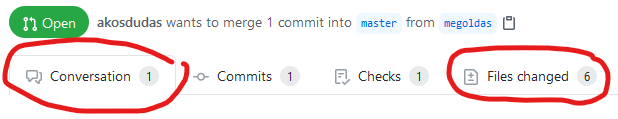
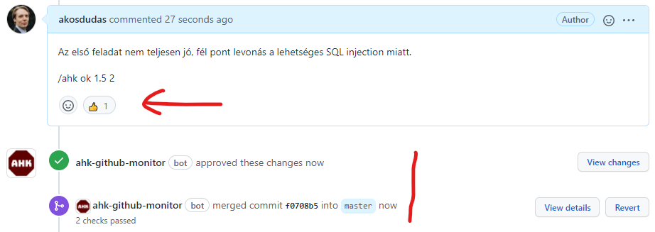

# Mobil Laborvezetőknek

Oktatói tudnivalók gyűjteménye.  
Bármi kérdés esetén keressétek Ekler Pétert (<ekler.peter@vik.bme.hu>), Pomázi Krisztiánt (<pomazi.krisztian@vik.bme.hu>) vagy Gazdi Lászlót (<gazdi.laszlo@vik.bme.hu>).
___

## Laborok

A tárgy alapképzés (BSc) 5. félévében kötelező tárgy. Ezt azt jelenti, hogy a hallgatók szoftverfejlesztési alapismeretekkel rendelkeznek, mivel a megelőző félévben teljesítették a _Szoftvertechnikák_ c. tárgyat. A tárgyunk célja a mobil tudás alapszintű ismereteinek megismerése és gyakorlása. A laborok során új technológiákkal foglalkozunk.

## Oktatás módja

A laborokon elvárt a részvétel, de ezt is be lehet fejezni otthon. Minden laboron általában a jó szintig vezetett, ezen felül önálló munkát várunk el, és az elvégzett munka osztályzásra kerül. A laborok anyaga jelöli, mi a közös munka. A laborvezető segít elindulni a feladatokkal, átbeszélve a közös feladatokat, majd a hallgatók utána önállóan dolgoznak. Mivel a labor feladatok megoldására jegyet adunk, elvárjuk a hallgatótól az önálló munkavégzést.

A laborokat mindig érdemes otthon előtte kipróbálni, aki bizonytalan az a laborterembe is be tud menni. A tanszéki adminisztrációtól vagy Kardos Gergőtől (Kardos.Gergely@aut.bme.hu) lehet megkérdezni, hogy melyik labor mikor szabad gyakorlásra.
Labor soha nem maradhat el azért, mert a laborvezető elkésik/nem megy, ha valami közbejön és előre látható, legalább előtte egy héttel írj erre a Teams-en és kérj cserét.

## Adminisztratív tudnivalók

- A személyes laborokat óra 15-kor kezdjük pontosan és a 2*45 percet egyben, szünet nélkül tartjuk. A késő hallgatókat első alkalommal figyelmeztessük. Ha többször előfordul vagy zavaróan sokat késik (>5 perc), akkor küldjétek el (TVSZ erre jogot ad!).
- A laborok elején Moodle teszt formájában beugró vagy kisZH íratandó, aminek a tisztaságát felügyelni kell. Nem használható segédanyag, és önálló munka az elvárt.
- A labor teljesítésének adminisztrálása Moodle-ben történik. Személyes labor esetén a teljesítés a laboron való megjelenést, és a munka veletek történő elvégzését jelenti, majd a végső munka beadását. Tehát személyes labor esetén a hallgató nem sétálhat ki a labor közepén és nem foglalkozhat mással, csak a laborral. Eseti problémákat azért kezeljünk le, pl. ZH-ja van máshol, stb. Egy-egy kivétel belefér. A beugró/kisZH egyben jelenlét is, viszont ellenőrizni kell, hogy ne legyen olyan hallgató, aki távolról írta meg a Moodle tesztet.
- Ha az órán több ember jelenne meg, mint ahány gép van (hiányzás pótlása pl.), vagy egy gép nem működik, akkor akinek nem jut hely, leül valaki mellé.
- A csoportok között nincs ad-hoc átjárás. Ha valaki jelzi, hogy nem tud részt venni egy laboron, akkor előre/utólag/ugyanazon a héten egy másik csoportban pótolhat (ha van rá mód). Ennek a megszervezését alapvetően a hallgató bonyolítsa (nézze meg, mikor van még labor azonos anyagból, és egyeztessen a tárgyfelelőssel, vagy a laborvezetőkkel), de segítsük, ha kell.

## Bejutás a terembe
* Q épület (QB237, QB115): Kártyával lehet bejutni, a tanszéki adminisztráción (QB207) tudnak segíteni.
* I épület (IL206, IL207, IL208): Kulcsot kell felvenni a tanszéki adminisztráción (QB207), illetve a folyosóhoz kártya szükséges.   

Labor után kulcsot vigyük vissza az adminba.

## Gépek elindítása:
* A falon van egy kulcsos kapcsoló, azt a lefele mutató nyíl állásba kell állítani. Ha van alatta kapcsoló KI/BE felirattal, szükséges lehet a BE gomb megnyomása.
* Írjuk fel a táblára a belépési adatokat. (E-mailben küldjük ki nektek.)

## Labor menete

### Beugró/kisZH
A labor mindig vagy beugróval, vagy kisZH-val kezdődik. A kisZH kiváltja a beugrót. Mindkettőt a Moodle felületén írják meg.  
Beugrón a maximum 2 pontból 1 szükséges a sikerességhez. 5 perc van rá, ez be van állítva a Moodle-ben. Ha mindenki végzett, hamarabb is el lehet kezdeni a labort.  
KisZH-n a maximum 10 pontból 4 szükséges a sikerességhez. 10 perc van rá, ez be van állítva a Moodle-ben. Ha mindenki végzett, hamarabb is el lehet kezdeni a labort.  
A Beugró vagy KisZH után tartsunk egy névsorolvasást, hogy elkerüljük az esetleges távolról kitöltőket/csalókat.
Az első héten nincs beugró.

### Github Classroom
A 2022 őszi félévtől a laboranyagok a Github Classromon érhetőek el.
Az ezzel kapcsolatos információk [itt](https://viauac00.github.io/laborok/) olvashatók.
Ha hibát, elgépelést találsz benne, arra kérünk, hogy javítsd: minden anyag jobb felső sarkában van egy kis ceruza ikon, javítsd a hibát, és küldj PR-t.

### Labormunka
A labor általában vezetett és önálló részből áll. Az elején érdemes pár percben elmondani mi lesz a labor témája, megmutatni mi fog a végére elkészülni.  
A vezetett részt üljék végig a hallgatók, utána ha nagyon akar valaki, bemutathatja és elmehet.  
Laborokról sokszor kapunk olyan visszajelzést, hogy sok a copy-paste, kérjük mindig copy-paste után magyarázzátok el a kódot, illetve érdemes szóban mondani ennek okát, hogy mi jót akarunk hogy a végén egy komplexebb app álljon elő. Ha mindent csak begépelnénk akkor alig jutna idő bármit is kipróbálni. Persze ha ez ügyben van bármi ötlet akkor írjatok nekünk nyugodtan.  
Az első laboron markdown-t, a többi laboron néhány screenshotot és a forráskódot kell felpusholni a repository-ba. 

## Labor bezárása:
* Minden ablakot csukjunk be és székek se legyenek össze-vissza, kérjük meg a hallgatókat a „rendrakásra”. Töröljük le a táblát.
* Várjuk meg, amíg kikapcsolás után leáll a projektor ventiláltora, majd ha van külön gomb a projektor áramforrásának lekapcsolására, azt kapcsoljuk le.
* Miután meggyőződtünk róla, hogy minden gép leállt, nyomjuk meg a KI kapcsolót(ha van a teremben), majd a fali kulcsos kapcsolót állítsuk középső állásba.

## Laborok értékelése

A laborok megoldását adott határidőig kell beadni GitHub-on. Ennek pontos menete a hallgató szemszögéből [itt](../github/GitHub.md) elolvasható.

Ahhoz, hogy hozzáférj a GitHub-on a beadott megoldásokhoz (és ahhoz, hogy a hallgatók ezt hozzád tudják rendelni), kell egy GitHub account. A GitHub nevedet írd meg a tárgyfelelősnek, és felvesz GitHub-on a <https://www.github.com/viauac00> organization-be.

### Mikor kell értékelni a labort?

A laborokat a határidő lejárta után kell értékelni. A határidő előtt a megoldásokra nem kell ránézni, kivéve, ha ezt a hallgató kéri. Kérdéssel a hallgató direktben kell megkeressen (pl. emailben vagy [GitHub-on](../github/GitHub.md#kapott-eredmennyel-kapcsolatban-kerdes-vagy-reklamacio)).

### Hol kell értékelni a labort?

A határidő lejárta után a feladatod a **hozzád rendelt** pull request-ek értékelése. A hallgató azzal adja be a labort, hogy a pull request-et a laborvezetőjéhez rendeli. Ezeket a GitHub keresőjével a legegyszerűbb megtalálni: <https://github.com/pulls?q=is%3Aopen+is%3Apr+org%3Abmeviauac01+assignee%3A%40me+>.

Alternatívaként a GitHub értesítő felületét is lehet használni a <https://github.com/notifications> címen, itt minden hozzád rendelt, vagy review-ra váró PR megjelenik.

### Hogyan kell értékelni a labort?

A PR-eket egyesével kell megnyitni, és meg kell nézni a PR komment felületén az eredményt. Itt látható lesz a lefuttatott értékelés eredménye, valamint a képernyőképek. Emellett meg kell nézni a forráskódot is.

Automatikus értékelés esetén (ami nem minden labornál van) a forráskódot nem szükséges betűről betűre megnézni - a részletes ellenőrzést elvégzi az automata. A laborvezető feladata a képernyőképek ellenőrzése, valamint annak eldöntése, hogy a forráskód konzisztens-e a kapott eredménnyel, és nincs-e benne olyan kódrészlet, amely ugyan működik, de kifejezetten rosszul oldja meg a problémát. Amely labornál nincs automata értékelés, ott több munka hárul a laborvezetőre, alaposabban meg kell nézni a megoldást.

Az értékelés végeztével:

- Ha az automata értékelés helyénvaló volt, akkor le kell zárni a PR-t a `/ahk ok` parancs beírásával egy kommentbe. Ennek hatására a PR jóváhagyásra kerül és merge-elve lesz.
- Ha az automata értékelést felülbírálod pontszámban, akkor a `/ahk ok 5 2` parancsot kell kiadni, ahol is az első szám az összes nem iMSc feladatra kapott pontszám **összege**, a második szám pedig az iMsc feladatra kapott pontszám. Az utóbbi szám elhagyható, ha nincs megoldva az iMsc feladat.
- Ha nincs automata értékelés, akkor az előbbi szintaktika szerint ki kell adni a `/ahk ok 5 2` parancsot a megfelelő pontszámokkal.
- Ha a beadott megoldás nem fogadható el (határidőn túl érkezett, a képek nem támasztják alá a megoldást, a forráskód elfogadhatatlan, stb.), akkor ki **kell** adni a `/ahk ok 0 0` parancsot. Ezzel fogjuk rögzíteni, hogy az automata értékelő által adott pontszámokat felülírjuk.

A fenti parancs egy kommentben tetszőleges helyen szerepelhet, amennyiben egy sorban csak ez a parancs szerepel. Írhatunk tehát a hallgatónak megjegyzést, majd utolsó sorba írjuk ezt a parancsot. Érdemes a hallgatónak legalább egy mondatot írni, hogy lássa, elfogadtuk a megoldást. Ha még sincs megjegyzésünk a hallgató felé, akkor csak egysoros komment kell ezzel a paranccsal.

A parancs többször is kiadható, tehát elrontott pontszámot lehet javítani az újbóli kiadással.

A parancs hatását látjuk is utána PR-ben:

- a kommentre a parancs felismerésének megerősítésére érkezik egy reakció,
- a PR változtatásai jóváhagyásra kerülnek (ez szükséges a mergeléshez a protected branch miatt),
- a a PR mergelésre kerül - ezzel lezárt állapotba kerül a PR és így eltűnik a teendők listájáról,
- és végül elmentésre kerül az eredmény a háttérben - ezt már közvetlenül nem látjuk.

### Pontlevonások és szankciók

| Issue                                                                                | Pontozás                                                      |
|--------------------------------------------------------------------------------------|---------------------------------------------------------------|
| Határidő után leadva                                                                 | 0 pont az egészre                                             |
| Határidő előtt elkészült (commitokból látszik), de elfelejtette assignolni           | 1 pont levonás                                                |
| Határidő előtt elkészült (commitokból látszik), de elfelejtette pusholni/PR-t nyitni | 1 pont levonás                                                |
| Megengedett 5 kiértékelés túllépése                                                  | 1 pont levonás                                                |
| Bukott beugró                                                                        | 0 pont az egészre                                             |
| Kívülről írt beugró                                                                  | 0 pont az egészre, Krisztiánnak írni fegyelmi eljárás ügyében |

### Problémák és megoldásuk

**Nem futott le az automata értékelés.**

- Lehet, hogy a hallgató _draft_ módban hagyta a PR-t, ezt vissza kell állítani. A PR alján megjelenik ilyenkor egy _Ready for review_ gomb.
- Ha sikertelen volt a kiértékelés, meg lehet ismételni. Ez segít a tranziens hibákon (ritka eset). Ehhez tegyél egy _eval_ nevű labelt-t a PR-re (új label-ként kell létrehozni).

**Hiba van a kiértékelő alkalmazásban.** Előfordulhat. Keresd a tárgyfelelőst, vagy javítsd a hibát (a kiértékelő programok itt vannak: **TBD**).

___

## NagyHF
A félév során két feladatuk van a hallgatóknak a nagyházival kapcsolatban: a specifikáció és a kész projekt beadása.

### Specifikáció értékelési szempontok

A specifikáció GO/NOGO értékelésű, szöveges megjegyzésben jelezhetjük, ha túl nagyot vállalt a hallgató, vagy találtunk benne valami kifogásolnivalót, vagy nagyon szép doksit adott le, stb..

### NagyHF értékelési szempontok

Maximum 15 pont szerezhető.  
- specifikáció szerinti, logikusan elvárt működés, (3 pont)  
- mennyire történt törekvés a jó funkcionalitás megvalósítására és nem csak a funkció látszat kivitelezése volt-e a cél, (2 pont)  
- igényesen kivitelezett felhasználói felület (stílusok, témák), (2 pont)  
- megfelelő hibakezelés, (2 pont)  
- hatékony működés (nincsenek felesleges ciklusok, számítások, újrarajzolások), (2 pont)  
- hibamentes futás, (2 pont)  
- erőforrások használata, szövegek erőforrásba szervezése. (2 pont)  

A NagyHF-t nem kell dokumentálni, csak a projektet kell a portálra feltölteni.

NagyHF-n 10 IMSC pont szerezhető:  
- extra funkciók, (4 pont)  
- igényes, látványos felület  (3 pont)  
- kódminőség (tiszta kód követése, rövid osztályok, függvények, stb.). (3 pont)  
- Rövid dokumentáció feltöltése a ZIP-ben az IMSC-s részhez tartozó megoldásról és indoklása/bemutatása a fent felsorolt extra elemeknek (kötelező).  

### NagyHF pontozási módszer

A hallgatók a házi feladatot a laborokhoz hasonlóan GitHub Classroom-on keresztül adják be, azonban itt egy PR helyett, az egyes fázisoknál külön-külön PR-t nyitnak. Az AHK bot azonban repóhoz van kötve, nem PR-hez, ezért a 2-3 kölün PR értékelése felül írja egymást. Ez alapvetően nem probléma, ha konzekvensen használjuk:

A házi pontozásánál ugyanúgy a `/ahk ok` parancsot kell kiadni, de ezúttal több paraméterrel: `/ahk ok <spec GO/NOGO - 0/1> <hf sima pontszám - 0-15> <hf sima imsc pontszám - 0-10> <póthf pontszám - 0-15> <póthf imsc pontszám - 0-10>`
Tehát a különböző fázisokban:
- specifikáció (spec branch): 
	- `/ahk ok 0` ha nem fogadod el
	- `/ahk ok 1` ha elfogadod.
- normál házi (hf branch): 
	- `/ahk ok 0 0 0` ha már a specifikáció sem volt rendben.
	- `/ahk ok 1 13 0` ha a specifikációt rendesen leadta, 13 pont a házija. 
	- `/ahk ok 1 15 10` ha a specifikációt rendesen leadta, 15 pontos a házija és kap még 10 iMSc pontot.
- pót házi (pothf branch): 
	- `/ahk ok 0 0 0 0 0` ha már a specifikáció sem volt rendben.
	- `/ahk ok 1 0 0 12 0` ha a specifikációt rendesen leadta, 12 pont a pót házija. 
	- `/ahk ok 1 0 0 14 5` ha a specifikációt rendesen leadta, 14 pontos a házija és kap még 5 iMSc pontot.
	- `/ahk ok 1 8 0 14 4` ha a specifikációt rendesen leadta, 8 pontot kapott eredetileg a házira iMSc pont nélkül, de javított a pótláson 14 pontra, és kapott még 4 iMSc pontot. 

### Android és MobWeb közös házi feladat
Ha valaki a MobWebet és az Androidalapú szoftverfejlesztést is hallgatná a félévben, és felmerülne benne, hogy lehet-e közös házit csinálni:  
-Lehet, de ezt mindenképpen egyeztesse mindkét laborvezetőjével.  
- Ugyanazt a házit csak úgy adhatja le mindkét tárgyon, ha kicsit felülteljesíti a nehezebb követelményeket (vagyis az Androidalapú szf-t)  
- Tehát az Androidalapú szoftverfejlesztés követelményei szerint nem 5, hanem 6-7 technológiát kell használnia, ezt a komplexitásából majd a labvezek eldöntik.  

